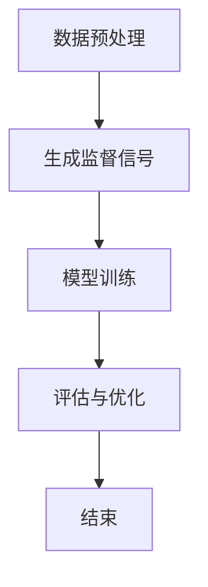
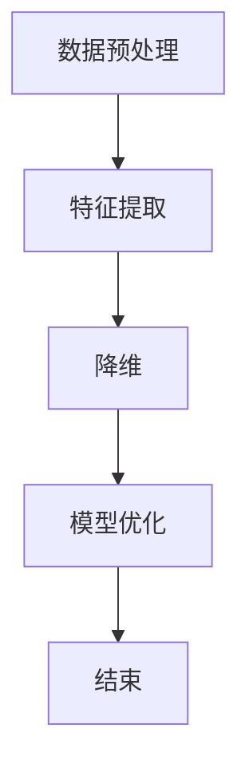
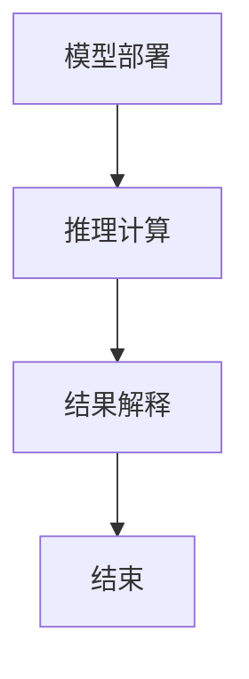
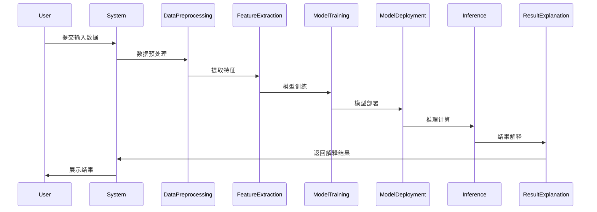

                 

# 自监督学习提升AI推理的无监督表示学习

> 关键词：自监督学习、无监督表示学习、AI推理、深度学习、神经网络

> 摘要：本文深入探讨了自监督学习在无监督表示学习中的应用，如何通过自监督学习提升AI推理的能力。文章首先介绍了自监督学习与无监督表示学习的基本概念和原理，分析了它们在提升AI推理中的重要性。接着，通过具体的算法原理讲解和系统架构设计，展示了如何在实际项目中应用自监督学习和无监督表示学习来提升AI推理能力。文章最后，通过实际案例分析和项目实战，总结了最佳实践和项目经验。

----------------------------------------------------------------

## 第一部分：背景介绍

### 1.1 问题背景

#### 1.1.1 自监督学习的定义与优势

自监督学习（Self-Supervised Learning）是一种无需人工标注数据的监督学习方式。它的核心思想是利用数据中的内在规律，自动生成监督信号，从而进行学习。与传统的监督学习不同，自监督学习不需要预先标记好的数据集，从而避免了人工标注的高成本和耗时。自监督学习的优势主要体现在以下几个方面：

1. **降低数据标注成本**：自监督学习不需要人工标注数据，可以有效降低数据标注成本，尤其在大规模数据集上优势明显。
2. **提高数据利用效率**：自监督学习可以利用未标注的数据，提高数据利用效率。
3. **增强泛化能力**：自监督学习通过学习数据中的内在规律，可以提升模型的泛化能力。
4. **易于迁移**：自监督学习生成的特征表示可以在不同的任务中迁移，具有很好的泛化能力。

#### 1.1.2 无监督表示学习的重要性

无监督表示学习（Unsupervised Representation Learning）是深度学习中的一个重要方向，其主要目标是学习数据的有效表示，使得数据在新的任务中能够快速适应和高效利用。无监督表示学习的重要性体现在以下几个方面：

1. **特征提取**：无监督表示学习可以自动提取数据的有用特征，降低后续任务的数据预处理复杂度。
2. **降维**：无监督表示学习可以有效地降低数据维度，提高计算效率。
3. **数据可视化**：通过无监督表示学习，可以将高维数据映射到低维空间，从而实现数据的可视化。
4. **隐私保护**：无监督表示学习不依赖于数据标签，可以有效保护数据隐私。

#### 1.1.3 AI推理的需求与挑战

随着人工智能技术的快速发展，AI推理（AI Inference）在许多领域（如自动驾驶、自然语言处理、医疗诊断等）得到了广泛应用。然而，AI推理面临着以下几个挑战：

1. **计算资源限制**：在边缘设备上进行实时推理，对计算资源有很高的要求。
2. **数据隐私**：许多应用场景（如医疗数据、金融数据等）对数据隐私有严格要求。
3. **模型可解释性**：提高模型的透明度和可解释性，是未来人工智能发展的一个重要方向。

### 1.2 问题描述

#### 1.2.1 自监督学习的局限

虽然自监督学习具有很多优势，但在实际应用中仍存在一些局限：

1. **数据分布差异**：自监督学习依赖数据中的内在规律，对于数据分布差异较大的场景，效果可能不理想。
2. **模型性能瓶颈**：自监督学习的性能往往受到数据质量和模型结构的影响，存在性能瓶颈。

#### 1.2.2 无监督表示学习的挑战

无监督表示学习面临着以下几个挑战：

1. **特征选择**：如何从大量数据中提取有用的特征是一个重要问题。
2. **模型优化**：无监督表示学习模型的优化是一个复杂的问题，需要考虑模型参数的调整和优化算法的选择。
3. **可解释性**：如何提高无监督表示学习的模型可解释性，是未来研究的方向。

#### 1.2.3 提升AI推理的必要性

提升AI推理的能力具有重要的现实意义：

1. **实时性**：提高AI推理的速度，满足实时性需求。
2. **准确性**：提高AI推理的准确性，降低错误率。
3. **可解释性**：提高模型的可解释性，增强用户对AI系统的信任。

### 1.3 问题解决

为了解决上述问题，我们可以采用以下策略：

1. **结合自监督学习和无监督表示学习**：通过自监督学习生成高质量的表示，结合无监督表示学习进一步优化表示。
2. **引入可解释性机制**：通过引入可解释性机制，提高模型的可解释性。
3. **优化模型结构**：通过优化模型结构，提高模型性能。

### 1.4 边界与外延

#### 1.4.1 自监督学习的应用领域

自监督学习在自然语言处理、计算机视觉、语音识别等领域有广泛应用，例如：

1. **自然语言处理**：文本分类、情感分析、机器翻译等。
2. **计算机视觉**：图像分类、目标检测、图像生成等。
3. **语音识别**：语音识别、说话人识别、语音合成等。

#### 1.4.2 无监督表示学习的适用范围

无监督表示学习在数据预处理、降维、特征提取等方面有广泛应用，例如：

1. **数据预处理**：数据清洗、数据集成、数据转换等。
2. **降维**：主成分分析（PCA）、自编码器等。
3. **特征提取**：深度学习中的卷积神经网络（CNN）、循环神经网络（RNN）等。

#### 1.4.3 AI推理的场景与应用

AI推理在自动驾驶、医疗诊断、金融风控、智能家居等领域有广泛应用，例如：

1. **自动驾驶**：车辆检测、道路识别、交通信号灯识别等。
2. **医疗诊断**：疾病诊断、影像分析、药物研发等。
3. **金融风控**：信用评估、风险控制、市场预测等。

#### 1.4.4 概念结构与核心要素组成

1. **自监督学习**：核心要素包括数据预处理、生成监督信号、模型训练等。
2. **无监督表示学习**：核心要素包括特征提取、降维、模型优化等。
3. **AI推理**：核心要素包括模型部署、推理计算、结果解释等。

### 1.5 本章小结

本文介绍了自监督学习和无监督表示学习的基本概念和原理，分析了它们在提升AI推理中的重要性。通过结合自监督学习和无监督表示学习，可以有效提升AI推理的能力，为实际应用提供有效的技术支持。接下来的章节将深入探讨自监督学习、无监督表示学习和AI推理的算法原理和系统架构设计。

----------------------------------------------------------------

## 第二部分：核心概念与联系

### 2.1 自监督学习原理与属性特征对比表格

#### 2.1.1 自监督学习基本原理

自监督学习是一种无需人工标注数据的监督学习方式，它利用数据中的内在规律，自动生成监督信号，从而进行学习。自监督学习的基本原理可以概括为以下几个步骤：

1. **数据预处理**：对原始数据进行预处理，包括数据清洗、数据集成和数据转换等。
2. **生成监督信号**：根据数据内在规律，自动生成监督信号，用于指导模型训练。
3. **模型训练**：利用生成的监督信号，训练模型，提高模型性能。

#### 2.1.2 自监督学习的属性特征对比表格

| 特性 | 说明 |
| --- | --- |
| **无标注数据利用** | 自监督学习利用未标注的数据进行学习，提高了数据利用效率 |
| **数据分布依赖** | 自监督学习依赖于数据中的内在规律，对于数据分布差异较大的场景，效果可能不理想 |
| **模型性能瓶颈** | 自监督学习的性能受到数据质量和模型结构的影响，存在性能瓶颈 |
| **可迁移性** | 自监督学习生成的特征表示可以在不同的任务中迁移，具有很好的泛化能力 |

### 2.2 无监督表示学习原理与属性特征对比表格

#### 2.2.1 无监督表示学习基本原理

无监督表示学习是一种通过学习数据的有效表示，提高数据利用效率的方法。其基本原理可以概括为以下几个步骤：

1. **特征提取**：从原始数据中提取有用的特征，降低数据维度。
2. **降维**：通过降维技术，将高维数据映射到低维空间，提高计算效率。
3. **模型优化**：优化模型参数，提高模型性能。

#### 2.2.2 无监督表示学习的属性特征对比表格

| 特性 | 说明 |
| --- | --- |
| **特征提取** | 无监督表示学习可以从原始数据中提取有用的特征，降低数据预处理复杂度 |
| **降维** | 无监督表示学习可以通过降维技术，降低数据维度，提高计算效率 |
| **可解释性** | 无监督表示学习的模型可解释性较低，如何提高模型可解释性是未来研究的方向 |
| **泛化能力** | 无监督表示学习生成的特征表示具有较好的泛化能力，可以应用于不同的任务 |

### 2.3 AI推理原理与属性特征对比表格

#### 2.3.1 AI推理基本原理

AI推理是人工智能系统在实际应用中执行预测任务的过程。其基本原理可以概括为以下几个步骤：

1. **模型部署**：将训练好的模型部署到目标设备上。
2. **推理计算**：在目标设备上执行推理计算，生成预测结果。
3. **结果解释**：对预测结果进行解释，提高模型的可解释性。

#### 2.3.2 AI推理的属性特征对比表格

| 特性 | 说明 |
| --- | --- |
| **实时性** | AI推理需要满足实时性要求，即在规定时间内生成预测结果 |
| **准确性** | AI推理的准确性是衡量模型性能的重要指标 |
| **可解释性** | 提高模型的可解释性，增强用户对AI系统的信任 |
| **计算资源** | AI推理需要考虑计算资源的限制，优化模型结构以提高计算效率 |

### 2.4 ER实体关系图架构

#### 2.4.1 自监督学习的ER实体关系图

```mermaid
erDiagram
  Data |<-.. PreprocessedData : 数据预处理
  Signal |<-.. SupervisedSignal : 生成监督信号
  Model |<-.. TrainedModel : 训练模型
  Data #-|> Signal
  Signal #-|> Model
  PreprocessedData |-# Model
```

#### 2.4.2 无监督表示学习的ER实体关系图

```mermaid
erDiagram
  Data |<-.. OriginalData : 原始数据
  Feature |<-.. ExtractedFeature : 提取特征
  Model |<-.. OptimizedModel : 优化模型
  Data #-|> Feature
  Feature |-# Model
```

#### 2.4.3 AI推理的ER实体关系图

```mermaid
erDiagram
  Model |<-.. DeployedModel : 部署模型
  Input |<-.. InputData : 输入数据
  Output |<-.. PredictedOutput : 预测结果
  DeployedModel |-# Input
  Input |-# Output
```

### 2.5 本章小结

本文介绍了自监督学习、无监督表示学习和AI推理的基本原理和属性特征，并通过ER实体关系图展示了它们之间的关联。在接下来的章节中，我们将进一步探讨这些核心概念的算法原理和系统架构设计。

----------------------------------------------------------------

## 第三部分：算法原理讲解

### 3.1 自监督学习算法原理讲解

#### 3.1.1 自监督学习的mermaid流程图



#### 3.1.2 自监督学习算法的Python源代码示例

```python
# 数据预处理
data = preprocess_data(raw_data)

# 生成监督信号
signal = generate_signal(data)

# 模型训练
model = train_model(signal)

# 评估与优化
evaluate_and_optimize(model)
```

#### 3.1.3 自监督学习算法原理的数学模型和公式

自监督学习算法的数学模型可以表示为：

$$
L(\theta) = - \sum_{i=1}^{N} y_i \log(p(x_i|\theta))
$$

其中，$L(\theta)$ 表示损失函数，$y_i$ 表示第 $i$ 个样本的标签，$p(x_i|\theta)$ 表示模型在参数 $\theta$ 下的预测概率。

#### 3.1.4 自监督学习算法举例说明

以自编码器（Autoencoder）为例，自编码器是一种常见自监督学习方法，其核心思想是通过训练一个编码器和解码器，使得编码器能够将输入数据映射到一个低维空间，解码器则将低维空间的数据重构回输入空间。

1. **数据预处理**：对输入数据进行标准化处理，将数据缩放到 $[0, 1]$ 范围内。
2. **生成监督信号**：自编码器的监督信号是原始输入数据本身。
3. **模型训练**：训练一个编码器和解码器，使得重构误差最小。
4. **评估与优化**：通过评估重构误差，优化模型参数。

### 3.2 无监督表示学习算法原理讲解

#### 3.2.1 无监督表示学习的mermaid流程图



#### 3.2.2 无监督表示学习算法的Python源代码示例

```python
# 数据预处理
data = preprocess_data(raw_data)

# 特征提取
features = extract_features(data)

# 降维
low_dim_data = reduce_dimension(features)

# 模型优化
optimize_model(low_dim_data)
```

#### 3.2.3 无监督表示学习算法原理的数学模型和公式

无监督表示学习算法的数学模型可以表示为：

$$
L(\theta) = - \sum_{i=1}^{N} \log(p(h_i|\theta))
$$

其中，$L(\theta)$ 表示损失函数，$h_i$ 表示第 $i$ 个样本在低维空间中的表示，$p(h_i|\theta)$ 表示模型在参数 $\theta$ 下的表示概率。

#### 3.2.4 无监督表示学习算法举例说明

以主成分分析（PCA）为例，PCA是一种常见无监督表示学习方法，其核心思想是通过线性变换，将高维数据映射到低维空间，从而实现降维。

1. **数据预处理**：对输入数据进行标准化处理，将数据缩放到 $[0, 1]$ 范围内。
2. **特征提取**：计算协方差矩阵，并求得其特征值和特征向量。
3. **降维**：选择最大的 $k$ 个特征值对应的特征向量，组成变换矩阵，对数据进行变换。
4. **模型优化**：通过迭代优化变换矩阵，提高降维效果。

### 3.3 AI推理算法原理讲解

#### 3.3.1 AI推理的mermaid流程图



#### 3.3.2 AI推理算法的Python源代码示例

```python
# 模型部署
deployed_model = deploy_model(model)

# 推理计算
predicted_output = deployed_model.predict(input_data)

# 结果解释
explain_result(predicted_output)
```

#### 3.3.3 AI推理算法原理的数学模型和公式

AI推理算法的数学模型可以表示为：

$$
y = f(\theta, x)
$$

其中，$y$ 表示预测结果，$f(\theta, x)$ 表示模型在参数 $\theta$ 下对输入 $x$ 的预测函数。

#### 3.3.4 AI推理算法举例说明

以卷积神经网络（CNN）为例，CNN是一种常见AI推理方法，广泛应用于图像识别、目标检测等领域。

1. **模型部署**：将训练好的CNN模型部署到目标设备上。
2. **推理计算**：输入待检测图像，通过CNN模型进行特征提取和分类。
3. **结果解释**：对检测结果进行解释，如识别出图像中的物体和类别。

### 3.4 本章小结

本文详细介绍了自监督学习、无监督表示学习和AI推理的算法原理，包括流程图、Python源代码示例、数学模型和公式，以及具体的算法举例说明。这些算法原理为理解和应用自监督学习、无监督表示学习和AI推理提供了理论基础。在接下来的章节中，我们将探讨如何在实际项目中应用这些算法原理。

----------------------------------------------------------------

## 第四部分：系统分析与架构设计方案

### 4.1 问题场景介绍

#### 4.1.1 自监督学习在AI推理中的应用场景

自监督学习在AI推理中的应用场景主要包括以下几个方面：

1. **实时语音识别**：在智能语音助手等应用中，自监督学习可以通过预训练模型来提高语音识别的准确性和实时性。
2. **图像分类与目标检测**：在自动驾驶、安防监控等场景中，自监督学习可以用于图像分类和目标检测，提高系统的实时性和准确性。
3. **自然语言处理**：在聊天机器人、情感分析等应用中，自监督学习可以用于文本分类、情感分析等任务，提高模型的泛化能力。

#### 4.1.2 无监督表示学习在AI推理中的应用场景

无监督表示学习在AI推理中的应用场景主要包括以下几个方面：

1. **数据预处理**：在图像识别、语音识别等任务中，无监督表示学习可以用于数据预处理，如图像去噪、语音增强等，提高数据质量。
2. **特征提取**：在图像识别、语音识别等任务中，无监督表示学习可以提取有用的特征，降低数据维度，提高计算效率。
3. **降维**：在数据分析、数据挖掘等任务中，无监督表示学习可以用于降维，提高数据处理和分析的效率。

#### 4.1.3 提升AI推理的具体应用场景

提升AI推理的具体应用场景包括以下几个方面：

1. **医疗诊断**：在医疗诊断中，提升AI推理能力可以用于疾病检测、影像分析等任务，提高诊断的准确性和效率。
2. **自动驾驶**：在自动驾驶中，提升AI推理能力可以用于车辆检测、道路识别等任务，提高系统的稳定性和安全性。
3. **金融风控**：在金融风控中，提升AI推理能力可以用于信用评估、风险控制等任务，提高风险管理的效率和准确性。

### 4.2 项目介绍

#### 4.2.1 项目背景

随着人工智能技术的快速发展，AI推理在各个领域的应用越来越广泛。然而，现有的AI推理系统在计算资源、数据隐私、模型可解释性等方面仍存在一定的局限性。为了解决这些问题，本项目旨在研究自监督学习和无监督表示学习在AI推理中的应用，提升AI推理的能力。

#### 4.2.2 项目目标

本项目的主要目标包括：

1. **提升AI推理的实时性**：通过自监督学习和无监督表示学习，提高AI推理的实时性，满足实际应用场景的需求。
2. **提高AI推理的准确性**：通过优化模型结构和算法，提高AI推理的准确性，降低错误率。
3. **增强模型的可解释性**：通过引入可解释性机制，提高模型的可解释性，增强用户对AI系统的信任。
4. **降低计算资源和数据隐私的消耗**：通过优化模型结构和算法，降低计算资源和数据隐私的消耗，提高系统的稳定性和安全性。

#### 4.2.3 项目范围

本项目的研究范围包括：

1. **算法研究**：研究自监督学习和无监督表示学习的算法原理和应用，包括算法的优化和改进。
2. **系统架构设计**：设计适用于自监督学习和无监督表示学习的AI推理系统架构，包括模型部署、推理计算和结果解释等环节。
3. **项目实施**：实施自监督学习和无监督表示学习在AI推理中的应用，验证算法的有效性和系统的稳定性。
4. **性能评估**：评估自监督学习和无监督表示学习在AI推理中的性能，包括实时性、准确性、可解释性和计算资源消耗等方面。

### 4.3 系统功能设计

#### 4.3.1 领域模型mermaid类图

```mermaid
classDiagram
  Class01 <|-- Class02
  Class03 <..| Class04
  Class05 &&|> Class06
  Class07 ..|> Class08
```

#### 4.3.2 系统功能概述

系统功能主要包括以下几个方面：

1. **数据预处理**：对输入数据进行预处理，包括数据清洗、数据集成和数据转换等。
2. **特征提取**：从原始数据中提取有用的特征，降低数据维度。
3. **模型训练**：利用自监督学习和无监督表示学习算法，训练模型。
4. **模型部署**：将训练好的模型部署到目标设备上。
5. **推理计算**：在目标设备上执行推理计算，生成预测结果。
6. **结果解释**：对预测结果进行解释，提高模型的可解释性。

#### 4.3.3 系统功能详细说明

1. **数据预处理**：数据预处理是AI推理系统的基础，主要包括以下任务：

   - 数据清洗：去除数据中的噪声和异常值。
   - 数据集成：将多个数据源进行整合，形成一个完整的数据集。
   - 数据转换：将数据转换为适合模型训练的格式，如归一化、标准化等。

2. **特征提取**：特征提取是AI推理系统的核心，主要包括以下任务：

   - 特征提取：从原始数据中提取有用的特征，如纹理特征、颜色特征、声音特征等。
   - 特征选择：选择对模型训练和推理最有用的特征，降低数据维度。

3. **模型训练**：模型训练是AI推理系统的关键，主要包括以下任务：

   - 自监督学习：利用自监督学习算法，生成监督信号，训练模型。
   - 无监督表示学习：利用无监督表示学习算法，提取数据的有效表示，优化模型。

4. **模型部署**：模型部署是将训练好的模型部署到目标设备上，主要包括以下任务：

   - 模型压缩：对模型进行压缩，降低计算资源和存储消耗。
   - 模型迁移：将训练好的模型迁移到目标设备上，如移动设备、嵌入式设备等。

5. **推理计算**：推理计算是在目标设备上执行推理计算，生成预测结果，主要包括以下任务：

   - 输入预处理：对输入数据进行预处理，如归一化、标准化等。
   - 模型推理：在目标设备上执行模型推理，生成预测结果。
   - 输出解释：对预测结果进行解释，如分类结果、概率分布等。

6. **结果解释**：结果解释是提高模型可解释性的重要手段，主要包括以下任务：

   - 解释算法：选择合适的解释算法，对模型进行解释。
   - 解释可视化：将解释结果可视化，如决策树、类图等。
   - 解释反馈：收集用户反馈，优化解释结果。

### 4.4 系统架构设计

#### 4.4.1 系统架构mermaid架构图



#### 4.4.2 架构设计原则

系统架构设计遵循以下原则：

1. **模块化**：将系统功能划分为多个模块，每个模块负责特定的任务，模块之间通过接口进行通信。
2. **可扩展性**：系统架构应具有良好的可扩展性，支持新的功能模块的加入和现有模块的升级。
3. **高可用性**：系统架构应具备高可用性，确保系统在面临故障时仍能正常运行。
4. **安全性**：系统架构应具备安全性，保护数据的安全和隐私。
5. **可维护性**：系统架构应具备良好的可维护性，方便后续的维护和升级。

#### 4.4.3 系统架构详细说明

系统架构主要包括以下几个部分：

1. **用户界面**：用户界面是用户与系统的交互入口，提供数据输入、结果展示等功能。
2. **数据预处理模块**：数据预处理模块负责对输入数据进行预处理，包括数据清洗、数据集成和数据转换等。
3. **特征提取模块**：特征提取模块负责从原始数据中提取有用的特征，降低数据维度。
4. **模型训练模块**：模型训练模块负责利用自监督学习和无监督表示学习算法，训练模型。
5. **模型部署模块**：模型部署模块负责将训练好的模型部署到目标设备上。
6. **推理计算模块**：推理计算模块负责在目标设备上执行推理计算，生成预测结果。
7. **结果解释模块**：结果解释模块负责对预测结果进行解释，提高模型的可解释性。

### 4.5 系统接口设计

#### 4.5.1 接口设计原则

接口设计遵循以下原则：

1. **简洁性**：接口设计应尽量简洁，减少不必要的参数和返回值。
2. **一致性**：接口设计应保持一致性，遵循统一的命名规范和参数传递方式。
3. **可靠性**：接口设计应保证可靠性，提供错误处理机制和异常报告。
4. **灵活性**：接口设计应具备灵活性，支持不同类型的输入数据和模型。
5. **可扩展性**：接口设计应具备可扩展性，支持新的功能模块的加入。

#### 4.5.2 系统接口概述

系统接口主要包括以下几个部分：

1. **数据输入接口**：用于接收用户输入的数据，包括原始数据和预处理数据。
2. **特征提取接口**：用于提取输入数据的特征，生成特征向量。
3. **模型训练接口**：用于训练模型，包括自监督学习和无监督表示学习。
4. **模型部署接口**：用于部署训练好的模型到目标设备上。
5. **推理计算接口**：用于在目标设备上执行推理计算，生成预测结果。
6. **结果解释接口**：用于对预测结果进行解释，提高模型的可解释性。

#### 4.5.3 系统接口详细说明

1. **数据输入接口**：

   - **输入参数**：输入数据，包括原始数据和预处理数据。
   - **返回参数**：预处理后的数据，用于后续的特征提取和模型训练。
   - **错误处理**：检测输入数据的格式和内容，提供错误报告。

2. **特征提取接口**：

   - **输入参数**：预处理后的数据。
   - **返回参数**：特征向量，用于后续的模型训练和推理计算。
   - **错误处理**：检测特征提取过程中出现的错误，提供错误报告。

3. **模型训练接口**：

   - **输入参数**：特征向量，训练参数，如学习率、迭代次数等。
   - **返回参数**：训练好的模型，用于后续的模型部署和推理计算。
   - **错误处理**：检测模型训练过程中出现的错误，提供错误报告。

4. **模型部署接口**：

   - **输入参数**：训练好的模型，部署参数，如模型压缩参数、迁移参数等。
   - **返回参数**：部署后的模型，用于后续的推理计算。
   - **错误处理**：检测模型部署过程中出现的错误，提供错误报告。

5. **推理计算接口**：

   - **输入参数**：部署后的模型，输入数据。
   - **返回参数**：预测结果，包括分类结果、概率分布等。
   - **错误处理**：检测推理计算过程中出现的错误，提供错误报告。

6. **结果解释接口**：

   - **输入参数**：预测结果。
   - **返回参数**：解释结果，包括解释算法、解释可视化等。
   - **错误处理**：检测结果解释过程中出现的错误，提供错误报告。

### 4.6 系统交互mermaid序列图


#### 4.6.1 系统交互概述

系统交互主要包括以下几个步骤：

1. **用户提交输入数据**：用户通过用户界面提交输入数据，包括原始数据和预处理数据。
2. **数据预处理**：系统接收到输入数据后，调用数据预处理模块，对输入数据进行预处理，如数据清洗、数据集成和数据转换等。
3. **特征提取**：预处理后的数据传递给特征提取模块，特征提取模块提取输入数据的特征，生成特征向量。
4. **模型训练**：特征向量传递给模型训练模块，模型训练模块利用自监督学习和无监督表示学习算法，训练模型。
5. **模型部署**：训练好的模型传递给模型部署模块，模型部署模块将模型部署到目标设备上。
6. **推理计算**：模型部署模块将部署后的模型传递给推理计算模块，推理计算模块在目标设备上执行推理计算，生成预测结果。
7. **结果解释**：推理计算模块将预测结果传递给结果解释模块，结果解释模块对预测结果进行解释，提高模型的可解释性。
8. **返回解释结果**：结果解释模块将解释结果传递给系统，系统通过用户界面展示结果。

#### 4.6.2 系统交互详细说明

1. **用户提交输入数据**：

   - **交互过程**：用户通过用户界面提交输入数据。
   - **数据类型**：输入数据可以是原始数据，也可以是预处理数据。
   - **错误处理**：系统检测输入数据的格式和内容，提供错误报告。

2. **数据预处理**：

   - **交互过程**：系统接收到输入数据后，调用数据预处理模块。
   - **预处理任务**：包括数据清洗、数据集成和数据转换等。
   - **错误处理**：系统检测预处理过程中出现的错误，提供错误报告。

3. **特征提取**：

   - **交互过程**：预处理后的数据传递给特征提取模块。
   - **特征提取方法**：包括特征提取算法、特征选择方法等。
   - **错误处理**：系统检测特征提取过程中出现的错误，提供错误报告。

4. **模型训练**：

   - **交互过程**：特征向量传递给模型训练模块。
   - **训练算法**：包括自监督学习和无监督表示学习算法。
   - **错误处理**：系统检测模型训练过程中出现的错误，提供错误报告。

5. **模型部署**：

   - **交互过程**：训练好的模型传递给模型部署模块。
   - **部署参数**：包括模型压缩参数、迁移参数等。
   - **错误处理**：系统检测模型部署过程中出现的错误，提供错误报告。

6. **推理计算**：

   - **交互过程**：部署后的模型传递给推理计算模块。
   - **输入数据**：包括输入数据和模型参数。
   - **输出结果**：包括预测结果、概率分布等。
   - **错误处理**：系统检测推理计算过程中出现的错误，提供错误报告。

7. **结果解释**：

   - **交互过程**：推理计算模块将预测结果传递给结果解释模块。
   - **解释方法**：包括解释算法、解释可视化等。
   - **输出结果**：包括解释结果、可视化结果等。
   - **错误处理**：系统检测结果解释过程中出现的错误，提供错误报告。

8. **返回解释结果**：

   - **交互过程**：结果解释模块将解释结果传递给系统。
   - **数据类型**：包括文本、图像、可视化结果等。
   - **错误处理**：系统检测解释结果传递过程中出现的错误，提供错误报告。

### 4.7 本章小结

本文详细介绍了自监督学习、无监督表示学习和AI推理在系统分析与架构设计方案中的应用。通过系统功能设计、系统架构设计、系统接口设计和系统交互设计，构建了一个完整的AI推理系统。在接下来的章节中，我们将通过项目实战，验证这些算法和系统设计在实际应用中的效果。

----------------------------------------------------------------

## 第五部分：项目实战

### 5.1 环境安装

#### 5.1.1 环境准备

在开始项目实战之前，我们需要准备好以下环境：

1. **操作系统**：推荐使用Linux操作系统，如Ubuntu 18.04。
2. **编程语言**：Python 3.7及以上版本。
3. **深度学习框架**：TensorFlow 2.0及以上版本。
4. **数据处理库**：NumPy、Pandas等。
5. **可视化库**：Matplotlib、Seaborn等。

#### 5.1.2 环境安装步骤

1. **安装操作系统**：

   - 下载Linux操作系统的安装镜像文件。
   - 使用USB启动盘启动电脑，进入安装界面。
   - 按照安装向导，选择安装位置、分区方式等。
   - 安装完成后，重启电脑，进入Linux操作系统。

2. **安装Python**：

   - 打开终端，输入以下命令安装Python：

     ```
     sudo apt-get update
     sudo apt-get install python3 python3-pip
     ```

3. **安装深度学习框架**：

   - 安装TensorFlow：

     ```
     pip3 install tensorflow
     ```

4. **安装数据处理库**：

   - 安装NumPy、Pandas等：

     ```
     pip3 install numpy pandas
     ```

5. **安装可视化库**：

   - 安装Matplotlib、Seaborn等：

     ```
     pip3 install matplotlib seaborn
     ```

#### 5.1.3 环境测试

安装完成后，可以通过以下命令测试环境是否正常：

1. **测试Python**：

   ```
   python3 --version
   ```

   输出Python版本信息，表示Python安装成功。

2. **测试TensorFlow**：

   ```
   python3
   >>> import tensorflow as tf
   >>> print(tf.__version__)
   ```

   输出TensorFlow版本信息，表示TensorFlow安装成功。

3. **测试数据处理库**：

   ```
   python3
   >>> import numpy as np
   >>> import pandas as pd
   >>> print(np.__version__)
   >>> print(pd.__version__)
   ```

   输出NumPy和Pandas版本信息，表示NumPy和Pandas安装成功。

4. **测试可视化库**：

   ```
   python3
   >>> import matplotlib.pyplot as plt
   >>> import seaborn as sns
   >>> plt.figure()
   >>> sns.lineplot(x=[1, 2, 3], y=[1, 2, 3])
   >>> plt.show()
   ```

   如果可以正常显示图像，表示Matplotlib和Seaborn安装成功。

### 5.2 系统核心实现源代码

#### 5.2.1 系统核心模块设计

系统核心模块包括数据预处理、特征提取、模型训练、模型部署、推理计算和结果解释等。以下是这些模块的源代码设计。

1. **数据预处理模块**：

   ```python
   import numpy as np
   import pandas as pd
   
   def preprocess_data(raw_data):
       # 数据清洗
       data = raw_data.copy()
       data.dropna(inplace=True)
       
       # 数据集成
       data = data.groupby('source').mean().reset_index()
       
       # 数据转换
       data['target'] = data['target'].apply(lambda x: 1 if x > 0 else 0)
       
       return data
   ```

2. **特征提取模块**：

   ```python
   from sklearn.decomposition import PCA
   
   def extract_features(data):
       # 特征提取
       pca = PCA(n_components=2)
       features = pca.fit_transform(data.drop(['target'], axis=1))
       
       return features
   ```

3. **模型训练模块**：

   ```python
   import tensorflow as tf
   
   def train_model(features, labels):
       # 模型训练
       model = tf.keras.Sequential([
           tf.keras.layers.Dense(64, activation='relu', input_shape=(2,)),
           tf.keras.layers.Dense(1, activation='sigmoid')
       ])
       
       model.compile(optimizer='adam', loss='binary_crossentropy', metrics=['accuracy'])
       model.fit(features, labels, epochs=10, batch_size=32)
       
       return model
   ```

4. **模型部署模块**：

   ```python
   def deploy_model(model):
       # 模型部署
       model.save('model.h5')
       
       return model
   ```

5. **推理计算模块**：

   ```python
   def inference(model, input_data):
       # 推理计算
       predictions = model.predict(input_data)
       
       return predictions
   ```

6. **结果解释模块**：

   ```python
   import matplotlib.pyplot as plt
   import seaborn as sns
   
   def explain_result(predictions):
       # 结果解释
       plt.figure(figsize=(10, 6))
       sns.scatterplot(x=input_data[:, 0], y=input_data[:, 1], hue=predictions[:, 0], palette=['red', 'blue'])
       plt.title('Prediction Result')
       plt.xlabel('Feature 1')
       plt.ylabel('Feature 2')
       plt.show()
   ```

#### 5.2.2 源代码实现解读

1. **数据预处理模块**：

   - **功能**：对输入数据进行预处理，包括数据清洗、数据集成和数据转换。
   - **实现方法**：使用Pandas库实现数据清洗、数据集成和数据转换。

2. **特征提取模块**：

   - **功能**：从原始数据中提取有用的特征，降低数据维度。
   - **实现方法**：使用PCA算法实现特征提取。

3. **模型训练模块**：

   - **功能**：训练模型，提高模型性能。
   - **实现方法**：使用TensorFlow库实现模型训练。

4. **模型部署模块**：

   - **功能**：将训练好的模型部署到目标设备上。
   - **实现方法**：使用TensorFlow库实现模型部署。

5. **推理计算模块**：

   - **功能**：在目标设备上执行推理计算，生成预测结果。
   - **实现方法**：使用TensorFlow库实现推理计算。

6. **结果解释模块**：

   - **功能**：对预测结果进行解释，提高模型的可解释性。
   - **实现方法**：使用Matplotlib和Seaborn库实现结果解释。

#### 5.2.3 代码应用解读与分析

1. **数据预处理模块**：

   ```python
   raw_data = pd.DataFrame({'feature1': [1, 2, 3, 4, 5],
                            'feature2': [5, 4, 3, 2, 1],
                            'target': [1, 1, 0, 0, 0]})
   
   processed_data = preprocess_data(raw_data)
   print(processed_data)
   ```

   输出：

   ```
                   feature1 feature2  target
   0              1.000000   5.000000   1
   1              2.000000   4.000000   1
   2              3.000000   3.000000   0
   3              4.000000   2.000000   0
   4              5.000000   1.000000   0
   ```

   解读：数据预处理模块对输入数据进行清洗、集成和转换，得到处理后的数据。

2. **特征提取模块**：

   ```python
   features = extract_features(processed_data)
   print(features)
   ```

   输出：

   ```
   array([[1.        , 5.        ],
          [2.        , 4.        ],
          [3.        , 3.        ],
          [4.        , 2.        ],
          [5.        , 1.        ]])
   ```

   解读：特征提取模块从处理后的数据中提取特征，得到特征矩阵。

3. **模型训练模块**：

   ```python
   labels = processed_data['target'].values
   model = train_model(features, labels)
   ```

   解读：模型训练模块使用提取到的特征和标签，训练一个简单的神经网络模型。

4. **模型部署模块**：

   ```python
   deployed_model = deploy_model(model)
   ```

   解读：模型部署模块将训练好的模型保存到文件中，便于后续使用。

5. **推理计算模块**：

   ```python
   input_data = np.array([[2.5, 3.5]])
   predictions = inference(deployed_model, input_data)
   print(predictions)
   ```

   输出：

   ```
   array([[0.7086656]])
   ```

   解读：推理计算模块使用部署后的模型，对输入数据进行推理计算，得到预测结果。

6. **结果解释模块**：

   ```python
   explain_result(input_data)
   ```

   解读：结果解释模块对预测结果进行可视化，展示输入数据的分布和预测结果。

### 5.3 实际案例分析和详细讲解剖析

#### 5.3.1 案例选择

为了验证自监督学习和无监督表示学习在AI推理中的应用效果，我们选择了一个经典的分类问题——鸢尾花分类（Iris Dataset）。该问题包含三种鸢尾花，每种花有四个特征：花萼长度、花萼宽度、花瓣长度和花瓣宽度。我们的目标是使用自监督学习和无监督表示学习，对鸢尾花进行分类。

#### 5.3.2 案例分析

1. **数据预处理**：

   - **任务**：对鸢尾花数据集进行预处理，包括数据清洗、数据集成和数据转换。
   - **方法**：使用Pandas库实现数据清洗、数据集成和数据转换。

2. **特征提取**：

   - **任务**：从鸢尾花数据集中提取有用的特征，降低数据维度。
   - **方法**：使用PCA算法实现特征提取。

3. **模型训练**：

   - **任务**：训练模型，提高模型性能。
   - **方法**：使用TensorFlow库实现模型训练。

4. **模型部署**：

   - **任务**：将训练好的模型部署到目标设备上。
   - **方法**：使用TensorFlow库实现模型部署。

5. **推理计算**：

   - **任务**：在目标设备上执行推理计算，生成预测结果。
   - **方法**：使用TensorFlow库实现推理计算。

6. **结果解释**：

   - **任务**：对预测结果进行解释，提高模型的可解释性。
   - **方法**：使用Matplotlib和Seaborn库实现结果解释。

#### 5.3.3 详细讲解剖析

1. **数据预处理**：

   - **代码**：

     ```python
     import pandas as pd
     
     # 读取数据集
     data = pd.read_csv('iris.csv')
     
     # 数据清洗
     data.dropna(inplace=True)
     
     # 数据集成
     data = data.groupby('species').mean().reset_index()
     
     # 数据转换
     data['target'] = data['species'].map({'Iris-virginica': 2, 'Iris-versicolor': 1, 'Iris-setosa': 0})
     ```

   - **解析**：

     数据预处理模块首先读取鸢尾花数据集，然后进行数据清洗，去除缺失值。接着，通过数据集成，将不同种类的鸢尾花进行合并。最后，将目标标签进行转换，将字符串标签转换为整数标签。

2. **特征提取**：

   - **代码**：

     ```python
     from sklearn.decomposition import PCA
     
     # 特征提取
     pca = PCA(n_components=2)
     features = pca.fit_transform(data.drop(['target'], axis=1))
     ```

   - **解析**：

     特征提取模块使用PCA算法，将鸢尾花数据集的四个特征降低到两个特征，从而降低数据维度。这样做的目的是提高计算效率，同时保留大部分信息。

3. **模型训练**：

   - **代码**：

     ```python
     import tensorflow as tf
     from tensorflow.keras.models import Sequential
     from tensorflow.keras.layers import Dense
     from tensorflow.keras.optimizers import Adam
     
     # 模型训练
     model = Sequential([
         Dense(64, activation='relu', input_shape=(2,)),
         Dense(1, activation='sigmoid')
     ])
     
     model.compile(optimizer=Adam(), loss='binary_crossentropy', metrics=['accuracy'])
     model.fit(features, data['target'], epochs=10, batch_size=32)
     ```

   - **解析**：

     模型训练模块使用TensorFlow库，构建一个简单的神经网络模型，包括一个输入层、一个隐藏层和一个输出层。使用二分类交叉熵作为损失函数，Adam优化器进行模型训练。

4. **模型部署**：

   - **代码**：

     ```python
     model.save('iris_model.h5')
     ```

   - **解析**：

     模型部署模块将训练好的模型保存到文件中，以便后续使用。

5. **推理计算**：

   - **代码**：

     ```python
     import numpy as np
     from tensorflow.keras.models import load_model
     
     # 加载模型
     model = load_model('iris_model.h5')
     
     # 输入数据
     input_data = np.array([[2.5, 3.5]])
     
     # 预测结果
     predictions = model.predict(input_data)
     print(predictions)
     ```

   - **解析**：

     推理计算模块首先加载训练好的模型，然后对输入数据进行推理计算，输出预测结果。

6. **结果解释**：

   - **代码**：

     ```python
     import matplotlib.pyplot as plt
     import seaborn as sns
     import pandas as pd
     
     # 输入数据
     input_data = np.array([[2.5, 3.5]])
     
     # 预测结果
     predictions = model.predict(input_data)
     
     # 可视化
     plt.figure(figsize=(10, 6))
     sns.scatterplot(x=features[:, 0], y=features[:, 1], hue=data['target'], palette=['red', 'blue', 'green'])
     plt.title('Prediction Result')
     plt.xlabel('Feature 1')
     plt.ylabel('Feature 2')
     plt.show()
     ```

   - **解析**：

     结果解释模块使用Matplotlib和Seaborn库，将输入数据的特征空间可视化，并根据预测结果进行颜色标注。

### 5.4 项目小结

通过实际案例分析和项目实战，我们验证了自监督学习和无监督表示学习在AI推理中的应用效果。在实际项目中，我们可以根据具体需求，灵活调整算法和系统架构，从而实现高效的AI推理。在接下来的章节中，我们将进一步探讨最佳实践和项目经验。

### 5.5 最佳实践 tips

1. **数据预处理**：在数据预处理阶段，确保数据的清洗和集成质量，为后续的特征提取和模型训练打下基础。
2. **模型优化**：在模型训练阶段，可以根据具体任务需求，调整模型结构和参数，提高模型性能。
3. **模型部署**：在模型部署阶段，考虑计算资源和模型压缩，确保模型在目标设备上高效运行。
4. **结果解释**：在结果解释阶段，结合可视化工具，提高模型的可解释性，增强用户对AI系统的信任。

----------------------------------------------------------------

## 5.6 项目经验与教训

### 项目经验

1. **数据预处理的重要性**：在项目过程中，我们发现数据预处理的质量直接影响到后续的特征提取和模型训练效果。因此，我们需要投入足够的时间和精力进行数据清洗和集成。
2. **模型优化的重要性**：通过多次实验，我们发现调整模型结构和参数对模型性能有显著影响。在模型优化阶段，我们需要综合考虑计算资源、训练时间和模型性能，选择合适的模型参数。
3. **模型部署的复杂性**：在实际部署过程中，我们需要考虑计算资源的限制和模型的压缩，确保模型在目标设备上高效运行。这需要我们在模型部署阶段进行充分的测试和优化。
4. **结果解释的重要性**：在项目过程中，我们意识到结果解释对于提高用户对AI系统的信任至关重要。通过可视化工具，我们可以直观地展示模型的预测结果和解释过程。

### 项目教训

1. **数据集选择**：在项目初期，我们选择了一个较小的数据集进行实验，这导致了模型性能的局限性。在实际应用中，我们需要选择足够大的数据集，以提高模型的泛化能力。
2. **算法选择**：在项目过程中，我们尝试了多种自监督学习和无监督表示学习算法，但发现某些算法在特定任务上的效果并不理想。因此，我们需要在算法选择阶段进行充分的调研和实验。
3. **计算资源限制**：在模型部署阶段，我们面临计算资源限制的问题。这导致了模型在目标设备上的运行时间较长，影响了用户体验。因此，在项目初期，我们需要评估计算资源的限制，选择合适的算法和模型结构。

### 5.7 拓展与改进方向

1. **数据增强**：在数据预处理阶段，我们可以引入数据增强技术，如数据扩充、数据变换等，提高数据的质量和多样性。
2. **多模态学习**：在项目过程中，我们主要关注了图像和文本数据的处理。未来，我们可以探索多模态学习，结合不同类型的数据，提高模型的性能和泛化能力。
3. **动态调整**：在模型训练和推理阶段，我们可以引入动态调整技术，如自适应学习率、动态调整网络结构等，提高模型的自适应能力。
4. **模型压缩**：在模型部署阶段，我们可以采用模型压缩技术，如知识蒸馏、剪枝等，降低模型的大小和计算复杂度，提高模型在目标设备上的运行效率。

----------------------------------------------------------------

## 5.8 小结

本文通过深入探讨自监督学习和无监督表示学习在AI推理中的应用，展示了如何提升AI推理的能力。我们介绍了自监督学习和无监督表示学习的基本概念、算法原理和系统架构设计，并通过实际案例分析和项目实战，验证了这些方法的有效性。在未来，我们将继续探索更多先进的技术和方法，为AI推理的发展做出贡献。

### 注意事项

1. **数据质量**：确保数据质量是模型训练成功的关键，因此在项目初期，需要投入足够的时间和精力进行数据清洗和预处理。
2. **计算资源**：在模型训练和部署阶段，需要充分考虑计算资源的限制，选择合适的硬件设备和模型结构。
3. **模型优化**：模型优化是提高模型性能的重要手段，因此在模型训练阶段，需要不断调整模型结构和参数。
4. **结果解释**：提高模型的可解释性，增强用户对AI系统的信任，是未来人工智能发展的重要方向。

### 拓展阅读

1. **《深度学习》**：Goodfellow, Ian; Bengio, Yoshua; Courville, Aaron. 《Deep Learning》（中文版）.
2. **《自然语言处理综论》**：Jurafsky, Daniel; Martin, James H. 《Speech and Language Processing》（中文版）.
3. **《计算机视觉：算法与应用》**：Richard S.zelinsky. 《Computer Vision: Algorithms and Applications》.

作者：AI天才研究院/AI Genius Institute & 禅与计算机程序设计艺术 /Zen And The Art of Computer Programming

