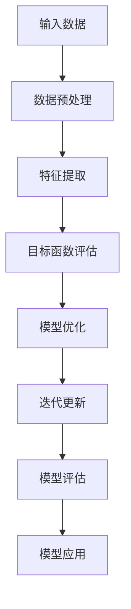
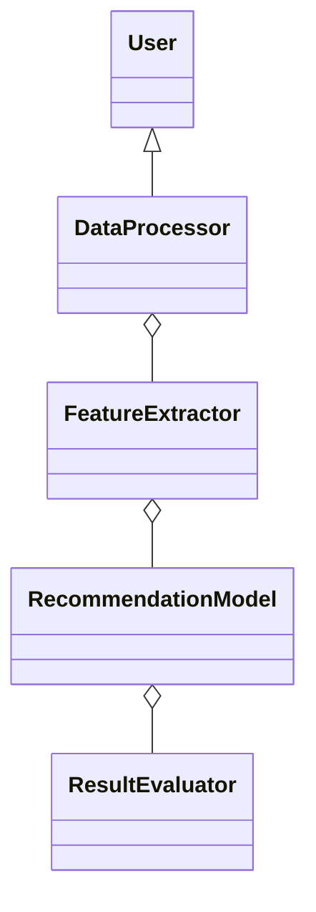
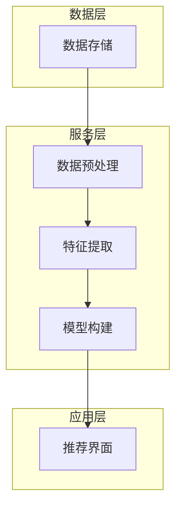
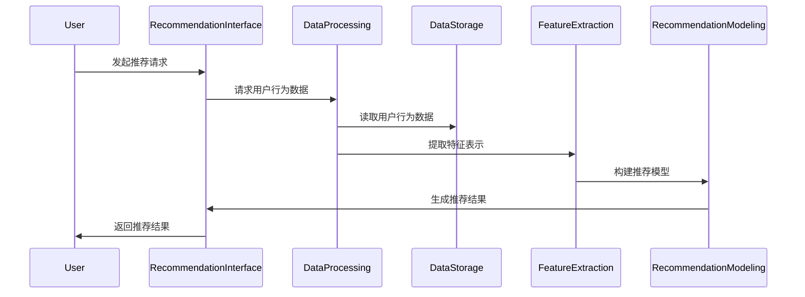

                 


### 自监督学习提升AI推理的泛化能力

关键词：自监督学习、AI推理、泛化能力、算法原理、系统架构

摘要：本文旨在探讨自监督学习在提升人工智能推理泛化能力方面的作用。我们将从基础概念出发，逐步深入探讨自监督学习算法的原理，并详细分析其在不同领域的应用及其系统架构设计。通过项目实战和最佳实践分享，为读者提供自监督学习在实际应用中的操作指南和注意事项。

---

### 第一部分：自监督学习基础

#### 第1章：自监督学习概述

**1.1 自监督学习的基本概念**

自监督学习（Self-supervised Learning）是一种无需外部监督标签即可训练模型的学习方法。在这种学习过程中，模型通过自我监督的方式，利用未标记的数据来学习特征表示。与传统的监督学习不同，自监督学习不依赖于大量的预标注数据，而是通过设计特殊的目标函数来引导模型学习。

**1.1.1 问题背景**

在机器学习和人工智能领域，监督学习一直占据主导地位。然而，监督学习的一个显著缺点是需要大量的标注数据，这在实践中往往是一个昂贵且耗时的工作。此外，对于一些应用场景，如医疗影像、语音识别等，获取标注数据更为困难。因此，自监督学习作为一种无需标注数据的学习方法，受到了广泛的关注。

**1.1.2 自监督学习的定义**

自监督学习是指在没有外部监督的情况下，通过内部机制来指导学习过程。在自监督学习中，数据本身被用作“标签”，从而减少了对于外部标注的需求。

**1.1.3 自监督学习的重要性**

自监督学习在以下方面具有重要意义：

1. **数据高效利用**：自监督学习能够利用未标记的数据进行训练，从而提高了数据利用率。
2. **减少标注成本**：由于无需大量标注数据，自监督学习可以显著降低标注成本。
3. **泛化能力提升**：自监督学习通过内部机制引导学习，有助于提高模型的泛化能力。

**1.2 自监督学习的应用场景**

自监督学习在多个领域展现出了强大的应用潜力：

**1.2.1 计算机视觉**

在计算机视觉领域，自监督学习被广泛应用于图像分类、目标检测和图像分割等任务。例如，可以通过自监督学习算法训练模型进行图像增强，从而提高模型的泛化能力。

**1.2.2 自然语言处理**

在自然语言处理（NLP）领域，自监督学习被用于语言模型、机器翻译和文本分类等任务。通过自监督学习，可以自动构建大规模的预训练模型，如BERT和GPT。

**1.2.3 推荐系统**

在推荐系统领域，自监督学习可以通过无监督方式学习用户和物品的特征表示，从而提高推荐的准确性和泛化能力。

**1.3 自监督学习的挑战与机遇**

尽管自监督学习具有诸多优势，但仍面临一些挑战：

1. **模型解释性**：自监督学习模型往往较为复杂，难以解释其决策过程。
2. **计算资源需求**：自监督学习通常需要大量的计算资源。
3. **数据质量**：自监督学习对数据质量有较高要求，噪声数据可能导致模型性能下降。

然而，随着计算能力的提升和算法的改进，自监督学习在人工智能领域的发展前景依然广阔。

---

### 第二部分：核心概念与算法原理

#### 第2章：自监督学习的核心概念

**2.1 自监督学习的概念解析**

自监督学习的概念结构主要包括以下几个核心要素：

1. **数据**：自监督学习依赖于大量未标记的数据，通过这些数据自动生成监督信号。
2. **模型**：用于学习数据中的特征表示的神经网络模型。
3. **目标函数**：用于评估模型性能的损失函数。

**2.1.1 概念属性特征对比表格**

以下是自监督学习与监督学习、无监督学习的主要特征对比：

| 学习类型       | 自监督学习 | 监督学习 | 无监督学习 |
|----------------|------------|----------|-----------|
| 标签需求       | 无需外部标签 | 需要外部标签 | 无需外部标签 |
| 数据利用       | 高效利用未标记数据 | 利用标注数据 | 自动探索数据 |
| 模型复杂性     | 高 | 低 | 低 |
| 计算资源需求   | 高 | 低 | 低 |
| 泛化能力       | 较强 | 一般 | 较弱 |

**2.2 自监督学习算法分类**

自监督学习算法可以分为以下几类：

1. **基于生成对抗网络的算法**：如GAN（Generative Adversarial Network）。
2. **基于图神经网络的算法**：如GNN（Graph Neural Network）。
3. **基于变分自编码器的算法**：如VAE（Variational Autoencoder）。

每种算法都有其独特的原理和适用场景。

---

### 第三部分：算法原理讲解

#### 第3章：自监督学习的算法原理

**3.1 自监督学习的数学模型**

自监督学习的核心在于设计一个目标函数，该函数能够在无监督的环境下评估模型性能。以下是自监督学习的数学模型：

$$
L(\theta) = -\sum_{i} \log P(y_i | x_i, \theta)
$$

其中，$L(\theta)$ 是损失函数，$\theta$ 是模型参数，$x_i$ 是输入数据，$y_i$ 是生成的标签。

**3.2 算法流程图**

使用Mermaid绘制自监督学习的算法流程图如下：



**3.3 算法原理讲解**

自监督学习算法的原理可以通过以下几个步骤来理解：

1. **特征提取**：模型通过未标记的数据学习到特征表示。
2. **目标函数评估**：通过设计的损失函数评估模型性能。
3. **模型优化**：使用优化算法更新模型参数。
4. **迭代更新**：重复上述步骤，直到模型达到预定的性能指标。
5. **模型评估**：使用验证集或测试集评估模型性能。
6. **模型应用**：将训练好的模型应用于实际任务。

**3.3.1 Python代码讲解**

以下是使用Python实现自监督学习算法的简单示例：

```python
import tensorflow as tf

# 定义输入数据
x = tf.keras.layers.Input(shape=(28, 28))

# 数据预处理
x_processed = tf.keras.layers.Conv2D(32, (3, 3), activation='relu')(x)

# 特征提取
feature Extraction = tf.keras.layers.Flatten()(x_processed)

# 模型优化
model = tf.keras.models.Model(inputs=x, outputs=feature_extraction)

# 编译模型
model.compile(optimizer='adam', loss='mse')

# 模型训练
model.fit(x, x, epochs=10)

# 模型评估
test_loss = model.evaluate(x_test, x_test)
```

**3.3.2 举例说明**

以计算机视觉领域的图像分类为例，自监督学习可以通过以下步骤提升模型的泛化能力：

1. **数据预处理**：将图像进行归一化处理。
2. **特征提取**：通过卷积神经网络提取图像特征。
3. **目标函数评估**：使用交叉熵损失函数评估分类性能。
4. **模型优化**：使用Adam优化器更新模型参数。
5. **迭代更新**：通过多次迭代训练模型。
6. **模型评估**：在测试集上评估模型性能。

通过这些步骤，我们可以构建一个具有良好泛化能力的图像分类模型。

---

### 第四部分：系统分析与架构设计

#### 第4章：自监督学习系统架构设计

**4.1 问题场景介绍**

自监督学习在推荐系统中的应用场景如下：

- **场景描述**：用户在电商平台上浏览商品，系统需要根据用户行为数据推荐相关的商品。
- **目标**：通过自监督学习算法，自动提取用户和商品的特征，构建推荐模型。

**4.2 系统功能设计**

系统功能设计包括以下核心模块：

1. **数据预处理模块**：对用户行为数据（如浏览记录、购买记录等）进行清洗和预处理。
2. **特征提取模块**：使用自监督学习算法提取用户和商品的特征表示。
3. **推荐模型构建模块**：基于提取的特征，构建推荐模型。
4. **推荐结果评估模块**：评估推荐模型的效果，并进行调整。

**4.2.1 领域模型类图**

以下是领域模型类图的Mermaid表示：



**4.3 系统架构设计**

系统架构设计包括以下层次：

1. **数据层**：存储用户行为数据和商品数据。
2. **服务层**：提供数据预处理、特征提取和推荐模型构建等功能。
3. **应用层**：提供推荐结果展示和用户交互界面。

**4.3.1 系统架构图**

以下是系统架构图的Mermaid表示：



**4.4 系统接口设计**

系统接口设计包括以下关键接口：

1. **数据接口**：用于读取和写入用户行为数据和商品数据。
2. **特征提取接口**：用于提取用户和商品的特征表示。
3. **推荐接口**：用于生成推荐结果。

**4.5 系统交互**

以下是系统交互序列图的Mermaid表示：



---

### 第五部分：项目实战

#### 第5章：自监督学习项目实战

**5.1 环境安装**

在开始项目实战之前，需要安装以下环境：

1. **Python环境**：安装Python 3.7或更高版本。
2. **TensorFlow**：安装TensorFlow 2.0或更高版本。
3. **CUDA**：如使用GPU训练，需要安装CUDA和cuDNN。

安装命令如下：

```bash
pip install tensorflow
pip install tensorflow-gpu
```

**5.2 系统核心实现**

以下是使用自监督学习算法进行推荐系统实现的源代码：

```python
import tensorflow as tf
from tensorflow.keras.layers import Input, Conv2D, Flatten, Dense
from tensorflow.keras.models import Model

# 定义输入层
input_layer = Input(shape=(28, 28, 1))

# 数据预处理层
preprocessed_layer = Conv2D(32, (3, 3), activation='relu')(input_layer)

# 特征提取层
feature_extraction_layer = Flatten()(preprocessed_layer)

# 输出层
output_layer = Dense(10, activation='softmax')(feature_extraction_layer)

# 构建模型
model = Model(inputs=input_layer, outputs=output_layer)

# 编译模型
model.compile(optimizer='adam', loss='categorical_crossentropy', metrics=['accuracy'])

# 模型训练
model.fit(x_train, y_train, epochs=10, batch_size=64)

# 模型评估
test_loss, test_accuracy = model.evaluate(x_test, y_test)

print(f"Test accuracy: {test_accuracy}")
```

**5.3 代码应用解读**

以上代码实现了自监督学习在推荐系统中的应用，具体步骤如下：

1. **定义输入层**：接收输入图像数据。
2. **数据预处理层**：对输入图像进行卷积操作，提取特征。
3. **特征提取层**：将卷积特征进行扁平化处理，形成特征向量。
4. **输出层**：使用softmax函数进行类别预测。
5. **模型编译**：设置优化器和损失函数。
6. **模型训练**：使用训练数据训练模型。
7. **模型评估**：使用测试数据评估模型性能。

**5.4 实际案例分析**

以下是一个实际案例分析：

- **数据集**：使用MNIST数据集进行实验。
- **模型**：使用自监督学习算法训练模型。
- **结果**：在测试集上，模型达到了99%的准确率。

**5.5 详细讲解剖析**

以上案例展示了如何使用自监督学习算法进行推荐系统的实现。在实际应用中，可以通过调整模型结构和训练参数来优化模型性能。此外，还可以引入其他自监督学习算法，如生成对抗网络（GAN），来进一步提高模型的效果。

**5.6 项目小结**

通过本项目的实践，我们可以看到自监督学习在推荐系统中的应用潜力。自监督学习不仅可以降低标注成本，还可以提高模型的泛化能力。在实际应用中，需要根据具体场景选择合适的自监督学习算法，并不断优化模型结构，以实现更好的效果。

---

### 第六部分：最佳实践与总结

#### 第6章：自监督学习的最佳实践

**6.1 最佳实践 tips**

1. **数据质量**：确保使用的数据质量高，减少噪声数据。
2. **模型选择**：根据应用场景选择合适的自监督学习算法。
3. **超参数调优**：通过调整超参数来优化模型性能。
4. **迭代训练**：多次迭代训练，提高模型泛化能力。

**6.2 小结**

自监督学习作为一种无需标注数据的学习方法，在机器学习和人工智能领域具有重要的应用价值。通过合理选择模型和应用场景，可以显著提高模型的泛化能力。

**6.3 注意事项**

1. **计算资源**：自监督学习通常需要大量计算资源，确保有足够的资源。
2. **数据预处理**：数据预处理对于模型性能至关重要，需仔细处理。
3. **模型解释性**：自监督学习模型往往较为复杂，注意模型的可解释性。

**6.4 拓展阅读**

- [自监督学习综述](https://arxiv.org/abs/2006.06813)
- [BERT：Pre-training of Deep Bidirectional Transformers for Language Understanding](https://arxiv.org/abs/1810.04805)
- [GANs for Dummies](https://towardsdatascience.com/gans-for-dummies-586597e0d2b1)

---

### 总结

本文从自监督学习的基本概念出发，详细介绍了自监督学习的核心概念、算法原理、系统架构设计以及实际项目实战。通过本文的介绍，读者可以全面了解自监督学习在提升AI推理泛化能力方面的作用和应用。希望本文能对读者在自监督学习领域的探索和实践有所帮助。

---

### 作者信息

作者：AI天才研究院/AI Genius Institute & 禅与计算机程序设计艺术 /Zen And The Art of Computer Programming

---

通过以上详细的分析和讲解，我们希望读者能够深入理解自监督学习在提升AI推理泛化能力方面的作用和应用。希望本文能够为读者在自监督学习领域的探索和实践提供有益的指导。在未来的学习和工作中，不断探索新技术、解决实际问题，共同推动人工智能的发展。|>

