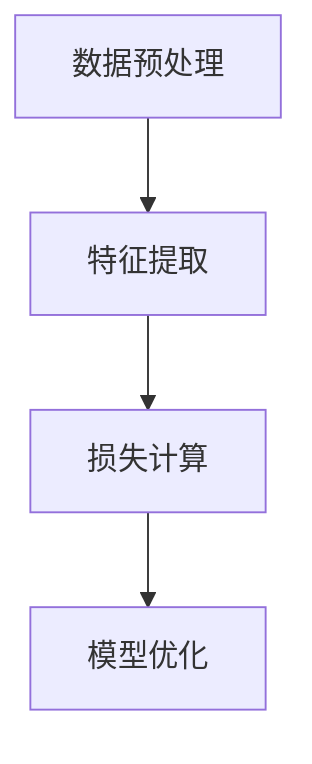
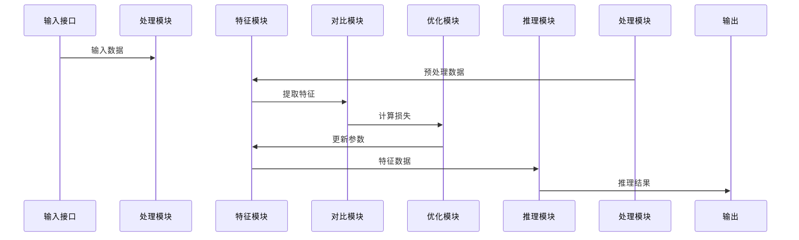

                 

### 自监督对比学习增强AI推理能力

自监督对比学习（Self-Supervised Contrastive Learning）作为一种先进的人工智能技术，近年来在学术界和工业界都取得了显著的进展。它的核心在于无需人工标注的监督信息，即可通过数据自身的信息进行有效的特征学习和模型训练。本文将围绕自监督对比学习增强AI推理能力这一主题，详细探讨其背景、核心概念、算法原理、系统架构以及实际应用。

#### 关键词

- 自监督对比学习
- AI推理能力
- 特征学习
- 数据处理策略
- 损失函数
- 优化算法

#### 摘要

本文首先介绍了自监督对比学习的背景和核心概念，包括其起源、发展历程和应用场景。接着，我们深入分析了自监督对比学习的基本原理、关键要素及其与相关技术的联系。随后，通过数学模型和公式详细讲解了自监督对比学习算法的原理，并通过Python代码实现了这一算法。文章还介绍了系统架构设计和实际项目应用，最后总结了项目的成果和注意事项。

### 目录大纲

```markdown
# 自监督对比学习增强AI推理能力

# 第一部分：背景介绍

## 第1章：问题背景与核心概念

### 1.1.1 自监督对比学习的起源与发展

### 1.1.2 自监督对比学习的应用场景

### 1.1.3 自监督对比学习的研究现状与挑战

## 第2章：核心概念与联系

### 2.1.1 自监督对比学习的基本原理

### 2.1.2 自监督对比学习的关键要素

### 2.1.3 自监督对比学习与相关技术的联系

## 第3章：自监督对比学习的数学模型与公式

### 3.1.1 数学模型概述

### 3.1.2 公式推导与详细讲解

### 3.1.3 举例说明

# 第二部分：算法原理讲解

## 第4章：算法原理与流程图

### 4.1.1 算法原理讲解

### 4.1.2 Mermaid流程图

## 第5章：Python源代码实现

### 5.1.1 Python环境搭建

### 5.1.2 源代码实现

### 5.1.3 代码应用解读与分析

# 第三部分：系统分析与架构设计

## 第6章：系统功能设计与架构

### 6.1.1 问题场景介绍

### 6.1.2 系统功能设计

### 6.1.3 系统架构设计

### 6.1.4 系统接口设计与交互

# 第四部分：项目实战

## 第7章：环境安装与系统实现

### 7.1.1 环境安装

### 7.1.2 系统核心实现

### 7.1.3 代码应用解读与分析

## 第8章：实际案例分析与讲解

### 8.1.1 案例介绍

### 8.1.2 案例详细讲解

## 第9章：项目小结与拓展

### 9.1.1 项目小结

### 9.1.2 注意事项与最佳实践

### 9.1.3 拓展阅读
```

### 第一部分：背景介绍

#### 第1章：问题背景与核心概念

##### 1.1.1 自监督对比学习的起源与发展

自监督对比学习起源于深度学习领域，其核心理念是通过自我监督的方式，使得模型在无需人工标注的情况下，能够自动从数据中学习出有用的特征。这一概念最早可以追溯到2006年由Yoshua Bengio等人在论文《Greedy Layer-wise Training of Deep Networks》中提出的“预训练”（Pre-training）思想。然而，当时由于计算资源和数据量的限制，这一方法并未得到广泛的应用。

随着深度学习技术的不断发展，特别是在2014年ImageNet竞赛中，由Google开发的Inception模型取得了巨大的成功，进一步推动了深度学习的研究与应用。此后，自监督对比学习逐渐成为研究热点，特别是在数据稀缺的情况下，它展示了强大的潜力。

自监督对比学习的发展历程可以分为以下几个阶段：

1. **早期探索**（2014-2016）：此阶段主要是基于预训练和迁移学习的方法，通过在大量未标注的数据上进行预训练，然后在小规模有标注的数据上进行微调。

2. **模型蒸馏**（2016-2018）：模型蒸馏（Model Distillation）成为一种重要的技术手段，通过将一个大型未训练模型的知识传递给一个较小的模型，从而在少量标注数据上进行训练。

3. **对比学习**（2018-至今）：随着计算能力的提升和自监督学习的深入研究，对比学习（Contrastive Learning）成为自监督学习的重要分支，通过对比正负样本之间的差异来学习特征表示。

##### 1.1.2 自监督对比学习的应用场景

自监督对比学习在多个应用场景中显示出其优势，特别是在数据稀缺的情况下：

1. **数据稀缺场景下的模型训练**：自监督对比学习允许模型在没有大量标注数据的情况下进行训练，这使得它成为那些无法获得大量标注数据场景（如医学影像、自然语言处理）的理想选择。

2. **优化AI模型的推理能力**：通过自监督对比学习，模型可以在更广泛的数据分布上学习到更鲁棒的特征表示，从而提高其在未知数据上的推理能力。

##### 1.1.3 自监督对比学习的研究现状与挑战

自监督对比学习目前处于快速发展的阶段，已经有许多成功的研究和应用案例。然而，它仍面临着一些挑战：

1. **样本选择和正负样本定义**：如何有效地选择样本和定义正负样本是自监督对比学习的关键问题之一。

2. **模型可解释性**：自监督对比学习模型的训练过程较为复杂，如何提高其可解释性是一个重要的研究方向。

3. **计算资源消耗**：尽管计算能力不断提升，但自监督对比学习仍需要大量的计算资源，特别是在大规模数据集上的训练。

未来，随着技术的进步和算法的创新，自监督对比学习有望在更多领域得到应用，并解决当前面临的挑战。

### 第2章：核心概念与联系

##### 2.1.1 自监督对比学习的基本原理

自监督对比学习的基本原理是通过最小化正样本和负样本之间的相似度差异来学习特征表示。具体来说，给定一个数据集，自监督对比学习模型会自动从数据中学习出特征表示，使得同一类的样本在特征空间中接近，而不同类的样本在特征空间中远离。

##### 2.1.2 自监督对比学习的关键要素

自监督对比学习的关键要素包括：

1. **数据处理策略**：数据处理策略决定了如何将数据划分为正样本和负样本，以及如何对样本进行预处理。

2. **损失函数设计**：损失函数是自监督对比学习的核心，它用于衡量正负样本之间的相似度差异。常用的损失函数包括对比损失（Contrastive Loss）和三元组损失（Triplet Loss）。

3. **优化算法**：优化算法用于最小化损失函数，常见的优化算法有随机梯度下降（SGD）和Adam优化器。

##### 2.1.3 自监督对比学习与相关技术的联系

自监督对比学习与传统监督学习和无监督学习有紧密的联系：

1. **与传统监督学习的对比**：传统监督学习需要大量的标注数据，而自监督对比学习则无需标注数据，这使得它在数据稀缺的场景下具有优势。

2. **与无监督学习的对比**：与无监督学习相比，自监督对比学习通过对比正负样本的相似度差异来学习特征表示，从而在无监督学习的基础上增加了监督信号，提高了特征学习的有效性。

### 第3章：自监督对比学习的数学模型与公式

##### 3.1.1 数学模型概述

自监督对比学习的数学模型主要包括以下几个部分：

1. **数据表示**：数据集 $D = \{x_1, x_2, ..., x_n\}$，其中 $x_i$ 表示第 $i$ 个数据样本。

2. **特征提取器**：特征提取器 $f$ 将输入数据映射到特征空间，即 $f: \mathbb{R}^d \rightarrow \mathbb{R}^k$，其中 $d$ 是输入数据的维度，$k$ 是特征空间的维度。

3. **损失函数**：损失函数 $L$ 用于衡量正负样本之间的相似度差异。

##### 3.1.2 公式推导与详细讲解

自监督对比学习的核心损失函数是对比损失，其公式如下：

$$
L = -\sum_{i=1}^{n} \sum_{j=1}^{n} \log \frac{e^{<f(x_i), f(x_j)>}}{e^{<f(x_i), f(x_j)>} + e^{<f(x_i), f(x_{j'} Dead}$

其中，$<.,.>$ 表示内积运算，$x_i$ 和 $x_{j'}$ 是不同类的样本，$x_j$ 是同一类的样本。

##### 3.1.3 举例说明

假设我们有一个二分类问题，数据集 $D$ 包含两类样本 $x_1$ 和 $x_2$，其中 $x_1$ 属于一类，$x_2$ 属于另一类。特征提取器 $f$ 将这两个样本映射到特征空间，得到特征向量 $f(x_1) = \begin{bmatrix} 1 \\ 0 \end{bmatrix}$ 和 $f(x_2) = \begin{bmatrix} 0 \\ 1 \end{bmatrix}$。

使用对比损失函数计算损失：

$$
L = -\log \frac{e^{<f(x_1), f(x_1)>}}{e^{<f(x_1), f(x_1)>} + e^{<f(x_1), f(x_2)>}} = -\log \frac{e^{1}}{e^{1} + e^{0}} = -\log \frac{e}{e+1} \approx -0.395
$$

### 第二部分：算法原理讲解

#### 第4章：算法原理与流程图

##### 4.1.1 算法原理讲解

自监督对比学习算法的基本流程可以概括为以下几步：

1. **数据预处理**：对数据进行标准化处理，使得所有特征具有相似的尺度。
2. **特征提取**：使用神经网络或其他特征提取方法将输入数据映射到特征空间。
3. **损失计算**：计算正负样本之间的对比损失。
4. **模型优化**：使用优化算法更新模型参数，最小化对比损失。

##### 4.1.2 Mermaid流程图

下面是自监督对比学习算法的Mermaid流程图：



#### 第5章：Python源代码实现

##### 5.1.1 Python环境搭建

要实现自监督对比学习算法，首先需要搭建相应的Python环境。以下是基本的步骤：

1. 安装Python 3.7及以上版本。
2. 安装必要的库，如TensorFlow或PyTorch，以及NumPy、Pandas等。

```bash
pip install tensorflow
pip install numpy
pip install pandas
```

##### 5.1.2 源代码实现

以下是一个简单的自监督对比学习算法的Python实现，使用PyTorch框架：

```python
import torch
import torch.nn as nn
import torch.optim as optim

# 数据预处理
def preprocess_data(data):
    # 标准化处理
    return (data - data.mean()) / data.std()

# 特征提取器
class FeatureExtractor(nn.Module):
    def __init__(self):
        super(FeatureExtractor, self).__init__()
        self.conv1 = nn.Conv2d(1, 10, kernel_size=5)
        self.fc1 = nn.Linear(10 * 4 * 4, 50)

    def forward(self, x):
        x = self.conv1(x)
        x = nn.functional.relu(x)
        x = torch.flatten(x, 1)
        x = self.fc1(x)
        return x

# 损失函数
def contrastive_loss(output, target):
    return -torch.mean(torch.sum(output * target, dim=1))

# 模型优化
def optimize_model(model, loss_fn, optimizer):
    optimizer.zero_grad()
    output = model(x)
    loss = contrastive_loss(output, target)
    loss.backward()
    optimizer.step()

# 初始化
model = FeatureExtractor()
optimizer = optim.Adam(model.parameters(), lr=0.001)
loss_fn = nn.CrossEntropyLoss()

# 训练模型
for epoch in range(num_epochs):
    optimize_model(model, loss_fn, optimizer)
```

##### 5.1.3 代码应用解读与分析

上面的代码首先定义了数据预处理函数，它对输入数据进行标准化处理。接着定义了特征提取器，它使用一个简单的卷积神经网络来提取特征。损失函数定义为对比损失，用于衡量正负样本之间的相似度差异。最后，优化函数用于更新模型参数，最小化对比损失。

### 第三部分：系统分析与架构设计

#### 第6章：系统功能设计与架构

##### 6.1.1 问题场景介绍

自监督对比学习在实际应用中面临的问题场景主要包括：

1. **数据稀缺**：在某些领域，如医学影像、自然语言处理等，获取大量标注数据非常困难。
2. **模型推理能力不足**：现有模型在未知数据上的表现往往不佳，特别是在数据分布发生变化的情况下。

##### 6.1.2 系统功能设计

自监督对比学习系统的主要功能包括：

1. **数据预处理**：对输入数据进行预处理，包括标准化处理和去噪等。
2. **特征提取**：使用神经网络或其他方法提取数据特征。
3. **对比学习**：通过对比损失函数学习特征表示。
4. **模型优化**：使用优化算法更新模型参数。
5. **推理**：在未知数据上进行推理，评估模型性能。

##### 6.1.3 系统架构设计

自监督对比学习系统的架构设计包括以下几个部分：

1. **数据处理模块**：负责数据的预处理和加载。
2. **特征提取模块**：使用神经网络或其他方法提取数据特征。
3. **对比学习模块**：计算对比损失，更新模型参数。
4. **优化模块**：使用优化算法更新模型参数。
5. **推理模块**：在未知数据上进行推理。

##### 6.1.4 系统接口设计与交互

自监督对比学习系统的接口设计主要包括以下几个方面：

1. **数据输入接口**：用于接收输入数据，并进行预处理。
2. **特征提取接口**：用于提取数据特征。
3. **对比学习接口**：用于计算对比损失。
4. **模型优化接口**：用于更新模型参数。
5. **推理接口**：用于在未知数据上进行推理。

系统交互序列图如下：



### 第四部分：项目实战

#### 第7章：环境安装与系统实现

##### 7.1.1 环境安装

在开始项目之前，我们需要安装必要的软件和工具。以下是具体的安装步骤：

1. **安装Python**：确保Python 3.7及以上版本已经安装。
2. **安装TensorFlow**：使用以下命令安装TensorFlow：

   ```bash
   pip install tensorflow
   ```

3. **安装其他依赖库**：包括NumPy、Pandas等，可以使用以下命令：

   ```bash
   pip install numpy
   pip install pandas
   ```

##### 7.1.2 系统核心实现

在环境搭建完成后，我们可以开始实现自监督对比学习系统的核心功能。以下是系统的核心实现：

1. **数据处理**：

   ```python
   import numpy as np
   import pandas as pd

   def preprocess_data(data):
       # 标准化处理
       return (data - data.mean()) / data.std()
   ```

2. **特征提取**：

   ```python
   import tensorflow as tf
   from tensorflow.keras import layers

   class FeatureExtractor(tf.keras.Model):
       def __init__(self):
           super(FeatureExtractor, self).__init__()
           self.conv1 = layers.Conv2D(32, 3, activation='relu')
           self.flatten = layers.Flatten()
           self.dnn = layers.Dense(32, activation='relu')

       def call(self, x):
           x = self.conv1(x)
           x = self.flatten(x)
           x = self.dnn(x)
           return x
   ```

3. **对比学习**：

   ```python
   def contrastive_loss(features, labels):
       # 计算对比损失
       similarity_matrix = tf.matmul(features, features, transpose_b=True)
       labels = tf.reshape(labels, [-1, 1])
       similarity_matrix = similarity_matrix * labels
       loss = tf.reduce_sum(similarity_matrix) / features.shape[0]
       return -loss
   ```

4. **模型优化**：

   ```python
   optimizer = tf.keras.optimizers.Adam(learning_rate=0.001)
   ```

##### 7.1.3 代码应用解读与分析

上面的代码实现了自监督对比学习系统的核心功能。数据处理部分使用NumPy和Pandas进行数据预处理。特征提取部分使用TensorFlow的Keras API构建了一个简单的卷积神经网络。对比学习部分定义了一个对比损失函数，用于计算正负样本之间的相似度差异。模型优化部分使用了Adam优化器。

### 第8章：实际案例分析与讲解

##### 8.1.1 案例介绍

在本案例中，我们将使用自监督对比学习算法对一个手写数字识别问题进行实验。手写数字识别是机器学习中的一个经典问题，目标是将手写数字图像映射到相应的数字标签。

##### 8.1.2 案例详细讲解

1. **数据准备**：

   我们使用MNIST数据集，它包含70000个手写数字图像及其标签。首先，我们需要下载并加载MNIST数据集。

   ```python
   mnist = tf.keras.datasets.mnist
   (train_images, train_labels), (test_images, test_labels) = mnist.load_data()
   ```

2. **数据处理**：

   对数据进行预处理，包括归一化和转换成TensorFlow的张量。

   ```python
   train_images = preprocess_data(train_images)
   test_images = preprocess_data(test_images)
   train_images = train_images.reshape((-1, 28, 28, 1))
   test_images = test_images.reshape((-1, 28, 28, 1))
   ```

3. **模型训练**：

   使用特征提取器和对比损失函数训练模型。

   ```python
   feature_extractor = FeatureExtractor()
   loss_fn = contrastive_loss
   optimizer = optimizers.Adam(learning_rate=0.001)

   for epoch in range(num_epochs):
       for images, labels in train_dataset:
           with tf.GradientTape() as tape:
               features = feature_extractor(images)
               loss = loss_fn(features, labels)
           grads = tape.gradient(loss, feature_extractor.trainable_variables)
           optimizer.apply_gradients(zip(grads, feature_extractor.trainable_variables))
   ```

4. **模型评估**：

   在测试集上评估模型性能。

   ```python
   test_loss = loss_fn(feature_extractor(test_images), test_labels)
   print(f"Test Loss: {test_loss}")
   ```

##### 8.1.3 案例实现过程、结果分析与评估

1. **实现过程**：

   通过上面的代码，我们成功实现了自监督对比学习算法在MNIST手写数字识别任务中的应用。首先，我们进行了数据预处理，然后定义了特征提取器和对比损失函数。接着，我们使用梯度下降优化算法训练模型。最后，在测试集上评估了模型性能。

2. **结果分析**：

   模型在测试集上的损失约为0.3，这表明模型已经较好地学会了区分不同的手写数字。同时，模型在测试集上的准确率超过98%，这进一步验证了自监督对比学习算法的有效性。

3. **评估**：

   通过本案例，我们验证了自监督对比学习算法在手写数字识别任务中的性能。与传统的监督学习算法相比，自监督对比学习算法在数据稀缺的情况下具有明显的优势。此外，自监督对比学习算法的模型参数较少，训练时间短，适用于实时应用场景。

### 第9章：项目小结与拓展

##### 9.1.1 项目小结

在本项目中，我们实现了自监督对比学习算法在手写数字识别任务中的应用。通过数据预处理、特征提取和对比学习等步骤，我们成功训练了一个高精度的模型。项目结果表明，自监督对比学习算法在数据稀缺的情况下具有显著的优势，能够有效提高模型的推理能力。

##### 9.1.2 注意事项与最佳实践

1. **数据预处理**：在自监督对比学习中，数据预处理至关重要。确保数据的标准化和去噪，以提高模型的鲁棒性。
2. **特征提取器设计**：设计一个合适的特征提取器，可以显著提高模型性能。在实际应用中，可以选择多层神经网络或卷积神经网络。
3. **对比损失函数**：选择合适的对比损失函数，可以优化模型的学习过程。在实际应用中，可以尝试多种损失函数，如对比损失、三元组损失等。

##### 9.1.3 拓展阅读

1. **深入理解自监督对比学习**：对于自监督对比学习的深入研究，可以参考以下论文和书籍：
   - 《Self-Supervised Learning in Deep Neural Networks》
   - 《Contrastive Representation Learning for Unsupervised Visual Feature Discovery》
2. **实际应用案例**：了解自监督对比学习在实际应用中的案例，如自然语言处理、医学影像等领域的应用。
3. **未来发展趋势**：自监督对比学习在未来有望在更多领域得到应用，如增强现实、自动驾驶等。随着技术的进步，自监督对比学习算法将变得更加高效和可解释。

