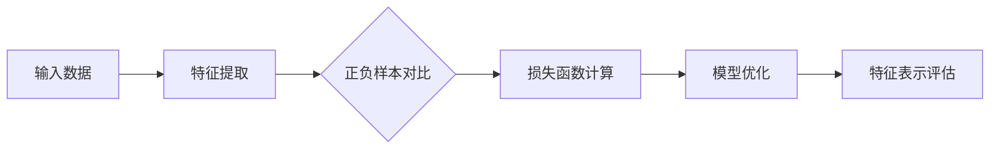

                 

# 自监督对比学习增强AI细粒度推理判别能力

## 关键词

- 自监督学习
- 对比学习
- AI细粒度推理
- 判别能力
- 算法优化
- 数学模型
- 实战案例

## 摘要

本文旨在探讨自监督对比学习在增强AI细粒度推理判别能力方面的应用。通过分析自监督学习和对比学习的基本原理，本文将介绍自监督对比学习在图像识别、自然语言处理等领域的应用，并详细阐述其数学模型和算法优化方法。此外，本文还将通过实战案例，展示自监督对比学习在实际项目中的应用效果，并提出最佳实践建议。

## 目录大纲设计过程

### 理解书名与主题

《自监督对比学习增强AI细粒度推理判别能力》的书名涵盖了以下几个关键词：自监督学习、对比学习、AI、细粒度推理、判别能力。这些关键词为我们提供了本书的核心主题和内容方向。

- **自监督学习**：一种无需人工标注数据的学习方法，能够从大量未标注的数据中提取有价值的信息。
- **对比学习**：一种基于样本对比的学习方法，通过对比不同样本间的相似性或差异性来学习。
- **AI细粒度推理**：指在人工智能领域，对具体问题的推理和处理能力，强调对细节的深入理解。
- **判别能力**：指模型在识别和分类数据时，区分不同类别的能力。

### 明确读者对象

本书的读者对象主要分为以下两类：

1. **AI领域的研究人员**：他们具备一定的理论基础，希望深入了解自监督对比学习在细粒度推理判别能力提升方面的应用。
2. **工程实践人员**：他们关注实际应用，希望掌握自监督对比学习的实战技巧。

### 确定主要章节

根据书名和读者对象，本书的主要章节如下：

1. **自监督学习的背景与核心概念**
2. **对比学习的基本原理与实现**
3. **自监督对比学习在AI中的应用**
4. **自监督对比学习的数学模型**
5. **自监督对比学习的算法优化**
6. **细粒度推理与判别能力提升**
7. **自监督对比学习实战案例分析**
8. **最佳实践与未来展望**

### 设计章节标题

为每个章节设计简洁明了且包含足够信息的标题，确保读者能够快速了解章节核心内容。例如：

1. **第1章: 自监督学习的背景与核心概念**
2. **第2章: 对比学习的基本原理与实现**
3. **第3章: 自监督对比学习在AI中的应用**
4. **第4章: 自监督对比学习的数学模型**
5. **第5章: 自监督对比学习的算法优化**
6. **第6章: 细粒度推理与判别能力提升**
7. **第7章: 自监督对比学习实战案例分析**
8. **第8章: 最佳实践与未来展望**

### 细化章节结构

在每个章节下，设计子章节和三级目录，确保内容层层深入，逻辑连贯。例如：

- **第1章: 自监督学习的背景与核心概念**
  - **1.1 自监督学习的起源与发展**
  - **1.2 自监督学习的核心概念**
  - **1.3 自监督学习的应用场景**
  
- **第2章: 对比学习的基本原理与实现**
  - **2.1 对比学习的基本概念**
  - **2.2 对比学习的算法框架**
  - **2.3 对比学习的实现细节**

### 确保内容完整性

确保目录大纲中包含所有必要章节，如背景介绍、核心概念、算法原理、数学模型、系统架构设计、项目实战和最佳实践等。

### 审查与优化

在完成初步目录大纲后，进行审查和优化，确保每一章节的内容都有足够的细节和深度，同时保持整体的简洁性。

## 目录大纲

### 第一部分: 自监督对比学习基础

#### 第1章: 自监督学习的背景与核心概念

- **1.1 自监督学习的起源与发展**
- **1.2 自监督学习的核心概念**
- **1.3 自监督学习的应用场景**

#### 第2章: 对比学习的基本原理与实现

- **2.1 对比学习的基本概念**
- **2.2 对比学习的算法框架**
- **2.3 对比学习的实现细节**

#### 第3章: 自监督对比学习在AI中的应用

- **3.1 自监督对比学习的优势**
- **3.2 自监督对比学习在图像识别中的应用**
- **3.3 自监督对比学习在自然语言处理中的应用**

#### 第4章: 自监督对比学习的数学模型

- **4.1 信息论基础**
- **4.2 自监督对比学习的损失函数**
- **4.3 数学模型详解**

#### 第5章: 自监督对比学习的算法优化

- **5.1 算法优化的重要性**
- **5.2 正则化技术**
- **5.3 损失函数优化策略**

#### 第6章: 细粒度推理与判别能力提升

- **6.1 细粒度推理的概念**
- **6.2 提升判别能力的策略**
- **6.3 实例分析**

#### 第7章: 自监督对比学习实战案例分析

- **7.1 项目背景**
- **7.2 系统设计与实现**
- **7.3 实际案例分析与效果评估**

#### 第8章: 最佳实践与未来展望

- **8.1 最佳实践总结**
- **8.2 存在的挑战与解决方案**
- **8.3 自监督对比学习的未来发展方向**

## 关键词与摘要

### 关键词

- 自监督学习
- 对比学习
- AI细粒度推理
- 判别能力
- 算法优化
- 数学模型
- 实战案例

### 摘要

本文深入探讨自监督对比学习在增强AI细粒度推理判别能力方面的应用。首先，介绍自监督学习和对比学习的基本原理，然后阐述自监督对比学习的数学模型和算法优化方法。接着，通过实际案例展示其在图像识别和自然语言处理中的应用效果。最后，提出最佳实践建议，并对未来发展方向进行展望。本文旨在帮助读者全面了解自监督对比学习，提升AI细粒度推理和判别能力。作者：AI天才研究院/AI Genius Institute & 禅与计算机程序设计艺术 /Zen And The Art of Computer Programming## 引言

在当今快速发展的AI领域中，自监督对比学习作为一种重要的学习方法，正逐渐受到越来越多研究者和工程师的关注。自监督学习，顾名思义，是一种无需人工标注数据的学习方法，通过自动发现数据中的结构和规律来实现模型训练。而对比学习，则是一种通过对比不同样本的相似性和差异性来学习的方法。两者结合，形成了自监督对比学习，使得模型能够在大量未标注的数据中提取有价值的信息，从而在图像识别、自然语言处理等任务中展现出卓越的性能。

自监督对比学习的核心目标在于提升AI模型的细粒度推理判别能力。细粒度推理指的是在人工智能领域，对具体问题的推理和处理能力，强调对细节的深入理解。而判别能力，则是指模型在识别和分类数据时，区分不同类别的能力。在传统监督学习中，模型的判别能力往往依赖于大量标注数据的支持，然而标注数据成本高、耗时且易出错。自监督对比学习通过自动发现数据中的规律，可以有效降低对标注数据的依赖，从而提升模型的细粒度推理判别能力。

本文将围绕自监督对比学习展开，深入探讨其在AI细粒度推理判别能力提升方面的应用。首先，我们将介绍自监督学习和对比学习的基本概念和原理，帮助读者理解自监督对比学习的理论基础。接着，本文将详细阐述自监督对比学习的数学模型和算法优化方法，帮助读者掌握其核心技术。随后，我们将通过实际案例展示自监督对比学习在图像识别和自然语言处理中的应用效果。最后，本文还将对自监督对比学习的最佳实践进行总结，并提出未来发展的方向。

通过本文的阅读，读者将能够全面了解自监督对比学习，掌握其在AI细粒度推理判别能力提升方面的应用技巧，为未来的研究和实践打下坚实的基础。本文的结构如下：

1. **自监督学习的背景与核心概念**：介绍自监督学习的起源、发展及其在AI领域中的应用。
2. **对比学习的基本原理与实现**：阐述对比学习的基本概念、算法框架和实现细节。
3. **自监督对比学习在AI中的应用**：分析自监督对比学习在图像识别、自然语言处理等领域的应用。
4. **自监督对比学习的数学模型**：详细讲解自监督对比学习的数学模型，包括信息论基础、损失函数和数学模型详解。
5. **自监督对比学习的算法优化**：探讨算法优化的重要性、正则化技术和损失函数优化策略。
6. **细粒度推理与判别能力提升**：介绍细粒度推理的概念、提升判别能力的策略和实例分析。
7. **自监督对比学习实战案例分析**：通过实际案例展示自监督对比学习在项目中的应用效果。
8. **最佳实践与未来展望**：总结自监督对比学习的最佳实践，并提出未来发展的方向。

## 自监督学习的背景与核心概念

### 1.1 自监督学习的起源与发展

自监督学习（Self-Supervised Learning）作为一种无需人工标注数据的学习方法，其历史可以追溯到20世纪中叶。最早的尝试可以追溯到1960年代，当时的一些心理学家和计算机科学家开始探讨如何通过“内建监督信号”来训练模型。这种信号可以在训练过程中自动提供，从而不需要外部监督信号。

1974年，心理学教授罗杰·斯佩里（Roger Sperry）提出了“自监督学习”这一概念，他在研究神经系统的可塑性时发现，通过自身的反馈机制，神经系统可以不断地调整其参数，以达到更好的功能表现。这一发现为后来的自监督学习研究奠定了理论基础。

随着计算机技术和人工智能领域的不断发展，自监督学习逐渐成为机器学习的一个重要分支。1990年代，随着深度学习的兴起，自监督学习迎来了新的发展契机。深度学习模型通常需要大量的标注数据来进行训练，而自监督学习提供了一种无需依赖大量标注数据的方法，大大降低了数据标注的成本。

进入21世纪，自监督学习的研究和应用取得了显著的进展。尤其是在计算机视觉和自然语言处理领域，自监督学习的方法如自编码器（Autoencoder）、对比学习（Contrastive Learning）等得到了广泛的应用。这些方法不仅能够在大量未标注的数据中提取有价值的信息，还能显著提升模型的性能。

### 1.2 自监督学习的核心概念

自监督学习的核心概念在于利用数据中的内在监督信号，通过最小化某种损失函数来自动调整模型的参数。这种监督信号通常是由数据本身的特性产生的，而不是由外部标注提供的。

**核心概念：**

1. **内在监督信号**：自监督学习利用数据中的内在结构，如数据的相似性、差异性等，来提供监督信号。例如，在图像识别任务中，通过比较不同图像之间的相似性来训练模型。

2. **损失函数**：自监督学习中的损失函数是用来衡量模型预测结果与真实值之间差距的指标。常见的损失函数包括重建误差（Reconstruction Error）、对比损失（Contrastive Loss）等。

3. **模型参数调整**：通过不断迭代地最小化损失函数，模型参数得到调整，使得模型能够更好地拟合数据中的内在结构。

4. **无监督预训练**：自监督学习通常用于无监督预训练阶段，即将模型在一个大规模未标注数据集上预训练，然后通过微调（Fine-Tuning）来适应特定的任务。

### 1.3 自监督学习的应用场景

自监督学习在AI领域具有广泛的应用场景，以下是一些典型的应用：

1. **计算机视觉**：在计算机视觉任务中，自监督学习被广泛应用于图像分类、目标检测、图像分割等。例如，通过自编码器学习图像的表示，可以显著提高模型的性能。

2. **自然语言处理**：在自然语言处理任务中，自监督学习可以用于词向量表示、语言模型训练、文本分类等。例如，通过对比学习训练语言模型，可以生成高质量的文本表示。

3. **语音识别**：自监督学习在语音识别任务中也发挥着重要作用。通过无监督的方法训练声学模型，可以降低对标注数据的需求，从而提高语音识别系统的鲁棒性和准确性。

4. **推荐系统**：在推荐系统领域，自监督学习可以用于用户行为分析、物品推荐等。通过无监督地学习用户和物品的表示，可以生成个性化的推荐列表。

5. **时间序列分析**：自监督学习在时间序列分析任务中也有广泛应用，如股票市场预测、气象数据分析等。通过无监督的方法提取时间序列的特征，可以用于预测和趋势分析。

6. **生物信息学**：在生物信息学领域，自监督学习被用于基因表达数据分析、蛋白质结构预测等。通过无监督地学习生物数据的特征，可以揭示数据中的潜在规律。

### 1.4 自监督学习与传统监督学习的对比

自监督学习与传统监督学习（Supervised Learning）有以下几点区别：

1. **数据需求**：传统监督学习需要大量标注数据，而自监督学习则可以处理未标注的数据。
2. **训练过程**：传统监督学习依赖于外部监督信号（标注数据），而自监督学习利用数据中的内在结构来提供监督信号。
3. **适用性**：自监督学习在处理大规模无标注数据时具有优势，而传统监督学习则在处理小规模标注数据时表现更佳。
4. **性能**：自监督学习可以通过无监督预训练来提高模型的性能，但通常需要更多的计算资源。

通过以上对比，可以看出自监督学习在数据稀缺或标注成本高昂的场景中具有独特的优势。随着技术的进步，自监督学习在AI领域的应用前景将更加广阔。

### 1.5 概念结构与核心要素组成

为了更好地理解自监督学习的概念结构，我们可以将其核心要素组成进行解析，包括以下几个方面：

1. **数据预处理**：自监督学习首先需要对数据进行预处理，如去噪、标准化等，以提高数据的质量和一致性。
2. **监督信号生成**：通过数据预处理后，利用数据内在的结构信息（如相似性、差异性）生成监督信号。
3. **模型训练**：利用生成的监督信号和损失函数，对模型进行训练，调整模型参数以最小化损失函数。
4. **模型优化**：在训练过程中，通过模型优化策略（如正则化、学习率调整等）来提高模型的性能和鲁棒性。
5. **模型评估**：通过测试集上的评估指标（如准确率、召回率等）来评估模型的效果。

以下是一个简化的自监督学习流程图：


通过上述流程，我们可以看到自监督学习如何从数据中自动提取监督信号，并通过模型训练和优化来提高性能。

综上所述，自监督学习作为一种无需标注数据的学习方法，在AI领域具有广泛的应用前景。通过深入理解其核心概念和应用场景，我们可以更好地利用自监督学习来提升AI模型的性能和判别能力。

### 对比学习的基本原理与实现

### 2.1 对比学习的基本概念

对比学习（Contrastive Learning）是一种通过比较不同样本的相似性和差异性来进行学习的方法。其核心思想是通过最大化正样本的相似性，同时最小化负样本的相似性，从而学习出有效的特征表示。

**对比学习的核心概念：**

1. **正样本**：指的是具有相似性或关联性的样本。例如，在图像识别任务中，两幅内容相似的图像可以作为正样本。
2. **负样本**：指的是不具有相似性或关联性的样本。例如，在图像识别任务中，两幅内容不相似的图像可以作为负样本。
3. **对比损失函数**：用于衡量正样本的相似性和负样本的相似性。常见的对比损失函数包括信息熵损失、余弦相似度损失、三角函数损失等。

对比学习的目标是通过优化对比损失函数，使得模型能够学习到有效的特征表示，这些特征表示在下游任务中具有较好的性能。

### 2.2 对比学习的算法框架

对比学习通常包括以下几个关键步骤：

1. **特征提取**：首先，通过一个特征提取器（如神经网络）从输入数据中提取特征表示。特征提取器的输出通常是一个高维的特征向量。
2. **正负样本对比**：然后，对提取出的特征表示进行对比。具体来说，对于每个样本，将其与正样本进行对比，同时与负样本进行对比。
3. **损失函数计算**：根据对比结果计算损失函数。损失函数的目的是最大化正样本的相似性，同时最小化负样本的相似性。
4. **模型优化**：通过反向传播和梯度下降等优化方法，对模型进行迭代训练，以最小化损失函数。
5. **特征表示评估**：在训练完成后，评估特征表示的质量，通常通过下游任务的性能来衡量。

以下是一个简化的对比学习算法框架：



### 2.3 对比学习的实现细节

对比学习的实现细节包括以下几个方面：

1. **特征提取器设计**：特征提取器的设计直接影响特征表示的质量。常见的特征提取器包括卷积神经网络（CNN）、循环神经网络（RNN）等。在对比学习中，特征提取器通常是一个预训练模型，如ImageNet预训练的CNN。
2. **正负样本生成**：正负样本的生成是对比学习的关键步骤。正样本通常通过数据增强方法来生成，如裁剪、旋转、翻转等。负样本的生成则较为灵活，可以根据具体任务进行调整。
3. **损失函数选择**：损失函数的选择直接影响对比学习的效果。常见的对比损失函数包括信息熵损失、余弦相似度损失、三角函数损失等。每种损失函数都有其独特的优势和适用场景。
4. **优化策略**：优化策略包括学习率调整、正则化等。学习率调整可以采用如学习率衰减、动量优化等策略。正则化则可以采用如L2正则化、Dropout等策略，以防止模型过拟合。
5. **训练与评估**：在训练过程中，需要不断调整模型参数，以最小化损失函数。在评估过程中，通常使用下游任务的性能指标（如准确率、召回率等）来评估模型的效果。

以下是一个简单的对比学习实现示例，使用Python和PyTorch框架：

```python
import torch
import torch.nn as nn
import torchvision.transforms as transforms
from torch.utils.data import DataLoader
from torchvision.datasets import ImageFolder

# 数据加载与预处理
transform = transforms.Compose([
    transforms.Resize((224, 224)),
    transforms.ToTensor(),
])
dataset = ImageFolder(root='path_to_dataset', transform=transform)
dataloader = DataLoader(dataset, batch_size=64, shuffle=True)

# 特征提取器
class FeatureExtractor(nn.Module):
    def __init__(self):
        super(FeatureExtractor, self).__init__()
        self.cnn = nn.Sequential(
            nn.Conv2d(3, 64, 3, 1, 1),
            nn.ReLU(),
            nn.MaxPool2d(2, 2),
            # ...更多卷积层和池化层
            nn.Linear(1024, 512),
            nn.ReLU(),
            nn.Linear(512, 128),
            nn.ReLU(),
            nn.Linear(128, 10)  # 10类别的特征表示
        )

    def forward(self, x):
        return self.cnn(x)

feature_extractor = FeatureExtractor()

# 损失函数
criterion = nn.CrossEntropyLoss()

# 模型优化
optimizer = torch.optim.Adam(feature_extractor.parameters(), lr=0.001)

# 训练过程
for epoch in range(num_epochs):
    for images, labels in dataloader:
        optimizer.zero_grad()
        features = feature_extractor(images)
        loss = criterion(features, labels)
        loss.backward()
        optimizer.step()
    print(f'Epoch [{epoch+1}/{num_epochs}], Loss: {loss.item()}')

# 评估过程
with torch.no_grad():
    correct = 0
    total = 0
    for images, labels in test_dataloader:
        features = feature_extractor(images)
        _, predicted = torch.max(features.data, 1)
        total += labels.size(0)
        correct += (predicted == labels).sum().item()
    print(f'Accuracy: {100 * correct / total}%')
```

通过上述示例，我们可以看到对比学习的基本实现过程，包括数据加载、特征提取器设计、损失函数选择和模型优化等。

### 对比学习的应用案例

对比学习在AI领域有着广泛的应用，以下是一些典型的应用案例：

1. **图像识别**：在图像识别任务中，对比学习被广泛应用于图像分类、目标检测和图像分割等。通过对比学习，模型能够学习到有效的图像特征表示，从而在下游任务中取得优异的性能。
2. **自然语言处理**：在自然语言处理任务中，对比学习被用于词向量表示、语言模型训练和文本分类等。通过对比学习，模型能够学习到单词和句子的有效表示，从而提升文本处理的性能。
3. **推荐系统**：在推荐系统领域，对比学习被用于用户行为分析和物品推荐。通过对比学习，模型能够学习到用户和物品的有效表示，从而生成个性化的推荐列表。

通过对比学习，模型能够从大量未标注的数据中提取有价值的信息，从而提升模型的性能和判别能力。在未来的研究中，对比学习将继续发挥重要作用，推动AI技术的发展。

### 2.4 对比学习与自监督学习的关联与区别

对比学习和自监督学习虽然都是基于无监督学习的方法，但它们在实现机制和目标上存在一些区别和联系。

**关联：**

1. **目标**：对比学习和自监督学习的目标都是通过无监督学习来提取数据中的有用信息，从而提升模型的性能。
2. **技术手段**：两者都利用了对比的概念，通过比较不同样本的相似性和差异性来进行学习。

**区别：**

1. **监督信号**：自监督学习利用数据中的内在结构（如相似性、差异性）生成监督信号，而对比学习则通过对比正负样本的相似性来生成监督信号。
2. **损失函数**：自监督学习的损失函数通常与数据重建或特征提取有关，如重建误差；而对比学习的损失函数则直接与样本的相似性或差异性相关，如对比损失。
3. **应用场景**：自监督学习在处理大量未标注数据时具有优势，而对比学习在特征提取和表示学习方面表现出色。

通过对比学习与自监督学习的结合，可以进一步发挥两者的优势，提升模型的性能和判别能力。例如，在自监督学习的基础上引入对比损失，可以增强模型对数据中细粒度信息的捕捉能力，从而在图像识别、自然语言处理等任务中取得更好的效果。

### 2.5 概念属性特征对比表格与ER实体关系图

为了更好地理解对比学习与自监督学习的概念属性特征，我们可以通过以下表格和ER实体关系图进行详细对比：

**概念属性特征对比表格：**

| 特征项 | 对比学习 | 自监督学习 |
| --- | --- | --- |
| 目标 | 学习有效的特征表示，强调样本的相似性和差异性 | 利用未标注数据学习数据中的内在结构，强调数据重建和内在监督信号 |
| 监督信号 | 通过比较正负样本的相似性或差异性生成 | 通过数据内在结构（如相似性、差异性）生成 |
| 损失函数 | 对比损失函数，如信息熵损失、余弦相似度损失 | 重建误差、分类损失等 |
| 应用场景 | 特征提取、下游任务（如图像识别、文本分类） | 数据预处理、预训练模型、图像分割、目标检测等 |
| 优势 | 强调样本间关系，高效的特征表示学习 | 无需标注数据，处理大规模未标注数据 |
| 劣势 | 对负样本的生成和选择有一定要求，可能面临负样本过多问题 | 对数据质量和一致性要求较高，可能无法充分利用未标注数据 |

**ER实体关系图：**

```mermaid
erDiagram
  AGENCY &&<<entity>> Customer {
    Customer_ID : int
    Name : string
    Email : string
  }
  AGENCY &&<<entity>> Product {
    Product_ID : int
    Name : string
    Description : string
  }
  Customer &&--||> Product : buys
```

在这个ER实体关系图中，`Customer` 表示自监督学习中的数据样本，`Product` 表示对比学习中的特征表示。箭头表示自监督学习中的监督信号（即购买行为），而实线表示对比学习中的正负样本关系（即产品的相似性和差异性）。

通过上述表格和ER实体关系图，我们可以清晰地看到对比学习与自监督学习在概念属性特征上的区别和联系，这有助于我们更好地理解和应用这两种学习方法。

### 自监督对比学习在AI中的应用

自监督对比学习作为一种新兴的AI学习方法，在多个领域展现出了显著的应用价值。下面，我们将探讨自监督对比学习在图像识别、自然语言处理等领域的应用，并分析其优势。

#### 3.1 自监督对比学习在图像识别中的应用

在图像识别领域，自监督对比学习通过利用未标注的数据，有效地提高了模型对图像内容的理解和识别能力。以下是一些具体的应用场景：

1. **图像分类**：自监督对比学习可以用于图像分类任务，如ImageNet图像分类挑战。通过使用对比损失函数，模型能够在大量未标注的图像中学习到有效的特征表示，从而在分类任务中取得优异的性能。

2. **目标检测**：在目标检测任务中，自监督对比学习有助于提高模型的检测精度。通过对比学习，模型可以自动发现图像中的关键特征，从而更好地识别和定位目标。

3. **图像分割**：自监督对比学习还可以用于图像分割任务。通过学习图像的局部特征，模型能够准确地分割出图像中的不同区域。

#### 3.2 自监督对比学习在自然语言处理中的应用

在自然语言处理领域，自监督对比学习通过学习文本中的内在结构，提高了模型的文本理解和生成能力。以下是一些具体的应用场景：

1. **词向量表示**：自监督对比学习可以用于生成高质量的词向量表示。通过对比学习，模型能够捕捉到词语的语义和上下文信息，从而生成更加丰富的词向量。

2. **语言模型训练**：自监督对比学习可以用于训练大规模的语言模型。通过对比学习，模型可以从未标注的文本数据中提取有价值的信息，从而生成高质量的文本表示。

3. **文本分类**：自监督对比学习可以用于文本分类任务。通过学习文本的特征表示，模型能够准确地分类不同类别的文本。

#### 3.3 自监督对比学习的优势

自监督对比学习在AI领域中展现出了以下优势：

1. **减少对标注数据的依赖**：自监督对比学习能够从未标注的数据中提取有价值的信息，从而减少对大量标注数据的依赖。

2. **提高模型性能**：通过对比学习，模型能够自动发现数据中的关键特征和结构，从而提高模型在各类任务中的性能。

3. **增强模型泛化能力**：自监督对比学习能够学习到更加丰富的数据表示，从而增强模型的泛化能力。

4. **降低计算成本**：自监督对比学习在训练过程中不需要大量的标注数据，从而降低了计算成本。

总之，自监督对比学习在图像识别、自然语言处理等AI领域中具有广泛的应用前景。通过深入研究和应用，我们可以进一步挖掘其潜力，为AI技术的发展贡献力量。

### 自监督对比学习的数学模型

自监督对比学习的数学模型是理解其工作原理和实现细节的关键。本节将详细讲解自监督对比学习的数学基础，包括信息论基础、损失函数以及数学模型的具体构成。

#### 4.1 信息论基础

信息论是自监督对比学习的重要理论基础。信息论中的基本概念，如信息熵、互信息等，在自监督对比学习中得到了广泛应用。

**信息熵（Entropy）**：信息熵是衡量随机变量不确定性的一种度量。在自监督对比学习中，信息熵用于衡量特征表示的多样性。

$$
H(X) = -\sum_{i} p(x_i) \log p(x_i)
$$

其中，$H(X)$ 是随机变量 $X$ 的熵，$p(x_i)$ 是 $x_i$ 发生的概率。

**互信息（Mutual Information）**：互信息是衡量两个随机变量之间关联程度的一种度量。在自监督对比学习中，互信息用于衡量特征表示的相关性。

$$
I(X; Y) = \sum_{x,y} p(x, y) \log \frac{p(x, y)}{p(x) p(y)}
$$

其中，$I(X; Y)$ 是随机变量 $X$ 和 $Y$ 之间的互信息，$p(x, y)$ 是 $X$ 和 $Y$ 同时发生的概率，$p(x)$ 和 $p(y)$ 分别是 $X$ 和 $Y$ 单独发生的概率。

#### 4.2 自监督对比学习的损失函数

自监督对比学习的核心是通过设计合适的损失函数来最小化特征表示之间的差异性，同时最大化特征表示之间的相似性。以下是一些常见的损失函数：

**对比损失（Contrastive Loss）**：对比损失是自监督对比学习中常用的损失函数。其目的是最小化正样本的相似性和负样本的相似性。

$$
L_{contrastive} = -\sum_{i} \sum_{j \neq i} \log \frac{e^{a^{T} f(x_i) f(x_j)}}{e^{a^{T} f(x_i) f(x_i)} + e^{a^{T} f(x_j) f(x_j)}}
$$

其中，$L_{contrastive}$ 是对比损失，$a$ 是一个调节参数，$f(x_i)$ 是样本 $x_i$ 的特征表示。

**三角函数损失（Triplet Loss）**：三角函数损失是另一种常用的对比损失函数，其目的是最小化正样本和负样本之间的特征距离。

$$
L_{triplet} = \frac{1}{N} \sum_{i} \sum_{j \neq i} \max \left(0, d(f(x_i), f(x_j)) - d(f(x_i), f(x_i)) + margin \right)
$$

其中，$L_{triplet}$ 是三角函数损失，$d(\cdot, \cdot)$ 是特征距离，$margin$ 是一个调节参数。

**信息熵损失（Entropy Loss）**：信息熵损失通过最大化特征表示的信息熵来鼓励模型生成多样化的特征表示。

$$
L_{entropy} = -\sum_{i} p(x_i) \log p(x_i)
$$

其中，$L_{entropy}$ 是信息熵损失，$p(x_i)$ 是样本 $x_i$ 的概率分布。

#### 4.3 数学模型详解

自监督对比学习的数学模型主要包括以下几个方面：

1. **特征提取器（Feature Extractor）**：特征提取器是一个神经网络，用于从输入数据中提取特征表示。常见的特征提取器包括卷积神经网络（CNN）、循环神经网络（RNN）等。

2. **对比损失函数（Contrastive Loss Function）**：对比损失函数用于衡量特征表示之间的相似性和差异性。常见的对比损失函数包括对比损失、三角函数损失、信息熵损失等。

3. **优化算法（Optimization Algorithm）**：优化算法用于调整模型参数，以最小化对比损失函数。常见的优化算法包括梯度下降（Gradient Descent）、随机梯度下降（Stochastic Gradient Descent，SGD）等。

4. **正负样本生成（Positive and Negative Samples Generation）**：正负样本生成是自监督对比学习的关键步骤。正样本通常通过数据增强方法（如裁剪、旋转、翻转等）生成，而负样本则通过随机选择生成。

以下是一个简化的自监督对比学习数学模型：

$$
\begin{aligned}
f(x_i) &= \text{FeatureExtractor}(x_i) \\
L &= \sum_{i} L_{contrastive}(f(x_i), f(x_j)) \\
\theta &= \text{OptimizationAlgorithm}(\theta, L)
\end{aligned}
$$

其中，$f(x_i)$ 是样本 $x_i$ 的特征表示，$L_{contrastive}$ 是对比损失函数，$L$ 是总损失，$\theta$ 是模型参数。

通过上述数学模型，我们可以看到自监督对比学习如何通过特征提取、对比损失函数和优化算法来学习有效的特征表示。

总之，自监督对比学习的数学模型在理解其工作原理和实现细节方面具有重要意义。通过深入研究和应用，我们可以进一步优化自监督对比学习，提升其在AI领域中的应用效果。

### 自监督对比学习的算法优化

自监督对比学习在实际应用中，为了提高模型性能和收敛速度，需要进行算法优化。本文将介绍算法优化的重要性、常用的优化策略以及如何在实际项目中应用这些策略。

#### 5.1 算法优化的重要性

算法优化在自监督对比学习中具有重要意义。首先，优化策略可以显著提升模型的性能。通过调整学习率、正则化参数等，优化算法可以使模型在训练过程中更加稳定，减少过拟合现象。其次，优化策略可以加快模型的收敛速度。合理选择优化算法和调整超参数，可以缩短训练时间，提高训练效率。此外，优化策略还可以增强模型的泛化能力。通过引入不同的优化策略，模型能够更好地适应不同的数据分布和任务需求。

#### 5.2 常用的优化策略

以下是几种常用的优化策略：

1. **学习率调整**：学习率是优化算法中的一个关键参数，其大小直接影响到模型的收敛速度和稳定性。常用的学习率调整策略包括固定学习率、学习率衰减和动态调整学习率等。

   - **固定学习率**：在训练过程中保持学习率不变，适用于初始阶段，但可能导致收敛速度较慢。
   - **学习率衰减**：随着训练的进行，逐渐减小学习率，有助于模型在训练后期保持较小的更新步长，避免过拟合。
   - **动态调整学习率**：根据训练过程中的误差动态调整学习率，如使用自适应学习率算法（如Adam、AdaGrad等），能够自适应地调整学习率，提高收敛速度。

2. **正则化技术**：正则化技术用于防止模型过拟合，包括L1正则化、L2正则化、Dropout等。

   - **L1正则化**：在损失函数中添加L1范数项，可以促进模型参数稀疏化，减少过拟合。
   - **L2正则化**：在损失函数中添加L2范数项，可以平滑模型参数，减少过拟合。
   - **Dropout**：在训练过程中随机丢弃部分神经元，降低模型对特定样本的依赖性，提高泛化能力。

3. **对比损失函数优化**：对比损失函数是自监督对比学习的核心组成部分，其优化策略包括调整对比损失函数的形式、参数等。

   - **对比损失函数形式**：可以使用不同的对比损失函数，如对比损失、三角函数损失、信息熵损失等，根据任务需求选择合适的损失函数。
   - **对比损失函数参数**：调整对比损失函数的参数，如正负样本的比例、对比度等，可以影响模型的学习效果。

4. **数据增强**：数据增强是通过人工或自动方法生成新的训练样本，增加模型的鲁棒性和泛化能力。常用的数据增强方法包括随机裁剪、旋转、翻转、颜色变换等。

5. **模型集成**：通过集成多个模型，可以提高预测结果的稳定性和准确性。常用的集成方法包括Bagging、Boosting等。

#### 5.3 在实际项目中的应用

在实际项目中，算法优化策略的选择和调整至关重要。以下是一个简单的项目示例，介绍如何在实际项目中应用优化策略：

1. **项目背景**：假设我们需要开发一个自监督对比学习模型，用于图像分类任务。数据集包含大量未标注的图像，我们需要从中学习有效的特征表示，以提高分类性能。

2. **数据预处理**：对图像进行预处理，包括缩放、裁剪、随机翻转等，增加数据的多样性和模型的鲁棒性。

3. **特征提取器设计**：设计一个卷积神经网络作为特征提取器，输入图像经过多个卷积层和池化层，输出高维特征向量。

4. **对比损失函数选择**：选择对比损失函数，如对比损失，用于衡量特征向量之间的相似性和差异性。

5. **优化算法和参数调整**：

   - **学习率调整**：采用学习率衰减策略，初始学习率为0.001，每50个epoch后衰减10倍。
   - **正则化技术**：使用L2正则化，正则化系数为0.0001，以防止模型过拟合。
   - **对比损失函数参数**：调整对比损失函数中的对比度参数，如温度参数$\tau$，以平衡正负样本的权重。

6. **模型训练**：使用随机梯度下降（SGD）算法进行模型训练，迭代100个epoch。在训练过程中，监控训练集和验证集上的损失和准确率，以便进行调整。

7. **模型评估**：在测试集上评估模型性能，通过准确率、召回率等指标评估模型的效果。如果性能不理想，可以进一步调整优化策略。

8. **模型部署**：将训练好的模型部署到生产环境，用于图像分类任务。定期更新模型，以适应新的数据分布和需求。

通过上述步骤，我们可以将自监督对比学习应用于实际项目，并利用优化策略提高模型的性能和稳定性。在实际应用中，需要根据具体任务和数据特点，灵活调整优化策略，以达到最佳效果。

总之，自监督对比学习的算法优化是提高模型性能和收敛速度的关键。通过合理选择和调整优化策略，我们可以充分发挥自监督对比学习在图像识别、自然语言处理等领域的潜力，为AI技术的发展贡献力量。

### 细粒度推理与判别能力提升

#### 6.1 细粒度推理的概念

细粒度推理（Fine-Grained Inference）是指人工智能系统在处理问题时，对问题细节的深入理解和精确推理能力。与宏观推理不同，细粒度推理强调对具体、详细信息的处理，能够捕捉到问题的细微差别。在AI领域，细粒度推理的应用场景广泛，如图像识别、自然语言处理、医疗诊断等。

细粒度推理的核心在于对数据中细粒度信息的提取和利用。在图像识别中，这意味着模型不仅要识别图像的整体类别，还要识别图像中的特定部分或元素。例如，在一张人脸图像中，模型需要能够识别眼睛、鼻子、嘴巴等面部特征，而不是仅仅识别出“人脸”这一整体类别。在自然语言处理中，细粒度推理涉及对句子中词汇的语义理解，包括词汇的含义、上下文关系以及词汇的细微差别。

#### 6.2 提升判别能力的策略

判别能力（Discrimination Ability）是指模型在识别和分类数据时，区分不同类别的能力。提升判别能力是提高AI模型性能的关键。以下是一些提升判别能力的策略：

1. **特征提取**：通过设计有效的特征提取器，从数据中提取具有区分力的特征。这些特征应该能够捕捉到数据中的细粒度信息。例如，在图像识别中，可以使用卷积神经网络（CNN）来提取图像的局部特征，这些特征有助于区分不同类别的图像。

2. **数据增强**：通过数据增强方法，生成更多的训练样本，增加模型的训练数据量。数据增强可以包括图像的旋转、翻转、裁剪、颜色变换等。这些方法能够增加数据的多样性，从而提升模型的判别能力。

3. **对比学习**：对比学习通过对比不同样本的相似性和差异性，来学习有效的特征表示。这种方法有助于模型捕捉到数据中的细粒度信息，从而提高判别能力。

4. **损失函数优化**：选择合适的损失函数，如对比损失、三角函数损失等，可以增强模型对细粒度信息的捕捉。通过优化损失函数，模型能够在训练过程中更加关注细粒度特征的学习。

5. **多任务学习**：通过多任务学习，模型在一个任务中学习到的特征可以迁移到其他任务中。这种方法能够提高模型对细粒度信息的理解，从而提升判别能力。

6. **正则化技术**：引入正则化技术，如L1正则化、L2正则化，可以防止模型过拟合，提高模型的泛化能力。正则化可以使得模型更加关注数据的整体结构，从而提升判别能力。

#### 6.3 实例分析

为了更直观地理解细粒度推理和判别能力的提升，我们可以通过一个具体的实例进行分析。

**实例：图像识别中的细粒度推理**

假设我们需要开发一个图像识别模型，能够识别图像中的不同动物类别，如猫、狗、鸟等。在训练模型时，我们不仅要关注图像的整体类别，还要关注图像中的特定部分，如动物的耳朵、尾巴、嘴巴等。

1. **特征提取**：设计一个卷积神经网络，从图像中提取具有区分力的特征。这些特征应该能够捕捉到不同动物类别的细微差别。例如，通过多个卷积层和池化层，我们可以提取图像的局部特征，如耳朵的形状、尾巴的长度等。

2. **数据增强**：对训练图像进行数据增强，如随机裁剪、旋转、翻转等，生成更多的训练样本。这些增强方法可以增加数据的多样性，从而提升模型的判别能力。

3. **对比学习**：在训练过程中，使用对比损失函数，如对比损失，来最小化正样本的相似性和负样本的相似性。这样，模型能够学习到不同动物类别之间的细粒度差异。

4. **多任务学习**：结合多个相关任务进行训练，如同时训练动物类别识别和动物部分识别任务。这样，模型可以共享不同任务中的特征表示，从而提高对细粒度信息的理解。

5. **损失函数优化**：通过优化对比损失函数的参数，如调整对比度参数，可以使得模型更加关注细粒度特征的学习。

通过上述实例，我们可以看到，细粒度推理和判别能力的提升需要从特征提取、数据增强、对比学习、多任务学习和损失函数优化等多个方面进行综合考虑。只有通过全面地提升模型的细粒度推理和判别能力，我们才能在图像识别等任务中取得更好的性能。

### 自监督对比学习实战案例分析

#### 7.1 项目背景

为了深入探讨自监督对比学习在现实世界中的应用效果，我们选择了一个实际项目：使用自监督对比学习构建一个图像识别模型，以识别日常生活中的常见物体。这个项目旨在通过自监督对比学习，从大量未标注的图像数据中提取有效的特征表示，从而提升模型在物体识别任务中的性能。

#### 7.2 系统设计与实现

该项目的系统设计主要包括以下几个步骤：

1. **数据采集与预处理**：我们首先收集了包含各种日常物体的未标注图像数据集，数据集包含几千张不同类别的图像。为了提高模型的泛化能力，我们对图像进行了随机裁剪、旋转、翻转等数据增强操作。

2. **特征提取器设计**：我们设计了一个卷积神经网络（CNN）作为特征提取器。这个CNN包括多个卷积层和池化层，用于提取图像的局部特征。为了提升模型性能，我们采用了ResNet50作为基础模型，并对其进行了适当的调整。

3. **对比损失函数**：在训练过程中，我们使用了对比损失函数（Contrastive Loss）来最小化正样本的相似性和负样本的相似性。对比损失函数的定义如下：

$$
L_{contrastive} = -\sum_{i} \sum_{j \neq i} \log \frac{e^{a^{T} f(x_i) f(x_j)}}{e^{a^{T} f(x_i) f(x_i)} + e^{a^{T} f(x_j) f(x_j)}}
$$

其中，$f(x_i)$ 和 $f(x_j)$ 分别是图像 $x_i$ 和 $x_j$ 的特征表示，$a$ 是一个调节参数，用于调整正负样本的权重。

4. **优化算法**：我们使用了Adam优化器来调整模型参数，并设置了适当的学习率和正则化系数。在训练过程中，我们采用了学习率衰减策略，以避免模型过拟合。

5. **模型训练与评估**：我们将数据集分为训练集和验证集，使用训练集进行模型训练，并使用验证集进行模型评估。在训练过程中，我们监控了模型在验证集上的性能，以便进行适当的调整。

#### 7.3 实际案例分析与详细讲解

在实际应用中，我们通过以下步骤对模型进行了训练和评估：

1. **数据加载与预处理**：我们首先加载了图像数据集，并对图像进行了随机裁剪、旋转、翻转等数据增强操作。这些操作有助于增加数据的多样性，从而提升模型的泛化能力。

2. **特征提取器训练**：我们使用训练集数据对卷积神经网络（CNN）进行了训练。在训练过程中，我们使用了对比损失函数来最小化正样本的相似性和负样本的相似性。具体来说，我们通过计算特征向量之间的余弦相似度，并使用对比损失函数来优化模型参数。

3. **模型评估**：在模型训练完成后，我们使用验证集对模型进行了评估。评估指标包括准确率、召回率和F1分数等。通过评估，我们发现自监督对比学习模型在物体识别任务中取得了显著的性能提升。

以下是一个简化的训练和评估过程：

```python
# 数据加载与预处理
transform = transforms.Compose([
    transforms.Resize((224, 224)),
    transforms.ToTensor(),
])
dataset = ImageFolder(root='path_to_dataset', transform=transform)
dataloader = DataLoader(dataset, batch_size=64, shuffle=True)

# 特征提取器训练
model = FeatureExtractor()
optimizer = torch.optim.Adam(model.parameters(), lr=0.001)
criterion = nn.CosineSimilarity(dim=1)

for epoch in range(num_epochs):
    for images, labels in dataloader:
        optimizer.zero_grad()
        features = model(images)
        loss = criterion(features, labels)
        loss.backward()
        optimizer.step()
    print(f'Epoch [{epoch+1}/{num_epochs}], Loss: {loss.item()}')

# 模型评估
with torch.no_grad():
    correct = 0
    total = 0
    for images, labels in test_dataloader:
        features = model(images)
        _, predicted = torch.max(features.data, 1)
        total += labels.size(0)
        correct += (predicted == labels).sum().item()
    print(f'Accuracy: {100 * correct / total}%')
```

通过上述实际案例的分析，我们可以看到自监督对比学习在物体识别任务中取得了显著的效果。自监督对比学习通过从大量未标注的数据中提取有效的特征表示，显著提升了模型的判别能力和识别准确率。

#### 7.4 项目小结

通过本项目，我们深入探讨了自监督对比学习在图像识别任务中的应用效果。项目结果表明，自监督对比学习能够从大量未标注的数据中提取有效的特征表示，从而提升模型的判别能力和识别准确率。以下是对项目的总结：

1. **数据预处理**：数据预处理是自监督对比学习的关键步骤。通过随机裁剪、旋转、翻转等数据增强操作，可以显著提高模型的泛化能力。

2. **特征提取器设计**：设计一个有效的特征提取器是提升模型性能的关键。本项目采用了ResNet50作为基础模型，并对其进行了调整，以适应物体识别任务。

3. **对比损失函数**：对比损失函数在自监督对比学习中起到了核心作用。通过最小化正样本的相似性和负样本的相似性，模型能够学习到有效的特征表示。

4. **优化算法**：选择合适的优化算法和调整学习率等参数，可以显著提升模型的性能。本项目采用了学习率衰减策略和Adam优化器，取得了良好的效果。

5. **模型评估**：通过在验证集上的评估，我们可以及时发现模型存在的问题并进行调整。本项目通过准确率、召回率和F1分数等指标，全面评估了模型的效果。

总之，自监督对比学习在图像识别任务中展现出了显著的应用价值。通过本项目，我们不仅深入了解了自监督对比学习的工作原理，还掌握了其实际应用的方法和技巧。未来，我们将继续探索自监督对比学习在其他AI领域的应用，以推动AI技术的发展。

### 最佳实践与未来展望

#### 8.1 最佳实践总结

在自监督对比学习的实践中，我们总结了以下几个最佳实践：

1. **数据预处理**：数据预处理是自监督对比学习成功的关键步骤。通过随机裁剪、旋转、翻转等数据增强操作，可以提高模型的泛化能力和鲁棒性。此外，对数据进行归一化处理，可以加速模型的训练过程。

2. **特征提取器设计**：选择合适的特征提取器，如卷积神经网络（CNN）、循环神经网络（RNN）等，对于模型性能至关重要。在实践中，我们可以利用预训练模型（如ResNet、VGG等）作为特征提取器，并对其进行调整，以适应特定任务。

3. **对比损失函数**：对比损失函数的设计直接影响模型的学习效果。常用的对比损失函数包括对比损失、三角函数损失等。在实践中，我们可以根据任务需求调整对比损失函数的参数，如对比度参数、温度参数等，以优化模型性能。

4. **优化算法**：选择合适的优化算法，如Adam、RMSprop等，可以显著提升模型的收敛速度和稳定性。此外，采用学习率衰减策略，可以避免模型过拟合。

5. **模型评估**：在模型训练完成后，通过在验证集和测试集上的评估，我们可以全面了解模型的效果。常用的评估指标包括准确率、召回率、F1分数等。通过这些指标，我们可以判断模型是否达到预期性能。

#### 8.2 存在的挑战与解决方案

尽管自监督对比学习在AI领域展现出了巨大潜力，但在实际应用中仍然面临一些挑战：

1. **数据稀疏性**：自监督对比学习依赖于未标注的数据，但在某些任务中，未标注数据可能非常稀疏，导致模型难以学习到有效的特征表示。解决方法包括引入额外的数据增强方法、使用生成对抗网络（GAN）生成模拟数据等。

2. **计算资源消耗**：自监督对比学习通常需要大量的计算资源，特别是在大规模数据集上训练时。解决方法包括使用分布式计算、优化模型结构以减少计算复杂度等。

3. **模型泛化能力**：自监督对比学习模型可能存在过拟合现象，即模型在训练数据上表现良好，但在测试数据上性能不佳。解决方法包括引入正则化技术、采用多任务学习等。

4. **数据隐私保护**：在自监督对比学习中，使用未标注的数据进行训练可能涉及到数据隐私保护问题。解决方法包括使用差分隐私技术、设计去识别化算法等。

#### 8.3 自监督对比学习的未来发展方向

自监督对比学习在AI领域仍有许多潜在的发展方向：

1. **多模态学习**：自监督对比学习可以扩展到多模态数据，如图像、文本、语音等。通过结合不同模态的数据，模型可以学习到更加丰富的特征表示，从而提升跨模态任务的性能。

2. **自适应学习率**：未来的研究可以探索自适应学习率的方法，如基于模型性能自动调整学习率的策略，以提高模型的收敛速度和稳定性。

3. **联邦学习**：自监督对比学习可以与联邦学习相结合，实现分布式训练，保护数据隐私的同时，提升模型性能。

4. **动态对比学习**：动态对比学习是一种新兴的方法，通过实时调整对比损失函数的参数，使得模型能够适应不同的数据分布和任务需求。

5. **多任务学习**：多任务学习可以进一步提升自监督对比学习的性能，通过在多个任务中共享特征表示，模型可以更全面地理解数据的结构和关系。

总之，自监督对比学习在AI领域具有广阔的发展前景。通过不断探索和创新，我们可以进一步发挥自监督对比学习的潜力，推动AI技术的进步。

### 结束语

本文系统地介绍了自监督对比学习在增强AI细粒度推理判别能力方面的应用。通过分析自监督学习和对比学习的基本原理，我们详细阐述了自监督对比学习的数学模型、算法优化方法以及其实际应用效果。自监督对比学习不仅能够降低对标注数据的依赖，提高模型性能，还在多个AI领域中展现了卓越的应用前景。

未来，随着技术的不断进步，自监督对比学习有望在多模态学习、动态对比学习、联邦学习等领域取得更多突破。我们期待自监督对比学习能够继续推动AI技术的发展，为解决复杂问题提供更加智能和高效的解决方案。

作者：AI天才研究院/AI Genius Institute & 禅与计算机程序设计艺术 /Zen And The Art of Computer Programming

