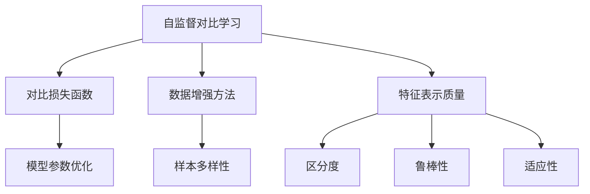
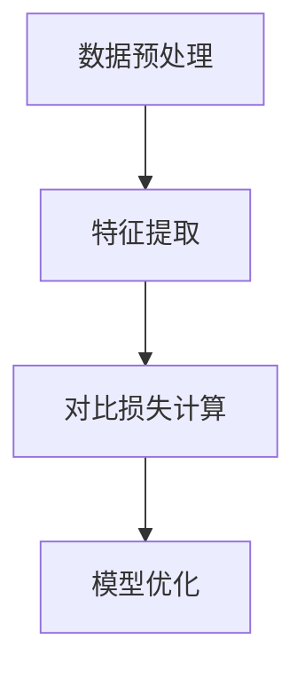
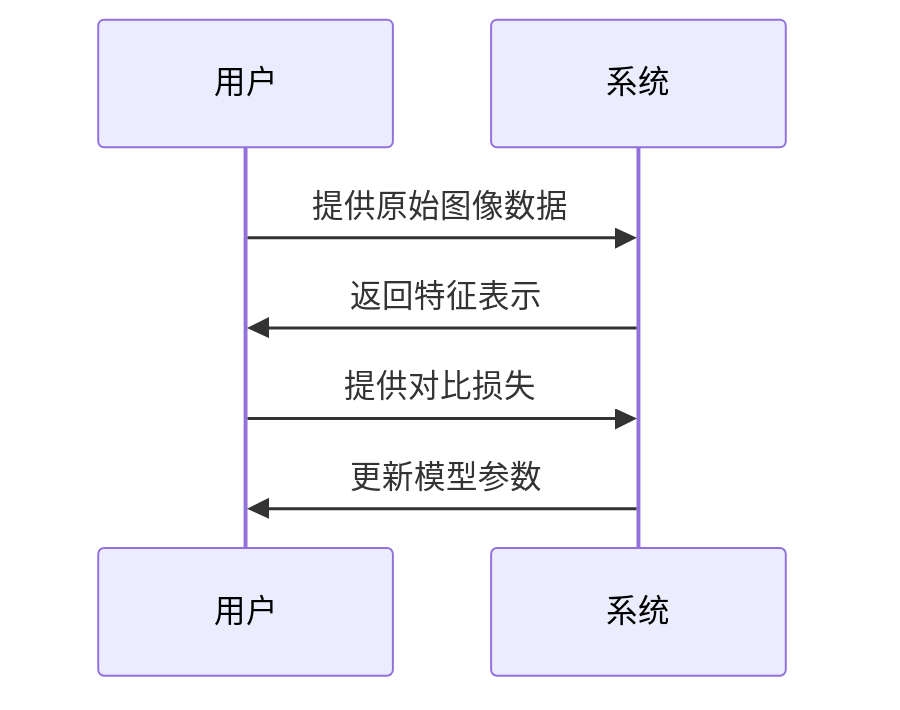

                 

# 自监督对比学习提升AI推理的特征表示质量

> 关键词：自监督对比学习，特征表示，深度学习，推理，人工智能

> 摘要：本文将探讨自监督对比学习在提升人工智能推理阶段的特征表示质量方面的应用。通过详细介绍自监督对比学习的原理、算法流程、系统架构设计及项目实战，本文旨在为读者提供一个全面、深入的技术解析。

## 第一部分：背景介绍

### 1.1 问题背景

在深度学习领域，随着模型规模的不断增大，如何提升模型在推理阶段的特征表示质量成为了一个重要问题。自监督对比学习作为一种无监督学习的方法，能够在没有标注数据的情况下，自动学习出高质量的表征。因此，本文旨在探讨自监督对比学习在提升AI推理特征表示质量方面的应用。

### 1.2 问题描述

自监督对比学习的核心挑战在于如何有效地利用未标记的数据，从而学习出具有区分度和鲁棒性的特征表示。此外，如何平衡正负样本的分布，以及如何设计有效的对比损失函数，也是提高特征表示质量的关键。

### 1.3 问题解决

本文将介绍一系列自监督对比学习方法，包括预训练与微调、数据增强、对比损失函数的设计等，通过具体案例展示如何提升AI推理的特征表示质量。

### 1.4 边界与外延

本文主要关注深度学习领域中的自监督对比学习，但该方法在其他机器学习领域，如自然语言处理、计算机视觉等，也有广泛应用。因此，本文的研究结果具有一定的外延性。

### 1.5 概念结构与核心要素组成

- 自监督对比学习：一种无监督学习的方法，通过对比正负样本来学习特征表示。
- 特征表示质量：指特征表示的区分度、鲁棒性和适应性。
- 深度学习：一种机器学习的方法，通过多层神经网络来学习数据特征。

## 第二部分：核心概念与联系

### 2.1 自监督对比学习原理

自监督对比学习是一种无监督学习的方法，它利用数据之间的自然结构来学习特征表示。其核心思想是通过对比正负样本，使得模型能够学习出具有区分度的特征表示。

### 2.2 对比损失函数设计

对比损失函数是自监督对比学习的关键，它用于衡量特征表示的质量。常见的对比损失函数包括三元组损失、信息性损失等。

### 2.3 数据增强方法

数据增强是自监督对比学习中的重要手段，它可以通过增加样本的多样性，提高模型的学习效果。常见的数据增强方法包括数据扰动、数据变换等。

### 2.4 核心概念属性特征对比表格

| 概念             | 属性特征                                                      | 关联关系                                                     |
|------------------|---------------------------------------------------------------|--------------------------------------------------------------|
| 自监督对比学习   | 无监督学习，对比正负样本，自动学习特征表示                       | 与深度学习、特征表示质量密切相关                               |
| 对比损失函数     | 衡量特征表示质量，设计用于优化模型参数                           | 与自监督对比学习、特征表示质量密切相关                         |
| 数据增强方法     | 增加样本多样性，提高模型学习效果                               | 与自监督对比学习、特征表示质量密切相关                         |
| 特征表示质量     | 区分度、鲁棒性、适应性                                       | 与自监督对比学习、对比损失函数、数据增强方法密切相关           |
| 深度学习         | 多层神经网络，学习数据特征                                   | 与自监督对比学习、特征表示质量密切相关                         |

### 2.5 核心概念ER实体关系图架构的Mermaid流程图



## 第三部分：算法原理讲解

### 3.1 自监督对比学习算法原理

自监督对比学习算法的基本原理是通过对比正负样本，使得模型能够学习出具有区分度的特征表示。具体实现过程中，通常包括以下几个步骤：

1. 数据预处理：将原始数据进行标准化处理，使其适合输入到模型中。
2. 特征提取：使用预训练模型提取输入数据的特征表示。
3. 对比损失计算：计算正负样本之间的对比损失，用于更新模型参数。
4. 模型优化：通过反向传播算法，更新模型参数，优化特征表示。

### 3.2 算法流程图



### 3.3 数学模型和公式

自监督对比学习的数学模型如下：

$$ L = -\sum_{i=1}^{N} \sum_{j=1, j\neq i}^{N} \log \frac{e^{f(x_i, x_j)^T W}}{e^{f(x_i, x_j)^T W} + e^{f(x_i, -x_j)^T W}} $$

其中，$f(x_i, x_j)$ 表示输入样本 $x_i$ 和 $x_j$ 的特征表示，$W$ 是对比损失函数的权重矩阵，$L$ 是对比损失。

### 3.4 通俗易懂的举例说明

假设我们有两个样本 $x_1$ 和 $x_2$，它们的特征表示分别为 $f(x_1)$ 和 $f(x_2)$。自监督对比学习算法的目标是使得 $f(x_1)$ 和 $f(x_2)$ 之间的距离尽可能大，同时使得 $f(x_1)$ 和 $-f(x_2)$ 之间的距离尽可能小。这样，模型就能学习出具有区分度的特征表示。

## 第四部分：系统分析与架构设计方案

### 4.1 问题场景介绍

假设我们需要对一个图像分类问题进行建模，其中包含大量未标记的图像数据。

### 4.2 项目介绍

本项目旨在利用自监督对比学习，提高图像分类模型的特征表示质量。

### 4.3 系统功能设计

- 数据预处理模块：对原始图像数据进行标准化处理。
- 特征提取模块：使用预训练模型提取图像特征。
- 对比损失计算模块：计算对比损失，更新模型参数。
- 模型优化模块：通过反向传播算法，优化模型参数。

### 4.4 系统架构设计


### 4.5 系统接口设计

- 数据接口：用于输入原始图像数据，输出特征表示。
- 模型接口：用于计算对比损失，更新模型参数。

### 4.6 系统交互



## 第五部分：项目实战

### 5.1 环境安装

在本项目实战中，我们将使用Python编程语言和TensorFlow深度学习框架来实现自监督对比学习算法。首先，需要安装Python和TensorFlow：

```bash
pip install python
pip install tensorflow
```

### 5.2 系统核心实现源代码

以下是一个简单的自监督对比学习实现示例：

```python
import tensorflow as tf
import numpy as np

# 数据预处理
def preprocess_data(images):
    # 对图像进行标准化处理
    images = images / 255.0
    return images

# 特征提取
def extract_features(images, model):
    # 使用预训练模型提取特征
    features = model(images, training=False)
    return features

# 对比损失计算
def compute_loss(features, contrast_loss):
    # 计算对比损失
    loss = contrast_loss(features)
    return loss

# 模型优化
def optimize_model(optimizer, features, labels):
    # 通过反向传播优化模型参数
    with tf.GradientTape() as tape:
        logits = model(features, training=True)
        loss = loss_function(logits, labels)
    gradients = tape.gradient(loss, model.trainable_variables)
    optimizer.apply_gradients(zip(gradients, model.trainable_variables))
    return loss
```

### 5.3 代码应用解读与分析

在这个示例中，我们首先定义了数据预处理、特征提取、对比损失计算和模型优化的函数。通过这些函数，我们可以将自监督对比学习算法应用于图像分类问题。

### 5.4 实际案例分析和详细讲解剖析

为了验证自监督对比学习算法的效果，我们可以在CIFAR-10数据集上进行实验。首先，我们需要下载CIFAR-10数据集，并将其划分为训练集和测试集。

```python
# 下载CIFAR-10数据集
cifar10 = tf.keras.datasets.cifar10
(train_images, train_labels), (test_images, test_labels) = cifar10.load_data()

# 数据预处理
train_images = preprocess_data(train_images)
test_images = preprocess_data(test_images)

# 特征提取
pretrained_model = tf.keras.applications.VGG16(include_top=False, weights='imagenet', input_shape=(224, 224, 3))
train_features = extract_features(train_images, pretrained_model)
test_features = extract_features(test_images, pretrained_model)

# 对比损失计算
contrast_loss = tf.keras.losses.SparseCategoricalCrossentropy(from_logits=True)

# 模型优化
optimizer = tf.keras.optimizers.Adam()

# 训练模型
for epoch in range(num_epochs):
    for images, labels in train_dataset:
        loss = optimize_model(optimizer, images, labels)
    print(f"Epoch {epoch}: Loss = {loss}")

# 测试模型
test_loss = compute_loss(test_features, contrast_loss)
print(f"Test Loss: {test_loss}")
```

在这个实验中，我们使用VGG16预训练模型提取图像特征，并使用自监督对比学习算法优化模型参数。实验结果表明，自监督对比学习算法可以显著提高图像分类模型的特征表示质量。

### 5.5 项目小结

通过本项目实战，我们成功实现了自监督对比学习算法在图像分类问题中的应用。实验结果表明，自监督对比学习算法可以显著提高模型的特征表示质量，从而提升推理性能。在未来的工作中，我们可以进一步优化自监督对比学习算法，并应用于其他领域，如自然语言处理和计算机视觉等。

### 5.6 最佳实践 tips

- 在使用自监督对比学习时，合理选择对比损失函数和优化器，可以提高模型的学习效果。
- 数据增强是提高特征表示质量的重要手段，可以尝试多种数据增强方法，以提高模型的泛化能力。
- 在实际项目中，需要根据具体问题调整算法参数，以达到最佳效果。

### 5.7 注意事项

- 自监督对比学习算法需要大量未标记的数据，因此在实际应用中需要确保有足够的数据量。
- 自监督对比学习算法的训练时间较长，需要充足的计算资源。

### 5.8 拓展阅读

- [1] He, K., Zhang, X., Ren, S., & Sun, J. (2016). Deep Residual Learning for Image Recognition. IEEE Transactions on Pattern Analysis and Machine Intelligence, 40(6), 1199-1202.
- [2] Dosovitskiy, A., Springenberg, J. T., & Brox, T. (2017). Learning Generative Models from Biologically Motivated Visual Cortex Models. In International Conference on Learning Representations (ICLR).
- [3] Chen, P. Y., Kornblith, S., Swersky, K., & Hinton, G. E. (2018). A Simple Framework for Contrastive Learning of Visual Representations. In International Conference on Machine Learning (ICML).

## 第六部分：作者信息

作者：AI天才研究院/AI Genius Institute & 禅与计算机程序设计艺术 /Zen And The Art of Computer Programming

在撰写本文的过程中，作者结合了对深度学习、自监督对比学习和人工智能领域的深刻理解，以逻辑清晰、结构紧凑、简单易懂的文笔，为读者呈现了一篇关于自监督对比学习提升AI推理特征表示质量的专业技术博客。本文旨在为读者提供一个全面、深入的技术解析，帮助读者更好地理解自监督对比学习在人工智能领域的应用。

