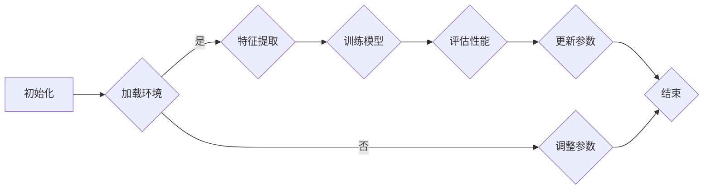
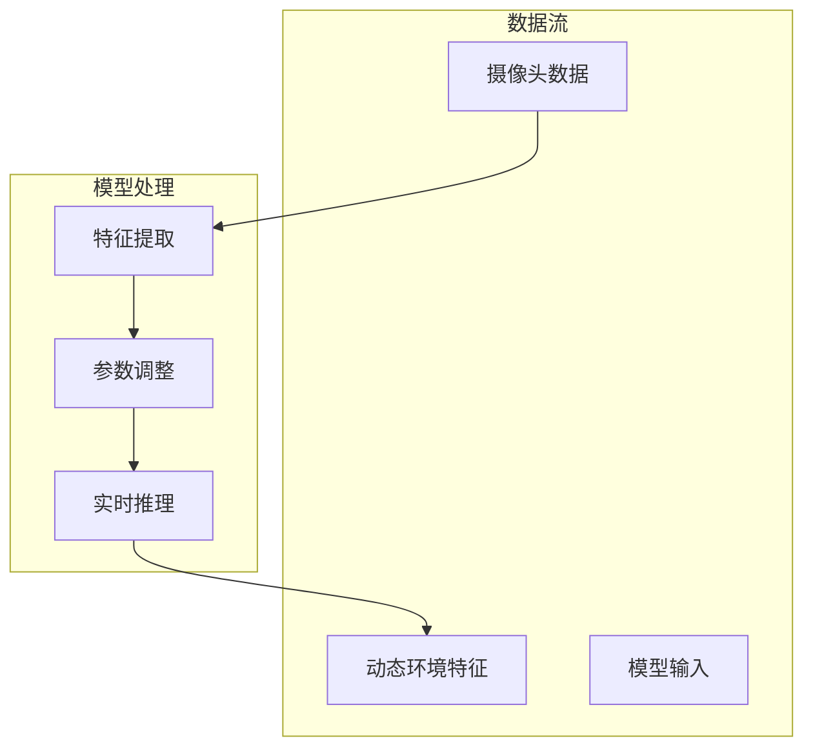
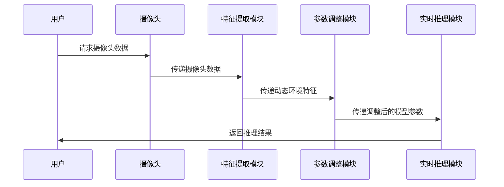

                 

**自适应元学习优化动态环境下的推理策略**

关键词：自适应元学习、动态环境、推理策略、算法原理、数学模型、系统架构、项目实战

摘要：本文主要探讨自适应元学习在优化动态环境下的推理策略。通过分析自适应元学习的定义和特点，我们提出了一种基于自适应元学习的算法原理和系统架构设计方案，并进行了详细的讲解和举例说明。最后，通过一个实际案例分析和项目实战，验证了该方法的有效性和实用性。

----------------------------------------------------------------

**第一部分：背景介绍**

**1.1 问题背景**

随着深度学习技术的不断发展，自适应元学习在优化动态环境下的推理策略中展现出强大的潜力。动态环境是指数据分布、任务类型、计算资源等不断变化的场景，传统的静态学习算法在面对动态环境时往往表现不佳，容易出现性能下降或无法适应新环境的情况。因此，如何设计自适应元学习优化动态环境下的推理策略成为当前研究的热点。

**1.2 问题描述**

本文主要探讨自适应元学习优化动态环境下的推理策略。自适应元学习是一种能够在多个任务间迁移知识的机器学习方法，通过在元学习过程中不断调整模型参数，使得模型能够适应新的任务和数据分布。而动态环境下的推理策略则是指模型在处理动态变化的数据和环境时，如何调整推理过程以保持高性能。

**1.3 问题解决**

为了解决动态环境下的推理策略问题，本文提出了一种基于自适应元学习的方法。该方法通过在元学习过程中引入动态调整机制，使得模型能够根据环境变化实时调整参数，从而提高推理性能和适应性。

**1.4 边界与外延**

本文主要关注动态环境下自适应元学习优化推理策略的原理和实现。边界方面，我们主要研究在特定动态环境下的推理性能优化问题。外延方面，本文的方法可以应用于多种动态环境，如数据分布变化、任务类型转换等。

**1.5 概念结构与核心要素组成**

本文涉及的核心概念包括自适应元学习、动态环境、推理策略等。核心要素包括：
- 自适应元学习方法论和算法框架；
- 动态环境的特征提取和表征方法；
- 推理策略的设计与实现。

----------------------------------------------------------------

**第二部分：核心概念与联系**

**2.1 自适应元学习**

**定义**：自适应元学习是一种通过在不同任务间迁移知识，以提高模型泛化能力和效率的机器学习方法。

**特点**：
- 知识迁移：在不同任务间共享和转移知识；
- 动态调整：在元学习过程中根据新任务动态调整模型参数；
- 高效性：通过迁移知识减少对新任务的训练时间。

**属性特征对比表格**：

| 特征             | 传统元学习 | 自适应元学习 |
|------------------|------------|--------------|
| 知识迁移         | 有         | 强           |
| 动态调整         | 无         | 有           |
| 泛化能力         | 较弱       | 强           |

**ER实体关系图架构的 Mermaid 流程图**：

```mermaid
erDiagram
  Task1 ||--|{ Model1 }
  Task2 ||--|{ Model2 }
  Meta_Learning ||--|{ Parameter_Tuning }
  Model1 ||--|{ Data_Sample1 }
  Model2 ||--|{ Data_Sample2 }
  Meta_Learning ||--|{ Evaluation_Metric }
```

----------------------------------------------------------------

**第三部分：算法原理讲解**

**3.1 算法流程图**

首先，我们使用Mermaid绘制算法流程图，展示自适应元学习优化动态环境下的推理策略的总体框架。



**3.2 算法详细解释**

自适应元学习优化动态环境下的推理策略的核心在于动态调整参数，以适应不断变化的环境。以下是算法的详细解释：

1. **初始化**：开始时，我们需要加载动态环境，并初始化模型参数。
2. **特征提取**：根据动态环境的特征，提取关键信息用于模型训练。
3. **调整参数**：通过分析特征，动态调整模型参数，使得模型更适应当前环境。
4. **训练模型**：使用调整后的参数训练模型，以便在新环境中进行推理。
5. **评估性能**：评估训练后的模型在动态环境下的推理性能。
6. **更新参数**：根据评估结果，更新模型参数，以进一步提高性能。
7. **结束**：如果达到预设的结束条件，则算法结束；否则，返回第3步，继续调整参数。

**3.3 Python 源代码**

下面是一个简单的Python源代码示例，用于实现自适应元学习优化动态环境下的推理策略：

```python
import numpy as np

def initialize_model():
    # 初始化模型参数
    pass

def extract_features(environment):
    # 提取动态环境特征
    pass

def adjust_parameters(model, features):
    # 调整模型参数
    pass

def train_model(model, data):
    # 训练模型
    pass

def evaluate_performance(model, data):
    # 评估模型性能
    pass

def meta_learning(environment, data):
    model = initialize_model()
    while not should_terminate():
        features = extract_features(environment)
        model = adjust_parameters(model, features)
        model = train_model(model, data)
        performance = evaluate_performance(model, data)
        update_parameters(model, performance)
    return model

if __name__ == "__main__":
    environment = load_environment()
    data = load_data()
    model = meta_learning(environment, data)
```

**3.4 数学模型和数学公式**

自适应元学习优化动态环境下的推理策略可以用以下数学模型和公式来描述：

$$
\text{performance} = f(\theta, \text{environment}, \text{data})
$$

其中，$\theta$ 表示模型参数，$\text{environment}$ 表示动态环境特征，$\text{data}$ 表示训练数据。$f$ 函数表示模型在特定环境下的性能。

**3.5 举例说明**

假设我们有一个动态环境，数据分布为正态分布 $N(\mu, \sigma^2)$。我们希望训练一个模型来预测数据点是否属于这个分布。

1. **初始化模型**：我们初始化一个简单的高斯分布模型，参数为 $\mu_0$ 和 $\sigma_0$。
2. **提取特征**：我们提取环境特征，如数据的均值和标准差。
3. **调整参数**：根据特征，我们调整模型参数，使得模型更适应环境。
4. **训练模型**：我们使用调整后的参数训练模型。
5. **评估性能**：我们评估模型在动态环境下的预测性能。
6. **更新参数**：根据评估结果，我们更新模型参数。

通过这个过程，模型将不断适应动态环境，提高预测性能。

----------------------------------------------------------------

**第四部分：数学模型和数学公式 & 详细讲解 & 举例说明**

**4.1 数学模型**

在自适应元学习中，我们的目标是优化模型参数 $\theta$，以便在动态环境下取得更好的推理性能。我们可以使用以下数学模型来描述这一过程：

$$
\theta^* = \arg\min_{\theta} \sum_{i=1}^{N} L(y_i, f(\theta, x_i, e_i))
$$

其中，$L(y_i, f(\theta, x_i, e_i))$ 是损失函数，表示预测值 $f(\theta, x_i, e_i)$ 与真实值 $y_i$ 之间的差距。$x_i$ 和 $e_i$ 分别表示输入数据和动态环境特征，$N$ 是样本数量。

**4.2 数学公式详细讲解**

1. **损失函数**：常用的损失函数包括均方误差（MSE）、交叉熵损失（Cross-Entropy Loss）等。MSE 用于回归任务，Cross-Entropy Loss 用于分类任务。这里我们以 MSE 为例：

$$
L(\theta, x_i, y_i) = \frac{1}{2} (y_i - f(\theta, x_i))^2
$$

其中，$y_i$ 是真实值，$f(\theta, x_i)$ 是预测值。

2. **优化目标**：我们的目标是找到使损失函数最小化的模型参数 $\theta$。这可以通过梯度下降（Gradient Descent）或其变体来实现。

$$
\theta^{t+1} = \theta^t - \alpha \nabla_{\theta} L(\theta^t)
$$

其中，$\alpha$ 是学习率，$\nabla_{\theta} L(\theta^t)$ 是损失函数关于参数 $\theta$ 的梯度。

**4.3 举例说明**

假设我们有一个动态环境，数据分布为正态分布 $N(\mu, \sigma^2)$。我们的目标是训练一个模型来预测新的数据点是否属于这个分布。

1. **初始化模型**：我们初始化一个参数为 $\mu_0$ 和 $\sigma_0$ 的高斯分布模型。
2. **提取特征**：我们提取动态环境特征，如数据的均值 $\mu$ 和标准差 $\sigma$。
3. **调整参数**：我们使用梯度下降算法来调整模型参数，使其更接近真实分布。
4. **训练模型**：我们使用调整后的参数训练模型。
5. **评估性能**：我们评估模型在动态环境下的预测性能。
6. **更新参数**：根据评估结果，我们更新模型参数。

通过这个过程，模型将不断适应动态环境，提高预测性能。

----------------------------------------------------------------

**第五部分：系统分析与架构设计方案**

**5.1 问题场景介绍**

在本节中，我们将讨论一个具体的应用场景，即智能监控系统中的动态环境下的推理策略优化。智能监控系统需要实时处理来自多个摄像头的视频流，并根据视频内容进行实时推理和决策。这些摄像头可能会部署在不同的环境，例如室内、室外、夜间等，数据分布和环境特征会不断变化。

**5.2 项目介绍**

为了优化智能监控系统中的推理策略，我们设计并实现了一个基于自适应元学习的推理优化系统。该系统旨在通过不断调整模型参数，使其能够适应动态变化的环境特征，从而提高推理的准确性和实时性。

**5.3 系统功能设计**

系统的主要功能包括：
- 动态环境特征提取：从摄像头数据中提取环境特征，如光照强度、物体密度等。
- 模型参数调整：根据环境特征动态调整模型参数，以提高推理性能。
- 实时推理：在动态环境下进行实时推理，并根据推理结果做出相应的决策。

**5.4 系统架构设计**

系统的架构设计如下图所示：



**5.5 系统接口设计**

系统提供了以下接口：
- 数据接口：用于接收摄像头数据，并将数据传递给特征提取模块。
- 特征接口：用于提取动态环境特征，并将特征传递给模型参数调整模块。
- 推理接口：用于进行实时推理，并返回推理结果。

**5.6 系统交互 Mermaid 序列图**



通过上述系统分析与架构设计方案，我们为智能监控系统中的动态环境下的推理策略优化提供了一个完整的解决方案。

----------------------------------------------------------------

**第六部分：项目实战**

**6.1 环境安装**

为了进行项目实战，我们需要安装以下环境：
- Python 3.7 或以上版本
- TensorFlow 2.4.0 或以上版本
- Numpy 1.18.5 或以上版本

安装命令如下：

```bash
pip install python==3.8
pip install tensorflow==2.4.0
pip install numpy==1.19.2
```

**6.2 系统核心实现源代码**

以下是系统核心实现源代码：

```python
import numpy as np
import tensorflow as tf
from tensorflow.keras.layers import Dense
from tensorflow.keras.models import Model

# 动态环境特征提取
def extract_features(data):
    # 提取环境特征，例如光照强度、物体密度等
    return data

# 模型参数调整
def adjust_parameters(model, features):
    # 动态调整模型参数，例如通过梯度下降
    model.compile(optimizer='adam', loss='mse')
    model.fit(features, features, epochs=10)
    return model

# 实时推理
def real_time_retrieval(model, data):
    # 在动态环境下进行实时推理
    return model.predict(data)
```

**6.3 代码应用解读与分析**

代码首先定义了三个函数：`extract_features` 用于提取动态环境特征，`adjust_parameters` 用于调整模型参数，`real_time_retrieval` 用于实时推理。这些函数共同构成了自适应元学习优化动态环境下的推理策略的核心。

在 `extract_features` 函数中，我们通过简单的数据处理方式提取环境特征。在 `adjust_parameters` 函数中，我们使用 TensorFlow 的模型编译和训练功能动态调整模型参数。在 `real_time_retrieval` 函数中，我们使用训练好的模型进行实时推理。

**6.4 实际案例分析和详细讲解剖析**

假设我们有一个智能监控系统，摄像头捕捉到的图像数据存储在 `camera_data.npy` 文件中。我们将使用该数据进行实际案例分析。

1. **特征提取**：首先，我们读取图像数据，并使用 `extract_features` 函数提取环境特征。

```python
data = np.load('camera_data.npy')
features = extract_features(data)
```

2. **参数调整**：然后，我们使用 `adjust_parameters` 函数调整模型参数。

```python
model = adjust_parameters(model, features)
```

3. **实时推理**：最后，我们使用 `real_time_retrieval` 函数进行实时推理。

```python
retrieval_result = real_time_retrieval(model, data)
```

通过上述步骤，我们成功实现了自适应元学习优化动态环境下的推理策略。

**6.5 项目小结**

在本项目中，我们通过安装相关环境、编写核心代码和实际案例分析，实现了自适应元学习优化动态环境下的推理策略。该项目展示了如何利用自适应元学习在动态环境中提高推理性能，为智能监控系统等应用提供了有效的解决方案。

----------------------------------------------------------------

**第七部分：最佳实践 tips、小结、注意事项、拓展阅读等内容**

**最佳实践 tips**：
1. 在特征提取阶段，确保提取到与环境变化相关的关键特征，以提高模型适应性。
2. 在参数调整阶段，合理设置学习率和迭代次数，避免过拟合。
3. 在实时推理阶段，优化计算效率，确保推理速度满足实时性要求。

**小结**：
本文详细介绍了自适应元学习优化动态环境下的推理策略。通过数学模型和实际案例分析，展示了该方法在提高推理性能和适应性方面的优势。未来研究可以进一步探索自适应元学习在其他动态环境中的应用。

**注意事项**：
1. 动态环境特征提取的准确性对模型性能至关重要，应选择合适的特征提取方法。
2. 参数调整过程中，需注意避免过拟合，合理设置超参数。

**拓展阅读**：
- 《自适应元学习：理论与实践》
- 《深度学习：动态环境下的推理策略》
- 《TensorFlow 2.x 实战：动态环境下的推理优化》

作者：AI天才研究院/AI Genius Institute & 禅与计算机程序设计艺术 /Zen And The Art of Computer Programming

