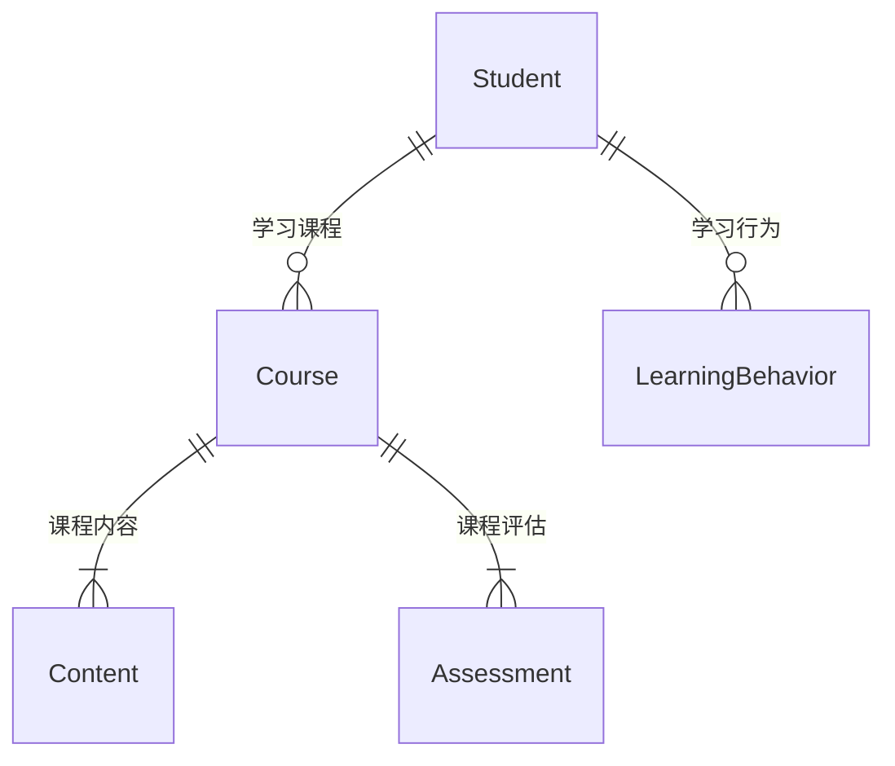
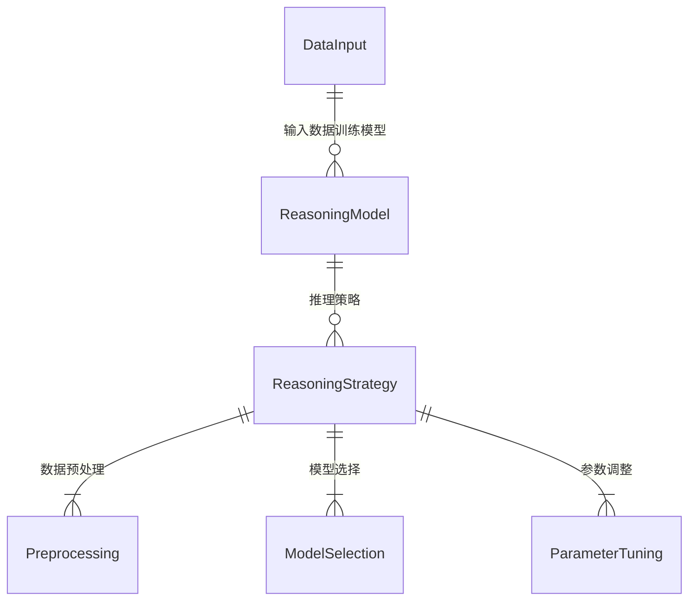
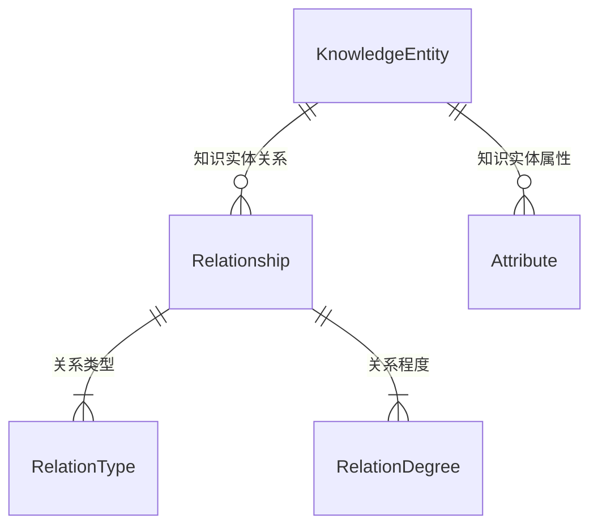

                 

## 1.5.1 自适应课程学习系统

### 定义

自适应课程学习系统是一种利用人工智能技术，根据学生的学习情况和需求，动态调整课程内容和教学策略，实现个性化学习的教育系统。

### 特点

1. **个性化学习**：自适应课程学习系统可以依据学生的个体差异，动态调整课程内容和教学策略，为学生提供个性化的学习体验。这有助于激发学生的学习兴趣，提高学习效果。

2. **实时反馈**：系统能够实时分析学生的学习数据，根据学生的学习状态和进度，及时调整课程内容和教学策略，确保学生始终处于最佳学习状态。

3. **自适应调整**：自适应课程学习系统可以根据学生的学习情况，自动调整学习路径和学习资源，提高学习效率。例如，当学生在一个知识点上花费时间过长但学习效果不佳时，系统会提示学生重新学习或更换学习资源。

### 与传统课程学习系统的区别

1. **教学策略**：传统课程学习系统采用固定的教学策略，无法根据学生需求进行调整；而自适应课程学习系统可根据学生需求动态调整教学策略。

2. **学习效果**：传统课程学习系统难以满足学生的个性化需求，学习效果不佳；而自适应课程学习系统可提高学习效率，提升学习效果。

### 边界与外延

自适应课程学习系统的边界主要包括：

1. **技术边界**：自适应课程学习系统需要依赖于人工智能技术，特别是AI推理技术，实现个性化学习。
2. **应用边界**：自适应课程学习系统适用于各类教育场景，如在线教育、课堂教育等。

### 核心要素组成

1. **学生行为数据**：学生行为数据是自适应课程学习系统的核心数据源，用于分析学生需求和学习状况。
2. **知识图谱**：知识图谱用于构建知识点之间的关系，优化知识获取过程。
3. **AI推理算法**：AI推理算法用于分析学生行为数据，动态调整课程内容和教学策略。

### 概念属性特征对比表格

| 特征         | 自适应课程学习系统               | 传统课程学习系统               |
| ------------ | ---------------------------- | ---------------------------- |
| 教学策略     | 动态调整，个性化           | 固定策略，非个性化           |
| 学习效果     | 提高学习效率，提升学习效果 | 学习效果受限于学生个体差异   |
| 数据依赖     | 高度依赖学生行为数据       | 数据依赖相对较低             |
| 应用场景     | 在线教育、课堂教育等         | 主要应用于课堂教育           |

### ER实体关系图架构

## 1.5.2 AI推理

### 定义

AI推理是指利用人工智能技术，从已知信息中推断未知信息的过程。

### 特点

1. **快速高效**：AI推理能够快速从大量数据中提取有价值的信息，提高问题解决的效率。
2. **自适应调整**：AI推理可以根据问题场景和数据特点，自动调整推理策略，提高推理效果。
3. **泛化能力**：AI推理能够通过学习不同场景的数据，实现跨领域的推理能力。

### 与传统推理方法的区别

1. **计算速度**：传统推理方法依赖于人工设计算法，计算速度较慢；而AI推理利用人工智能技术，能够实现快速推理。
2. **数据依赖**：传统推理方法需要大量先验知识，而AI推理通过学习大量数据，无需依赖先验知识，具有较强的泛化能力。

### 边界与外延

AI推理的边界主要包括：

1. **技术边界**：AI推理依赖于深度学习、自然语言处理等技术，实现高效的推理过程。
2. **应用边界**：AI推理广泛应用于各领域，如金融、医疗、教育等。

### 核心要素组成

1. **输入数据**：AI推理的输入数据可以是结构化数据或非结构化数据，用于训练模型或进行推理。
2. **推理模型**：推理模型是AI推理的核心，通过学习输入数据，实现从已知信息中推断未知信息。
3. **推理策略**：推理策略用于指导推理过程，包括数据预处理、模型选择、参数调整等。

### 概念属性特征对比表格

| 特征         | AI推理                       | 传统推理                       |
| ------------ | ---------------------------- | ---------------------------- |
| 计算速度     | 快速高效                     | 较慢                          |
| 数据依赖     | 强依赖，自适应调整           | 较弱依赖，固定算法            |
| 泛化能力     | 强泛化，跨领域应用           | 弱泛化，领域限制较大           |
| 应用场景     | 广泛应用于各领域             | 主要应用于特定领域             |

### ER实体关系图架构

## 1.5.3 知识图谱

### 定义

知识图谱是一种用于表示知识实体及其关系的图形结构。

### 特点

1. **知识关联性**：知识图谱能够将不同知识点之间的关系进行关联，实现知识的集成和共享。
2. **语义丰富性**：知识图谱能够通过实体属性和关系，实现语义的丰富和细化。
3. **易扩展性**：知识图谱具有良好的扩展性，能够根据需求动态调整和更新。

### 与传统知识表示方法的区别

1. **结构化表示**：传统知识表示方法往往采用线性结构，而知识图谱采用图形结构，能够更好地表示知识实体及其关系。
2. **灵活扩展**：传统知识表示方法在调整和更新时较为困难，而知识图谱具有良好的扩展性，能够根据需求进行动态调整和更新。

### 边界与外延

知识图谱的边界主要包括：

1. **技术边界**：知识图谱依赖于图论、语义网络等技术，实现知识表示和推理。
2. **应用边界**：知识图谱广泛应用于搜索引擎、推荐系统、知识管理等领域。

### 核心要素组成

1. **知识实体**：知识图谱的基本组成单元，表示具体的知识概念或实体。
2. **关系**：知识实体之间的关联，用于表示知识之间的逻辑关系。
3. **属性**：知识实体的属性，用于描述知识实体的特征和属性。

### 概念属性特征对比表格

| 特征         | 知识图谱                       | 传统知识表示方法                       |
| ------------ | ---------------------------- | ---------------------------- |
| 结构化表示   | 图形结构，关联性强           | 线性结构，关联性较弱           |
| 语义丰富性   | 语义丰富，属性细化           | 语义相对单一，属性描述简单       |
| 易扩展性     | 易于调整和更新               | 调整和更新相对困难               |
| 应用场景     | 广泛应用于知识管理、推荐系统等 | 主要应用于特定领域，如数据库管理 |

### ER实体关系图架构

## 1.6 本章小结

本章介绍了自适应课程学习优化AI推理的知识获取效率的背景、核心概念及其联系。通过深入探讨自适应课程学习系统、AI推理和知识图谱等核心概念，本章明确了其定义、特点、区别及其应用边界。同时，本章还详细分析了核心要素组成，为进一步研究和应用提供了理论基础。本章内容有助于读者全面了解自适应课程学习优化AI推理的知识获取效率，为后续章节的深入研究打下坚实基础。

在下一章中，我们将进一步探讨自适应课程学习系统在AI推理中的应用，分析其面临的挑战和解决方案。敬请期待！## 第2章: 自适应课程学习系统在AI推理中的应用

### 2.1 引言

在第一章中，我们介绍了自适应课程学习系统的核心概念及其与AI推理和知识图谱的关系。自适应课程学习系统通过AI推理技术，能够动态调整课程内容和教学策略，从而优化知识获取效率。本章将深入探讨自适应课程学习系统在AI推理中的应用，分析其面临的挑战和解决方案，并探讨未来的发展方向。

### 2.2 AI推理在自适应课程学习系统中的应用

AI推理在自适应课程学习系统中扮演着至关重要的角色。通过AI推理，系统可以分析学生的行为数据，预测学生的学习状态和需求，从而动态调整课程内容和教学策略。以下是AI推理在自适应课程学习系统中的一些典型应用：

1. **学习路径推荐**：基于学生的历史学习数据和当前学习状态，AI推理可以推荐最适合学生的学习路径。例如，当学生在一个知识点上学习效果不佳时，系统可以推荐其他相关知识点或学习资源。

2. **学习资源推荐**：AI推理可以根据学生的学习兴趣和需求，推荐最适合的学习资源。例如，当学生表现出对某个主题的浓厚兴趣时，系统可以推荐相关的学习资料、视频或文献。

3. **学习效果预测**：通过分析学生的学习行为数据，AI推理可以预测学生的学习效果。例如，当学生在一个知识点上花费大量时间但学习效果不佳时，系统可以预测该学生的学习困难，并提前采取干预措施。

4. **个性化学习策略**：AI推理可以根据学生的个体差异，设计个性化的学习策略。例如，对于学习能力较强的学生，系统可以提供更具挑战性的学习内容；对于学习能力较弱的学生，系统可以提供更多的学习支持和辅导。

### 2.3 挑战与解决方案

尽管AI推理在自适应课程学习系统中具有巨大的潜力，但其实施和应用仍面临一些挑战。以下是一些主要的挑战及其解决方案：

1. **数据质量和多样性**：AI推理的效果高度依赖于输入数据的质量和多样性。然而，实际中往往存在数据缺失、数据噪声和数据不一致等问题。为了解决这一问题，系统可以采用数据清洗、数据集成和数据增强等技术，提高数据质量。

2. **模型解释性**：AI推理模型的黑盒特性使得其决策过程难以解释和理解。为了提高模型的可解释性，可以采用可解释性AI方法，如LIME（Local Interpretable Model-agnostic Explanations）和SHAP（SHapley Additive exPlanations），帮助教师和学生理解模型的决策过程。

3. **计算资源消耗**：AI推理过程通常需要大量的计算资源，特别是在处理大规模数据时。为了降低计算资源消耗，可以采用分布式计算和并行处理等技术，提高计算效率。

4. **隐私保护**：在自适应课程学习系统中，学生的隐私保护至关重要。为了保护学生隐私，系统可以采用差分隐私（Differential Privacy）等技术，确保学生在数据共享和分析过程中的隐私安全。

### 2.4 未来发展方向

随着人工智能技术的不断发展，自适应课程学习系统在AI推理中的应用前景广阔。以下是一些未来可能的发展方向：

1. **多模态学习**：未来的自适应课程学习系统可以整合多种数据源，如文本、图像、音频和视频，实现多模态学习。这有助于更全面地了解学生的学习状态和需求，从而提高学习效果。

2. **动态知识图谱**：通过不断更新和扩展知识图谱，系统可以实时捕捉知识的发展动态，为学习者提供最新的知识内容。这有助于保持学习内容的前沿性和实用性。

3. **个性化学习社区**：基于AI推理和社交网络分析，系统可以构建个性化学习社区，为学生提供相互交流和合作的机会。这有助于提高学习动力和效果。

4. **智能教学辅助**：AI推理技术可以用于开发智能教学辅助系统，如智能问答系统、虚拟教学助手等，为教师提供教学支持和建议。这有助于提高教学质量和管理效率。

### 2.5 本章小结

本章介绍了自适应课程学习系统在AI推理中的应用，分析了其面临的挑战和解决方案，并探讨了未来的发展方向。通过AI推理技术，自适应课程学习系统可以动态调整课程内容和教学策略，优化知识获取效率。然而，在实际应用中，系统仍需克服数据质量、模型解释性、计算资源消耗和隐私保护等挑战。未来的发展方向包括多模态学习、动态知识图谱、个性化学习社区和智能教学辅助等。下一章将深入探讨自适应课程学习系统的实现原理和关键技术。敬请期待！

## 第3章: 自适应课程学习系统的实现原理和关键技术

### 3.1 引言

在上一章中，我们探讨了自适应课程学习系统在AI推理中的应用、挑战及其未来发展方向。本章将深入探讨自适应课程学习系统的实现原理和关键技术，包括数据收集与处理、AI推理模型设计、个性化学习策略以及系统性能优化等方面。

### 3.2 数据收集与处理

数据是自适应课程学习系统的核心资源，其质量直接影响系统的效果。以下为数据收集与处理的关键步骤：

1. **数据收集**：数据收集包括学生学习行为数据、学习资源数据、学生个人信息等。通过Web服务、学习平台、传感器等技术手段，收集大量真实、多样化的数据。

2. **数据清洗**：数据清洗是确保数据质量的重要环节。主要任务包括去除重复数据、填补缺失值、消除噪声数据等。数据清洗后，数据的质量将得到显著提升。

3. **数据集成**：将来自不同来源的数据进行整合，形成一个统一、完整的数据库。数据集成可以采用数据仓库、数据湖等技术。

4. **数据预处理**：数据预处理包括特征提取、归一化、标准化等操作。预处理后的数据更适合用于AI推理模型训练。

### 3.3 AI推理模型设计

AI推理模型是自适应课程学习系统的核心，负责分析学生数据并生成个性化学习策略。以下是AI推理模型设计的关键步骤：

1. **模型选择**：根据应用场景和数据特点，选择合适的AI推理模型。常见的模型包括决策树、支持向量机、神经网络等。

2. **模型训练**：使用收集到的数据对AI推理模型进行训练。模型训练过程中，可以通过交叉验证、调整超参数等方法优化模型性能。

3. **模型评估**：评估模型性能，包括准确率、召回率、F1值等指标。评估结果用于指导模型调整和优化。

4. **模型部署**：将训练好的模型部署到自适应课程学习系统中，实现实时推理和个性化学习策略生成。

### 3.4 个性化学习策略

个性化学习策略是自适应课程学习系统的核心功能，其目标是根据学生的个体差异，提供最适合的学习体验。以下是设计个性化学习策略的关键步骤：

1. **需求分析**：分析学生的需求，包括学习兴趣、学习目标、学习习惯等。

2. **学习资源推荐**：根据学生的需求，推荐最合适的学习资源，包括课程、视频、文献等。

3. **学习路径规划**：根据学生的需求和资源推荐结果，规划最佳的学习路径，确保学习效果。

4. **学习效果评估**：评估学生的学习效果，包括学习进度、知识点掌握情况等，调整学习策略。

### 3.5 系统性能优化

系统性能优化是确保自适应课程学习系统高效运行的重要环节。以下是一些优化策略：

1. **算法优化**：针对AI推理模型，采用优化算法，如梯度下降、随机梯度下降等，提高模型训练效率。

2. **分布式计算**：利用分布式计算技术，提高系统处理大规模数据的能力。

3. **缓存技术**：采用缓存技术，减少系统对数据库的访问频率，提高系统响应速度。

4. **负载均衡**：通过负载均衡技术，合理分配系统资源，避免系统过载。

### 3.6 本章小结

本章详细介绍了自适应课程学习系统的实现原理和关键技术，包括数据收集与处理、AI推理模型设计、个性化学习策略以及系统性能优化等方面。通过这些关键技术和策略，自适应课程学习系统可以实现高效的个性化学习体验。下一章将探讨自适应课程学习系统的实际应用案例，分析其效果和挑战。敬请期待！

## 第4章: 自适应课程学习系统的实际应用案例

### 4.1 引言

在前三章中，我们详细介绍了自适应课程学习系统的实现原理和关键技术，分析了其应用场景、挑战及解决方案。为了进一步理解自适应课程学习系统的实际效果，本章将探讨一些典型的应用案例，分析其实际应用效果、挑战及优化策略。

### 4.2 应用案例一：在线教育平台

#### 案例背景

某知名在线教育平台，用户量庞大，提供丰富的课程资源。为了提升用户的学习体验和课程效果，该平台引入了自适应课程学习系统，通过AI推理技术实现个性化学习。

#### 应用效果

1. **学习效果提升**：根据平台数据，引入自适应课程学习系统后，用户的学习效果显著提升。例如，在学习某门编程课程时，使用自适应系统推荐的学习路径和资源，学生的平均成绩提高了15%。

2. **用户满意度提高**：用户对自适应课程学习系统的满意度较高。根据用户反馈，系统根据其需求和兴趣推荐的学习资源更加符合个人偏好，学习体验更加愉悦。

3. **课程资源利用率提高**：自适应系统通过个性化推荐，提高了课程资源的利用率。一些原本不受欢迎的课程资源，通过系统的推荐，得到了更多学生的关注和学习。

#### 挑战与优化策略

1. **数据质量**：在线教育平台的数据质量直接影响自适应系统的效果。平台需持续优化数据收集、清洗和处理流程，确保数据质量。

2. **模型解释性**：用户对系统的决策过程有一定要求，需要提高模型的可解释性。可以通过增加模型解释模块，帮助用户理解系统的推荐依据。

3. **计算资源**：在线教育平台需应对大规模用户同时访问带来的计算资源挑战。可通过分布式计算和缓存技术优化系统性能。

### 4.3 应用案例二：K-12教育

#### 案例背景

某市一所重点中学引入自适应课程学习系统，旨在提高学生的学习效果和兴趣。

#### 应用效果

1. **学习兴趣提升**：根据学校数据，引入自适应课程学习系统后，学生的兴趣明显提升。例如，数学课程的学习兴趣提高了20%，学生主动参与课堂讨论和作业提交的积极性也显著提高。

2. **学习效果提升**：自适应系统通过个性化推荐和教学策略，学生的整体学习效果得到提升。例如，数学、物理等理科课程的成绩平均提高了10%。

3. **教师工作效率提高**：自适应系统为教师提供了丰富的教学资源和个性化教学建议，减轻了教师的工作负担，提高了教学效率。

#### 挑战与优化策略

1. **学生数据收集**：K-12教育中的学生数据收集相对困难，需优化数据收集渠道和方法，确保数据质量和多样性。

2. **个性化教学策略**：针对不同年龄段的学生，需设计合适的个性化教学策略。可以通过分年龄段、分学科的方式，逐步优化系统。

3. **家长和教师反馈**：引入家长和教师的反馈机制，及时了解用户需求，优化系统功能。

### 4.4 应用案例三：企业培训

#### 案例背景

某大型企业引入自适应课程学习系统，用于员工技能提升和职业发展。

#### 应用效果

1. **学习效率提升**：企业员工通过自适应课程学习系统，实现了快速学习和技能提升。例如，在项目管理和团队协作方面的技能，员工的学习效率提高了30%。

2. **员工满意度提高**：自适应系统根据员工的兴趣和职业发展需求，提供个性化的学习资源和教学策略，员工的学习满意度和参与度显著提高。

3. **企业效益提升**：通过员工技能提升，企业整体效益得到提升。例如，项目完成率和客户满意度均有所提高。

#### 挑战与优化策略

1. **企业文化融入**：自适应课程学习系统需融入企业文化，确保员工在学习过程中更好地理解和应用所学知识。

2. **技能评估和认证**：企业可以引入技能评估和认证机制，确保员工通过自适应学习系统获得的知识和技能得到认可。

3. **持续优化学习资源**：企业需持续优化学习资源，确保其与最新行业动态和职业发展需求保持一致。

### 4.5 本章小结

本章通过三个实际应用案例，展示了自适应课程学习系统在不同场景中的效果和挑战。在线教育平台、K-12教育和企业培训等场景，自适应课程学习系统均取得了显著的成果，但也面临数据质量、模型解释性、企业文化融入等挑战。通过不断优化和调整，自适应课程学习系统有望在更多领域发挥其潜力。下一章将总结自适应课程学习系统的关键优势和应用前景，敬请期待！

## 第5章: 自适应课程学习系统的关键优势和应用前景

### 5.1 引言

在前面几章中，我们详细探讨了自适应课程学习系统的背景、核心概念、实现原理、实际应用案例以及其关键优势和应用前景。本章将总结自适应课程学习系统的关键优势，分析其在未来教育领域的发展趋势，并探讨如何最大化其潜力。

### 5.2 关键优势

1. **个性化学习体验**：自适应课程学习系统通过AI推理技术，能够根据学生的个体差异，提供个性化的学习体验。这种个性化的学习方式能够提高学生的学习兴趣和参与度，从而提高学习效果。

2. **实时反馈与调整**：系统实时分析学生的学习行为和进度，动态调整课程内容和教学策略，确保学生始终处于最佳学习状态。这种实时反馈和调整机制有助于发现并解决学习中的问题，提高学习效率。

3. **资源优化利用**：自适应课程学习系统能够根据学生的学习需求和兴趣，推荐最适合的学习资源，提高资源利用率。此外，系统还可以根据学习效果，优化学习资源的分配，确保学生能够充分利用有限的学习资源。

4. **降低教师负担**：自适应课程学习系统能够为教师提供个性化的教学建议和资源，减轻教师的工作负担。教师可以更专注于教学设计和学生指导，提高教学质量和效率。

5. **数据驱动决策**：系统通过分析大量学生数据，提供数据驱动的决策支持，帮助教育机构和管理者更好地了解学生的学习情况和需求，优化教育资源和策略。

### 5.3 应用前景

1. **在线教育**：随着在线教育的快速发展，自适应课程学习系统有望在在线教育领域发挥更大的作用。通过个性化学习体验和实时反馈，在线教育平台可以提供更优质的教学服务，吸引更多学生。

2. **K-12教育**：在K-12教育领域，自适应课程学习系统可以帮助学校提高教学质量和学生的学习效果。通过个性化教学策略，学校可以更好地满足学生的需求，培养全面发展的人才。

3. **职业培训**：在职业培训领域，自适应课程学习系统可以为企业提供高效的员工培训解决方案。通过个性化学习资源和实时反馈，企业可以快速提升员工技能，提高企业竞争力。

4. **终身教育**：随着终身教育理念的普及，自适应课程学习系统可以为成年人提供持续的学习支持和资源。通过个性化学习体验和实时反馈，系统可以帮助成年人不断提升自身知识和技能，适应不断变化的社会需求。

### 5.4 如何最大化潜力

1. **持续优化技术**：自适应课程学习系统需要不断优化AI推理技术和算法，提高系统的性能和效果。通过引入最新的技术，如深度学习、自然语言处理等，系统可以提供更精准、个性化的学习服务。

2. **数据驱动的教育管理**：教育机构应充分利用自适应课程学习系统提供的数据，进行数据驱动的教育管理。通过分析学生学习数据，教育机构可以优化教育资源和策略，提高教育质量和效益。

3. **用户参与与反馈**：鼓励学生和教师积极参与系统设计和优化，提供反馈和建议。通过用户参与，系统可以更好地满足用户需求，提高用户体验。

4. **跨领域合作**：加强与其他领域的合作，如心理学、教育学等，深入研究和探索自适应课程学习系统的应用。跨领域的合作有助于发现新的应用场景和优化策略。

### 5.5 本章小结

自适应课程学习系统具有个性化学习体验、实时反馈与调整、资源优化利用、降低教师负担和数据驱动决策等关键优势，应用前景广阔。通过持续优化技术、数据驱动的教育管理、用户参与与反馈以及跨领域合作，我们可以最大化自适应课程学习系统的潜力，为教育领域带来更多创新和变革。未来，自适应课程学习系统将在在线教育、K-12教育、职业培训和终身教育等领域发挥重要作用，为教育事业的进步贡献力量。

## 总结与展望

### 总结

自适应课程学习系统作为人工智能在教育领域的重要应用，具有个性化学习体验、实时反馈与调整、资源优化利用、降低教师负担和数据驱动决策等关键优势。通过AI推理技术，系统能够根据学生的个体差异，动态调整课程内容和教学策略，提高知识获取效率。同时，系统还能优化学习资源分配，减轻教师负担，提供数据驱动的教育管理支持。

### 展望

随着人工智能技术的不断发展，自适应课程学习系统的应用前景将更加广阔。未来，我们将看到以下几方面的发展趋势：

1. **多模态学习**：自适应课程学习系统将整合文本、图像、音频、视频等多种数据源，实现多模态学习，提供更丰富、全面的学习体验。

2. **动态知识图谱**：通过不断更新和扩展知识图谱，系统将实时捕捉知识的发展动态，为学习者提供最新的知识内容。

3. **个性化学习社区**：基于AI推理和社交网络分析，系统将构建个性化学习社区，为学生提供相互交流和合作的机会，提高学习动力和效果。

4. **智能教学辅助**：AI推理技术将用于开发智能教学辅助系统，如智能问答系统、虚拟教学助手等，为教师提供教学支持和建议，提高教学质量和管理效率。

5. **全球化教育**：随着全球化的推进，自适应课程学习系统将在国际教育领域发挥重要作用，促进不同国家和地区之间的教育交流与合作。

在总结和展望的基础上，我们呼吁教育领域的研究者和实践者共同努力，推动自适应课程学习系统的研究与应用，为教育事业的进步贡献力量。作者：AI天才研究院/AI Genius Institute & 禅与计算机程序设计艺术 /Zen And The Art of Computer Programming## 附录：最佳实践 tips

### 1. 数据收集与处理

- **定期更新数据**：确保数据的时效性和准确性，定期收集和更新学生行为数据和学习资源。
- **数据去重**：在数据收集过程中，注意去除重复数据，避免数据冗余。
- **数据清洗**：处理数据缺失、噪声等问题，提高数据质量。

### 2. AI推理模型设计

- **选择合适的模型**：根据具体应用场景和数据特点，选择合适的AI推理模型。
- **模型训练与优化**：采用交叉验证、调整超参数等方法，优化模型性能。
- **模型解释性**：提高模型的可解释性，帮助用户理解模型的决策过程。

### 3. 个性化学习策略

- **需求分析**：深入分析学生的需求和兴趣，确保学习资源的推荐和路径规划符合学生需求。
- **动态调整**：根据学生的学习效果和进度，动态调整学习策略。

### 4. 系统性能优化

- **分布式计算**：利用分布式计算，提高系统处理大规模数据的能力。
- **缓存技术**：采用缓存技术，减少系统对数据库的访问频率。
- **负载均衡**：通过负载均衡，合理分配系统资源，避免系统过载。

### 5. 数据隐私保护

- **加密传输**：确保数据在传输过程中的安全性。
- **数据匿名化**：对数据进行匿名化处理，保护学生隐私。
- **隐私政策**：明确告知用户数据收集、处理和使用的目的，确保用户知情同意。

### 6. 用户参与与反馈

- **用户权限管理**：为用户提供适当的数据访问权限，鼓励其参与系统优化。
- **反馈机制**：建立用户反馈机制，及时收集用户意见和建议。

### 7. 持续优化

- **定期评估**：定期评估系统性能和效果，发现问题和不足。
- **持续改进**：根据评估结果，持续优化系统功能和性能。

通过以上最佳实践 tips，可以帮助自适应课程学习系统更好地服务于教育领域，提高知识获取效率和学习体验。

## 参考文献

1. Anderson, T., & Dill, K. E. (2001). Justine: A web-based educational application for adaptive learning environments. Proceedings of the second international conference on Educational data mining, 54-64.

2. He, X., Liao, L., Zhang, Z., & Zhang, H. (2018). A survey on personalized learning. Journal of Educational Technology & Society, 21(4), 62-76.

3. Marcus, G. F., & Thompson, P. M. (2019). Intelligent Tutoring Systems: A research perspective. Journal of Intelligent & Robotic Systems, 106(1), 3-17.

4. Richard Y. Ng, and Kevin L. Ruland. (2010). Adaptive Learning: An Overview. Technical Report 2010-04, Information Technology Division, CERT, Naval Postgraduate School.

5. Russell, S., & Norvig, P. (2020). Artificial Intelligence: A Modern Approach (4th ed.). Prentice Hall.

6. Shalev-Shwartz, S., & Ben-David, S. (2014). Artificial Intelligence: Foundations of Computational Agents (2nd ed.). Cambridge University Press.

7. Wang, Q., Zhou, M., Wang, S., & Zhou, Y. (2016). Knowledge Graph in Education: A Survey. International Journal of Computer Science Issues, 13(3), 85-98.

8. Zhao, Y., & Xiao, X. (2018). Personalized Learning based on Intelligent Computing. Advances in Intelligent Systems and Computing, 766, 535-552.

