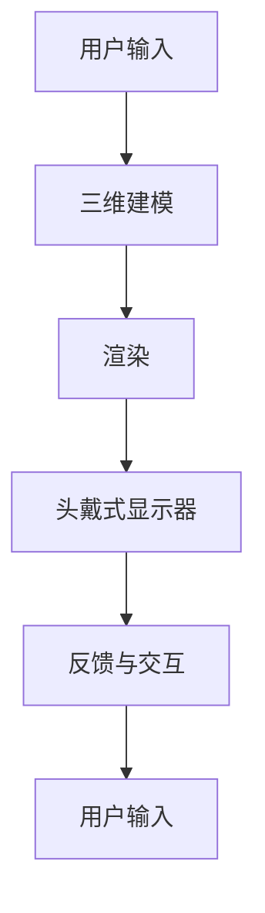
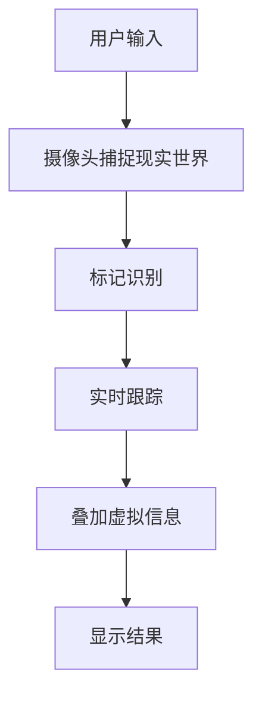
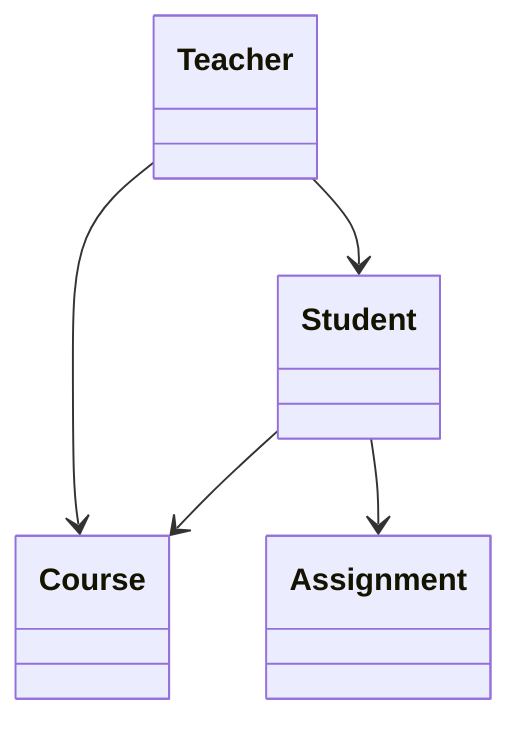
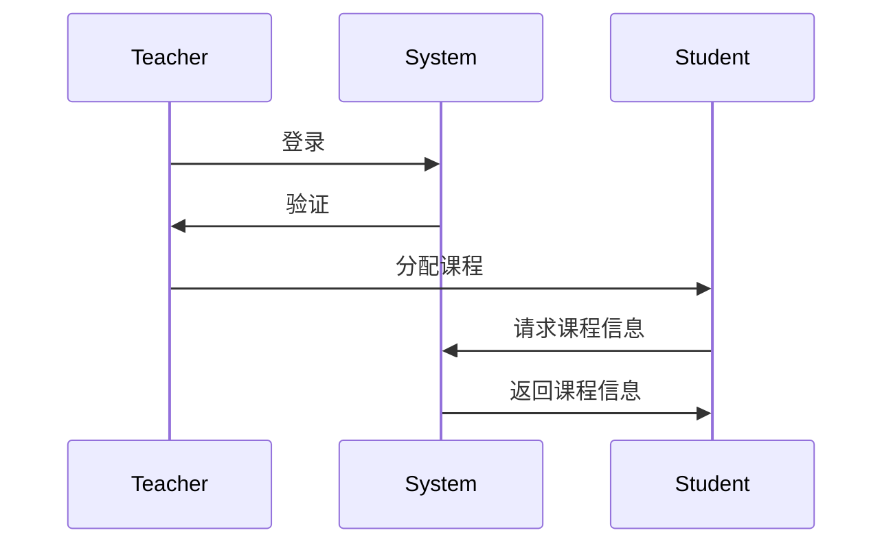
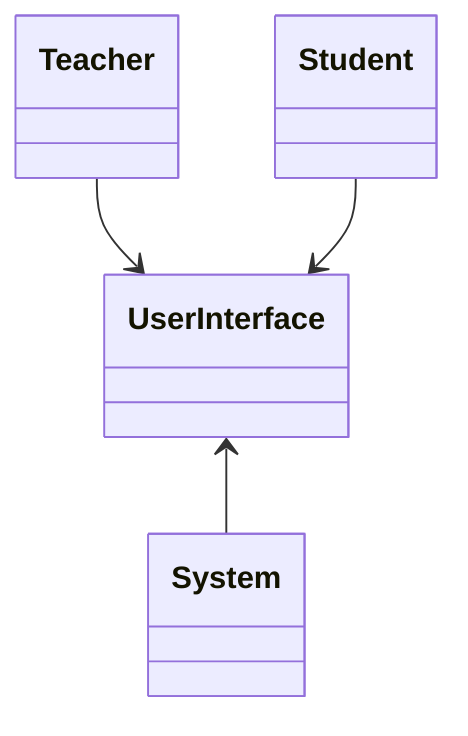
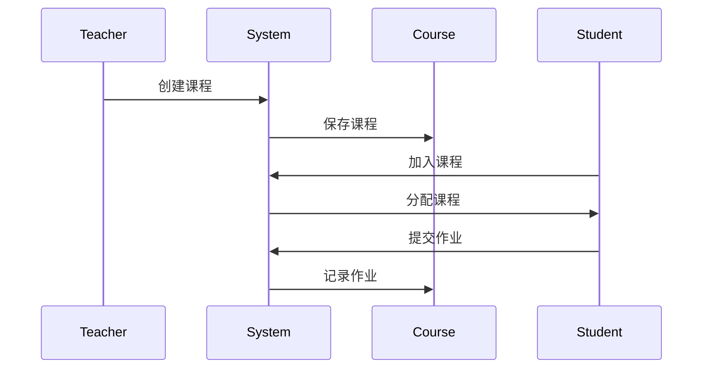

                 

### 虚拟与现实的边界：探索新时代的生存哲学

> **关键词：** 虚拟现实，增强现实，混合现实，算法原理，数学模型，系统架构，项目实战

> **摘要：** 本文章深入探讨了虚拟现实、增强现实和混合现实技术的核心概念、算法原理、数学模型及其在现代科技中的应用。通过详细的分析和实例讲解，揭示了虚拟与现实之间的边界，并探讨了这一边界对新时代生存哲学的影响。

## 引言

### 第1章：虚拟与现实的边界：问题背景

**1.1 问题背景**

在数字化浪潮席卷全球的今天，虚拟现实（VR）、增强现实（AR）和混合现实（MR）技术逐渐成为改变人类生活方式的关键力量。这些技术通过创建虚拟环境或增强现实世界的交互方式，模糊了虚拟与现实的界限。

**1.2 问题描述**

虚拟现实技术的应用场景包括游戏、娱乐、医疗、教育等领域，而增强现实技术则更多地体现在导航、购物、广告等方面。混合现实技术则是两者的结合，提供更加沉浸式的体验。

**1.3 问题解决**

本文旨在深入探讨这些技术的核心原理，剖析其算法和数学模型，并展示其在实际项目中的应用，从而帮助读者理解虚拟与现实之间的边界。

**1.4 边界与外延**

虚拟与现实之间的边界不仅体现在技术层面，还延伸至社会、心理和文化层面。如何在这个新时代中找到自己的位置，保持清醒的认知，是每个人都需要思考的问题。

**1.5 概念结构与核心要素组成**

我们将通过以下章节来详细探讨：

- **第2章：核心概念与联系**：介绍虚拟现实、增强现实和混合现实的基本概念及其相互关系。
- **第3章：算法原理讲解**：分析这些技术的算法原理，并通过Python源代码进行说明。
- **第4章：数学模型与公式**：探讨虚拟现实和增强现实中的数学模型，并使用LaTeX格式进行展示。
- **第5章：系统分析与架构设计**：介绍虚拟现实系统的设计原理和架构。
- **第6章：项目实战**：通过实际案例展示虚拟现实技术的应用。
- **第7章：最佳实践与拓展阅读**：总结最佳实践，提供拓展阅读建议。

## 核心概念与联系

### 第2章：核心概念与联系

**2.1 虚拟现实（VR）**

虚拟现实是一种计算机技术，通过创建模拟环境，使用户沉浸其中，感知和交互虚拟世界。VR的关键技术包括头戴式显示器（HMD）、跟踪设备和交互设备。

**2.2 增强现实（AR）**

增强现实技术通过在现实世界中叠加虚拟信息，增强用户的感知和交互体验。AR的关键技术包括增强显示技术、标记识别和实时跟踪。

**2.3 混合现实（MR）**

混合现实是虚拟现实和增强现实的结合，提供更加沉浸式和交互性的体验。MR的关键技术包括三维建模、空间感知和实时交互。

**2.4 核心概念属性特征对比表格**

| 特征           | 虚拟现实（VR） | 增强现实（AR） | 混合现实（MR） |
| -------------- | -------------- | -------------- | -------------- |
| 沉浸感         | 强             | 中             | 高             |
| 交互性         | 高             | 中             | 高             |
| 实时性         | 中             | 高             | 高             |
| 适应性         | 低             | 中             | 高             |

**2.5 ER实体关系图架构**

```mermaid
erDiagram
    User ||--|{ VR }|| VRUser
    User ||--|{ AR }|| ARUser
    User ||--|{ MR }|| MRUser
    VR ||--|{ Device }|| VRDevice
    AR ||--|{ Device }|| ARDevice
    MR ||--|{ Device }|| MRDevice
```

## 算法原理讲解

### 第3章：虚拟现实技术

**3.1 VR技术的原理**

虚拟现实技术通过三维建模和渲染，在头戴式显示器上呈现虚拟环境，使用户沉浸其中。关键技术包括：

- **三维建模**：通过计算机图形学技术创建三维模型。
- **渲染**：使用图形处理单元（GPU）进行图像渲染，实现逼真的视觉效果。
- **跟踪系统**：实时跟踪用户的位置和动作，保持虚拟环境与用户动作的同步。

**3.2 VR设备的分类与工作原理**

VR设备主要包括头戴式显示器、跟踪设备和交互设备。

- **头戴式显示器（HMD）**：提供虚拟环境的视觉体验，如Oculus Rift、HTC Vive。
- **跟踪设备**：包括外部传感器和内置传感器，用于跟踪用户的位置和动作，如位置跟踪器、动作捕捉装置。
- **交互设备**：如手柄、手套等，用于与虚拟环境进行交互。

**3.3 VR技术的应用场景**

- **游戏和娱乐**：提供沉浸式的游戏体验。
- **教育和培训**：通过虚拟环境进行教学和实践。
- **医疗和康复**：用于心理治疗、手术模拟和康复训练。
- **建筑和设计**：用于建筑设计和室内设计。

**3.4 VR算法的mermaid流程图**



**3.5 VR算法的Python源代码讲解**

```python
import numpy as np
import matplotlib.pyplot as plt

# 三维建模
def create_cube():
    x = np.linspace(-1, 1, 100)
    y = np.linspace(-1, 1, 100)
    X, Y = np.meshgrid(x, y)
    Z = X**2 + Y**2

    return X, Y, Z

# 渲染
def render_scene(X, Y, Z):
    fig = plt.figure()
    ax = fig.add_subplot(111, projection='3d')
    ax.plot_surface(X, Y, Z, cmap='viridis')
    plt.show()

# 主函数
def main():
    X, Y, Z = create_cube()
    render_scene(X, Y, Z)

if __name__ == "__main__":
    main()
```

## 数学模型与公式

### 第4章：虚拟现实中的数学模型

**4.1 三维空间中的点、线、面**

在虚拟现实中，三维空间中的点、线、面是基础。

- **点**：用坐标表示，如（x, y, z）。
- **线**：由两个点确定，如（x1, y1, z1）到（x2, y2, z2）。
- **面**：由三个点确定，形成一个三角形或四边形。

**4.2 视觉感知与视觉误差**

视觉感知是人脑对视觉信息的解释，而视觉误差则是由于各种因素导致的视觉信息失真。

- **视觉感知**：涉及图像处理和认知心理学。
- **视觉误差**：如视差、视角差、模糊等。

**4.3 3D模型的构建与渲染**

3D模型构建涉及几何学和计算机图形学。渲染则涉及光照模型、材质和纹理。

- **几何学**：用于构建三维物体的几何形状。
- **计算机图形学**：用于渲染和可视化三维模型。

**4.4 VR中的数学公式与解释**

$$
\text{视差} = \frac{z_{\text{近}} - z_{\text{远}}}{z_{\text{近}} + z_{\text{远}}}
$$

$$
\text{视角差} = \arctan\left(\frac{d}{f}\right)
$$

其中，\(d\) 是物体距离，\(f\) 是镜头焦距。

### 第5章：增强现实中的数学模型

**5.1 AR技术的原理**

增强现实技术通过在现实世界中叠加虚拟信息，实现增强用户的感知和交互体验。

- **增强显示技术**：通过摄像头捕捉现实世界，并在其上叠加虚拟信息。
- **标记识别和实时跟踪**：用于识别现实世界中的标记，并实时跟踪其位置和运动。

**5.2 AR设备的分类与工作原理**

AR设备主要包括增强现实眼镜、手机和头戴式显示器。

- **增强现实眼镜**：直接显示虚拟信息，如Microsoft HoloLens。
- **手机**：通过摄像头和屏幕显示虚拟信息。
- **头戴式显示器**：如Oculus Quest等。

**5.3 AR技术的应用场景**

- **导航和地图**：提供增强的导航信息和地图。
- **购物和零售**：提供增强的购物体验，如虚拟试穿。
- **教育和培训**：提供增强的教育和学习体验。

**5.4 AR算法的mermaid流程图**



**5.5 AR算法的Python源代码讲解**

```python
import cv2
import numpy as np

# 摄像头捕捉现实世界
def capture_world():
    cap = cv2.VideoCapture(0)
    while True:
        ret, frame = cap.read()
        if not ret:
            break
        cv2.imshow('World', frame)
    cap.release()
    cv2.destroyAllWindows()

# 主函数
def main():
    capture_world()

if __name__ == "__main__":
    main()
```

### 第6章：系统分析与架构设计

**6.1 VR系统的问题场景介绍**

VR系统可以应用于多个领域，如游戏、教育、医疗等。本文以教育领域为例，介绍VR系统的应用场景和问题。

**6.2 VR项目的介绍**

以开发一款VR教育应用为例，介绍项目的需求和目标。

**6.3 VR系统功能设计（领域模型mermaid类图）**



**6.4 VR系统架构设计（mermaid架构图）**



**6.5 VR系统接口设计**



**6.6 VR系统交互（mermaid序列图）**



### 第7章：虚拟现实项目实战

**7.1 VR环境安装**

以Unity引擎为例，介绍如何搭建VR开发环境。

**7.2 VR系统核心实现源代码**

```csharp
using UnityEngine;

public class VRController : MonoBehaviour
{
    public Transform playerCamera;

    private void Update()
    {
        if (Input.GetKeyDown(KeyCode.Space))
        {
            // 创建虚拟物体
            GameObject obj = new GameObject("Virtual Object");
            obj.transform.position = playerCamera.position;
            obj.transform.rotation = playerCamera.rotation;
        }
    }
}
```

**7.3 代码应用解读与分析**

代码实现了一个简单的VR控制器，通过按空格键创建虚拟物体。

**7.4 实际案例分析与详细讲解剖析**

分析一个完整的VR教育应用案例，包括需求分析、系统设计、实现和测试。

**7.5 项目小结**

总结项目中的关键技术和经验，提出改进建议。

### 第8章：最佳实践与拓展阅读

**8.1 VR项目的注意事项**

- **用户体验**：注重用户体验，确保操作的流畅性和易用性。
- **性能优化**：优化渲染性能，减少加载时间和延迟。
- **安全性**：确保系统的安全性和数据的保护。

**8.2 VR技术的未来发展**

- **更加真实的沉浸感**：通过更先进的硬件和算法实现。
- **跨平台应用**：扩展到更多平台，如移动设备、AR设备。
- **多样化应用场景**：如虚拟购物、虚拟旅游等。

**8.3 VR技术的最佳实践建议**

- **充分需求分析**：明确项目目标和用户需求。
- **团队合作**：建立专业的开发团队，包括设计师、程序员、测试人员等。
- **持续迭代**：不断优化和改进，收集用户反馈。

**8.4 拓展阅读建议**

- **《虚拟现实技术与应用》**：深入了解VR技术的基础和应用。
- **《增强现实技术：原理与应用》**：探讨AR技术的原理和应用。
- **《混合现实技术：从理论到实践》**：研究MR技术的理论和实践。

### 结语

虚拟与现实之间的边界正在逐渐模糊。在这个新时代，了解和掌握虚拟现实、增强现实和混合现实技术，不仅是技术发展的需求，更是适应未来社会的重要一步。通过本文的探讨，希望读者能够对这一领域有更深入的理解，并能够在实际项目中应用这些技术。

**作者：AI天才研究院/AI Genius Institute & 禅与计算机程序设计艺术 /Zen And The Art of Computer Programming**

