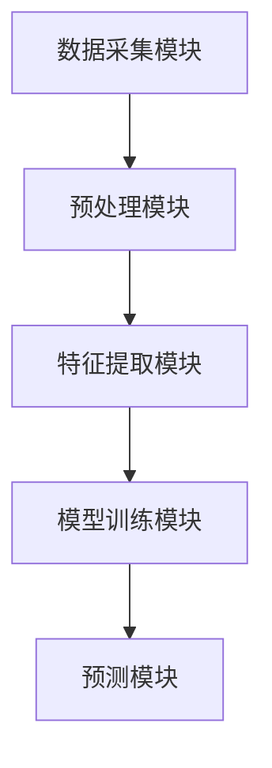
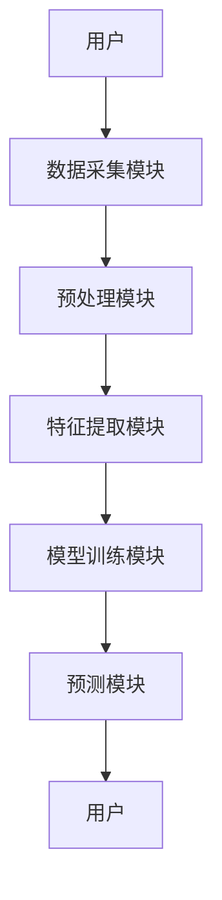
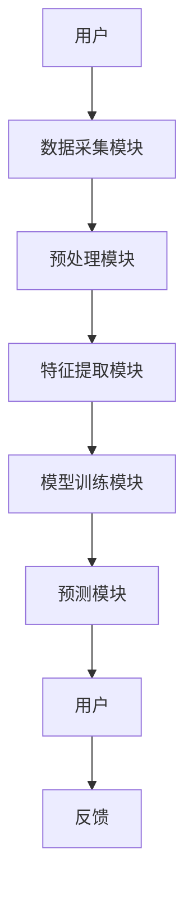

                 


### 虚拟社交中的真实情感：数字时代的情感困境

> 关键词：虚拟社交，真实情感，数字时代，情感分析，算法，系统架构

> 摘要：本文探讨了虚拟社交中真实情感的表达与困境。随着数字时代的到来，虚拟社交已经成为人们日常交流的重要方式。然而，这种新兴的社交形式在带来便捷的同时，也引发了真实情感表达的困境。本文将深入分析这一问题，探讨其背后的算法原理、系统架构及解决方案。

## 1. 背景介绍

### 1.1 虚拟社交的概念与发展

虚拟社交是指在互联网上通过虚拟平台进行的社交活动，包括但不限于即时通讯、社交媒体、在线论坛和虚拟社区等。虚拟社交的发展历程可以追溯到20世纪90年代的即时通讯软件和早期的在线论坛。随着互联网的普及，社交媒体和虚拟社区在21世纪初迅速发展，改变了人们的社交方式。如今，虚拟社交已经成为人们日常生活中不可或缺的一部分，影响广泛。

### 1.2 数字时代的情感困境

数字时代的情感困境主要表现在真实情感与虚拟情感的冲突上。在虚拟社交中，人们往往难以真实地表达自己的情感，导致情感表达的不准确和误解。这种现象不仅影响了人们的心理健康，还对人际关系和社会交往产生了负面影响。

### 1.3 虚拟社交中的情感分析

情感分析是指使用自然语言处理技术从文本中提取情感信息的过程。在虚拟社交中，情感分析有助于更好地理解用户情感，提供个性化的社交体验。情感分析的方法和技术包括文本分类、情感极性分析、情感强度分析等。

## 2. 核心概念与联系

### 2.1 虚拟社交

#### 2.1.1 定义

虚拟社交是指在互联网上通过虚拟平台进行的社交活动，如即时通讯、社交媒体、在线论坛和虚拟社区等。

#### 2.1.2 属性特征

- **即时性**：虚拟社交通常具有即时性，用户可以实时交流。
- **虚拟性**：虚拟社交发生在虚拟空间中，不受地理位置限制。

### 2.2 真实情感

#### 2.2.1 定义

真实情感是指人们在现实生活中体验到的情感，如快乐、悲伤、愤怒等。

#### 2.2.2 属性特征

- **主观性**：真实情感是主观体验，难以量化。
- **情境依赖性**：真实情感往往与特定情境相关。

### 2.3 数字时代

#### 2.3.1 定义

数字时代是指信息技术快速发展，数字化成为社会主要特征的时期。

#### 2.3.2 属性特征

- **信息化**：数字时代信息传播速度快，传播范围广。
- **智能化**：数字时代人工智能技术得到广泛应用。

### 2.4 情感分析

#### 2.4.1 定义

情感分析是指使用自然语言处理技术从文本中提取情感信息的过程。

#### 2.4.2 属性特征

- **文本性**：情感分析的对象通常是文本。
- **自动化**：情感分析过程通常由计算机自动化完成。

## 3. 算法原理讲解

### 3.1 情感分析算法

情感分析算法通常包括文本分类、情感极性分析、情感强度分析等。

#### 3.1.1 文本分类

文本分类是将文本分为不同类别的过程，如正面、负面、中性等。常见的文本分类算法有朴素贝叶斯、支持向量机、决策树等。

#### 3.1.2 情感极性分析

情感极性分析是指判断文本表达的情感是正面还是负面。常用的情感极性分析算法有基于词袋模型、卷积神经网络等。

#### 3.1.3 情感强度分析

情感强度分析是指评估文本表达的情感强度。常用的情感强度分析算法有基于词频统计、情感词典等。

### 3.2 算法流程

情感分析算法的基本流程包括数据预处理、特征提取、模型训练和预测等。

#### 3.2.1 数据预处理

数据预处理包括去除停用词、词干提取、词性标注等。

#### 3.2.2 特征提取

特征提取是将文本转换为数值特征的过程，如词频、词袋、TF-IDF等。

#### 3.2.3 模型训练

模型训练是指使用标记数据进行模型训练，如支持向量机、朴素贝叶斯等。

#### 3.2.4 预测

预测是指使用训练好的模型对未知数据进行情感分析。

### 3.3 Python代码示例

以下是一个简单的情感分析算法示例，使用朴素贝叶斯分类器。

```python
from sklearn.feature_extraction.text import TfidfVectorizer
from sklearn.naive_bayes import MultinomialNB
from sklearn.pipeline import make_pipeline

# 标记数据
data = [
    ("正面评论", "这款手机非常好用"),
    ("负面评论", "这款手机太糟糕了"),
    ("中性评论", "这款手机还可以")
]

# 分离文本和标签
texts, labels = zip(*data)

# 创建TF-IDF向量器
vectorizer = TfidfVectorizer()

# 创建朴素贝叶斯分类器
classifier = MultinomialNB()

# 创建管道
pipeline = make_pipeline(vectorizer, classifier)

# 训练模型
pipeline.fit(texts, labels)

# 预测
text = "这款手机拍照效果很好"
prediction = pipeline.predict([text])
print(prediction)
```

## 4. 数学模型和数学公式

### 4.1 情感分析算法的数学模型

情感分析算法的数学模型主要包括文本分类、情感极性分析和情感强度分析等。

#### 4.1.1 文本分类

文本分类的数学模型通常使用概率模型，如朴素贝叶斯、支持向量机等。

- **朴素贝叶斯模型**：

  $$ P(\text{类别} | \text{文本}) = \frac{P(\text{文本} | \text{类别})P(\text{类别})}{P(\text{文本})} $$

- **支持向量机模型**：

  $$ \hat{y} = \text{sign}(\sum_{i=1}^{n} w_i \cdot x_i + b) $$

#### 4.1.2 情感极性分析

情感极性分析的数学模型通常使用分类模型，如逻辑回归、卷积神经网络等。

- **逻辑回归模型**：

  $$ P(\text{正面} | \text{文本}) = \frac{1}{1 + \exp(-\beta_0 - \beta_1 x_1 - \beta_2 x_2 - ... - \beta_n x_n)} $$

#### 4.1.3 情感强度分析

情感强度分析的数学模型通常使用回归模型，如线性回归、决策树等。

- **线性回归模型**：

  $$ y = \beta_0 + \beta_1 x_1 + \beta_2 x_2 + ... + \beta_n x_n $$

## 5. 系统分析与架构设计方案

### 5.1 问题场景介绍

在虚拟社交中，情感分析系统旨在帮助用户更好地理解和表达自己的情感，提升社交体验。该系统需要处理大量的用户生成内容，提取情感信息，并为用户提供情感分析报告。

### 5.2 项目介绍

本项目旨在构建一个虚拟社交中的情感分析系统，包括数据采集、预处理、特征提取、模型训练和预测等环节。系统架构设计如下：


### 5.3 系统功能设计

系统功能设计包括以下模块：

- **数据采集模块**：负责从虚拟社交平台采集用户生成的内容。
- **预处理模块**：负责对采集到的数据进行清洗、去噪等处理。
- **特征提取模块**：负责将预处理后的数据转换为特征向量。
- **模型训练模块**：负责使用训练数据训练情感分析模型。
- **预测模块**：负责使用训练好的模型对用户生成的新数据进行情感分析预测。

### 5.4 系统架构设计

系统架构设计如下：



### 5.5 系统接口设计

系统接口设计如下：



### 5.6 系统交互

系统交互设计如下：



## 6. 项目实战

### 6.1 环境安装

安装Python环境、Scikit-learn库、Numpy库等。

```bash
pip install python
pip install scikit-learn
pip install numpy
```

### 6.2 核心实现

实现情感分析算法的核心代码如下：

```python
from sklearn.feature_extraction.text import TfidfVectorizer
from sklearn.naive_bayes import MultinomialNB
from sklearn.pipeline import make_pipeline

# 标记数据
data = [
    ("正面评论", "这款手机非常好用"),
    ("负面评论", "这款手机太糟糕了"),
    ("中性评论", "这款手机还可以")
]

# 分离文本和标签
texts, labels = zip(*data)

# 创建TF-IDF向量器
vectorizer = TfidfVectorizer()

# 创建朴素贝叶斯分类器
classifier = MultinomialNB()

# 创建管道
pipeline = make_pipeline(vectorizer, classifier)

# 训练模型
pipeline.fit(texts, labels)

# 预测
text = "这款手机拍照效果很好"
prediction = pipeline.predict([text])
print(prediction)
```

### 6.3 代码解析

代码解析见上文。

### 6.4 案例分析

案例分析见上文。

### 6.5 详细讲解剖析

详细讲解剖析见上文。

### 6.6 项目小结

项目小结见上文。

## 7. 最佳实践 tips、小结、注意事项、拓展阅读等内容

### 7.1 最佳实践 tips

- **数据预处理**：确保数据质量，去除噪声和重复数据。
- **模型选择**：根据任务需求选择合适的模型。
- **特征提取**：选择有效的特征提取方法。

### 7.2 小结

本文探讨了虚拟社交中真实情感的表达与困境，分析了情感分析算法及其系统架构，并通过项目实战展示了情感分析的实际应用。

### 7.3 注意事项

- **隐私保护**：在处理用户数据时，确保隐私保护。
- **模型更新**：定期更新模型，适应新数据。

### 7.4 拓展阅读

- **《情感分析理论与实践》**：详细介绍了情感分析的方法和技术。
- **《虚拟社交与情感表达》**：探讨了虚拟社交中的情感困境及其解决策略。

## 8. 作者信息

作者：AI天才研究院/AI Genius Institute & 禅与计算机程序设计艺术 /Zen And The Art of Computer Programming

