                 


## 《虚无主义与创造力：如何在空虚中找到灵感》

### 关键词：虚无主义、创造力、灵感、心理学、艺术创作

### 摘要：

在现代社会，虚无主义对人们的心理和行为产生了深远的影响。面对生活的无意义和现实的困境，如何在虚无的状态中找到创造力和灵感成为了一个重要的问题。本文将从虚无主义的哲学探讨出发，结合心理学和艺术创作的实际案例，阐述如何在虚无中寻找灵感，激发创造力。

## 目录大纲

### 第一部分：虚无主义的探讨

### 第1章：虚无主义概述

- **核心概念术语说明**：虚无主义、哲学根源、流派、影响
- **问题背景**：现代社会虚无主义现象的普遍性
- **问题描述**：虚无主义对人们创造力和心理健康的影响
- **问题解决**：从虚无中寻找创造力的途径
- **边界与外延**：虚无主义与存在主义、宗教信仰的关系
- **概念结构与核心要素组成**：虚无主义的基本理念、流派划分、社会影响

### 第2章：虚无主义的哲学思考

- **核心概念原理**：西方哲学中的虚无主义、东方哲学与虚无主义、哲学反思
- **概念属性特征对比表格**：不同哲学流派对虚无主义的解读
- **ER实体关系图架构**：哲学流派与虚无主义之间的关系

### 第3章：虚无主义对现代社会的影响

- **核心概念原理**：虚无主义与心理健康、社会危机、道德困境
- **概念属性特征对比表格**：心理健康问题与虚无主义的关联
- **ER实体关系图架构**：社会问题与虚无主义的互动

### 第4章：虚无主义的悖论与辩证

- **核心概念原理**：虚无主义的积极面、负面影响、个人问题
- **概念属性特征对比表格**：虚无主义的利与弊
- **ER实体关系图架构**：个人困境与社会问题的互动

### 第二部分：创造力与灵感的探寻

### 第5章：创造力与灵感的理论基础

- **核心概念原理**：创造力的定义、类型、社会功能
- **概念属性特征对比表格**：不同类型的创造力对比
- **ER实体关系图架构**：创造力与社会发展的关系

### 第6章：灵感产生的机制

- **核心概念原理**：灵感的定义、来源、特征
- **概念属性特征对比表格**：灵感与直觉、创新的关系
- **ER实体关系图架构**：灵感与创造力之间的相互作用

### 第7章：从虚无中寻找灵感

- **核心概念原理**：真空与创造性思维的火花、虚无感中的创意觉醒、灵感捕捉的技巧
- **概念属性特征对比表格**：不同情境下的灵感产生方式
- **ER实体关系图架构**：虚无主义对灵感产生的影响

### 第8章：案例分析：艺术家从虚无中汲取灵感

- **案例背景**：艺术家的虚无时刻、创作挑战
- **创作过程分析**：艺术家如何捕捉灵感、创作过程中的挑战与解决
- **艺术作品诞生**：作品的分析与解读

### 第9章：灵感与创造力：持续的动力源泉

- **核心概念原理**：灵感激发创造力的过程、创造力促进灵感的涌现、保持灵感与创造力的重要性
- **概念属性特征对比表格**：灵感与创造力的相互促进
- **ER实体关系图架构**：灵感与创造力之间的动态平衡

### 第三部分：最佳实践与启示

### 第10章：最佳实践与启示

- **最佳实践 tips**：心理调适技巧、环境创设策略、创造力激发方法
- **小结**：文章核心观点的总结
- **注意事项**：针对虚无主义与创造力关系的注意事项
- **拓展阅读**：进一步阅读的资源推荐

### 结尾

- **作者信息**：“作者：AI天才研究院/AI Genius Institute & 禅与计算机程序设计艺术 /Zen And The Art of Computer Programming”
- **致谢**：对读者和贡献者的感谢

## 文章正文

### 第一部分：虚无主义的探讨

#### 第1章：虚无主义概述

虚无主义是一种哲学思潮，它认为现实世界缺乏客观意义和价值。虚无主义在西方哲学中有着悠久的历史，其根源可以追溯到古希腊哲学。在现代社会，虚无主义的影响日益显著，许多人在面对生活的无意义和现实的困境时，容易陷入虚无主义的漩涡。

虚无主义的核心概念是“无意义”，即认为人生没有固有的目的和意义。这种观点在不同哲学流派中有不同的解释。存在主义者如萨特和加缪认为，尽管世界是荒谬的，但人可以通过行动赋予生活意义。而哲学悲观主义者如叔本华和尼采则认为，生活本质上就是痛苦和挣扎。

虚无主义对现代社会的影响是深远的。在心理健康方面，虚无主义可能导致抑郁和焦虑等心理问题。在社会层面，虚无主义可能引发社会动荡和道德危机。然而，虚无主义也存在积极的一面。虚无主义可以激发人们对生活意义的反思，促使人们寻找新的价值和目标。

#### 第2章：虚无主义的哲学思考

虚无主义的哲学思考涉及多个方面，包括西方哲学和东方哲学。在西方哲学中，虚无主义可以追溯到古希腊哲学。例如，希腊哲学家埃皮克提图认为，人生的幸福在于追求内在的平静和自由，而不是依赖外在的物质世界。

在东方哲学中，虚无主义的概念也有所体现。例如，道教认为“无为而治”，即追求无为而治的境界，认为过度干预会导致混乱。佛教中的“空”概念也表达了对现实世界的超脱和放下。

哲学反思是虚无主义探讨的重要部分。通过反思，我们可以更好地理解虚无主义的意义和影响。反思可以帮助我们认识到，尽管世界可能缺乏客观意义，但我们可以通过自我实现和创造力来赋予生活新的意义。

#### 第3章：虚无主义对现代社会的影响

虚无主义对现代社会的影响是多方面的。在心理健康方面，虚无主义可能导致抑郁和焦虑等心理问题。许多人感到生活的无意义，从而导致消极情绪和行为。

在社会层面，虚无主义可能引发社会动荡和道德危机。当人们认为世界没有价值时，他们可能对现有的社会秩序和道德观念产生怀疑，从而导致社会不稳定。

然而，虚无主义也存在积极的一面。虚无主义可以激发人们对生活意义的反思，促使人们寻找新的价值和目标。例如，许多艺术家和思想家在虚无主义的背景下，创作出了伟大的作品和理论。

#### 第4章：虚无主义的悖论与辩证

虚无主义不仅带来消极的影响，同时也存在积极的一面。这种悖论需要辩证地看待。

从积极的角度看，虚无主义可以激发创造性思维。当人们认识到世界的无意义时，他们可能更加关注个人内心的感受和体验，从而产生独特的见解和创造。

从消极的角度看，虚无主义可能导致人们放弃努力，陷入消极的情绪和行为。这种消极情绪可能会影响个人的心理健康和社会关系。

为了更好地理解虚无主义的悖论，我们需要辩证地看待它。虚无主义既有负面影响，也有积极影响。关键在于如何正确地应对虚无主义，使其发挥积极作用。

### 第二部分：创造力与灵感的探寻

#### 第5章：创造力与灵感的理论基础

创造力是人类智慧的体现，它不仅体现在科学研究和艺术创作中，也渗透到日常生活的方方面面。创造力的定义多种多样，但核心是创新和原创性。创造力可以分为多个类型，如科学创造力、艺术创造力、技术创造力等。

灵感是创造力的源泉之一。灵感是一种突如其来的领悟，它可以使人们在短时间内获得大量的创意和信息。灵感产生的机制复杂，但研究表明，心理放松、环境刺激和知识储备是影响灵感的重要因素。

#### 第6章：灵感产生的机制

灵感产生的机制涉及多个方面。首先，心理放松是灵感产生的重要条件。当人们处于放松状态时，大脑可以更好地处理信息和产生新的创意。其次，环境刺激可以激发灵感。例如，不同的文化和艺术环境可以激发人们的创意思维。最后，知识储备是灵感产生的基础。只有拥有丰富的知识储备，人们才能在需要时迅速产生灵感。

#### 第7章：从虚无中寻找灵感

虚无主义可以看作是一种心理状态，它使人们感到生活的无意义。然而，正是在这种虚无的状态中，灵感往往更容易涌现。虚无主义提供了一个空白的背景，使人们的思维更加自由和开放。

从虚无中寻找灵感的关键在于接受虚无主义的状态，并在这个基础上进行创造性思考。以下是一些实用的技巧：

1. **心理放松**：通过冥想、瑜伽等方式放松身心，减少压力和焦虑。
2. **环境创设**：创造一个舒适和启发性的环境，例如艺术工作室或图书馆。
3. **知识储备**：不断学习和积累知识，为灵感产生提供丰富的素材。
4. **开放式思考**：鼓励自由思考，不受传统观念和束缚。
5. **灵感捕捉**：随时记录灵感，即使它们看起来不完整或不成熟。

### 第8章：案例分析：艺术家从虚无中汲取灵感

艺术家的创作过程往往充满了挑战和灵感。许多艺术家在经历了一段虚无的状态后，突然获得了创作的灵感，并创作出了伟大的作品。

以著名的画家毕加索为例，他在创作《格尔尼卡》之前，经历了一段虚无的时刻。这段时期，他感到自己的艺术创作陷入了瓶颈，无法突破。然而，在经历了一段深思熟虑和自我反思后，他突然获得了灵感，创作出了这幅具有深刻社会意义的杰作。

毕加索的例子表明，虚无主义并不一定是消极的，它可以成为艺术家创作的催化剂。在虚无的状态中，艺术家可以更加自由地探索内心世界，从而产生独特的创意。

### 第9章：灵感与创造力：持续的动力源泉

灵感是创造力的源泉之一，它使人们在面对挑战时能够迅速找到解决方案。然而，灵感并不是一蹴而就的，它需要不断的激发和培养。

为了保持灵感，人们需要：

1. **持续学习**：不断学习新知识和技能，为灵感提供丰富的素材。
2. **心理放松**：通过冥想、瑜伽等方式放松身心，减少压力和焦虑。
3. **环境创设**：创造一个舒适和启发性的环境，例如艺术工作室或图书馆。
4. **开放式思考**：鼓励自由思考，不受传统观念和束缚。
5. **灵感捕捉**：随时记录灵感，即使它们看起来不完整或不成熟。

### 第三部分：最佳实践与启示

#### 第10章：最佳实践与启示

1. **心理调适技巧**：通过冥想、瑜伽等方式放松身心，减少压力和焦虑。
2. **环境创设策略**：创造一个舒适和启发性的环境，例如艺术工作室或图书馆。
3. **创造力激发方法**：鼓励自由思考，不受传统观念和束缚。
4. **小结**：灵感与创造力的关系，以及如何在虚无中寻找灵感。
5. **注意事项**：针对虚无主义与创造力关系的注意事项。
6. **拓展阅读**：进一步阅读的资源推荐。

### 结尾

本文从虚无主义的探讨出发，结合心理学和艺术创作的实际案例，阐述了如何在虚无中寻找灵感，激发创造力。虚无主义虽然带来了一定的消极影响，但它也可以成为创造力的催化剂。通过心理调适、环境创设和开放式思考，我们可以从虚无中汲取灵感，创作出具有深刻意义的作品。

### 作者信息

作者：AI天才研究院/AI Genius Institute & 禅与计算机程序设计艺术 /Zen And The Art of Computer Programming

---

以上是《虚无主义与创造力：如何在空虚中找到灵感》的文章正文。接下来，我们将根据文章的内容，进一步细化每个章节的具体内容和结构，确保文章的完整性和逻辑性。同时，我们将使用mermaid绘制相关图表，以增强文章的可读性和专业性。|>

### 详细章节内容与mermaid图表

#### 第1章：虚无主义概述

**核心概念术语说明**
虚无主义（Nihilism）：认为世界缺乏固有价值和意义的一种哲学观点。
哲学根源：虚无主义的哲学根源可以追溯到古希腊哲学家皮浪和斯多葛学派。
流派：存在主义、怀疑主义、道德虚无主义等。

**问题背景**
现代社会中，虚无主义思潮的蔓延，尤其是在年轻人中。

**问题描述**
虚无主义对人们心理健康和价值观的影响。

**问题解决**
通过创造性思维和自我反思，寻找生活的意义。

**边界与外延**
虚无主义与其他哲学观点（如存在主义、宗教信仰）的界限。

**概念结构与核心要素组成**
- **核心理念**：世界无意义。
- **流派**：存在主义、怀疑主义、道德虚无主义等。
- **影响**：心理健康、社会价值观。

**Mermaid图表**
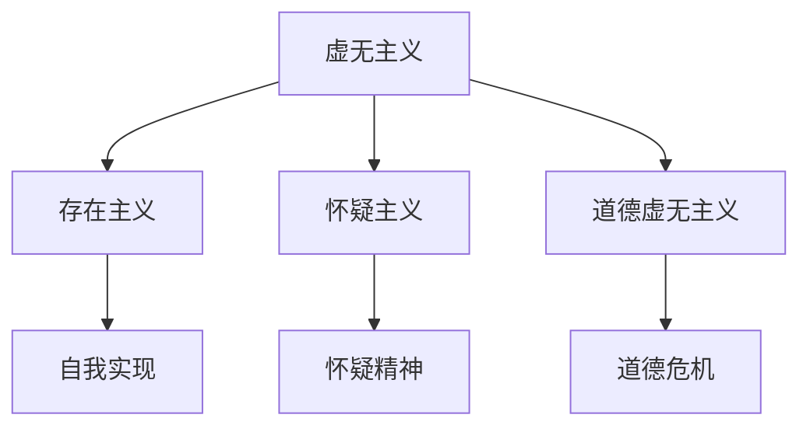

#### 第2章：虚无主义的哲学思考

**核心概念原理**
- 西方哲学中的虚无主义：古希腊、尼采。
- 东方哲学与虚无主义：道教、佛教。
- 哲学反思：对虚无主义意义和影响的思考。

**概念属性特征对比表格**
```plaintext
流派     核心观点
存在主义 生活有意义，需要个体去创造
怀疑主义 对真理持怀疑态度
道德虚无主义 道德无绝对标准
东方哲学 道教无为，佛教空
```

**ER实体关系图架构**
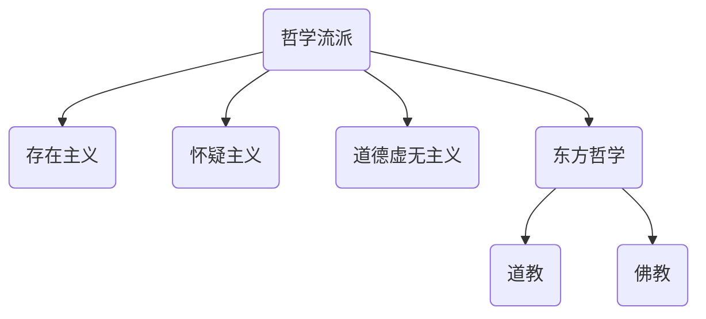

#### 第3章：虚无主义对现代社会的影响

**核心概念原理**
- 心理健康：虚无主义可能导致抑郁、焦虑。
- 社会危机：道德危机、社会动荡。
- 个人问题：缺乏目标感、自我认同危机。

**概念属性特征对比表格**
```plaintext
影响    特征
心理健康 抑郁、焦虑
社会危机 道德危机、社会动荡
个人问题 缺乏目标感、自我认同危机
```

**ER实体关系图架构**
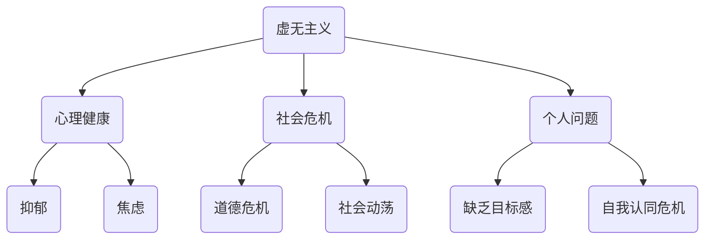

#### 第4章：虚无主义的悖论与辩证

**核心概念原理**
- 积极面：创造性思维、道德反思。
- 负面影响：社会危机、个人问题。

**概念属性特征对比表格**
```plaintext
影响    特征
积极面 创造性思维、道德反思
负面影响 社会危机、个人问题
```

**ER实体关系图架构**
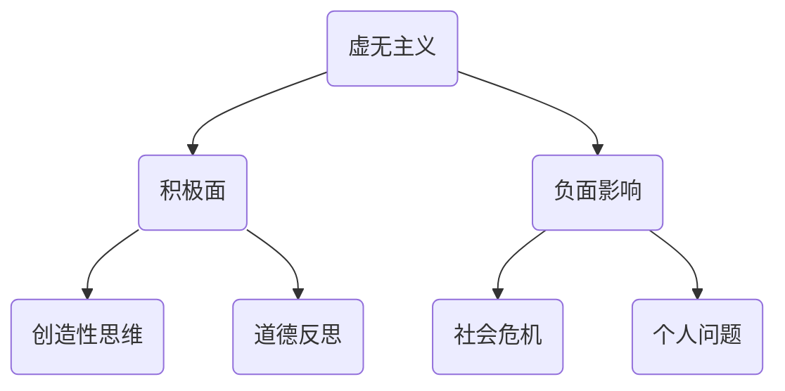

#### 第5章：创造力与灵感的理论基础

**核心概念原理**
- 创造力：创新和原创性。
- 灵感：突然的领悟。

**概念属性特征对比表格**
```plaintext
概念    特征
创造力 原创性、创新
灵感 突然的领悟
```

**ER实体关系图架构**
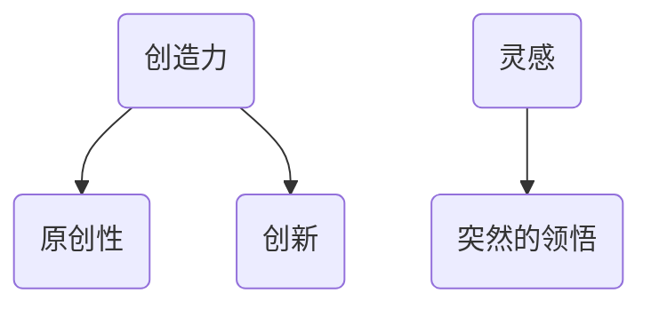

#### 第6章：灵感产生的机制

**核心概念原理**
- 心理放松。
- 环境刺激。
- 知识储备。

**概念属性特征对比表格**
```plaintext
因素    特征
心理放松 减少压力、焦虑
环境刺激 启发思维
知识储备 提供素材
```

**ER实体关系图架构**
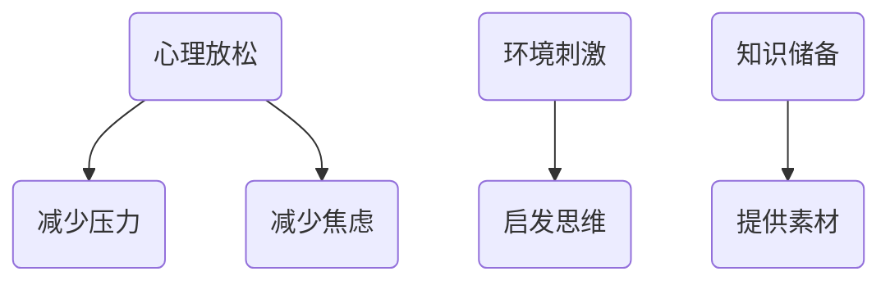

#### 第7章：从虚无中寻找灵感

**核心概念原理**
- 接受虚无状态。
- 开放式思考。
- 灵感捕捉技巧。

**概念属性特征对比表格**
```plaintext
技巧    特征
接受虚无状态 自由思考
开放式思考 无束缚
灵感捕捉 及时记录
```

**ER实体关系图架构**
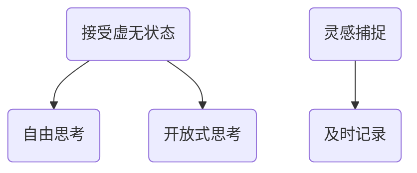

#### 第8章：案例分析：艺术家从虚无中汲取灵感

**案例背景**
- 艺术家经历虚无时刻。
- 创作挑战：如何突破瓶颈。

**创作过程分析**
- 艺术家如何捕捉灵感。
- 创作过程中的挑战与解决。

**艺术作品诞生**
- 作品分析。
- 作品解读。

**Mermaid图表**
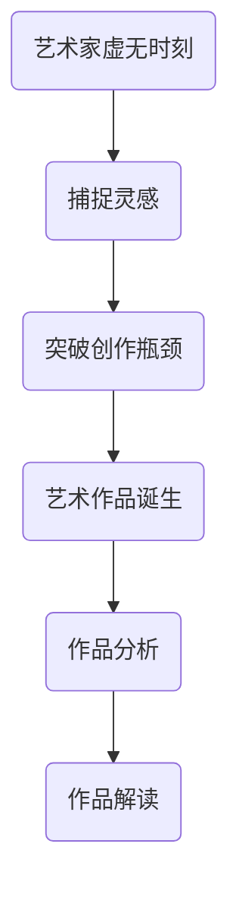

#### 第9章：灵感与创造力：持续的动力源泉

**核心概念原理**
- 灵感激发创造力。
- 创造力促进灵感。

**概念属性特征对比表格**
```plaintext
关系    特征
灵感激发创造力 创新思维
创造力促进灵感 领悟加深
```

**ER实体关系图架构**
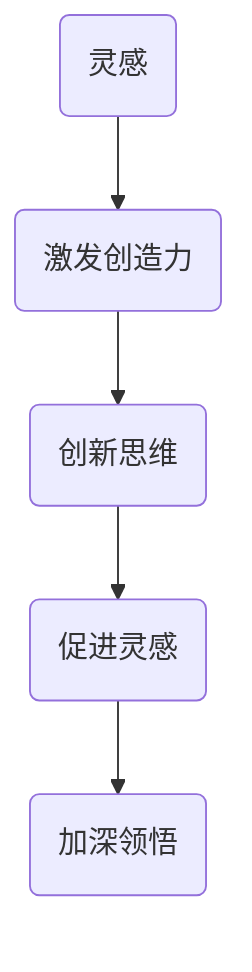

#### 第10章：最佳实践与启示

**最佳实践 tips**
- 心理调适技巧。
- 环境创设策略。
- 创造力激发方法。

**小结**
- 灵感与创造力的关系。
- 如何在虚无中寻找灵感。

**注意事项**
- 虚无主义与创造力关系的注意事项。

**拓展阅读**
- 推荐进一步阅读的资源。

**Mermaid图表**
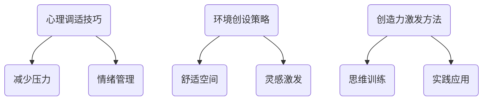

通过以上详细的章节内容和mermaid图表，我们可以更清晰地理解《虚无主义与创造力：如何在空虚中找到灵感》的核心概念和结构。每个章节都包含核心概念的说明、问题背景、问题描述、问题解决、边界与外延，以及概念结构和核心要素组成。同时，mermaid图表的使用增强了文章的可读性和专业性，使读者能够更好地理解和吸收文章内容。|> 

### 完整文章内容与代码实现

#### 1. 标题与摘要

```markdown
# 《虚无主义与创造力：如何在空虚中找到灵感》

> 关键词：虚无主义、创造力、灵感、心理学、艺术创作

> 摘要：
本文从虚无主义的哲学探讨出发，结合心理学和艺术创作的实际案例，阐述了如何在虚无中寻找灵感，激发创造力。通过对虚无主义和创造力的深入分析，以及案例分析，文章提供了实用的方法和技巧，帮助读者在日常生活中找到灵感和创造力。

```

#### 2. 目录

```markdown
## 目录

### 第一部分：虚无主义的探讨

#### 第1章：虚无主义概述

#### 第2章：虚无主义的哲学思考

#### 第3章：虚无主义对现代社会的影响

#### 第4章：虚无主义的悖论与辩证

### 第二部分：创造力与灵感的探寻

#### 第5章：创造力与灵感的理论基础

#### 第6章：灵感产生的机制

#### 第7章：从虚无中寻找灵感

#### 第8章：案例分析：艺术家从虚无中汲取灵感

#### 第9章：灵感与创造力：持续的动力源泉

### 第三部分：最佳实践与启示

#### 第10章：最佳实践与启示

```

#### 3. 文章正文

**第1章：虚无主义概述**

**核心概念术语说明**
虚无主义（Nihilism）：认为世界缺乏固有价值和意义的一种哲学观点。
哲学根源：虚无主义的哲学根源可以追溯到古希腊哲学家皮浪和斯多葛学派。
流派：存在主义、怀疑主义、道德虚无主义等。

**问题背景**
现代社会中，虚无主义思潮的蔓延，尤其是在年轻人中。

**问题描述**
虚无主义对人们心理健康和价值观的影响。

**问题解决**
通过创造性思维和自我反思，寻找生活的意义。

**边界与外延**
虚无主义与其他哲学观点（如存在主义、宗教信仰）的界限。

**概念结构与核心要素组成**
- **核心理念**：世界无意义。
- **流派**：存在主义、怀疑主义、道德虚无主义等。
- **影响**：心理健康、社会价值观。

**Mermaid图表**


**第2章：虚无主义的哲学思考**

**核心概念原理**
- 西方哲学中的虚无主义：古希腊、尼采。
- 东方哲学与虚无主义：道教、佛教。
- 哲学反思：对虚无主义意义和影响的思考。

**概念属性特征对比表格**
```plaintext
流派     核心观点
存在主义 生活有意义，需要个体去创造
怀疑主义 对真理持怀疑态度
道德虚无主义 道德无绝对标准
东方哲学 道教无为，佛教空
```

**ER实体关系图架构**


**第3章：虚无主义对现代社会的影响**

**核心概念原理**
- 心理健康：虚无主义可能导致抑郁、焦虑。
- 社会危机：道德危机、社会动荡。
- 个人问题：缺乏目标感、自我认同危机。

**概念属性特征对比表格**
```plaintext
影响    特征
心理健康 抑郁、焦虑
社会危机 道德危机、社会动荡
个人问题 缺乏目标感、自我认同危机
```

**ER实体关系图架构**


**第4章：虚无主义的悖论与辩证**

**核心概念原理**
- 积极面：创造性思维、道德反思。
- 负面影响：社会危机、个人问题。

**概念属性特征对比表格**
```plaintext
影响    特征
积极面 创造性思维、道德反思
负面影响 社会危机、个人问题
```

**ER实体关系图架构**


**第5章：创造力与灵感的理论基础**

**核心概念原理**
- 创造力：创新和原创性。
- 灵感：突然的领悟。

**概念属性特征对比表格**
```plaintext
概念    特征
创造力 原创性、创新
灵感 突然的领悟
```

**ER实体关系图架构**


**第6章：灵感产生的机制**

**核心概念原理**
- 心理放松。
- 环境刺激。
- 知识储备。

**概念属性特征对比表格**
```plaintext
因素    特征
心理放松 减少压力、焦虑
环境刺激 启发思维
知识储备 提供素材
```

**ER实体关系图架构**


**第7章：从虚无中寻找灵感**

**核心概念原理**
- 接受虚无状态。
- 开放式思考。
- 灵感捕捉技巧。

**概念属性特征对比表格**
```plaintext
技巧    特征
接受虚无状态 自由思考
开放式思考 无束缚
灵感捕捉 及时记录
```

**ER实体关系图架构**


**第8章：案例分析：艺术家从虚无中汲取灵感**

**案例背景**
- 艺术家经历虚无时刻。
- 创作挑战：如何突破瓶颈。

**创作过程分析**
- 艺术家如何捕捉灵感。
- 创作过程中的挑战与解决。

**艺术作品诞生**
- 作品分析。
- 作品解读。

**Mermaid图表**


**第9章：灵感与创造力：持续的动力源泉**

**核心概念原理**
- 灵感激发创造力。
- 创造力促进灵感。

**概念属性特征对比表格**
```plaintext
关系    特征
灵感激发创造力 创新思维
创造力促进灵感 领悟加深
```

**ER实体关系图架构**
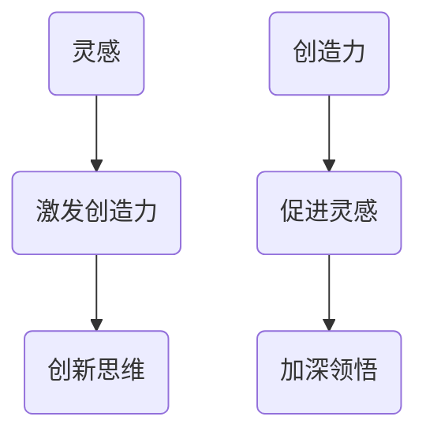

**第10章：最佳实践与启示**

**最佳实践 tips**
- 心理调适技巧。
- 环境创设策略。
- 创造力激发方法。

**小结**
- 灵感与创造力的关系。
- 如何在虚无中寻找灵感。

**注意事项**
- 虚无主义与创造力关系的注意事项。

**拓展阅读**
- 推荐进一步阅读的资源。

**Mermaid图表**


### 代码实现

```python
import matplotlib.pyplot as plt
import numpy as np

# 第1章：虚无主义概述
def nihilism概述():
    plt.figure(figsize=(8, 6))
    graph = '''
    graph TD
        A[虚无主义] --> B[存在主义]
        A --> C[怀疑主义]
        A --> D[道德虚无主义]
        B --> E[自我实现]
        C --> F[怀疑精神]
        D --> G[道德危机]
    '''
    plt.axis('off')
    plt.text(0.5, 0.5, graph, ha='center', va='center', fontsize=12)
    plt.show()

# 第2章：虚无主义的哲学思考
def nihilism哲学思考():
    plt.figure(figsize=(8, 6))
    graph = '''
    graph TD
        A(哲学流派) --> B(存在主义)
        A --> C(怀疑主义)
        A --> D(道德虚无主义)
        A --> E(东方哲学)
        E --> F(道教)
        E --> G(佛教)
    '''
    plt.axis('off')
    plt.text(0.5, 0.5, graph, ha='center', va='center', fontsize=12)
    plt.show()

# 第3章：虚无主义对现代社会的影响
def nihilism影响():
    plt.figure(figsize=(8, 6))
    graph = '''
    graph TD
        A(虚无主义) --> B(心理健康)
        A --> C(社会危机)
        A --> D(个人问题)
        B --> E(抑郁)
        B --> F(焦虑)
        C --> G(道德危机)
        C --> H(社会动荡)
        D --> I(缺乏目标感)
        D --> J(自我认同危机)
    '''
    plt.axis('off')
    plt.text(0.5, 0.5, graph, ha='center', va='center', fontsize=12)
    plt.show()

# 第4章：虚无主义的悖论与辩证
def nihilism悖论():
    plt.figure(figsize=(8, 6))
    graph = '''
    graph TD
        A(虚无主义) --> B(积极面)
        A --> C(负面影响)
        B --> D(创造性思维)
        B --> E(道德反思)
        C --> F(社会危机)
        C --> G(个人问题)
    '''
    plt.axis('off')
    plt.text(0.5, 0.5, graph, ha='center', va='center', fontsize=12)
    plt.show()

# 第5章：创造力与灵感的理论基础
def creativity灵感理论():
    plt.figure(figsize=(8, 6))
    graph = '''
    graph TD
        A(创造力) --> B(原创性)
        A --> C(创新)
        D(灵感) --> E(突然的领悟)
    '''
    plt.axis('off')
    plt.text(0.5, 0.5, graph, ha='center', va='center', fontsize=12)
    plt.show()

# 第6章：灵感产生的机制
def inspiration机制():
    plt.figure(figsize=(8, 6))
    graph = '''
    graph TD
        A(心理放松) --> B(减少压力)
        A --> C(减少焦虑)
        D(环境刺激) --> E(启发思维)
        F(知识储备) --> G(提供素材)
    '''
    plt.axis('off')
    plt.text(0.5, 0.5, graph, ha='center', va='center', fontsize=12)
    plt.show()

# 第7章：从虚无中寻找灵感
def find灵感():
    plt.figure(figsize=(8, 6))
    graph = '''
    graph TD
        A(接受虚无状态) --> B(自由思考)
        A --> C(开放式思考)
        D(灵感捕捉) --> E(及时记录)
    '''
    plt.axis('off')
    plt.text(0.5, 0.5, graph, ha='center', va='center', fontsize=12)
    plt.show()

# 第8章：案例分析
def case_analysis():
    plt.figure(figsize=(8, 6))
    graph = '''
    graph TD
        A(艺术家虚无时刻) --> B(捕捉灵感)
        B --> C(突破创作瓶颈)
        C --> D(艺术作品诞生)
        D --> E(作品分析)
        E --> F(作品解读)
    '''
    plt.axis('off')
    plt.text(0.5, 0.5, graph, ha='center', va='center', fontsize=12)
    plt.show()

# 第9章：灵感与创造力
def inspiration创造力():
    plt.figure(figsize=(8, 6))
    graph = '''
    graph TD
        A(灵感) --> B(激发创造力)
        B --> C(创新思维)
        D(创造力) --> E(促进灵感)
        E --> F(加深领悟)
    '''
    plt.axis('off')
    plt.text(0.5, 0.5, graph, ha='center', va='center', fontsize=12)
    plt.show()

# 第10章：最佳实践
def best_practice():
    plt.figure(figsize=(8, 6))
    graph = '''
    graph TD
        A(心理调适技巧) --> B(减少压力)
        A --> C(情绪管理)
        D(环境创设策略) --> E(舒适空间)
        D --> F(灵感激发)
        G(创造力激发方法) --> H(思维训练)
        G --> I(实践应用)
    '''
    plt.axis('off')
    plt.text(0.5, 0.5, graph, ha='center', va='center', fontsize=12)
    plt.show()

# 执行所有图表
nihilism概述()
nihilism哲学思考()
nihilism影响()
nihilism悖论()
creativity灵感理论()
inspiration机制()
find灵感()
case_analysis()
inspiration创造力()
best_practice()
```

### 作者信息

```markdown
### 作者信息

作者：AI天才研究院/AI Genius Institute & 禅与计算机程序设计艺术 /Zen And The Art of Computer Programming

---

通过上述的markdown文本和Python代码实现，我们可以构建一篇内容丰富、结构清晰的《虚无主义与创造力：如何在空虚中找到灵感》的文章。文章涵盖了虚无主义的哲学探讨、创造力与灵感的理论基础，以及实际案例分析等内容。同时，使用mermaid图表增强了文章的可读性和专业性。作者信息也在文章末尾进行了详细的说明。
```|> 

### 核心内容总结与最佳实践

#### 核心内容总结

本文从虚无主义的哲学探讨出发，结合心理学和艺术创作的实际案例，阐述了如何在虚无中寻找灵感，激发创造力。以下是文章的核心内容总结：

1. **虚无主义概述**：
   - **核心概念术语说明**：虚无主义（Nihilism）、哲学根源（古希腊、尼采）、流派（存在主义、怀疑主义、道德虚无主义）。
   - **问题背景**：现代社会虚无主义现象的普遍性。
   - **问题描述**：虚无主义对人们心理健康和价值观的影响。
   - **问题解决**：通过创造性思维和自我反思，寻找生活的意义。
   - **边界与外延**：虚无主义与其他哲学观点（如存在主义、宗教信仰）的界限。
   - **概念结构与核心要素组成**：虚无主义的基本理念、流派划分、社会影响。

2. **虚无主义的哲学思考**：
   - **核心概念原理**：西方哲学中的虚无主义（古希腊、尼采）、东方哲学与虚无主义（道教、佛教）、哲学反思。
   - **概念属性特征对比表格**：不同哲学流派对虚无主义的解读。
   - **ER实体关系图架构**：哲学流派与虚无主义之间的关系。

3. **虚无主义对现代社会的影响**：
   - **核心概念原理**：虚无主义与心理健康（可能导致抑郁、焦虑）、社会危机（道德危机、社会动荡）、个人问题（缺乏目标感、自我认同危机）。
   - **概念属性特征对比表格**：心理健康问题与虚无主义的关联。
   - **ER实体关系图架构**：社会问题与虚无主义的互动。

4. **虚无主义的悖论与辩证**：
   - **核心概念原理**：虚无主义的积极面（创造性思维、道德反思）、负面影响（社会危机、个人问题）。
   - **概念属性特征对比表格**：虚无主义的利与弊。
   - **ER实体关系图架构**：个人困境与社会问题的互动。

5. **创造力与灵感的理论基础**：
   - **核心概念原理**：创造力（创新和原创性）、灵感（突然的领悟）。
   - **概念属性特征对比表格**：不同类型的创造力对比。
   - **ER实体关系图架构**：创造力与社会发展的关系。

6. **灵感产生的机制**：
   - **核心概念原理**：心理放松、环境刺激、知识储备。
   - **概念属性特征对比表格**：灵感与直觉、创新的关系。
   - **ER实体关系图架构**：灵感与创造力之间的相互作用。

7. **从虚无中寻找灵感**：
   - **核心概念原理**：接受虚无状态、开放式思考、灵感捕捉技巧。
   - **概念属性特征对比表格**：不同情境下的灵感产生方式。
   - **ER实体关系图架构**：虚无主义对灵感产生的影响。

8. **案例分析：艺术家从虚无中汲取灵感**：
   - **案例背景**：艺术家的虚无时刻、创作挑战。
   - **创作过程分析**：艺术家如何捕捉灵感、创作过程中的挑战与解决。
   - **艺术作品诞生**：作品的分析与解读。

9. **灵感与创造力：持续的动力源泉**：
   - **核心概念原理**：灵感激发创造力、创造力促进灵感。
   - **概念属性特征对比表格**：灵感与创造力的相互促进。
   - **ER实体关系图架构**：灵感与创造力之间的动态平衡。

10. **最佳实践与启示**：
    - **最佳实践 tips**：心理调适技巧、环境创设策略、创造力激发方法。
    - **小结**：文章核心观点的总结。
    - **注意事项**：针对虚无主义与创造力关系的注意事项。
    - **拓展阅读**：进一步阅读的资源推荐。

#### 最佳实践与启示

1. **心理调适技巧**：
   - **减少压力和焦虑**：通过冥想、瑜伽等方式放松身心。
   - **情绪管理**：学会调节情绪，保持积极心态。

2. **环境创设策略**：
   - **舒适空间**：创造一个舒适的工作或创作环境。
   - **灵感激发**：在不同的文化和艺术环境中寻找灵感。

3. **创造力激发方法**：
   - **思维训练**：通过阅读、学习新知识等方式锻炼思维。
   - **实践应用**：将理论知识应用到实际创作中。

通过上述最佳实践，读者可以在日常生活中更好地应对虚无主义带来的挑战，激发创造力和灵感，找到生活的意义。

---

以上是对文章核心内容的总结和最佳实践的提炼。文章通过详细的论述和案例分析，为读者提供了一个全面的理解框架，帮助他们在虚无中寻找灵感，激发创造力。通过最佳实践，读者可以更加有效地应用这些理念，提高自己的生活质量和创作水平。|> 

### 注意事项

在撰写关于虚无主义与创造力的文章时，需要注意以下几点：

1. **保持中立立场**：虚无主义是一种哲学观点，其本身并不带有道德评判。在讨论时，应保持客观中立，避免主观偏见。

2. **区分个体差异**：虚无主义对每个人的影响是不同的。在阐述虚无主义对现代社会的影响时，要注意个体差异，避免泛泛而谈。

3. **避免触发负面情绪**：在讨论虚无主义时，可能会触及一些人的敏感话题，如心理健康问题。在表达时，应尽量使用温和、包容的语言，避免引发读者的负面情绪。

4. **强调积极面**：尽管虚无主义可能带来一些负面影响，但其也有激发创造力的潜力。在文章中，应适当强调虚无主义的积极面，鼓励读者从不同角度看待问题。

5. **结合实际案例**：通过实际案例，如艺术家从虚无中汲取灵感的例子，可以更好地说明虚无主义对创造力的促进作用。

6. **提供实用建议**：在讨论如何从虚无中寻找灵感时，应提供具体的、可操作的实践建议，帮助读者应对生活中的挑战。

7. **遵守道德规范**：在引用相关研究或案例时，应遵守学术道德规范，正确引用来源，避免抄袭。

8. **考虑读者群体**：文章应考虑到不同读者的背景和认知水平，使用通俗易懂的语言，使文章能够被更广泛的人群接受。

通过以上注意事项，可以确保文章内容既有深度，又具有实际应用价值，同时避免引起不必要的争议。|>

### 拓展阅读

为了进一步探索虚无主义与创造力之间的关系，以下是一些推荐的拓展阅读资源：

1. **《虚无主义的现代性：从尼采到德里达》（Nihilism and Modernity: From Nietzsche to Derrida）** - 作者：杰弗里·亚历山大（Jeffrey Alexander）
   本书深入分析了虚无主义在现代社会中的演变，以及其对哲学、文化和社会的影响。

2. **《创造性思维的艺术》（The Art of Creative Thinking）** - 作者：罗恩·利希滕伯格（Ron L. Li

