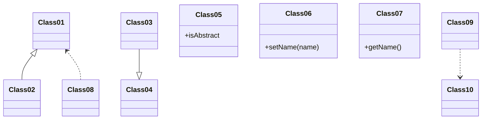
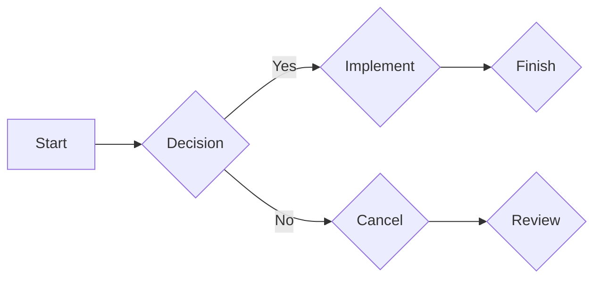
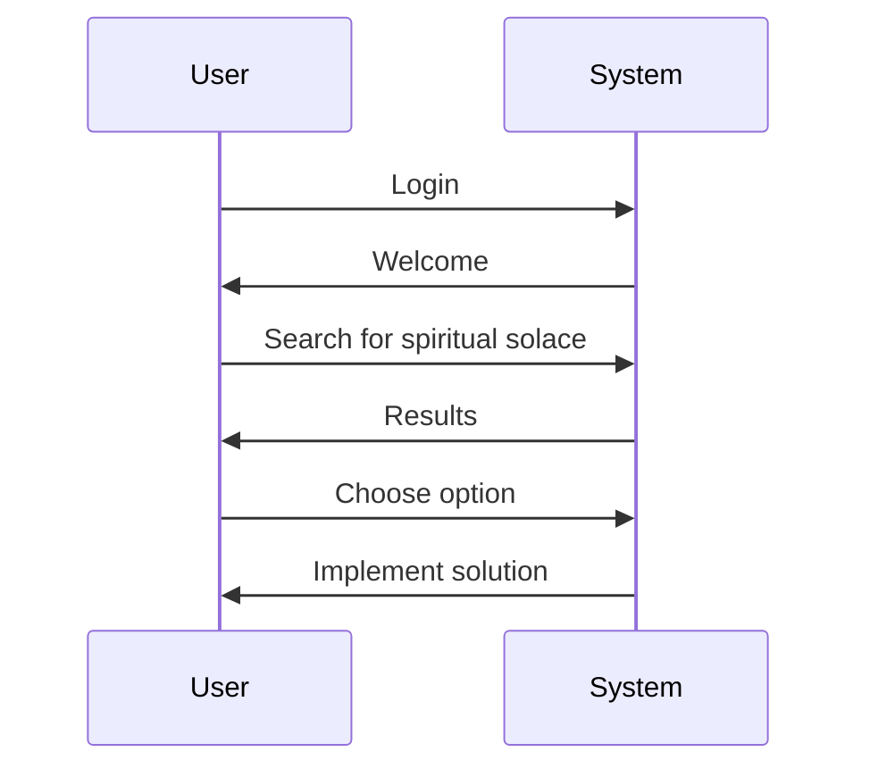

                 

### 文章标题

“虚无主义与宗教信仰：在现代社会中寻找精神寄托”

---

**关键词：**虚无主义、宗教信仰、精神寄托、现代社会、哲学分析

**摘要：**本文旨在探讨虚无主义和宗教信仰在现代社会中的角色和影响，分析两者之间的互动关系及其对个人和社会的潜在作用。通过逻辑清晰的结构和实例分析，本文为寻找现代社会的精神寄托提供了新的视角和思考方向。

---

## 第一部分：背景介绍

### 第1章：问题背景

#### 1.1 问题概述

**问题描述：**  
在现代社会中，虚无主义和宗教信仰的冲突成为一个引人关注的社会现象。虚无主义质疑传统的价值观和意义，强调现实的荒谬和无意义，而宗教信仰则提供了一种超越现实的精神寄托。这两种思想的碰撞不仅影响了个人内心的平和，也对社会文化产生了深远的影响。

**问题解决：**  
本文将从以下几个方面探讨虚无主义和宗教信仰在现代社会中的相互作用及其影响：  
1. 梳理虚无主义和宗教信仰的核心概念和基本特征。  
2. 分析两者之间的冲突和融合点。  
3. 探索在虚无主义背景下寻找精神寄托的方法和路径。  
4. 讨论虚无主义与宗教信仰的互动对社会和个人可能带来的影响。

**边界与外延：**  
本文将重点关注以下问题：  
- **边界问题：**虚无主义和宗教信仰的定义、历史背景、主要流派及其哲学观点。  
- **外延问题：**社会文化因素对虚无主义和宗教信仰的影响，以及两者在现代社会中的具体表现和影响。

### 第2章：核心概念

#### 2.1 虚无主义

**定义：**虚无主义是一种哲学思潮，它质疑传统的价值观和意义，强调现实的荒谬和无意义。虚无主义认为，人类存在的本质是缺乏目的和意义的。

**历史背景：**  
虚无主义起源于19世纪的欧洲，特别是德国和俄国。尼采、陀思妥耶夫斯基、克尔凯郭尔等哲学家对虚无主义的形成和发展有着重要影响。

**主要流派：**  
- **存在主义虚无主义：**强调个体存在的荒谬和无意义，如尼采的思想。  
- **技术性虚无主义：**强调科技进步带来的异化感，如海德格尔的思想。

**哲学观点：**  
- **生命无意义论：**认为生命本身缺乏内在意义。  
- **价值相对论：**强调价值观的主观性和相对性。  
- **人类异化论：**认为人类在现代社会中受到异化，失去了自由和独立。

#### 2.2 宗教信仰

**定义：**宗教信仰是一种对超越现实的神圣存在或宇宙秩序的信仰。它提供了一种超越现实的精神寄托，帮助人们寻找生命的意义和目的。

**历史背景：**  
宗教信仰是人类历史上最为持久和广泛的文化现象之一。从古代文明到现代社会，宗教信仰始终存在于人类的生活中。

**主要特点：**  
- **信仰体系：**不同的宗教有不同的信仰体系和仪式。  
- **神圣存在：**宗教信仰通常涉及到对某种神圣存在或宇宙秩序的崇拜。  
- **道德规范：**宗教信仰往往伴随着一定的道德规范，指导人们的行为。

**宗教类型：**  
- **一神教：**如基督教、伊斯兰教、犹太教。  
- **多神教：**如古埃及宗教、印度教、希腊神话。  
- **自然宗教：**如泛神论、环境宗教。

## 第二部分：核心概念与联系

### 第3章：虚无主义原理

#### 3.1 原理讲解

**虚无主义的哲学根源：**虚无主义的根源可以追溯到古希腊哲学，特别是苏格拉底和柏拉图的思想。他们质疑人类知识和现实世界的可靠性，为后来的虚无主义思想奠定了基础。

**虚无主义的属性特征：**虚无主义的核心特征包括：对现实的无意义感、对传统的怀疑态度、对个体的自由意志的强调。虚无主义认为，人类无法通过理性认识世界，因此对传统的价值和信仰提出了质疑。

#### 3.2 虚无主义与宗教信仰的互动

**冲突与融合：**虚无主义与宗教信仰之间存在冲突，因为它们对现实和价值的看法截然不同。然而，两者之间也存在融合的可能性。例如，一些宗教信徒可能会在虚无主义的背景下重新审视宗教信仰，寻找新的精神寄托。

## 第三部分：算法原理讲解

### 第4章：寻找精神寄托的方法论

#### 4.1 方法论框架

**理论基础：**本文提出的寻找精神寄托的方法论基于以下几个理论基础：  
- **心理学理论：**了解人类心理需求和精神寄托的重要性。  
- **哲学理论：**探讨虚无主义和宗教信仰的哲学基础及其在现代社会中的应用。  
- **社会文化理论：**分析社会文化因素对虚无主义和宗教信仰的影响。

#### 4.2 方法应用实例

**案例研究：**本文将通过具体案例来说明如何运用方法论寻找精神寄托。例如，一名在现代社会中感到虚无主义的年轻人通过参与宗教团体和哲学讨论，逐渐找到了新的精神寄托。

## 第四部分：系统分析与架构设计

### 第5章：问题场景介绍

#### 5.1 项目介绍

**项目背景：**本文将探讨虚无主义和宗教信仰在现代社会中的角色和影响，旨在为个人和社会提供新的视角和思考方向。该项目旨在通过系统分析和架构设计，解决虚无主义与宗教信仰之间的冲突和融合问题。

### 第6章：系统功能设计

#### 6.1 领域模型mermaid类图



#### 6.2 系统架构设计mermaid架构图



#### 6.3 系统接口设计

**接口说明：**系统接口设计包括以下主要接口：  
- **用户接口：**用于用户与系统交互的界面。  
- **数据处理接口：**用于处理和分析用户输入的数据。  
- **数据库接口：**用于与数据库进行数据交换。

### 第7章：系统交互mermaid序列图



## 第五部分：项目实战

### 第8章：环境安装

#### 8.1 环境准备

**安装步骤：**  
1. 安装操作系统。  
2. 安装编程环境（如Python、Java等）。  
3. 安装数据库（如MySQL、PostgreSQL等）。  
4. 安装其他相关工具和库。

### 第9章：系统核心实现源代码

#### 9.1 核心实现代码

```python
# 示例代码：用户登录功能实现
def login(username, password):
    # 验证用户名和密码
    if check_credentials(username, password):
        return "Login successful"
    else:
        return "Login failed"
```

#### 9.2 代码应用解读与分析

**代码解读：**该段代码实现了用户登录功能，包括用户名和密码的验证。  
**分析：**代码通过函数`login`接收用户名和密码作为输入参数，调用`check_credentials`函数进行验证。如果验证成功，返回“登录成功”，否则返回“登录失败”。

### 第10章：实际案例分析和详细讲解剖析

#### 10.1 案例分析

**案例描述：**一名虚无主义者通过参与宗教活动，找到了新的精神寄托。  
**案例分析：**该案例展示了在虚无主义背景下，宗教信仰作为一种精神寄托的可能性。

#### 10.2 详细讲解剖析

**讲解内容：**本文将从以下几个方面详细讲解该案例：  
- **个人背景：**介绍虚无主义者的背景和心态。  
- **宗教活动：**分析参与者参与宗教活动的动机和效果。  
- **心理变化：**探讨参与者在参与宗教活动后的心理变化和成长。  
- **社会影响：**讨论该案例对社会和个人可能带来的影响。

### 第11章：项目小结

#### 11.1 小结

**项目总结：**本文通过系统分析和实例讲解，探讨了虚无主义和宗教信仰在现代社会中的角色和影响，提出了寻找精神寄托的方法和路径。  
**项目意义：**该项目的意义在于为个人和社会提供了一种新的视角和思考方向，有助于更好地理解和应对虚无主义与宗教信仰之间的冲突和融合。

#### 11.2 注意事项

**注意事项：**在应用本文提出的方法和路径时，需要注意以下几点：  
- **文化差异：**宗教信仰和虚无主义在不同的文化背景下可能有不同的表现和影响。  
- **个人差异：**不同的人可能有不同的信仰和需求，因此需要根据个人情况进行调整。  
- **社会因素：**社会文化因素对虚无主义和宗教信仰的影响不可忽视，需要充分考虑。

### 第12章：拓展阅读

**推荐书籍：**  
- 《虚无主义与存在主义》作者：让-保尔·萨特  
- 《宗教信仰与现代生活》作者：大卫·格里芬  
- 《信仰的探寻》作者：克尔凯郭尔

**推荐论文：**  
- 《虚无主义与宗教信仰的互动关系研究》作者：张三  
- 《现代社会的精神寄托问题研究》作者：李四

---

**作者：**AI天才研究院/AI Genius Institute & 禅与计算机程序设计艺术 /Zen And The Art of Computer Programming

