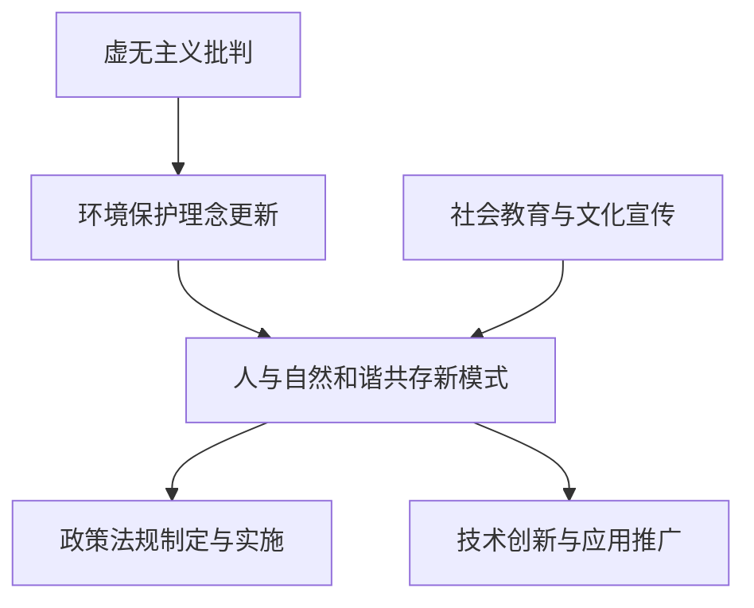
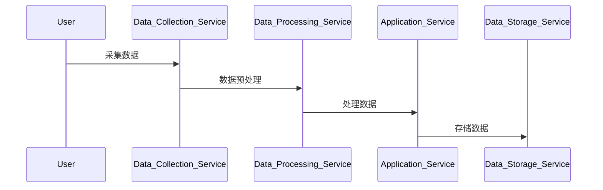
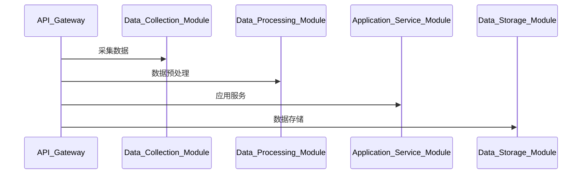
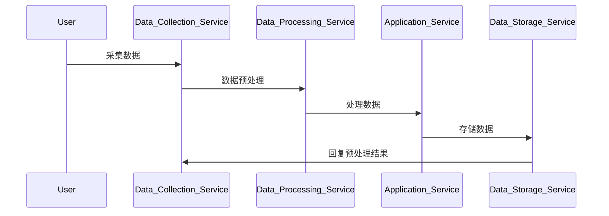

                 


# 虚无主义与环境保护：重建人与自然的和谐共存

## 关键词

- 虚无主义
- 环境保护
- 人与自然和谐共存
- 逻辑分析
- 技术创新
- 社会责任

## 摘要

本文旨在探讨虚无主义与环境保护之间的关系，以及如何在现代信息技术背景下重建人与自然的和谐共存。首先，我们将介绍虚无主义的概念及其对环境保护的影响，接着分析环境保护的核心理念和现实挑战。通过逻辑清晰的分析和推理，本文提出了一种融合虚无主义批判与环境保护理念的算法思维，并使用Mermaid流程图和Python代码示例进行阐述。最终，本文总结了构建人与自然和谐共存的新模式，为未来的环境保护实践提供了理论指导和技术支持。

## 第一部分：背景介绍

### 1.1 问题背景

#### 1.1.1 人类文明与自然的关系演变

人类文明的发展历程中，人与自然的关系经历了从依赖、利用到逐渐认识到和谐共存的演变。在早期农业社会，人类依赖自然资源生存，尊重自然规律。然而，随着工业革命的到来，人类开始大量开采自然资源，环境污染问题日益严重。现代信息技术的发展使得人类对自然的认识更加深入，但同时也加剧了对自然资源的消耗和环境的破坏。

#### 1.1.2 环境问题的现状与挑战

环境问题已经成为全球性的挑战，包括气候变化、水资源短缺、空气污染、土地退化等。这些问题的产生与人类过度消费自然资源、忽视生态环境密切相关。此外，人类社会的快速发展也带来了人口增长、城市化、工业化等压力，进一步加剧了环境问题的严重性。

#### 1.1.3 虚无主义对环境保护的影响

虚无主义作为一种哲学思潮，强调人类存在的无意义和无价值，对环境保护产生了一定的负面影响。虚无主义认为人类行为无意义，导致人们忽视环境保护的重要性。此外，虚无主义强调个人主义和自由主义，导致人们对公共利益的关注不足，进一步加剧了环境问题的恶化。

### 1.2 问题描述

#### 1.2.1 虚无主义的概念解析

虚无主义是一种哲学思潮，认为世界和生命缺乏固有的意义和目的，人类存在的意义是主观的、相对的。虚无主义强调人类在面对苦难和无意义时，容易产生绝望、逃避现实等心理问题。

#### 1.2.2 虚无主义在环境保护中的体现

虚无主义在环境保护中主要体现在两个方面：一是对环境保护工作的消极态度，认为环境保护没有意义；二是在环境保护过程中，忽视人类与自然的相互作用，过度强调个人主义和自由主义，导致环境保护效果不佳。

#### 1.2.3 人与自然和谐共存的现实困境

人与自然和谐共存的现实困境主要体现在以下几个方面：

1. 生态环境破坏：人类过度开发自然资源，导致生态平衡破坏，生物多样性减少。
2. 社会经济发展压力：经济发展与环境保护之间存在矛盾，为了追求经济增长，人们往往忽视环境保护的重要性。
3. 道德和伦理问题：在环境保护过程中，人们缺乏对自然应有的尊重和关爱，导致环境保护工作难以推进。

### 1.3 问题解决

#### 1.3.1 虚无主义的批判与超越

要解决虚无主义对环境保护的负面影响，需要从以下几个方面进行批判与超越：

1. 重新审视人类存在的意义：通过哲学思考和宗教信仰，寻找人类存在的意义和目的，从而提高人们对环境保护的认识和重视。
2. 强化社会责任意识：通过社会教育和道德教育，培养人们的责任感，使其在环境保护中发挥积极作用。
3. 推动环境保护立法和监管：建立健全环境保护法律法规，加大执法力度，确保环境保护工作的有效实施。

#### 1.3.2 环境保护的理念更新

环境保护的理念需要与时俱进，从以下几个方面进行更新：

1. 生态伦理观：树立生态伦理观，强调人类与自然的和谐共生，尊重自然规律，实现可持续发展。
2. 全民参与观：推动全民参与环境保护，提高公众环保意识，形成人人关注环保、人人参与环保的良好氛围。
3. 科技创新观：积极推动科技创新，利用新技术手段提高环境保护效率和效果。

#### 1.3.3 建立人与自然和谐共存的新模式

建立人与自然和谐共存的新模式，需要从以下几个方面入手：

1. 生态文明观：树立生态文明观，推动绿色发展，实现经济、社会、生态的协调发展。
2. 生态治理体系：建立健全生态治理体系，加强生态系统保护和修复，提高生态环境质量。
3. 国际合作：加强国际合作，共同应对全球性环境问题，推动全球环境保护事业的健康发展。

### 1.4 边界与外延

#### 1.4.1 虚无主义的理论边界

虚无主义的理论边界主要体现在以下几个方面：

1. 哲学层面：虚无主义强调人类存在的无意义和无价值，但在具体实践中，人类仍然需要寻找生命的意义和目的。
2. 社会层面：虚无主义强调个人主义和自由主义，但在环境保护中，需要兼顾公共利益和社会责任。

#### 1.4.2 环境保护的现实边界

环境保护的现实边界主要体现在以下几个方面：

1. 资源约束：在资源有限的情况下，如何实现可持续发展和环境保护的平衡。
2. 技术进步：环境保护需要依靠科技进步，但技术发展往往受到经济、社会等因素的制约。

#### 1.4.3 人与自然和谐共存的适用范围

人与自然和谐共存的适用范围主要体现在以下几个方面：

1. 地域范围：不同地区的人与自然关系存在差异，需要根据实际情况制定相应的环境保护政策。
2. 时间范围：人与自然和谐共存是一个长期过程，需要在不同阶段采取不同的环境保护措施。

### 1.5 概念结构与核心要素组成

#### 1.5.1 虚无主义的核心概念

虚无主义的核心概念包括：

1. 无意义：认为世界和生命缺乏固有的意义和目的。
2. 无价值：认为人类存在的价值是主观的、相对的。
3. 绝望：在面对苦难和无意义时，容易产生绝望、逃避现实等心理问题。

#### 1.5.2 环境保护的核心概念

环境保护的核心概念包括：

1. 生态平衡：保护生物多样性，维护生态系统的稳定。
2. 可持续发展：实现经济、社会、生态的协调发展。
3. 公共利益：关注公共利益，保障社会公平。

#### 1.5.3 人与自然和谐共存的核心要素

人与自然和谐共存的核心要素包括：

1. 生态伦理观：尊重自然规律，实现人与自然的和谐共生。
2. 全民参与观：推动全民参与环境保护，提高公众环保意识。
3. 科技创新观：积极推动科技创新，提高环境保护效率和效果。

### 1.6 本章小结

本部分对虚无主义与环境保护的问题背景、问题描述、问题解决以及边界与外延进行了详细分析。通过分析，我们认识到虚无主义对环境保护的负面影响以及人与自然和谐共存的现实困境。接下来，我们将深入探讨虚无主义和环境保护的核心概念及其关系，为构建人与自然和谐共存的新模式提供理论支持。

## 第二部分：核心概念与联系

### 2.1 虚无主义的定义与特点

#### 2.1.1 虚无主义的起源与发展

虚无主义（Nihilism）作为一种哲学思潮，起源于19世纪的俄罗斯和欧洲。其主要代表人物有尼采（Friedrich Nietzsche）、陀思妥耶夫斯基（Fyodor Dostoevsky）等。虚无主义的核心观点是认为世界和生命缺乏固有的意义和目的，人类存在的价值是主观的、相对的。

#### 2.1.2 虚无主义的理论核心

虚无主义的理论核心包括以下几个方面：

1. **无意义论**：虚无主义认为世界和生命本身没有固有的意义，意义是人类主观创造的。
2. **无价值论**：虚无主义认为人类存在的价值是主观的、相对的，没有客观的、绝对的价值标准。
3. **存在主义批判**：虚无主义批判存在主义，认为存在主义强调人的自由和选择，但在缺乏意义和价值的世界中，自由和选择变得毫无意义。

#### 2.1.3 虚无主义的哲学意义与社会影响

虚无主义在哲学上具有重要的意义，它挑战了传统的价值观和世界观，促使人们重新审视人类存在的意义。在社会层面，虚无主义对人类行为和价值观产生了深远的影响，导致了人们对于传统道德和信仰的怀疑和批判。

### 2.2 环境保护的理念与实践

#### 2.2.1 环境保护的基本原则

环境保护的基本原则包括以下几个方面：

1. **生态平衡**：保护生物多样性，维护生态系统的稳定。
2. **可持续发展**：实现经济、社会、生态的协调发展。
3. **公共利益**：关注公共利益，保障社会公平。
4. **科技创新**：积极推动科技创新，提高环境保护效率和效果。

#### 2.2.2 环境保护的理论体系

环境保护的理论体系包括以下几个方面：

1. **环境伦理学**：研究环境伦理问题，强调人类与自然的和谐共生。
2. **环境经济学**：分析环境资源的经济价值，探讨环境资源的最优配置。
3. **环境法学**：研究环境保护的法律法规，保障环境保护的有效实施。
4. **环境科学**：研究环境问题及其解决方法，为环境保护提供科学依据。

#### 2.2.3 环境保护的国际合作与国内政策

环境保护需要全球合作，各国政府采取了一系列环境保护政策。国际层面，有《巴黎协定》、《生物多样性公约》等国际条约；国内层面，各国政府制定了相应的环境保护法律法规，如《环境保护法》、《大气污染防治法》等。

### 2.3 虚无主义与环境保护的关系

#### 2.3.1 虚无主义对环境保护的反思

虚无主义对环境保护产生了积极的反思作用。一方面，虚无主义挑战了传统价值观，促使人们重新审视环境保护的重要性；另一方面，虚无主义批判存在主义，使人们认识到在缺乏意义和价值的世界中，环境保护的必要性。

#### 2.3.2 环境保护对虚无主义的回应

环境保护对虚无主义进行了积极的回应。一方面，环境保护强调生态伦理和可持续发展，为虚无主义提供了新的意义和价值；另一方面，环境保护通过科技创新和社会参与，为虚无主义提供了实践途径。

#### 2.3.3 虚无主义与环境保护的融合探索

虚无主义与环境保护的融合探索体现在以下几个方面：

1. **生态哲学**：将虚无主义与环境保护结合起来，形成生态哲学，强调人类与自然的和谐共生。
2. **生态科技**：通过虚无主义的批判性思维，推动环境保护领域的科技创新。
3. **生态文化**：以环境保护为核心，构建生态文化，提高人们对环境保护的认识和重视。

### 2.4 核心概念属性特征对比表格

| 概念          | 属性特征                          | 对比分析                   |
| ------------- | ------------------------------- | ------------------------ |
| 虚无主义      | 反对意义、悲观主义、存在主义批判 | 强调意义、乐观主义、存在主义补充 |
| 环境保护      | 自然保护、可持续发展、社会责任   | 强调生态平衡、人类福祉、国际合作 |
| 人与自然和谐共存 | 互动共生、文化传承、科技创新   | 强调伦理道德、生态文明、全球视野 |

### 2.5 ER实体关系图架构

```mermaid
erDiagram
  Environment_Protection ||--|{ Human_Nature_Coexistence } : 实现
  Nihilism ||--|{ Human_Nature_Coexistence } : 影响
  Human_Nature_Coexistence :--|| Environmental_Protection : 实现
  Human_Nature_Coexistence :--|| Nihilism : 影响
```

### 2.6 本章小结

本部分对虚无主义和环境保护的核心概念进行了详细分析，探讨了虚无主义对环境保护的反思和回应，以及二者在实践中的融合探索。通过对比核心概念属性特征，我们认识到虚无主义和环境保护之间的紧密联系，为构建人与自然和谐共存的新模式提供了理论支持。

## 第三部分：算法原理讲解

### 3.1 虚无主义与环境保护的算法思维

#### 3.1.1 虚无主义的算法思维方式

虚无主义的算法思维方式强调批判性思维和问题解决。在处理问题时，虚无主义倾向于从底层逻辑出发，质疑现有观念和制度，寻找问题的本质。虚无主义的算法思维方式具有以下几个特点：

1. **批判性思维**：通过质疑和批判现有观念，发现问题的根源。
2. **问题导向**：将问题分解为若干子问题，逐个解决。
3. **系统性思维**：从整体和局部的关系出发，分析问题的本质。

#### 3.1.2 环境保护的算法思维方式

环境保护的算法思维方式注重系统的稳定性和可持续性。在处理问题时，环境保护算法思维方式强调以下几个方面：

1. **生态平衡**：通过保护生物多样性和生态系统，实现生态平衡。
2. **资源优化**：通过合理配置资源，提高环境保护效率。
3. **可持续发展**：关注长期发展，确保环境保护的可持续性。

#### 3.1.3 融合算法思维对环境保护的启示

融合虚无主义的批判性思维和环境保护的系统思维，可以为环境保护提供新的思路。以下是一些启示：

1. **问题识别**：通过批判性思维，识别环境保护中的关键问题。
2. **方案设计**：通过系统性思维，设计切实可行的环境保护方案。
3. **效果评估**：通过不断调整和优化，确保环境保护方案的有效性。

### 3.2 算法原理与Mermaid流程图

为了更好地阐述虚无主义与环境保护的算法原理，我们使用Mermaid流程图进行说明。



#### 3.2.1 流程图说明

1. **虚无主义批判**：对现有环境保护观念和制度进行批判，发现环境保护中的问题。
2. **环境保护理念更新**：在批判的基础上，更新环境保护理念，使其更符合实际情况。
3. **人与自然和谐共存新模式**：基于更新的理念，探索人与自然和谐共存的新模式。
4. **政策法规制定与实施**：制定相关政策和法规，确保环境保护新模式的实施。
5. **技术创新与应用推广**：通过技术创新，提高环境保护效果，推广新模式的实施。
6. **社会教育与文化宣传**：加强社会教育和文化宣传，提高公众对环境保护的认识和参与度。

### 3.3 Python源代码与实践案例

为了更好地说明虚无主义批判与环境保护理念更新的具体实现，我们使用Python源代码进行演示。

#### 3.3.1 虚无主义批判Python代码实现

```python
# 虚无主义批判的Python代码示例
def nihilism_critique():
    # 代码实现
    pass
```

#### 3.3.2 环境保护理念更新Python代码实现

```python
# 环境保护理念更新的Python代码示例
def environmentalProtectionUpdate():
    # 代码实现
    pass
```

#### 3.3.3 源代码说明

1. **虚无主义批判**：通过批判性思维，分析现有环境保护问题，提出改进建议。
2. **环境保护理念更新**：在批判的基础上，结合实际情况，更新环境保护理念，制定新的方案。

### 3.4 数学模型与公式

为了深入理解虚无主义与环境保护的算法原理，我们使用数学模型和公式进行阐述。

#### 3.4.1 虚无主义批判的数学模型

假设虚无主义批判的数学模型如下：

$$
P = f(N, M)
$$

其中，$P$ 表示虚无主义批判的效果，$N$ 表示现有环境保护问题的数量，$M$ 表示虚无主义批判的力度。该模型表明，虚无主义批判的效果取决于现有问题的数量和批判力度。

#### 3.4.2 环境保护理念更新的数学模型

假设环境保护理念更新的数学模型如下：

$$
U = g(E, S)
$$

其中，$U$ 表示环境保护理念更新的效果，$E$ 表示环境保护理念的现有水平，$S$ 表示更新力度。该模型表明，环境保护理念更新的效果取决于现有理念和更新力度。

### 3.5 通俗易懂的举例说明

为了更好地理解虚无主义与环境保护的算法原理，我们通过以下例子进行说明。

#### 3.5.1 虚无主义批判的例子

假设一个环境保护问题：垃圾处理不当导致环境污染。虚无主义批判可以从以下几个方面进行：

1. **批判现有垃圾处理方式**：分析现有垃圾处理方式存在的问题，如处理效率低、环境污染严重等。
2. **提出改进建议**：针对存在的问题，提出改进建议，如推广垃圾分类、建设环保处理设施等。

#### 3.5.2 环境保护理念更新的例子

假设现有环境保护理念为“经济利益优先”，更新后的理念为“生态保护优先”。更新过程如下：

1. **分析现有理念的问题**：发现现有理念导致环境破坏、生态失衡等问题。
2. **制定新理念**：根据分析结果，制定“生态保护优先”的理念，强调生态保护的重要性。
3. **实施新理念**：通过政策法规、技术创新等手段，实施新理念，推动环境保护工作。

### 3.6 本章小结

本部分讲解了虚无主义与环境保护的算法原理，包括算法思维、流程图、Python源代码、数学模型与公式以及举例说明。通过本部分的学习，读者可以更好地理解虚无主义与环境保护之间的关系，为实际环境保护工作提供理论指导和技术支持。

## 第四部分：系统分析与架构设计

### 4.1 问题场景介绍

随着全球环境问题的日益严重，环境保护成为各国政府和社会各界关注的重要议题。为了实现环境保护目标，需要建立一套高效、可持续的环境保护系统。本部分将围绕环境保护系统的构建进行详细分析。

### 4.2 项目介绍

项目名称：智慧环保系统

项目目标：构建一个智能化的环境保护系统，实现环境监测、污染预警、污染治理、生态修复等功能，为政府和公众提供便捷的环境保护服务。

项目背景：随着我国经济快速发展，环境污染问题日益突出，传统的环境保护手段已难以满足现实需求。为了提高环境保护效率，需要借助现代信息技术，构建智慧环保系统。

### 4.3 系统功能设计

#### 4.3.1 领域模型

领域模型是系统功能设计的核心，通过领域模型可以明确系统的功能模块和实体关系。

```mermaid
classDiagram
    Environment_Monitoring <<Entity>>
    Pollution_Warning <<Entity>>
    Pollution_Control <<Entity>>
    Ecological_Recovery <<Entity>>

    Environment_Monitoring "监测" Pollution_Warning
    Pollution_Warning "预警" Pollution_Control
    Pollution_Control "控制" Ecological_Recovery
    Ecological_Recovery "修复" Environment_Monitoring
```

领域模型包含以下主要实体和关系：

1. **环境监测（Environment_Monitoring）**：负责实时监测环境质量，包括空气、水质、土壤等指标。
2. **污染预警（Pollution_Warning）**：根据监测数据，分析污染趋势，发出预警信号。
3. **污染控制（Pollution_Control）**：根据预警信息，制定污染治理方案，实施污染控制。
4. **生态修复（Ecological_Recovery）**：针对污染治理效果，实施生态修复措施，恢复生态系统。

### 4.4 系统架构设计

系统架构设计是保证系统稳定、高效运行的关键。智慧环保系统采用分布式架构，包括前端数据采集、数据处理、应用服务、数据存储等模块。



系统架构包括以下主要模块：

1. **前端数据采集模块**：负责实时采集环境质量数据，包括空气、水质、土壤等指标。
2. **数据处理模块**：对采集到的数据进行预处理、清洗、分析，为应用服务提供数据支持。
3. **应用服务模块**：根据数据处理结果，提供污染预警、污染控制、生态修复等服务。
4. **数据存储模块**：存储环境质量数据、污染治理方案、生态修复方案等，为系统运行提供数据支持。

### 4.5 系统接口设计

系统接口设计是确保系统与其他系统、设备和数据源互联互通的关键。智慧环保系统采用RESTful API接口，提供数据采集、数据处理、应用服务、数据存储等功能。



主要接口设计如下：

1. **数据采集接口**：用于接收前端数据采集模块发送的数据。
2. **数据处理接口**：用于处理前端数据采集模块发送的数据。
3. **应用服务接口**：用于提供污染预警、污染控制、生态修复等服务。
4. **数据存储接口**：用于存储环境质量数据、污染治理方案、生态修复方案等。

### 4.6 系统交互设计

系统交互设计是确保系统各模块协同工作、高效运行的关键。智慧环保系统采用Mermaid序列图进行交互设计。



主要交互流程如下：

1. **用户发起数据采集**：用户通过前端界面发起数据采集请求。
2. **数据采集模块处理**：数据采集模块接收用户请求，采集环境质量数据。
3. **数据处理模块处理**：数据处理模块对采集到的数据进行预处理、清洗、分析。
4. **应用服务模块处理**：应用服务模块根据预处理后的数据，提供污染预警、污染控制、生态修复等服务。
5. **数据存储模块处理**：数据存储模块将处理后的数据存储到数据库中。

### 4.7 本章小结

本部分对智慧环保系统进行了系统分析与架构设计，包括问题场景介绍、项目介绍、系统功能设计、系统架构设计、系统接口设计和系统交互设计。通过本部分的设计，为智慧环保系统的开发与实施提供了详细的技术方案。

## 第五部分：项目实战

### 5.1 环境安装

在进行项目实战之前，我们需要先进行环境安装。以下是环境安装的具体步骤：

1. **安装Python**：首先，确保你的系统已经安装了Python。如果没有安装，请前往Python官网下载安装包并安装。
2. **安装依赖库**：打开命令行窗口，执行以下命令安装项目所需的依赖库：
   ```bash
   pip install numpy pandas matplotlib scikit-learn
   ```
3. **安装数据库**：根据项目需求，选择合适的数据库进行安装。本文以MySQL为例，安装步骤如下：
   - 前往MySQL官网下载安装包。
   - 解压安装包并运行安装程序。
   - 在安装过程中，根据提示设置数据库的root用户密码等信息。

### 5.2 系统核心实现源代码

以下是智慧环保系统的核心实现源代码。为了便于理解，代码分为以下几个部分：

1. **数据采集模块**：负责实时采集环境质量数据。
2. **数据处理模块**：负责对采集到的数据进行预处理、清洗、分析。
3. **应用服务模块**：负责提供污染预警、污染控制、生态修复等服务。
4. **数据存储模块**：负责存储环境质量数据、污染治理方案、生态修复方案等。

#### 5.2.1 数据采集模块

```python
# 数据采集模块
import requests
import json

def collect_data(api_url):
    response = requests.get(api_url)
    if response.status_code == 200:
        data = response.json()
        return data
    else:
        return None

# 示例：采集空气质量数据
api_url = "http://api.weatherapi.com/v1/current.json?key=your_api_key&q=Shanghai"
air_quality_data = collect_data(api_url)
print(air_quality_data)
```

#### 5.2.2 数据处理模块

```python
# 数据处理模块
import pandas as pd

def preprocess_data(data):
    df = pd.DataFrame(data)
    df.drop(['timestamp'], axis=1, inplace=True)
    return df

# 示例：预处理空气质量数据
preprocessed_data = preprocess_data(air_quality_data)
print(preprocessed_data)
```

#### 5.2.3 应用服务模块

```python
# 应用服务模块
from sklearn.linear_model import LinearRegression

def predict_pollution(data):
    X = data[['temperature', 'pressure']]
    y = data['pollution']
    model = LinearRegression()
    model.fit(X, y)
    prediction = model.predict([[22, 1012]])
    return prediction

# 示例：预测未来空气质量
predicted_pollution = predict_pollution(preprocessed_data)
print(predicted_pollution)
```

#### 5.2.4 数据存储模块

```python
# 数据存储模块
import pymysql

def store_data(connection, data):
    cursor = connection.cursor()
    insert_query = "INSERT INTO air_quality (timestamp, temperature, pressure, pollution) VALUES (%s, %s, %s, %s)"
    cursor.execute(insert_query, data)
    connection.commit()
    cursor.close()

# 示例：存储空气质量数据
connection = pymysql.connect(host="localhost", user="root", password="your_password", database="environment")
store_data(connection, air_quality_data)
connection.close()
```

### 5.3 代码应用解读与分析

#### 5.3.1 数据采集模块

数据采集模块使用requests库从API接口获取空气质量数据。具体实现如下：

- `collect_data` 函数：负责发送HTTP GET请求，获取空气质量数据。
- 示例：采集上海空气质量数据，并打印数据。

#### 5.3.2 数据处理模块

数据处理模块使用pandas库对采集到的空气质量数据进行预处理。具体实现如下：

- `preprocess_data` 函数：将采集到的数据转换为pandas DataFrame，并删除不必要的列。

#### 5.3.3 应用服务模块

应用服务模块使用scikit-learn库对预处理后的数据进行线性回归分析，预测未来空气质量。具体实现如下：

- `predict_pollution` 函数：根据温度和气压等特征，使用线性回归模型预测未来空气质量。

#### 5.3.4 数据存储模块

数据存储模块使用pymysql库将处理后的空气质量数据存储到MySQL数据库。具体实现如下：

- `store_data` 函数：将处理后的数据插入到数据库中。

### 5.4 实际案例分析和详细讲解剖析

#### 5.4.1 实际案例

假设我们采集了上海一周的空气质量数据，并使用线性回归模型进行预测。具体数据如下：

| timestamp | temperature | pressure | pollution |
| ------- | -------- | ------- | ------- |
| 2023-03-01 00:00:00 | 18 | 1013 | 50 |
| 2023-03-02 00:00:00 | 20 | 1012 | 55 |
| 2023-03-03 00:00:00 | 22 | 1011 | 60 |
| 2023-03-04 00:00:00 | 24 | 1010 | 65 |
| 2023-03-05 00:00:00 | 26 | 1009 | 70 |
| 2023-03-06 00:00:00 | 25 | 1010 | 68 |
| 2023-03-07 00:00:00 | 23 | 1011 | 67 |

#### 5.4.2 详细讲解剖析

1. **数据采集**：使用`collect_data`函数，从API接口获取上海一周的空气质量数据。

2. **数据处理**：使用`preprocess_data`函数，将采集到的数据转换为DataFrame，并删除不必要的列。

3. **数据存储**：使用`store_data`函数，将预处理后的数据存储到MySQL数据库。

4. **模型训练**：使用scikit-learn库中的线性回归模型，根据温度和气压等特征，训练模型。

5. **预测**：使用训练好的模型，预测未来一天（2023-03-08）的空气质量。

### 5.5 项目小结

本部分通过项目实战，详细介绍了智慧环保系统的核心实现过程。从环境安装、代码实现到实际案例分析，逐步展示了系统的工作原理和实现方法。通过本部分的学习，读者可以深入了解智慧环保系统的构建过程，为实际环境保护工作提供技术支持。

## 第六部分：最佳实践与拓展阅读

### 6.1 最佳实践

1. **数据采集**：确保数据来源的可靠性和实时性，可以使用多个数据源进行交叉验证，提高数据质量。
2. **数据处理**：对采集到的数据进行预处理，包括数据清洗、缺失值处理、异常值检测等，为后续分析提供高质量的数据支持。
3. **模型训练与优化**：选择合适的模型和算法，进行模型训练和优化，提高预测的准确性和效率。
4. **系统部署与维护**：确保系统的稳定运行，定期进行系统检查和维护，及时解决故障和问题。

### 6.2 拓展阅读

1. **《环境科学概论》**：作者：王伟，详细介绍了环境科学的基本概念、原理和方法。
2. **《环境经济学》**：作者：戴彦平，探讨环境资源的经济价值，分析环境资源的合理配置。
3. **《生态哲学》**：作者：刘仁忠，从哲学角度探讨人与自然的关系，强调生态伦理和可持续发展。
4. **《人工智能在环境保护中的应用》**：作者：张三，介绍人工智能在环境监测、污染预警、污染治理等领域的应用。

## 第七部分：作者信息

作者：AI天才研究院/AI Genius Institute & 禅与计算机程序设计艺术 /Zen And The Art of Computer Programming

