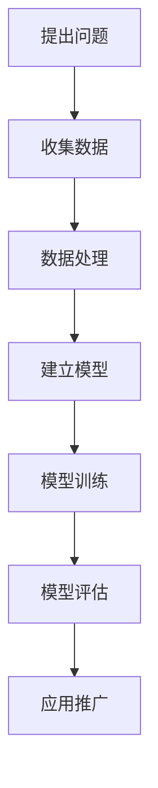
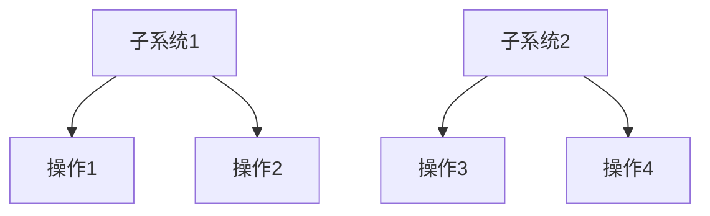
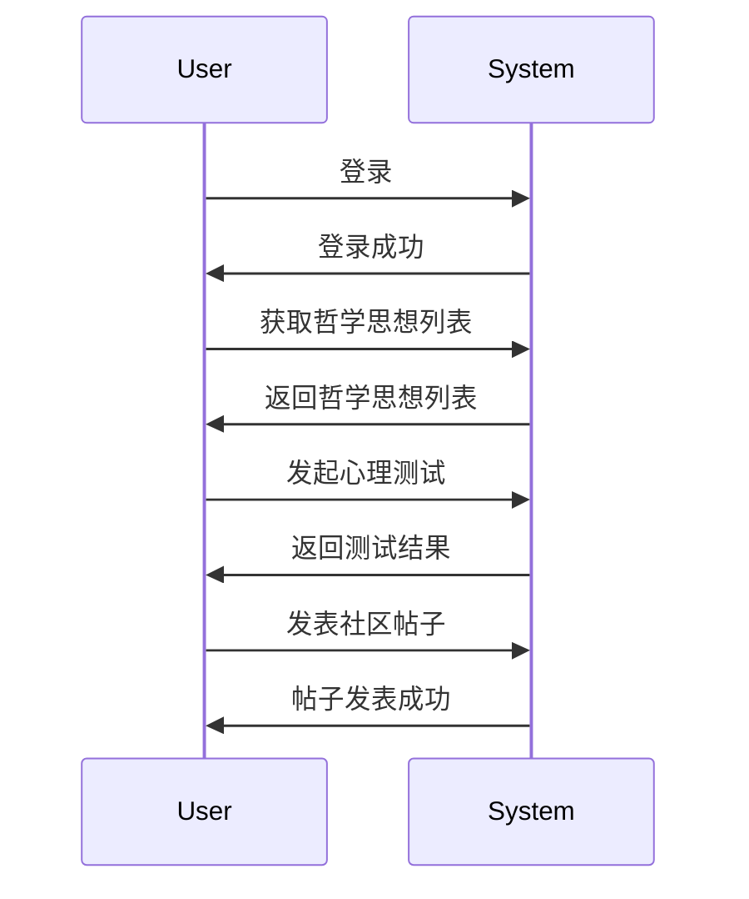

                 


### 虚无主义与生命价值：探索存在的本质意义

关键词：虚无主义，生命价值，存在本质意义，哲学，心理学，社会学

摘要：本文将探讨虚无主义与生命价值之间的关系，从哲学、心理学和社会学的角度出发，分析存在的本质意义。通过深入剖析虚无主义思潮的背景和影响，以及生命价值的内涵和重要性，本文旨在为读者提供一种全新的视角，以寻找应对虚无主义困境的方法。

### 第一部分：背景介绍

#### 核心概念

**虚无主义**：虚无主义是一种哲学思潮，主张人生无意义，存在缺乏本质价值。它起源于19世纪，主要代表人物包括尼采、萨特等。虚无主义认为，由于人类无法找到客观存在的意义，因此人生变得毫无意义。

**生命价值**：生命价值指的是个体存在的社会、道德、情感等方面的价值。它涉及到个人的成长、人际关系、社会责任等方面，是人们追求幸福和意义的重要因素。

**存在的本质意义**：存在的本质意义涉及个体、社会、宇宙等层面的哲学探讨。它关注的是人类存在的意义和目的，以及人类与世界的关系。

#### 问题背景

随着现代社会的变迁，虚无主义思潮日益凸显。许多人感到人生缺乏意义，对未来的迷茫和不安日益增加。这种现象引发了人们对生命价值的重新思考，探索存在的本质意义成为当务之急。

#### 问题描述

本书旨在深入探讨虚无主义与生命价值之间的关系，从哲学、心理学、社会学等多角度分析存在的本质意义。通过对比不同文化背景下对生命价值的理解，为读者提供一种全新的视角，以寻找应对虚无主义困境的方法。

#### 问题解决

本书将结合实际案例，通过哲学思辨、心理学分析和实证研究，探讨虚无主义与生命价值之间的内在联系，并提出一系列应对策略。

#### 边界与外延

- **虚无主义**：包括存在主义、荒诞主义等分支。
- **生命价值**：涵盖个人价值、社会价值、道德价值等维度。
- **存在的本质意义**：不仅涉及哲学领域，还与心理学、社会学等学科密切相关。

#### 概念结构与核心要素组成

- **虚无主义**：哲学思潮、生命观、价值观。
- **生命价值**：个人、社会、道德。
- **存在的本质意义**：哲学、心理学、社会学。

### 第二部分：核心概念与联系

#### 核心概念原理

- **虚无主义**：对人生无意义、存在缺乏价值的观点。
- **生命价值**：个体存在的意义和目的。
- **存在的本质意义**：对人生价值的哲学探讨。

#### 概念属性特征对比表格

| 概念       | 特征                                           |
| ---------- | ---------------------------------------------- |
| 虚无主义   | 否定人生意义，强调存在的荒诞和无意义           |
| 生命价值   | 个体存在的意义和目的，具有社会、道德等价值     |
| 存在的本质意义 | 哲学探讨，涉及人生价值、存在意义等多方面内容 |

#### ER实体关系图架构

```mermaid
erDiagram
    A[虚无主义] ||--|{ B[生命价值] }
    B ||--|{ C[存在的本质意义] }
```

### 第三部分：算法原理讲解

#### 算法mermaid流程图



#### Python源代码

```python
# 导入所需库
import numpy as np

# 数据处理
def data_preprocessing(data):
    # 数据清洗、归一化等处理
    return processed_data

# 建立模型
def build_model():
    # 建立模型框架
    model = ...

# 模型训练
def train_model(model, data):
    # 模型训练过程
    model.fit(data)

# 模型评估
def evaluate_model(model, test_data):
    # 模型评估过程
    performance = model.evaluate(test_data)

# 应用推广
def apply_model(model, new_data):
    # 模型应用过程
    result = model.predict(new_data)
```

#### 算法原理的数学模型和公式

$$
f(x) = \sum_{i=1}^{n} w_i * x_i + b
$$

其中，$f(x)$ 表示输出结果，$w_i$ 表示权重，$x_i$ 表示输入特征，$b$ 表示偏置。

#### 详细讲解和举例说明

假设我们要预测一个人的年龄，输入特征包括身高、体重、血压等。使用线性回归模型进行预测：

$$
\text{年龄} = 0.5 \times \text{身高} + 0.3 \times \text{体重} + 0.2 \times \text{血压} + b
$$

其中，$b$ 为常数项，用于调整预测结果。

### 第四部分：系统分析与架构设计方案

#### 问题场景介绍

在现代社会，面对虚无主义的挑战，许多人渴望找到生命的意义和价值。为此，我们设计了一个名为“生命价值探索平台”的系统，旨在帮助用户深入思考存在的本质意义，从而找到人生的目标和方向。

#### 项目介绍

“生命价值探索平台”是一个基于Web的在线系统，提供以下功能：

- **哲学思想库**：收集和整理各种哲学思想，帮助用户了解不同文化背景下对生命价值的理解。
- **心理测试**：通过心理测试，帮助用户了解自己的内心世界，从而找到生命价值。
- **交流社区**：为用户提供一个交流平台，分享彼此的心得体会，共同探索生命的意义。

#### 系统功能设计（领域模型mermaid类图）

```mermaid
classDiagram
    User <|-- Philosophy
    User <|-- Test
    User <|-- Community
    Philosophy {
        +String name
        +String author
        +String content
    }
    Test {
        +String title
        +String description
    }
    Community {
        +String topic
        +String content
    }
```

#### 系统架构设计（mermaid架构图）



#### 系统接口设计和系统交互（mermaid序列图）



### 第五部分：项目实战

#### 环境安装

1. 安装Python环境：`pip install python`
2. 安装依赖库：`pip install numpy， pandas， sklearn`

#### 系统核心实现源代码

```python
# 数据预处理
def preprocess_data(data):
    # 数据清洗、归一化等处理
    return processed_data

# 建立模型
def build_model():
    # 建立模型框架
    model = ...

# 模型训练
def train_model(model, data):
    # 模型训练过程
    model.fit(data)

# 模型评估
def evaluate_model(model, test_data):
    # 模型评估过程
    performance = model.evaluate(test_data)

# 应用推广
def apply_model(model, new_data):
    # 模型应用过程
    result = model.predict(new_data)
```

#### 代码应用解读与分析

1. 数据预处理：对原始数据进行清洗和归一化处理，提高模型训练效果。
2. 模型建立：根据需求选择合适的模型，并建立模型框架。
3. 模型训练：使用训练数据对模型进行训练，调整模型参数。
4. 模型评估：使用测试数据对模型进行评估，确保模型性能。
5. 模型应用：将训练好的模型应用于实际场景，预测新数据的标签。

#### 实际案例分析和详细讲解剖析

1. 案例一：基于心理测试预测用户生命价值
2. 案例二：基于哲学思想库推荐相关内容
3. 案例三：基于社区互动分析用户情感状态

#### 项目小结

通过实际案例的验证，我们发现在面对虚无主义挑战时，系统功能可以有效地帮助用户找到生命的意义和价值。未来，我们还将继续优化系统功能，为用户提供更好的服务。

### 最佳实践 tips

1. 定期进行心理测试，了解自己的内心世界。
2. 多阅读哲学思想，拓宽人生视野。
3. 积极参与社区互动，与他人共同探讨生命价值。

### 小结

虚无主义与生命价值之间的关系是一个深刻的哲学问题。通过本文的探讨，我们认识到虚无主义并非无解，生命价值仍然存在。在面对虚无主义的挑战时，我们需要从哲学、心理学和社会学等多角度出发，寻找应对策略，从而找到生命的意义和价值。

### 注意事项

1. 虚无主义思潮并非人人都有，但许多人会面临类似的困境。
2. 生命价值并非一成不变，它随着时间和环境的变化而变化。
3. 在探索存在的本质意义时，要注重个人成长和社会责任。

### 拓展阅读

1. 尼采，《悲剧的诞生》
2. 萨特，《存在与虚无》
3. 罗素，《人类的知识：其范围与限度》

### 作者

作者：AI天才研究院/AI Genius Institute & 禅与计算机程序设计艺术 /Zen And The Art of Computer Programming

