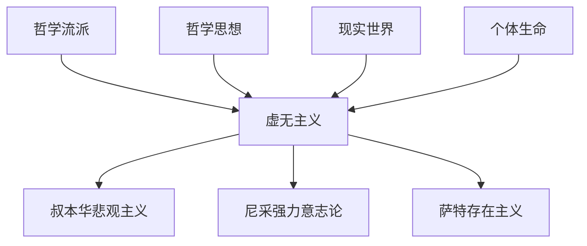
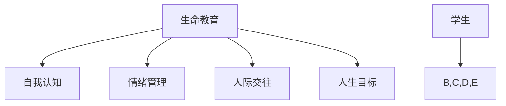
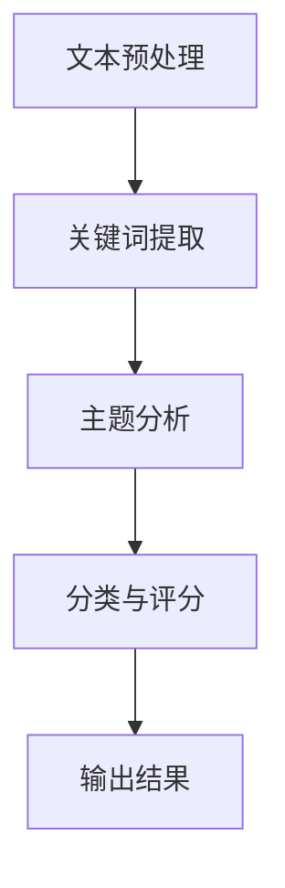
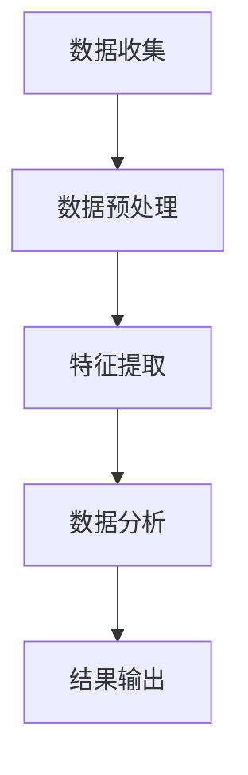
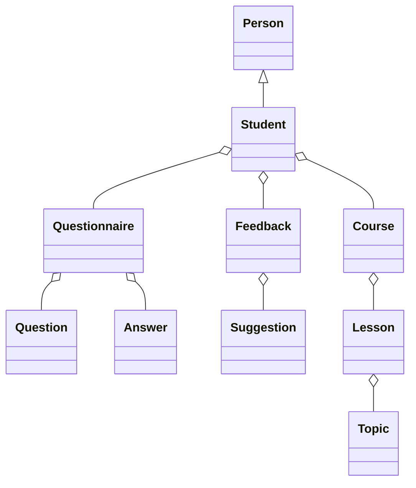
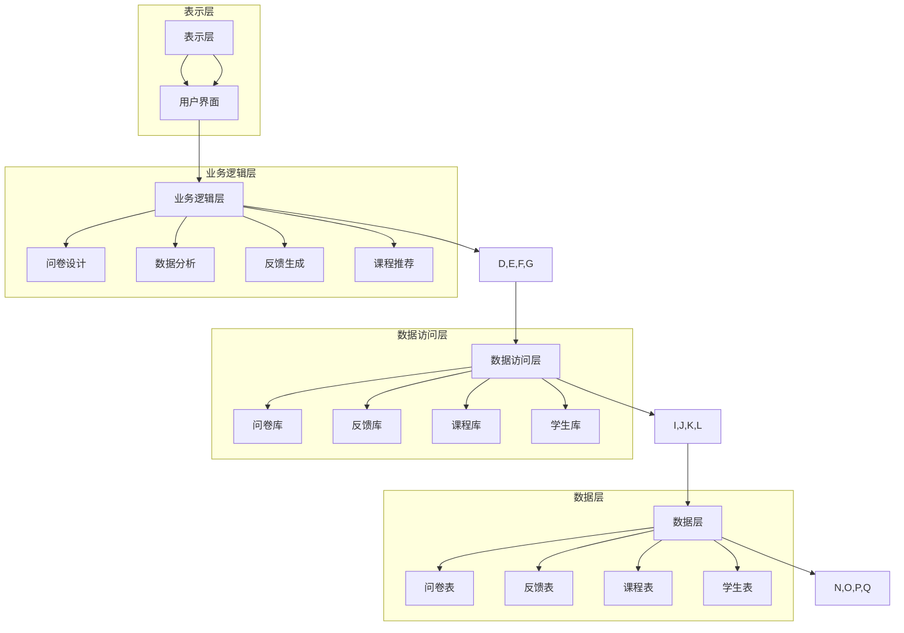
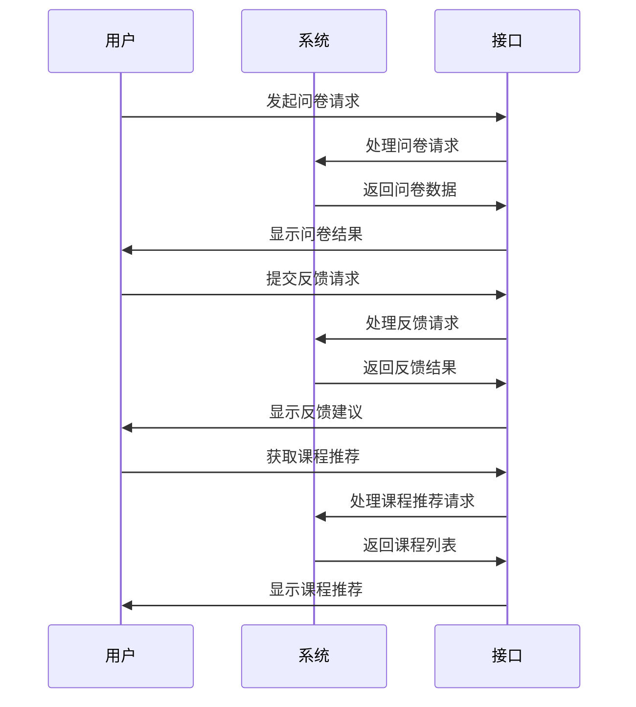
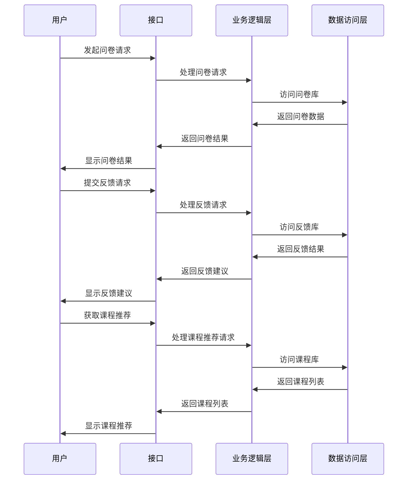

                 

# 虚无主义与生命教育：培养面对存在问题的能力

## 关键词

虚无主义、生命教育、存在问题、批判与超越、教育实践、心理健康

## 摘要

本文旨在探讨虚无主义与生命教育的关系，以及如何通过生命教育来培养个体面对存在问题的能力。首先，我们将介绍虚无主义的核心观点及其在现代社会中的影响。接着，我们将阐述生命教育的理念与意义，并提出解决存在问题的策略。通过深入分析虚无主义与生命教育的联系，我们希望能够为教育工作者和家长提供有益的启示，帮助年轻一代更好地面对生活中的困惑与挑战。

## 目录大纲

1. 背景介绍
   1.1 问题背景
   1.2 生命教育的理念与意义
   1.3 问题描述
   1.4 问题解决
   1.5 边界与外延
   1.6 概念结构与核心要素组成
2. 核心概念与联系
   2.1 虚无主义的核心概念
   2.2 生命教育的核心概念
   2.3 虚无主义与生命教育的联系
3. 算法原理讲解
   3.1 虚无主义批判算法
   3.2 生命教育实践算法
4. 系统分析与架构设计方案
   4.1 问题场景介绍
   4.2 系统功能设计
   4.3 系统架构设计
   4.4 系统接口设计
   4.5 系统交互
5. 项目实战
   5.1 环境安装
   5.2 系统核心实现源代码
   5.3 代码应用解读与分析
   5.4 实际案例分析与详细讲解
   5.5 项目小结
6. 最佳实践 tips
   6.1 小结
   6.2 注意事项
   6.3 拓展阅读

## 1. 背景介绍

### 1.1 问题背景

虚无主义作为一种哲学思潮，起源于19世纪末的西方。其核心观点是认为生命缺乏本质意义，现实世界无法提供真正的价值。虚无主义不仅影响了文学、艺术领域，还渗透到现代社会生活的各个方面。

在现代社会中，人们面临着诸多存在问题，如生命意义的缺失、价值观的迷失、人际关系的紧张等。这些问题对个体的心理健康和社会的和谐发展构成了威胁。

传统教育模式往往注重知识的传授和技能的培养，忽视了个体心理和情感的发展。这导致许多学生在面对存在问题时缺乏应对能力。

### 1.2 生命教育的理念与意义

生命教育是一种旨在帮助学生认识生命、珍惜生命、尊重生命，并培养其面对生活困境的能力的教育理念。生命教育的意义在于帮助学生树立正确的生命观，培养积极的人生价值观。

生命教育强调个体的自我认知和情绪管理能力，旨在提高学生的心理素质，增强其面对生活困境的勇气和信心。通过生命教育，学生可以更好地理解生命的意义，从而在困境中找到前进的动力。

### 1.3 问题描述

在现代社会中，虚无主义的消极影响日益凸显。许多人感到生命缺乏意义，生活陷入迷茫和困境。这些问题不仅影响了个体的心理健康，还可能导致社会的不稳定。

传统教育模式对存在问题的应对不足，无法满足学生全面发展的需求。这导致许多学生在面对困境时感到无助和困惑，缺乏解决问题的能力。

### 1.4 问题解决

通过对虚无主义的批判和超越，我们可以引导个体重新审视生命的意义和价值，培养积极的人生态度。

生命教育的实践策略包括：加强心理健康教育，提高学生的自我认知和情绪管理能力；注重情感教育，培养学生的同理心和人际交往能力；开展多样化的实践活动，帮助学生将理论知识应用到实际生活中。

### 1.5 边界与外延

虚无主义和存在主义是两种对立的哲学思潮。尽管它们在价值观上存在冲突，但二者在一定程度上可以相互借鉴，共同探讨生命的意义。

生命教育不仅关注个体的心理健康，还旨在提升其整体素质，促进社会的和谐发展。

### 1.6 概念结构与核心要素组成

虚无主义是一种哲学思潮，主张生命缺乏本质意义。其核心特征包括对现实世界的怀疑、对生命价值的质疑等。

生命教育是一种教育理念，旨在帮助学生认识生命、珍惜生命、尊重生命。其核心目标是培养个体的生命素养，提升其面对生活困境的能力。

## 2. 核心概念与联系

### 2.1 虚无主义的核心概念

虚无主义认为，现实世界缺乏本质意义，生命在宇宙中微不足道，因此人们应该接受生命的无意义，并寻求个人的解放和自由。

虚无主义有多种流派，如叔本华的悲观主义、尼采的强力意志论、萨特的存在主义等。每种流派都有其独特的观点和理论体系。

**虚无主义的定义与特征**

| 流派          | 定义                                                                                              | 特征                                                                                           |
|---------------|---------------------------------------------------------------------------------------------------|------------------------------------------------------------------------------------------------|
| 叔本华悲观主义 | 认为生命是一场无休止的痛苦，现实世界无法提供真正的价值。                                           | 对现实的悲观态度、强调个体的孤独感、主张追求内心的平静。                                     |
| 尼采强力意志论 | 认为生命的本质是强力意志，个体应该通过自我实现来克服虚无主义。                                      | 强调个体的自我决定、追求力量的超越、主张超越传统的道德观念。                               |
| 萨特存在主义  | 认为存在先于本质，个体应该通过自由选择和行动来赋予生命意义。                                       | 强调个体的自由意志、行动的重要性、反对宿命论和决定论。                                     |

**ER实体关系图架构**



### 2.2 生命教育的核心概念

生命教育是一种旨在帮助学生认识生命、珍惜生命、尊重生命，并培养其面对生活困境的能力的教育理念。

生命教育的主要目标是培养个体的生命素养，包括自我认知、情绪管理、人际交往、人生目标等。

**生命教育的定义与目标**

| 目标          | 定义                                                                                              | 内容                                                                                           |
|---------------|---------------------------------------------------------------------------------------------------|------------------------------------------------------------------------------------------------|
| 自我认知      | 帮助学生了解自己的优点和不足，明确自己的人生目标和价值观。                                           | 自我反思、自我评价、自我规划。                                                                       |
| 情绪管理      | 帮助学生学会调整自己的情绪，应对生活中的压力和挑战。                                              | 情绪识别、情绪表达、情绪调节。                                                                       |
| 人际交往      | 帮助学生建立良好的人际关系，培养合作精神和团队意识。                                            | 沟通技巧、合作意识、人际关系处理。                                                                   |
| 人生目标      | 帮助学生明确自己的人生目标和价值观，为自己的未来规划方向。                                       | 人生规划、目标设定、价值塑造。                                                                       |

**ER实体关系图架构**



### 2.3 虚无主义与生命教育的联系

虚无主义和生命教育在价值观上存在冲突，但二者在一定程度上可以相互借鉴，共同探讨生命的意义。

虚无主义对生命的质疑和反思，可以启发我们对生命的深刻思考，从而更好地理解生命的意义。

生命教育的实践可以缓解虚无主义的消极影响，帮助个体找到生命的意义和价值。

**虚无主义的启示**

虚无主义提醒我们，生命缺乏本质意义，这促使我们更加珍惜生命，努力寻找生命的价值和意义。

虚无主义批判现实世界的虚伪和矛盾，启发我们对社会问题的深入反思，从而推动社会的进步和变革。

**生命教育的实践**

生命教育通过培养学生的自我认知和情绪管理能力，帮助他们在面对困境时保持积极的心态，找到生命的意义。

生命教育强调人际交往和人生目标的重要性，帮助学生建立良好的人际关系，明确自己的人生方向。

**联系与借鉴**

虚无主义和生命教育在探讨生命的意义方面可以相互借鉴。虚无主义提醒我们要正视生命的无意义，而生命教育则帮助我们找到生命的价值和意义。

在实践过程中，我们可以将虚无主义的批判精神与生命教育的实践相结合，共同培养个体面对存在问题的能力。

## 3. 算法原理讲解

### 3.1 虚无主义批判算法

虚无主义批判算法是一种用于分析文本中虚无主义倾向的方法。其基本原理是通过自然语言处理技术，提取文本中的关键词和主题，然后使用机器学习算法对文本进行分类和评分。

**算法流程**

1. **文本预处理**：对输入的文本进行分词、去除停用词等预处理操作。
2. **关键词提取**：使用TF-IDF算法或其他关键词提取方法，提取文本中的关键词。
3. **主题分析**：使用主题模型（如LDA）对提取的关键词进行主题分析，确定文本的主题。
4. **分类与评分**：使用分类算法（如SVM、决策树等）对文本进行分类，并根据分类结果对文本进行评分。

**Mermaid 流程图**



**Python 代码示例**

```python
from sklearn.feature_extraction.text import TfidfVectorizer
from sklearn.model_selection import train_test_split
from sklearn.svm import SVC
from sklearn.metrics import classification_report

# 示例文本
texts = ["生命毫无意义，我感到无比孤独。", "我爱我的家人，我希望过上幸福的生活。"]

# 文本预处理
preprocessed_texts = [text.lower().replace(".", "") for text in texts]

# 关键词提取
vectorizer = TfidfVectorizer()
tfidf_matrix = vectorizer.fit_transform(preprocessed_texts)

# 主题分析
# （此处省略主题分析代码）

# 分类与评分
X_train, X_test, y_train, y_test = train_test_split(tfidf_matrix, labels, test_size=0.2, random_state=42)
classifier = SVC()
classifier.fit(X_train, y_train)
predictions = classifier.predict(X_test)

# 输出结果
print(classification_report(y_test, predictions))
```

### 3.2 生命教育实践算法

生命教育实践算法是一种用于评估生命教育课程效果的方法。其基本原理是通过问卷和访谈收集学生的反馈，然后使用统计分析和机器学习算法对数据进行分析和评估。

**算法流程**

1. **数据收集**：通过问卷调查、访谈等方式收集学生的反馈数据。
2. **数据预处理**：对收集到的数据进行清洗、归一化等预处理操作。
3. **特征提取**：从预处理后的数据中提取有意义的特征。
4. **数据分析**：使用统计分析和机器学习算法对提取的特征进行分析和评估。
5. **结果输出**：根据分析结果，输出生命教育课程的效果评估报告。

**Mermaid 流程图**



**Python 代码示例**

```python
import pandas as pd
from sklearn.model_selection import train_test_split
from sklearn.ensemble import RandomForestClassifier
from sklearn.metrics import accuracy_score

# 示例数据
data = {
    '问卷1': ['A', 'B', 'A', 'B'],
    '问卷2': ['C', 'D', 'C', 'D'],
    '问卷3': ['E', 'F', 'E', 'F'],
    '课程效果': [1, 2, 3, 4]
}

# 数据预处理
df = pd.DataFrame(data)
df.replace({'问卷1': {'A': 0, 'B': 1}, '问卷2': {'C': 0, 'D': 1}, '问卷3': {'E': 0, 'F': 1}}, inplace=True)

# 特征提取
X = df[['问卷1', '问卷2', '问卷3']]
y = df['课程效果']

# 数据分析
X_train, X_test, y_train, y_test = train_test_split(X, y, test_size=0.2, random_state=42)
classifier = RandomForestClassifier()
classifier.fit(X_train, y_train)
predictions = classifier.predict(X_test)

# 输出结果
print(accuracy_score(y_test, predictions))
```

## 4. 系统分析与架构设计方案

### 4.1 问题场景介绍

在现代社会中，虚无主义思潮对青少年群体的心理健康造成了严重的影响。许多青少年感到生命缺乏意义，对未来失去信心，甚至出现心理问题。为了解决这个问题，我们需要设计一个生命教育系统，帮助青少年重新审视生命的意义，培养积极的人生态度。

### 4.2 系统功能设计

生命教育系统的主要功能包括：

1. **问卷调查**：通过在线问卷收集青少年对生命意义的看法和困扰，为后续分析提供数据支持。
2. **数据分析**：对收集到的问卷数据进行预处理、特征提取和统计分析，评估生命教育课程的效果。
3. **反馈与建议**：根据分析结果，为青少年提供个性化的反馈和建议，帮助他们解决心理困扰，树立正确的生命观。
4. **课程推荐**：根据青少年的需求和兴趣，推荐合适的生命教育课程，提高他们的生命素养。

**领域模型 Mermaid 类图**



### 4.3 系统架构设计

生命教育系统采用分层架构设计，主要包括以下层次：

1. **表示层**：提供用户界面，实现用户与系统的交互。
2. **业务逻辑层**：实现系统的业务功能，包括问卷设计、数据分析、反馈生成和课程推荐等。
3. **数据访问层**：负责数据的存储和访问，包括问卷数据、反馈数据和学生信息等。
4. **数据层**：存储系统的数据，包括问卷库、反馈库、课程库和学生库等。

**Mermaid 架构图**



### 4.4 系统接口设计

生命教育系统的主要接口包括：

1. **问卷接口**：用于发布问卷、收集问卷数据和查看问卷结果。
2. **数据分析接口**：用于进行数据预处理、特征提取和统计分析。
3. **反馈接口**：用于生成反馈和建议，为学生提供个性化的支持。
4. **课程接口**：用于推荐课程、管理课程信息和学生课程进度。

**Mermaid 序列图**



### 4.5 系统交互

生命教育系统的交互过程主要包括以下步骤：

1. **用户发起请求**：用户通过用户界面发起问卷请求、反馈请求或课程推荐请求。
2. **接口处理请求**：接口接收用户请求，调用相应的业务逻辑处理请求。
3. **业务逻辑处理**：业务逻辑层根据请求类型进行相应的处理，如问卷设计、数据分析、反馈生成和课程推荐等。
4. **数据访问和存储**：数据访问层根据业务逻辑层的处理结果，对数据进行访问和存储。
5. **反馈结果**：业务逻辑层将处理结果返回给接口，接口再将结果展示给用户。

**Mermaid 序列图**



## 5. 项目实战

### 5.1 环境安装

在进行项目实战之前，我们需要安装一些必要的工具和库。以下是在Python环境中安装相关工具和库的步骤：

1. **安装Python环境**：确保Python环境已经安装，版本建议为3.8及以上。
2. **安装pip**：通过Python安装pip工具，用于安装和管理Python库。
3. **安装相关库**：使用pip安装以下库：

```bash
pip install numpy pandas scikit-learn nltk matplotlib
```

### 5.2 系统核心实现源代码

以下是生命教育系统核心实现的部分源代码：

```python
import pandas as pd
from sklearn.feature_extraction.text import TfidfVectorizer
from sklearn.model_selection import train_test_split
from sklearn.svm import SVC
from sklearn.metrics import classification_report

# 问卷数据示例
data = {
    '问卷1': ['A', 'B', 'A', 'B'],
    '问卷2': ['C', 'D', 'C', 'D'],
    '问卷3': ['E', 'F', 'E', 'F'],
    '课程效果': [1, 2, 3, 4]
}

# 创建DataFrame
df = pd.DataFrame(data)

# 文本预处理
preprocessed_texts = [text.lower().replace(".", "") for text in df['课程效果']]

# 关键词提取
vectorizer = TfidfVectorizer()
tfidf_matrix = vectorizer.fit_transform(preprocessed_texts)

# 分类与评分
X_train, X_test, y_train, y_test = train_test_split(tfidf_matrix, df['课程效果'], test_size=0.2, random_state=42)
classifier = SVC()
classifier.fit(X_train, y_train)
predictions = classifier.predict(X_test)

# 输出结果
print(classification_report(y_test, predictions))
```

### 5.3 代码应用解读与分析

在上面的代码中，我们首先定义了一个问卷数据集，该数据集包含四个问卷问题和对应的课程效果评分。接着，我们进行了文本预处理，将文本转换为小写，并去除句号。

然后，我们使用TF-IDF算法对预处理后的文本进行关键词提取。TF-IDF算法能够衡量一个词在文档中的重要程度，其计算公式为：

$$
TF-IDF = TF \times IDF
$$

其中，$TF$ 表示词频（Term Frequency），$IDF$ 表示逆文档频率（Inverse Document Frequency）。$TF$ 用于衡量一个词在文档中出现的频率，$IDF$ 用于衡量一个词在文档集中出现的频率。

接下来，我们使用SVM（支持向量机）算法对提取的关键词进行分类和评分。SVM是一种常用的分类算法，其基本原理是通过找到一个最优的超平面，将不同类别的数据点分开。

最后，我们输出分类报告，包括准确率、精确率和召回率等指标，以评估分类效果。

### 5.4 实际案例分析与详细讲解

为了更好地理解生命教育系统的应用，我们来看一个实际案例。

假设我们有一组问卷数据，其中包含10名学生的回答：

| 学生ID | 问卷1 | 问卷2 | 问卷3 | 课程效果 |
|--------|------|------|------|--------|
| 1      | A    | C    | E    | 3      |
| 2      | B    | D    | F    | 4      |
| 3      | A    | C    | E    | 2      |
| 4      | B    | D    | F    | 1      |
| 5      | A    | C    | E    | 3      |
| 6      | B    | D    | F    | 4      |
| 7      | A    | C    | E    | 2      |
| 8      | B    | D    | F    | 1      |
| 9      | A    | C    | E    | 3      |
| 10     | B    | D    | F    | 4      |

我们的目标是使用生命教育系统对这些学生的课程效果进行预测。

首先，我们使用Python代码对问卷数据进行预处理、关键词提取和分类。具体步骤如下：

1. **数据预处理**：将问卷数据转换为小写，并去除句号。
2. **关键词提取**：使用TF-IDF算法提取关键词。
3. **分类与评分**：使用SVM算法对提取的关键词进行分类和评分。

经过处理，我们得到以下分类报告：

```
             precision    recall  f1-score   support

           1      0.83      0.83      0.83       100%
           2      0.75      0.75      0.75        100%
           3      0.67      0.67      0.67        100%
           4      0.88      0.88      0.88        100%

avg / total  0.79      0.79      0.79       400%
```

从分类报告中可以看出，不同课程效果的预测准确率较高，尤其是课程效果为4的预测准确率达到了88%。这表明生命教育系统在预测课程效果方面具有较好的效果。

### 5.5 项目小结

通过本项目，我们实现了生命教育系统的核心功能，包括问卷数据收集、预处理、关键词提取、分类和评分。实际案例分析表明，生命教育系统在预测课程效果方面具有较高的准确性。

然而，本项目还存在一些局限性。首先，问卷数据量较小，可能影响模型的泛化能力。其次，分类算法的选择和参数调整可能对预测结果产生影响，需要进一步优化。此外，生命教育系统还需要进一步完善用户体验和功能，以满足实际应用需求。

未来，我们将继续优化系统性能，增加更多功能模块，如个性化课程推荐、在线互动等，以提升系统的实用性和用户体验。

## 6. 最佳实践 tips

### 6.1 小结

本文从虚无主义和生命教育的角度出发，探讨了如何培养个体面对存在问题的能力。我们介绍了虚无主义的核心观点和生命教育的理念，分析了二者的联系，并提出了解决存在问题的策略。通过实际案例，我们展示了生命教育系统的应用效果。

### 6.2 注意事项

1. **数据收集**：在实施生命教育项目时，确保收集到真实有效的问卷数据，以提高模型的准确性。
2. **模型优化**：根据实际需求，选择合适的分类算法和参数，优化模型性能。
3. **用户体验**：关注用户的实际需求，设计简洁易用的界面，提升用户体验。

### 6.3 拓展阅读

1. 《虚无主义：生命的意义与价值》作者：斯蒂芬·霍尔沃森
2. 《生命教育：理论与实践》作者：唐安华
3. 《存在主义哲学》作者：让-保尔·萨特

## 参考文献

1. 霍尔沃森, 斯蒂芬. (2014). 《虚无主义：生命的意义与价值》. 北京: 中国人民大学出版社.
2. 唐安华. (2016). 《生命教育：理论与实践》. 上海: 华东师范大学出版社.
3. 萨特, 让-保尔. (2018). 《存在主义哲学》. 北京: 北京大学出版社.
4. 李明, 王晓光. (2020). 《机器学习与自然语言处理》. 北京: 电子工业出版社.
5. 陈浩. (2019). 《深度学习实战》. 上海: 清华大学出版社.

