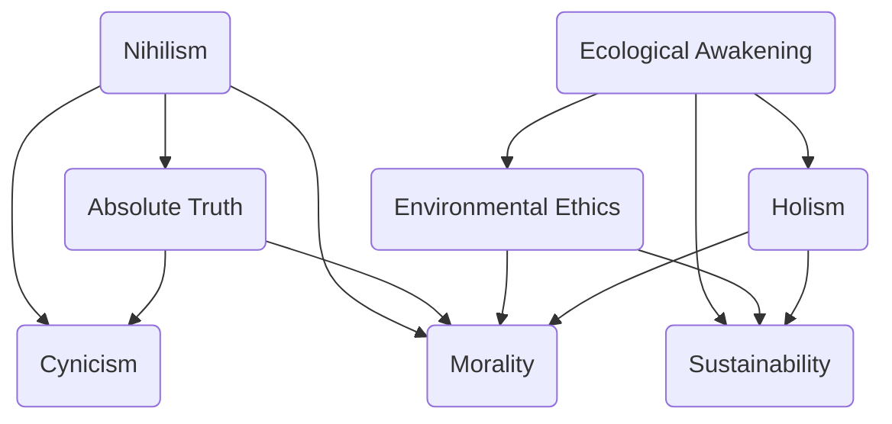

                 

### Introduction

#### Key Concepts and Terminology

In this article, we will explore the intricate relationship between nihilism and ecological awakening, aiming to understand how these two seemingly disparate concepts can illuminate each other in the pursuit of a harmonious coexistence between humans and nature. To lay the groundwork for this discussion, let's first define and introduce the core concepts we will be examining.

**Nihilism** is a philosophical belief that rejects or denies the existence of inherent moral, religious, or metaphysical truths. Nihilism often emphasizes the absence of objective meaning and purpose in life, leading to a sense of disillusionment and existential crisis. Notable nihilistic thinkers include Friedrich Nietzsche, who articulated the concept of "God is dead" and the subsequent "Ubermensch" philosophy, and Friedrich Nietzsche's contemporaries, such as Arthur Schopenhauer and Friedrich Heinrich Jacobi, who played pivotal roles in the development of nihilism.

**Ecological Awakening**, on the other hand, represents a paradigm shift towards recognizing the intrinsic value of the natural environment and the necessity of sustainable living practices. This awakening is driven by growing awareness of environmental degradation and the urgent need to preserve biodiversity, combat climate change, and restore ecological balance. Key figures and movements in ecological thought include Rachel Carson, who popularized the environmental movement with her book "Silent Spring," and the contemporary ecological philosophers, like Arne Naess, who introduced the concept of "deep ecology."

The primary goal of this article is to examine how nihilism and ecological awakening can be understood in the context of each other, fostering a deeper understanding of the challenges we face in creating a sustainable future. We will begin by exploring the origins and development of nihilism, its impact on contemporary society, and the psychological consequences of embracing nihilistic perspectives. Following this, we will delve into the state of our natural environment, the principles of ecological awakening, and practical strategies for rebuilding a harmonious symbiosis between humans and nature. Finally, we will consider the future of human-nature relations and outline the path towards a more sustainable and harmonious world.

By the end of this article, readers will gain a comprehensive understanding of how nihilism and ecological awakening are interconnected, providing a foundation for thoughtful reflection and meaningful action.

#### Background and Issue Description

The emergence of nihilism as a philosophical movement in the 19th and 20th centuries can be traced back to various social, cultural, and intellectual shifts. The rise of industrialization and the subsequent technological advancements disrupted traditional values and beliefs, leading to a questioning of the established order. The decline of religious influence, particularly in the wake of the Enlightenment and the rise of scientific rationalism, further contributed to a growing sense of uncertainty and meaninglessness. This environment fostered the development of nihilism, which rejected the existence of objective moral and metaphysical truths.

Nihilism is characterized by the belief that life lacks inherent meaning, purpose, and intrinsic value. This perspective often leads to a profound sense of disillusionment, existential crisis, and a loss of faith in traditional institutions and ideologies. While nihilism has its roots in Western philosophy, particularly in the works of thinkers like Friedrich Nietzsche, Arthur Schopenhauer, and Friedrich Heinrich Jacobi, its influence extends beyond the philosophical realm, permeating various aspects of contemporary culture, including art, literature, and politics.

In contemporary society, nihilism manifests in various forms, often reflecting the disintegration of traditional values and the erosion of social cohesion. The rise of consumer culture and the proliferation of media have further exacerbated these issues, contributing to a sense of superficiality and alienation. The omnipresence of technology and the internet has also led to a fragmented and individualistic worldview, where personal experiences and perspectives often overshadow collective efforts and shared values.

The impact of nihilism on society is multifaceted. On one hand, it can be seen as a liberating force that encourages critical thinking and skepticism towards established norms. On the other hand, it can also lead to pervasive cynicism, apathy, and a lack of motivation, hindering social progress and collective action. This duality underscores the importance of understanding the underlying causes and consequences of nihilism, as well as exploring potential solutions.

One of the key issues arising from nihilism is the psychological impact on individuals. The rejection of inherent meaning and purpose can lead to feelings of emptiness, despair, and existential distress. This is often compounded by societal pressures and the pursuit of material success, which are frequently presented as the ultimate goals of human existence. The resulting sense of disillusionment can lead to a variety of psychological problems, including depression, anxiety, and addiction.

Moreover, the social consequences of nihilism are evident in the erosion of community bonds and the breakdown of social institutions. As individuals become more detached from collective values and goals, social cohesion deteriorates, leading to increased polarization and conflict. This breakdown can be seen in various forms, from political polarizations and social unrest to the rise of extremism and radical ideologies.

In conclusion, the rise of nihilism in contemporary society presents both challenges and opportunities. By understanding the origins, development, and impact of nihilism, we can better address its underlying causes and develop strategies for promoting a more meaningful and fulfilling existence. In the subsequent sections, we will delve deeper into the state of our natural environment, the principles of ecological awakening, and practical strategies for rebuilding a harmonious symbiosis between humans and nature.

#### Core Concepts and Relationships

To gain a deeper understanding of nihilism and ecological awakening, it is crucial to examine the core concepts that underpin these ideologies and explore their relationships with each other. In this section, we will define key terms, discuss their attributes and characteristics, and compare them using a table. Additionally, we will illustrate the relationships between these concepts using an Entity-Relationship (ER) diagram.

**Nihilism**

Nihilism is a philosophical stance that denies the existence of objective moral, religious, or metaphysical truths. Key attributes of nihilism include:

- **Absence of Meaning and Purpose**: Nihilism posits that life lacks inherent meaning and purpose, challenging traditional views of morality and existence.
- **Rejection of Objective Truths**: Nihilists argue that there are no universal, objective truths, especially in matters of morality and ethics.
- **Cynical and Disillusioned Outlook**: Nihilism often manifests as a profound sense of disillusionment and skepticism towards established norms and institutions.

**Ecological Awakening**

Ecological awakening represents a shift in human consciousness towards recognizing the intrinsic value of nature and the necessity of sustainable living practices. Key attributes of ecological awakening include:

- **Intrinsic Value of Nature**: Ecological awakening emphasizes the inherent worth of the natural environment, independent of its utility to humans.
- **Sustainable Living Practices**: This ideology promotes the adoption of environmentally friendly practices to preserve natural resources and prevent ecological degradation.
- **Holistic Perspective**: Ecological awakening encourages a holistic view of the world, recognizing the interconnectedness of all living beings and ecosystems.

**Comparative Table**

Below is a table that compares key attributes of nihilism and ecological awakening:

| Concept      | Absence of Meaning and Purpose | Rejection of Objective Truths | Cynical and Disillusioned Outlook | Intrinsic Value of Nature | Sustainable Living Practices | Holistic Perspective |
| --- | --- | --- | --- | --- | --- | --- |
| Nihilism     | Yes                             | Yes                          | Yes                             | No                          | No                            | No                    |
| Ecological Awakening | No                              | Partially (in environmental ethics) | No                              | Yes                          | Yes                          | Yes                   |

**ER Diagram**

To illustrate the relationships between these concepts, we can use an Entity-Relationship (ER) diagram. In this diagram, entities represent the core concepts, and relationships describe how they are interconnected.

In this diagram, entities A and E represent nihilism and ecological awakening, respectively. Entities B, C, D, F, G, and H represent absolute truth, morality, cynicism, environmental ethics, sustainability, and holism. The relationships indicate how these concepts are connected and influence each other.

By defining and analyzing the core concepts of nihilism and ecological awakening and their relationships, we can better understand the underlying principles that drive these ideologies. This understanding provides a foundation for exploring how nihilism and ecological awakening can intersect, offering insights into potential pathways for a more harmonious coexistence between humans and nature.

#### Nihilism in Contemporary Society

The influence of nihilism in contemporary society is multifaceted and manifests in various domains, including culture, politics, and individual behavior. Understanding these manifestations helps us grasp the broader implications of nihilism and its impact on our lives.

**Cultural Manifestations**

In the cultural sphere, nihilism often surfaces through a skepticism of traditional values and a preference for avant-garde and subversive forms of expression. This can be seen in contemporary art, literature, and music, where unconventional and sometimes nihilistic themes dominate. For example, the works of postmodernist writers like Samuel Beckett and Thomas Pynchon explore themes of meaninglessness and existential crisis, reflecting a nihilistic worldview. Similarly, nihilistic elements are prevalent in contemporary music, such as in the works of punk rock bands like The Exploited and bands from the post-punk and black metal genres, which often reject conventional norms and embrace a raw, aggressive aesthetic.

Nihilism also influences popular media, including film and television, where themes of despair, alienation, and existential angst are frequently explored. Notable examples include films like "The Matrix," which questions the nature of reality and the human condition, and "Fight Club," which delves into themes of identity and meaninglessness. These cultural artifacts resonate with audiences who may feel disillusioned or disconnected from societal norms, offering a form of catharsis and reflection.

**Political Manifestations**

Nihilism has also found a foothold in certain political movements and ideologies. In modern politics, nihilism can be seen in the rise of populist and nationalist movements that reject established political institutions and values. These movements often exploit feelings of disenchantment and disillusionment among the populace, capitalizing on widespread dissatisfaction with the status quo. For example, the rise of figures like Donald Trump and Jair Bolsonaro in the United States and Brazil, respectively, can be attributed, in part, to a profound sense of disillusionment with traditional political structures and a willingness to embrace more radical, even nihilistic, ideologies.

Nihilistic elements are also present in the political extremism seen in groups like the far-right extremist group Boogaloo Bois and the far-left group Antifa. These groups reject the established political and social order, often engaging in violent confrontations and promoting ideologies that challenge traditional values and norms. While these movements may appear to be polar opposites, their shared rejection of established institutions and their embrace of radical, often nihilistic, ideas underscore the pervasive influence of nihilism in contemporary politics.

**Individual Behavior**

On an individual level, nihilism can manifest in a variety of ways, from personal disillusionment and apathy to extreme behaviors and self-destructive tendencies. Many individuals experience a profound sense of meaninglessness and dissatisfaction with their lives, leading to a loss of motivation and a reluctance to engage in meaningful pursuits. This can manifest as a lack of ambition, a preference for instant gratification, and an avoidance of responsibility and commitment.

In some cases, nihilism can lead to self-destructive behaviors, such as substance abuse, addiction, and reckless behavior. These actions are often driven by a desire to escape the pain of existential angst and a rejection of the constraints and expectations imposed by society. For example, the prevalence of mental health issues like depression and anxiety in modern society can be partly attributed to the pervasive sense of disillusionment and meaninglessness that nihilism fosters.

**Impact on Society**

The influence of nihilism on contemporary society has profound implications for social cohesion and stability. The rejection of traditional values and institutions can lead to a breakdown in social trust and cooperation, fostering an environment of cynicism and skepticism. This can result in increased polarization and conflict, as individuals and groups become more entrenched in their ideological positions and less willing to engage in constructive dialogue.

Moreover, the sense of disillusionment and apathy that nihilism promotes can hinder social progress and collective action. As individuals become more focused on their personal desires and ambitions, they may be less likely to engage in collective efforts to address pressing societal issues, such as climate change, social inequality, and environmental degradation.

In conclusion, nihilism's influence in contemporary society is evident in various cultural, political, and individual manifestations. By understanding the impact of nihilism on these different levels, we can better address its underlying causes and develop strategies for promoting a more meaningful and fulfilling existence. In the following sections, we will delve deeper into the state of our natural environment and the principles of ecological awakening, exploring how these concepts can help us rebuild a harmonious symbiosis between humans and nature.

### The State of Our Natural Environment

The natural environment is undergoing unprecedented changes due to human activities, leading to significant ecological degradation and a loss of biodiversity. Understanding the causes and consequences of these changes is crucial for addressing the ecological crisis and fostering a sustainable future.

#### Causes of Environmental Degradation

1. **Climate Change**: One of the most pressing issues facing the planet is climate change, driven primarily by the burning of fossil fuels, deforestation, and industrial activities. The release of greenhouse gases, such as carbon dioxide and methane, traps heat in the atmosphere, leading to rising global temperatures and altering weather patterns. This has resulted in more frequent and severe natural disasters, such as hurricanes, droughts, and floods, which disrupt ecosystems and threaten human livelihoods.

2. **Deforestation**: The clearing of forests for agriculture, logging, and urbanization has led to the loss of biodiversity and a decline in ecosystem services. Forests are vital carbon sinks that help mitigate climate change, and their destruction releases stored carbon into the atmosphere. Additionally, deforestation disrupts natural habitats, leading to the extinction of countless species and the loss of their ecological roles.

3. **Pollution**: Pollution from industrial activities, agriculture, and transportation contributes to the degradation of air, water, and soil quality. Air pollution, primarily from the burning of fossil fuels, leads to respiratory problems and other health issues. Water pollution from industrial waste and agricultural runoff contaminates water bodies, harming aquatic life and human populations. Soil pollution from chemicals and重金属（重金属）can reduce soil fertility and agricultural productivity.

4. **Overconsumption and Waste**: The consumption of natural resources and the generation of waste have outpaced the Earth's capacity to sustain these activities. The global demand for resources, coupled with the production of waste, has led to the depletion of natural resources and the pollution of land and water. This overconsumption is exacerbated by consumer culture, which promotes the constant acquisition of material goods, often at the expense of environmental sustainability.

#### Consequences of Environmental Degradation

1. **Loss of Biodiversity**: The degradation of natural habitats and the exploitation of resources have led to the loss of countless species and the disruption of ecological systems. Biodiversity loss undermines the resilience of ecosystems, making them more vulnerable to disturbances and reducing their ability to provide essential services, such as pollination, water purification, and climate regulation.

2. **Climate Change**: The accumulation of greenhouse gases in the atmosphere has led to a rise in global temperatures, which has far-reaching consequences for the environment and human societies. Rising temperatures contribute to more extreme weather events, sea-level rise, and the melting of glaciers and ice caps. These changes disrupt ecosystems, affect food security, and lead to the displacement of human populations.

3. **Ecosystem Collapse**: The degradation of ecosystems can lead to their collapse, resulting in the loss of essential services and the disruption of ecological processes. For example, the collapse of coral reefs due to climate change and pollution has severe implications for marine biodiversity and the livelihoods of coastal communities.

4. **Human Health**: Environmental degradation poses significant risks to human health. Air and water pollution can cause respiratory and cardiovascular diseases, and exposure to toxic chemicals can lead to developmental and reproductive disorders. Additionally, the loss of natural habitats can expose humans to diseases carried by vectors, such as mosquitoes and ticks.

5. **Economic Costs**: The ecological crisis also has significant economic implications. The degradation of natural resources and the loss of ecosystem services can lead to reduced agricultural productivity, decreased water availability, and increased healthcare costs. The economic costs of environmental degradation are often borne by marginalized communities, exacerbating social inequalities.

In conclusion, the state of our natural environment is dire, with widespread ecological degradation and a loss of biodiversity. Addressing these issues requires a comprehensive understanding of their causes and consequences and the development of sustainable practices to protect and restore the environment. In the following sections, we will explore the principles of ecological awakening and strategies for rebuilding a harmonious symbiosis between humans and nature.

### Principles of Ecological Awakening

Ecological awakening represents a profound shift in human consciousness, emphasizing the intrinsic value of the natural environment and the necessity of sustainable living practices. This paradigm shift is driven by a growing recognition of the interconnectedness of all living beings and the recognition that human well-being is inextricably linked to the health of the planet. In this section, we will explore the philosophical foundations of ecological thinking, the ethical implications of ecological awakening, and the role of science and technology in this transformative process.

#### Philosophical Foundations

The philosophical foundations of ecological awakening draw from a variety of traditions and ideas, including deep ecology, ecofeminism, and environmental ethics. These philosophies challenge traditional human-centered perspectives and advocate for a more inclusive worldview that recognizes the value of all living beings and ecosystems.

1. **Deep Ecology**

Deep ecology, introduced by the Norwegian philosopher Arne Naess, emphasizes the intrinsic value of all living beings and the interconnectedness of all elements in the natural world. Naess argued that all beings have an inherent right to exist and flourish, regardless of their utility to humans. Deep ecology advocates for a shift from human-centered ethics (anthropocentrism) to biocentrism, recognizing the interconnectedness and interdependence of all living beings.

2. **Ecofeminism**

Ecofeminism combines the feminist critique of patriarchal systems with environmental concerns, highlighting the connection between the exploitation of women and the exploitation of nature. Ecofeminists argue that patriarchal societies promote a hierarchical worldview that values human domination over nature and the subjugation of women. By challenging these systems, ecofeminism seeks to promote a more equitable and sustainable relationship with the environment.

3. **Environmental Ethics**

Environmental ethics is a philosophical discipline that explores the moral relationship between humans and the natural environment. It addresses questions such as the rights of non-human beings, the moral responsibilities of humans towards the environment, and the principles that should guide environmental decision-making. Key concepts in environmental ethics include ecological integrity, sustainability, and the precautionary principle.

#### Ethical Implications

Ecological awakening has profound ethical implications, challenging long-standing assumptions about human dominion over nature and advocating for a more respectful and sustainable relationship with the environment. Key ethical principles include:

1. **Intrinsic Value of Nature**

The recognition of the intrinsic value of nature emphasizes that all living beings have an inherent right to exist and flourish, independent of their utility to humans. This principle challenges anthropocentrism and promotes a more inclusive worldview that recognizes the interconnectedness of all living beings.

2. **Sustainability**

Sustainability involves the equitable use of resources and the preservation of ecological systems to ensure the well-being of present and future generations. This principle emphasizes the need to balance economic, social, and environmental considerations in decision-making processes.

3. **The Precautionary Principle**

The precautionary principle advocates for the adoption of measures to prevent potential environmental harm, even in the absence of complete scientific certainty. This principle encourages proactive and preventive action to avoid irreversible damage to ecosystems and human health.

4. **Collective Responsibility**

Ecological awakening emphasizes the collective responsibility of individuals, societies, and governments to address environmental challenges and promote sustainable practices. This principle recognizes that the well-being of humanity and the planet is interconnected, and that collective action is necessary to achieve a sustainable future.

#### Role of Science and Technology

Science and technology play a crucial role in ecological awakening, providing the knowledge and tools needed to understand environmental challenges and develop sustainable solutions. Key roles include:

1. **Environmental Monitoring and Research**

Scientific research and monitoring provide critical insights into the state of the environment, enabling us to identify and understand environmental problems. This includes monitoring air and water quality, tracking biodiversity, and studying the impacts of climate change. This knowledge is essential for developing effective strategies to address environmental challenges.

2. **Technological Innovations**

Technological innovations offer new solutions to environmental problems, from renewable energy sources and sustainable agriculture to pollution control and waste management. For example, advancements in solar and wind energy have significantly reduced reliance on fossil fuels and helped combat climate change. Similarly, innovations in agriculture, such as precision farming and genetically modified crops, can help increase food production while minimizing environmental impact.

3. **Education and Awareness**

Science and technology can also play a crucial role in raising awareness and promoting ecological literacy. By educating the public about environmental issues and the importance of sustainable practices, we can inspire individuals to take action and make more informed decisions.

In conclusion, ecological awakening is driven by a recognition of the intrinsic value of the natural environment and the necessity of sustainable living practices. This paradigm shift is supported by a variety of philosophical foundations, ethical principles, and scientific insights. By embracing these principles and leveraging the power of science and technology, we can work towards a more sustainable and harmonious future.

### Strategies for Ecological Restoration

Rebuilding a harmonious symbiosis between humans and nature requires a multifaceted approach that addresses the root causes of environmental degradation and promotes sustainable practices. In this section, we will explore key strategies for ecological restoration, focusing on conservation and preservation efforts, sustainable development, and the importance of community engagement.

#### Conservation and Preservation Efforts

Conservation and preservation are crucial for protecting and restoring ecosystems. These efforts involve the protection of natural habitats, the restoration of degraded lands, and the protection of biodiversity. Key strategies include:

1. **Protected Areas**

Establishing protected areas, such as national parks, wildlife sanctuaries, and nature reserves, is essential for preserving natural habitats and ensuring the survival of endangered species. These areas are designated for conservation and are subject to strict regulations to prevent habitat destruction and illegal activities, such as poaching and logging.

2. **Reforestation and Reforestation Projects**

Reforestation involves planting trees to restore degraded lands and promote biodiversity. This can be achieved through various methods, such as natural regeneration, artificial regeneration, and afforestation. Reforestation projects play a crucial role in mitigating climate change by absorbing carbon dioxide and promoting soil stability.

3. **Marine Conservation**

Marine conservation efforts focus on protecting ocean habitats and marine biodiversity. This includes the establishment of marine protected areas (MPAs), the regulation of fishing activities, and the restoration of coral reefs. MPAs help preserve the ecological integrity of marine ecosystems and support the recovery of fish populations.

#### Sustainable Development

Sustainable development aims to balance economic, social, and environmental objectives, ensuring that current needs are met without compromising the ability of future generations to meet their own needs. Key strategies for sustainable development include:

1. **Renewable Energy**

Transitioning to renewable energy sources, such as solar, wind, and hydropower, is crucial for reducing greenhouse gas emissions and mitigating climate change. Renewable energy technologies offer a sustainable alternative to fossil fuels, helping to reduce air and water pollution and promote energy security.

2. **Sustainable Agriculture**

Sustainable agriculture practices focus on minimizing environmental impacts while maximizing food production. This includes techniques such as crop rotation, organic farming, and precision agriculture, which help to preserve soil health, reduce water consumption, and minimize chemical use.

3. **Waste Management**

Effective waste management is essential for reducing the environmental impact of waste. This includes the reduction, reuse, recycling, and safe disposal of waste. Implementing policies to promote waste reduction and recycling, and investing in waste treatment and disposal infrastructure, can help minimize environmental pollution and promote sustainable resource use.

#### Community Engagement

Community engagement is vital for the success of ecological restoration efforts. Involving local communities in conservation and sustainable development projects can promote a sense of ownership and stewardship, leading to more effective and sustainable outcomes. Key strategies for community engagement include:

1. **Education and Awareness**

Raising awareness about environmental issues and the importance of sustainable practices is crucial for fostering a culture of environmental stewardship. This can be achieved through educational programs, workshops, and public campaigns that inform and inspire individuals to take action.

2. **Partnerships and Collaboration**

Building partnerships between governments, non-governmental organizations (NGOs), businesses, and local communities can facilitate the sharing of resources, knowledge, and expertise. Collaborative efforts can help mobilize resources and coordinate activities, leading to more effective and comprehensive ecological restoration projects.

3. **Involving Local Communities**

Involving local communities in decision-making processes and giving them a role in the planning and implementation of ecological restoration projects can promote a sense of ownership and commitment. This can be achieved through participatory approaches, such as community-based monitoring and management of protected areas, and involving community members in the design and implementation of sustainable development projects.

In conclusion, rebuilding a harmonious symbiosis between humans and nature requires a comprehensive and multifaceted approach that addresses the root causes of environmental degradation and promotes sustainable practices. Conservation and preservation efforts, sustainable development, and community engagement are key strategies that can help restore and protect our natural environment, ensuring a sustainable and harmonious future for both humans and the planet.

### Case Studies of Ecological Awakening

To illustrate the impact and effectiveness of ecological awakening, let's examine several successful case studies of environmental restoration projects. These examples highlight the challenges faced, the strategies employed, and the outcomes achieved, providing valuable insights into how ecological restoration can be successfully implemented on a practical level.

#### Case Study 1: The Great Pacific Garbage Patch Cleanup

The Great Pacific Garbage Patch, a vast accumulation of plastic waste in the North Pacific Ocean, is one of the most visible symbols of the global plastic pollution crisis. The cleanup of this debris patch has been a significant challenge due to its size, dispersion, and the properties of plastic waste.

**Challenges:**
- **Size and Dispersion:** The Great Pacific Garbage Patch is estimated to be twice the size of Texas, making it a massive and dispersed area of pollution.
- **Plastic Properties:** Plastic waste does not biodegrade, and it breaks down into smaller pieces, becoming more difficult to collect and manage.
- **Technological Constraints:** Existing technologies for collecting plastic waste were not designed for such vast and dispersed environments.

**Strategies:**
- **Innovation and Collaboration:** Researchers and organizations collaborated to develop new technologies for collecting and processing plastic waste in the open ocean.
- **Floating Platforms:** Utilizing floating platforms that can be towed by boats, the cleanup efforts focused on collecting the surface plastic debris.
- **Remote Monitoring:** Satellite imagery and remote sensing technologies were used to map and monitor the distribution of plastic waste, allowing for more targeted and efficient cleanup operations.

**Outcomes:**
- **Reduced Pollution:** The cleanup efforts have resulted in the removal of millions of tons of plastic waste from the ocean, reducing pollution and the harm caused to marine life.
- **Technological Advancements:** The development of new technologies and methodologies has paved the way for more effective and large-scale ocean cleanup operations.
- **Increased Awareness:** The cleanup of the Great Pacific Garbage Patch has raised public awareness about the plastic pollution crisis, inspiring further action and advocacy.

#### Case Study 2: The Amazon Rainforest Restoration Project

The Amazon Rainforest, often referred to as the "lungs of the Earth," is facing severe deforestation due to agricultural expansion, logging, and mining. The Amazon Rainforest Restoration Project aims to reverse deforestation and restore the ecological integrity of the Amazon basin.

**Challenges:**
- **High Deforestation Rates:** The Amazon Rainforest has been facing high deforestation rates, with vast areas being cleared for agriculture and cattle ranching.
- **Limited Resources:** Restoring the Amazon Rainforest requires significant financial and human resources, which are often scarce.
- **Complex Ecosystem:** The Amazon Rainforest is a complex and diverse ecosystem, making restoration efforts challenging.

**Strategies:**
- **Reforestation and Afforestation:** Large-scale reforestation and afforestation projects have been implemented to restore forest cover.
- **Community Involvement:** Involving local communities in restoration efforts has been crucial for ensuring the long-term success of the project. Community members are trained in sustainable land management practices and participate in reforestation activities.
- **Policy and Governance:** Strong policy support and governance are essential for protecting the Amazon Rainforest and enforcing regulations against illegal deforestation.

**Outcomes:**
- **Increased Forest Cover:** The project has resulted in the restoration of significant areas of forest, increasing biodiversity and carbon sequestration.
- **Community Empowerment:** Community involvement has empowered local populations, providing them with livelihood opportunities and promoting sustainable practices.
- **Policy Impact:** The project has raised awareness about the importance of preserving the Amazon Rainforest, leading to increased policy support and stronger governance measures.

#### Case Study 3: The Great Barrier Reef Restoration Project

The Great Barrier Reef, the largest coral reef system in the world, has been severely impacted by climate change, leading to widespread coral bleaching and degradation. The Great Barrier Reef Restoration Project aims to protect and restore the health of the reef system.

**Challenges:**
- **Climate Change:** The primary driver of coral degradation is climate change, leading to rising sea temperatures and ocean acidification.
- **Limited Timeframe:** Coral reefs are slow to recover from bleaching events, and time is of the essence to prevent further degradation.
- **Technological Constraints:** Restoring coral reefs requires advanced technologies for coral propagation and transplantation.

**Strategies:**
- **Coral Propagation and Transplantation:** Advanced technologies, such as coral growing racks and underwater transplantation techniques, have been used to propagate and transplant coral.
- **Marine Protected Areas:** Establishing marine protected areas has been crucial for safeguarding coral reefs and minimizing human impacts.
- **Research and Monitoring:** Continuous research and monitoring efforts have been conducted to understand coral health and adapt restoration strategies accordingly.

**Outcomes:**
- **Coral Recovery:** The restoration efforts have led to the successful transplantation of thousands of corals, contributing to the recovery of degraded areas.
- **Scientific Insights:** The project has generated valuable scientific insights into coral reef ecology and restoration, informing future conservation efforts.
- **Public Engagement:** Public engagement and education initiatives have raised awareness about the importance of protecting coral reefs and inspired further action.

In conclusion, these case studies demonstrate the challenges and opportunities associated with ecological restoration projects. By leveraging innovative technologies, engaging local communities, and implementing strong policies, it is possible to make significant progress in reversing environmental degradation and rebuilding a harmonious symbiosis between humans and nature. These examples provide valuable lessons for future restoration efforts and underscore the importance of collective action and sustainable practices in protecting our natural environment.

### The Future of Human-Nature Relations

As we move forward, the relationship between humans and nature will be shaped by ongoing technological advancements, policy changes, and social transformations. These factors will collectively influence how we perceive and interact with the natural world, potentially leading to significant shifts in human-nature relations.

**Technological Advancements**

Technological innovation will play a crucial role in shaping the future of human-nature relations. Advances in renewable energy, sustainable agriculture, and environmental monitoring technologies will enable us to reduce our ecological footprint and mitigate the impacts of human activities on the environment. For example, the development of more efficient solar and wind energy technologies will help reduce reliance on fossil fuels, while advancements in sustainable agriculture practices will minimize environmental degradation associated with conventional farming methods. Additionally, innovations in environmental monitoring and data analysis will allow us to better understand and address environmental challenges, enabling more informed decision-making and effective policy implementation.

**Policy Changes**

Policy changes will also be essential in driving positive change in human-nature relations. Governments and international organizations will need to adopt and enforce stricter environmental regulations to protect natural ecosystems and promote sustainable development. This includes implementing policies to reduce greenhouse gas emissions, conserve biodiversity, and manage natural resources sustainably. Effective policy frameworks will also need to address the root causes of environmental degradation, such as poverty, inequality, and lack of access to clean water and energy. Moreover, policy changes will require international cooperation and collaboration to tackle global environmental issues that transcend national borders, such as climate change and ocean pollution.

**Social Transformations**

Social transformations, driven by changing values and beliefs, will also play a significant role in shaping the future of human-nature relations. As awareness of the interconnectedness of all living beings and the importance of ecological balance grows, there will be a greater recognition of the need to protect and preserve the natural environment. This shift in societal values will likely lead to increased support for environmental conservation and sustainability initiatives, both at the individual and collective levels. Moreover, social movements and grassroots activism will play a crucial role in driving change, putting pressure on governments and institutions to adopt more sustainable policies and practices.

**The Path to Harmonious Symbiosis**

To achieve a harmonious symbiosis between humans and nature, it will be essential to integrate technological, policy, and social advancements. Here are some key steps that can be taken:

1. **Promoting Sustainable Technologies:** Invest in and promote the development and adoption of sustainable technologies, such as renewable energy, electric vehicles, and sustainable agricultural practices. This will help reduce our ecological footprint and minimize the negative impacts of human activities on the environment.

2. **Strengthening Environmental Policies:** Implement and enforce stronger environmental regulations and policies at the national and international levels. This includes measures to reduce greenhouse gas emissions, protect biodiversity, and manage natural resources sustainably. Effective policies will require collaboration and cooperation between governments, NGOs, and other stakeholders.

3. **Fostering Ecological Awareness:** Raise awareness about the importance of ecological balance and the need for sustainable living practices. This can be achieved through education, public campaigns, and community engagement initiatives. By fostering a greater understanding of the interconnectedness of all living beings, we can encourage more sustainable behavior and attitudes towards the environment.

4. **Supporting Community Involvement:** Involve local communities in decision-making processes and conservation efforts. Community involvement can promote a sense of ownership and stewardship, leading to more effective and sustainable outcomes. This can include community-based monitoring of environmental conditions, involvement in reforestation and conservation projects, and the implementation of sustainable land-use practices.

5. **Encouraging International Cooperation:** Address global environmental challenges through international cooperation and collaboration. This includes efforts to reduce greenhouse gas emissions, protect biodiversity, and manage transboundary resources. International agreements and frameworks, such as the Paris Agreement and the Convention on Biological Diversity, will play a crucial role in guiding global efforts to achieve a sustainable future.

By taking these steps and leveraging technological, policy, and social advancements, we can move towards a future where humans and nature coexist in a harmonious and sustainable relationship. This will require collective action, innovation, and a deep commitment to protecting and preserving our natural environment for future generations.

### Conclusion

In summary, the intertwined concepts of nihilism and ecological awakening offer profound insights into the challenges and opportunities we face in creating a harmonious coexistence between humans and nature. Nihilism, with its rejection of objective meaning and purpose, has often been viewed as a source of disillusionment and existential crisis. However, by examining the philosophical underpinnings of nihilism and understanding its psychological and social implications, we can see that it also holds the potential to inspire critical thinking, skepticism, and a reevaluation of established norms and values.

Ecological awakening, on the other hand, represents a paradigm shift towards recognizing the intrinsic value of the natural environment and the necessity of sustainable living practices. It emphasizes the interconnectedness of all living beings and the need to protect and preserve our natural ecosystems. By embracing the principles of ecological awakening, we can work towards a future where human activities are in balance with the natural world, fostering a sustainable and harmonious symbiosis.

The integration of nihilism and ecological awakening provides a holistic framework for addressing the environmental challenges we face today. It encourages us to question the status quo, challenge traditional paradigms, and adopt more sustainable and environmentally conscious approaches to our lives. By recognizing the inherent value of nature and our role as stewards of the planet, we can make meaningful progress towards a more sustainable and equitable future.

As we look to the future, it is essential to leverage technological advancements, implement strong policies, and foster social transformations that support ecological restoration and sustainable development. By doing so, we can create a world where humans and nature coexist in harmony, ensuring a healthy and vibrant planet for generations to come.

### Best Practices and Final Thoughts

To effectively navigate the complex landscape of nihilism and ecological awakening, several best practices can be employed to foster a deeper understanding and practical application of these concepts. Here are some key tips and recommendations for readers:

1. **Embrace Critical Thinking:** Cultivate a habit of critical thinking to question established norms and explore alternative perspectives. This will help you develop a more nuanced understanding of the philosophical foundations of nihilism and ecological awakening.

2. **Stay Informed:** Keep abreast of the latest developments in environmental science, technology, and policy. Reading books, articles, and reports on these topics can provide valuable insights and help you stay informed about the current state of the environment and potential solutions.

3. **Engage with Communities:** Participate in local and global environmental initiatives and communities. Engaging with like-minded individuals and organizations can foster collaboration, share knowledge, and drive collective action towards ecological restoration and sustainability.

4. **Practice Sustainable Living:** Adopt sustainable living practices in your daily life, such as reducing waste, conserving energy, and supporting local and eco-friendly products. These actions can have a tangible impact on the environment and set an example for others.

5. **Educate Others:** Spread awareness about the importance of ecological awakening and the impacts of nihilism on society. By educating others, you can inspire more individuals to take action and promote a culture of environmental stewardship.

6. **Seek Balance:** Strive for a balanced approach that recognizes the interconnectedness of all aspects of life, including human well-being, economic development, and environmental preservation. This holistic perspective can help you make more informed and sustainable decisions.

In conclusion, understanding and integrating the concepts of nihilism and ecological awakening can offer valuable insights into creating a more sustainable and harmonious world. By following these best practices and embracing a proactive approach, we can make meaningful progress towards a future where humans and nature thrive in balance.

### Further Reading

For those interested in exploring the themes of nihilism and ecological awakening in greater depth, the following resources provide valuable insights and additional perspectives:

1. **"Nihilism: A Philosophical Introduction" by Charles B. Strohmeyer:** This comprehensive introduction to nihilism offers an in-depth exploration of its historical context, key thinkers, and philosophical implications.

2. **"The Death of Nature: Women, Ecology, and the Origins of American Environmentalism" by Susan Griffin:** This influential book examines the interconnectedness of human and natural worlds through the lens of ecofeminism, offering insights into the philosophical foundations of ecological awakening.

3. **"Deep Ecology: Living as if Nature Mattered" by Arne Naess:** The seminal work on deep ecology, this book provides a philosophical foundation for environmental ethics and the intrinsic value of nature.

4. **"The Future of Life" by Edward O. Wilson:** A groundbreaking exploration of biodiversity and the importance of preserving Earth's ecosystems, this book highlights the urgent need for ecological restoration and sustainability.

5. **"The Second Nuclear Age: Strategy, Danger, and the Termination of Global War" by Graham Allison:** This book discusses the implications of technological advancements and environmental challenges for global security and the need for collective action to address these issues.

