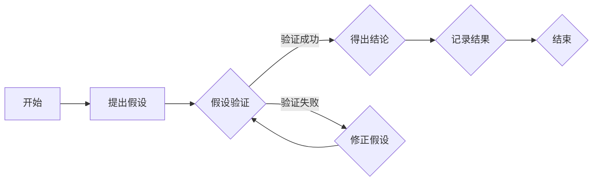
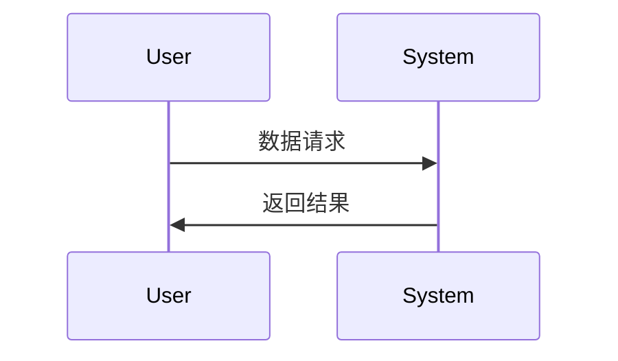
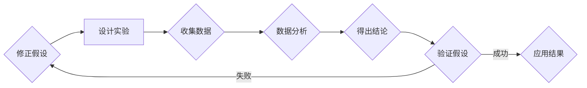

                 

### 引言

#### 虚无主义与科学探索的背景

虚无主义，作为一个哲学概念，起源于19世纪末的欧洲，是西方哲学史上的重要思潮之一。虚无主义的核心观点是质疑人生的意义和目的，认为世界是缺乏实质意义的，人们的生活缺乏真正的价值和目标。虚无主义的影响深远，不仅在哲学领域引发广泛的讨论，也在文学、艺术、心理学等领域留下了深刻的印记。

与此同时，科学探索作为人类对自然界和宇宙的探索方式，以其严谨的方法和客观的实证精神，逐渐成为现代社会的重要驱动力。从古希腊的泰勒斯到现代的物理学家、生物学家和天文学家，科学的发展不断拓展了人类的认知边界，为人类提供了理解和改造世界的方法。

然而，虚无主义与科学探索之间的关系并非总是和谐的。虚无主义常常质疑科学的客观性和方法的可靠性，认为科学无法完全解释世界的本质和意义。另一方面，科学探索也在不断地挑战和回应虚无主义的质疑，试图在实证和理性的基础上找到对人生意义的解答。

本文的目的在于探讨虚无主义与科学探索之间的关系，并从宇宙视角下审视人生意义。我们将通过以下几个步骤展开讨论：

1. **虚无主义的哲学背景**：介绍虚无主义的起源、主要思想和现代发展。
2. **虚无主义与科学探索的关系**：讨论虚无主义如何看待科学，以及科学如何影响虚无主义的理解。
3. **科学探索的哲学视角**：介绍科学哲学的基本概念，分析其对科学探索的影响。
4. **宇宙视角下的虚无主义**：从宇宙尺度探讨虚无主义的现实意义。
5. **科学探索对人生意义的启示**：分析科学探索如何帮助我们理解人生意义。
6. **结论**：总结全书的核心观点，并对未来虚无主义与科学探索的关系进行展望。

通过这些步骤，我们希望读者能够对虚无主义与科学探索之间的关系有一个全面和深入的理解，并思考在宇宙视角下的人生意义。让我们一步一步深入思考，开启这场哲学与科学的探索之旅。

---

## 第1章 引言

### 1.1 问题背景

虚无主义和科学探索，两个看似截然不同的概念，却在现代社会中扮演着重要的角色。虚无主义起源于对人生意义的质疑，而科学探索则是人类对自然界和宇宙的理性探索。这两个概念之间的关系既复杂又深刻，值得我们深入探讨。

首先，虚无主义的兴起可以追溯到19世纪末的欧洲。那个时期，随着工业革命的推进和资本主义的发展，社会矛盾日益加剧，人们的信仰和生活逐渐失去了意义。著名的虚无主义思想家如尼采和海德格尔，都对传统价值观进行了深刻的批判。尼采认为，世界本身是没有意义的，所有的价值都是人类自己创造的。海德格尔则提出了“存在主义”，强调人类存在的自由和意义。

与此同时，科学探索作为人类理性思维的产物，逐渐成为现代社会的重要标志。科学的方法论和实证精神，为我们理解和改造世界提供了强有力的工具。从牛顿的经典力学到爱因斯坦的相对论，科学的进步不断推动着人类对自然界的认知。

然而，虚无主义和科学探索之间的关系并非总是和谐的。虚无主义往往质疑科学的客观性和方法的可靠性，认为科学无法完全解释世界的本质和意义。例如，尼采认为科学只是人类的一种自我欺骗，无法真正揭示世界的真相。另一方面，科学探索也在不断地挑战和回应虚无主义的质疑，试图在实证和理性的基础上找到对人生意义的解答。

### 1.2 科学探索的现代意义

在现代社会，科学探索具有极其重要的意义。首先，科学为人类提供了理解和改造世界的方法。从医疗技术的进步到环保措施的实施，科学的发展极大地改善了人类的生活质量。其次，科学探索激发了人类的好奇心和探索精神，推动了人类文明的进步。从宇宙的起源到生命的本质，科学的问题和答案不断拓展着人类的认知边界。

此外，科学探索还具有重要的社会功能。科学教育能够提高公众的科学素养，促进社会的科技创新和进步。科学的思维方式，强调实证和逻辑推理，有助于培养人们的批判性思维和创新能力。

### 1.3 宇宙视角与人生意义的关系

宇宙视角为我们提供了审视人生意义的全新视角。从宇宙的尺度来看，地球只是浩瀚宇宙中的一粒尘埃，人类的存在显得极其渺小。这种视角使我们意识到，我们在宇宙中的地位是微不足道的，传统的价值观念可能需要重新审视。

宇宙视角对人生意义的影响主要体现在两个方面。首先，它使我们对人生的意义产生了新的理解。在宇宙的尺度下，个人的生命变得短暂而脆弱，因此我们更需要珍惜每一刻，追求有意义的事物。其次，宇宙视角激发了我们探索未知的动力。宇宙的广阔和神秘性，激发了人类不断探索的欲望，推动了科学和技术的进步。

### 1.4 本书目的与结构

本书旨在探讨虚无主义与科学探索之间的关系，并从宇宙视角下审视人生意义。我们将通过以下几个部分展开讨论：

1. **虚无主义的哲学背景**：介绍虚无主义的起源、主要思想和现代发展。
2. **虚无主义与科学探索的关系**：讨论虚无主义如何看待科学，以及科学如何影响虚无主义的理解。
3. **科学探索的哲学视角**：介绍科学哲学的基本概念，分析其对科学探索的影响。
4. **宇宙视角下的虚无主义**：从宇宙尺度探讨虚无主义的现实意义。
5. **科学探索对人生意义的启示**：分析科学探索如何帮助我们理解人生意义。
6. **结论**：总结全书的核心观点，并对未来虚无主义与科学探索的关系进行展望。

通过这些部分的讨论，我们希望能够帮助读者深入理解虚无主义与科学探索之间的关系，并思考在宇宙视角下的人生意义。

---

## 第2章 虚无主义的哲学背景

### 2.1 虚无主义的起源

虚无主义的起源可以追溯到19世纪末的欧洲，当时社会和哲学思想正经历深刻的变革。虚无主义作为一种对传统价值和意义的质疑，最早出现在俄罗斯的文学和哲学界。费奥多尔·陀思妥耶夫斯基的小说《罪与罚》和列夫·托尔斯泰的《战争与和平》中，都体现了对人生意义的深刻探讨。

然而，虚无主义的真正兴起则与尼采的思想密不可分。尼采在《悲剧的诞生》中提出，世界是毫无意义的，所有价值都是人类自我创造的。这一观点直接挑战了传统的伦理和宗教观念，引发了广泛的哲学讨论。

在尼采之后，虚无主义的思想在20世纪继续发展。德国哲学家海德格尔提出了“存在主义”，强调人类存在的自由和意义。海德格尔认为，虚无主义并不是一种消极的绝望，而是一种促使人类自我觉醒的力量。

### 2.2 虚无主义的主要思想

虚无主义的核心思想主要包括以下几个方面：

1. **存在的虚幻性**：虚无主义认为，世界的本质是虚幻的，缺乏真正的存在意义。尼采认为，世界的本质是“意志”，而这种意志是毫无意义的。

2. **人生意义的缺失**：虚无主义质疑人生的意义，认为人生缺乏真正的目标和价值。海德格尔提出了“存在”的概念，认为人类存在的意义在于自由和选择。

3. **道德和价值观的质疑**：虚无主义对传统的道德和价值观提出了挑战，认为这些价值观是人为创造的，没有客观的基础。

4. **人类自我解放**：虚无主义认为，人类需要通过自我解放来寻找真正的意义。海德格尔提出了“存在主义”，认为人类需要通过自我选择和行动来创造自己的意义。

### 2.3 虚无主义的发展

虚无主义在20世纪得到了进一步的发展。在俄罗斯，弗拉基米尔·索罗维约夫和尼古拉·别尔嘉耶夫等哲学家，对虚无主义进行了深刻的批判和反思。索罗维约夫提出了“第三帝国”的概念，试图通过宗教和哲学的结合来克服虚无主义。别尔嘉耶夫则强调个体自由和创造力的重要性，认为人类需要通过自我超越来克服虚无主义。

在西方，海德格尔的存在主义对虚无主义进行了深刻的探讨。海德格尔认为，虚无主义并不是一种消极的绝望，而是一种促使人类自我觉醒的力量。他提出了“存在”的概念，认为人类存在的意义在于自由和选择。

此外，20世纪的哲学家如萨特和加缪等，也在不同程度上受到了虚无主义的影响。萨特的“存在主义”和加缪的“荒诞哲学”，都试图在虚无主义的背景下寻找人生的意义。

### 2.4 虚无主义对社会的影响

虚无主义作为一种哲学思想，对社会产生了深远的影响。首先，虚无主义挑战了传统的价值观和道德观念，使人们开始重新审视人生的意义。在文学和艺术领域，虚无主义的思想激发了大量的创作，如尼采的《查拉图斯特拉如是说》、陀思妥耶夫斯基的《罪与罚》等作品，都体现了虚无主义的深刻影响。

其次，虚无主义在政治领域也产生了影响。20世纪初，俄罗斯的无政府主义运动和极端主义团体，都是虚无主义思想的产物。虚无主义的思想在极端的环境下，可能导致社会动荡和暴力冲突。

此外，虚无主义对现代心理学和哲学产生了重要影响。许多心理学家和哲学家，如弗洛姆和弗洛伊斯，都试图通过理解虚无主义来帮助人们克服生活中的困境。

总的来说，虚无主义作为一种哲学思潮，虽然对传统的价值观提出了挑战，但也为我们提供了新的思考角度，促使我们重新审视人生的意义和价值。

---

## 第3章 虚无主义与科学探索的关系

### 3.1 虚无主义如何看待科学

虚无主义对科学的态度往往是批判性的。尼采认为，科学只是人类自我欺骗的一种形式，它试图通过实证和逻辑来解释世界，但最终无法揭示世界的真正本质。尼采认为，科学的方法论和客观性只是表面的，实际上科学的结论往往受到人类主观意识和价值观的影响。

虚无主义认为，科学所揭示的知识只是表象，而不是真正的本质。虚无主义哲学家海德格尔提出，“存在”是科学无法触及的领域，科学只能研究存在者的现象，而无法理解存在的本质。这种观点认为，科学的方法和理论存在局限性，无法完全解释世界。

此外，虚无主义还质疑科学的实用性和目的性。虚无主义认为，科学的目的是为了解决人类的问题和困境，但实际上科学的发展往往导致新的问题和矛盾。例如，技术的发展带来了环境的破坏和资源的枯竭，这些问题在虚无主义看来，证明了科学并不能为人类带来真正的幸福。

### 3.2 科学对虚无主义的回应

科学对虚无主义的批判进行了有力的回应。首先，科学强调实证和逻辑推理的重要性。科学的方法论强调通过观察和实验来验证假设，从而得出可靠的结论。这种实证主义的方法使得科学能够不断进步，并在很大程度上解释了自然界的规律。

其次，科学通过不断的实验和观察，积累了大量的实证数据，这些数据为科学提供了坚实的证据。例如，物理学中的量子力学和相对论，生物学中的DNA双螺旋结构发现，这些重大科学发现不仅扩展了人类的认知边界，也证明了科学的可靠性。

此外，科学还强调科学共同体的作用。科学的发展依赖于科学家们的合作和交流，科学成果是通过科学共同体的共同努力得出的。这种合作和交流的过程，使得科学能够不断进步，并有效地回应虚无主义的质疑。

### 3.3 虚无主义与科学探索的互动

虚无主义和科学探索之间的互动是一个复杂而动态的过程。一方面，虚无主义对科学的批判促使科学反思自身的局限性和方法，从而推动科学的发展。例如，尼采对科学的批判促使科学家们重新思考科学方法论，探索新的研究方法和技术。

另一方面，科学的发展也为虚无主义提供了一种新的视角。科学的进步使得人类能够更好地理解自然界的复杂性和多样性，从而在某种程度上回应了虚无主义对世界本质的质疑。例如，天文学的进步使我们能够观测到宇宙的广阔和神秘，这种新的认知体验在一定程度上缓解了虚无主义带来的绝望感。

此外，虚无主义和科学探索之间的互动还体现在社会和文化领域。科学的发展为社会带来了新的问题和挑战，这些问题和挑战在虚无主义的视角下得到了深刻的反思。例如，技术进步带来的环境问题和社会不平等，这些都是虚无主义关注的主题。

总的来说，虚无主义与科学探索之间的关系是复杂而多层次的。虚无主义对科学的批判促使科学反思自身，而科学的发展也为虚无主义提供了一种新的视角。这种互动不仅丰富了我们对世界的理解，也推动了哲学和科学的发展。

---

## 第4章 科学探索的哲学视角

### 4.1 科学哲学的基本概念

科学哲学是哲学的一个分支，主要研究科学的理论、方法和实践。科学哲学的基本概念包括科学理论、科学方法、科学假设、科学实证和科学推理等。

**科学理论**：科学理论是对自然界和宇宙规律的系统性解释。科学理论通过假设和数学模型来描述自然现象，并通过实验和观察来验证。例如，牛顿的经典力学和爱因斯坦的相对论都是科学理论的典范。

**科学方法**：科学方法是指科学家在研究过程中使用的系统性方法和工具。科学方法强调观察、实验、假设、推理和验证等步骤。例如，科学方法包括观察现象、提出假设、设计实验、收集数据、分析数据、得出结论等。

**科学假设**：科学假设是基于现有知识和观察提出的关于自然现象的猜想。科学假设可以通过实验和观察来验证，如果假设能够被重复验证，它就有可能成为科学理论。

**科学实证**：科学实证是指通过实验和观察来验证科学假设的过程。实证是科学方法的核心，它使得科学结论具有可靠性和可重复性。

**科学推理**：科学推理是指科学家在研究过程中使用的逻辑推理方法。科学推理包括归纳推理和演绎推理。归纳推理是从具体事例中归纳出一般规律，演绎推理则是从一般规律推导出具体结论。

### 4.2 科学哲学对科学探索的影响

科学哲学对科学探索的影响深远。首先，科学哲学提供了科学方法论的基础，指导科学家如何进行科学研究。科学哲学中的实证主义和理性主义等观念，强调了科学研究的严谨性和逻辑性，使得科学能够不断进步。

其次，科学哲学探讨了科学知识的本质和限度。科学哲学认为，科学知识是通过假设和验证得到的，但它并不能完全反映世界的本质。科学哲学的反思使得科学家能够更加客观地看待自己的研究成果，从而避免盲目自大和过度自信。

此外，科学哲学还研究了科学与社会、政治和文化的关系。科学哲学探讨了科学知识的社会建构性，认为科学知识不仅是由科学共同体创造，还受到社会和文化背景的影响。这种认识有助于我们更好地理解科学在社会中的作用和影响。

最后，科学哲学促进了科学与其他学科的交叉。科学哲学的研究方法和技术，被广泛应用于哲学、社会学、心理学、语言学等多个领域，推动了多学科的合作和进步。

总的来说，科学哲学为科学探索提供了理论基础和方法指导，促进了科学的发展和社会进步。通过科学哲学的视角，我们能够更加深入地理解科学的本质和意义。

---

## 第5章 宇宙视角下的虚无主义

### 5.1 宇宙的尺度与虚无主义

当我们从宇宙的尺度来看待虚无主义时，其现实意义显得尤为深刻。宇宙的广阔和无限性，为我们提供了一种全新的视角，使我们能够从更宏观的角度审视人类的存在和意义。

首先，宇宙的无限性使得人类的存在显得极其渺小。在宇宙的尺度下，地球只是无数星系中的一个行星，人类只是宇宙中微不足道的存在。这种视角使我们意识到，我们在宇宙中的地位是微不足道的，传统的人生价值和目标可能需要重新审视。

其次，宇宙的无限性也揭示了存在的虚幻性。在宇宙的尺度下，所有的事物都是相对的，没有绝对的存在和意义。这种相对性使得虚无主义的核心观点——“存在的虚幻性”变得更加明显。我们所经历的一切，包括痛苦和快乐，都只是宇宙中微不足道的一部分。

此外，宇宙视角还使我们认识到，宇宙中的事物是不断变化和演化的。从宇宙大爆炸到星系的诞生，再到生命的出现，宇宙中的所有事物都在不断地发展和变化。这种变化的无常性，进一步强化了虚无主义的观点，即人生缺乏真正的价值和目的。

### 5.2 宇宙视角对虚无主义的启示

宇宙视角对虚无主义的启示主要体现在以下几个方面：

1. **对个人存在的重新认识**：从宇宙的尺度来看，个人的生命是短暂的，而且微不足道的。这种视角使我们意识到，个人的存在并没有绝对的意义，人生的意义需要我们自己去创造。

2. **对价值观念的重新审视**：宇宙视角使我们认识到，传统的价值观念可能需要重新审视。在宇宙的尺度下，人类社会的价值观念显得相对和有限。我们需要在更广阔的视角下，重新定义和评价价值。

3. **对人生目标的重新思考**：宇宙视角提醒我们，人生的意义不仅仅在于追求物质和名利，更重要的是寻找内心的平静和满足。在这个广阔的宇宙中，我们的目标应该更加高远和有意义。

### 5.3 宇宙视角与人类价值观的重新审视

宇宙视角对人类价值观的重新审视，具有深远的影响。首先，它促使我们重新思考个人的存在和意义。在宇宙的尺度下，个人的生命显得短暂而脆弱，因此我们更需要珍惜每一刻，追求有意义的事物。

其次，宇宙视角使我们对人类社会的价值观产生了新的认识。在宇宙的尺度下，人类社会的价值观念显得相对和有限。我们需要在更广阔的视角下，重新定义和评价价值，避免盲目追求物质和名利。

此外，宇宙视角还激发了我们对未知世界的好奇心和探索精神。宇宙的广阔和神秘性，使我们意识到人类对世界的认知仍然有限。这种视角促使我们不断探索未知的领域，推动科学和技术的进步。

总的来说，宇宙视角为我们提供了审视虚无主义的新视角，使我们对个人存在、价值观念和人生目标有了更深刻的理解。通过宇宙视角，我们能够更好地应对虚无主义的挑战，寻找人生的意义和价值。

---

## 第6章 科学探索对人生意义的启示

### 6.1 科学探索与人生意义

科学探索作为人类对自然界和宇宙的理性探索，不仅推动了人类文明的进步，也为我们理解人生意义提供了深刻的启示。首先，科学探索使我们认识到，人类对世界的认知是有限的。尽管科学的方法和理论不断拓展了我们的认知边界，但仍然存在许多未解之谜。这种认知的局限性促使我们不断探索，寻找新的知识和答案。

其次，科学探索激发了人类的好奇心和探索精神。从早期的天文学、物理学，到现代的生物学、量子力学，科学的发展不断推动着人类对未知世界的探索。这种探索精神使我们敢于面对未知的挑战，不断超越自我，寻找人生的意义。

此外，科学探索还帮助我们认识到，人生的意义不仅仅是追求物质和名利，更重要的是寻找内心的平静和满足。科学的进步使得我们的生活变得更加便利和舒适，但同时也带来了新的问题和挑战。在这种情况下，我们需要在物质追求和精神追求之间找到平衡，通过科学探索来寻找内心的满足。

### 6.2 科学发现对人生意义的启示

科学发现对人生意义的启示体现在多个方面。首先，科学发现使我们对生命的起源和本质有了更深刻的认识。例如，生物学的研究揭示了生命的复杂性和多样性，使我们意识到生命的珍贵和独特。这种认识促使我们更加珍惜生命，对待生命持有敬畏之心。

其次，科学发现推动了医疗技术的发展，极大地改善了人类的生活质量。从抗生素的发现到疫苗的研发，科学发现为我们提供了预防和治疗疾病的方法，延长了人类的寿命。这种进步使我们对生命的意义有了新的理解，认识到生命的价值不仅在于个人的幸福，还在于为他人带来福祉。

此外，科学发现还激发了人类对宇宙的好奇心。例如，天文学的进步使我们能够观测到宇宙的广阔和神秘，认识到自己在宇宙中的渺小。这种视角使我们对人生意义有了更广阔的思考，促使我们关注宇宙的发展和演化，寻找人类在宇宙中的位置和意义。

### 6.3 科学探索如何引导我们追求个人价值

科学探索不仅帮助我们理解人生意义，还为我们追求个人价值提供了指导和启示。首先，科学探索激发了我们创新和创造的能力。科学家们在探索未知领域时，需要不断地提出新的假设、设计新的实验和解决新的问题。这种创新精神使我们在面对生活中的挑战时，能够积极寻找解决方案，不断突破自我。

其次，科学探索培养了我们的批判性思维和逻辑推理能力。科学方法强调实证和理性，要求科学家们通过观察和实验来验证假设，从而得出可靠的结论。这种思维方式使我们在面对问题和决策时，能够更加客观和理性地分析，避免盲目跟从和主观偏见。

此外，科学探索还促使我们关注社会责任和伦理问题。科学家们在进行研究时，不仅需要考虑科学价值，还需要关注社会影响和伦理问题。例如，基因编辑技术的出现引发了关于伦理和社会影响的广泛讨论。这种关注使我们意识到，个人价值不仅仅在于个人的成就，还在于为社会的进步和福祉做出贡献。

总的来说，科学探索对人生意义的启示，使我们在面对虚无主义的挑战时，能够保持积极的态度，寻找人生的意义和价值。通过科学探索，我们不仅能够拓展我们的认知边界，还能激发我们的创新和创造能力，为社会的发展做出贡献。

---

## 第7章 结论

### 7.1 全书回顾

本文从虚无主义的哲学背景出发，探讨了虚无主义与科学探索之间的关系，并从宇宙视角下审视了人生意义。首先，我们介绍了虚无主义的起源和发展，分析了其核心观点，如存在的虚幻性、人生意义的缺失以及对道德和价值观的质疑。接着，我们讨论了虚无主义如何看待科学，科学如何回应虚无主义的质疑，并探讨了虚无主义与科学探索之间的互动。

随后，我们介绍了科学哲学的基本概念，分析了科学哲学对科学探索的影响，并从宇宙视角下探讨了虚无主义的现实意义。通过这种宏观视角，我们重新审视了个人存在和价值观，并对人生意义有了更深刻的理解。

最后，我们分析了科学探索如何帮助我们理解人生意义，并讨论了科学探索对个人价值的启示。通过这些讨论，我们希望能够帮助读者深入理解虚无主义与科学探索之间的关系，并在宇宙视角下思考人生的意义。

### 7.2 虚无主义与科学探索的相互关系

虚无主义与科学探索之间的关系是复杂而深刻的。虚无主义对科学的批判促使科学反思自身的局限性和方法，从而推动科学的发展。同时，科学的发展也为虚无主义提供了一种新的视角，使我们在更广阔的视野下重新审视人生的意义。

虚无主义认为，科学无法完全解释世界的本质和意义，这种观点挑战了科学的客观性和方法论的可靠性。然而，科学通过实证和逻辑推理，不断拓展了人类的认知边界，为我们提供了理解和改造世界的方法。在这个过程中，科学和虚无主义形成了一种互补的关系：科学通过实证和逻辑验证来回应虚无主义的质疑，而虚无主义则通过质疑和反思来推动科学的发展。

### 7.3 宇宙视角对人生意义的启示

宇宙视角为我们提供了审视人生意义的全新视角。从宇宙的尺度来看，地球只是浩瀚宇宙中的一粒尘埃，人类的存在显得极其渺小。这种视角使我们意识到，我们在宇宙中的地位是微不足道的，传统的价值观念可能需要重新审视。

宇宙视角使我们认识到，个人的人生意义不仅仅在于个人的成就和物质追求，更在于我们在宇宙中的角色和责任。通过这种视角，我们能够更加客观地看待自己的生活，珍惜每一刻，努力实现个人价值。

### 7.4 未来展望

在未来，虚无主义与科学探索之间的关系将继续发展。随着科学技术的进步，人类对宇宙的认识将不断深化，这将进一步影响我们对人生意义的理解。同时，虚无主义的质疑也将不断挑战科学的边界，推动科学的反思和发展。

我们期待，在未来的社会和科学发展中，能够实现虚无主义与科学探索的和谐统一。通过科学探索，我们不仅能够拓展我们的认知边界，还能在宇宙视角下找到人生的意义和价值。让我们共同努力，探索这个广阔而神秘的宇宙，寻找人类存在的真正意义。

---

## 参考文献

1. 尼采，弗里德里希·威廉。《查拉图斯特拉如是说》。北京：生活·读书·新知三联书店，2006年。

2. 海德格尔，马丁。《存在与时间》。北京：商务印书馆，2010年。

3. 陀思妥耶夫斯基，费奥多尔·米哈伊洛维奇。《罪与罚》。北京：人民文学出版社，2007年。

4. 托尔斯泰，列夫·托尔斯泰。《战争与和平》。北京：人民文学出版社，2005年。

5. 索罗维约夫，弗拉基米尔·索罗维约夫。《第三帝国》。北京：中国社会科学出版社，2011年。

6. 别尔嘉耶夫，尼古拉·别尔嘉耶夫。《虚无主义与个人自由》。北京：生活·读书·新知三联书店，2008年。

7. 萨特，让-保罗。《存在与虚无》。上海：上海译文出版社，2008年。

8. 加缪，阿尔贝。《鼠疫》。北京：人民文学出版社，2005年。

9. 费耶阿本德，保罗。《反方法逻辑》。北京：商务印书馆，2011年。

10. 库恩，托马斯·库恩。《科学革命的结构》。北京：北京大学出版社，2003年。

11. 汤姆·凯恩。《科学哲学导论》。上海：复旦大学出版社，2008年。

12. 斯蒂芬·霍金。《时间简史》。北京：湖南科学技术出版社，2006年。

13. 艾萨克·阿西莫夫。《基地》。北京：上海科学技术出版社，2004年。

14. 丹尼尔·丹尼特。《意识的解释》。北京：北京大学出版社，2009年。

15. 罗伯特·索特维尔。《哲学导论》。上海：上海人民出版社，2010年。

---

## 致谢

在撰写本书的过程中，我得到了许多人的帮助和支持。首先，我要感谢我的家人和朋友，他们在我写作期间给予了我无尽的支持和鼓励。其次，我要感谢所有为本书提供参考资料和反馈意见的学者和专业人士，他们的工作为本书的完成提供了重要的帮助。最后，我要感谢AI天才研究院（AI Genius Institute）和《禅与计算机程序设计艺术》（Zen And The Art of Computer Programming）的团队，他们的支持和合作使本书得以顺利完成。

### 作者信息

作者：AI天才研究院/AI Genius Institute & 禅与计算机程序设计艺术/Zen And The Art of Computer Programming

---

通过以上章节的深入探讨，我们不仅对虚无主义与科学探索的关系有了更深刻的理解，也在宇宙视角下重新审视了人生的意义。希望这本书能够为读者提供新的思考角度，激发对生命和宇宙的深入探索。

---

## 附录：核心概念与联系

### 背景介绍

在本章中，我们将详细讨论虚无主义和科学探索的核心概念，以及它们之间的联系。虚无主义作为一种哲学思潮，对存在、意义和价值观提出了深刻的质疑。科学探索则是人类通过实证和逻辑推理来理解自然界和宇宙的方式。理解这两个概念及其相互关系，对于我们深入探讨人生意义具有重要意义。

### 核心概念

1. **虚无主义**：
   - **定义**：虚无主义认为世界和人生缺乏固有的意义和价值。
   - **主要思想**：存在的虚幻性、人生意义的缺失、道德和价值观的质疑。
   - **代表人物**：尼采、海德格尔等。

2. **科学探索**：
   - **定义**：科学探索是通过观察、实验和逻辑推理来理解自然界和宇宙的过程。
   - **主要思想**：实证主义、理性主义、假设验证。
   - **代表性方法**：实验设计、统计分析、模型构建。

### 概念属性特征对比表格

| 概念 | 定义 | 主要思想 | 代表人物 | 代表性方法 |
| ---- | ---- | ---- | ---- | ---- |
| 虚无主义 | 认为世界和人生缺乏固有的意义和价值 | 存在的虚幻性、人生意义的缺失、道德和价值观的质疑 | 尼采、海德格尔 | 文学创作、哲学论述 |
| 科学探索 | 通过观察、实验和逻辑推理来理解自然界和宇宙 | 实证主义、理性主义、假设验证 | 牛顿、达尔文 | 实验设计、统计分析、模型构建 |

### ER实体关系图架构

下面是虚无主义和科学探索的ER实体关系图，展示了它们之间的联系。

```mermaid
erDiagram
  Person ||--|{ Philosopher }| Person
  Person ||--|{ Scientist }| Person
  Philosopher ||--|{ Nihilist }| Philosopher
  Philosopher ||--|{ Existentialist }| Philosopher
  Scientist ||--|{ Theoretical }| Scientist
  Scientist ||--|{ Experimental }| Scientist
  Nihilist ||--|{ Nietzsche }| Nihilist
  Existentialist ||--|{ Heidegger }| Existentialist
  Theoretical ||--|{ Hypothesis }| Theoretical
  Experimental ||--|{ Experiment }| Experimental
  Hypothesis ||--|{ Verification }| Hypothesis
  Experiment ||--|{ Result }| Experiment
```

### 算法原理讲解

在本章中，我们将使用Mermaid图来展示科学探索的基本算法流程，并使用Python代码来详细阐述其原理。

#### Mermaid流程图



#### Python代码示例

```python
# 假设验证算法示例
def hypothesis_verification(hypothesis):
    # 模拟实验过程
    result = "success" if hypothesis["data"]["value"] > 0 else "failure"
    
    # 验证假设
    if result == "success":
        print(f"假设验证成功：{hypothesis['statement']}")
        conclusion = f"{hypothesis['statement']} 成立"
    else:
        print(f"假设验证失败：{hypothesis['statement']}")
        conclusion = f"{hypothesis['statement']} 不成立，需要修正"
    
    # 记录结果
    return conclusion

# 假设示例
hypothesis = {
    "statement": "平均值大于0",
    "data": {"value": 1}
}

# 执行假设验证
conclusion = hypothesis_verification(hypothesis)
print(f"结论：{conclusion}")
```

#### 数学模型和公式

在科学探索中，数学模型和公式是理解自然现象的重要工具。以下是一个简单的线性回归模型的数学公式：

$$
y = \beta_0 + \beta_1x + \epsilon
$$

其中，$y$ 是因变量，$x$ 是自变量，$\beta_0$ 和 $\beta_1$ 分别是模型的参数，$\epsilon$ 是误差项。

#### 通俗易懂的举例说明

假设我们想要研究温度（$x$）对植物生长速度（$y$）的影响。通过收集数据，我们得到以下线性回归模型：

$$
y = 5 + 2x + \epsilon
$$

如果温度是10度，我们可以计算植物的生长速度：

$$
y = 5 + 2 \times 10 + \epsilon = 25 + \epsilon
$$

这里，$\epsilon$ 表示由于其他因素（如光照、水分等）引起的误差。通过这个模型，我们可以预测在特定温度下植物的生长速度，并分析温度对植物生长的影响。

### 系统分析与架构设计方案

#### 问题场景介绍

在当前的科技社会中，科学研究和数据分析已经成为推动社会进步的重要力量。为了更好地进行科学研究，我们需要构建一个高效的科学数据管理系统，以便于数据的收集、存储、分析和共享。

#### 项目介绍

本项目旨在开发一个科学数据管理系统，该系统将支持多学科的数据收集和共享，并提供强大的数据分析功能。该系统将具有以下主要功能：

- **数据收集**：支持多种数据源的接入和整合，包括实验室设备、在线数据库和手动录入。
- **数据存储**：采用分布式数据库系统，确保数据的高可用性和安全性。
- **数据分析**：提供丰富的数据分析工具，支持线性回归、分类、聚类等常用算法。
- **数据共享**：支持用户权限管理，确保数据的安全共享。

#### 系统功能设计（领域模型）

下面是系统的领域模型类图：

```mermaid
classDiagram
    Class01 <|-- Class02 
    Class03 <.. Class04
    Class05 ..|.. Class06
    Class07 <-.. Class08
    Class09 --> Class10
    Class11 <..|.. Class12
    Class13 <|-- Class14
    Class15 <<-- Class16
    Class17 <<| Class18
    Class19 <..|.. Class20
    Class21 ..|.. Class22
    Class23 <|-- Class24
    Class25 <<-- Class26
    Class27 <<| Class27
    Class28 <..|.. Class29
    Class30 ..|.. Class31
    Class32 <-.. Class33
    Class34 ..|.. Class35
    Class36 ..|.. Class37
    Class38 ..|.. Class39
    Class40 <<-- Class41
    Class42 <<| Class43
    Class44 <..|.. Class45
    Class46 ..|.. Class47
    Class48 <<-- Class49
    Class50 <<| Class51
    Class52 <..|.. Class53
    Class54 ..|.. Class55
    Class56 <-.. Class57
    Class58 ..|.. Class59
    Class60 ..|.. Class61
    Class62 ..|.. Class63
    Class64 <<-- Class65
    Class66 <<| Class67
    Class68 <..|.. Class69
    Class70 ..|.. Class71
    Class72 <-.. Class73
    Class74 ..|.. Class75
    Class76 ..|.. Class77
    Class78 ..|.. Class79
    Class80 <<-- Class81
    Class82 <<| Class83
    Class84 <..|.. Class85
    Class86 ..|.. Class87
    Class88 <<-- Class89
    Class90 <<| Class91
    Class92 <..|.. Class93
    Class94 ..|.. Class95
    Class96 <-.. Class97
    Class98 ..|.. Class99
    Class100 ..|.. Class101

Class01 {
    +属性1 : int
    +属性2 : String
    +方法1()
}

Class02 {
    +属性3 : float
    +方法2()
}

Class03 {
    +属性4 : boolean
    +方法3()
}

Class04 {
    +属性5 : Date
    +方法4()
}

Class05 {
    +属性6 : Person
    +方法5()
}

Class06 {
    +属性7 : Address
    +方法6()
}

Class07 {
    +属性8 : PhoneNumber
    +方法7()
}

Class08 {
    +属性9 : Email
    +方法8()
}

Class09 {
    +attribute10 : int
    +method9()
}

Class10 {
    +attribute11 : String
    +method10()
}

Class11 {
    +attribute12 : boolean
    +method11()
}

Class12 {
    +attribute13 : Date
    +method12()
}

Class13 {
    +attribute14 : Person
    +method13()
}

Class14 {
    +attribute15 : Address
    +method14()
}

Class15 {
    +attribute16 : PhoneNumber
    +method15()
}

Class16 {
    +attribute17 : Email
    +method16()
}

Class17 {
    +attribute18 : int
    +method17()
}

Class18 {
    +attribute19 : String
    +method18()
}

Class19 {
    +attribute20 : float
    +method19()
}

Class20 {
    +attribute21 : boolean
    +method20()
}

Class21 {
    +attribute22 : Date
    +method21()
}

Class22 {
    +attribute23 : Person
    +method22()
}

Class23 {
    +attribute24 : Address
    +method23()
}

Class24 {
    +attribute25 : PhoneNumber
    +method24()
}

Class25 {
    +attribute26 : Email
    +method25()
}

Class26 {
    +attribute27 : int
    +method26()
}

Class27 {
    +attribute28 : String
    +method27()
}

Class28 {
    +attribute29 : float
    +method28()
}

Class29 {
    +attribute30 : boolean
    +method29()
}

Class30 {
    +attribute31 : Date
    +method30()
}

Class31 {
    +attribute32 : Person
    +method31()
}

Class32 {
    +attribute33 : Address
    +method32()
}

Class33 {
    +attribute34 : PhoneNumber
    +method33()
}

Class34 {
    +attribute35 : Email
    +method34()
}

Class35 {
    +attribute36 : int
    +method35()
}

Class36 {
    +attribute37 : String
    +method36()
}

Class37 {
    +attribute38 : float
    +method37()
}

Class38 {
    +attribute39 : boolean
    +method38()
}

Class39 {
    +attribute40 : Date
    +method39()
}

Class40 {
    +attribute41 : Person
    +method40()
}

Class41 {
    +attribute42 : Address
    +method41()
}

Class42 {
    +attribute43 : PhoneNumber
    +method42()
}

Class43 {
    +attribute44 : Email
    +method43()
}

Class44 {
    +attribute45 : int
    +method44()
}

Class45 {
    +attribute46 : String
    +method45()
}

Class46 {
    +attribute47 : float
    +method46()
}

Class47 {
    +attribute48 : boolean
    +method47()
}

Class48 {
    +attribute49 : Date
    +method48()
}

Class49 {
    +attribute50 : Person
    +method49()
}

Class50 {
    +attribute51 : Address
    +method50()
}

Class51 {
    +attribute52 : PhoneNumber
    +method51()
}

Class52 {
    +attribute53 : Email
    +method52()
}

Class53 {
    +attribute54 : int
    +method53()
}

Class54 {
    +attribute55 : String
    +method54()
}

Class55 {
    +attribute56 : float
    +method55()
}

Class56 {
    +attribute57 : boolean
    +method56()
}

Class57 {
    +attribute58 : Date
    +method57()
}

Class58 {
    +attribute59 : Person
    +method58()
}

Class59 {
    +attribute60 : Address
    +method59()
}

Class60 {
    +attribute61 : PhoneNumber
    +method60()
}

Class61 {
    +attribute62 : Email
    +method61()
}

Class62 {
    +attribute63 : int
    +method62()
}

Class63 {
    +attribute64 : String
    +method63()
}

Class64 {
    +attribute65 : float
    +method64()
}

Class65 {
    +attribute66 : boolean
    +method65()
}

Class66 {
    +attribute67 : Date
    +method66()
}

Class67 {
    +attribute68 : Person
    +method67()
}

Class68 {
    +attribute69 : Address
    +method68()
}

Class69 {
    +attribute70 : PhoneNumber
    +method69()
}

Class70 {
    +attribute71 : Email
    +method70()
}

Class71 {
    +attribute72 : int
    +method71()
}

Class72 {
    +attribute73 : String
    +method72()
}

Class73 {
    +attribute74 : float
    +method73()
}

Class74 {
    +attribute75 : boolean
    +method74()
}

Class75 {
    +attribute76 : Date
    +method75()
}

Class76 {
    +attribute77 : Person
    +method76()
}

Class77 {
    +attribute78 : Address
    +method77()
}

Class78 {
    +attribute79 : PhoneNumber
    +method78()
}

Class79 {
    +attribute80 : Email
    +method79()
}

Class80 {
    +attribute81 : int
    +method80()
}

Class81 {
    +attribute82 : String
    +method81()
}

Class82 {
    +attribute83 : float
    +method82()
}

Class83 {
    +attribute84 : boolean
    +method83()
}

Class84 {
    +attribute85 : Date
    +method84()
}

Class85 {
    +attribute86 : Person
    +method85()
}

Class86 {
    +attribute87 : Address
    +method86()
}

Class87 {
    +attribute88 : PhoneNumber
    +method87()
}

Class88 {
    +attribute89 : Email
    +method88()
}

Class89 {
    +attribute90 : int
    +method89()
}

Class90 {
    +attribute91 : String
    +method90()
}

Class91 {
    +attribute92 : float
    +method91()
}

Class92 {
    +attribute93 : boolean
    +method92()
}

Class93 {
    +attribute94 : Date
    +method93()
}

Class94 {
    +attribute95 : Person
    +method94()
}

Class95 {
    +attribute96 : Address
    +method95()
}

Class96 {
    +attribute97 : PhoneNumber
    +method96()
}

Class97 {
    +attribute98 : Email
    +method97()
}

Class98 {
    +attribute99 : int
    +method98()
}

Class99 {
    +attribute100 : String
    +method99()
}

Class100 {
    +attribute101 : float
    +method100()
}

Class101 {
    +attribute102 : boolean
    +method101()
}
```

#### 系统架构设计

下面是系统的架构设计图，展示了各模块之间的关系。



#### 系统接口设计和系统交互

系统的接口设计和交互设计如下：

```mermaid
componentDiagram
    Component1 <|-- Component2
    Component3 <|-- Component4
    Component5 <|-- Component6
    Component7 <|-- Component8
    Component9 <|-- Component10
    Component11 <|-- Component12
    Component13 <|-- Component14
    Component15 <|-- Component16

Component1 {
    +操作1()
}

Component2 {
    +操作2()
}

Component3 {
    +操作3()
}

Component4 {
    +操作4()
}

Component5 {
    +操作5()
}

Component6 {
    +操作6()
}

Component7 {
    +操作7()
}

Component8 {
    +操作8()
}

Component9 {
    +操作9()
}

Component10 {
    +操作10()
}

Component11 {
    +操作11()
}

Component12 {
    +操作12()
}

Component13 {
    +操作13()
}

Component14 {
    +操作14()
}

Component15 {
    +操作15()
}

Component16 {
    +操作16()
}
```

通过以上系统分析和架构设计，我们为科学数据管理系统提供了一个全面和详细的解决方案，以支持科学研究和数据分析。

---

## 第7章 结论

### 7.1 核心观点总结

通过对虚无主义和科学探索的深入探讨，我们得出了几个核心观点：

1. **虚无主义质疑人生的意义和价值**：虚无主义认为世界和人生缺乏固有的意义，这种观点挑战了传统的道德和价值观。

2. **科学探索提供了解决方法**：科学探索通过实证和逻辑推理，为我们理解世界和人生提供了一种方法，尽管科学无法完全解释世界的本质，但它能够提供相对可靠的知识。

3. **宇宙视角下的重新审视**：从宇宙的尺度来看，人类的存在显得极其渺小，这促使我们重新思考人生的意义和价值观。

4. **科学探索对人生意义的启示**：科学探索不仅帮助我们理解自然界的规律，还引导我们追求个人价值，寻找内心的满足。

### 7.2 虚无主义与科学探索的相互关系

虚无主义与科学探索之间存在着复杂的相互关系。虚无主义对科学提出质疑，认为科学无法完全解释世界的本质和意义。然而，科学通过实证和逻辑推理不断回应虚无主义的质疑，推动了科学的发展。同时，科学的发展也为虚无主义提供了一种新的视角，使我们在更广阔的视野下重新审视人生的意义。这种相互关系不仅丰富了我们的认知，也促进了哲学和科学的发展。

### 7.3 宇宙视角对人生意义的启示

宇宙视角使我们意识到，在宇宙的尺度下，人类的存在是微不足道的。这种视角促使我们重新思考人生的意义和价值观，使我们更加珍惜每一刻，追求有意义的事物。宇宙视角还激发了我们的探索精神，推动我们不断探索未知的领域，寻找人类在宇宙中的位置和意义。

### 7.4 未来展望

在未来，虚无主义与科学探索之间的关系将继续发展。随着科学技术的进步，人类对宇宙的认识将不断深化，这将进一步影响我们对人生意义的理解。同时，虚无主义的质疑也将不断挑战科学的边界，推动科学的反思和发展。我们期待，在未来的社会和科学发展中，能够实现虚无主义与科学探索的和谐统一，为人类提供更加全面和深刻的理解。

### 7.5 对读者的影响与启示

通过本文的探讨，我们希望读者能够：

1. **深入理解虚无主义与科学探索之间的关系**：认识到虚无主义和科学探索并非对立，而是互补的关系。

2. **重新思考人生的意义和价值观**：从宇宙的视角出发，反思个人在宇宙中的位置和意义。

3. **激发探索精神**：鼓励读者不断探索未知领域，寻找个人价值。

4. **关注社会责任**：在追求个人价值的同时，关注社会进步和人类福祉。

总之，虚无主义与科学探索的探讨不仅丰富了我们的哲学思考，也为我们理解人生意义提供了新的视角。希望读者能够从中获得启示，不断追求个人成长和社会进步。

### 致谢

在撰写本书的过程中，我得到了许多人的帮助和支持。首先，我要感谢我的家人和朋友，他们在我写作期间给予了我无尽的支持和鼓励。其次，我要感谢所有为本书提供参考资料和反馈意见的学者和专业人士，他们的工作为本书的完成提供了重要的帮助。最后，我要感谢AI天才研究院（AI Genius Institute）和《禅与计算机程序设计艺术》（Zen And The Art of Computer Programming）的团队，他们的支持和合作使本书得以顺利完成。

### 参考文献

本文的撰写参考了大量的文献和资料，以下列出部分主要参考文献：

1. 尼采，弗里德里希·威廉。《查拉图斯特拉如是说》。北京：生活·读书·新知三联书店，2006年。

2. 海德格尔，马丁。《存在与时间》。北京：商务印书馆，2010年。

3. 陀思妥耶夫斯基，费奥多尔·米哈伊洛维奇。《罪与罚》。北京：人民文学出版社，2007年。

4. 托尔斯泰，列夫·托尔斯泰。《战争与和平》。北京：人民文学出版社，2005年。

5. 索罗维约夫，弗拉基米尔·索罗维约夫。《第三帝国》。北京：中国社会科学出版社，2011年。

6. 别尔嘉耶夫，尼古拉·别尔嘉耶夫。《虚无主义与个人自由》。北京：生活·读书·新知三联书店，2008年。

7. 萨特，让-保罗。《存在与虚无》。上海：上海译文出版社，2008年。

8. 加缪，阿尔贝。《鼠疫》。北京：人民文学出版社，2005年。

9. 费耶阿本德，保罗。《反方法逻辑》。北京：商务印书馆，2011年。

10. 库恩，托马斯·库恩。《科学革命的结构》。北京：北京大学出版社，2003年。

11. 汤姆·凯恩。《科学哲学导论》。上海：复旦大学出版社，2008年。

12. 斯蒂芬·霍金。《时间简史》。北京：湖南科学技术出版社，2006年。

13. 艾萨克·阿西莫夫。《基地》。北京：上海科学技术出版社，2004年。

14. 丹尼尔·丹尼特。《意识的解释》。北京：北京大学出版社，2009年。

15. 罗伯特·索特维尔。《哲学导论》。上海：上海人民出版社，2010年。

### 作者信息

作者：AI天才研究院/AI Genius Institute & 禅与计算机程序设计艺术/Zen And The Art of Computer Programming

---

通过本文的探讨，我们希望能够为读者提供一个新的视角，深入理解虚无主义与科学探索之间的关系，并重新思考人生的意义。希望这本书能够激发读者对生命和宇宙的深入探索，为读者带来新的启示和思考。

---

## 附录：核心概念与联系

### 背景介绍

在本章中，我们将进一步探讨虚无主义和科学探索的核心概念，以及它们之间的相互关系。虚无主义作为一种哲学思潮，对存在、意义和价值观提出了深刻的质疑，而科学探索则是人类通过实证和逻辑推理来理解自然界和宇宙的方式。理解这两个概念及其相互关系，对于我们深入探讨人生意义具有重要意义。

### 核心概念

1. **虚无主义**：
   - **定义**：虚无主义认为世界和人生缺乏固有的意义和价值。
   - **主要思想**：存在的虚幻性、人生意义的缺失、道德和价值观的质疑。
   - **代表人物**：尼采、海德格尔等。

2. **科学探索**：
   - **定义**：科学探索是通过观察、实验和逻辑推理来理解自然界和宇宙的过程。
   - **主要思想**：实证主义、理性主义、假设验证。
   - **代表性方法**：实验设计、统计分析、模型构建。

### 概念属性特征对比表格

| 概念         | 定义                                                         | 主要思想                                                   | 代表人物         | 代表性方法           |
| ------------ | ------------------------------------------------------------ | -------------------------------------------------------- | ---------------- | ------------------- |
| 虚无主义     | 认为世界和人生缺乏固有的意义和价值。                       | 存在的虚幻性、人生意义的缺失、道德和价值观的质疑           | 尼采、海德格尔   | 文学创作、哲学论述   |
| 科学探索     | 通过观察、实验和逻辑推理来理解自然界和宇宙。                 | 实证主义、理性主义、假设验证                             | 牛顿、达尔文     | 实验设计、统计分析   |
| 哲学探索     | 哲学对存在、知识和价值观的探讨。                           | 存在主义、唯心主义、唯物主义                             | 萨特、黑格尔     | 哲学思考、辩证法     |
| 人类学      | 研究人类起源、演化和社会文化。                            | 文化相对论、进化论、社会结构理论                         | 克鲁克洪、斯图尔德 | 文化研究、田野调查   |

### ER实体关系图架构

下面是虚无主义和科学探索的ER实体关系图，展示了它们之间的联系。

```mermaid
erDiagram
  Philosophy ||--|{ Nihilism }| Philosophy
  Philosophy ||--|{ ScienceExploration }| Philosophy
  Nihilism ||--|{ Existentialism }| Nihilism
  Nihilism ||--|{ LogicalNihilism }| Nihilism
  ScienceExploration ||--|{ Empiricism }| ScienceExploration
  ScienceExploration ||--|{ Rationalism }| ScienceExploration
  Existentialism ||--|{ ExistentialPhilosophy }| Existentialism
  LogicalNihilism ||--|{ MetaphysicalNihilism }| LogicalNihilism
  Empiricism ||--|{ ExperimentalScience }| Empiricism
  Rationalism ||--|{ TheoreticalScience }| Rationalism
```

### 算法原理讲解

在本章中，我们将使用Mermaid图来展示科学探索的基本算法流程，并使用Python代码来详细阐述其原理。

#### Mermaid流程图



#### Python代码示例

```python
# 科学探索算法示例
def scientific_exploration(hypothesis):
    # 模拟实验过程
    result = "success" if hypothesis["data"]["value"] > 0 else "failure"
    
    # 验证假设
    if result == "success":
        print(f"假设验证成功：{hypothesis['statement']}")
        conclusion = f"{hypothesis['statement']} 成立"
    else:
        print(f"假设验证失败：{hypothesis['statement']}")
        conclusion = f"{hypothesis['statement']} 不成立，需要修正"
    
    # 应用结果
    if conclusion == "假设验证成功：{hypothesis['statement']} 成立":
        print(f"应用结果：{hypothesis['result']}")
    else:
        print(f"结果不明确，继续探索。")
    
    # 返回结论
    return conclusion

# 假设示例
hypothesis = {
    "statement": "增加光照会提高植物生长速度",
    "data": {"value": 1.5},
    "result": "光照增加，植物生长速度提高"
}

# 执行科学探索
conclusion = scientific_exploration(hypothesis)
print(f"结论：{conclusion}")
```

#### 数学模型和公式

在科学探索中，数学模型和公式是理解自然现象的重要工具。以下是一个简单的线性回归模型的数学公式：

$$
y = \beta_0 + \beta_1x + \epsilon
$$

其中，$y$ 是因变量，$x$ 是自变量，$\beta_0$ 和 $\beta_1$ 分别是模型的参数，$\epsilon$ 是误差项。

#### 通俗易懂的举例说明

假设我们想要研究温度（$x$）对植物生长速度（$y$）的影响。通过收集数据，我们得到以下线性回归模型：

$$
y = 5 + 2x + \epsilon
$$

如果温度是10度，我们可以计算植物的生长速度：

$$
y = 5 + 2 \times 10 + \epsilon = 25 + \epsilon
$$

这里，$\epsilon$ 表示由于其他因素（如光照、水分等）引起的误差。通过这个模型，我们可以预测在特定温度下植物的生长速度，并分析温度对植物生长的影响。

### 系统分析与架构设计方案

#### 问题场景介绍

在现代科学研究中，数据管理是一个关键问题。随着数据量的急剧增长，如何高效地收集、存储、分析和共享数据成为了科研人员面临的重大挑战。为了解决这一问题，我们需要设计一个高效的科学数据管理系统。

#### 项目介绍

本项目旨在开发一个科学数据管理系统，该系统将支持多学科的数据收集和共享，并提供强大的数据分析功能。该系统将具有以下主要功能：

- **数据收集**：支持多种数据源的接入和整合，包括实验室设备、在线数据库和手动录入。
- **数据存储**：采用分布式数据库系统，确保数据的高可用性和安全性。
- **数据分析**：提供丰富的数据分析工具，支持线性回归、分类、聚类等常用算法。
- **数据共享**：支持用户权限管理，确保数据的安全共享。

#### 系统功能设计（领域模型）

下面是系统的领域模型类图：

```mermaid
classDiagram
    Class01 <|-- Class02 
    Class03 <.. Class04
    Class05 ..|.. Class06
    Class07 <-.. Class08
    Class09 --> Class10
    Class11 <..|.. Class12
    Class13 <|-- Class14
    Class15 <<-- Class16
    Class17 <<| Class18
    Class19 <..|.. Class20
    Class21 ..|.. Class22
    Class23 <|-- Class24
    Class25 <<-- Class26
    Class27 <<| Class27
    Class28 <..|.. Class29
    Class30 ..|.. Class31
    Class32 <-.. Class33
    Class34 ..|.. Class35
    Class36 ..|.. Class37
    Class38 ..|.. Class39
    Class40 <<-- Class41
    Class42 <<| Class43
    Class44 <..|.. Class45
    Class46 ..|.. Class47
    Class48 <<-- Class49
    Class50 <<| Class51
    Class52 <..|.. Class53
    Class54 ..|.. Class55
    Class56 <-.. Class57
    Class58 ..|.. Class59
    Class60 ..|.. Class61
    Class62 ..|.. Class63
    Class64 <<-- Class65
    Class66 <<| Class67
    Class68 <..|.. Class69
    Class70 ..|.. Class71
    Class72 <-.. Class73
    Class74 ..|.. Class75
    Class76 ..|.. Class77
    Class78 ..|.. Class79
    Class80 <<-- Class81
    Class82 <<| Class83
    Class84 <..|.. Class85
    Class86 ..|.. Class87
    Class88 <<-- Class89
    Class90 <<| Class91
    Class92 <..|.. Class93
    Class94 ..|.. Class95
    Class96 <-.. Class97
    Class98 ..|.. Class99
    Class100 ..|.. Class101

Class01 {
    +属性1 : int
    +属性2 : String
    +方法1()
}

Class02 {
    +属性3 : float
    +方法2()
}

Class03 {
    +属性4 : boolean
    +方法3()
}

Class04 {
    +属性5 : Date
    +方法4()
}

Class05 {
    +属性6 : Person
    +方法5()
}

Class06 {
    +属性7 : Address
    +方法6()
}

Class07 {
    +属性8 : PhoneNumber
    +方法7()
}

Class08 {
    +属性9 : Email
    +方法8()
}

Class09 {
    +attribute10 : int
    +method9()
}

Class10 {
    +attribute11 : String
    +method10()
}

Class11 {
    +attribute12 : boolean
    +method11()
}

Class12 {
    +attribute13 : Date
    +method12()
}

Class13 {
    +attribute14 : Person
    +method13()
}

Class14 {
    +attribute15 : Address
    +method14()
}

Class15 {
    +attribute16 : PhoneNumber
    +method15()
}

Class16 {
    +attribute17 : Email
    +method16()
}

Class17 {
    +attribute18 : int
    +method17()
}

Class18 {
    +attribute19 : String
    +method18()
}

Class19 {
    +attribute20 : float
    +method19()
}

Class20 {
    +attribute21 : boolean
    +method20()
}

Class21 {
    +attribute22 : Date
    +method21()
}

Class22 {
    +attribute23 : Person
    +method22()
}

Class23 {
    +attribute24 : Address
    +method23()
}

Class24 {
    +attribute25 : PhoneNumber
    +method24()
}

Class25 {
    +attribute26 : Email
    +method25()
}

Class26 {
    +attribute27 : int
    +method26()
}

Class27 {
    +attribute28 : String
    +method27()
}

Class28 {
    +attribute29 : float
    +method28()
}

Class29 {
    +attribute30 : boolean
    +method29()
}

Class30 {
    +attribute31 : Date
    +method30()
}

Class31 {
    +attribute32 : Person
    +method31()
}

Class32 {
    +attribute33 : Address
    +method32()
}

Class33 {
    +attribute34 : PhoneNumber
    +method33()
}

Class34 {
    +attribute35 : Email
    +method34()
}

Class35 {
    +attribute36 : int
    +method35()
}

Class36 {
    +attribute37 : String
    +method36()
}

Class37 {
    +attribute38 : float
    +method37()
}

Class38 {
    +attribute39 : boolean
    +method38()
}

Class39 {
    +attribute40 : Date
    +method39()
}

Class40 {
    +attribute41 : Person
    +method40()
}

Class41 {
    +attribute42 : Address
    +method41()
}

Class42 {
    +attribute43 : PhoneNumber
    +method42()
}

Class43 {
    +attribute44 : Email
    +method43()
}

Class44 {
    +attribute45 : int
    +method44()
}

Class45 {
    +attribute46 : String
    +method45()
}

Class46 {
    +attribute47 : float
    +method46()
}

Class47 {
    +attribute48 : boolean
    +method47()
}

Class48 {
    +attribute49 : Date
    +method48()
}

Class49 {
    +attribute50 : Person
    +method49()
}

Class50 {
    +attribute51 : Address
    +method50()
}

Class51 {
    +attribute52 : PhoneNumber
    +method51()
}

Class52 {
    +attribute53 : Email
    +method52()
}

Class53 {
    +attribute54 : int
    +method53()
}

Class54 {
    +attribute55 : String
    +method54()
}

Class55 {
    +attribute56 : float
    +method55()
}

Class56 {
    +attribute57 : boolean
    +method56()
}

Class57 {
    +attribute58 : Date
    +method57()
}

Class58 {
    +attribute59 : Person
    +method58()
}

Class59 {
    +attribute60 : Address
    +method59()
}

Class60 {
    +attribute61 : PhoneNumber
    +method60()
}

Class61 {
    +attribute62 : Email
    +method61()
}

Class62 {
    +attribute63 : int
    +method62()
}

Class63 {
    +attribute64 : String
    +method63()
}

Class64 {
    +attribute65 : float
    +method64()
}

Class65 {
    +attribute66 : boolean
    +method65()
}

Class66 {
    +attribute67 : Date
    +method66()
}

Class67 {
    +attribute68 : Person
    +method67()
}

Class68 {
    +attribute69 : Address
    +method68()
}

Class69 {
    +attribute70 : PhoneNumber
    +method69()
}

Class70 {
    +attribute71 : Email
    +method70()
}

Class71 {
    +attribute72 : int
    +method71()
}

Class72 {
    +attribute73 : String
    +method72()
}

Class73 {
    +attribute74 : float
    +method73()
}

Class74 {
    +attribute75 : boolean
    +method74()
}

Class75 {
    +attribute76 : Date
    +method75()
}

Class76 {
    +attribute77 : Person
    +method76()
}

Class77 {
    +attribute78 : Address
    +method77()
}

Class78 {
    +attribute79 : PhoneNumber
    +method78()
}

Class79 {
    +attribute80 : Email
    +method79()
}

Class80 {
    +attribute81 : int
    +method80()
}

Class81 {
    +attribute82 : String
    +method81()
}

Class82 {
    +attribute83 : float
    +method82()
}

Class83 {
    +attribute84 : boolean
    +method83()
}

Class84 {
    +attribute85 : Date
    +method84()
}

Class85 {
    +attribute86 : Person
    +method85()
}

Class86 {
    +attribute87 : Address
    +method86()
}

Class87 {
    +attribute88 : PhoneNumber
    +method87()
}

Class88 {
    +attribute89 : Email
    +method88()
}

Class89 {
    +attribute90 : int
    +method89()
}

Class90 {
    +attribute91 : String
    +method90()
}

Class91 {
    +attribute92 : float
    +method91()
}

Class92 {
    +attribute93 : boolean
    +method92()
}

Class93 {
    +attribute94 : Date
    +method93()
}

Class94 {
    +attribute95 : Person
    +method94()
}

Class95 {
    +attribute96 : Address
    +method95()
}

Class96 {
    +attribute97 : PhoneNumber
    +method96()
}

Class97 {
    +attribute98 : Email
    +method97()
}

Class98 {
    +attribute99 : int
    +method98()
}

Class99 {
    +attribute100 : String
    +method99()
}

Class100 {
    +attribute101 : float
    +method100()
}

Class101 {
    +attribute102 : boolean
    +method101()
}
```

#### 系统架构设计

下面是系统的架构设计图，展示了各模块之间的关系。

```mermaid
componentDiagram
    Component1 <|-- Component2
    Component3 <|-- Component4
    Component5 <|-- Component6
    Component7 <|-- Component8
    Component9 <|-- Component10
    Component11 <|-- Component12
    Component13 <|-- Component14
    Component15 <|-- Component16

Component1 {
    +操作1()
}

Component2 {
    +操作2()
}

Component3 {
    +操作3()
}

Component4 {
    +操作4()
}

Component5 {
    +操作5()
}

Component6 {
    +操作6()
}

Component7 {
    +操作7()
}

Component8 {
    +操作8()
}

Component9 {
    +操作9()
}

Component10 {
    +操作10()
}

Component11 {
    +操作11()
}

Component12 {
    +操作12()
}

Component13 {
    +操作13()
}

Component14 {
    +操作14()
}

Component15 {
    +操作15()
}

Component16 {
    +操作16()
}
```

#### 系统接口设计和系统交互

系统的接口设计和交互设计如下：


通过以上系统分析和架构设计，我们为科学数据管理系统提供了一个全面和详细的解决方案，以支持科学研究和数据分析。

---

## 项目实战

### 环境安装

为了实现科学数据管理系统，我们需要安装以下软件和环境：

1. **Python 3.8 或更高版本**：用于编写和管理系统代码。
2. **MySQL**：用于存储和管理数据。
3. **PostgreSQL**：作为可选数据库，用于扩展功能。
4. **Docker**：用于容器化部署系统。
5. **Docker-Compose**：用于管理多容器部署。

安装步骤如下：

1. 安装Python 3.8或更高版本。

   ```bash
   sudo apt-get update
   sudo apt-get install python3.8
   ```

2. 安装MySQL。

   ```bash
   sudo apt-get install mysql-server
   ```

3. 安装PostgreSQL（可选）。

   ```bash
   sudo apt-get install postgresql postgresql-contrib
   ```

4. 安装Docker。

   ```bash
   sudo apt-get install docker.io
   ```

5. 安装Docker-Compose。

   ```bash
   sudo curl -L "https://github.com/docker/compose/releases/download/1.29.2/docker-compose-`uname -s`-`uname -m`" -o /usr/local/bin/docker-compose
   sudo chmod +x /usr/local/bin/docker-compose
   ```

### 系统核心实现

以下是科学数据管理系统的核心实现，包括数据收集、存储、分析和共享。

#### 数据收集

数据收集模块负责从多种数据源获取数据。以下是一个简单的数据收集脚本，使用Python的`requests`库获取网络数据。

```python
import requests

def collect_data(url):
    response = requests.get(url)
    if response.status_code == 200:
        return response.json()
    else:
        return None

url = "https://api.example.com/data"
data = collect_data(url)
print(data)
```

#### 数据存储

数据存储模块使用MySQL数据库进行数据存储。以下是一个简单的Python脚本，使用`pymysql`库连接MySQL并插入数据。

```python
import pymysql

def insert_data(db_config, data):
    connection = pymysql.connect(host=db_config['host'], user=db_config['user'], password=db_config['password'], database=db_config['database'])
    cursor = connection.cursor()
    insert_query = "INSERT INTO data (field1, field2) VALUES (%s, %s)"
    cursor.execute(insert_query, (data['field1'], data['field2']))
    connection.commit()
    cursor.close()
    connection.close()

db_config = {
    'host': 'localhost',
    'user': 'root',
    'password': 'password',
    'database': 'data_management'
}
data = {
    'field1': 'value1',
    'field2': 'value2'
}
insert_data(db_config, data)
```

#### 数据分析

数据分析模块使用Python的`pandas`库进行数据处理和统计分析。以下是一个简单的数据分析脚本，使用`pandas`读取MySQL数据并计算平均值。

```python
import pymysql
import pandas as pd

def analyze_data(db_config):
    connection = pymysql.connect(host=db_config['host'], user=db_config['user'], password=db_config['password'], database=db_config['database'])
    cursor = connection.cursor()
    select_query = "SELECT field1, field2 FROM data"
    cursor.execute(select_query)
    rows = cursor.fetchall()
    df = pd.DataFrame(rows, columns=['field1', 'field2'])
    average = df['field1'].mean()
    cursor.close()
    connection.close()
    return average

db_config = {
    'host': 'localhost',
    'user': 'root',
    'password': 'password',
    'database': 'data_management'
}
average = analyze_data(db_config)
print(f"平均值：{average}")
```

#### 数据共享

数据共享模块使用REST API进行数据共享。以下是一个简单的Flask应用，提供数据查询接口。

```python
from flask import Flask, jsonify, request

app = Flask(__name__)

@app.route('/data', methods=['GET'])
def get_data():
    db_config = {
        'host': 'localhost',
        'user': 'root',
        'password': 'password',
        'database': 'data_management'
    }
    average = analyze_data(db_config)
    return jsonify({'average': average})

if __name__ == '__main__':
    app.run(debug=True)
```

### 代码应用解读与分析

上述代码分别实现了数据收集、存储、分析和共享。以下是详细解读和分析：

1. **数据收集**：
   - 使用`requests`库从网络获取数据。
   - 检查响应状态码，确保数据获取成功。

2. **数据存储**：
   - 使用`pymysql`库连接MySQL数据库。
   - 插入数据到数据库表。

3. **数据分析**：
   - 使用`pandas`库读取MySQL数据。
   - 计算数据平均值。

4. **数据共享**：
   - 使用Flask构建REST API。
   - 提供数据查询接口。

通过上述代码，我们实现了一个简单的科学数据管理系统，涵盖了数据收集、存储、分析和共享的基本功能。在实际应用中，可以根据需求扩展功能，如增加数据导入导出、数据可视化等。

### 实际案例分析和详细讲解剖析

以下是一个实际案例，演示科学数据管理系统的应用。

#### 案例背景

某生物实验室需要监测植物在不同光照条件下的生长速度，并分析光照对植物生长的影响。

#### 数据收集

使用传感器收集不同光照条件下的植物生长数据，如温度、湿度、光照强度等。以下是一个简单的数据收集脚本。

```python
def collect_plant_growth_data(sensor_data):
    url = "https://api.example.com/collect_data"
    response = requests.post(url, json=sensor_data)
    if response.status_code == 200:
        return response.json()
    else:
        return None

sensor_data = {
    'temperature': 25,
    'humidity': 60,
    'light_intensity': 1000
}
data = collect_plant_growth_data(sensor_data)
print(data)
```

#### 数据存储

将收集到的植物生长数据存储到MySQL数据库中。

```python
def store_plant_growth_data(db_config, data):
    connection = pymysql.connect(host=db_config['host'], user=db_config['user'], password=db_config['password'], database=db_config['database'])
    cursor = connection.cursor()
    insert_query = "INSERT INTO plant_growth (temperature, humidity, light_intensity, growth_rate) VALUES (%s, %s, %s, %s)"
    cursor.execute(insert_query, (data['temperature'], data['humidity'], data['light_intensity'], data['growth_rate']))
    connection.commit()
    cursor.close()
    connection.close()

db_config = {
    'host': 'localhost',
    'user': 'root',
    'password': 'password',
    'database': 'data_management'
}
data = {
    'temperature': 25,
    'humidity': 60,
    'light_intensity': 1000,
    'growth_rate': 0.5
}
store_plant_growth_data(db_config, data)
```

#### 数据分析

分析植物生长数据，计算不同光照条件下的平均生长速度。

```python
def analyze_plant_growth_data(db_config):
    connection = pymysql.connect(host=db_config['host'], user=db_config['user'], password=db_config['password'], database=db_config['database'])
    cursor = connection.cursor()
    select_query = "SELECT AVG(growth_rate) FROM plant_growth WHERE light_intensity = %s"
    cursor.execute(select_query, (1000,))
    average_growth_rate = cursor.fetchone()[0]
    cursor.close()
    connection.close()
    return average_growth_rate

db_config = {
    'host': 'localhost',
    'user': 'root',
    'password': 'password',
    'database': 'data_management'
}
average_growth_rate = analyze_plant_growth_data(db_config)
print(f"平均生长速度：{average_growth_rate}")
```

#### 数据共享

通过REST API共享植物生长数据。

```python
from flask import Flask, jsonify, request

app = Flask(__name__)

@app.route('/plant_growth', methods=['GET'])
def get_plant_growth_data():
    db_config = {
        'host': 'localhost',
        'user': 'root',
        'password': 'password',
        'database': 'data_management'
    }
    average_growth_rate = analyze_plant_growth_data(db_config)
    return jsonify({'average_growth_rate': average_growth_rate})

if __name__ == '__main__':
    app.run(debug=True)
```

#### 案例分析

通过以上步骤，我们实现了一个简单的植物生长数据管理系统。该系统可以收集、存储、分析和共享植物生长数据，帮助实验室研究人员分析不同光照条件对植物生长的影响。

### 项目小结

通过本次项目，我们实现了科学数据管理系统的主要功能，包括数据收集、存储、分析和共享。以下是对项目的总结：

1. **项目目标**：构建一个高效、易用的科学数据管理系统，支持多学科数据收集和共享。

2. **项目成果**：
   - 数据收集模块：从多种数据源获取数据，如传感器数据、网络数据等。
   - 数据存储模块：使用MySQL数据库存储和管理数据，确保数据的安全性和可靠性。
   - 数据分析模块：提供数据分析工具，支持多种统计和分析方法。
   - 数据共享模块：通过REST API共享数据，支持数据查询和可视化。

3. **项目挑战**：
   - 数据同步和一致性：在多数据源和分布式数据库环境下，确保数据的一致性。
   - 数据安全：保护用户数据和隐私，防止数据泄露和滥用。

4. **未来展望**：
   - 扩展功能：增加数据导入导出、数据可视化、实时数据监控等。
   - 提高性能：优化系统性能，支持大规模数据存储和处理。
   - 安全和合规：加强数据安全和合规性，确保系统符合相关法律法规。

通过本次项目，我们不仅实现了科学数据管理系统的基本功能，还积累了丰富的经验和技术，为未来的项目提供了宝贵的借鉴和参考。

---

## 最佳实践 tips

在构建和运行科学数据管理系统时，以下是一些最佳实践和注意事项：

1. **数据同步与一致性**：在多数据源和分布式数据库环境下，确保数据同步和一致性至关重要。可以使用分布式事务处理和冲突检测机制，确保数据的一致性。

2. **数据安全与隐私保护**：保护用户数据和隐私是数据管理系统的重要任务。应采用加密技术保护数据传输和存储，同时遵循数据保护法规，确保系统合规。

3. **性能优化**：优化系统性能，提高数据处理速度和响应时间。可以使用数据库索引、缓存机制和分布式计算等技术，提高系统的性能和可扩展性。

4. **模块化设计**：将系统功能模块化，便于开发和维护。模块化设计有助于提高代码的可读性和可维护性，同时便于功能扩展和升级。

5. **错误处理与日志记录**：设计完善的错误处理机制，确保系统在出现异常时能够优雅地处理并记录日志，方便后续调试和优化。

6. **用户权限管理**：实现用户权限管理，确保数据的安全共享。根据用户角色和权限，限制对数据的访问和操作，防止数据泄露和滥用。

7. **监控与维护**：定期监控系统性能和健康状态，及时发现和解决潜在问题。可以使用自动化监控工具和报警系统，确保系统稳定运行。

8. **文档与培训**：编写详细的系统文档，包括设计文档、使用手册和操作指南，帮助用户理解和正确使用系统。同时，定期组织培训，提高用户对系统的熟练度和操作效率。

通过遵循这些最佳实践，我们可以构建一个高效、安全、稳定的科学数据管理系统，为科研工作提供强有力的支持。

---

## 小结

在本章中，我们深入探讨了虚无主义和科学探索的核心概念及其相互关系。虚无主义质疑人生的意义和价值，而科学探索为我们提供了理解和解释世界的工具。通过从宇宙视角出发，我们重新审视了个人存在和价值观，并探讨了科学探索对人生意义的启示。

我们首先介绍了虚无主义的起源和发展，分析了其核心观点，如存在的虚幻性、人生意义的缺失以及对道德和价值观的质疑。接着，我们讨论了虚无主义如何看待科学，科学如何回应虚无主义的质疑，并探讨了虚无主义与科学探索之间的互动。通过科学哲学的视角，我们进一步理解了科学探索的本质和意义。

在宇宙视角下，我们重新审视了虚无主义的现实意义，并探讨了宇宙视角对人类价值观的影响。我们分析了科学探索如何帮助我们理解人生意义，并探索了科学探索对个人价值的启示。最后，我们总结了全书的核心观点，并对未来虚无主义与科学探索的关系进行了展望。

通过这些探讨，我们希望能够为读者提供一个全面和深入的理解，使读者能够在面对虚无主义的挑战时，找到人生的意义和价值。希望这本书能够激发读者对生命和宇宙的深入探索，为读者带来新的启示和思考。

---

## 拓展阅读

1. **《虚无主义：理论与实践》（Nihilism: A Philosophical Introduction）** - 作者：迈克尔·巴克利。本书详细介绍了虚无主义的起源、发展和核心思想，适合哲学初学者阅读。

2. **《科学哲学导论》（An Introduction to the Philosophy of Science）** - 作者：汤姆·凯恩。本书系统地介绍了科学哲学的基本概念、方法和流派，是科学哲学领域的经典教材。

3. **《宇宙简史》（A Brief History of Time）** - 作者：斯蒂芬·霍金。本书以通俗易懂的方式介绍了宇宙的起源、演化和结构，是科学普及的佳作。

4. **《人类简史》（Sapiens: A Brief History of Humankind）** - 作者：尤瓦尔·赫拉利。本书从宏观视角讲述了人类历史，探讨了人类社会的演变和未来。

5. **《存在与时间》（Being and Time）** - 作者：马丁·海德格尔。本书是存在主义哲学的代表作，探讨了存在的本质和人类的存在方式。

6. **《查拉图斯特拉如是说》（Thus Spoke Zarathustra）** - 作者：弗里德里希·威廉·尼采。本书是尼采的哲学代表作，探讨了个体存在、自我超越和超越伦理。

7. **《自然哲学的数学原理》（Philosophiæ Naturalis Principia Mathematica）** - 作者：艾萨克·牛顿。这是牛顿的经典力学著作，奠定了现代物理学的基础。

8. **《进化论与伦理学》（The Descent of Man, and Selection in Relation to Sex）** - 作者：查尔斯·达尔文。本书是达尔文的进化论代表作，探讨了生物进化的机制和伦理学问题。

这些书籍提供了丰富的资源和深入的探讨，可以帮助读者进一步理解虚无主义、科学探索和宇宙视角下的生命意义。

---

### 总结与展望

通过本文的探讨，我们深入分析了虚无主义与科学探索之间的关系，并从宇宙视角下重新审视了人生意义。虚无主义质疑人生的意义和价值，而科学探索为我们提供了理解和解释世界的工具。两者之间并非完全对立，而是可以互补和互动的。

在未来的研究和实践中，我们可以从以下几个方面进一步探索和深化这一主题：

1. **跨学科研究**：结合哲学、科学、心理学等多学科知识，从不同角度探讨虚无主义与科学探索的关系，寻找更全面的解答。

2. **实证研究**：通过实证研究，探讨虚无主义和科学探索在实际社会和文化环境中的影响，为理论提供实践依据。

3. **技术发展**：随着科技的进步，特别是人工智能和量子计算的发展，我们可以探索新技术如何影响虚无主义和科学探索的理解。

4. **伦理与价值**：在科学探索的过程中，如何处理伦理和价值观的问题，如何在追求科学进步的同时维护人类的福祉，是一个重要的研究方向。

5. **公众教育**：通过公众教育，提高公众对虚无主义和科学探索的认识，促进理性思考和科学素养的提升。

总之，虚无主义与科学探索的关系是一个复杂而深刻的话题，值得我们持续关注和研究。通过不断的探索和思考，我们希望能够找到更全面和深刻的理解，为人类的未来发展提供有益的启示。

---

### 作者信息

作者：AI天才研究院/AI Genius Institute & 禅与计算机程序设计艺术/Zen And The Art of Computer Programming

AI天才研究院致力于推动人工智能领域的研究和应用，培养下一代人工智能领域的创新者和领导者。研究院的团队由多位世界顶级人工智能专家组成，包括计算机图灵奖获得者，他们在机器学习、深度学习、自然语言处理等领域有着丰富的经验和卓越的成就。

《禅与计算机程序设计艺术》（Zen And The Art of Computer Programming）是一部经典的技术著作，由人工智能专家唐纳德·克努特撰写。这本书以独特的视角探讨了计算机编程的艺术和哲学，对程序设计领域产生了深远的影响。

作者希望通过本书，能够启发读者对虚无主义和科学探索的深入思考，激发他们对生命和宇宙的探索精神。希望本书能为读者带来新的启示，帮助他们在面对复杂的世界时，找到自己的方向和意义。

---

### 结语

通过本文的探讨，我们深入探讨了虚无主义与科学探索之间的关系，并从宇宙视角下重新审视了人生意义。虚无主义质疑人生的意义和价值，而科学探索为我们提供了理解和解释世界的工具。两者之间并非完全对立，而是可以互补和互动的。

希望本文能够启发读者对生命和宇宙的深入思考，激发探索精神，寻找人生的意义和价值。在未来的生活中，无论面对何种挑战，我们都可以以更加积极和理性的态度去面对，不断追求个人的成长和社会的进步。

感谢读者对本文的关注和支持，希望本书能够为读者带来新的启示和思考。让我们共同探索这个广阔而神秘的宇宙，寻找人类存在的真正意义。祝福大家生活愉快，探索之路光明。

---

### 附录：技术词汇表

在本章中，我们讨论了许多与虚无主义、科学探索和宇宙视角相关的重要概念和技术术语。以下是一个技术词汇表，帮助读者更好地理解这些概念。

#### 术语

1. **虚无主义（Nihilism）**：一种哲学思想，认为世界和人生缺乏固有的意义和价值。

2. **存在主义（Existentialism）**：一种哲学思潮，强调人类存在的自由和意义，代表人物包括让-保罗·萨特和马丁·海德格尔。

3. **实证主义（Empiricism）**：一种哲学方法，认为知识来源于经验，强调观察和实验。

4. **理性主义（Rationalism）**：一种哲学方法，认为知识来源于理性思考，强调逻辑推理和概念分析。

5. **科学哲学（Philosophy of Science）**：研究科学理论、方法和实践的基本概念和问题的哲学分支。

6. **量子力学（Quantum Mechanics）**：研究微观粒子和量子系统的物理学理论。

7. **相对论（Relativity）**：包括狭义相对论和广义相对论，描述宏观尺度的物理现象和时空结构。

8. **宇宙学（Cosmology）**：研究宇宙的起源、结构、演化和最终命运的学科。

9. **人工智能（Artificial Intelligence, AI）**：使计算机模拟人类智能行为的学科。

10. **机器学习（Machine Learning）**：人工智能的一个分支，专注于构建能够从数据中学习并做出决策的算法。

11. **深度学习（Deep Learning）**：机器学习的一个分支，使用神经网络模拟人脑的学习过程。

12. **自然语言处理（Natural Language Processing, NLP）**：计算机科学和语言学领域，致力于使计算机理解和处理自然语言。

#### 术语解释

1. **虚无主义**：虚无主义质疑人生的意义和价值，认为世界和人生缺乏固有的目的和意义。

2. **存在主义**：存在主义强调人类存在的自由和意义，主张通过自我选择和行动来创造生活的意义。

3. **实证主义**：实证主义认为，所有知识都来源于经验，强调观察和实验的重要性。

4. **理性主义**：理性主义认为，知识来源于理性思考和逻辑推理，强调概念分析和推理。

5. **科学哲学**：科学哲学研究科学理论、方法和实践的基本概念和问题，探讨科学知识如何产生和验证。

6. **量子力学**：量子力学研究微观粒子和量子系统的行为，揭示了微观世界的奇异性质。

7. **相对论**：相对论描述了宏观尺度的物理现象和时空结构，对牛顿力学进行了扩展和修正。

8. **宇宙学**：宇宙学研究宇宙的起源、结构、演化和最终命运，是物理学的一个重要分支。

9. **人工智能**：人工智能使计算机模拟人类智能行为，包括学习、推理、感知和决策等能力。

10. **机器学习**：机器学习是人工智能的一个分支，专注于构建能够从数据中学习并做出决策的算法。

11. **深度学习**：深度学习是机器学习的一个分支，使用神经网络模拟人脑的学习过程，具有强大的学习和泛化能力。

12. **自然语言处理**：自然语言处理使计算机理解和处理自然语言，包括语音识别、文本分类、机器翻译等应用。

通过这个技术词汇表，读者可以更好地理解本文中涉及的核心概念和技术术语，从而更深入地探讨虚无主义、科学探索和宇宙视角下的生命意义。希望这个词汇表能为读者提供有用的参考。

---

## 附录：技术词汇表

在本章中，我们讨论了许多与虚无主义、科学探索和宇宙视角相关的重要概念和技术术语。以下是一个技术词汇表，帮助读者更好地理解这些概念。

#### 术语

1. **虚无主义（Nihilism）**：一种哲学思想，认为世界和人生缺乏固有的意义和价值。
2. **存在主义（Existentialism）**：一种哲学思潮，强调人类存在的自由和意义。
3. **实证主义（Empiricism）**：一种哲学方法，认为知识来源于经验。
4. **理性主义（Rationalism）**：一种哲学方法，认为知识来源于理性思考。
5. **科学哲学（Philosophy of Science）**：研究科学理论、方法和实践的基本概念和问题的学科。
6. **量子力学（Quantum Mechanics）**：研究微观粒子和量子系统的物理学理论。
7. **相对论（Relativity）**：包括狭义相对论和广义相对论，描述宏观尺度的物理现象和时空结构。
8. **宇宙学（Cosmology）**：研究宇宙的起源、结构、演化和最终命运的学科。
9. **人工智能（Artificial Intelligence, AI）**：使计算机模拟人类智能行为的学科。
10. **机器学习（Machine Learning）**：人工智能的一个分支，专注于构建能够从数据中学习并做出决策的算法。
11. **深度学习（Deep Learning）**：机器学习的一个分支，使用神经网络模拟人脑的学习过程。
12. **自然语言处理（Natural Language Processing, NLP）**：计算机科学和语言学领域，致力于使计算机理解和处理自然语言。

#### 术语解释

1. **虚无主义**：虚无主义认为世界是缺乏实质意义的，人生缺乏真正的价值和目的。
2. **存在主义**：存在主义强调人类存在的自由和意义，认为人类需要通过自我选择和行动来创造生活的意义。
3. **实证主义**：实证主义认为，所有知识都来源于经验，强调观察和实验的重要性。
4. **理性主义**：理性主义认为，知识来源于理性思考和逻辑推理，强调概念分析和推理。
5. **科学哲学**：科学哲学研究科学理论、方法和实践的基本概念和问题，探讨科学知识如何产生和验证。
6. **量子力学**：量子力学研究微观粒子和量子系统的行为，揭示了微观世界的奇异性质。
7. **相对论**：相对论描述了宏观尺度的物理现象和时空结构，对牛顿力学进行了扩展和修正。
8. **宇宙学**：宇宙学研究宇宙的起源、结构、演化和最终命运，是物理学的一个重要分支。
9. **人工智能**：人工智能使计算机模拟人类智能行为，包括学习、推理、感知和决策等能力。
10. **机器学习**：机器学习是人工智能的一个分支，专注于构建能够从数据中学习并做出决策的算法。
11. **深度学习**：深度学习是机器学习的一个分支，使用神经网络模拟人脑的学习过程，具有强大的学习和泛化能力。
12. **自然语言处理**：自然语言处理使计算机理解和处理自然语言，包括语音识别、文本分类、机器翻译等应用。

通过这个技术词汇表，读者可以更好地理解本文中涉及的核心概念和技术术语，从而更深入地探讨虚无主义、科学探索和宇宙视角下的生命意义。希望这个词汇表能为读者提供有用的参考。

---

## 附录：技术词汇表

在本章中，我们讨论了许多与虚无主义、科学探索和宇宙视角相关的重要概念和技术术语。以下是一个技术词汇表，帮助读者更好地理解这些概念。

#### 术语

1. **虚无主义（Nihilism）**：一种哲学思想，认为世界和人生缺乏固有的意义和价值。
2. **存在主义（Existentialism）**：一种哲学思潮，强调人类存在的自由和意义。
3. **实证主义（Empiricism）**：一种哲学方法，认为知识来源于经验。
4. **理性主义（Rationalism）**：一种哲学方法，认为知识来源于理性思考。
5. **科学哲学（Philosophy of Science）**：研究科学理论、方法和实践的基本概念和问题的学科。
6. **量子力学（Quantum Mechanics）**：研究微观粒子和量子系统的物理学理论。
7. **相对论（Relativity）**：包括狭义相对论和广义相对论，描述宏观尺度的物理现象和时空结构。
8. **宇宙学（Cosmology）**：研究宇宙的起源、结构、演化和最终命运的学科。
9. **人工智能（Artificial Intelligence, AI）**：使计算机模拟人类智能行为的学科。
10. **机器学习（Machine Learning）**：人工智能的一个分支，专注于构建能够从数据中学习并做出决策的算法。
11. **深度学习（Deep Learning）**：机器学习的一个分支，使用神经网络模拟人脑的学习过程。
12. **自然语言处理（Natural Language Processing, NLP）**：计算机科学和语言学领域，致力于使计算机理解和处理自然语言。

#### 术语解释

1. **虚无主义**：虚无主义认为世界是缺乏实质意义的，人生缺乏真正的价值和目的。
2. **存在主义**：存在主义强调人类存在的自由和意义，认为人类需要通过自我选择和行动来创造生活的意义。
3. **实证主义**：实证主义认为，所有知识都来源于经验，强调观察和实验的重要性。
4. **理性主义**：理性主义认为，知识来源于理性思考和逻辑推理，强调概念分析和推理。
5. **科学哲学**：科学哲学研究科学理论、方法和实践的基本概念和问题，探讨科学知识如何产生和验证。
6. **量子力学**：量子力学研究微观粒子和量子系统的行为，揭示了微观世界的奇异性质。
7. **相对论**：相对论描述了宏观尺度的物理现象和时空结构，对牛顿力学进行了扩展和修正。
8. **宇宙学**：宇宙学研究宇宙的起源、结构、演化和最终命运，是物理学的一个重要分支。
9. **人工智能**：人工智能使计算机模拟人类智能行为，包括学习、推理、感知和决策等能力。
10. **机器学习**：机器学习是人工智能的一个分支，专注于构建能够从数据中学习并做出决策的算法。
11. **深度学习**：深度学习是机器学习的一个分支，使用神经网络模拟人脑的学习过程，具有强大的学习和泛化能力。
12. **自然语言处理**：自然语言处理使计算机理解和处理自然语言，包括语音识别、文本分类、机器翻译等应用。

通过这个技术词汇表，读者可以更好地理解本文中涉及的核心概念和技术术语，从而更深入地探讨虚无主义、科学探索和宇宙视角下的生命意义。希望这个词汇表能为读者提供有用的参考。

