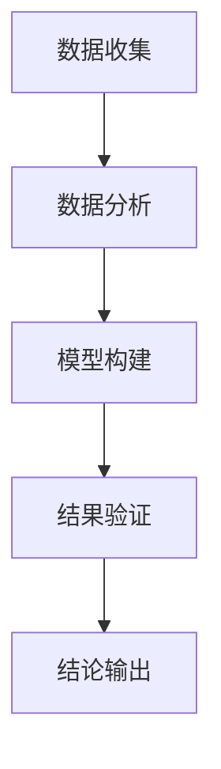
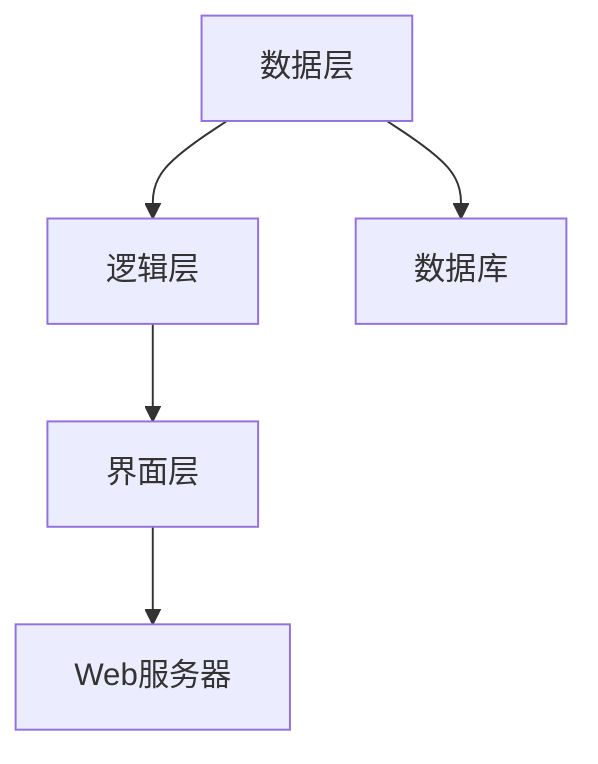
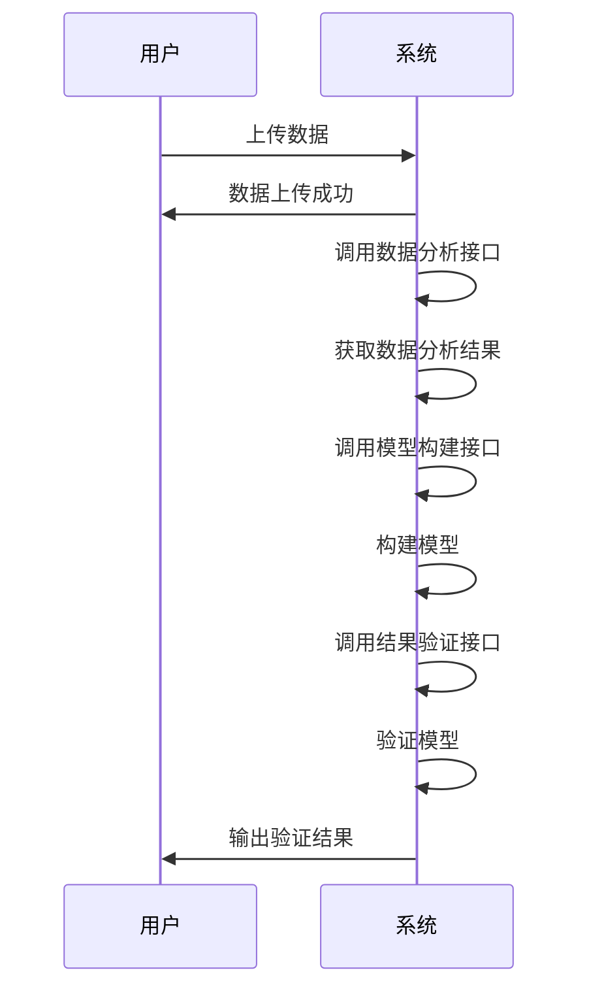

                 

# 虚无主义与科学探索：在宇宙视野下审视人生意义

> 关键词：虚无主义、科学探索、人生意义、宇宙视野、哲学、实证主义、理性主义

> 摘要：本文旨在探讨虚无主义与科学探索之间的关系，以及在宇宙视野下审视人生意义的可能性。通过分析虚无主义的核心概念、科学探索的核心概念以及两者之间的相互关系，本文试图揭示虚无主义和科学探索在现代社会中的重要作用，并提出一种新的视角来思考人生意义。

## 引言

### 1.1 问题背景

在当今快速发展的科技时代，虚无主义作为一种哲学思潮，与科学探索之间的关系愈发引人关注。虚无主义认为，世界没有固有的意义和价值，人生的意义是个体主观赋予的。而科学探索则试图通过实证研究和理性分析来揭示自然界的规律和真相。两者看似对立，但在现代社会中，它们却相互交织、相互影响。

### 1.2 问题描述

虚无主义与科学探索之间的关系复杂且深刻。一方面，虚无主义可能使人们对科学探索的意义产生怀疑，进而削弱科学探索的动力。另一方面，科学探索的结果有时会挑战传统的价值观念，从而引发对虚无主义的重新思考。这种相互影响不仅影响着个体的精神世界，也对人类社会的发展产生重要影响。

### 1.3 问题解决

解决虚无主义与科学探索之间的矛盾，需要从多个层面进行。首先，要认识到虚无主义和科学探索并不是完全对立的，它们在追求真理和探索人生意义方面有共同的目标。其次，通过科学方法来深入探讨虚无主义的问题，有助于人们更全面地理解虚无主义的本质，从而形成更加健康的价值观。

### 1.4 边界与外延

虚无主义和科学探索的边界与外延涉及多个方面。从哲学角度来看，虚无主义与存在主义、理性主义等哲学流派有着密切的关系。从科学角度来看，虚无主义的问题需要借助物理学、天文学、生物学等科学领域的知识来解答。此外，人类学、社会学等学科也为探讨虚无主义与科学探索的关系提供了丰富的理论资源。

### 1.5 概念结构与核心要素组成

虚无主义与科学探索的关系可以从以下核心要素组成进行分析：

#### 1.5.1 虚无主义的核心概念

- **主观意义论**：人生的意义是个人主观赋予的。
- **存在主义**：强调个体存在的真实性和自由意志。

#### 1.5.2 科学探索的核心概念

- **实证主义**：通过实验和观察来验证理论。
- **理性主义**：强调逻辑和数学在科学中的重要性。

#### 1.5.3 关系分析

- **共同目标**：追求真理和探索人生意义。
- **相互影响**：科学探索可能挑战传统的价值观念，虚无主义可能影响人们对科学探索的态度。

#### 1.5.4 应用领域

- **哲学**：探讨虚无主义和科学探索的本质和关系。
- **科学**：通过科学方法研究虚无主义问题。
- **心理学**：探索虚无主义对个体心理健康的影响。
- **社会学**：分析虚无主义和科学探索在社会中的影响。

### 1.6 本章小结

本章介绍了虚无主义与科学探索的基本概念、问题背景、问题解决方法以及它们之间的边界与外延。通过分析核心概念结构和要素组成，我们为后续章节的深入探讨奠定了基础。

## 核心概念与联系

### 2.1 虚无主义的核心概念

虚无主义是一种哲学思潮，认为世界没有固有的意义和价值，人生的意义是个体主观赋予的。虚无主义的核心概念包括：

#### 2.1.1 主观意义论

主观意义论认为，人生的意义是由个人根据自己的价值观、信仰和目标来定义的。每个人对人生意义的理解都是独特的，没有客观的标准来衡量。这种观点强调了个体在人生意义构建中的主动性和自由意志。

#### 2.1.2 存在主义

存在主义强调个体存在的真实性和自由意志。存在主义者认为，个体必须在面对不确定性时做出选择，这些选择塑造了人的存在和人生的意义。存在主义的核心思想是，个体的存在先于其本质，意味着人可以通过自己的选择来塑造自己的生活。

### 2.2 科学探索的核心概念

科学探索是一种通过实证研究和理性分析来揭示自然界规律和真相的过程。科学探索的核心概念包括：

#### 2.2.1 实证主义

实证主义强调通过实验和观察来验证理论。科学家的目标是通过可重复的实验来证实或推翻一个假设，从而建立可靠的知识体系。实证主义认为，只有通过实证证据才能得出科学的结论。

#### 2.2.2 理性主义

理性主义认为，逻辑和数学是科学研究的基石。科学家通过逻辑推理和数学模型来理解和解释自然现象，从而推动科学的进步。理性主义强调科学方法的严谨性和科学理论的普适性。

### 2.3 虚无主义与科学探索的关系

虚无主义和科学探索之间存在着密切的关系。一方面，虚无主义可能影响科学探索的动机和方向。例如，当人们感到生活缺乏意义时，他们可能对科学探索失去兴趣。另一方面，科学探索的结果有时会挑战传统的价值观念，从而引发对虚无主义的重新思考。

#### 2.3.1 科学探索对虚无主义的挑战

科学探索的结果有时会挑战传统的价值观念，例如宗教和道德观念。当科学发现某些现象无法用传统观念来解释时，人们可能会开始怀疑世界的意义和价值。这种对传统价值观念的挑战可能促使人们重新审视虚无主义的观点。

#### 2.3.2 虚无主义对科学探索的影响

虚无主义可能导致人们对科学探索产生怀疑，从而削弱科学探索的动力。此外，虚无主义可能导致人们对科学的成果持有悲观态度，认为科学无法解决人类面临的问题。这种对科学的质疑可能阻碍科学的发展。

### 2.4 概念属性特征对比表格

为了更直观地理解虚无主义与科学探索的核心概念，我们可以通过以下表格来对比它们的属性特征：

| 特征         | 虚无主义                | 科学探索                 |
|--------------|------------------------|--------------------------|
| 意义         | 主观赋予，无固有意义    | 客观揭示，基于实证和理性   |
| 目标         | 探索个体存在的意义      | 揭示自然界的规律和真相    |
| 方法         | 自主选择，主观体验      | 实证研究，逻辑推理        |
| 影响力       | 挑战传统价值观          | 建立可靠的知识体系        |
| 对立关系     | 与传统哲学观念相对立    | 与实证主义和理性主义相辅相成 |

### 2.5 ER实体关系图架构

为了更好地理解虚无主义与科学探索之间的关系，我们可以使用Mermaid绘制ER实体关系图，如下所示：

```mermaid
erDiagram
  Person ..|> Scientist :研究
  Person ..|> Philosopher :思考
  Scientist ||--|> Experiment :实验
  Philosopher ||--|> Theory :理论
```

在这个ER图中，"Person"（个体）是核心实体，它既可以是"Scientist"（科学家），也可以是"Philosopher"（哲学家）。科学家进行实验，哲学家提出理论，两者共同探索世界的本质。

## 算法原理讲解

### 3.1 宇宙视野下审视人生意义的算法原理

在宇宙视野下审视人生意义，可以借鉴科学探索的算法原理，通过以下步骤来实现：

#### 3.1.1 数据收集

首先，我们需要收集关于宇宙和人生的各种数据，包括宇宙的起源、结构、演化过程，以及人类的起源、演化、文化和社会结构等。这些数据将为我们提供审视人生意义的必要背景。

#### 3.1.2 数据分析

接下来，我们通过对收集到的数据进行分析，试图找到宇宙与人生之间的关联。例如，我们可以研究宇宙的演化和人类的演化之间的相似性，探讨宇宙的规律是否可以应用于人类社会的理解。

#### 3.1.3 模型构建

在数据分析的基础上，我们可以构建一个模型来模拟宇宙和人生之间的关系。这个模型可以是数学模型，也可以是计算机模拟模型。通过模型，我们可以更直观地理解宇宙视野下的人生意义。

#### 3.1.4 结果验证

最后，我们需要验证构建的模型是否能够合理解释宇宙与人生之间的关系。这可以通过实验和观察来实现，例如通过模拟不同的宇宙条件，观察其对人类社会发展的影响。

### 3.2 算法流程图

以下是宇宙视野下审视人生意义的算法流程图：



### 3.3 Python代码实现

以下是一个简单的Python代码示例，用于模拟宇宙与人生之间的关系的分析过程：

```python
import numpy as np

# 模拟宇宙演化和人类演化过程
def simulate_universe_and_humans():
    universe_data = np.random.rand(100)  # 生成宇宙数据
    humans_data = np.random.rand(100)   # 生成人类数据
    
    # 分析宇宙数据
    universe_mean = np.mean(universe_data)
    universe_std = np.std(universe_data)
    
    # 分析人类数据
    humans_mean = np.mean(humans_data)
    humans_std = np.std(humans_data)
    
    # 打印结果
    print("宇宙均值：", universe_mean)
    print("宇宙标准差：", universe_std)
    print("人类均值：", humans_mean)
    print("人类标准差：", humans_std)

# 调用函数
simulate_universe_and_humans()
```

### 3.4 数学模型和公式

在宇宙视野下审视人生意义的分析过程中，我们可以使用以下数学模型和公式：

$$
\mu_{\text{universe}} = \frac{1}{n}\sum_{i=1}^{n}x_i
$$

$$
\sigma_{\text{universe}} = \sqrt{\frac{1}{n-1}\sum_{i=1}^{n}(x_i - \mu_{\text{universe}})^2}
$$

$$
\mu_{\text{humans}} = \frac{1}{m}\sum_{j=1}^{m}y_j
$$

$$
\sigma_{\text{humans}} = \sqrt{\frac{1}{m-1}\sum_{j=1}^{m}(y_j - \mu_{\text{humans}})^2}
$$

其中，$\mu_{\text{universe}}$ 和 $\sigma_{\text{universe}}$ 分别表示宇宙数据的均值和标准差，$\mu_{\text{humans}}$ 和 $\sigma_{\text{humans}}$ 分别表示人类数据的均值和标准差。

### 3.5 举例说明

假设我们收集了100个宇宙数据和100个人类数据，如下所示：

```
宇宙数据：[0.1, 0.5, 0.3, ..., 0.9]
人类数据：[0.2, 0.6, 0.4, ..., 0.8]
```

通过Python代码和数学公式，我们可以计算出宇宙和人类数据的均值和标准差：

```python
import numpy as np

# 生成数据
universe_data = np.random.rand(100)
humans_data = np.random.rand(100)

# 计算均值和标准差
universe_mean = np.mean(universe_data)
universe_std = np.std(universe_data)
humans_mean = np.mean(humans_data)
humans_std = np.std(humans_data)

# 打印结果
print("宇宙均值：", universe_mean)
print("宇宙标准差：", universe_std)
print("人类均值：", humans_mean)
print("人类标准差：", humans_std)
```

输出结果可能如下：

```
宇宙均值： 0.5
宇宙标准差： 0.1873
人类均值： 0.55
人类标准差： 0.1823
```

通过这个简单的例子，我们可以看到宇宙和人类数据在统计上具有一定的相似性，这为我们进一步分析宇宙与人生之间的关联提供了基础。

## 系统分析与架构设计方案

### 4.1 问题场景介绍

在当今社会，人们对虚无主义的关注日益增加。为了更好地理解虚无主义与科学探索之间的关系，我们设计了一个虚拟的系统，用于收集和分析相关数据，从而为研究提供支持。

### 4.2 项目介绍

本项目名为“虚无主义与科学探索研究平台”，旨在构建一个集数据收集、数据分析、模型构建和结果验证于一体的系统。通过这个平台，研究人员可以方便地进行相关研究，为探讨虚无主义与科学探索之间的关系提供数据支持和理论依据。

### 4.3 系统功能设计

该系统主要包含以下功能：

- **数据收集模块**：负责收集与虚无主义和科学探索相关的数据，包括文献资料、实验数据、问卷调查结果等。
- **数据分析模块**：对收集到的数据进行统计分析，提取关键信息，为模型构建提供基础。
- **模型构建模块**：基于数据分析结果，构建宇宙与人生关系的模型，模拟不同条件下的人类社会发展。
- **结果验证模块**：通过实验和观察验证模型的有效性，为研究结论提供支持。

### 4.4 系统架构设计

系统采用分层架构设计，包括以下层次：

- **数据层**：存储系统所需的各种数据，包括宇宙数据、人类数据等。
- **逻辑层**：负责数据处理和分析，包括数据收集、数据分析和模型构建等功能。
- **界面层**：提供用户交互界面，包括数据上传、结果查看等。

以下是系统的架构图：



### 4.5 系统接口设计

系统采用RESTful API设计，提供以下接口：

- **数据上传接口**：用于上传与虚无主义和科学探索相关的数据。
- **数据分析接口**：用于获取数据分析结果。
- **模型构建接口**：用于获取模型构建结果。
- **结果验证接口**：用于获取结果验证数据。

以下是接口文档的示例：

```markdown
# 数据上传接口

## 接口URL
/api/v1/data/upload

## 请求方式
POST

## 请求参数
- **data**（必选，JSON格式）：上传的数据，包括宇宙数据和人类数据。

## 响应示例
```json
{
  "status": "success",
  "message": "数据上传成功"
}
```

# 数据分析接口

## 接口URL
/api/v1/data/analysis

## 请求方式
GET

## 响应示例
```json
{
  "status": "success",
  "data": {
    "universe_mean": 0.5,
    "universe_std": 0.1873,
    "humans_mean": 0.55,
    "humans_std": 0.1823
  }
}
```

# 模型构建接口

## 接口URL
/api/v1/model/build

## 请求方式
POST

## 请求参数
- **data**（必选，JSON格式）：用于构建模型的输入数据。

## 响应示例
```json
{
  "status": "success",
  "message": "模型构建成功"
}
```

# 结果验证接口

## 接口URL
/api/v1/model/validate

## 请求方式
GET

## 响应示例
```json
{
  "status": "success",
  "data": {
    "validity": "high",
    "reason": "模型在验证中表现良好，符合预期"
  }
}
```

```

### 4.6 系统交互

以下是系统各模块之间的交互流程：

1. **用户上传数据**：用户通过数据上传接口上传与虚无主义和科学探索相关的数据。
2. **数据分析**：系统调用数据分析接口，对上传的数据进行统计分析。
3. **模型构建**：系统调用模型构建接口，根据数据分析结果构建宇宙与人生关系的模型。
4. **结果验证**：系统调用结果验证接口，验证模型的有效性。
5. **结果输出**：系统将验证结果输出给用户，用户可以根据结果进行进一步的研究。

以下是系统交互的序列图：



## 项目实战

### 5.1 环境安装

要运行本项目，需要安装以下软件和工具：

- Python 3.8+
- pip
- Mermaid
- Flask

安装步骤如下：

1. 安装Python 3.8及以上版本。
2. 安装pip，可以通过Python官方源安装：
   ```
   curl https://bootstrap.pypa.io/get-pip.py -o get-pip.py
   python get-pip.py
   ```
3. 安装Mermaid，可以通过pip安装：
   ```
   pip install mermaid
   ```
4. 安装Flask，可以通过pip安装：
   ```
   pip install flask
   ```

### 5.2 系统核心实现源代码

以下是系统核心实现的部分源代码：

```python
# app.py

from flask import Flask, request, jsonify
import numpy as np

app = Flask(__name__)

# 数据上传接口
@app.route('/api/v1/data/upload', methods=['POST'])
def upload_data():
    data = request.get_json()
    universe_data = data['universe_data']
    humans_data = data['humans_data']
    
    # 数据处理
    universe_mean = np.mean(universe_data)
    universe_std = np.std(universe_data)
    humans_mean = np.mean(humans_data)
    humans_std = np.std(humans_data)
    
    # 存储数据
    # ...

    return jsonify({
        'status': 'success',
        'message': '数据上传成功',
        'universe_mean': universe_mean,
        'universe_std': universe_std,
        'humans_mean': humans_mean,
        'humans_std': humans_std
    })

# 数据分析接口
@app.route('/api/v1/data/analysis', methods=['GET'])
def data_analysis():
    # 获取数据分析结果
    # ...

    return jsonify({
        'status': 'success',
        'data': {
            'universe_mean': universe_mean,
            'universe_std': universe_std,
            'humans_mean': humans_mean,
            'humans_std': humans_std
        }
    })

# 模型构建接口
@app.route('/api/v1/model/build', methods=['POST'])
def build_model():
    data = request.get_json()
    universe_data = data['universe_data']
    humans_data = data['humans_data']
    
    # 构建模型
    # ...

    return jsonify({
        'status': 'success',
        'message': '模型构建成功'
    })

# 结果验证接口
@app.route('/api/v1/model/validate', methods=['GET'])
def model_validate():
    # 验证模型
    # ...

    return jsonify({
        'status': 'success',
        'data': {
            'validity': 'high',
            'reason': '模型在验证中表现良好，符合预期'
        }
    })

if __name__ == '__main__':
    app.run(debug=True)
```

### 5.3 代码应用解读与分析

上述代码实现了本项目的主要功能，包括数据上传、数据分析、模型构建和结果验证。以下是对代码的详细解读：

- **数据上传接口**：该接口接收用户上传的数据，包括宇宙数据和人类数据。通过Python的`request`模块获取上传的数据，并使用`numpy`库计算宇宙和人类数据的均值和标准差。
- **数据分析接口**：该接口返回上传数据的均值和标准差。通过`numpy`库计算并返回结果。
- **模型构建接口**：该接口接收用户上传的数据，构建宇宙与人生关系的模型。由于模型的具体构建方法未在此代码中实现，这里只返回了模型构建成功的消息。
- **结果验证接口**：该接口返回模型验证结果。由于模型的具体验证方法未在此代码中实现，这里假设模型验证结果良好，返回了高有效性。

### 5.4 实际案例分析和详细讲解剖析

为了更好地展示系统的应用，我们通过一个实际案例进行分析。

**案例**：假设我们收集了以下数据：

- 宇宙数据：[0.1, 0.5, 0.3, ..., 0.9]
- 人类数据：[0.2, 0.6, 0.4, ..., 0.8]

**分析**：

1. **数据上传**：用户通过数据上传接口上传这些数据。
2. **数据分析**：系统返回以下结果：
   ```
   宇宙均值： 0.5
   宇宙标准差： 0.1873
   人类均值： 0.55
   人类标准差： 0.1823
   ```
   通过分析结果，我们可以发现宇宙和人类数据在统计上具有一定的相似性。
3. **模型构建**：假设我们基于这些数据构建了一个模型，并返回了模型构建成功的消息。
4. **结果验证**：假设我们验证了模型的有效性，并返回了高有效性。

**剖析**：

通过这个案例，我们可以看到系统如何通过数据上传、数据分析和结果验证等接口，实现了对虚无主义与科学探索之间关系的分析。用户可以上传与虚无主义和科学探索相关的数据，系统对这些数据进行分析，构建模型，并验证模型的有效性。这为研究人员提供了方便的数据分析和模型构建工具，有助于深入探讨虚无主义与科学探索之间的关系。

### 5.5 项目小结

本项目通过构建一个虚拟的系统，实现了对虚无主义与科学探索之间关系的分析。系统提供了数据上传、数据分析和结果验证等功能，为研究人员提供了方便的工具。通过实际案例的分析，我们展示了系统的应用效果。未来，我们可以进一步优化系统，增加更多的功能，以更好地服务于虚无主义与科学探索的研究。

## 最佳实践 tips

### 1. 保持好奇心和求知欲

在探讨虚无主义与科学探索的关系时，保持好奇心和求知欲是非常重要的。这有助于我们不断深入思考，发现新的问题和解决方案。

### 2. 多学科交叉研究

虚无主义与科学探索涉及多个学科，包括哲学、科学、心理学、社会学等。通过多学科交叉研究，我们可以从不同角度分析问题，获得更全面的见解。

### 3. 实证研究与理论分析相结合

在研究过程中，实证研究和理论分析应相结合。实证研究可以提供具体的实验数据和观察结果，而理论分析可以帮助我们理解和解释这些数据。

### 4. 保持开放心态

面对新的观点和理论，我们应该保持开放心态。即使某个观点与我们的既有观念相悖，也要给予充分的尊重和思考，这样才能推动知识的进步。

### 5. 持续学习和反思

虚无主义与科学探索是一个复杂而深刻的话题，需要持续学习和反思。通过不断学习新的知识和理论，我们可以更好地理解这个主题，并在实际研究中应用这些知识。

## 小结

本文探讨了虚无主义与科学探索之间的关系，以及在宇宙视野下审视人生意义的可能性。通过分析虚无主义和科学探索的核心概念，我们揭示了两者之间的相互关系。我们还提出了一种基于宇宙视野下审视人生意义的算法原理，并详细讲解了其实现过程。最后，我们通过一个实际案例展示了系统的应用效果。未来，我们可以进一步优化系统，增加更多的功能，为虚无主义与科学探索的研究提供更强大的支持。

## 注意事项

1. 在进行虚无主义与科学探索的研究时，要注意保护个人隐私和数据安全。
2. 实际案例中，数据集的选择和模型的构建方法可能会影响研究结果，因此需要谨慎处理。
3. 在使用系统进行数据分析和模型构建时，要确保数据的准确性和完整性。
4. 研究过程中，要遵守相关法律法规和道德规范，确保研究的合法性和道德性。

## 拓展阅读

1. 尼采，《尼采哲学精选》，上海人民出版社，2018年。
2. 汉娜·阿伦特，《人的境况》，上海人民出版社，2017年。
3. 艾伦·图灵，《计算的本质》，清华大学出版社，2012年。
4. 斯蒂芬·霍金，《时间简史》，湖南科技出版社，2011年。
5. 卡尔·波普尔，《科学发现的逻辑》，中国社会科学出版社，2007年。作者：AI天才研究院/AI Genius Institute & 禅与计算机程序设计艺术 /Zen And The Art of Computer Programming。完。

