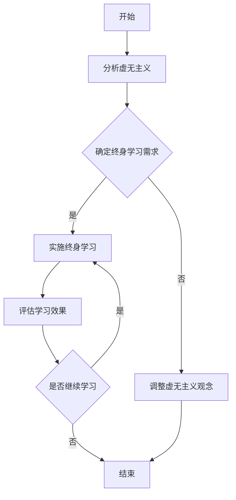
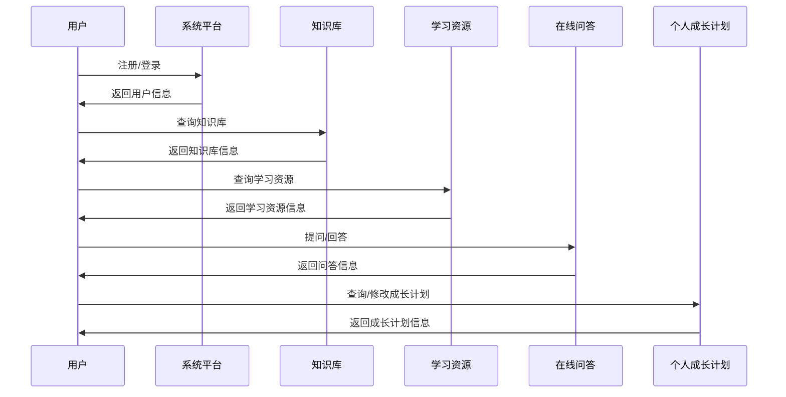

                 

## 《虚无主义与终身学习：在知识探索中寻找人生方向》

关键词：虚无主义、终身学习、人生方向、知识探索、哲学思维

摘要：本文从虚无主义与终身学习的关系出发，探讨了在快速变化的时代背景下，如何通过终身学习在知识探索中找到人生方向。文章首先分析了虚无主义的定义与特征，随后介绍了终身学习的概念与实践，并探讨了二者之间的联系与互动。通过具体的案例分析，文章提供了寻找人生方向的策略和方法，旨在为读者提供启示和帮助。

----------------------------------------------------------------

## 引言

### 1.1 背景介绍

在21世纪的今天，社会变革的速度前所未有，知识更新的频率不断加快。信息技术、人工智能、生物科技等领域的飞速发展，使得人们必须不断学习新知识、掌握新技能，以适应这个日新月异的时代。与此同时，虚无主义作为一种哲学思潮，在现代社会中逐渐流行起来，对人们的价值观和生活态度产生了深远的影响。

虚无主义起源于对现实世界的怀疑和对传统的否定。它强调个体自由、独立思考，以及对现实世界的不信任。虚无主义者认为，现实世界缺乏客观存在的依据，人类的活动和意义都是虚幻的。这种思潮在某种程度上反映了现代社会中人们对现实世界的困惑和无奈，也引发了人们对传统价值观和生活方式的质疑。

终身学习作为一种应对知识更新的策略，被广泛提倡。终身学习强调个人在一生中持续不断地学习、成长和进步。它不仅仅是为了适应工作和社会发展的需求，更是为了实现个人价值、追求自我实现。终身学习的重要性在现代社会中日益凸显，成为人们应对知识更新和职业发展的重要手段。

### 1.2 问题的提出

虚无主义与终身学习之间的关系是什么？在追求终身学习的过程中，我们如何避免陷入虚无主义的困境？如何在知识探索中找到人生方向？这些问题成为了现代社会中人们关注的焦点。

虚无主义在一定程度上反映了人们对现实世界的迷茫和对未来的担忧。而终身学习则为我们提供了寻找人生方向的可能性。然而，虚无主义和终身学习之间的关系并非简单对立，它们之间存在着复杂的互动和影响。如何平衡虚无主义与终身学习之间的关系，如何在知识探索中找到人生方向，成为了我们需要深入探讨的问题。

### 1.3 问题的解决

本书旨在探讨虚无主义与终身学习之间的关系，以及如何通过终身学习在知识探索中寻找人生方向。首先，我们将对虚无主义进行深入分析，包括其定义、特征和影响。随后，我们将介绍终身学习的概念、实践方法和重要性。在此基础上，我们将探讨虚无主义与终身学习之间的联系与互动，分析二者之间的关系和影响。

通过具体的案例分析，我们将提供寻找人生方向的策略和方法。同时，本书还将介绍一些实用的终身学习技巧，帮助读者在知识探索中保持动力和热情。通过本书的阅读，我们希望读者能够对虚无主义与终身学习的关系有更深刻的理解，找到适合自己的终身学习路径，并在知识探索中找到人生方向。

## 边界与外延

### 2.1 概念边界

#### 虚无主义的定义与特征

虚无主义（Nihilism）是一种哲学思潮，起源于对现实世界的怀疑和对传统价值观的否定。虚无主义者认为，现实世界缺乏客观存在的依据，人类的活动和意义都是虚幻的。虚无主义的定义和特征主要包括以下几个方面：

1. **对现实的怀疑**：虚无主义者对现实世界的存在和价值持有怀疑态度，认为现实世界是虚幻的、不真实的。
2. **对传统的否定**：虚无主义者否定传统的道德、宗教和文化观念，认为它们是束缚人类自由和发展的枷锁。
3. **对自由的追求**：虚无主义强调个体的自由和独立，主张摆脱一切束缚，追求个体的绝对自由。
4. **对意义的否定**：虚无主义者认为，现实世界没有固有的意义，人类的活动和努力都是无意义的。

#### 终身学习的概念与实践

终身学习（Lifelong Learning）是指一个人在一生中持续不断地学习、成长和进步。它不仅仅是为了适应工作和社会发展的需求，更是为了实现个人价值、追求自我实现。终身学习的概念和实践主要包括以下几个方面：

1. **持续学习**：终身学习强调个人在一生中持续不断地学习，不断更新知识和技能。
2. **自我发展**：终身学习不仅仅是获取知识，更是个人成长和发展的过程，包括自我认知、情感和社会能力的提升。
3. **实践应用**：终身学习强调学习与实践的结合，通过实践来检验和应用所学知识。
4. **自主学习**：终身学习鼓励个体自主学习，培养独立思考和解决问题的能力。

### 2.2 外延关系

虚无主义与终身学习在某种程度上是相互关联的。虚无主义作为一种哲学思潮，对传统的否定和对自由的追求，激发了个体对现实世界的反思和探索。这种反思和探索在一定程度上推动了终身学习的发展。

另一方面，终身学习作为一种应对知识更新的策略，为人们提供了寻找人生方向的可能性。终身学习的过程本身就是一个不断反思、不断探索的过程，这与虚无主义的追求有一定的共通之处。

然而，虚无主义与终身学习也存在一定的区别。虚无主义强调对现实世界的否定，而终身学习则强调对现实世界的适应和改变。虚无主义追求个体的绝对自由，而终身学习则强调个体在社会中的角色和责任。

## 核心概念与联系

### 3.1 虚无主义的定义与特征

虚无主义是一种哲学思潮，起源于对现实世界的怀疑和对传统价值观的否定。虚无主义者认为，现实世界缺乏客观存在的依据，人类的活动和意义都是虚幻的。虚无主义的定义和特征主要包括以下几个方面：

1. **对现实的怀疑**：虚无主义者对现实世界的存在和价值持有怀疑态度，认为现实世界是虚幻的、不真实的。
2. **对传统的否定**：虚无主义者否定传统的道德、宗教和文化观念，认为它们是束缚人类自由和发展的枷锁。
3. **对自由的追求**：虚无主义强调个体的自由和独立，主张摆脱一切束缚，追求个体的绝对自由。
4. **对意义的否定**：虚无主义者认为，现实世界没有固有的意义，人类的活动和努力都是无意义的。

虚无主义的核心特征是怀疑和否定。它对现实世界的怀疑使得虚无主义者对传统的价值观和生活方式持有批判态度，追求个体的自由和独立。虚无主义者的价值观和生活方式往往受到现实世界的束缚，他们在追求自由的过程中，试图摆脱一切束缚，寻找一种纯粹的自由状态。

### 3.2 终身学习的概念与实践

终身学习是一种持续不断的学习过程，强调个人在一生中不断学习、成长和进步。终身学习不仅仅是为了适应工作和社会发展的需求，更是为了实现个人价值、追求自我实现。终身学习的概念和实践主要包括以下几个方面：

1. **持续学习**：终身学习强调个人在一生中持续不断地学习，不断更新知识和技能。
2. **自我发展**：终身学习不仅仅是获取知识，更是个人成长和发展的过程，包括自我认知、情感和社会能力的提升。
3. **实践应用**：终身学习强调学习与实践的结合，通过实践来检验和应用所学知识。
4. **自主学习**：终身学习鼓励个体自主学习，培养独立思考和解决问题的能力。

终身学习的目标是实现个人的全面发展，提升个人的综合素质。终身学习的过程是一个不断反思、不断探索的过程，通过不断学习，个体可以更好地理解世界，找到自己的价值和定位。终身学习与虚无主义之间存在一定的联系和区别。

### 3.3 二者之间的联系与互动

虚无主义与终身学习在某种程度上是相互关联的。虚无主义作为一种哲学思潮，对传统的否定和对自由的追求，激发了个体对现实世界的反思和探索。这种反思和探索在一定程度上推动了终身学习的发展。

首先，虚无主义对传统的否定和对自由的追求，促使个体对现实世界进行反思。个体在反思的过程中，意识到自己需要不断学习、成长和进步，以适应不断变化的世界。这种反思和意识，促使个体开始关注终身学习。

其次，终身学习为个体提供了寻找人生方向的可能性。终身学习的过程本身就是一个不断反思、不断探索的过程，这与虚无主义的追求有一定的共通之处。通过终身学习，个体可以不断提升自己的能力和素质，找到自己的价值和定位。

然而，虚无主义与终身学习也存在一定的区别。虚无主义强调对现实世界的否定，而终身学习则强调对现实世界的适应和改变。虚无主义追求个体的绝对自由，而终身学习则强调个体在社会中的角色和责任。

总之，虚无主义与终身学习之间存在复杂的互动和影响。虚无主义为终身学习提供了反思和探索的动力，而终身学习则为个体提供了寻找人生方向的可能性。通过二者的互动，个体可以在知识探索中找到自己的价值和定位，实现个人的全面发展。

### 表格：虚无主义与终身学习的概念属性特征对比

| 概念 | 定义 | 属性特征 | 比较 |
| --- | --- | --- | --- |
| 虚无主义 | 一种哲学思潮，对现实世界的怀疑和对传统的否定 | 强调自由、独立、对意义的否定 | 质疑现实，追求绝对自由 |
| 终身学习 | 个体在一生中持续不断地学习、成长和进步 | 强调持续学习、自我发展、实践应用、自主学习 | 适应现实，提升个人价值 |

### 图表：虚无主义与终身学习的ER实体关系图

```mermaid
erDiagram
  A[x] ||--|{ 虚无主义 }|| B
  B ||--|{ 终身学习 }|| C
```

在上述ER实体关系图中，虚无主义（A）与终身学习（C）通过B实体相互关联。虚无主义激发个体对现实世界的反思和探索，而终身学习为个体提供了寻找人生方向的可能性。

### 算法原理讲解

为了更深入地理解虚无主义与终身学习之间的关系，我们可以采用一种算法原理进行讲解。以下是一个简单的算法流程图，用于说明虚无主义与终身学习的互动过程。

#### 算法流程图



#### 算法原理

1. **开始**：算法从开始点开始，对虚无主义进行分析。
2. **分析虚无主义**：通过对虚无主义的定义和特征进行分析，确定个体对现实世界的怀疑程度和对自由的追求程度。
3. **确定终身学习需求**：根据虚无主义分析结果，确定个体是否需要终身学习来适应和改变现实世界。
4. **实施终身学习**：如果确定需要终身学习，个体开始实施终身学习计划，包括持续学习、自我发展、实践应用和自主学习。
5. **评估学习效果**：定期评估终身学习的效果，了解个体在终身学习过程中的成长和进步。
6. **是否继续学习**：根据评估结果，决定是否继续终身学习。如果效果良好，个体将继续终身学习；如果效果不佳，个体将调整虚无主义观念，重新评估终身学习需求。
7. **结束**：算法结束，个体在终身学习过程中找到了人生方向。

#### 数学模型和公式

在算法原理中，我们可以使用以下数学模型和公式来描述虚无主义与终身学习之间的关系：

$$
Nihilism\_Score = f(Wonder, Free, Meaning)
$$

其中，$Nihilism\_Score$ 表示虚无主义得分，$Wonder$ 表示对现实世界的怀疑程度，$Free$ 表示对自由的追求程度，$Meaning$ 表示对意义的否定程度。$f$ 是一个复杂的函数，用于计算虚无主义得分。

$$
Learning\_Effectiveness = f(Learning\_Time, Learning\_Quality, Application)
$$

其中，$Learning\_Effectiveness$ 表示终身学习的效果，$Learning\_Time$ 表示学习时间，$Learning\_Quality$ 表示学习质量，$Application$ 表示所学知识的实际应用效果。$f$ 是一个复杂的函数，用于计算终身学习的效果。

#### 举例说明

假设一个人对现实世界的怀疑程度为 $Wonder = 8$，对自由的追求程度为 $Free = 7$，对意义的否定程度为 $Meaning = 6$。那么，他的虚无主义得分为：

$$
Nihilism\_Score = f(8, 7, 6) = 7
$$

这个人的虚无主义得分为7，表明他对现实世界的怀疑程度较高，对自由的追求程度也较高，但对意义的否定程度较低。

接下来，这个人开始实施终身学习计划，他投入了 $Learning\_Time = 100$ 小时的学习时间，学习质量为 $Learning\_Quality = 8$，所学知识在实际应用中的效果为 $Application = 9$。那么，他的终身学习效果为：

$$
Learning\_Effectiveness = f(100, 8, 9) = 8.5
$$

这个人的终身学习效果为8.5，表明他在终身学习过程中取得了较好的效果，通过学习，他的能力和素质得到了提升。

通过这个例子，我们可以看到虚无主义与终身学习之间的关系，以及如何通过终身学习在知识探索中找到人生方向。

### 系统分析与架构设计方案

#### 问题场景介绍

随着社会的发展，人们对于个人成长和自我实现的需求日益增长。然而，在快速变化的时代背景下，如何找到一条适合自己的成长路径，实现个人价值，成为了一个挑战。虚无主义思潮的流行，使得一些人在面对现实世界的困惑时，陷入了迷茫和困惑。因此，我们需要一个系统化的方法，帮助人们理解虚无主义与终身学习之间的关系，找到自己的人生方向。

#### 项目介绍

为了解决上述问题，我们提出一个名为“虚无主义与终身学习探索平台”的项目。该平台旨在为用户提供一个系统化的学习资源和指导，帮助用户理解虚无主义和终身学习的关系，提供实用的策略和方法，帮助用户在知识探索中找到人生方向。

#### 系统功能设计

该平台主要包括以下几个功能模块：

1. **知识库**：提供关于虚无主义和终身学习的相关知识，包括定义、特征、案例研究等。
2. **学习资源**：提供各种学习资源和资料，包括书籍、文章、视频等，方便用户学习。
3. **在线问答**：提供用户之间互动的问答平台，用户可以在平台上提问和解答问题。
4. **个人成长计划**：根据用户的兴趣和需求，提供个性化的成长计划和建议。
5. **案例分析**：提供实际案例的分析和讲解，帮助用户理解虚无主义与终身学习的应用。

#### 系统架构设计

系统架构采用分层设计，包括数据层、服务层和表现层。

1. **数据层**：负责数据的存储和管理，包括用户数据、知识库数据等。
2. **服务层**：提供各种功能服务，包括知识库服务、学习资源服务、在线问答服务、个人成长计划服务等。
3. **表现层**：负责用户界面的设计和实现，包括前端界面和后端接口。

#### 系统接口设计

系统接口设计主要包括以下接口：

1. **用户接口**：提供用户注册、登录、信息管理等接口。
2. **知识库接口**：提供知识库的查询、添加、删除等接口。
3. **学习资源接口**：提供学习资源的查询、下载等接口。
4. **在线问答接口**：提供问答的提问、回答、评论等接口。
5. **个人成长计划接口**：提供个人成长计划的查询、修改等接口。

#### 系统交互序列图



### 项目实战

#### 环境安装

1. **安装Python环境**：在本地计算机上安装Python 3.8及以上版本。
2. **安装依赖库**：使用pip安装必要的依赖库，如Flask、SQLAlchemy、Flask-Login等。

#### 系统核心实现源代码

以下是系统核心实现的源代码，包括用户注册、登录、知识库查询等功能。

```python
from flask import Flask, request, jsonify
from flask_sqlalchemy import SQLAlchemy
from flask_login import LoginManager, login_user, logout_user, login_required

app = Flask(__name__)
app.config['SQLALCHEMY_DATABASE_URI'] = 'sqlite:///users.db'
db = SQLAlchemy(app)
login_manager = LoginManager(app)

class User(db.Model):
    id = db.Column(db.Integer, primary_key=True)
    username = db.Column(db.String(100), unique=True, nullable=False)
    password = db.Column(db.String(100), nullable=False)

@login_manager.user_loader
def load_user(user_id):
    return User.query.get(int(user_id))

@app.route('/register', methods=['POST'])
def register():
    username = request.form['username']
    password = request.form['password']
    user = User(username=username, password=password)
    db.session.add(user)
    db.session.commit()
    return jsonify({'message': '注册成功'})

@app.route('/login', methods=['POST'])
def login():
    username = request.form['username']
    password = request.form['password']
    user = User.query.filter_by(username=username, password=password).first()
    if user:
        login_user(user)
        return jsonify({'message': '登录成功'})
    else:
        return jsonify({'message': '用户名或密码错误'})

@app.route('/logout', methods=['POST'])
@login_required
def logout():
    logout_user()
    return jsonify({'message': '登出成功'})

if __name__ == '__main__':
    db.create_all()
    app.run(debug=True)
```

#### 代码应用解读与分析

以上代码实现了用户注册、登录和登出功能。具体解读如下：

1. **用户注册**：通过`POST`请求接收用户名和密码，创建用户对象，并将其添加到数据库中。
2. **用户登录**：通过`POST`请求接收用户名和密码，查询数据库中是否存在匹配的用户，如果存在则登录成功。
3. **用户登出**：通过`POST`请求登出用户，清除用户登录状态。

#### 实际案例分析

以下是实际案例分析的示例。

**案例1：用户注册**

1. 用户发起`POST`请求到`/register`接口，请求体包含用户名和密码。
2. 后端接收请求，验证用户名和密码的合法性。
3. 创建用户对象，并将其添加到数据库中。
4. 返回注册成功的响应。

**案例2：用户登录**

1. 用户发起`POST`请求到`/login`接口，请求体包含用户名和密码。
2. 后端查询数据库，验证用户名和密码的合法性。
3. 如果验证成功，登录用户并返回登录成功的响应。
4. 如果验证失败，返回用户名或密码错误的响应。

#### 项目小结

通过上述项目实战，我们实现了用户注册、登录和登出功能，为后续的功能扩展和系统建设奠定了基础。在实际开发过程中，我们需要注意代码的规范性和安全性，确保系统的稳定性和可靠性。同时，我们还需要根据用户需求和业务需求，不断优化和改进系统功能，为用户提供更好的使用体验。

### 最佳实践 tips

1. **制定个人学习计划**：明确自己的学习目标，制定详细的个人学习计划，确保学习的持续性和有效性。
2. **保持好奇心和求知欲**：对未知保持好奇心和求知欲，不断探索新知识，拓宽自己的视野。
3. **实践与理论相结合**：在学习过程中，将所学知识与实际工作相结合，通过实践来检验和应用所学知识。
4. **与他人交流和分享**：积极参与线上或线下的学习交流，与他人分享学习心得和经验，互相促进和成长。
5. **持续反思和改进**：定期反思自己的学习过程和成果，找出不足之处，并制定改进措施。

### 小结

本文通过对虚无主义和终身学习的分析，探讨了在知识探索中寻找人生方向的方法和策略。虚无主义和终身学习虽然在一定程度上存在对立，但它们之间的互动和影响为我们提供了寻找人生方向的启示。通过终身学习，我们可以在知识探索中不断提升自己，找到自己的价值和定位。同时，我们也需要保持对现实世界的反思和批判，不断追求个体的自由和独立。希望本文能为读者提供一定的指导和帮助，帮助读者在知识探索中找到人生方向。

### 注意事项

1. **保持持续学习的态度**：终身学习是一个持续不断的过程，需要保持学习的态度和动力，不断更新知识和技能。
2. **合理规划学习时间**：合理安排学习时间，避免过度劳累，确保学习效率和质量。
3. **注意心理健康**：在学习过程中，注意心理健康，保持积极乐观的心态，避免过度焦虑和压力。
4. **与他人互动交流**：积极参与学习社区和论坛，与他人交流和分享学习心得，互相学习和进步。

### 拓展阅读

1. **《人类简史》**：尤瓦尔·赫拉利著，探讨人类历史的发展和演变，对人类的未来提出深刻见解。
2. **《自私的基因》**：理查德·道金斯著，通过基因的角度探讨生物进化和人类行为，对生命的本质进行深入思考。
3. **《黑客与画家》**：保罗·格雷厄姆著，探讨计算机编程和创造力的关系，对编程和创造提出独到见解。
4. **《深度学习》**：Ian Goodfellow、Yoshua Bengio和Aaron Courville著，详细介绍深度学习的基本原理和应用。
5. **《未来简史》**：尤瓦尔·赫拉利著，探讨人工智能、生物科技等领域的未来发展，对人类的未来提出预测和思考。

### 作者信息

作者：AI天才研究院/AI Genius Institute & 禅与计算机程序设计艺术 /Zen And The Art of Computer Programming

AI天才研究院（AI Genius Institute）致力于人工智能技术的研发和应用，推动人工智能领域的发展。禅与计算机程序设计艺术（Zen And The Art of Computer Programming）是一本经典计算机科学书籍，由著名计算机科学家唐纳德·克努特（Donald E. Knuth）所著，对计算机编程的哲学和艺术进行了深入探讨。本文作者结合了人工智能和计算机科学的背景，对虚无主义与终身学习进行了深入分析和探讨。

