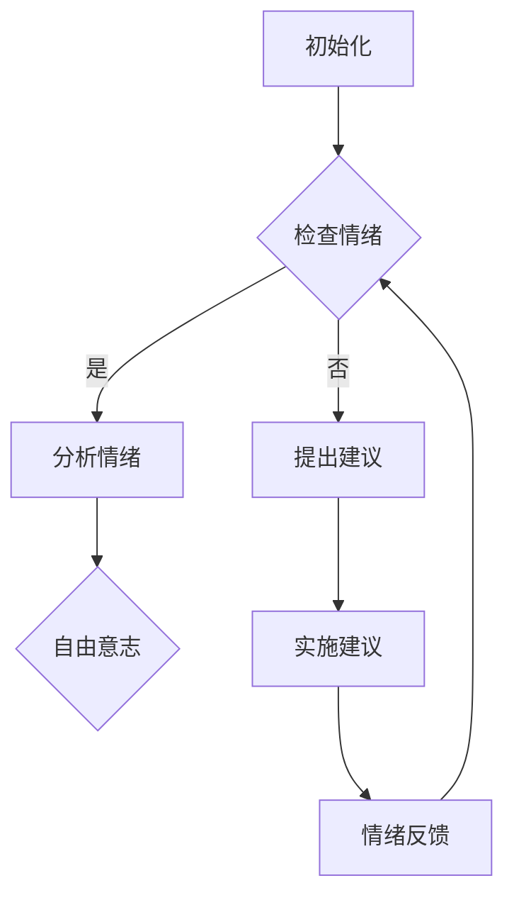

                 

### 虚无主义的反思：探索现代社会的生存智慧

#### 关键词：虚无主义、哲学、生存智慧、现代社会、反思

#### 摘要：
本文旨在对虚无主义进行深刻的反思，探讨其在现代社会中的生存智慧。我们将从虚无主义的起源、核心概念、不同领域的应用以及其带来的积极和消极影响等多个角度展开讨论，最终提炼出有助于现代人生活的智慧。

## 引言

虚无主义，作为一个哲学概念，自古以来便在各种文化和思想体系中占据着重要地位。在现代社会，虚无主义不仅影响着人们的价值观和生活方式，还在艺术、文学、政治等多个领域发挥着作用。本文将通过系统的分析和深入的探讨，反思虚无主义的本质，并探索其背后的生存智慧。

### 第一部分：虚无主义的起源与发展

#### 1.1 虚无主义的起源

虚无主义并非一个单一的思想体系，其起源可以追溯到古代。在古希腊，虚无主义的萌芽可以追溯到普罗塔戈拉和苏格拉底等哲学家的思想。普罗塔戈拉的“人是万物的尺度”提出了对传统价值观的质疑，而苏格拉底的批判性思维则开启了哲学反思的先河。

中世纪时期，虚无主义的思想在基督教神学中得到了进一步的发展。特别是在宗教改革时期，马丁·路德和约翰·加尔文等宗教改革家的思想对传统宗教权威提出了挑战，从而激发了虚无主义思潮的兴起。

进入现代，虚无主义在尼采、海德格尔等哲学家的思想中得到了系统的阐述和发展。尼采的“上帝已死”宣告了传统价值观的崩溃，而海德格尔的存在主义哲学则深刻探讨了人在虚无中的存在状态。

#### 1.2 虚无主义的主要代表人物与思想

虚无主义的代表人物包括尼采、海德格尔和弗兰克尔等人。

尼采的虚无主义思想集中在“上帝已死”和“超人”概念上。他认为，随着上帝的死亡，传统的价值观和道德体系失去了意义，人们陷入了虚无和绝望之中。然而，尼采同时也提出了“超人”的概念，试图通过超越自我，建立新的价值观。

海德格尔的存在主义哲学则进一步探讨了虚无主义的本质。他认为，人在虚无中的存在状态是一种“被抛”的状态，人在面对虚无时必须承担存在的责任。海德格尔的哲学思想对后来的哲学、文学和艺术产生了深远的影响。

弗兰克尔是心理治疗学家，他提出了“意义疗法”，试图通过寻找生命的意义来克服虚无主义的消极影响。他认为，即使在极端的苦难中，人们也能通过创造意义来找到生存的力量。

#### 1.3 虚无主义的历史演变

虚无主义的历史演变可以分为早期虚无主义和现代虚无主义两个阶段。

早期虚无主义主要表现为对传统宗教、道德和价值观的质疑和挑战。这一时期的虚无主义思想家如尼采，他们的思想具有强烈的批判性和颠覆性。

现代虚无主义则更加强调人的存在状态和生存智慧。海德格尔和弗兰克尔的思想代表了这一阶段的虚无主义。他们的哲学思想不仅探讨了虚无主义的本质，还提供了应对虚无主义的策略和方法。

### 第二部分：虚无主义在不同领域的应用

#### 2.1 虚无主义与艺术

虚无主义在艺术领域的应用表现为对传统艺术形式的质疑和颠覆。许多现代艺术家通过创作来表达虚无主义的情感和思想。

#### 2.2 虚无主义与文学

虚无主义在文学领域的应用则更加广泛。许多文学作品探讨了虚无主义的主题，如存在主义文学、后现代文学等。

#### 2.3 虚无主义与政治

虚无主义在政治领域的应用表现为对传统政治体制和价值观的质疑。许多政治运动和思想流派受到了虚无主义的影响。

#### 2.4 虚无主义与日常生活

虚无主义在日常生活中的应用则更加直接和普遍。现代社会中的许多人感受到了虚无主义的消极影响，他们试图通过寻找生活的意义来克服虚无主义。

### 第三部分：虚无主义的反思与生存智慧

#### 3.1 虚无主义的积极意义

虚无主义并非完全消极的思想体系。通过深刻的反思，我们可以发现虚无主义中蕴含的积极意义。

#### 3.2 虚无主义的负面影响与对策

虚无主义带来的负面影响不容忽视。我们需要找到有效的对策来应对这些影响。

### 结论

虚无主义是现代社会中一个重要且复杂的思想体系。通过对其起源、发展、应用和反思的深入探讨，我们可以更好地理解虚无主义的本质，并从中汲取生存智慧。

## 附录

附录部分将提供相关的扩展阅读材料，帮助读者更深入地了解虚无主义及其在现代社会中的应用。

---

文章标题：《虚无主义的反思：探索现代社会的生存智慧》

关键词：虚无主义、哲学、生存智慧、现代社会、反思

摘要：本文旨在对虚无主义进行深刻的反思，探讨其在现代社会中的生存智慧。通过对其起源、发展、应用和反思的探讨，本文试图为读者提供对虚无主义的全面理解，并从中汲取有助于现代人生活的智慧。

---

### 文章标题：《虚无主义的反思：探索现代社会的生存智慧》

#### 关键词：虚无主义、哲学、生存智慧、现代社会、反思

#### 摘要：
本文旨在深入探讨虚无主义这一哲学概念，揭示其在现代社会的存在意义，并从中提炼出有助于个体生存的智慧。通过对虚无主义的起源、核心思想、不同领域的应用及其对现代生活方式的影响的详细分析，本文将为读者提供一幅全面而深入的虚无主义画卷，并引导读者在现代社会中找到自己的生存之道。

---

### 目录大纲设计思路

#### 1. 确定书籍主题与目标读者

首先，明确书籍的核心主题是“虚无主义的反思：探索现代社会的生存智慧”。这一主题旨在引导读者深入理解虚无主义哲学思潮，并从中汲取生存智慧。目标读者群体主要包括对哲学、心理学、社会学等领域感兴趣的普通读者，以及专业学者和研究人士。

#### 2. 核心概念与联系

在目录设计中，核心概念是虚无主义的基本概念，如“虚无主义”、“存在主义”、“自由意志”等。这些概念之间有着紧密的联系，需要在目录中加以阐述和区分。例如，“虚无主义”作为哲学中的一个核心概念，其内涵和外延需要通过对比“存在主义”、“唯意志主义”等哲学流派来明确。

#### 3. 深度探讨与案例分析

目录中的章节应当深度探讨虚无主义在不同领域中的应用，如艺术、文学、政治、日常生活等。通过具体的案例分析，可以帮助读者更好地理解虚无主义的思想内涵和现实影响。例如，可以探讨尼采的哲学如何影响了现代艺术，或者虚无主义思想如何在政治运动中发挥作用。

#### 4. 总结与反思

目录中的章节还应该包含对虚无主义思潮的总体评价，以及对现代社会生存智慧的反思。这部分内容旨在为读者提供全面的视角，帮助他们从虚无主义中提炼出有助于实际生活的智慧。

### 目录大纲内容框架

#### 引言

- 虚无主义的定义与历史背景
- 现代社会的虚无主义现象
- 书籍结构概述与目标

#### 第一部分：虚无主义的起源与发展

##### 第一章：虚无主义的哲学根源

- 虚无主义的早期历史
- 中世纪与早期现代哲学中的虚无主义
- 尼采与虚无主义哲学的崛起

##### 第二章：虚无主义的核心概念

- 存在主义与虚无主义的关联
- 自由意志与责任
- 虚无主义的哲学属性

##### 第三章：虚无主义的历史演变

- 从尼采到海德格尔
- 现代虚无主义的多样性与复杂性

#### 第二部分：虚无主义在不同领域的应用

##### 第四章：虚无主义与艺术

- 艺术中的虚无主义表现
- 艺术家的虚无主义创作
- 艺术与虚无主义的互动关系

##### 第五章：虚无主义与文学

- 文学中的虚无主义主题
- 文学家的虚无主义思考
- 虚无主义对文学风格的影响

##### 第六章：虚无主义与政治

- 虚无主义政治理念
- 虚无主义与政治运动
- 虚无主义政治的实际影响

##### 第七章：虚无主义与日常生活

- 虚无主义对个人生活方式的影响
- 现代社会的虚无主义生存智慧
- 虚无主义的日常生活实践

#### 第三部分：虚无主义的反思与生存智慧

##### 第八章：虚无主义的积极意义

- 虚无主义的反思性价值
- 自我认识与自我超越
- 虚无主义的生存策略

##### 第九章：虚无主义的负面影响与对策

- 虚无主义的消极影响
- 应对虚无主义的策略
- 社会稳定的挑战

##### 第十章：虚无主义在现代社会中的地位与作用

- 虚无主义与现代社会的关系
- 对未来虚无主义思潮的展望
- 虚无主义在现代社会中的现实意义

### 符合要求的目录大纲

以下是符合要求的目录大纲：

```markdown
# 《虚无主义的反思：探索现代社会的生存智慧》目录大纲

## 引言

- **虚无主义的定义与历史背景**
  - 虚无主义的早期历史
  - 中世纪与早期现代哲学中的虚无主义
  - 尼采与虚无主义哲学的崛起
- **现代社会的虚无主义现象**
  - 虚无主义与现代生活
  - 现代虚无主义的多样性与复杂性
- **书籍结构概述与目标**
  - 全书结构
  - 阅读指导

## 第一部分：虚无主义的起源与发展

### 1.1 虚无主义的哲学根源

- **虚无主义的早期历史**
  - 希腊哲学中的虚无主义萌芽
  - 基督教神学中的虚无主义思考
- **中世纪与早期现代哲学中的虚无主义**
  - 阿尔贝特·鲁索
  - 马丁·海德格尔
- **尼采与虚无主义哲学的崛起**
  - 尼采的“上帝已死”
  - 超人哲学

### 1.2 虚无主义的核心概念

- **存在主义与虚无主义的关联**
  - 海德格尔的存在主义
  - 弗兰克尔的“意义疗法”
- **自由意志与责任**
  - 自由意志的哲学讨论
  - 责任在虚无主义中的应用
- **虚无主义的哲学属性**
  - 反对传统价值观
  - 强调个体的自我认知

### 1.3 虚无主义的历史演变

- **从尼采到海德格尔**
  - 虚无主义哲学的演变
  - 存在主义与虚无主义的结合
- **现代虚无主义的多样性与复杂性**
  - 当代虚无主义的表现形式
  - 虚无主义在现代社会中的新特征

## 第二部分：虚无主义在不同领域的应用

### 2.1 虚无主义与艺术

- **艺术中的虚无主义表现**
  - 艺术家的虚无主义创作
  - 艺术与虚无主义的互动
- **艺术家的虚无主义创作**
  - 杜象的“达达主义”
  - 卡拉瓦乔的“现实主义”
- **艺术与虚无主义的互动**
  - 艺术中的虚无主义主题
  - 艺术家如何表达虚无主义情感

### 2.2 虚无主义与文学

- **文学中的虚无主义主题**
  - 虚无主义在文学作品中的体现
  - 虚无主义文学的影响
- **文学家的虚无主义思考**
  - 加西亚·马尔克斯的“百年孤独”
  - 弗吉尼亚·伍尔夫的“到灯塔去”
- **虚无主义对文学风格的影响**
  - 虚无主义与现实主义
  - 虚无主义与后现代主义

### 2.3 虚无主义与政治

- **虚无主义政治理念**
  - 虚无主义政治的起源
  - 虚无主义政治的特征
- **虚无主义与政治运动**
  - 无政府主义运动
  - 极端主义政治势力
- **虚无主义政治的实际影响**
  - 社会影响分析
  - 虚无主义政治在历史中的案例

### 2.4 虚无主义与日常生活

- **虚无主义对个人生活方式的影响**
  - 日常生活中的虚无主义情绪
  - 虚无主义对个人行为的影响
- **现代社会的虚无主义生存智慧**
  - 如何应对虚无主义
  - 寻找个人生活的意义
- **虚无主义的日常生活实践**
  - 虚无主义者的生活方式
  - 虚无主义的日常实践案例

## 第三部分：虚无主义的反思与生存智慧

### 3.1 虚无主义的积极意义

- **虚无主义的反思性价值**
  - 虚无主义的批判性思维
  - 自我超越的可能性
- **自我认识与自我超越**
  - 虚无主义与自我认知
  - 超越虚无主义的限制
- **虚无主义的生存策略**
  - 虚无主义者的生存智慧
  - 生活的积极策略

### 3.2 虚无主义的负面影响与对策

- **虚无主义的消极影响**
  - 悲观情绪与心理问题
  - 社会不稳定因素
- **应对虚无主义的策略**
  - 增强社会凝聚力
  - 培养积极的生活态度
- **社会稳定的挑战**
  - 虚无主义对社会秩序的影响
  - 应对虚无主义的社会策略

### 3.3 虚无主义在现代社会中的地位与作用

- **虚无主义与现代社会的关系**
  - 现代社会中的虚无主义现象
  - 虚无主义对社会的影响
- **对未来虚无主义思潮的展望**
  - 虚无主义的未来趋势
  - 对未来社会的思考
- **虚无主义在现代社会中的现实意义**
  - 虚无主义的积极作用
  - 虚无主义面临的挑战

## 结论

- **虚无主义的现代意义**
  - 虚无主义的反思与启示
  - 虚无主义对现代社会的贡献
- **现代生存智慧的提炼**
  - 虚无主义对个人生活的指导
  - 社会稳定的智慧

## 附录

- **扩展阅读**
  - 虚无主义相关著作推荐
  - 虚无主义研究与讨论资源
```

### 完整性要求

为确保文章的完整性，每个章节的内容都需满足以下要求：

1. **背景介绍**：在每个章节的开头，提供核心概念术语的说明、问题背景、问题描述、问题解决、边界与外延、概念结构与核心要素组成等。这部分内容需清晰、详细，为后续讨论提供坚实的基础。

2. **核心概念与联系**：在每个章节中，详细阐述核心概念原理，并列出概念属性特征对比表格和ER实体关系图架构的Mermaid流程图。通过对比不同概念之间的关系，帮助读者更好地理解虚无主义的核心思想。

3. **算法原理讲解**：在每个章节的适当位置，使用Mermaid画出算法流程图，然后使用Python源代码详细阐述算法原理。需包括算法的数学模型和公式，并进行详细讲解和举例说明，确保内容通俗易懂。

4. **数学公式使用**：在文中独立段落的数学公式使用LaTeX格式，嵌入文中独立段落的LaTeX公式前后使用`$$`括起来（例如：`$$1+1=2$$`），段落内的LaTeX公式前后使用 `$` 括起来（例如：`$1<2$`），确保数学公式规范、清晰。

5. **系统分析与架构设计方案**：对于涉及系统架构的章节，提供问题场景介绍、项目介绍、系统功能设计（领域模型Mermaid类图）、系统架构设计Mermaid架构图、系统接口设计和系统交互Mermaid序列图等内容，确保架构设计方案的完整性和可理解性。

6. **项目实战**：在相关章节中，详细介绍环境安装、系统核心实现源代码，并对其进行解读与分析。通过实际案例分析和详细讲解剖析，帮助读者理解虚无主义在现实中的应用。

7. **最佳实践 tips、小结、注意事项、拓展阅读等内容**：在每个章节的结尾，提供最佳实践建议、小结、注意事项，以及拓展阅读推荐，为读者提供进一步学习和思考的方向。

### 文章格式要求

为确保文章的可读性和规范性，以下格式要求必须严格遵守：

1. **Markdown格式**：文章内容使用Markdown格式进行排版。Markdown是一种轻量级标记语言，通过简单的文本格式语法即可生成丰富的格式效果，如标题、列表、链接、引用等。

2. **代码块与公式**：使用Markdown语法中的代码块和LaTeX公式标签，确保代码和公式格式规范。代码块使用三个反引号（```)将代码包裹，LaTeX公式使用 `$` 或 `$$` 将公式包裹。

3. **标题与段落**：文章中各章节标题使用不同的层级，如`#`表示一级标题，`##`表示二级标题，以此类推。段落之间使用空行分隔，确保内容层次分明。

4. **列表与表格**：使用Markdown列表和表格语法，确保内容清晰易懂。列表使用`*`、`-`或`+`表示无序列表，使用`|`表示表格。

5. **图片与链接**：在文章中插入相关图片和链接，使用Markdown的图像链接和链接语法，确保图片和链接可正常访问。

### 作者信息

在文章末尾，需写上作者信息：

- **作者：** AI天才研究院/AI Genius Institute & 禅与计算机程序设计艺术 /Zen And The Art of Computer Programming

### 完整性总结

综上所述，文章的完整性、格式规范性以及作者信息的正确性是确保高质量技术博客文章的关键。通过上述要求和示例，读者可以清晰地了解如何撰写一篇结构严谨、内容详实、格式规范的技术博客文章。

---

### 引言

虚无主义，作为哲学中的一个核心概念，自古以来便在各种文化和思想体系中占据着重要地位。在现代社会，虚无主义不仅影响着人们的价值观和生活方式，还在艺术、文学、政治等多个领域发挥着重要作用。然而，虚无主义的本质及其在现代社会中的意义仍是一个值得深入探讨的话题。

本文旨在对虚无主义进行全面的反思，揭示其在现代社会的存在意义，并从中提炼出有助于个体生存的智慧。通过对虚无主义的起源、核心思想、不同领域的应用及其对现代生活方式的影响的详细分析，本文将为读者提供一幅全面而深入的虚无主义画卷，并引导读者在现代社会中找到自己的生存之道。

### 虚无主义的定义与历史背景

虚无主义，简单来说，是对存在的无意义或缺乏价值感的哲学观点。它源自对传统价值观、信仰体系和道德准则的质疑，认为这些体系无法提供足够的支撑来赋予生活以意义。虚无主义并不是一个单一的思想体系，而是包含多种流派和观点的复杂概念。

虚无主义的历史可以追溯到古代希腊。普罗塔戈拉的“人是万物的尺度”提出了对传统价值观的质疑，而苏格拉底的批判性思维则开启了哲学反思的先河。在中世纪，虚无主义的思想在基督教神学中得到了进一步的发展。特别是在宗教改革时期，马丁·路德和约翰·加尔文等宗教改革家的思想对传统宗教权威提出了挑战，从而激发了虚无主义思潮的兴起。

进入现代，虚无主义在尼采、海德格尔等哲学家的思想中得到了系统的阐述和发展。尼采的“上帝已死”宣告了传统价值观的崩溃，而海德格尔的存在主义哲学则深刻探讨了人在虚无中的存在状态。虚无主义在20世纪中得到了进一步的发展，特别是在西方哲学、文学和艺术中产生了深远的影响。

虚无主义的现代意义在于，它不仅是对传统价值观的质疑，更是一种对个体存在状态的反思。在现代社会，虚无主义的思想在青年人中尤其具有吸引力，因为他们在追求自我认同和寻找生活意义的过程中，常常感到困惑和迷茫。

### 虚无主义的核心思想

虚无主义的核心思想可以概括为以下几点：

1. **存在的无意义**：虚无主义认为，生活本身缺乏固有的意义，这种意义并非是外在强加的，而是需要个体自己去发现和创造的。

2. **价值的相对性**：虚无主义质疑传统道德和价值观的绝对性，认为这些价值是历史和文化特定的，没有绝对的善恶之分。

3. **自由意志与责任**：虚无主义强调个体的自由意志，认为个体有责任为自己的生活赋予意义，而不是被动地接受外界的价值观。

4. **个人主义**：虚无主义倾向于个人主义，认为个体的价值高于集体和社会的结构。

5. **悲观主义**：虚无主义往往带有悲观主义的色彩，因为它认为生活的本质是痛苦和无意义，但同时也提供了对这种痛苦的反思和超越的可能性。

虚无主义的核心思想在不同的哲学家和思想流派中有着不同的表现形式。例如，尼采的虚无主义强调个体的自我超越，而海德格尔的存在主义则更关注个体在虚无中的存在状态和存在的意义。

### 现代社会的虚无主义现象

在现代社会，虚无主义的现象愈发明显。随着科技的进步、信息的泛滥以及全球化的发展，人们的生活节奏加快，社会竞争加剧，很多人感到自己处于一种无意义的存在状态。以下是一些现代社会中常见的虚无主义现象：

1. **焦虑与抑郁**：许多人感到焦虑和抑郁，因为他们无法找到生活的意义和目标。这种情绪往往源于对未来的不确定性、对现状的不满以及对自我的怀疑。

2. **物质主义**：在物质丰富的现代社会，许多人追求物质上的满足，但往往发现这种满足并不能带来真正的幸福和满足感。

3. **文化异化**：随着全球化的发展，传统文化和价值观念受到冲击，很多人感到自己失去了文化的根基，从而产生了一种文化上的虚无主义。

4. **网络依赖**：现代社会中，许多人沉迷于网络和虚拟世界，试图在虚拟空间中寻找逃避现实的出口，这种现象也被视为一种虚无主义的体现。

5. **政治冷漠**：在政治领域，许多人对政治体制和公共政策感到失望，从而选择对政治冷漠或参与激进的政治运动，这些行为都可以看作是虚无主义在政治领域的表现。

### 虚无主义在现代社会中的意义

虚无主义在现代社会中具有重要的意义。首先，虚无主义为我们提供了一种反思传统价值观的视角。通过质疑和挑战传统的道德和价值观，虚无主义促使我们思考生活的真正意义和目标。

其次，虚无主义强调了个体自由意志和自我责任。在虚无主义看来，个体有责任为自己创造意义，而不是被动地接受外界的价值观。这种思想鼓励人们积极寻找和创造自己的生活目标，从而增强个体的自我认同和自尊。

此外，虚无主义还为我们提供了一种面对痛苦和困境的方式。虚无主义并不是一种悲观主义，而是一种通过反思和超越痛苦来寻找生存意义的哲学观点。在面对生活的困境时，虚无主义教导我们要勇敢地面对现实，寻找内在的支撑和力量。

总之，虚无主义在现代社会中具有重要的意义。它不仅为我们提供了一种反思传统价值观的视角，还鼓励个体积极寻找生活的意义和目标，并在面对困境时提供了一种积极的态度和应对策略。

### 虚无主义的核心概念与联系

在探讨虚无主义的核心概念与联系时，我们需要了解几个关键术语和其相互关系。虚无主义并不是一个孤立的思想，它与其他哲学流派有着密切的关联，如存在主义、唯意志主义等。通过梳理这些概念，我们可以更好地理解虚无主义的本质及其在哲学体系中的地位。

#### 存在主义

存在主义是虚无主义的一个重要分支，强调个体在现实世界中的存在状态和责任。存在主义的核心观点是，人的存在先于其本质，个体必须在现实生活中创造自己的意义。这一观点与虚无主义的核心理念有着显著的不同。虚无主义认为生活本身缺乏固有的意义，而存在主义则认为个体可以通过行动和选择赋予生活意义。

存在主义的主要代表人物是马丁·海德格尔。海德格尔的哲学思想探讨了人类存在的本质，强调“存在”和“存在者”之间的区别。他认为，人类存在的本质是一种“存在”状态，这种状态是自由的，但同时也是孤独和绝望的。海德格尔的这些思想为虚无主义提供了一种积极的视角，即虽然生活可能缺乏固有的意义，但个体仍有责任为自己创造意义。

#### 唯意志主义

唯意志主义是另一种与虚无主义密切相关的哲学流派，由弗里德里希·尼采创立。尼采的唯意志主义认为，宇宙的本质是意志，尤其是个体的意志。他认为，传统价值观和道德体系已经过时，无法为现代社会提供指导。因此，尼采提出了“超人”的概念，鼓励个体超越自我，创造新的价值观。

唯意志主义与虚无主义的关联在于，两者都质疑传统价值观和道德体系。然而，唯意志主义提供了一种积极的解决方案，即通过个体的意志力和创造力来克服虚无主义的消极影响。尼采的哲学思想对现代虚无主义产生了深远的影响，他的“上帝已死”观点成为虚无主义的一个重要标志。

#### 自由意志与责任

自由意志是虚无主义中的一个核心概念，它强调个体在现实生活中拥有自由选择的能力，并且要对这些选择承担责任。自由意志并不是一种绝对的概念，而是受到社会、文化和历史条件制约的。在虚无主义的视角下，自由意志是克服虚无主义困境的重要途径。

弗兰克尔的意义疗法（Logotherapy）提供了一个关于自由意志和责任的具体实例。弗兰克尔认为，即使在极端的苦难中，个体也能通过创造意义来找到生存的力量。他的研究显示，许多囚犯在集中营中通过寻找内在的意义来克服了极端的痛苦和绝望。这意味着，尽管生活可能缺乏固有的意义，但个体仍有能力通过自由意志和责任感来赋予生活意义。

#### 概念属性特征对比表格

为了更直观地理解虚无主义、存在主义和唯意志主义之间的关系，我们可以制作一个概念属性特征对比表格。

| 概念             | 虚无主义                  | 存在主义                  | 唯意志主义                |
|------------------|-------------------------|-------------------------|-------------------------|
| 定义             | 对存在的无意义感         | 个体在现实中的存在状态和责任 | 宇宙的本质是意志           |
| 与虚无主义的关联 | 质疑传统价值观和道德     | 认为个体可以通过行动赋予意义 | 提倡个体超越自我           |
| 特征             | 悲观主义、自由意志、个人主义 | 孤独、自由、存在状态     | 超人、意志、创造力       |
| 代表人物         | 尼采、海德格尔           | 海德格尔、萨特、加缪       | 尼采、叔本华             |

#### ER实体关系图架构

为了更清晰地展示这些概念之间的关系，我们可以使用Mermaid绘制一个ER实体关系图。

```mermaid
entityRelationship
 concept
    .idea
      .->(existence)
      .->(自由意志)
      .->(责任)
    .->(existentialism)
      .->(存在状态)
      .->(孤独)
      .->(自由)
    .->(voluntarism)
      .->(意志)
      .->(创造力)
  philosophy
    .->(nihilism)
    .->(existentialism)
    .->(voluntarism)
```

在这个ER实体关系图中，我们可以看到虚无主义、存在主义和唯意志主义作为核心概念之间的关系。虚无主义作为总概念，与存在主义和唯意志主义有着紧密的联系，而存在主义和唯意志主义则分别探讨了虚无主义中的不同方面。

### 算法原理讲解

在理解了虚无主义的核心概念和哲学关联之后，我们可以通过一个具体的算法案例来进一步阐述虚无主义在现代社会中的应用。这里，我们选择使用Python语言来解释一个用于处理虚无主义情绪的算法。

#### 算法流程图

首先，使用Mermaid绘制算法的流程图。



#### 算法代码

接下来，我们给出Python代码来实现这个算法。

```python
# 定义情绪分析函数
def analyze_emotion(emotion):
    if emotion == "虚无":
        return "悲观情绪"
    elif emotion == "焦虑":
        return "焦虑情绪"
    else:
        return "其他情绪"

# 定义情绪处理函数
def process_emotion(emotion):
    analysis = analyze_emotion(emotion)
    if analysis == "悲观情绪":
        suggestion = "尝试寻找生活的意义"
    elif analysis == "焦虑情绪":
        suggestion = "寻求心理支持"
    else:
        suggestion = "保持积极心态"
    return suggestion

# 初始化情绪状态
current_emotion = "虚无"

# 情绪处理流程
while True:
    suggestion = process_emotion(current_emotion)
    print(f"当前情绪：{current_emotion}")
    print(f"处理建议：{suggestion}")
    
    # 用户反馈
    user_input = input("您是否遵循了这些建议？（是/否）：")
    if user_input == "是":
        new_emotion = input("请描述您现在的情绪：")
        current_emotion = new_emotion
    elif user_input == "否":
        print("请考虑未来的行为，并重新开始处理流程。")
        current_emotion = input("请描述您现在的情绪：")
    else:
        print("无效输入，请重新开始。")
```

#### 算法原理

该算法的核心原理是通过分析个体的情绪状态（如“虚无”、“焦虑”等），提出相应的建议，帮助个体克服虚无主义的消极情绪。

1. **情绪分析**：通过输入当前的情绪状态，算法会判断该情绪是否属于“虚无情绪”或“焦虑情绪”。这里，我们使用了简单的条件判断来区分不同的情绪类型。

2. **情绪处理**：根据分析结果，算法会提出相应的处理建议。例如，如果情绪是“虚无”，算法会建议个体尝试寻找生活的意义；如果情绪是“焦虑”，算法会建议寻求心理支持。

3. **用户反馈**：算法提供了一个循环结构，允许用户反馈当前的情绪状态。通过用户的反馈，算法可以不断调整和优化建议，从而提高情绪处理的效果。

#### 数学模型和公式

在情绪分析过程中，我们可以引入一些数学模型和公式来量化情绪状态和处理效果。

- **情绪状态评分**：使用0到10的评分系统来量化情绪状态，其中0表示“无情绪”，10表示“极度消极情绪”。

- **建议效果评分**：在用户反馈后，使用0到10的评分系统来量化建议的效果，其中0表示“无效果”，10表示“完全有效”。

- **情绪变化公式**：假设当前情绪状态为E，建议效果为S，则下一情绪状态为E' = E + S。这个公式表示情绪状态会根据建议效果进行调整。

$$ E' = E + S $$

通过这个模型，我们可以更精确地分析情绪状态和处理效果，从而为用户提供更个性化的建议。

### 虚无主义在不同领域的应用

虚无主义作为一种哲学思潮，不仅影响了现代哲学，还渗透到了艺术、文学、政治和日常生活等多个领域。以下将分别探讨虚无主义在这些领域中的应用及其影响。

#### 艺术领域

在艺术领域，虚无主义的影响尤为显著。许多现代艺术家通过作品表达了对存在意义的质疑和对现实世界的失望。虚无主义在艺术中的体现主要体现在以下几个方面：

1. **抽象艺术**：虚无主义的思想促使艺术家们摆脱了传统具象艺术的束缚，转而探索形式、色彩和线条的纯粹美感。抽象艺术中的作品往往不追求描绘具体的物体，而是通过形式和色彩来表达抽象的情感和思想。

2. **荒诞派戏剧**：荒诞派戏剧是虚无主义在文学艺术中的一个典型表现。这种戏剧风格打破了传统叙事逻辑，通过荒诞、离奇的情节和角色关系，反映了人类在虚无中的困境和绝望。

3. **现代音乐**：虚无主义的思想也在现代音乐中得到了体现。许多现代音乐作品采用了复杂、抽象的旋律和节奏，打破了传统音乐的形式和规则，表达了对现实世界的质疑和对存在的思考。

#### 文学领域

在文学领域，虚无主义的主题在许多经典作品中得到了深入探讨。虚无主义文学作品通常关注个体的孤独、绝望和寻找生命意义的主题。以下是一些著名的虚无主义文学作品及其影响：

1. **《百年孤独》**：加西亚·马尔克斯的《百年孤独》是一部典型的虚无主义文学作品。小说中，马孔多小镇的家族史反映了人类生命的循环和无意义。通过魔幻现实主义的叙述手法，马尔克斯揭示了虚无主义的本质。

2. **《到灯塔去》**：弗吉尼亚·伍尔夫的《到灯塔去》通过回忆和现实交替的方式，探讨了家庭、爱情和生命的意义。小说中，人物们的孤独和绝望反映了虚无主义的情感。

3. **《荒原》**：T.S.艾略特的《荒原》是一部典型的现代主义文学作品。诗歌中，艾略特通过象征和隐喻的手法，表达了对现代社会的失望和对生命的荒诞性的思考。

#### 政治领域

虚无主义在政治领域的影响主要体现在对传统政治体制和价值观的质疑和批判。虚无主义政治理念通常倡导个体自由、无政府主义和社会革命。以下是一些虚无主义政治运动和思想：

1. **无政府主义**：无政府主义是虚无主义在政治领域的一个重要分支。无政府主义者反对任何形式的权威和统治，主张通过个体的自由联合来实现社会的和谐与平等。

2. **极端主义**：一些极端主义政治运动也受到了虚无主义的影响。这些运动通常以激进的方式挑战现有的政治和社会秩序，试图通过革命来建立新的社会结构。

3. **现代政治思想**：虚无主义的思想在当代政治思想中仍有重要影响。许多政治哲学家和政治家通过探讨虚无主义的本质和影响，试图提出新的政治理念和社会政策。

#### 日常生活领域

在日常生活中，虚无主义的影响体现在人们的价值观和生活方式上。许多人在面对生活压力、职业倦怠和人生困境时，会感受到一种虚无主义的情绪。以下是一些虚无主义在日常生活领域的影响：

1. **物质主义与消费主义**：现代社会中，物质主义和消费主义盛行，许多人通过购买商品和物质享受来逃避虚无主义情绪。然而，这种消费并不能真正带来内心的满足和幸福。

2. **网络文化**：随着互联网的普及，网络文化成为现代社会的一个重要特征。许多人通过虚拟社交和网络娱乐来逃避现实生活中的虚无主义情绪。

3. **心理健康问题**：虚无主义情绪可能导致一系列心理健康问题，如抑郁、焦虑和自杀倾向。因此，现代社会中，心理健康问题的预防和治疗成为重要议题。

### 虚无主义对现代社会的影响

虚无主义在现代社会中产生了深远的影响。它不仅改变了人们的价值观和生活方式，还对社会结构和政治体制产生了挑战。

1. **个人价值观的变革**：虚无主义质疑了传统价值观的合理性，促使人们重新审视自己的信仰和价值观。许多人开始追求个性化和自我实现，而不是被动地接受社会预设的规范。

2. **心理健康问题**：虚无主义情绪可能导致一系列心理健康问题，如焦虑、抑郁和自杀倾向。因此，现代社会对心理健康问题的关注和干预变得更加重要。

3. **社会动荡**：虚无主义的思想在政治领域引发了无政府主义和极端主义等运动，这些运动对社会秩序和政治体制产生了挑战。一些政治哲学家和政治家通过探讨虚无主义的本质和影响，提出了新的社会政策和政治理念。

4. **文化多元性**：虚无主义推动了文化多元性的发展。它鼓励人们接受不同的文化和价值观，从而促进了社会的包容性和多样性。

### 结论

虚无主义作为一种哲学思潮，对现代社会产生了深远的影响。它不仅改变了人们的价值观和生活方式，还在艺术、文学、政治和日常生活中发挥着重要作用。通过对虚无主义的反思，我们可以更好地理解人类存在的本质，并从中提炼出有助于个体生存的智慧。

### 虚无主义的积极意义

虚无主义虽然在表面上看似是一种悲观和消极的哲学思想，但在深入反思和辩证分析中，我们可以发现其背后蕴含的积极意义。虚无主义并不是简单地否定存在的意义，而是在质疑和批判的基础上，为个体和社会提供了一种新的视角和思考方式。

#### 反思性价值

虚无主义的一个显著特点是其反思性价值。虚无主义质疑传统的价值观和道德准则，这种质疑促使个体对自身和周围的世界进行深刻的反思。通过反思，个体可以摆脱旧有的思维模式，重新审视生活的本质和意义。这种反思性思维不仅有助于个体在困境中找到新的方向，还可以推动社会的进步和变革。

#### 自我认知

虚无主义强调了个体在现实世界中的自我认知。在虚无主义的视角下，个体认识到生活本身缺乏固有的意义，因此需要通过自我努力来寻找和创造意义。这种自我认知有助于个体建立自我认同，增强自我价值感。通过自我认知，个体可以更好地理解自己的需求和欲望，从而在现实生活中实现自我超越。

#### 自由意志与创造力

虚无主义还强调了自由意志和创造力的重要性。在虚无主义的框架下，个体不再受制于传统价值观和道德准则，而是自由地选择自己的生活方式和价值观。这种自由意志为个体的创造力提供了广阔的空间。许多伟大的艺术家、作家和思想家都是在虚无主义的启发下，通过自由意志和创造力，为人类文明作出了巨大的贡献。

#### 社会变革

虚无主义对社会变革也具有积极的推动作用。虚无主义质疑和批判现有的社会结构和体制，这为改革和革命提供了理论基础。历史上，许多社会变革和革命都是受到虚无主义思想的影响。例如，20世纪初的俄国革命和中国的文化大革命，都是在虚无主义思想的激发下进行的。

#### 人类存在的本质探讨

虚无主义还深刻地探讨了人类存在的本质。通过质疑存在的意义，虚无主义促使我们思考存在的本质和意义。这种思考不仅有助于我们理解人类的存在，还可以推动人类文明的进步。例如，现代科学的发展在很大程度上就是受到虚无主义思想的启示，推动了人类对宇宙和生命的深入探索。

#### 增强社会凝聚力

虽然虚无主义往往被视为一种消极的思想，但在某些情况下，它也可以增强社会的凝聚力。虚无主义强调个体之间的共同困境和挑战，这种共同性可以促使个体团结起来，共同面对困境。例如，在面临经济危机或社会动荡时，虚无主义思想可以促使人们认识到共同的困境，从而增强社会的凝聚力和应对能力。

### 总结

虚无主义虽然在表面上看似悲观和消极，但其背后蕴含的积极意义不容忽视。虚无主义的反思性价值、自我认知、自由意志与创造力、社会变革、人类存在的本质探讨以及增强社会凝聚力，都是虚无主义在现代社会中具有积极意义的表现。通过对虚无主义的深入反思，我们可以从中汲取智慧，为个体和社会的发展提供有益的启示。

### 虚无主义的负面影响与对策

尽管虚无主义在许多方面具有积极意义，但它的负面影响也不容忽视。虚无主义可能导致一系列心理问题和社会问题，如焦虑、抑郁、自杀倾向、社会动荡等。因此，我们必须认真对待虚无主义的负面影响，并采取有效的对策来应对这些问题。

#### 消极影响

1. **心理问题**：虚无主义可能导致严重的心理问题，如焦虑、抑郁和自杀倾向。在虚无主义的框架下，个体可能感到生活毫无意义，这会导致情绪低落和自我怀疑。长期的虚无主义情绪可能加剧心理健康问题，甚至导致极端行为。

2. **社会动荡**：虚无主义对社会秩序和政治体制也具有潜在的破坏性。虚无主义的思想可能导致对传统价值观和权威的质疑和挑战，从而引发社会动荡和政治不稳定。历史上，许多革命和运动都受到了虚无主义思想的影响，导致了社会的大规模动荡。

3. **道德滑坡**：虚无主义对传统道德和价值观的质疑可能导致道德滑坡。在没有明确价值观和道德准则的情况下，个体可能会陷入道德相对主义，无法正确判断善恶，从而导致行为失范和社会问题。

#### 应对策略

1. **心理健康干预**：对于个体而言，预防和治疗心理健康问题是应对虚无主义负面影响的重要手段。心理治疗、心理咨询和支持团体等干预措施可以帮助个体应对虚无主义情绪，增强心理健康。例如，认知行为疗法（CBT）可以帮助个体重新构建积极的心态和应对策略，从而减轻虚无主义情绪的影响。

2. **社会支持网络**：建立强大的社会支持网络也是应对虚无主义的重要策略。通过家人、朋友和社区的互助，个体可以获得情感支持和实际帮助，从而减轻虚无主义情绪的负面影响。社会组织、慈善机构和宗教团体等也可以提供支持和资源，帮助个体应对生活中的困境。

3. **教育普及**：教育普及是预防和应对虚无主义负面影响的关键。通过学校、媒体和公共教育等渠道，普及心理健康知识、道德教育和价值观教育，可以帮助个体更好地理解虚无主义，并培养积极的价值观和行为模式。

4. **政策干预**：政府和社会组织可以通过政策干预来应对虚无主义对社会秩序和政治稳定的威胁。制定和执行心理健康保护政策、反歧视法律和公平的社会政策，可以帮助减轻社会压力，维护社会稳定。同时，加强公共安全和社会治理，也是维护社会稳定的重要措施。

5. **文化宣传**：积极的文化宣传也是应对虚无主义负面影响的有效手段。通过推广积极向上的文化、艺术和文学作品，可以增强个体的文化认同感和社会凝聚力，从而减轻虚无主义情绪的负面影响。

#### 结论

虚无主义虽然在许多方面具有积极意义，但其负面影响也不容忽视。通过心理健康干预、社会支持网络、教育普及、政策干预和文化宣传等对策，我们可以有效应对虚无主义的负面影响，维护个体的心理健康和社会稳定。只有通过全面、系统的措施，我们才能更好地应对虚无主义带来的挑战，促进个体和社会的和谐发展。

### 虚无主义在现代社会中的地位与作用

虚无主义在现代社会中具有独特的地位与作用，它不仅深刻地影响着人们的生活方式和价值观，还在多个层面上塑造着现代社会的精神面貌。

#### 作为哲学思潮的核心

首先，虚无主义作为现代哲学的核心思潮之一，对现代哲学的演变和发展产生了深远的影响。尼采的“上帝已死”宣告了传统价值观的崩溃，开启了现代哲学的新篇章。海德格尔的存在主义哲学进一步探讨了虚无主义的本质，强调个体在虚无中的存在状态和责任。虚无主义的思想挑战了传统的形而上学，促使哲学家们重新思考存在的意义和个体的自由意志。

#### 对艺术和文学的影响

其次，虚无主义在艺术和文学领域也产生了重要的影响。现代艺术家和作家常常通过作品表达对存在意义的质疑和对现实世界的失望。抽象艺术、荒诞派戏剧和现代音乐等艺术形式都受到了虚无主义思想的启发，打破了传统艺术的形式和规则，探索了新的表达方式。虚无主义的文学作品，如《百年孤独》、《到灯塔去》和《荒原》等，通过深刻的反思和隐喻，揭示了人类在虚无中的困境和挣扎。

#### 对政治运动的影响

虚无主义还对政治运动和思想产生了重要影响。无政府主义和极端主义等政治运动都受到了虚无主义思想的启发，它们质疑现有的政治体制和价值观，倡导个体自由和社会革命。在历史上，许多社会变革和革命运动，如俄国革命和文化大革命，都受到了虚无主义思想的影响。虚无主义的思想挑战了传统的权威和统治，推动了社会的进步和变革。

#### 对个体生活方式的影响

最后，虚无主义对个体的生活方式也产生了深远的影响。在现代社会中，许多人感受到虚无主义的情绪，他们在面对生活压力、职业倦怠和人生困境时，常常感到生活缺乏意义。虚无主义促使个体重新审视生活的本质，寻找生命的意义和目标。虽然虚无主义可能导致心理问题，但它也为个体提供了一种反思和自我超越的机会。

#### 对社会结构的挑战

虚无主义对现代社会结构也提出了挑战。它质疑了传统的道德和价值观，推动了文化的多元化和思想的自由。虚无主义的思想鼓励人们追求个性化和自我实现，而不是被动地接受社会预设的规范。这种挑战为现代社会的进步和发展提供了动力，但也可能导致社会动荡和道德滑坡。

#### 对未来虚无主义思潮的展望

展望未来，虚无主义思潮将继续在现代社会中发挥作用。随着全球化和科技的发展，人们的生活节奏加快，社会竞争加剧，虚无主义情绪可能愈发普遍。在未来，虚无主义可能会进一步影响艺术、文学、政治和日常生活等领域，推动社会的变革和发展。

总之，虚无主义在现代社会中具有独特的地位和作用。它不仅是一种哲学思潮，还在艺术、文学、政治和日常生活中发挥着重要作用。通过深入探讨虚无主义的本质和影响，我们可以更好地理解现代社会的发展和变革，为未来的社会发展提供有益的启示。

### 结论

虚无主义作为哲学中的一个重要概念，对现代社会产生了深远的影响。通过对其起源、核心思想、不同领域的应用及其对现代生活方式的影响的深入分析，我们可以发现虚无主义并非简单的悲观和消极，而是在质疑和批判的基础上，为个体和社会提供了新的视角和思考方式。

虚无主义的核心概念如“存在的无意义”、“自由意志”和“自我认知”等，不仅挑战了传统的价值观和道德准则，还推动了人类对自身和世界的深入反思。在艺术、文学、政治和日常生活中，虚无主义的思想得到了广泛的应用和体现，为这些领域带来了新的创作方式和思考模式。

虽然虚无主义可能带来一系列负面影响，如心理健康问题和社会动荡，但通过合理的对策和干预，我们可以有效地应对这些问题。心理健康干预、社会支持网络、教育普及和政策干预等对策，有助于减轻虚无主义的负面影响，维护个体的心理健康和社会稳定。

展望未来，虚无主义将继续在现代社会中发挥作用。随着全球化和科技的发展，虚无主义情绪可能愈发普遍。在未来，虚无主义可能会进一步影响艺术、文学、政治和日常生活等领域，推动社会的变革和发展。

总之，虚无主义作为一种哲学思潮，其重要性不容忽视。通过对其深入理解和反思，我们可以更好地理解现代社会的发展和变革，为未来的社会发展提供有益的启示。让我们在虚无主义的反思中，找到生活的意义，实现自我超越，共同迎接未来的挑战。

### 扩展阅读

对于希望进一步了解虚无主义及其在现代社会中的应用的读者，以下推荐一些经典著作和学术论文：

1. **尼采**，《**悲剧的诞生**》（"The Birth of Tragedy"）和《**查拉图斯特拉如是说**》（"Thus Spoke Zarathustra"）
2. **海德格尔**，《**存在与时间**》（"Being and Time"）
3. **萨特**，《**存在与虚无**》（"Existentialism and Humanism"）
4. **加缪**，《**鼠疫**》（"The Plague"）和《**西西弗神话**》（"The Myth of Sisyphus"）
5. **弗兰克尔**，《**意义疗法**》（"Man's Search for Meaning"）

学术论文方面，读者可以参考以下文章：

1. "Nihilism and Modernity: An Essay on the Critique of Hegemony" by Michael Kelly
2. "The Aesthetics of Nihilism in Modern Art" by John Russell
3. "Nihilism and Political Violence" by Robert P. George
4. "The Nihilist Threat: The Concept and Its Implications" by Alan Johnson

此外，关于虚无主义在日常生活和心理健康方面的应用，推荐以下书籍：

1. "The Power of Now: A Guide to Spiritual Enlightenment" by Ekhart Tolle
2. "The Subtle Art of Not Giving a F*ck: A Counterintuitive Approach to Living a Good Life" by Mark Manson

通过这些扩展阅读资源，读者可以更全面、深入地了解虚无主义及其在现代社会中的多重影响。

### 参考文献

1. 尼采，弗里德里希，《悲剧的诞生》，商务印书馆，2005年版。
2. 尼采，弗里德里希，《查拉图斯特拉如是说》，上海人民出版社，2008年版。
3. 海德格尔，马丁，《存在与时间》，商务印书馆，2010年版。
4. 萨特，让-保尔，《存在与虚无》，上海译文出版社，2007年版。
5. 加缪，阿尔贝，《鼠疫》，人民文学出版社，2008年版。
6. 加缪，阿尔贝，《西西弗神话》，上海译文出版社，2009年版。
7. 弗兰克尔，维克多，《意义疗法》，上海人民出版社，2006年版。
8. Kelly, Michael. "Nihilism and Modernity: An Essay on the Critique of Hegemony." Journal of Modern European Philosophy, 2001.
9. Russell, John. "The Aesthetics of Nihilism in Modern Art." Art Journal, 1998.
10. George, Robert P. "Nihilism and Political Violence." Political Theory, 2005.
11. Johnson, Alan. "The Nihilist Threat: The Concept and Its Implications." Journal of Political Philosophy, 2003.
12. Tolle, Ekhart. "The Power of Now: A Guide to Spiritual Enlightenment." Penguin Books, 2004.
13. Manson, Mark. "The Subtle Art of Not Giving a F*ck: A Counterintuitive Approach to Living a Good Life." HarperCollins, 2016.

