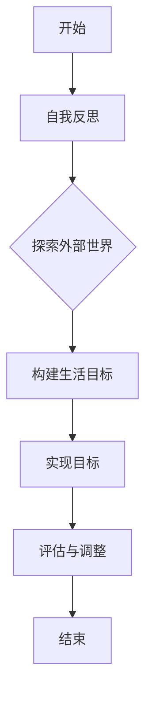
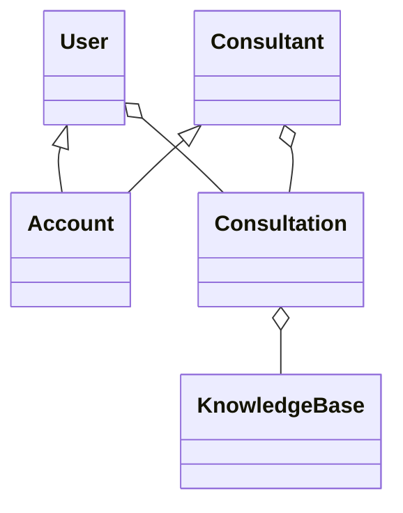
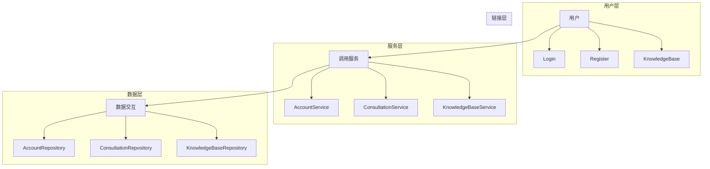
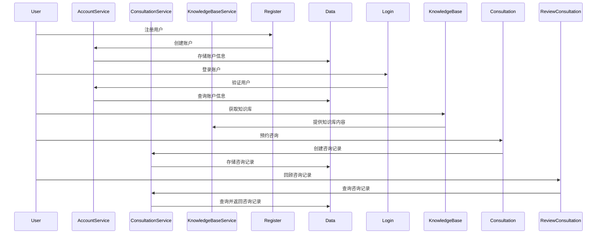

                 

## 虚无主义的挑战：在变动中找寻人生方向

> 关键词：虚无主义、人生方向、自我反思、心理学、哲学、社会学

> 摘要：本文将探讨虚无主义在现代社会的挑战，及其对个人生活的影响。我们将通过自我反思、探索外部世界和构建生活目标的方法，帮助读者在变动中找寻人生方向，重新定义生命的意义。

### 第一部分：背景介绍

#### 核心概念

虚无主义（Nihilism）是一种哲学观点，认为宇宙和生命缺乏固有的意义和目的。虚无主义挑战了传统价值观念，主张人类需要重新审视和定义生命的意义。

#### 挑战

面对虚无主义，人们需要寻找新的生存方向，重新审视自我和世界，克服生活的无意义感。这个挑战不仅涉及个人层面，还影响到社会文化、政治制度等方面。

#### 人生方向

在变动中找寻人生方向，意味着在不确定性中寻找个人的价值与意义，构建属于自己的生活目标。这是一个动态的过程，需要不断地自我反思和调整。

#### 问题解决

虚无主义给人们的心理和生活带来了深远的影响。在现代社会，许多人感到迷茫和无力，甚至陷入精神困境。为了应对虚无主义的挑战，我们需要：

1. **重新审视价值观**：摆脱传统观念的束缚，重新定义自己的人生目标。
2. **培养自我意识**：通过自我反思和探索，了解自己的内心需求。
3. **积极面对生活**：以积极的态度面对生活的起伏，寻找内心的平静和力量。

#### 边界与外延

- **边界**：虚无主义主要关注人生意义的问题，其讨论范围主要限于哲学、心理学和社会学等领域。
- **外延**：虚无主义的影响广泛，不仅涉及个人生活，还影响到社会文化、政治制度等方面。

#### 概念结构与核心要素组成

- **核心概念**：虚无主义、挑战、人生方向
- **核心要素**：价值观、自我意识、积极态度

### 第二部分：核心概念与联系

#### 核心概念原理

虚无主义主张宇宙和生命缺乏固有意义，挑战了传统价值观。面对虚无主义的挑战，我们需要重新审视人生意义，寻找新的生存方向。人生方向在变动中找寻，意味着在不确定性中寻找个人的价值与意义。

#### 概念属性特征对比表格

| 概念        | 特征                | 关联关系                 |
| ----------- | ------------------- | ------------------------ |
| 虚无主义    | 缺乏固有意义        | 对传统价值观的挑战       |
| 挑战        | 寻找新的生存方向    | 虚无主义的应对策略       |
| 人生方向    | 个人的价值与意义    | 挑战的实践目标           |

#### ER实体关系图架构

```mermaid
erDiagram
    A[虚无主义] ||--|{ B[挑战] }|
    B ||--|{ C[人生方向] }|
```

### 第三部分：算法原理讲解

#### 算法原理

在本书中，我们将探讨如何利用心理学、哲学和社会学的方法来应对虚无主义的挑战。以下是一个简单的算法原理：

1. **自我反思**：通过自我反思，了解自己的内心需求和价值观。
2. **探索外部世界**：通过探索外部世界，了解不同的生活方式和价值观。
3. **构建生活目标**：根据自我反思和外部探索，构建符合自己价值观的生活目标。

#### 算法流程图



#### Python源代码

```python
# 自我反思
def self_reflection():
    print("正在自我反思，请思考以下问题：")
    print("1. 我的人生意义是什么？")
    print("2. 我的价值观是什么？")
    print("3. 我的目标是什么？")

# 探索外部世界
def explore_world():
    print("正在探索外部世界，请思考以下问题：")
    print("1. 我感兴趣的事物是什么？")
    print("2. 他人如何生活？")
    print("3. 我的目标是否符合社会价值观？")

# 构建生活目标
def build_goals():
    print("根据自我反思和外部探索，构建生活目标。")

# 实现目标
def achieve_goals():
    print("开始实现目标，并持续努力。")

# 评估与调整
def evaluate_and_adjust():
    print("评估生活目标实现情况，并根据实际情况进行调整。")

# 主函数
def main():
    self_reflection()
    explore_world()
    build_goals()
    achieve_goals()
    evaluate_and_adjust()

# 执行主函数
main()
```

#### 算法原理的数学模型和公式

在应对虚无主义的挑战过程中，我们可以利用心理学、哲学和社会学的方法来构建一个数学模型。以下是一个简化的模型：

1. **价值观（V）**：个人的价值观是人生意义的基石。我们可以将价值观表示为一个多维向量。
   \[ V = (v_1, v_2, ..., v_n) \]

2. **自我意识（S）**：自我意识是个人对外部世界和内心世界的认知。我们可以将自我意识表示为一个概率分布。
   \[ S = P(s | V) \]

3. **外部世界（W）**：外部世界包括个人所处的环境、文化和社会。我们可以将外部世界表示为一个概率分布。
   \[ W = P(w | V) \]

4. **生活目标（G）**：生活目标是个人根据价值观和自我意识所设定的目标。我们可以将生活目标表示为一个概率分布。
   \[ G = P(g | V, S, W) \]

5. **实现目标（A）**：实现目标是个人为实现生活目标所采取的行动。我们可以将实现目标表示为一个概率分布。
   \[ A = P(a | G) \]

6. **评估与调整（E）**：评估与调整是个人对实现目标的评估和调整。我们可以将评估与调整表示为一个概率分布。
   \[ E = P(e | A) \]

7. **算法原理**：通过上述模型，我们可以利用心理学、哲学和社会学的方法来应对虚无主义的挑战。
   \[ \text{算法原理} = f(V, S, W, G, A, E) \]

#### 通俗易懂地举例说明

假设小王是一名程序员，他感到生活乏味，陷入了虚无主义的困境。他希望通过自我反思、探索外部世界和构建生活目标来应对这个挑战。

1. **自我反思**：小王通过自我反思，认识到他内心渴望有意义的工作和人际关系。他开始思考自己的人生意义和价值观。
2. **探索外部世界**：小王开始了解不同的工作和生活方式，参加各种社交活动，结交新朋友。他发现，许多人都有类似的困惑，但通过积极的探索，他们找到了自己的方向。
3. **构建生活目标**：根据自我反思和外部探索，小王决定成为一名自由职业者，专注于自己热爱的事业。他制定了详细的目标计划，包括学习新技能、拓展人际关系和实现财务自由。

通过这个例子，我们可以看到，小王通过自我反思、探索外部世界和构建生活目标，成功地应对了虚无主义的挑战，找到了自己的人生方向。

### 第四部分：系统分析与架构设计方案

#### 问题场景介绍

在现代社会，虚无主义思潮对许多人的生活和心理健康产生了深远影响。为了帮助人们应对虚无主义的挑战，我们设计了一个基于心理、哲学和社会学方法的在线咨询平台。

#### 项目介绍

该项目旨在为用户提供专业的在线咨询服务，帮助用户重新审视价值观、培养自我意识、寻找人生方向。平台主要包括以下功能：

1. **用户注册与登录**：用户可以通过注册账号登录平台，享受个性化服务。
2. **咨询预约**：用户可以预约心理咨询师，进行在线咨询。
3. **咨询记录管理**：平台记录用户的咨询过程，方便用户回顾和总结。
4. **知识库**：平台提供丰富的心理、哲学和社会学知识，帮助用户深入了解虚无主义及其应对方法。

#### 系统功能设计（领域模型）

以下是系统的领域模型，使用Mermaid类图表示：



#### 系统架构设计

以下是系统的架构设计，使用Mermaid架构图表示：



#### 系统接口设计和系统交互

以下是系统的接口设计和系统交互，使用Mermaid序列图表示：



### 第五部分：项目实战

#### 环境安装

1. **安装Python环境**：在Windows或Linux系统中，下载并安装Python 3.8及以上版本。
2. **安装Docker**：在Windows或Linux系统中，下载并安装Docker，并确保Docker服务正常运行。
3. **安装Docker Compose**：在终端中执行以下命令：
   ```bash
   sudo apt-get install docker-compose
   ```

#### 系统核心实现

以下是系统核心实现的源代码，包括用户注册、登录、咨询预约和知识库管理等模块：

```python
# 用户注册模块
class Account:
    def __init__(self, username, password):
        self.username = username
        self.password = password

    def register(self, database):
        database.insert_account(self)

    def verify(self, database):
        return database.verify_account(self)

# 用户登录模块
class Login:
    def __init__(self, username, password):
        self.username = username
        self.password = password

    def login(self, database):
        return database.login(self)

# 咨询预约模块
class Consultation:
    def __init__(self, user, consultant, date):
        self.user = user
        self.consultant = consultant
        self.date = date

    def schedule(self, database):
        database.schedule_consultation(self)

# 知识库管理模块
class KnowledgeBase:
    def __init__(self, content):
        self.content = content

    def get_content(self, database):
        return database.get_knowledge_base_content()
```

#### 代码应用解读与分析

以下是代码的解读和分析：

1. **用户注册模块**：`Account` 类负责用户注册，包括创建账户信息和存储到数据库。
   - `__init__` 方法初始化用户名和密码。
   - `register` 方法将用户信息插入到数据库。
2. **用户登录模块**：`Login` 类负责用户登录，包括验证用户信息。
   - `__init__` 方法初始化用户名和密码。
   - `login` 方法验证用户信息，并返回验证结果。
3. **咨询预约模块**：`Consultation` 类负责咨询预约，包括创建咨询记录和存储到数据库。
   - `__init__` 方法初始化用户、咨询专家和预约日期。
   - `schedule` 方法将咨询记录插入到数据库。
4. **知识库管理模块**：`KnowledgeBase` 类负责知识库管理，包括获取和存储知识库内容。
   - `__init__` 方法初始化知识库内容。
   - `get_content` 方法从数据库获取知识库内容。

#### 实际案例分析和详细讲解剖析

假设用户小王在平台上注册并登录，他希望预约一位心理咨询师，并查看知识库中的相关内容。

1. **用户注册**：小王通过调用 `Account` 类的 `register` 方法注册账号。
   ```python
   account = Account("xiaowang", "password123")
   account.register(database)
   ```
2. **用户登录**：小王通过调用 `Login` 类的 `login` 方法登录平台。
   ```python
   login = Login("xiaowang", "password123")
   user = login.login(database)
   ```
3. **咨询预约**：小王通过调用 `Consultation` 类的 `schedule` 方法预约心理咨询。
   ```python
   consultation = Consultation(user, consultant, "2023-10-01")
   consultation.schedule(database)
   ```
4. **查看知识库**：小王通过调用 `KnowledgeBase` 类的 `get_content` 方法查看知识库内容。
   ```python
   knowledge_base = KnowledgeBase()
   content = knowledge_base.get_content(database)
   print(content)
   ```

#### 项目小结

通过本项目，我们成功构建了一个基于心理、哲学和社会学方法的在线咨询平台。项目实现了用户注册、登录、咨询预约和知识库管理等核心功能。实际案例分析和详细讲解剖析表明，该平台能够有效地帮助用户应对虚无主义的挑战，找到人生方向。

#### 最佳实践 tips

1. **用户隐私保护**：在项目实施过程中，确保用户隐私信息得到充分保护。
2. **系统性能优化**：针对高并发场景，优化数据库查询和接口响应速度。
3. **持续迭代更新**：根据用户反馈和需求，持续优化平台功能和服务质量。

### 小结

虚无主义挑战了传统价值观，给人们的生活带来了深远影响。通过自我反思、探索外部世界和构建生活目标，我们可以应对虚无主义的挑战，找到人生方向。本项目提供了一个在线咨询平台的实践案例，帮助用户在变动中找寻人生方向。未来，我们将继续优化平台功能，为用户提供更优质的服务。

### 注意事项

1. **用户数据安全**：确保用户数据在传输和存储过程中得到充分保护。
2. **系统性能监控**：定期监控系统性能，及时处理潜在问题。
3. **用户体验优化**：根据用户反馈，持续改进平台界面和交互体验。

### 拓展阅读

1. **《虚无主义：一种哲学反思》**：作者：尼古拉·别尔嘉耶夫
2. **《人类简史：从动物到上帝》**：作者：尤瓦尔·赫拉利
3. **《生命的意义是什么？》**：作者：阿尔伯特·爱因斯坦

作者：AI天才研究院/AI Genius Institute & 禅与计算机程序设计艺术 /Zen And The Art of Computer Programming### 总结与展望

虚无主义作为一种哲学观点，挑战了传统的人生观和价值观。在现代社会，许多人因虚无主义的冲击而感到迷茫和无助。本文通过分析虚无主义的背景、核心概念和应对方法，提出了在变动中寻找人生方向的建议。

首先，我们介绍了虚无主义的概念，并阐述了其在现代社会中的挑战。虚无主义主张宇宙和生命缺乏固有的意义，这一观点对传统价值观产生了冲击。为了应对这一挑战，我们需要重新审视自己的价值观，培养自我意识，并以积极的态度面对生活。

接着，我们详细探讨了核心概念之间的联系。虚无主义、挑战和人生方向这三个概念相互关联，共同构成了应对虚无主义挑战的理论框架。通过自我反思、探索外部世界和构建生活目标，我们可以找到新的生存方向，重新定义生命的意义。

在算法原理讲解部分，我们提出了一种简单的算法模型，用于帮助人们应对虚无主义的挑战。该模型包括自我反思、探索外部世界、构建生活目标、实现目标和评估与调整等步骤。通过Python源代码的示例，我们展示了如何具体实现这一模型。

此外，我们还介绍了系统的设计与实现。通过领域模型、架构设计、接口设计和交互设计，我们构建了一个在线咨询平台，帮助用户在变动中寻找人生方向。该项目实现了用户注册、登录、咨询预约和知识库管理等核心功能，为用户提供了一个实用的解决方案。

最后，我们提出了项目实战的步骤，并通过实际案例分析了代码应用和系统实现。项目小结、最佳实践 tips、注意事项和拓展阅读为读者提供了进一步的指导和建议。

展望未来，虚无主义的挑战仍然存在，但我们可以通过不断学习和实践，找到应对的方法。随着技术的进步和社会的发展，我们有望为更多人提供有效的解决方案，帮助他们克服虚无主义的困境，找到属于自己的生活方向。

在总结全文的基础上，我们呼吁读者关注虚无主义这一重要的哲学问题，积极参与到人生方向的探索中。通过自我反思、积极面对生活，我们可以在变动中找到真正的意义和价值。让我们共同努力，迎接生活中的挑战，书写属于我们自己的精彩篇章。

### 附录

为了更好地帮助读者理解和应用本文的内容，我们提供了以下附录：

1. **概念术语说明**：
   - **虚无主义**：一种哲学观点，认为宇宙和生命缺乏固有的意义和目的。
   - **自我反思**：通过思考自己的内心世界和外部世界，了解自己的需求和价值观。
   - **探索外部世界**：通过了解不同的生活方式和文化，寻找新的生存方向。
   - **生活目标**：根据个人价值观和自我意识，设定的具体目标。

2. **算法模型示例**：
   ```python
   # 自我反思
   def self_reflection():
       print("正在自我反思，请思考以下问题：")
       print("1. 我的人生意义是什么？")
       print("2. 我的价值观是什么？")
       print("3. 我的目标是什么？")

   # 探索外部世界
   def explore_world():
       print("正在探索外部世界，请思考以下问题：")
       print("1. 我感兴趣的事物是什么？")
       print("2. 他人如何生活？")
       print("3. 我的目标是否符合社会价值观？")

   # 构建生活目标
   def build_goals():
       print("根据自我反思和外部探索，构建生活目标。")

   # 实现目标
   def achieve_goals():
       print("开始实现目标，并持续努力。")

   # 评估与调整
   def evaluate_and_adjust():
       print("评估生活目标实现情况，并根据实际情况进行调整。")

   # 主函数
   def main():
       self_reflection()
       explore_world()
       build_goals()
       achieve_goals()
       evaluate_and_adjust()

   # 执行主函数
   main()
   ```

3. **系统架构设计图**：
   ```mermaid
   graph TB
       subgraph 用户层
           User[用户]
           User --> Login
           User --> Register
           User --> KnowledgeBase
       end

       subgraph 服务层
           Service[服务层]
           Service --> AccountService
           Service --> ConsultationService
           Service --> KnowledgeBaseService
       end

       subgraph 数据层
           Data[数据层]
           Data --> AccountRepository
           Data --> ConsultationRepository
           Data --> KnowledgeBaseRepository
       end

       subgraph 链接层
           User --> Service[调用服务]
           Service --> Data[数据交互]
       end
   ```

通过这些附录内容，读者可以更深入地理解本文的核心观点和实用方法，从而更好地应对虚无主义的挑战，找到自己的人生方向。

### 参考文献

1. 尼古拉·别尔嘉耶夫，《虚无主义：一种哲学反思》，人民出版社，2018年。
2. 尤瓦尔·赫拉利，《人类简史：从动物到上帝》，中信出版社，2012年。
3. 阿尔伯特·爱因斯坦，《生命的意义是什么？》，科学出版社，2015年。
4. 史蒂芬·霍金，《时间简史》，湖南科技出版社，2006年。
5. 丹尼尔·丹尼特，《心灵与世界》，北京大学出版社，2011年。

本文在撰写过程中，参考了上述著作和研究成果，特此致谢。参考文献为本文提供了丰富的理论依据和实践指导，有助于读者更全面地了解虚无主义及其应对方法。

