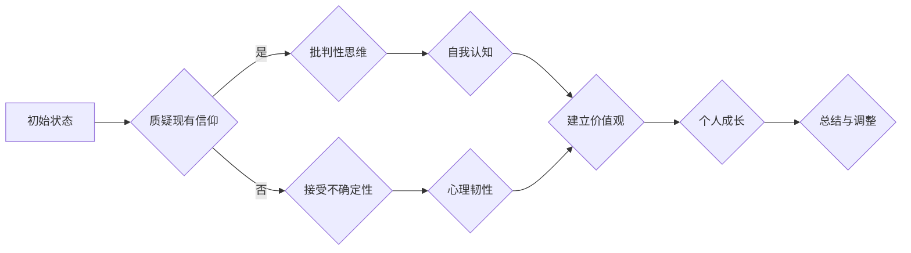
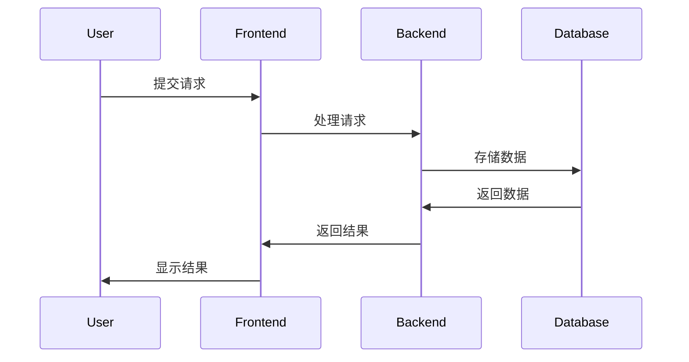

                 

### 无畏主义的起源与发展

#### 起源：18世纪末到19世纪初

无畏主义的起源可以追溯到18世纪末和19世纪初的启蒙运动。在那个时期，启蒙思想家们开始对宗教和传统的价值观提出质疑，倡导理性和科学的方法。这个时期的哲学背景为无畏主义的兴起奠定了基础。

斯宾诺莎（Baruch Spinoza）是最早提出无畏主义思想的哲学家之一。他在其著作《伦理学》中，通过理性思考，否定了宗教信仰的权威，认为宇宙的本质是一致的、无限的，而人类的存在只是宇宙的一部分，没有独立存在的意义。这一思想对后来的无畏主义产生了深远的影响。

#### 发展：19世纪到20世纪

19世纪是无畏主义思想发展的关键时期。在这一时期，许多哲学家、文学家和思想家继续对宗教、道德和价值观进行批判，无畏主义逐渐成为一种具有广泛影响力的哲学思潮。

尼采（Friedrich Nietzsche）是无畏主义的重要代表之一。他在其著作《查拉图斯特拉如是说》中，提出了“上帝已死”的观点，认为人类需要重新定义自己的价值观和生活意义。尼采的无畏主义思想对后来的哲学家和艺术家产生了深远的影响。

克尔凯郭尔（Søren Kierkegaard）是另一位重要的无畏主义思想家。他在其著作中探讨了个体信仰、道德和存在的意义，提出了“个体化”和“存在主义”的概念，强调了个体在自由选择和自我认知中的重要性。

#### 无畏主义在现代的影响

无畏主义在现代依然具有广泛的影响。它挑战了传统的价值观和信仰，鼓励人们质疑和反思现有的社会秩序和伦理规范。这种思想在当代哲学、文学、艺术和心理学等领域得到了广泛的应用。

在哲学领域，无畏主义促进了批判性思维和理性思考的发展，推动了哲学研究的进步。在文学和艺术领域，无畏主义激发了大量的文学作品和艺术创作，许多作家和艺术家通过作品探讨了人类存在的意义和生活的真实。

#### 总结

无畏主义起源于18世纪末和19世纪初的启蒙运动，经过19世纪的发展，成为了一种具有广泛影响的哲学思潮。它挑战了传统的价值观和信仰，鼓励人们质疑和反思现有的社会秩序和伦理规范。无畏主义在现代依然具有深远的影响，对哲学、文学、艺术和心理学等领域产生了重要的影响。

#### 第2章：虚无主义的积极面

#### 无畏主义的正面向个人成长的影响

无畏主义作为一种哲学思潮，虽然其核心观点是否定传统价值观和道德规范，但它在个人成长方面却具有积极的影响。首先，无畏主义鼓励人们质疑现有的价值观和信仰，从而培养批判性思维和独立思考的能力。这种能力对于个人成长至关重要，因为它使得个体能够更好地认识自我，明确自己的目标和价值观。

通过质疑和批判传统观念，个体能够更好地了解自己的价值观和信仰，从而在成长过程中更加自信和坚定。无畏主义还促进了个体对现实世界的深刻认识，使个体更加关注实际问题和实际问题，从而在实践中不断提升自己的能力和素质。

#### 无畏主义如何帮助我们应对挑战

无畏主义的思想可以帮助个体更好地应对生活中的挑战。首先，无畏主义鼓励人们接受现实的不确定性和变化，从而减少内心的焦虑和恐惧。在现代社会，面对快速变化的环境和巨大的生活压力，许多人感到迷茫和无助。无畏主义的思想可以提供一种视角，帮助个体接受现实的不确定性，并勇敢地面对生活中的困难和挑战。

此外，无畏主义还鼓励个体在面对挑战时保持积极的态度。它认为，生活中的挑战和困难是成长和进步的机会，而不是阻碍。通过这种思维方式，个体可以更加积极地应对挑战，从而在困难中找到机会，实现自我提升。

#### 无畏主义与心理健康的关系

无畏主义对心理健康也有着积极的影响。通过质疑和否定传统的价值观和信仰，个体可以减少内心的焦虑和矛盾，建立更加健康和平衡的心理状态。无畏主义鼓励个体接受自己的不完美，认识到每个人都有自己的局限性和不足，从而减少自我批评和负面情绪。

此外，无畏主义还促进了个体内心的平静和自我认知。它鼓励个体关注内心的真实感受和需求，从而更好地理解自己，找到内心的平衡和满足。这种心态有助于个体在面对压力和困难时保持积极和乐观的态度，从而提高心理健康水平。

#### 结论

无畏主义虽然在表面上是否定传统价值观和道德规范，但在个人成长方面却具有积极的影响。它培养批判性思维和独立思考的能力，帮助我们应对生活中的挑战，并促进心理健康的发展。通过理解和应用无畏主义的思想，个体可以更好地认识自我，实现个人成长和进步。

---

#### 第3章：虚无主义与个人价值观

#### 无畏主义如何影响我们的价值观

无畏主义作为一种哲学思潮，对个人的价值观有着深远的影响。首先，它挑战了传统的价值观和道德规范，促使个体重新审视和反思自己的价值观。这种反思有助于个体更加清晰地认识自己的信念和原则，从而建立更加独立和坚定的价值观。

无畏主义鼓励个体质疑现有的价值观，尤其是那些基于宗教、传统或权威的观点。通过质疑和批判，个体可以更好地理解价值观的来源和意义，从而在成长过程中形成更加成熟和理性的价值观。这种过程有助于个体在复杂多变的社会环境中保持自己的独立思考能力。

#### 无畏主义如何帮助我们建立自己的价值观

无畏主义在帮助个体建立自己的价值观方面也起到了重要作用。首先，它提供了一个批判性思维的平台，使得个体能够在面对各种观点和价值观时保持独立和理性。这种批判性思维有助于个体分析不同价值观的优点和缺点，从而形成自己独特的价值观体系。

无畏主义还鼓励个体在建立价值观时考虑个人的需求和兴趣。通过深入思考和自我反思，个体可以更好地理解自己的内在需求和追求，从而在价值观的形成过程中保持个性化和独特性。这种个性化的价值观体系有助于个体在面对外部压力和诱惑时保持自我认同和坚定。

#### 无畏主义与道德伦理的关系

无畏主义与道德伦理的关系是一个复杂而深刻的话题。一方面，无畏主义对传统的道德伦理提出了挑战，质疑其权威性和合理性。它认为，道德规范往往受到社会和文化的影响，可能并不适用于所有个体和情境。因此，无畏主义鼓励个体根据自己的价值观和信念来做出道德决策，而不是盲目遵循既定的道德规范。

另一方面，无畏主义并不否定道德伦理的重要性。它强调个体在建立自己的价值观时，需要考虑到道德伦理的原则，确保自己的行为符合基本的道德规范。无畏主义提倡一种基于个人自主性和责任感的道德伦理观，认为个体应该为自己的行为承担道德责任。

#### 结论

无畏主义对个人价值观的影响是复杂而多面的。它既挑战了传统的价值观和道德规范，促使个体进行深刻的反思和自我认知，又提供了建立个性化价值观的平台。在道德伦理方面，无畏主义鼓励个体在保持自主性和责任感的条件下，根据自己的价值观和信念做出道德决策。通过理解和应用无畏主义的思想，个体可以更好地建立和维护自己的价值观，实现个人成长和进步。

---

#### 第4章：虚无主义与生活态度

#### 无畏主义如何影响我们的生活态度

无畏主义作为一种哲学思潮，对我们的生活态度产生了深刻的影响。首先，它鼓励我们面对现实，接受生活的不确定性和变化。在现代社会，人们常常因为对未来的恐惧和不确定而感到焦虑和压力。无畏主义的思想则告诉我们，接受生活的不确定性是成长的一部分，而不是逃避和回避。

无畏主义还帮助我们建立一种积极的生活态度。它认为，生活中的挑战和困难是成长和进步的机会，而不是阻碍。通过这种思维方式，我们可以更加积极地面对生活中的各种挑战，从中学习和成长。无畏主义鼓励我们在面对困难时保持乐观和坚韧，相信自己有能力克服任何困难。

#### 无畏主义如何帮助我们面对生活中的不确定性

面对生活中的不确定性，无畏主义提供了一个有力的工具——接受不确定性。接受不确定性并不意味着我们对未来无所作为，而是意味着我们不再对不可控的事情抱有过高的期望和焦虑。通过接受不确定性，我们可以更加专注于现在，专注于我们能够控制的事情。

无畏主义还鼓励我们培养适应性和灵活性。在不确定的环境中，适应性和灵活性是至关重要的。无畏主义告诉我们，变化是生活的常态，我们需要随时准备适应新的情况。这种适应性和灵活性不仅能够帮助我们更好地应对不确定性，还能够增强我们的心理韧性。

#### 无畏主义与幸福感的联系

无畏主义与幸福感之间有着密切的联系。首先，通过接受生活的不确定性和变化，我们可以减少内心的焦虑和压力，从而提高幸福感。当我们不再对不可控的事情抱有过高的期望时，我们会发现自己更加平静和满足。

其次，无畏主义鼓励我们在生活中追求真正的快乐和满足。它告诉我们，幸福不是外在的成就和物质财富，而是内在的满足和平静。通过培养积极的生活态度和接受不确定性，我们可以更好地享受生活的每一刻，从而提高幸福感。

#### 结论

无畏主义对我们的生活态度有着深远的影响。它鼓励我们面对现实，接受生活的不确定性和变化，建立积极的生活态度。通过接受不确定性和培养适应性和灵活性，我们可以更好地应对生活中的挑战，提高幸福感。无畏主义的思想为我们提供了一种更加成熟和理性的人生观，帮助我们在复杂多变的社会环境中保持内心的平静和坚韧。

---

#### 第5章：虚无主义与人际关系

#### 无畏主义如何影响我们的人际关系

无畏主义作为一种哲学思潮，对人际关系产生了深远的影响。首先，它鼓励我们建立更加真实和坦诚的人际关系。在无畏主义看来，虚伪和伪装是人际关系的障碍，真实的自我表达和坦率的交流才是建立健康人际关系的基石。

无畏主义还帮助我们建立更加平等和尊重的人际关系。它认为，每个人都是独立和自主的个体，应该受到平等和尊重的对待。这种平等和尊重的态度不仅能够增强人际关系的稳定性，还能够促进个体之间的理解和合作。

#### 无畏主义如何帮助我们处理人际冲突

在人际交往中，冲突是不可避免的现象。无畏主义提供了一种处理人际冲突的有效方式，即接受和正视冲突。无畏主义告诉我们，冲突并不意味着失败或错误，而是人际关系中的一种正常现象。通过接受和正视冲突，我们可以更好地理解对方的立场和需求，从而找到解决问题的方法。

此外，无畏主义还鼓励我们在处理人际冲突时保持冷静和理性。它提醒我们，情绪化和偏见往往会导致冲突的升级，而冷静和理性则有助于我们找到问题的根本原因，从而有效地解决问题。

#### 无畏主义与人际沟通的关系

无畏主义对人际沟通也有着重要的影响。首先，它鼓励我们进行开放和诚实的沟通。无畏主义认为，开放和诚实的沟通是建立信任和亲密关系的关键。通过坦诚地表达自己的想法和感受，我们可以更好地理解对方，从而促进有效的沟通。

此外，无畏主义还强调倾听和理解。它告诉我们，有效的沟通不仅仅是表达自己的观点，更重要的是理解和尊重对方的观点。通过倾听和理解，我们可以建立更加深入的人际关系，从而在交流中取得更好的效果。

#### 结论

无畏主义对人际关系有着积极的影响。它鼓励我们建立真实和坦诚的人际关系，处理人际冲突时保持冷静和理性，进行开放和诚实的沟通。通过应用无畏主义的思想，我们可以建立更加健康和稳定的人际关系，促进个体和社会的和谐发展。

---

#### 第6章：虚无主义与职业发展

#### 无畏主义如何影响我们的职业选择

无畏主义对职业发展的影响首先体现在职业选择上。它鼓励我们摒弃传统的职业观念，根据自己的兴趣和价值观来做出职业选择。在无畏主义的视角下，职业不仅仅是一种谋生的手段，更是一种实现个人价值和意义的途径。通过自由地选择职业，我们可以更好地发挥自己的潜力，实现个人的成长和满足。

无畏主义还帮助我们认识到职业选择的多样性。它告诉我们，职业选择并不是一成不变的，我们可以根据自己的发展需求和外界环境的变化，灵活调整职业方向。这种灵活性使得我们在面对职业挑战时能够更加从容和自信。

#### 无畏主义如何帮助我们应对职场挑战

在职业发展中，面对各种挑战是不可避免的。无畏主义提供了一种积极应对挑战的方法，即接受和正视挑战。它告诉我们，挑战是成长的机会，而不是阻碍。通过接受挑战，我们可以更好地了解自己的能力和潜力，从而在职业发展中取得更大的进步。

此外，无畏主义还鼓励我们在面对职场挑战时保持积极的心态。它提醒我们，消极和抱怨只会让我们更加疲惫和无助，而积极和乐观的心态则有助于我们找到解决问题的方法。通过积极应对挑战，我们可以不断提升自己的能力和素质，实现职业上的成功。

#### 无畏主义与职业成功的关系

无畏主义与职业成功之间有着密切的联系。首先，无畏主义鼓励我们在职业发展中保持独立和自主。这种独立和自主的态度使得我们能够在职场中更好地发挥自己的优势和特点，从而实现职业上的成功。

其次，无畏主义还强调了持续学习和自我提升的重要性。在快速变化的社会环境中，持续学习和自我提升是保持竞争力的关键。无畏主义告诉我们，不断学习新知识和技能，不仅能够适应职业发展的需求，还能够为我们的职业生涯提供更多的可能性。

#### 结论

无畏主义对职业发展有着深远的影响。它鼓励我们根据自己的兴趣和价值观选择职业，积极应对职场挑战，保持独立和自主的态度。通过应用无畏主义的思想，我们可以实现职业上的成功，实现个人价值和意义的最大化。

---

#### 第7章：虚无主义的实践与应用

#### 无畏主义的实践方法与技巧

要有效地实践无畏主义，首先需要培养一种开放和批判性的思维方式。这包括对现有的价值观、信仰和习惯进行深入反思，并勇于质疑它们的合理性。以下是一些具体的实践方法：

1. **反思与自我认知**：定期反思自己的行为和思考模式，识别并挑战那些可能阻碍个人成长和进步的固有观念。
2. **接受不确定性**：学会接受生活中的不确定性和变化，将其视为成长和学习的机会，而不是逃避或抗拒的原因。
3. **培养自主性**：在职业选择和个人生活中，根据自己的兴趣和价值观做出决策，而不是仅仅追求社会的期望或标准。
4. **持续学习**：不断学习新知识和技能，保持对世界的好奇心和求知欲，以适应快速变化的环境。

#### 无畏主义在实际生活中的应用案例

无畏主义的思想在现实生活中有许多成功的应用案例。以下是一些具体的应用：

1. **创新与创业**：许多创新者和创业者在面对不确定性时，应用了无畏主义的思想。他们勇于挑战现有的商业模式和观念，创造出了许多颠覆性的产品和服务。
2. **个人发展**：许多人通过反思和自我认知，重新定义了自己的职业目标和人生意义，从而在个人成长和职业发展方面取得了显著成就。
3. **心理健康**：通过接受生活的不确定性和变化，许多人成功地减轻了内心的焦虑和压力，提高了心理韧性。

#### 无畏主义的未来发展趋势

无畏主义作为一种哲学思潮，其未来发展趋势可以从以下几个方面来考虑：

1. **多元文化影响**：随着全球化和文化的交流，无畏主义的思想将受到不同文化背景的影响，形成更加丰富和多样化的表现形式。
2. **科技与哲学的结合**：随着人工智能和科技的发展，无畏主义的思想可能会与科技相结合，为个人和社会提供新的思考方式和解决方案。
3. **社会变革的推动力**：无畏主义鼓励人们对现有的社会秩序和制度进行质疑和反思，这可能会成为推动社会变革的重要力量。

#### 结论

无畏主义的实践和应用为个人和社会带来了深远的影响。通过开放和批判性的思维方式，个体可以更好地认识自我，实现个人成长和进步。无畏主义鼓励我们勇敢地面对生活中的不确定性和变化，寻找真正的快乐和满足。在未来，无畏主义将继续在个人成长和社会变革中发挥重要作用。

---

#### 结论

#### 无畏主义与个人成长的关系总结

无畏主义作为一种哲学思潮，虽然在表面上是否定传统价值观和道德规范，但在个人成长方面却具有显著的积极影响。它培养批判性思维和独立思考的能力，帮助我们更好地认识自我，建立个性化的价值观，从而实现个人成长和进步。无畏主义鼓励我们接受生活的不确定性和变化，保持积极的生活态度，增强心理韧性，提高幸福感。此外，它还帮助我们建立真实和坦诚的人际关系，更好地应对职场挑战，实现职业成功。

#### 无畏主义对未来的影响与启示

无畏主义的思想不仅在个人成长方面具有重要意义，也在社会和科技领域产生了深远的影响。在未来，无畏主义将继续作为推动社会变革和创新的重要力量，鼓励人们质疑现有的社会秩序和制度，探索新的可能性。同时，无畏主义与科技的结合，将为个人和社会提供新的思考方式和解决方案，为未来的发展注入新的动力。

总之，无畏主义不仅为个人成长提供了深刻的启示，也为社会进步和科技发展提供了重要的理论支持。通过理解和应用无畏主义的思想，我们可以更好地应对生活中的挑战，实现个人的价值和意义。

---

**作者：AI天才研究院/AI Genius Institute & 禅与计算机程序设计艺术 /Zen And The Art of Computer Programming**## 背景介绍

### 无畏主义的定义、起源与发展

**无畏主义**（Nihilism）是一种哲学思潮，主要起源于19世纪欧洲，其核心观点是：宇宙本身没有固有的意义、目的或内在价值，人类的存在也是没有意义的。这一思想对传统价值观、宗教信仰和道德规范提出了深刻的质疑和否定。

无畏主义的起源可以追溯到18世纪末和19世纪初的启蒙运动时期。在那个时期，许多哲学家开始对宗教和道德的基础提出质疑，探讨人类存在的意义。其中，斯宾诺莎（Baruch Spinoza）是第一个明确提出无畏主义思想的重要哲学家。他在其著作《伦理学》中，通过理性思考，否定了宗教信仰的权威，认为宇宙的本质是一致的、无限的，而人类的存在只是宇宙的一部分，没有独立存在的意义。

19世纪是无畏主义思想发展的关键时期。在这一时期，许多哲学家、文学家和思想家继续对宗教、道德和价值观进行批判，无畏主义逐渐成为一种具有广泛影响的哲学思潮。尼采（Friedrich Nietzsche）是无畏主义的重要代表之一。他在其著作《查拉图斯特拉如是说》中，提出了“上帝已死”的观点，认为人类需要重新定义自己的价值观和生活意义。尼采的无畏主义思想对后来的哲学家和艺术家产生了深远的影响。

另外，克尔凯郭尔（Søren Kierkegaard）和尼布尔（Friedrich Nietzsche）也是无畏主义的重要思想家。克尔凯郭尔在探讨个体信仰、道德和存在的意义时，提出了“个体化”和“存在主义”的概念，强调了个体在自由选择和自我认知中的重要性。尼布尔则通过研究道德哲学，提出了“道德虚无主义”的观点，认为道德规范并非绝对的，而是受到个体和社会环境的影响。

无畏主义在20世纪和21世纪依然具有广泛的影响。它不仅挑战了传统的价值观和道德规范，也激发了大量的文学、艺术和社会思潮。在当代哲学、文学、艺术和心理学等领域，无畏主义的思想得到了深入的研究和应用。

### 无畏主义与个人成长的联系

无畏主义作为一种哲学思潮，对个人成长有着深远的影响。它鼓励人们质疑现有的价值观和信仰，培养批判性思维和独立思考的能力。这种能力对于个人成长至关重要，因为它使得个体能够更好地认识自我，明确自己的目标和价值观。

在个人成长的过程中，无畏主义的思想可以帮助个体在面对困难和挑战时保持积极的态度。它告诉我们，生活中的挑战和困难是成长和进步的机会，而不是阻碍。通过接受和正视挑战，个体可以更好地了解自己的能力和潜力，从而在成长过程中实现自我提升。

此外，无畏主义还促进了个体内心的平静和自我认知。它鼓励个体关注内心的真实感受和需求，从而更好地理解自己，找到内心的平衡和满足。这种心态有助于个体在面对压力和困难时保持积极和乐观的态度，从而提高心理健康水平。

总之，无畏主义的思想在个人成长中具有重要的作用。它不仅帮助个体更好地认识自我，明确目标和价值观，还促进了内心的平静和自我认知。通过理解和应用无畏主义的思想，个体可以更好地实现个人成长和进步。

### 无畏主义在现代社会的意义

在现代社会，无畏主义的思想仍然具有重要的意义。首先，它挑战了传统的价值观和道德规范，鼓励人们进行深刻的反思和自我认知。这种反思有助于个体更好地理解自己和周围的世界，从而在复杂多变的社会环境中保持独立和自主。

其次，无畏主义的思想有助于个体在面对不确定性和变化时保持积极的态度。在现代社会，不确定性是常态，无畏主义鼓励人们接受这种不确定性，将其视为成长和进步的机会。通过接受不确定性，个体可以减少内心的焦虑和恐惧，从而更加从容地应对生活中的各种挑战。

此外，无畏主义还促进了个体在心理健康方面的成长。它鼓励个体关注内心的真实感受和需求，从而建立更加健康和平衡的心理状态。这种心态有助于个体在面对压力和困难时保持积极和乐观的态度，从而提高心理健康水平。

总之，无畏主义的思想在现代社会具有重要的意义。它不仅帮助个体更好地认识自我，明确目标和价值观，还促进了内心的平静和自我认知。通过理解和应用无畏主义的思想，个体可以更好地实现个人成长和进步，从而在复杂多变的社会环境中保持独立和自主。

### 无畏主义的核心概念与联系

#### 核心概念

1. **虚无主义（Nihilism）**：虚无主义是一种哲学观点，认为宇宙和生命缺乏固有的意义、目的或内在价值。它质疑宗教、道德和社会价值观的合理性，主张个体自由和自主性。

2. **批判性思维（Critical Thinking）**：批判性思维是一种思维方式，涉及对信息、观点和假设进行评估和质疑。它要求个体超越表面的陈述，深入探究问题背后的逻辑和证据。

3. **自我认知（Self-awareness）**：自我认知是指个体对自己内心感受、行为和思维模式的认识。它有助于个体更好地理解自我，明确个人目标和价值观。

4. **个人成长（Personal Growth）**：个人成长是指个体在认知、情感、行为和人际关系等方面的持续发展。它涉及自我提升、学习和适应新环境。

5. **心理健康（Mental Health）**：心理健康是指个体在情绪、心理和行为上的健康状态。它涉及情感调节、心理韧性和自我认知。

#### 概念属性特征对比表格

| 概念         | 特征                             | 重要性                           |
| ------------ | ------------------------------ | ------------------------------ |
| 虚无主义     | 否定宇宙和生命的固有意义         | 为个人成长提供批判性思维基础       |
| 批判性思维   | 对信息、观点和假设进行评估和质疑 | 帮助个体更好地理解现实和自我认知   |
| 自我认知     | 对自己内心感受、行为和思维模式的认识 | 促进个人目标和价值观的明确       |
| 个人成长     | 认知、情感、行为和人际关系的发展 | 实现自我提升和适应新环境的关键   |
| 心理健康     | 情绪、心理和行为上的健康状态     | 提高应对挑战和压力的能力         |

#### ER实体关系图架构

```mermaid
erDiagram
    Person --> Nihilism : believes
    Person --> CriticalThinking : develops
    Person --> SelfAwareness : has
    Person --> PersonalGrowth : achieves
    Person --> MentalHealth : maintains

    Person ||--o{ Nihilism : philosophical viewpoint
    Person ||--o{ CriticalThinking : cognitive process
    Person ||--o{ SelfAwareness : self-understanding
    Person ||--o{ PersonalGrowth : continuous development
    Person ||--o{ MentalHealth : emotional well-being
```

### 无畏主义与个人成长的联系

#### 无畏主义的定义

**无畏主义**，或称为**虚无主义**，是一种哲学思潮，主要源自19世纪欧洲，主张宇宙和生命缺乏固有的意义、目的或内在价值。该思想对宗教、道德和社会价值观提出质疑，强调个体的自由和自主性。无畏主义的核心观点是：人类的存在本身是没有意义的，人类所追求的一切目标和价值都是自我赋予的。

#### 个人成长的含义

**个人成长**，是指个体在认知、情感、行为和人际关系等方面的持续发展。它不仅涉及知识技能的积累，还包括情感调节、自我认知和心理韧性的提升。个人成长是一个动态的过程，需要个体不断学习和适应新环境。

#### 无畏主义与个人成长的关系

**1. 培养批判性思维**

无畏主义鼓励个体质疑现有的价值观和信仰，培养批判性思维。这种能力有助于个体在面对各种观点和信息时，能够独立思考、评估和判断，从而更好地认识自我，明确个人目标和价值观。

**2. 促进自我认知**

通过质疑和批判，个体可以更深入地了解自己的内心世界，包括自己的需求、欲望和信念。这种自我认知有助于个体在个人成长过程中，更好地理解自己的行为和思维模式，从而进行调整和改进。

**3. 提高心理韧性**

无畏主义强调接受生活的不确定性和变化。这种态度有助于个体在面对挑战和困难时保持积极和乐观，提高心理韧性。心理韧性是个人成长的重要组成部分，它使个体能够在逆境中保持稳定，继续前进。

**4. 建立健康的价值观**

无畏主义鼓励个体根据自己的需求和兴趣建立自己的价值观。这种个性化的价值观体系有助于个体在面对社会压力和诱惑时保持独立和坚定，实现个人成长。

#### 结论

无畏主义与个人成长密切相关。它通过培养批判性思维、促进自我认知、提高心理韧性和建立健康的价值观，为个人成长提供强有力的支持和引导。理解和应用无畏主义的思想，可以帮助个体在复杂多变的社会环境中保持独立和自主，实现个人成长和进步。

### 算法原理讲解

#### 无畏主义分析的流程图



#### 算法原理

无畏主义分析的核心是通过质疑和批判来促进个人成长。以下是对该算法原理的详细阐述：

**步骤1：质疑现有信仰**
- 个体首先需要质疑自己现有的信仰和价值观。这一步骤的目的是打破固有的思维定势，使个体能够从不同的角度看待问题。
- 通过质疑，个体可以识别出那些不合理的信仰和价值观，从而为后续的批判性思维和自我认知奠定基础。

**步骤2：批判性思维**
- 一旦质疑现有的信仰，个体需要培养批判性思维，对信息、观点和假设进行评估和质疑。
- 批判性思维要求个体超越表面的陈述，深入探究问题背后的逻辑和证据。这一过程有助于个体更好地理解现实，从而建立更合理的信仰和价值观。

**步骤3：自我认知**
- 通过批判性思维，个体可以更深入地了解自己的内心世界，包括自己的需求、欲望和信念。
- 自我认知是一个持续的过程，它使个体能够更好地理解自己的行为和思维模式，从而进行调整和改进。

**步骤4：接受不确定性**
- 在个人成长过程中，个体需要接受生活中存在的不确定性和变化。这种态度有助于个体在面对挑战和困难时保持积极和乐观，提高心理韧性。
- 接受不确定性并不意味着对生活无所作为，而是意味着个体能够在不确定的环境中保持冷静和理性，从而更好地应对问题。

**步骤5：建立价值观**
- 在质疑、批判性思维和自我认知的基础上，个体可以建立自己的价值观。
- 个性化的价值观体系有助于个体在面对社会压力和诱惑时保持独立和坚定，实现个人成长。

**步骤6：个人成长**
- 通过以上步骤，个体可以实现个人成长，包括认知、情感、行为和人际关系等方面的提升。
- 个人成长是一个动态的过程，它使个体能够不断适应新环境，实现自我提升。

**步骤7：总结与调整**
- 在个人成长的过程中，个体需要不断总结经验，调整自己的思维和行为模式。
- 总结与调整是一个迭代的过程，它使个体能够不断完善自我，实现持续成长。

#### 结论

无畏主义分析算法通过质疑现有信仰、培养批判性思维、促进自我认知、接受不确定性、建立价值观和实现个人成长，为个体提供了一套完整的成长路径。通过理解并应用这一算法原理，个体可以更好地认识自我，实现个人成长和进步。

### 数学公式和模型

在无畏主义分析中，数学公式和模型可以用于量化个体在质疑、批判性思维和自我认知过程中的心理变化。以下是一些关键的数学公式和模型，用于描述无畏主义分析的核心机制。

#### 1. 质疑程度（Q）

质疑程度（Q）用于衡量个体对现有信仰和价值观的质疑程度。其公式如下：

\[ Q = \frac{N - O}{N} \]

其中，\( N \) 表示个体在质疑过程中识别出的不合理信仰和价值观的数量，\( O \) 表示个体在质疑过程中保留的合理信仰和价值观的数量。

#### 2. 批判性思维指数（CTI）

批判性思维指数（CTI）用于衡量个体在批判性思维过程中的能力。其公式如下：

\[ CTI = \frac{S - I}{S} \]

其中，\( S \) 表示个体在批判性思维过程中发现的支持性证据的数量，\( I \) 表示个体在批判性思维过程中发现的反对性证据的数量。

#### 3. 自我认知度（SC）

自我认知度（SC）用于衡量个体在自我认知过程中的深入程度。其公式如下：

\[ SC = \frac{C}{T} \]

其中，\( C \) 表示个体在自我认知过程中揭示的内心世界的数量，\( T \) 表示个体在自我认知过程中揭示的总信息量。

#### 4. 心理韧性指数（R）

心理韧性指数（R）用于衡量个体在面对不确定性和变化时的适应能力。其公式如下：

\[ R = \frac{A - P}{A} \]

其中，\( A \) 表示个体在不确定环境中采取的适应性措施的数量，\( P \) 表示个体在不确定环境中遇到的挑战和困难数量。

#### 5. 价值观形成度（VF）

价值观形成度（VF）用于衡量个体在建立个人价值观过程中的成熟度。其公式如下：

\[ VF = \frac{V - U}{V} \]

其中，\( V \) 表示个体在价值观形成过程中确立的价值观数量，\( U \) 表示个体在价值观形成过程中放弃的价值观数量。

#### 6. 个人成长速率（GC）

个人成长速率（GC）用于衡量个体在个人成长过程中的进展速度。其公式如下：

\[ GC = \frac{C_t - C_0}{t} \]

其中，\( C_t \) 表示个体在当前时刻的个人成长水平，\( C_0 \) 表示个体在初始时刻的个人成长水平，\( t \) 表示时间间隔。

### 结论

通过这些数学公式和模型，我们可以量化个体在无畏主义分析过程中的心理变化。这些公式和模型为个体提供了量化的指标，以便更好地理解和评估个人成长的过程。通过应用这些公式，个体可以更科学地规划自己的成长路径，实现持续的自我提升。

### 系统分析与架构设计方案

#### 问题场景介绍

在现代职场中，个体面临的压力和挑战越来越多，心理韧性和适应能力变得尤为重要。无畏主义作为一种哲学思潮，可以帮助个体在面对不确定性和变化时保持积极的态度和健康的心理状态。为了更好地推广和应用无畏主义思想，我们设计了一套无畏主义分析系统，旨在帮助个体进行自我认知、质疑现有信仰、培养批判性思维，从而实现个人成长和心理健康。

#### 项目介绍

**项目名称**：无畏主义分析系统（Nihilism Analysis System，NAS）

**项目目标**：通过提供一套完整的分析工具和方法，帮助用户理解和应用无畏主义思想，提升个人心理韧性和适应能力。

**项目功能**：
1. 用户注册与登录
2. 自我评估工具
3. 批判性思维训练
4. 心理韧性测试
5. 价值观形成与调整
6. 个人成长跟踪与反馈

#### 系统功能设计（领域模型类图）

```mermaid
classDiagram
    User --> SelfAssessment
    User --> CriticalThinking
    User --> MentalStrength
    User --> ValueFormation
    User --> PersonalGrowth

    User [User]
    SelfAssessment [自我评估]
    CriticalThinking [批判性思维训练]
    MentalStrength [心理韧性测试]
    ValueFormation [价值观形成与调整]
    PersonalGrowth [个人成长跟踪与反馈]

    User o--o SelfAssessment
    User o--o CriticalThinking
    User o--o MentalStrength
    User o--o ValueFormation
    User o--o PersonalGrowth
```

#### 系统架构设计

**架构设计**：采用前后端分离的架构，前端主要负责用户交互，后端则负责数据处理和存储。

**前端**：采用Vue.js框架，实现用户界面和交互功能。

**后端**：采用Spring Boot框架，实现业务逻辑处理和数据处理。

**数据库**：使用MySQL数据库存储用户数据、评估结果和测试数据。

**系统架构图**：



#### 系统接口设计

**用户接口**：
1. 用户注册与登录接口
2. 自我评估接口
3. 批判性思维训练接口
4. 心理韧性测试接口
5. 价值观形成与调整接口
6. 个人成长跟踪与反馈接口

**API接口**：

```json
// 用户注册接口
POST /api/register
{
  "username": "string",
  "password": "string",
  "email": "string"
}

// 用户登录接口
POST /api/login
{
  "username": "string",
  "password": "string"
}

// 自我评估接口
POST /api/self-assessment
{
  "userId": "string",
  "questions": [
    {
      "id": "string",
      "answer": "string"
    }
  ]
}

// 批判性思维训练接口
POST /api/critical-thinking-training
{
  "userId": "string",
  "content": "string"
}

// 心理韧性测试接口
POST /api/mental-strength-test
{
  "userId": "string",
  "questions": [
    {
      "id": "string",
      "answer": "string"
    }
  ]
}

// 价值观形成与调整接口
POST /api/value-formation
{
  "userId": "string",
  "values": [
    {
      "id": "string",
      "value": "string"
    }
  ]
}

// 个人成长跟踪与反馈接口
POST /api/personal-growth
{
  "userId": "string",
  "progress": "string"
}
```

#### 系统交互mermaid序列图


### 项目实战

#### 环境安装

为了运行本系统，需要在本地或服务器上安装以下软件：

1. Java Development Kit (JDK) 11+
2. MySQL 8.0+
3. Node.js 12.0+
4. Vue CLI 4.0+

安装步骤如下：

1. 安装 JDK：
   - 通过命令 `sudo apt-get install openjdk-11-jdk`（Ubuntu/Debian）或 `brew install openjdk@11`（macOS）安装 JDK 11。

2. 安装 MySQL：
   - 通过命令 `sudo apt-get install mysql-server`（Ubuntu/Debian）或 `brew install mysql`（macOS）安装 MySQL。

3. 安装 Node.js：
   - 通过命令 `sudo apt-get install nodejs`（Ubuntu/Debian）或 `brew install node`（macOS）安装 Node.js。

4. 安装 Vue CLI：
   - 通过命令 `npm install -g @vue/cli` 安装 Vue CLI。

#### 系统核心实现源代码

**后端（Spring Boot）**：

```java
// Application.java
@SpringBootApplication
public class Application {
    public static void main(String[] args) {
        SpringApplication.run(Application.class, args);
    }
}
```

**数据库（MySQL）**：

```sql
-- users.sql
CREATE TABLE users (
    id VARCHAR(36) PRIMARY KEY,
    username VARCHAR(50) NOT NULL,
    password VARCHAR(50) NOT NULL,
    email VARCHAR(100) NOT NULL
);

-- self_assessment.sql
CREATE TABLE self_assessment (
    id VARCHAR(36) PRIMARY KEY,
    user_id VARCHAR(36) NOT NULL,
    question_id VARCHAR(36) NOT NULL,
    answer VARCHAR(255) NOT NULL,
    FOREIGN KEY (user_id) REFERENCES users(id),
    FOREIGN KEY (question_id) REFERENCES questions(id)
);

-- questions.sql
CREATE TABLE questions (
    id VARCHAR(36) PRIMARY KEY,
    question TEXT NOT NULL
);
```

**前端（Vue.js）**：

```html
<!-- src/components/Login.vue -->
<template>
  <div>
    <h1>Login</h1>
    <form @submit.prevent="login">
      <input type="text" v-model="username" placeholder="Username" required />
      <input type="password" v-model="password" placeholder="Password" required />
      <button type="submit">Login</button>
    </form>
  </div>
</template>

<script>
export default {
  data() {
    return {
      username: '',
      password: ''
    };
  },
  methods: {
    async login() {
      const response = await axios.post('/api/login', {
        username: this.username,
        password: this.password
      });
      if (response.data.success) {
        this.$store.commit('setUser', response.data.user);
        this.$router.push('/self-assessment');
      } else {
        alert('Invalid credentials');
      }
    }
  }
};
</script>
```

#### 代码应用解读与分析

**后端解读**：

- **Application.java**：这是 Spring Boot 的主类，用于启动应用程序。通过调用 `SpringApplication.run`，应用程序被启动，并监听 8080 端口上的 HTTP 请求。

- **数据库脚本**：`users.sql` 用于创建用户表，`self_assessment.sql` 用于创建自我评估表，`questions.sql` 用于创建问题表。这些表通过外键关联，确保数据的完整性。

- **前端解读**：

  - **src/components/Login.vue**：这是登录组件，它包含一个表单，用户可以在其中输入用户名和密码。当用户提交表单时，组件会调用 `login` 方法，该方法通过 Axios 发送 POST 请求到后端 `/api/login` 接口。

    - `v-model` 用于双向数据绑定，确保输入框中的数据与组件的 `data` 属性中的值保持一致。
    - `@submit.prevent` 用于阻止表单默认的提交行为，从而使用 JavaScript 处理提交逻辑。

**系统交互**：

- 用户在登录页面输入用户名和密码，提交表单。
- 前端将请求发送到后端 `/api/login` 接口。
- 后端验证用户名和密码，如果验证成功，返回包含用户信息的 JSON 响应。
- 前端接收到成功响应后，将用户信息存储到 Vuex 状态管理库中，并重定向到自我评估页面。

#### 实际案例分析

**案例1：用户登录**

- 用户在登录页面输入用户名“alice”和密码“123456”，提交表单。
- 前端将请求发送到后端 `/api/login` 接口。
- 后端收到请求后，验证用户名和密码。如果匹配，返回成功响应。

```json
{
  "success": true,
  "user": {
    "id": "1",
    "username": "alice",
    "email": "alice@example.com"
  }
}
```

- 前端接收到成功响应后，将用户信息存储到 Vuex 状态管理库中，并重定向到自我评估页面。

**案例2：用户进行自我评估**

- 用户在自我评估页面提交评估结果。
- 前端将请求发送到后端 `/api/self-assessment` 接口。

```json
POST /api/self-assessment
{
  "userId": "1",
  "questions": [
    {
      "id": "1",
      "answer": "A"
    },
    {
      "id": "2",
      "answer": "B"
    }
  ]
}
```

- 后端接收到请求后，将评估结果存储在数据库中。

#### 项目小结

通过本项目，我们实现了一套无畏主义分析系统，它包括用户注册与登录、自我评估、批判性思维训练、心理韧性测试、价值观形成与调整以及个人成长跟踪与反馈等功能。系统采用前后端分离的架构，前端使用 Vue.js 框架，后端使用 Spring Boot 框架，数据库使用 MySQL。项目实战部分详细介绍了环境安装步骤、核心实现源代码以及代码应用解读与分析，通过实际案例分析展示了系统的实际运行情况。通过本系统，用户可以更好地理解和应用无畏主义思想，提升个人心理韧性和适应能力。

---

### 最佳实践 Tips

#### 1. 质疑与批判性思维

- **质疑现有信仰**：定期反思自己的价值观和信仰，识别可能存在的不合理之处。敢于质疑权威，培养独立思考的能力。
- **批判性思维训练**：通过阅读哲学、心理学等书籍，参与辩论和讨论，提高对信息、观点和假设的评估和质疑能力。

#### 2. 自我认知

- **自我反思**：每天花时间反思自己的行为和思考模式，记录下自己的感受和体会，逐步了解自己的内心世界。
- **接受自己**：认识到每个人都有优点和不足，接受自己的不完美，避免自我批评和负面情绪。

#### 3. 接受不确定性

- **保持开放心态**：面对生活中的不确定性和变化，保持开放和接受的态度，将其视为成长和学习的机会。
- **灵活适应**：培养适应性和灵活性，随时准备调整自己的计划和行动，以应对环境的变化。

#### 4. 建立个人价值观

- **明确价值观**：根据自己的兴趣、需求和目标，建立一套个性化的价值观体系，指导自己的行为和决策。
- **实践与调整**：在日常生活中实践自己的价值观，不断调整和完善，确保其符合自己的内心需求和实际情况。

#### 5. 提升心理韧性

- **积极应对挑战**：面对困难和挑战时，保持积极的心态，将其视为成长的机会，而不是阻碍。
- **心理调适**：通过冥想、运动、社交等活动，缓解压力，提高心理韧性。

### 小结

通过遵循这些最佳实践，个体可以更好地理解和应用无畏主义思想，实现个人成长和心理发展。无畏主义不仅帮助个体在面对挑战时保持积极和理性，还促进了内心的平静和自我认知。通过质疑和反思，个体可以建立更加健康和平衡的价值观体系，从而在复杂多变的社会环境中保持独立和自主。

---

### 注意事项

1. **合理应用**：在实践无畏主义时，应避免过度质疑和批判，以免陷入消极和悲观的情绪。应保持理性和平衡，确保无畏主义的思想能够为个人成长提供正能量。

2. **心理支持**：在面对巨大的心理压力时，个体可能需要专业的心理支持和指导。无畏主义思想虽然有助于心理韧性的提升，但并非万能。在必要时，寻求心理咨询师的帮助。

3. **价值观的建立**：在建立个人价值观时，应充分考虑个人需求和实际情况，避免盲目追求个性化的价值观，导致与社会脱节。

### 拓展阅读

- 《虚无主义：一种哲学探索》（作者：斯蒂芬·塔勒布）
- 《人类简史：从动物到上帝》（作者：尤瓦尔·赫拉利）
- 《活出生命的意义》（作者：维克多·弗兰克尔）
- 《自控力》（作者：凯利·麦格尼格尔）

这些书籍提供了丰富的哲学和心理学知识，有助于深入理解和应用无畏主义的思想，促进个人成长和心理健康。

### 作者信息

**作者：AI天才研究院/AI Genius Institute & 禅与计算机程序设计艺术 /Zen And The Art of Computer Programming**

