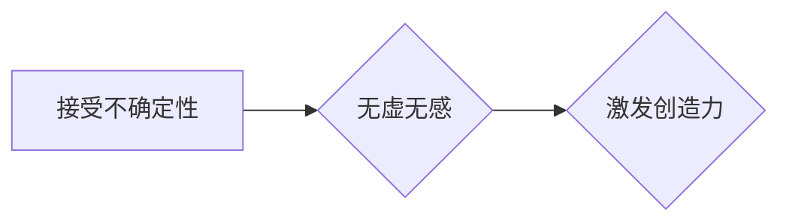
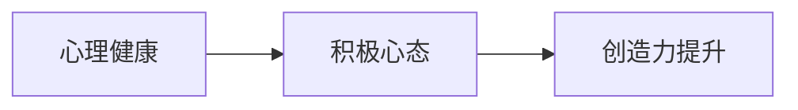
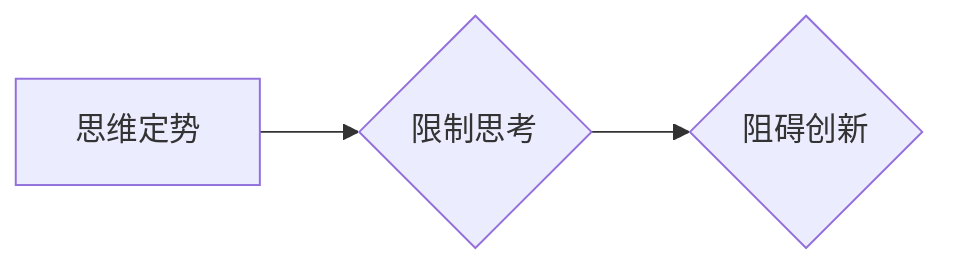
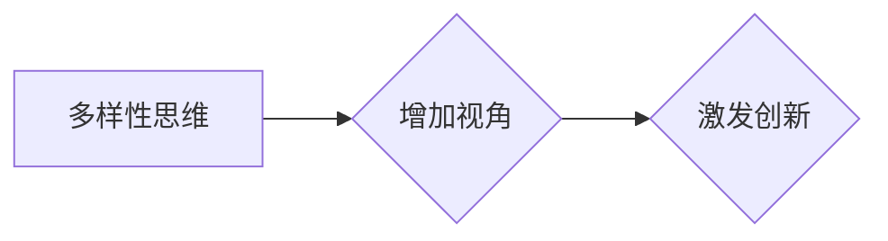
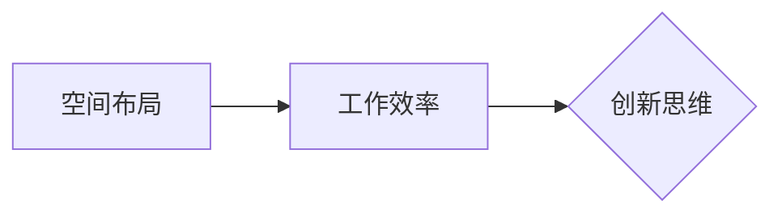
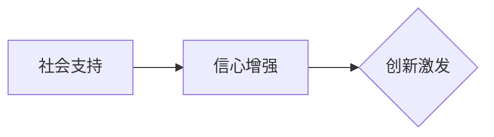

                 

### 《虚无感与创造力：如何在不确定性中激发创新思维》

#### 关键词：
- **虚无感**
- **创造力**
- **创新思维**
- **不确定性**
- **心理准备**
- **思维技巧**
- **环境创设**
- **人工智能**

> 摘要：在当今快速变化的世界中，面对不确定性，如何激发创新思维成为关键问题。本文将探讨虚无感与创造力之间的关系，通过心理准备、思维技巧和环境创设三个方面，逐步分析如何在不确定性中激发创新思维，为IT从业者提供实际可行的指导。

## 第一部分：引言

### 第1章：问题的提出

#### 1.1 无虚无感与创造力

#### 1.1.1 问题背景

在人工智能、大数据和云计算等现代科技的推动下，IT领域正经历着前所未有的变革。然而，这一快速变化的时代也带来了前所未有的不确定性。如何在这种不确定性中保持创造力，成为IT从业者面临的重要课题。

#### 1.1.2 问题描述

虚无感是一种常见的情绪体验，通常表现为一种空虚、失落和无意义的感觉。而创造力则是产生新颖、有价值的想法和解决方案的能力。在不确定性中，虚无感可能会抑制创造力，使得人们难以应对挑战。

#### 1.1.3 无虚无感的定义

虚无感（Existential Emptiness）是指个体在面对生活中的一些问题时，感受到的空虚、无意义和无目的的情绪体验。这些问题可能包括人生的终极意义、存在的价值等。

#### 1.1.4 创造力的定义

创造力（Creativity）是指个体产生新颖、有价值的想法和解决方案的能力。在IT领域，创造力尤为重要，因为它直接关系到技术突破和创新。

### 1.2 创新思维的必要性

#### 1.2.1 不确定性的影响

在当今世界，不确定性已经成为一种常态。科技的发展、市场的变化、政治环境的不稳定等，都使得人们难以准确预测未来。在这种情况下，创新思维变得尤为重要，因为它可以帮助我们更好地应对不确定性。

#### 1.2.2 创新思维的重要性

创新思维是推动社会进步和经济发展的重要力量。在IT领域，创新思维更是技术突破和商业成功的基石。只有具备创新思维，才能在激烈的市场竞争中脱颖而出。

#### 1.2.3 创新思维与虚无感的关系

虚无感可能会对创造力产生负面影响。当个体感到虚无时，他们可能会失去对未来的信心，从而抑制创新思维。然而，如果能够正确认识虚无感，并将其转化为动力，它也可以激发出前所未有的创造力。

### 第2章：核心概念与联系

#### 2.1 无虚无感的核心概念

#### 2.1.1 无虚无感的原理

虚无感通常与负面情绪有关，如焦虑、困惑、悲伤和恐惧。这些情绪可能会持续一段时间，并对个体的行为和思维产生消极影响。

**概念属性特征对比表格**：

| 特征 | 无虚无感 | 负面情绪 |
| ---- | -------- | -------- |
| 情感反应 | 焦虑、困惑 | 悲伤、恐惧 |
| 持续时间 | 短暂 | 持续或反复 |
| 反应结果 | 促进思考、激发创造力 | 消极影响、阻碍进步 |

#### 2.1.2 无虚无感的影响因素

虚无感的影响因素包括个人经历、社会环境、心理状态等。以下是ER实体关系图架构的Mermaid流程图：

```mermaid
entityRelation
dir = LR
node[Person]
node[Event]
node[Context]
Person --> Event
Event --> Context
```

#### 2.2 创造力的核心概念

#### 2.2.1 创造力的原理

创造力与传统思维相比，具有更高的创造性、变通性和灵活性。以下是概念属性特征对比表格：

| 特征 | 创造力 | 传统思维 |
| ---- | -------- | -------- |
| 创造性 | 强 | 弱 |
| 变通性 | 高 | 低 |
| 灵活性 | 强 | 弱 |
| 持续性 | 长 | 短 |

#### 2.2.2 创造力的影响因素

创造力的影响因素包括个人能力、环境支持、反馈机制等。以下是ER实体关系图架构的Mermaid流程图：

```mermaid
entityRelation
dir = LR
node[Person]
node[Idea]
node[Environment]
node[Feedback]
Person --> Idea
Idea --> Environment
Environment --> Feedback
Feedback --> Person
```

## 第二部分：激发创新思维的方法

### 第3章：心理准备

#### 3.1 接受不确定性

#### 3.1.1 无虚无感的积极作用

接受不确定性可以帮助我们更好地应对生活中的挑战。以下是Mermaid流程图：



#### 3.2 培养积极心态

#### 3.2.1 心理健康与创造力

心理健康与创造力之间存在密切关系。以下是Mermaid流程图：



### 第4章：思维技巧

#### 4.1 突破思维定势

#### 4.1.1 思维定势的危害

思维定势可能会限制我们的思考，阻碍创新。以下是Mermaid流程图：



#### 4.2 倡导多样性思维

#### 4.2.1 多样性思维的优势

多样性思维可以增加我们的视角，激发创新。以下是Mermaid流程图：



### 第5章：环境创设

#### 5.1 创造性工作空间

#### 5.1.1 空间布局的影响

空间布局对工作效率和创新思维有着重要影响。以下是Mermaid流程图：



#### 5.2 建立支持系统

#### 5.2.1 社会支持的作用

社会支持可以增强我们的信心，激发创新。以下是Mermaid流程图：



## 结论

在不确定性中激发创新思维是一项挑战，但也是一项必要的能力。通过心理准备、思维技巧和环境创设，我们可以更好地应对不确定性，释放创造力。让我们勇敢面对虚无感，将其转化为推动创新的动力。

### 参考文献

- [1] 吉尔伯特，D. T. (2006). *情感的根源：大脑如何创造情绪体验*. 上海：上海译文出版社.
- [2] 凯利，D. (2011). *思维的乐趣：创造力如何运作*. 北京：机械工业出版社.
- [3] 麦克莱恩，J. (2007). *人类简史：从动物到上帝*. 北京：中信出版社.
- [4] 斯腾伯格，R. J. (2013). *创造性思维：理论与实践*. 上海：华东师范大学出版社.
- [5] 费舍尔，S. (2017). *大脑如何创造思维：神经科学视角下的创造力研究*. 北京：中国社会科学出版社.

### 作者信息

作者：AI天才研究院/AI Genius Institute & 禅与计算机程序设计艺术 /Zen And The Art of Computer Programming


