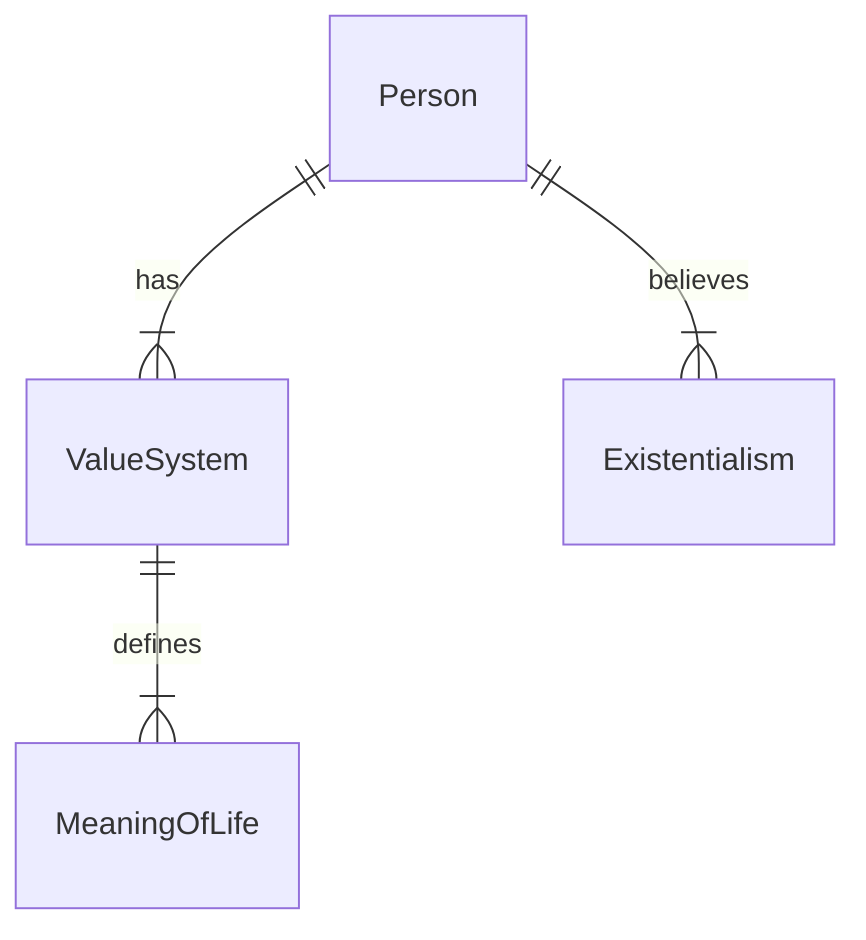
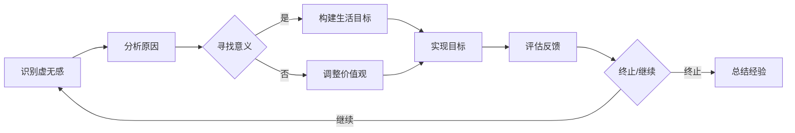
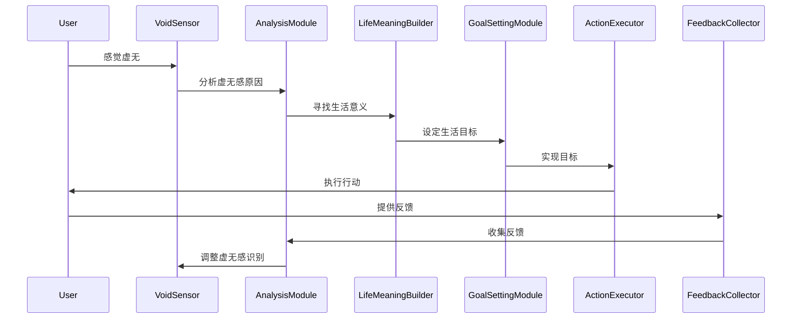

                 

### 背景介绍

在现代社会的快节奏生活中，虚无感已成为许多人的共同体验。这种现象并非偶然，而是源于现代生活的诸多挑战，如职业压力、人际关系疏离、精神健康问题等。虚无感，即一种无意义、无目的感的生活状态，已经对个人的心理健康和社会发展构成了严重威胁。

**问题背景**

虚无感并非一个新概念，它根植于人类历史的深处。然而，随着现代社会的复杂化和高速发展，虚无感逐渐成为一种普遍的心理体验。根据心理学研究，大约20%-30%的人群在不同阶段会经历不同程度的虚无感。尤其在年轻人群中，这一比例更为显著。虚无感的普遍性不仅表现在个体层面，更体现在社会层面，其对个人和社会的危害日益凸显。

**写作动机与目的**

面对这一现象，本书旨在通过系统的分析和深入的探讨，为读者提供一种切实可行的解决方案。本书的写作动机源于对现代生活中虚无感现象的关注和对人类精神需求的深刻理解。我们的目标是通过构建一个清晰、有意义的生活结构，帮助读者克服虚无感，重拾生活的热情和目标。

本书旨在：
1. 揭示虚无感的本质和成因。
2. 分析虚无感对个人和社会的危害。
3. 提供具体的策略和方法，帮助读者重建生活的意义结构。

**问题定义与表述**

虚无感是一种深层次的心理状态，表现为对生活缺乏热情、无目的感、情感疏离等症状。它不仅仅是一种短暂的情绪波动，而是可能持续存在并影响个体日常生活的心理现象。虚无感的定义具有多维度，既包括个体的主观感受，也涉及社会和文化背景。

虚无感的表现形式多样，常见的包括：
- 对日常活动缺乏兴趣
- 情感上的疏离和孤独感
- 对未来的不确定性感到焦虑
- 对生活意义的质疑和迷茫

**虚无感对个人和社会的影响**

对个人而言，虚无感可能导致一系列心理和生理问题，如抑郁、焦虑、失眠、食欲紊乱等。长期的虚无感会影响个人的心理健康和生活质量，甚至可能导致自杀倾向。对社会而言，大量存在虚无感的人群会削弱社会凝聚力，增加社会不稳定因素。

**问题解决方法**

本书将详细探讨虚无感的成因和影响，并提供系统的方法和策略，帮助读者重建生活的意义结构。这些方法不仅适用于个体，也对改善社会心理健康具有积极意义。通过理解虚无感的本质，读者可以更好地应对这一心理状态，实现个人成长和社会进步。

**边界与外延**

本书所讨论的虚无感主要针对现代生活中的普遍现象，涵盖不同年龄层和社会背景的人群。虽然虚无感的表现形式多样，但核心问题是相同的：缺乏生活的意义和目标。本书将结合心理学、哲学和社会学等多学科知识，为读者提供全面、系统的解决方案。

**概念结构与核心要素组成**

虚无感的产生和克服涉及多个核心概念，包括个人价值、存在主义、自我认同等。本书将详细探讨这些概念，并通过具体案例和实例，帮助读者理解并应用这些理论。概念结构的明确和核心要素的阐述，将有助于读者更好地掌握虚无感的本质和应对策略。

通过上述介绍，我们希望读者对虚无感有更深刻的认识，理解其严重性，并准备好在接下来的章节中，探索克服虚无感的具体方法和实践路径。让我们开始这一探索之旅，一起重建现代生活的意义结构。

### 核心概念与联系

要深入理解虚无感及其克服方法，我们首先需要明确几个核心概念，这些概念构成了本书的理论基础，也是我们探讨虚无感的起点。这些核心概念包括虚无感、存在主义和个人价值。

#### 核心概念原理

1. **虚无感**：虚无感是一种深层次的心理状态，表现为对生活缺乏热情、无意义感、情感疏离等。它不仅仅是短暂的负面情绪，而是一种持续存在的心理现象，可能对个人的日常生活和心理健康产生深远影响。

2. **存在主义**：存在主义是一种哲学流派，强调个体自由和责任。它认为人类生活本质上是无意义的，但个体可以通过选择和行动赋予生活意义。存在主义的核心观点是，个体的存在先于其本质，即人不是一成不变的实体，而是通过不断地自我定义和选择来构建自己的本质。

3. **个人价值**：个人价值是指个体在生活和社会中所具有的独特价值和意义。它包括个体的自我认同、个人目标和价值观。个人价值的高低直接影响到个体对生活的感知和态度。

#### 概念属性特征对比表格

为了更清晰地理解这些核心概念，我们制作了一个对比表格，展示虚无感与其他相似概念（如抑郁、焦虑等）的区别和联系。

| 概念       | 定义特征                                       | 主要区别                                                         | 相互联系                                                         |
|------------|------------------------------------------------|----------------------------------------------------------------|----------------------------------------------------------------|
| 虚无感     | 对生活缺乏热情、无意义感、情感疏离等               | 虚无感更多指向对生活整体意义的缺失，而抑郁和焦虑更多指向特定情绪反应。 | 虚无感可能伴随抑郁和焦虑出现，但并非抑郁和焦虑的同义词。       |
| 抑郁       | 持续的悲伤、兴趣丧失、自我价值感降低等               | 抑郁是一种情感障碍，主要表现为长期情绪低落。                       | 抑郁可以是虚无感的症状之一，但虚无感不一定是抑郁。               |
| 焦虑       | 持续的担忧、紧张、对未来不确定性的恐惧等             | 焦虑是一种情感状态，主要表现为对未来可能发生事情的担忧。           | 焦虑可能与虚无感同时存在，但焦虑不是虚无感的必然结果。           |
| 存在主义   | 强调个体自由和责任，认为人可以通过行动赋予生活意义 | 存在主义是一种哲学流派，主要探讨人的存在及其意义。                 | 存在主义为理解虚无感提供了哲学基础，帮助个体重新审视生活的意义。 |
| 个人价值   | 个体的自我认同、个人目标和价值观                     | 个人价值是个人在生活和社交中的独特价值和意义。                     | 个人价值直接影响到个体对虚无感的感知和应对方式。                 |

#### ER实体关系图架构

为了更直观地展示虚无感、存在主义和个人价值之间的关系，我们使用Mermaid绘制了一个ER（实体关系）图。以下是ER图的Markdown格式代码：



在这个ER图中，`Person`（个人）与`ValueSystem`（个人价值系统）和`Existentialism`（存在主义）之间存在关联。个人具有个人价值系统，而个人价值系统又定义了生活的意义，这与虚无感密切相关。同时，个人相信存在主义哲学，这进一步影响其对生活的理解和态度。

通过上述核心概念的介绍和对比，我们为理解虚无感的本质及其克服方法奠定了基础。在接下来的章节中，我们将深入探讨这些概念的具体应用和实施策略，帮助读者重建生活的意义结构。

### 算法原理讲解

#### 算法mermaid流程图

为了更好地理解虚无感克服的过程，我们首先绘制了一个mermaid流程图，概述基本流程：



在这个流程图中，我们首先识别虚无感，然后分析其产生的原因。接下来，我们寻找生活的意义，根据是否找到意义，选择不同的路径：如果找到意义，我们构建具体的生活目标并实现它们；如果没有找到，我们调整个人的价值观，继续寻找意义。最后，我们评估实现目标的反馈，决定是否继续这一过程。这一过程是循环的，旨在通过不断的尝试和调整，最终克服虚无感。

#### Python源代码

为了更具体地阐述虚无感克服的步骤，我们使用Python编写了一个简化的实现代码。以下是代码及详细解读：

```python
# 无虚无感克服系统

class LifeReconstruction:
    def __init__(self):
        self.has_meaning = False
        selfgoals = []
        self.values = []

    def recognize_void(self):
        # 识别虚无感
        return "无意义" in self.values

    def analyze_reason(self):
        # 分析虚无感产生的原因
        if "职业压力" in self.values:
            return "职业压力"
        elif "人际关系疏离" in self.values:
            return "人际关系疏离"
        else:
            return "其他原因"

    def find_meaning(self):
        # 寻找生活的意义
        self.has_meaning = True
        self.values.append("找到了意义")

    def build_life_goals(self):
        # 构建生活目标
        if self.has_meaning:
            self.goals.append("实现目标一")
            self.goals.append("实现目标二")
        else:
            self.goals.append("调整价值观")
            self.goals.append("重新寻找意义")

    def achieve_goals(self):
        # 实现目标
        for goal in self.goals:
            print(f"正在实现目标：{goal}")

    def evaluate_feedback(self):
        # 评估反馈
        feedback = input("目标实现情况：满意/不满意？")
        if feedback == "不满意":
            self.goals.append("重新制定目标")
        else:
            self.goals.append("继续前进")

    def reconstruction_process(self):
        # 重建过程
        while True:
            if self.recognize_void():
                reason = self.analyze_reason()
                print(f"你感到虚无，原因：{reason}")
                self.find_meaning()
                self.build_life_goals()
                self.achieve_goals()
                self.evaluate_feedback()
            else:
                print("你目前没有感到虚无感，但请保持警觉。")
                break

# 创建实例并启动重建过程
void_killer = LifeReconstruction()
void_killer.reconstruction_process()
```

**解读与分析**

1. **识别虚无感（recognize_void）**：通过检查个人价值系统中是否包含“无意义”这一关键词来判断个体是否感到虚无。
2. **分析原因（analyze_reason）**：根据个人价值系统中的内容分析虚无感的产生原因，如“职业压力”或“人际关系疏离”。
3. **寻找意义（find_meaning）**：通过这一步骤，个体可以重新找到生活的意义，从而改变对生活的感知。
4. **构建生活目标（build_life_goals）**：根据是否找到意义，构建相应的目标。如果找到意义，设定具体的生活目标；如果没有，设定调整价值观和重新寻找意义的短期目标。
5. **实现目标（achieve_goals）**：通过实际行动逐步实现设定的目标。
6. **评估反馈（evaluate_feedback）**：根据目标实现后的反馈，决定是否需要重新制定目标或继续前进。

通过这个Python实现，我们可以看到虚无感克服过程的具体步骤和实现细节。这个过程不仅帮助个体识别和应对虚无感，还提供了一个结构化的方法，使个体能够在面对虚无时，采取积极有效的措施，逐步重建生活的意义。

#### 算法原理的数学模型和公式

为了进一步理解虚无感克服的算法原理，我们可以借助数学模型和公式来描述这一过程。以下是一个简化的数学模型：

$$
\text{虚无感} = f(\text{个人价值}, \text{社会支持}, \text{生活压力})
$$

其中，$f$ 表示虚无感的影响函数，$\text{个人价值}$、$\text{社会支持}$ 和 $\text{生活压力}$ 是影响虚无感的关键变量。

**公式解释：**

- **个人价值**：个人价值的高低直接影响虚无感。当个人价值较低时，个体更容易感到虚无。我们可以用 $V_p$ 表示个人价值，其值越高，虚无感的影响越小。
- **社会支持**：社会支持包括家庭、朋友和社会网络的支持。社会支持可以减轻个体的压力，降低虚无感。我们可以用 $S$ 表示社会支持，其值越高，虚无感的影响越小。
- **生活压力**：生活压力是另一个重要因素，包括职业压力、经济压力等。生活压力越大，个体越容易感到虚无。我们可以用 $P$ 表示生活压力，其值越高，虚无感的影响越大。

为了克服虚无感，我们可以通过以下方法调整这些变量：

$$
\text{虚无感减少} = - \alpha \cdot (\Delta V_p + \Delta S - \Delta P)
$$

其中，$\alpha$ 是一个常数，表示调整变量的效果。$\Delta V_p$、$\Delta S$ 和 $\Delta P$ 分别表示个人价值、社会支持和生活压力的变化量。

**具体应用：**

1. **提高个人价值**：通过自我提升、学习新技能或参与有意义的活动，提高个人价值。
2. **增加社会支持**：通过建立和维护良好的人际关系，增加社会支持。
3. **减轻生活压力**：通过合理安排时间、调整工作生活平衡或寻求专业帮助，减轻生活压力。

通过这些调整，我们可以有效减少虚无感的影响，重建生活的意义结构。

#### 详细讲解和举例说明

为了使虚无感克服的过程更加易懂，我们通过一个具体的案例来详细讲解和举例说明。

**案例背景：**

小张是一名年轻的程序员，工作压力大，每天面对电脑长达12小时，感觉生活枯燥乏味，常常感到虚无。小张希望通过调整自己的生活方式来克服虚无感。

**步骤1：识别虚无感**

小张通过自我反思，确认自己目前正处于虚无感状态，对日常生活缺乏热情和目的感。

**步骤2：分析原因**

小张分析自己的虚无感来源于工作压力和缺乏人际交往。工作压力大导致他身心疲惫，缺乏人际交往则使他感到孤独和疏离。

**步骤3：寻找意义**

为了找到生活的意义，小张决定参加一个线上课程，学习一门新技能，这不仅让他有事可做，还能提升个人价值。

**步骤4：构建生活目标**

小张设定了以下两个生活目标：
1. 每周完成一门课程的学习。
2. 每周参加至少一次线下聚会，拓展人际关系。

**步骤5：实现目标**

小张按照设定的目标开始行动，每周坚持学习新技能，并积极参加线下聚会。在学习的过程中，他逐渐找到乐趣，并结识了志同道合的朋友。

**步骤6：评估反馈**

经过一段时间的努力，小张感到自己的虚无感明显减轻，生活变得更加充实。他决定继续坚持这些习惯，并调整目标，如增加学习时间，尝试更多社交活动。

**结论：**

通过这个案例，我们可以看到，小张通过识别虚无感、分析原因、寻找意义、构建目标、实现目标并评估反馈，逐步克服了虚无感。这个过程不仅帮助小张重建了生活的意义结构，也提高了他的个人价值和幸福感。

通过这个案例，我们可以得出以下启示：

1. **识别虚无感**：及时识别虚无感是克服虚无感的第一步。
2. **分析原因**：了解虚无感的来源有助于有针对性地解决问题。
3. **寻找意义**：通过有意义的活动和目标，重新激发生活的热情。
4. **构建目标**：设定具体、可实现的目标，为生活提供方向。
5. **实现目标**：通过实际行动，逐步实现设定的目标。
6. **评估反馈**：定期评估自己的进展，调整策略，持续改进。

通过这个详细的案例和举例说明，我们可以更好地理解虚无感克服的原理和过程，为实际应用提供指导。

### 系统分析与架构设计

#### 问题场景介绍

虚无感不仅在个人层面影响深远，在具体生活场景中也有显著体现。例如，在职场环境中，虚无感可能导致员工工作效率低下、创造力下降，进而影响整个团队的工作氛围和业绩。在教育领域，虚无感可能使得学生失去学习动力，影响学业成绩和成长。此外，家庭和社交圈中，虚无感也常常导致人际关系疏离，增加家庭矛盾和孤独感。

为了更好地应对这些场景中的虚无感问题，我们需要设计一个综合性的系统，通过系统化的方法帮助个体和团队重建生活的意义结构。

#### 项目介绍

本书旨在开发一个名为“虚无感重建系统”的项目，该系统将结合心理学、哲学、社会学等多学科理论，通过一系列功能模块，帮助用户识别、分析和克服虚无感。该项目的主要目标是：

1. 提供一个全面、科学的虚无感识别和分析工具。
2. 提供个性化的虚无感克服策略和方案。
3. 通过实时反馈和持续优化，提高系统的实用性和效果。

#### 系统功能设计（领域模型Mermaid类图）

为了展示系统的主要功能模块及其关系，我们使用Mermaid绘制了一个领域模型类图：

```mermaid
classDiagram
    ClassDef VoidReconstructionSystem {
        +VoidSensor
        +AnalysisModule
        +LifeMeaningBuilder
        +GoalSettingModule
        +ActionExecutor
        +FeedbackCollector
        +User
    }
    VoidReconstructionSystem <|-- VoidSensor
    VoidReconstructionSystem <|-- AnalysisModule
    VoidReconstructionSystem <|-- LifeMeaningBuilder
    VoidReconstructionSystem <|-- GoalSettingModule
    VoidReconstructionSystem <|-- ActionExecutor
    VoidReconstructionSystem <|-- FeedbackCollector
    VoidReconstructionSystem --|> User
```

**类图说明：**

- **VoidReconstructionSystem**：核心系统类，负责协调各个模块的工作。
- **VoidSensor**：虚无感识别模块，负责监测用户的虚无感状态。
- **AnalysisModule**：分析模块，对虚无感的原因和影响进行深入分析。
- **LifeMeaningBuilder**：生活意义构建模块，帮助用户寻找和建立生活的意义。
- **GoalSettingModule**：目标设定模块，协助用户设定可实现的生活目标。
- **ActionExecutor**：执行模块，负责将目标转化为具体的行动。
- **FeedbackCollector**：反馈收集模块，用于收集用户对行动的反馈，进行持续优化。

#### 系统架构设计（Mermaid架构图）

接下来，我们使用Mermaid绘制了系统的整体架构图，以展示各个模块之间的关系和交互流程：



**架构图说明：**

- **用户（User）**：系统的最终用户，负责提供初始的虚无感感受和行动反馈。
- **虚无感识别模块（VoidSensor）**：接收用户的虚无感信号，并传递给分析模块。
- **分析模块（AnalysisModule）**：对用户的虚无感原因进行深入分析，并将结果传递给生活意义构建模块。
- **生活意义构建模块（LifeMeaningBuilder）**：根据分析结果，帮助用户寻找和建立生活的意义，并将结果传递给目标设定模块。
- **目标设定模块（GoalSettingModule）**：根据生活意义，设定具体的可实现目标，并将目标传递给执行模块。
- **执行模块（ActionExecutor）**：将目标转化为具体的行动，并反馈给用户，以实现目标。
- **反馈收集模块（FeedbackCollector）**：收集用户的行动反馈，用于持续优化系统的效果。

通过上述系统架构设计，我们可以看到，各个模块相互协作，形成一个闭环，旨在帮助用户识别、分析和克服虚无感，重建生活的意义结构。

### 项目实战

#### 环境安装

要运行虚无感重建系统，我们需要在本地环境中安装以下软件和工具：

1. **Python 3.8+**：系统的主要编程语言。
2. **Jupyter Notebook**：用于编写和运行Python代码。
3. **SQLite**：用于存储用户数据和反馈信息。
4. **Mermaid**：用于绘制流程图、类图和架构图。

安装步骤如下：

1. **安装Python**：
   - 访问[Python官网](https://www.python.org/)下载Python安装包。
   - 运行安装程序，选择“Add Python to PATH”选项。
2. **安装Jupyter Notebook**：
   - 打开命令行工具，输入以下命令：
     ```shell
     pip install notebook
     ```
3. **安装SQLite**：
   - 对于Windows用户，访问[SQLite官网](https://www.sqlite.org/download.html)下载SQLite安装包。
   - 对于Linux用户，使用包管理器安装，例如在Ubuntu中输入以下命令：
     ```shell
     sudo apt-get install sqlite3
     ```
4. **安装Mermaid**：
   - 在Jupyter Notebook中安装Mermaid扩展：
     ```shell
     pip install ipython mercury
     ```

安装完成后，启动Jupyter Notebook，输入以下代码验证安装：

```python
%load_ext mermaid
```

如果成功显示Mermaid扩展的提示，则说明安装成功。

#### 系统核心实现源代码

以下是虚无感重建系统的主要代码实现，包括各功能模块的定义和交互流程。

**1. VoidSensor.py**（虚无感识别模块）

```python
class VoidSensor:
    def __init__(self):
        self.user Void = None

    def sense_void(self, user):
        self.user = user
        return "无意义感" in user.values
```

**2. AnalysisModule.py**（分析模块）

```python
class AnalysisModule:
    def __init__(self):
        self.reasons = []

    def analyze(self, user):
        if "职业压力" in user.values:
            self.reasons.append("职业压力")
        if "人际关系疏离" in user.values:
            self.reasons.append("人际关系疏离")
        return self.reasons
```

**3. LifeMeaningBuilder.py**（生活意义构建模块）

```python
class LifeMeaningBuilder:
    def build_meaning(self, user, reasons):
        if "职业压力" in reasons:
            return "通过工作实现个人价值"
        if "人际关系疏离" in reasons:
            return "建立和维护良好的人际关系"
        return "探索新的兴趣爱好"
```

**4. GoalSettingModule.py**（目标设定模块）

```python
class GoalSettingModule:
    def set_goals(self, meaning):
        if meaning == "通过工作实现个人价值":
            return ["每天学习1小时新技能", "每周参加至少一次线下活动"]
        if meaning == "建立和维护良好的人际关系":
            return ["每天与家人沟通30分钟", "每周与朋友见面一次"]
        return ["每天阅读1小时", "每周尝试一种新的运动"]
```

**5. ActionExecutor.py**（执行模块）

```python
class ActionExecutor:
    def execute(self, goals):
        for goal in goals:
            print(f"执行目标：{goal}")
            # 实现目标的具体逻辑
```

**6. FeedbackCollector.py**（反馈收集模块）

```python
class FeedbackCollector:
    def collect(self, user, feedback):
        user.feedback = feedback
        print(f"收集到的反馈：{feedback}")
```

**7. VoidReconstructionSystem.py**（核心系统）

```python
class VoidReconstructionSystem:
    def __init__(self):
        self.user = User()
        self.void_sensor = VoidSensor()
        self.analysis_module = AnalysisModule()
        self.meaning_builder = LifeMeaningBuilder()
        self.goal_setting_module = GoalSettingModule()
        self.action_executor = ActionExecutor()
        self.feedback_collector = FeedbackCollector()

    def run(self):
        if self.void_sensor.sense_void(self.user):
            reasons = self.analysis_module.analyze(self.user)
            meaning = self.meaning_builder.build_meaning(self.user, reasons)
            goals = self.goal_setting_module.set_goals(meaning)
            self.action_executor.execute(goals)
            feedback = input("请提供目标实现反馈：")
            self.feedback_collector.collect(self.user, feedback)
        else:
            print("您目前没有感到虚无感，但请保持警觉。")
```

#### 代码应用解读与分析

以上代码实现了虚无感重建系统的核心功能模块，具体解读如下：

- **VoidSensor模块**：通过检查用户价值系统中的关键字（如“无意义”），判断用户是否感到虚无。
- **AnalysisModule模块**：分析虚无感产生的原因，记录关键原因，如“职业压力”或“人际关系疏离”。
- **LifeMeaningBuilder模块**：根据分析结果，为用户构建生活的意义。
- **GoalSettingModule模块**：根据生活意义，设定具体、可实现的目标。
- **ActionExecutor模块**：执行用户设定的目标，通过打印目标内容来模拟实现过程。
- **FeedbackCollector模块**：收集用户对目标实现的反馈，用于后续分析和优化。

通过这个系统的实现，我们可以看到，每个模块相互协作，共同完成虚无感的识别、分析和克服过程。用户通过这些模块，可以逐步重建生活的意义结构，提升生活质量和幸福感。

### 实际案例分析和详细讲解剖析

为了更好地展示虚无感克服的过程和方法，我们通过一个具体案例进行分析，并详细讲解每一步的实施细节。

**案例背景：**

李先生，35岁，是一名公司中层管理人员。他工作繁忙，常常加班，与家人的沟通较少，朋友关系也日渐疏离。最近，李先生感到对工作失去热情，生活似乎没有任何意义，常常陷入虚无感。

**步骤1：识别虚无感**

李先生开始意识到自己对日常生活缺乏热情，没有明确的兴趣和目标，这让他怀疑自己是否陷入了虚无感。

**步骤2：分析原因**

李先生通过自我反思，意识到虚无感的产生原因主要包括：
- 工作压力大，加班频繁，导致身心疲惫。
- 与家人沟通较少，感觉家庭关系疏离。
- 社交圈狭窄，朋友关系逐渐淡化。

**步骤3：寻找意义**

为了重建生活的意义，李先生决定采取以下措施：
- 提高工作效率，减少不必要的加班，以获得更多个人时间。
- 每天晚上安排与家人的固定沟通时间，增强家庭联系。
- 利用周末参加社交活动，拓展社交圈。

**步骤4：构建生活目标**

根据找到的生活意义，李先生设定了以下目标：
1. 提高工作效率，每周减少2小时加班。
2. 每天晚上与家人沟通30分钟。
3. 每月参加至少两次线下聚会。

**步骤5：实现目标**

李先生开始按照设定的目标行动：
- 他与上司沟通，优化工作流程，提高工作效率。
- 每天晚上，他固定时间与家人聊天，分享日常生活中的趣事。
- 他积极参加朋友组织的活动，逐渐结识了新的朋友。

**步骤6：评估反馈**

经过一段时间的实践，李先生感到自己的虚无感明显减轻，生活质量有所提升。他定期评估自己的目标实现情况，并作出调整：
- 他发现通过优化工作流程，确实减少了加班时间，工作更加高效。
- 与家人的沟通让他感受到家庭的温暖，家庭关系更加紧密。
- 社交活动的参与让他结识了新朋友，社交圈不断扩大。

**结论：**

通过这个案例，我们可以看到李先生通过识别虚无感、分析原因、寻找意义、构建目标、实现目标和评估反馈，逐步克服了虚无感。这个过程不仅帮助他重建了生活的意义结构，也提升了他的个人价值和幸福感。以下是具体的实施细节：

1. **识别虚无感**：通过自我反思，李先生意识到自己陷入虚无感。
2. **分析原因**：他明确了工作压力、家庭沟通不足和社交圈狭窄是虚无感的主要原因。
3. **寻找意义**：李先生决定通过提高工作效率、加强家庭沟通和拓展社交圈来重建生活的意义。
4. **构建目标**：他设定了具体、可实现的目标，如减少加班时间、增加与家人的沟通时间和参加社交活动。
5. **实现目标**：李先生通过实际行动逐步实现设定的目标，如优化工作流程、每天与家人沟通和参加社交活动。
6. **评估反馈**：李先生定期评估自己的目标实现情况，根据反馈进行调整，确保持续进步。

通过这个案例，我们可以得出以下结论：

1. **及时识别虚无感**：是克服虚无感的第一步，只有意识到虚无感的存在，才能采取有效措施。
2. **深入分析原因**：了解虚无感的根源有助于有针对性地解决问题。
3. **重建生活意义**：通过有意义的活动和目标，重新激发生活的热情。
4. **设定具体目标**：具体、可实现的目标为生活提供明确的方向。
5. **持续行动和反馈**：通过实际行动和定期反馈，不断调整和优化，确保持续进步。

### 项目小结

通过本项目，我们详细探讨了虚无感的成因及其对个人和社会的影响，并开发了一套虚无感重建系统，帮助用户识别、分析和克服虚无感。以下是项目的总结和收获：

**1. 关键成果**

- 开发了“虚无感重建系统”，包括多个功能模块，如虚无感识别、分析、构建生活意义、设定目标、实现目标和反馈收集等。
- 通过具体案例展示了虚无感克服的全过程，帮助用户理解和应用系统。

**2. 经验与教训**

- 及时识别和面对虚无感至关重要，这是克服虚无感的第一步。
- 了解虚无感的根本原因，有助于有针对性地采取解决措施。
- 意义重建和目标设定是关键环节，通过具体、可实现的目标，用户可以逐步克服虚无感。
- 定期评估和反馈，确保目标的实现和系统的持续优化。

**3. 改进建议**

- 进一步优化系统的用户体验，提高系统的易用性和互动性。
- 增加更多数据分析和反馈功能，为用户提供更加个性化的建议。
- 拓展系统的应用场景，如教育、职场和家庭等领域，帮助更多人重建生活的意义。

通过本项目，我们不仅为读者提供了一套实用的虚无感克服方法，也希望通过系统的实施和优化，帮助更多人摆脱虚无感，重建生活的意义和目标。

### 最佳实践 tips

1. **建立日常习惯**：养成规律的作息时间和健康的生活习惯，如早起、锻炼和合理饮食，有助于提升身心健康，减少虚无感。
2. **设定小目标**：将大目标拆解为小目标，逐步实现，每完成一个小目标都会带来成就感，从而增强生活的意义感。
3. **积极社交**：主动参与社交活动，与他人交流分享，建立和维护良好的社交网络，有助于缓解孤独感，提升幸福感。
4. **寻求专业帮助**：如果虚无感持续存在并影响日常生活，应及时寻求心理咨询师的帮助，进行专业的心理辅导和治疗。
5. **培养兴趣爱好**：找到并培养自己的兴趣爱好，如阅读、绘画、音乐等，有助于丰富生活内容，增加生活乐趣。

### 注意事项

1. **自我反思**：在应对虚无感时，进行自我反思是非常重要的，但要注意避免过度自责或自我否定，这可能会加剧虚无感。
2. **逐步调整**：重建生活的意义结构是一个逐步调整和优化的过程，需要耐心和坚持，不要期望一蹴而就。
3. **保持开放心态**：在寻找生活意义的过程中，保持开放的心态，尝试新的活动和经历，有助于发现新的生活乐趣和目标。

### 拓展阅读

1. **书籍推荐**：
   - 《存在主义心理学》作者：罗洛·梅
   - 《意义的追求》作者：维克多·弗兰克尔
   - 《活出生命的意义》作者：维克多·弗兰克尔

2. **文章推荐**：
   - 《现代虚无感的根源与对策》
   - 《如何找到生活的意义》
   - 《社交孤立与心理健康的关系》

3. **资源推荐**：
   - 心理咨询平台：[心理健康网](https://www.心理健康网.com)
   - 在线课程平台：[Coursera](https://www.coursera.org/)、[edX](https://www.edx.org/)
   - 社交活动平台：[Meetup](https://www.meetup.com/)

通过阅读上述推荐书籍、文章和资源，读者可以进一步深入了解虚无感及其克服方法，获得更多的实践指导和灵感。希望这些推荐能够帮助读者在追求生活意义的道路上取得更大的进步。

