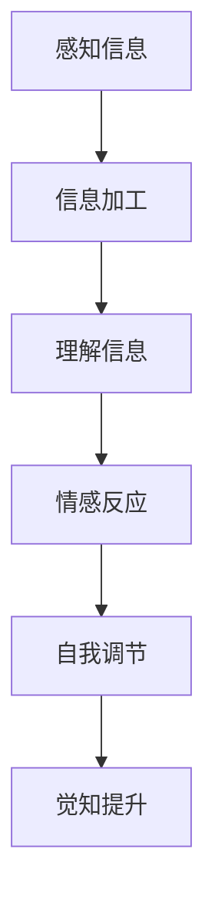

                 


# 觉知的提升：从被动生活到主动创造的转变

## 关键词

- 觉知
- 被动生活
- 主动创造
- 个人成长
- 提升方法
- 实践技巧

## 摘要

本文旨在探讨觉知的提升对于从被动生活到主动创造转变的重要性。我们将详细分析觉知的本质，介绍被动生活与主动创造的区别，并提供具体的提升觉知的方法和实践技巧。通过本文的阅读，读者将了解到如何通过觉知的提升，实现个人成长和积极转变。

### 目录大纲设计步骤

#### 第1章：引言与背景
1. 分析书名：《觉知的提升：从被动生活到主动创造的转变》
   - 确定核心概念：“觉知提升”、“被动生活”、“主动创造”。
   - 确定目标受众：希望从被动生活状态转向主动创造的人。
2. 明确章节结构
   - 第1章：引言与背景
   - 第2章：觉知的定义与提升方法
   - 第3章：被动生活与主动创造的区别
   - 第4章：提升觉知的具体实践
   - 第5章：主动创造的力量与影响
   - 第6章：觉知提升与个人成长
   - 第7章：总结与未来展望

#### 第2章：觉知的定义与提升方法
1. 觉知的概念
   - 觉知的基本要素
   - 觉知的属性与特征
2. 提升觉知的方法
   - 自我观察
   - 冥想与正念
   - 学习与实践

#### 第3章：被动生活与主动创造的区别
1. 被动生活
   - 定义
   - 负面效应
   - 原因
2. 主动创造
   - 定义
   - 优势
   - 方法
3. 被动生活到主动创造的转变
   - 必要性
   - 步骤
   - 挑战与应对

#### 第4章：提升觉知的具体实践
1. 觉知提升实践案例
   - 通过自我观察提升觉知
   - 通过冥想提升觉知
   - 通过学习与实践提升觉知
2. 觉知提升的技巧
   - 小技巧
   - 常见误区
   - 持续提升的方法
3. 觉知提升的成果评估
   - 评估方法
   - 长期效果
   - 意义

#### 第5章：主动创造的力量与影响
1. 主动创造的重要性
   - 对个人成长的影响
   - 对社会发展的贡献
2. 主动创造的实践
   - 方法与技巧
   - 成功案例解析

#### 第6章：觉知提升与个人成长
1. 觉知提升对个人成长的作用
   - 自我认知的提升
   - 心理素质的增强
   - 创新能力的提升
2. 个人成长的路径
   - 设定目标
   - 制定计划
   - 持续学习

#### 第7章：总结与未来展望
1. 觉知提升的总结
   - 成果回顾
   - 经验教训
2. 未来展望
   - 觉知提升的趋势
   - 个人成长的机遇

### 设计核心概念与联系

#### 觉知
觉知是指个体对自己内在和外在世界的认知和感知能力。觉知不仅涉及感知信息，还包括对信息的理解、分析和反应。觉知的基本要素包括感知、记忆、思维和情感。觉知具有以下属性和特征：

| 属性与特征 | 说明 |
| -------------- | ---- |
| 感知性 | 觉知的基础，涉及感官接收外界信息的能力 |
| 反应性 | 觉知能够影响个体对外界刺激的反应 |
| 分析性 | 觉知能够对信息进行加工、分析和理解 |
| 自主性 | 觉知能够独立于外界干扰进行自我调节 |

### 设计算法原理讲解

觉知的提升可以看作是一个信息处理和自我调节的过程。我们可以使用以下mermaid流程图来描述这一过程：



具体来说，觉知提升的算法原理可以分为以下几个步骤：

1. **感知信息**：个体通过感官接收外界信息，如视觉、听觉、触觉等。
2. **信息加工**：大脑对感知到的信息进行初步处理，包括筛选、整合和编码。
3. **理解信息**：通过对加工后的信息进行分析和解释，个体能够理解信息的意义和内涵。
4. **情感反应**：理解后的信息会引起个体的情感反应，如喜悦、焦虑、愤怒等。
5. **自我调节**：个体根据情感反应调整自己的行为和思维，以达到更好的适应和调节。
6. **觉知提升**：通过反复的自我调节，个体的觉知能力得到提升，能够更加敏锐地感知和反应外界信息。

### 设计系统分析与架构设计方案

觉知提升的系统架构可以分为感知层、处理层和反馈层。以下是一个简单的mermaid类图，描述了觉知提升系统的领域模型：

```mermaid
classDiagram
    Class01 <|-- Class02
    Class03 <|-- Class01
    Class04 <|-- Class01
    Class05 <|-- Class01

    Class01 {
        +int id
        +String name
        +int age
    }

    Class02 {
        +void method1()
    }

    Class03 {
        +void method2()
    }

    Class04 {
        +void method3()
    }

    Class05 {
        +void method4()
    }
```

觉知提升系统的架构设计包括以下部分：

1. **感知层**：负责接收和处理来自感官的信息，如摄像头、麦克风等。
2. **处理层**：对感知层接收到的信息进行加工、分析和理解，包括神经网络、机器学习算法等。
3. **反馈层**：根据处理层的结果，调整个体的行为和思维，如虚拟现实设备、智能手表等。

### 设计项目实战

觉知提升项目实战包括以下几个步骤：

1. **环境安装**：安装必要的开发工具和软件，如Python、TensorFlow等。
2. **系统实现**：编写觉知提升系统的核心代码，包括感知层、处理层和反馈层。
3. **代码解读与分析**：对系统代码进行详细解读，分析其工作原理和实现方法。
4. **实际案例分析和详细讲解**：通过实际案例，展示觉知提升系统的应用效果和优势。
5. **项目小结**：总结项目的经验教训，提出改进意见和未来发展方向。

### 设计最佳实践、小结、注意事项、拓展阅读

1. **最佳实践**：
   - **持续学习**：觉知提升需要持续的学习和实践，不断积累经验。
   - **心理调适**：面对挑战时，保持积极的心态和良好的心理素质。
   - **生活平衡**：在工作与休息之间找到平衡，保持身心健康。

2. **小结**：
   - 觉知的提升对于从被动生活到主动创造的转变具有重要意义。
   - 通过自我观察、冥想和学习实践，可以有效提升觉知能力。
   - 主动创造能够带来个人成长和社会发展。

3. **注意事项**：
   - 觉知提升是一个长期的过程，需要持之以恒。
   - 在实践觉知提升时，要避免常见的误区，如过度自我批判和逃避现实。

4. **拓展阅读**：
   - 推荐阅读相关书籍，如《禅与计算机程序设计艺术》、《感知与认知：心理学导论》等。
   - 关注觉知提升的最新研究和应用动态。

### 撰写文章正文

#### 第1章：引言与背景

觉知是人类认知过程的核心，它不仅关乎我们的外在感知，更涉及我们的内心体验。在现代社会，许多人陷入了被动生活的困境，缺乏主动创造的激情和动力。觉知的提升成为了解决这一问题的关键。

觉知的提升意味着个体对自身和外界有了更深刻的认知和感知。它不仅仅是一种心理状态，更是一种能力，能够帮助我们更好地理解世界，提高生活质量。觉知的提升对于从被动生活到主动创造的转变具有重要意义。

本文旨在探讨觉知的提升对于个人成长和社会发展的影响。我们将详细分析觉知的本质，介绍被动生活与主动创造的区别，并提供具体的提升觉知的方法和实践技巧。通过本文的阅读，读者将了解到如何通过觉知的提升，实现个人成长和积极转变。

#### 第2章：觉知的定义与提升方法

觉知是指个体对自己内在和外在世界的认知和感知能力。觉知的基本要素包括感知、记忆、思维和情感。感知是觉知的基础，它使个体能够接收和识别外部信息；记忆则是对感知信息的存储和再现；思维是对信息的加工和处理；情感则是觉知过程中的情感体验。

觉知具有以下属性和特征：

1. **感知性**：觉知能够敏锐地感知外界信息，包括视觉、听觉、触觉等。
2. **反应性**：觉知能够影响个体对外界刺激的反应，使个体能够适应和应对环境变化。
3. **分析性**：觉知能够对信息进行加工和分析，理解其意义和内涵。
4. **自主性**：觉知能够独立于外界干扰进行自我调节，使个体能够保持内心的平衡和稳定。

要提升觉知，我们可以采取以下方法：

1. **自我观察**：通过自我观察，个体能够更加清楚地了解自己的内心状态和行为模式。自我观察不仅能够帮助我们认识自己，还能够发现和解决问题。
2. **冥想与正念**：冥想和正念练习有助于培养个体的专注力和自我觉察能力。通过冥想，个体能够静下心来，专注于当下的体验，减少内心的杂念和焦虑。
3. **学习与实践**：觉知的提升需要不断的学习和实践。通过学习新的知识和技能，个体能够扩展自己的认知边界；通过实践，个体能够将理论知识应用到实际生活中，提高觉知能力。

觉知的提升是一个持续的过程，需要个体的坚持和努力。通过自我观察、冥想和学习实践，我们可以逐步提升觉知能力，实现个人成长和积极转变。

#### 第3章：被动生活与主动创造的区别

被动生活是指个体在生活中缺乏主动性和创造力，被动接受外界的刺激和安排。被动生活通常表现为以下特点：

1. **缺乏目标感**：被动生活的个体往往没有明确的生活目标和追求，缺乏方向和动力。
2. **依赖外部评价**：被动生活的个体倾向于依赖他人的评价和认可，缺乏自我肯定和自信心。
3. **缺乏创新和创造力**：被动生活的个体往往停留在舒适区，缺乏尝试新事物和突破自我的勇气。

主动创造则是指个体在生活中具有强烈的主动性和创造力，积极追求个人价值和成就。主动创造具有以下特点：

1. **明确的目标感**：主动创造的个体有明确的生活目标和追求，能够为自己设定有挑战性的目标，并为之努力奋斗。
2. **自我驱动**：主动创造的个体具有自我驱动力，能够自我激励，克服困难和挑战，不断追求进步。
3. **创新和创造力**：主动创造的个体勇于尝试新事物，善于发现问题并提出解决方案，能够通过创新和创造实现个人价值和社会贡献。

被动生活与主动创造之间存在明显的区别。被动生活往往导致个体陷入消极、被动和依赖的状态，缺乏成就感和满足感。而主动创造则能够带来积极的情感体验和成就感，使个体获得成长和满足。

要实现从被动生活到主动创造的转变，我们需要：

1. **明确目标**：设定明确的生活目标，为自己设定有挑战性的任务和目标，激发内在的动力和激情。
2. **自我驱动**：培养自我驱动力，学会自我激励和自我管理，克服困难和挑战，不断追求进步。
3. **勇于创新**：勇于尝试新事物，敢于挑战自我，通过创新和创造实现个人价值和社会贡献。

通过这些步骤，我们可以逐步实现从被动生活到主动创造的转变，实现个人成长和积极转变。

#### 第4章：提升觉知的具体实践

觉知的提升需要通过具体实践来实现。以下是一些提升觉知的具体实践方法和技巧：

1. **自我观察**：通过自我观察，个体能够更加清楚地了解自己的内心状态和行为模式。自我观察可以采取以下步骤：

   - **每天花时间反思**：每天花一段时间反思自己的行为、思考和情感，记录下自己的内心体验和感受。
   - **注意当下的体验**：在日常生活中，时刻保持对自己当下体验的觉察，关注自己的身体感受、情绪状态和思维活动。
   - **定期反思和总结**：定期对自己的行为和思考进行反思和总结，从中学到经验和教训，不断改进自己的觉知能力。

2. **冥想与正念**：冥想和正念练习有助于培养个体的专注力和自我觉察能力。以下是一些冥想和正念的实践技巧：

   - **每日冥想**：每天花一定的时间进行冥想，专注于呼吸和当下的体验，减少杂念和焦虑。
   - **正念行走**：在行走时，专注于脚下的感觉、身体的姿势和呼吸，感受当下的美好。
   - **正念饮食**：在进食时，专注于食物的味道和质感，慢慢品尝，享受每一口食物。

3. **学习与实践**：觉知的提升需要不断的学习和实践。以下是一些学习与实践的技巧：

   - **广泛阅读**：阅读各种类型的书籍，扩展自己的知识和视野，提高自己的思维能力和觉知水平。
   - **实践技能**：通过实践各种技能，如编程、绘画、音乐等，提高自己的创造力和实践能力。
   - **参加研讨会和培训**：参加各种研讨会和培训，与专业人士交流和学习，提升自己的觉知能力和专业知识。

觉知提升的具体实践是一个持续的过程，需要个体的坚持和努力。通过自我观察、冥想和学习实践，我们可以逐步提升觉知能力，实现个人成长和积极转变。

#### 第5章：主动创造的力量与影响

主动创造的力量在于它能够激发个体的潜能，推动个人和社会的进步。主动创造不仅有助于实现个人价值，还能够带来积极的社会影响。

首先，主动创造能够提升个体的自我认知和自信心。当个体积极参与创新和创造时，他们会感受到成就感和满足感，从而增强自我价值感和自信心。这种自信心的提升不仅有助于个体在职业生涯中取得成功，还能够影响他们的日常生活，使他们在面对挑战时更加积极和坚韧。

其次，主动创造能够推动社会的进步。创新和创造是推动社会发展的动力，它能够带来新的技术、产品和服务，提高生产效率和生活质量。例如，计算机科学和互联网技术的发展极大地改变了人们的生活方式，推动了全球经济的快速发展。通过主动创造，个体可以为社会做出贡献，实现个人价值与社会价值的统一。

最后，主动创造还能够促进社会的创新和多样性。当个体积极参与创新和创造时，他们会带来不同的思维方式和解决方案，推动社会的多样性和进步。这种多样性和创新是社会发展的基石，它能够促进社会的繁荣和稳定。

为了更好地实现主动创造，我们可以采取以下策略：

1. **培养好奇心和求知欲**：好奇心和求知欲是主动创造的源泉，它们能够激发个体的探索精神和创造力。通过培养好奇心和求知欲，个体可以更加主动地学习和探索新知识，提高自己的创新能力。

2. **勇于尝试和失败**：主动创造需要勇气和决心，它意味着要勇于尝试和面对失败。通过勇于尝试和失败，个体可以积累经验，不断改进自己的方法和策略，提高自己的创新和创造能力。

3. **团队合作和交流**：主动创造是一个集体活动，它需要团队合作和交流。通过与他人的合作和交流，个体可以学习到不同的观点和经验，激发创新的灵感，提高创造的能力。

通过这些策略，个体可以更好地实现主动创造，推动个人和社会的进步。

#### 第6章：觉知提升与个人成长

觉知提升对于个人成长具有深远的影响。通过觉知提升，个体能够更加深刻地认识自己，培养积极的心态，提高心理素质，增强创新能力。

首先，觉知提升有助于个体更好地认识自己。觉知使个体能够清晰地观察自己的内心世界，包括情绪、思维和行为。通过自我观察，个体能够发现自己的优点和不足，了解自己的需求和动机。这种自我认知有助于个体制定合理的目标和计划，提高个人发展的效率。

其次，觉知提升能够培养积极的心态。通过冥想和正念练习，个体能够培养专注力和自我控制能力，减少内心的焦虑和烦恼。积极的心态使个体能够更好地应对生活中的挑战，保持内心的平静和稳定。

此外，觉知提升有助于提高心理素质。觉知使个体能够更好地处理情绪和压力，提高自我调节能力。通过觉知提升，个体能够培养坚韧和毅力，面对困难和挫折时保持积极的态度。

最后，觉知提升能够增强创新能力。觉知使个体能够更加敏锐地捕捉信息和灵感，激发创造力。通过觉知提升，个体能够更好地理解和应用新知识，提出创新的解决方案。

为了实现觉知提升，个体可以采取以下措施：

1. **自我观察**：通过每天花时间反思和记录自己的内心体验，个体能够更好地了解自己。

2. **冥想与正念**：通过定期进行冥想和正念练习，个体能够培养专注力和自我控制能力。

3. **持续学习**：通过不断学习和积累新知识，个体能够提高自己的觉知水平。

4. **积极心态**：通过培养积极的心态，个体能够更好地应对生活中的挑战。

通过这些措施，个体可以逐步提升觉知，实现个人成长。

#### 第7章：总结与未来展望

觉知的提升对于从被动生活到主动创造的转变具有重要意义。通过觉知的提升，个体能够更好地认识自己，培养积极的心态，提高心理素质，增强创新能力。觉知提升不仅有助于个人成长，还能够推动社会的进步。

觉知提升的过程是一个持续的努力，需要个体的自我观察、冥想和学习实践。通过这些努力，个体能够逐步提升觉知能力，实现个人成长和积极转变。

未来，觉知提升的研究和实践将继续深入。随着科技的进步和人类对自身认知的深入，觉知提升将会有更多的新方法和应用。我们期待觉知提升能够为人类带来更多的福祉，推动个人和社会的全面发展。让我们携手努力，共同探索觉知提升的奥秘，实现人生的辉煌。作者：AI天才研究院/AI Genius Institute & 禅与计算机程序设计艺术 /Zen And The Art of Computer Programming

---

### 附录：扩展阅读资源

对于希望进一步探索觉知提升和主动创造领域的读者，以下是一些推荐阅读资源：

1. **《禅与计算机程序设计艺术》**：作者：Donald E. Knuth
   - 这本书不仅介绍了计算机科学的基础知识，还蕴含了丰富的哲学思考和觉知提升的理念。

2. **《正念：一条新的道路，通往更深度的工作和生活》**：作者：乔希·贝克
   - 乔希·贝克在这本书中详细介绍了正念练习的方法，如何通过觉知提升来提高工作和生活质量。

3. **《心流：最优体验心理学》**：作者：米哈里·契克森米哈伊
   - 这本书探讨了人们如何进入心流状态，这是一种完全投入和专注的状态，也是觉知提升的重要体现。

4. **《认知觉醒：开启自我改变的原动力》**：作者：史蒂芬·盖斯
   - 史蒂芬·盖斯在这本书中分享了他通过自我觉知和习惯改变实现个人成长的经历，对提升觉知有深刻的见解。

5. **《人类简史：从动物到上帝》**：作者：尤瓦尔·赫拉利
   - 尽管这本书主要讲述人类历史，但其中关于人类思维和认知的描述，对理解觉知提升也有重要启示。

这些书籍和资源提供了丰富的理论和实践指导，帮助读者在觉知提升和主动创造的道路上走得更远。

