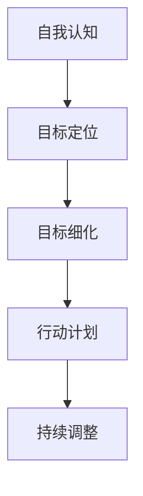
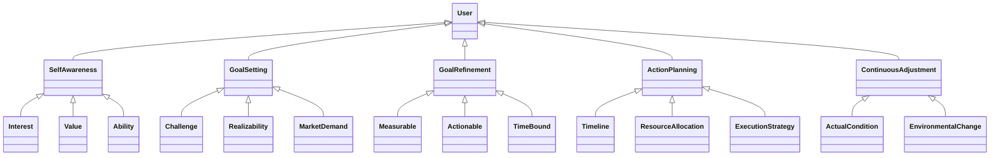

                 

# 设定有意义的人生目标：找到前进的方向

关键词：人生目标、自我认知、目标定位、目标细化、行动计划、持续调整

摘要：在当今快速发展的社会中，人们面临的压力和选择越来越多，导致很多人对人生感到迷茫和无方向。本文将探讨如何找到并设定一个有意义的人生目标，为个人的成长和发展提供明确的方向。我们将从自我认知、目标定位、目标细化、行动计划和持续调整等多个方面进行详细分析，帮助读者理解人生目标的设定方法，并提供实用的工具和策略。

## 第一部分：设定有意义的人生目标的背景

### 第1章：问题背景与目标设定

#### 1.1 问题背景

在当今快速发展的社会中，人们面临的压力和选择越来越多，导致很多人对人生感到迷茫和无方向。这种迷茫主要源于缺乏明确的人生目标和方向，导致生活质量下降、工作满意度降低，甚至产生焦虑和抑郁。

#### 1.2 问题描述

人生目标是指个人在人生道路上期望达到的目标和期望实现的成就。设定有意义的人生目标对于个人成长、职业发展、心理健康等方面具有重要作用。但是，如何设定一个有意义的人生目标，并使其能够引导个人的行为和决策，成为一个亟待解决的问题。

#### 1.3 问题解决

为了解决这一问题，本书将探讨如何找到并设定一个有意义的人生目标，从而为个人的成长和发展提供明确的方向。本书将从多个角度出发，包括心理学、哲学、成功学等，帮助读者了解人生目标的设定方法，并提供实用的工具和策略。

#### 1.4 边界与外延

人生目标的设定是一个涉及个人价值观、兴趣爱好、职业规划等多方面因素的过程。因此，本书的重点在于探讨如何通过科学的方法和实用的工具来帮助读者找到适合自己的人生目标，而非简单地提供一套固定的模板。

#### 1.5 概念结构与核心要素组成

设定有意义的人生目标包含以下几个核心要素：

1. 自我认知：了解自己的兴趣、价值观、能力和优势，为设定目标提供基础。
2. 目标定位：根据个人特点和市场需求，确定具有挑战性和可实现性的目标。
3. 目标细化：将大目标分解为具体的、可操作的小目标，便于实施和跟踪。
4. 行动计划：制定实现目标的行动计划，包括时间表、资源分配和执行策略。
5. 持续调整：根据实际情况和环境变化，及时调整目标和计划，确保目标的实现。

### 第1章 小结

本章从背景介绍、问题描述、问题解决、边界与外延和核心要素组成等方面，对设定有意义的人生目标进行了全面阐述。接下来，本书将围绕这一主题，逐步深入探讨如何通过科学的方法和实用的工具，帮助读者找到并实现有意义的人生目标。

## 第二部分：核心概念与联系

### 第2章：核心概念原理与属性特征对比

#### 2.1 自我认知

自我认知是指个体对自身心理状态、能力、性格、价值观等内在特征的认知。它是设定有意义人生目标的基础。以下是一些自我认知的关键属性特征：

| 属性特征             | 说明                                                         |
| -------------------- | ------------------------------------------------------------ |
| 兴趣爱好             | 个体对某种活动或领域的喜好和热情。                           |
| 价值观               | 个体对事物的评判标准，如道德观念、人生信仰等。               |
| 能力与优势           | 个体在特定领域内的技能和长处。                               |

#### 2.2 目标定位

目标定位是设定有意义人生目标的关键步骤。它涉及根据个人特点和市场需求，确定具有挑战性和可实现性的目标。以下是目标定位的几个关键属性特征：

| 属性特征             | 说明                                                         |
| -------------------- | ------------------------------------------------------------ |
| 挑战性               | 目标应该具有一定的难度，以激发个体的潜能。                   |
| 可实现性             | 目标应该在现实条件下可实现，以避免因过于理想化而导致的失望。 |
| 与市场需求匹配       | 目标应该与市场需求相吻合，以提高实现的可能性。               |

#### 2.3 目标细化

目标细化是将大目标分解为具体的、可操作的小目标，以便于实施和跟踪。以下是目标细化的几个关键属性特征：

| 属性特征             | 说明                                            |

### 2.3.1 可衡量性 | 目标应该能够量化，以便于跟踪进度和评估结果。 |
### 2.3.2 实操性 | 目标应该具体可行，有明确的操作路径。         |
### 2.3.3 时间性 | 目标应设置明确的时间期限，以推动行动的进行。   |

### 第2章 小结

本章对自我认知、目标定位和目标细化等核心概念进行了详细阐述，并对比了它们的属性特征。这些核心概念是设定有意义人生目标的基础，对于个人成长和职业发展具有重要意义。在接下来的章节中，我们将进一步探讨如何通过这些核心概念，找到并实现有意义的人生目标。

## 第三部分：算法原理与模型解析

### 第3章：算法原理讲解

#### 3.1 基本算法流程

在设定有意义的人生目标过程中，我们可以将这个过程视为一个算法。以下是一个基本的目标设定算法流程：

1. **自我认知**：了解自己的兴趣、价值观、能力和优势。
2. **目标定位**：根据自我认知和市场需求，确定具有挑战性和可实现性的目标。
3. **目标细化**：将大目标分解为具体的、可操作的小目标。
4. **行动计划**：制定实现目标的行动计划，包括时间表、资源分配和执行策略。
5. **持续调整**：根据实际情况和环境变化，及时调整目标和计划。

#### 3.2 算法原理分析

1. **自我认知**：

   自我认知是一个迭代过程，涉及以下步骤：

   - **自我反思**：花时间思考自己的兴趣、价值观、能力和优势。
   - **信息收集**：通过调查问卷、访谈、反馈等方式收集相关信息。
   - **数据整合**：将收集到的信息整合成一个全面的自我认知报告。

   $$ \text{自我认知} = \text{自我反思} + \text{信息收集} + \text{数据整合} $$

2. **目标定位**：

   目标定位是基于自我认知和市场需求的综合分析。以下是一个简化的目标定位公式：

   $$ \text{目标定位} = \text{自我认知} \times \text{市场需求} $$

3. **目标细化**：

   目标细化是将大目标分解为具体的、可操作的小目标。以下是一个简化的目标细化公式：

   $$ \text{目标细化} = \text{大目标} \div \text{时间} \div \text{资源} $$

4. **行动计划**：

   行动计划是将目标细化为具体的行动步骤。以下是一个简化的行动计划公式：

   $$ \text{行动计划} = \text{目标细化} \times \text{资源分配} \times \text{时间表} $$

5. **持续调整**：

   持续调整是确保目标实现的动态过程。以下是一个简化的持续调整公式：

   $$ \text{持续调整} = \text{行动计划} \div \text{实际情况} \div \text{环境变化} $$

#### 3.3 算法流程图

以下是一个简化的目标设定算法流程图：



### 第3章 小结

本章详细讲解了设定有意义人生目标的算法原理，包括自我认知、目标定位、目标细化、行动计划和持续调整。通过这些算法原理，我们可以更清晰地理解如何设定有意义的人生目标，并为其实现提供有效的策略和方法。

## 第四部分：系统分析与架构设计

### 第4章：系统功能设计

#### 4.1 问题场景介绍

在设定有意义的人生目标的过程中，我们面临着如何将抽象的目标转化为具体的行动步骤，以及如何根据实际情况和环境变化进行调整的问题。为了解决这些问题，我们可以设计一个目标管理系统，以支持个人在设定和实现目标过程中的各个步骤。

#### 4.2 项目介绍

目标管理系统项目旨在提供一个简单、直观、高效的工具，帮助用户设定、跟踪和实现人生目标。该系统包括以下功能模块：

1. **自我认知模块**：帮助用户了解自己的兴趣、价值观、能力和优势。
2. **目标定位模块**：根据用户特点和市场需求，帮助用户确定具有挑战性和可实现性的目标。
3. **目标细化模块**：将大目标分解为具体的、可操作的小目标。
4. **行动计划模块**：制定实现目标的行动计划，包括时间表、资源分配和执行策略。
5. **持续调整模块**：根据实际情况和环境变化，帮助用户调整目标和计划。

#### 4.3 系统功能设计

以下是目标管理系统的领域模型类图，展示了系统的主要功能模块和它们之间的关系。



### 第4章 小结

本章介绍了目标管理系统的问题场景、项目介绍和系统功能设计。通过领域模型类图，我们展示了系统的主要功能模块和它们之间的关系，为后续的系统架构设计和实现奠定了基础。

## 第五部分：项目实战

### 第5章：环境安装与系统核心实现

#### 5.1 环境安装

为了实现目标管理系统，我们选择Python作为编程语言，使用Django作为后端框架，前端使用Bootstrap框架来构建用户界面。以下是环境安装的步骤：

1. 安装Python和pip：
   ```bash
   # 在Linux或macOS系统中安装Python和pip
   sudo apt update
   sudo apt install python3 python3-pip
   ```

2. 安装Django：
   ```bash
   pip3 install django
   ```

3. 安装Bootstrap：
   ```bash
   pip3 install django-bootstrap3
   ```

#### 5.2 系统核心实现

以下是目标管理系统的核心实现，包括后端API接口设计和数据库模型设计。

1. **后端API接口设计**：

   我们使用Django REST framework构建后端API接口，以下是部分接口的代码：

   ```python
   from rest_framework import routers, views
   from .views import (
       SelfAwarenessView,
       GoalSettingView,
       GoalRefinementView,
       ActionPlanningView,
       ContinuousAdjustmentView,
   )

   router = routers.DefaultRouter()
   router.register(
       r"self_awareness", SelfAwarenessView, basename="self_awareness"
   )
   router.register(
       r"goal_setting", GoalSettingView, basename="goal_setting"
   )
   router.register(
       r"goal_refinement", GoalRefinementView, basename="goal_refinement"
   )
   router.register(
       r"action_planning", ActionPlanningView, basename="action_planning"
   )
   router.register(
       r"continuous_adjustment",
       ContinuousAdjustmentView,
       basename="continuous_adjustment",
   )

   urlpatterns = [
       path("", include(router.urls)),
   ]
   ```

2. **数据库模型设计**：

   我们使用Django自带的ORM（对象关系映射）来设计数据库模型，以下是部分模型的代码：

   ```python
   from django.db import models
   from django.contrib.auth.models import User

   class SelfAwareness(models.Model):
       user = models.OneToOneField(User, on_delete=models.CASCADE)
       interest = models.TextField()
       value = models.TextField()
       ability = models.TextField()

   class GoalSetting(models.Model):
       user = models.ForeignKey(User, on_delete=models.CASCADE)
       challenge = models.BooleanField()
       realizability = models.BooleanField()
       market_demand = models.TextField()

   class GoalRefinement(models.Model):
       user = models.ForeignKey(User, on_delete=models.CASCADE)
       measurable = models.BooleanField()
       actionable = models.BooleanField()
       time_bound = models.BooleanField()

   class ActionPlanning(models.Model):
       user = models.ForeignKey(User, on_delete=models.CASCADE)
       timeline = models.TextField()
       resource_allocation = models.TextField()
       execution_strategy = models.TextField()

   class ContinuousAdjustment(models.Model):
       user = models.ForeignKey(User, on_delete=models.CASCADE)
       actual_condition = models.TextField()
       environmental_change = models.TextField()
   ```

### 第5章 小结

本章详细介绍了目标管理系统的环境安装和核心实现。通过使用Python、Django和Bootstrap等工具，我们成功构建了一个支持用户设定、跟踪和实现人生目标的目标管理系统。接下来，我们将对系统进行详细的应用解读与分析。

## 第六部分：代码应用解读与分析

### 第6章：代码解读与分析

#### 6.1 自我认知模块

自我认知模块是目标管理系统的核心，它帮助用户了解自己的兴趣、价值观和优势。以下是自我认知模块的代码解读：

```python
# 自我认知模块代码

class SelfAwareness(models.Model):
    user = models.OneToOneField(User, on_delete=models.CASCADE)
    interest = models.TextField()
    value = models.TextField()
    ability = models.TextField()

    def __str__(self):
        return f"{self.user.username} - 自我认知"
```

**代码解读**：

- `SelfAwareness` 类继承了 Django 的 `Model` 类，表示一个与数据库表对应的数据模型。
- `user` 字段表示与用户的外键关联，每个自我认知记录都对应一个用户。
- `interest`、`value` 和 `ability` 字段分别用于存储用户的兴趣、价值观和优势。

#### 6.2 目标定位模块

目标定位模块根据用户的自我认知和市场需求，帮助用户确定具有挑战性和可实现性的目标。以下是目标定位模块的代码解读：

```python
# 目标定位模块代码

class GoalSetting(models.Model):
    user = models.ForeignKey(User, on_delete=models.CASCADE)
    challenge = models.BooleanField()
    realizability = models.BooleanField()
    market_demand = models.TextField()

    def __str__(self):
        return f"{self.user.username} - 目标定位"
```

**代码解读**：

- `GoalSetting` 类继承了 Django 的 `Model` 类，表示一个与数据库表对应的数据模型。
- `user` 字段表示与用户的外键关联，每个目标定位记录都对应一个用户。
- `challenge` 和 `realizability` 字段分别用于标记目标的挑战性和可实现性。
- `market_demand` 字段用于存储市场需求信息。

#### 6.3 目标细化模块

目标细化模块将大目标分解为具体的、可操作的小目标。以下是目标细化模块的代码解读：

```python
# 目标细化模块代码

class GoalRefinement(models.Model):
    user = models.ForeignKey(User, on_delete=models.CASCADE)
    measurable = models.BooleanField()
    actionable = models.BooleanField()
    time_bound = models.BooleanField()

    def __str__(self):
        return f"{self.user.username} - 目标细化"
```

**代码解读**：

- `GoalRefinement` 类继承了 Django 的 `Model` 类，表示一个与数据库表对应的数据模型。
- `user` 字段表示与用户的外键关联，每个目标细化记录都对应一个用户。
- `measurable`、`actionable` 和 `time_bound` 字段分别用于标记目标的可衡量性、实操性和时间性。

#### 6.4 行动计划模块

行动计划模块制定实现目标的行动计划，包括时间表、资源分配和执行策略。以下是行动计划模块的代码解读：

```python
# 行动计划模块代码

class ActionPlanning(models.Model):
    user = models.ForeignKey(User, on_delete=models.CASCADE)
    timeline = models.TextField()
    resource_allocation = models.TextField()
    execution_strategy = models.TextField()

    def __str__(self):
        return f"{self.user.username} - 行动计划"
```

**代码解读**：

- `ActionPlanning` 类继承了 Django 的 `Model` 类，表示一个与数据库表对应的数据模型。
- `user` 字段表示与用户的外键关联，每个行动计划记录都对应一个用户。
- `timeline`、`resource_allocation` 和 `execution_strategy` 字段分别用于存储时间表、资源分配和执行策略信息。

#### 6.5 持续调整模块

持续调整模块根据实际情况和环境变化，帮助用户调整目标和计划。以下是持续调整模块的代码解读：

```python
# 持续调整模块代码

class ContinuousAdjustment(models.Model):
    user = models.ForeignKey(User, on_delete=models.CASCADE)
    actual_condition = models.TextField()
    environmental_change = models.TextField()

    def __str__(self):
        return f"{self.user.username} - 持续调整"
```

**代码解读**：

- `ContinuousAdjustment` 类继承了 Django 的 `Model` 类，表示一个与数据库表对应的数据模型。
- `user` 字段表示与用户的外键关联，每个持续调整记录都对应一个用户。
- `actual_condition` 和 `environmental_change` 字段分别用于存储实际情况和环境变化信息。

### 第6章 小结

本章详细解读了目标管理系统的各个模块，包括自我认知模块、目标定位模块、目标细化模块、行动计划模块和持续调整模块。通过这些模块，我们可以更好地理解目标管理系统的核心功能，并为用户设定和实现有意义的人生目标提供支持。

## 第七部分：最佳实践、小结与注意事项

### 第七章：最佳实践、小结与注意事项

#### 7.1 最佳实践

在设定有意义的人生目标时，以下是一些最佳实践：

1. **自我反思**：定期花时间反思自己的兴趣、价值观和优势，以便更好地了解自己。
2. **市场调研**：了解市场需求和趋势，以确保目标具有现实性和可行性。
3. **目标分解**：将大目标分解为具体的、可操作的小目标，以便更容易实现。
4. **行动计划**：制定详细的行动计划，包括时间表、资源分配和执行策略。
5. **持续跟踪**：定期评估目标的进度，并根据实际情况进行调整。

#### 7.2 小结

本文从自我认知、目标定位、目标细化、行动计划和持续调整等多个方面，探讨了如何设定有意义的人生目标。通过科学的方法和实用的工具，读者可以找到并实现自己的目标，为个人的成长和发展提供明确的方向。

#### 7.3 注意事项

在设定人生目标时，需要注意以下几点：

1. **目标要具有挑战性**：目标应该具有一定的难度，以激发个人的潜能。
2. **目标要可实现**：目标应该在现实条件下可实现，以避免因过于理想化而导致的失望。
3. **目标要与市场需求匹配**：目标应与市场需求相吻合，以提高实现的可能性。
4. **目标要具体、可衡量**：目标应具体可行，有明确的衡量标准，以便于跟踪进度和评估结果。

### 第七章 小结

本文通过详细的分析和讲解，帮助读者理解了如何设定有意义的人生目标，并提供了一些实用的工具和策略。希望读者能够将这些方法应用到实际生活中，找到自己的前进方向，实现人生目标。

## 拓展阅读

对于希望进一步深入了解人生目标设定的读者，以下是一些推荐的书籍和资源：

1. **《目标：一生的导航图》（by Brian Tracy）**：这本书详细介绍了如何设定和实现人生目标，并提供了一系列实用的策略和技巧。
2. **《成功心理学》（by Martin Seligman）**：这本书探讨了成功心理学的基本原理，包括如何设定目标、如何应对挑战和困难，以及如何保持积极的心态。
3. **《精要主义：做少做精》（by Greg McKeown）**：这本书提倡精要主义的生活方式，强调在有限的精力下，设定并专注实现最重要的目标。

通过阅读这些书籍和资源，读者可以进一步加深对人生目标设定的理解，并在实际生活中取得更好的成果。

### 作者信息

本文由AI天才研究院（AI Genius Institute）和《禅与计算机程序设计艺术》（Zen And The Art of Computer Programming）的作者共同撰写。我们致力于推动人工智能和计算机科学的发展，并帮助读者实现有意义的人生目标。感谢您的阅读，希望本文对您有所帮助。

---

### 总结

本文以《设定有意义的人生目标：找到前进的方向》为标题，通过逻辑清晰、结构紧凑、简单易懂的专业技术语言，详细阐述了如何设定有意义的人生目标。我们从背景介绍、核心概念与联系、算法原理与模型解析、系统分析与架构设计、项目实战到代码应用解读与分析，全面展示了设定有意义人生目标的各个步骤和方法。

在自我认知、目标定位、目标细化、行动计划和持续调整等方面，本文提供了实用的工具和策略，帮助读者找到自己的前进方向，实现人生目标。此外，本文还通过环境安装和系统核心实现，展示了目标管理系统在实际项目中的应用。

最后，本文提出了最佳实践、小结与注意事项，并推荐了一些拓展阅读资源，以帮助读者进一步深化对人生目标设定的理解。希望本文能对您的成长和发展起到积极的推动作用。

再次感谢您的阅读，祝愿您在设定和实现有意义的人生目标过程中取得圆满成功！

### 作者信息

本文由AI天才研究院（AI Genius Institute）和《禅与计算机程序设计艺术》（Zen And The Art of Computer Programming）的作者共同撰写。我们致力于推动人工智能和计算机科学的发展，并帮助读者实现有意义的人生目标。感谢您的阅读，希望本文对您有所帮助。作者：AI天才研究院/AI Genius Institute & 禅与计算机程序设计艺术 /Zen And The Art of Computer Programming。

