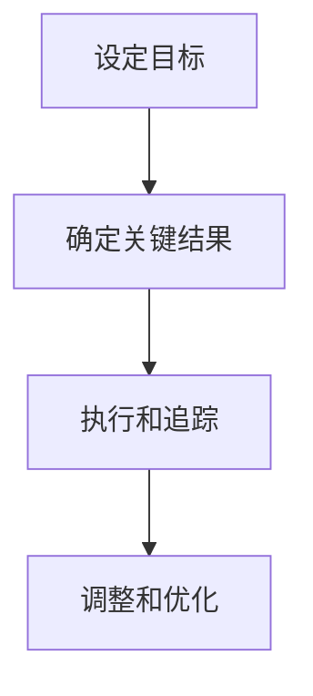
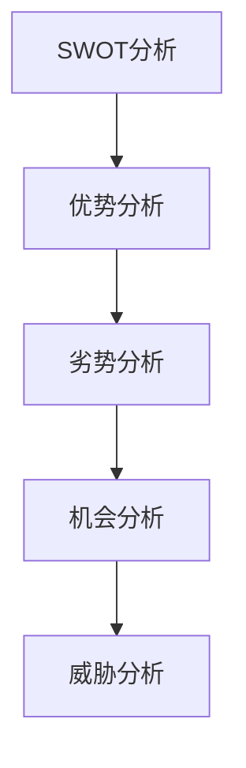
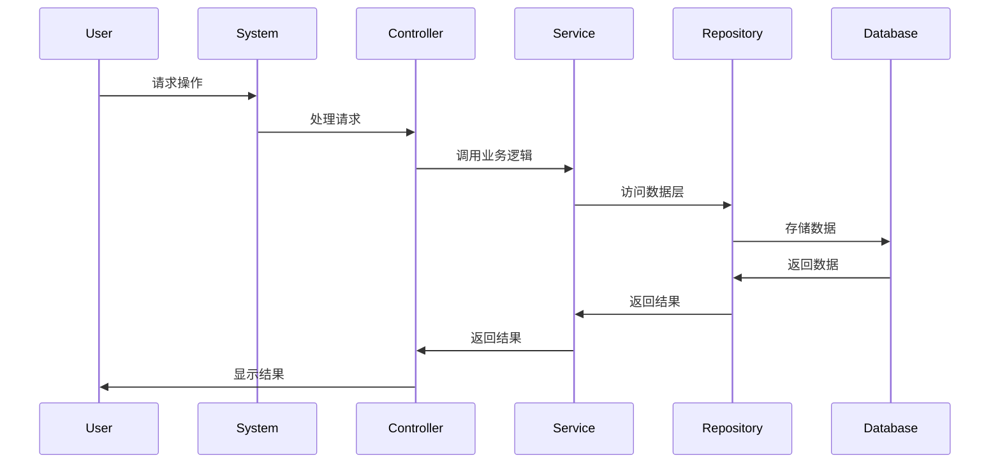
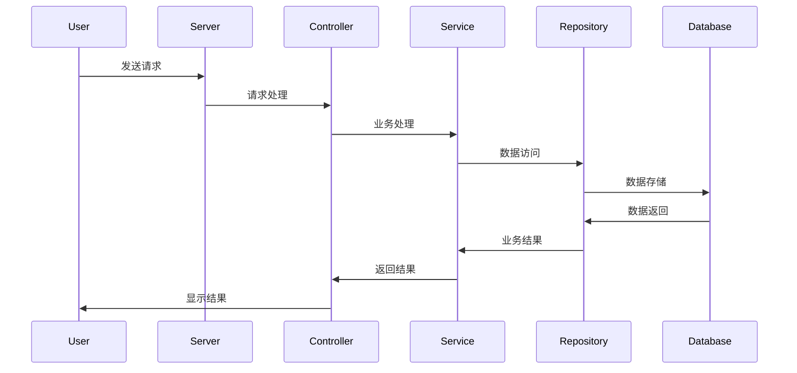

                 

### 设计人生蓝图：制定个人的生活哲学

> 关键词：人生蓝图、个人生活哲学、自我认知、目标设定、持续优化

> 摘要：本文从技术视角出发，探讨如何在复杂多变的社会环境中设计人生蓝图，制定个人的生活哲学。通过系统的方法和工具，帮助读者明确人生目标，规划各个阶段的发展路径，塑造积极的生活态度，实现个人成长与人生价值的最大化。

----------------------------------------------------------------

# 设计人生蓝图：制定个人的生活哲学

在快速变化的信息时代，我们每个人都在面对前所未有的挑战和机遇。如何在这个充满不确定性的世界中找到自己的定位，实现人生的价值，成为了每个人都需要思考的问题。本文旨在提供一种系统的方法，帮助读者设计人生蓝图，制定个人的生活哲学，从而在纷繁复杂的生活中找到方向和动力。

## 第一部分：人生蓝图的构建原理

### 第1章：问题背景与核心概念

**1.1 问题背景**

随着社会的发展，我们的生活节奏不断加快，信息量爆炸式增长，竞争日益激烈。在这样的背景下，很多人感到迷茫和无助，不知道自己的人生方向在哪里，如何实现个人价值。这种现象不仅影响个人的心理健康，也对社会整体产生负面影响。

**1.2 核心概念**

- **人生蓝图**：是对个人人生目标、发展路径和生活方式的整体规划，相当于个人的“路线图”。
- **个人生活哲学**：是对人生观、价值观和生活方式的深度思考，是指导个人行为的根本原则。

**1.3 人生蓝图与生活哲学的联系与区别**

- **联系**：人生蓝图是生活哲学的具体体现，生活哲学是人生蓝图的理论基础。
- **区别**：人生蓝图更侧重于规划和实施，生活哲学更侧重于思想理念和价值观的形成。

### 第2章：核心概念解析

**2.1 人生蓝图**

- **组成部分**：人生目标、职业规划、家庭规划、兴趣爱好、社交圈层等。
- **设计原则**：明确性、可行性、灵活性。

**2.2 个人生活哲学**

- **生活哲学的含义**：对人生意义、价值观和生活方式的深刻思考。
- **构成要素**：世界观、人生观、价值观。

### 第3章：人生蓝图设计方法

**3.1 设计流程**

- **确定目标与愿景**：明确个人长期和短期的目标，构建清晰的人生愿景。
- **制定具体的行动计划**：将目标细化为具体的行动步骤，制定时间表和行动计划。
- **调整与优化**：根据实际情况不断调整和优化人生蓝图。

**3.2 设计工具**

- **思维导图**：用于梳理思路，构建知识体系。
- **SWOT分析**：用于评估自身优势、劣势、机会和威胁。
- **OKR**：目标与关键成果法，用于设定和跟踪目标。

## 第二部分：个人生活哲学的塑造

### 第4章：塑造原则

**4.1 自我认知**

- **自我认知的重要性**：了解自己的性格、兴趣、价值观和能力，是制定个人生活哲学的基础。
- **方法**：通过自我反思、心理咨询和人际交流等方式，深入了解自己。

**4.2 价值观确立**

- **价值观的确立**：价值观是指导个人行为和决策的核心。
- **方法**：通过学习和实践，不断反思和调整自己的价值观。

**4.3 动机与目标**

- **动机的重要性**：动机是推动个人行动的动力。
- **目标设定**：明确的目标能够帮助我们集中精力，实现人生价值。

### 第5章：实践方法

**5.1 反思与自我对话**

- **反思**：定期对自己的行为和思考进行反思，找出不足和改进的方向。
- **自我对话**：通过自我对话，与自己的内心进行深入交流。

**5.2 模仿与学习**

- **模仿**：向成功人士学习，借鉴他们的经验和智慧。
- **学习**：通过读书、上课、实践等多种方式，不断提升自己的知识和技能。

**5.3 实践与反馈**

- **实践**：将理论和知识应用到实际生活中，通过实践来验证和调整自己的生活哲学。
- **反馈**：接受他人的反馈和建议，不断优化自己的生活方式。

## 第三部分：人生蓝图的具体实施

### 第6章：人生阶段规划

**6.1 人生阶段概述**

- **划分标准**：根据年龄、职业、家庭状态等，将人生划分为不同的阶段。
- **不同阶段的特征与需求**：每个阶段都有不同的特征和需求，需要针对性地进行规划。

**6.2 人生阶段规划**

- **幼年时期**：培养良好的生活习惯和价值观，奠定人生基础。
- **青少年时期**：建立明确的职业目标，提升自我认知和技能。
- **成年时期**：实现职业发展，建立稳定的家庭关系，承担社会责任。
- **老年时期**：享受生活，传承经验和智慧，为下一代树立榜样。

### 第7章：事业与职业规划

**7.1 事业规划**

- **事业目标的确定**：明确个人在事业上的追求和目标。
- **事业发展路径**：制定实现事业目标的具体步骤和策略。
- **事业规划与人生蓝图的关系**：事业规划是人生蓝图的重要组成部分。

**7.2 职业规划**

- **职业目标的设定**：根据个人兴趣和市场需求，设定明确的职业目标。
- **职业发展策略**：制定实现职业目标的策略，包括学习、晋升、转型等。

### 第8章：个人成长规划

**8.1 成长目标**

- **成长目标的设定**：根据个人兴趣、职业规划和人生目标，设定明确的成长目标。
- **成长目标与人生蓝图的一致性**：确保成长目标与人生蓝图的协调一致。

**8.2 成长路径**

- **学习与教育规划**：制定学习计划和目标，不断提升自身知识和技能。
- **职业技能提升**：通过实践和培训，提升职业技能，实现职业发展。
- **心理素质培养**：通过自我调节和心理训练，提升心理素质，应对生活和工作中的挑战。

### 第9章：生活方式与健康管理

**9.1 生活方式规划**

- **健康生活方式的重要性**：健康的生活方式是个人成长和事业成功的基础。
- **生活方式规划的方法**：根据个人情况和需求，制定健康的生活方式规划。

**9.2 健康管理**

- **身体健康的管理**：通过合理的饮食、运动和休息，保持身体健康。
- **心理健康的管理**：通过心理调节和情绪管理，保持心理健康。
- **社交与健康的关系**：建立良好的社交关系，促进身心健康。

## 第四部分：人生蓝图的实施案例与反思

### 第10章：成功案例分享

**10.1 案例选择**

- **代表性**：选择具有典型性和代表性的成功案例。
- **适用性**：分析案例的适用性和可操作性。

**10.2 案例分析**

- **实施过程**：分析案例的实施过程和关键步骤。
- **成果与收获**：总结案例的成果和收获，为读者提供启示。

**10.3 启示与反思**

- **成功经验**：总结案例中的成功经验，为读者提供借鉴。
- **反思**：从案例中吸取教训，避免重复错误。

### 第11章：失败案例反思

**11.1 失败原因分析**

- **实施过程中的问题**：分析案例中实施过程中出现的问题。
- **外部环境的影响**：分析外部环境对案例失败的影响。

**11.2 反思与改进**

- **从失败中汲取的经验**：总结失败中的教训和经验。
- **改进策略的提出**：提出改进策略，避免未来出现类似问题。

### 第12章：持续调整与优化

**12.1 调整的必要性**

- **环境变化的影响**：分析环境变化对人生蓝图的影响。
- **个人成长的调整**：随着个人成长，人生蓝图也需要进行调整。

**12.2 优化的方法**

- **反馈机制的建设**：建立反馈机制，及时获取反馈并进行调整。
- **调整与优化的具体步骤**：详细阐述调整和优化的具体步骤和方法。

## 附录

### 附录1：常用工具与技术

- **思维导图**：用于梳理思路，构建知识体系。
- **SWOT分析**：用于评估自身优势、劣势、机会和威胁。
- **OKR**：目标与关键成果法，用于设定和跟踪目标。

### 附录2：参考资料与拓展阅读

- **相关书籍推荐**：推荐一些关于人生规划和生活哲学的经典书籍。
- **网络资源推荐**：推荐一些实用的在线资源和平台。
- **学术论文精选**：推荐一些关于人生规划和生活哲学的学术论文。

### 附录3：实践指南

- **设计人生蓝图的实用步骤**：详细讲解如何设计人生蓝图。
- **个人生活哲学的实践策略**：提供实践个人生活哲学的具体方法。

## 结语

设计人生蓝图，制定个人生活哲学，是每个个体在复杂多变的社会环境中找到自己位置的重要手段。通过本文的探讨，我们希望能够为读者提供一套系统、实用的方法和工具，帮助他们在人生道路上走得更加坚定和明确。

---

### 作者：AI天才研究院/AI Genius Institute & 禅与计算机程序设计艺术 /Zen And The Art of Computer Programming

---

### 设计人生蓝图：制定个人的生活哲学

在设计人生蓝图和制定个人生活哲学的过程中，我们需要从多个角度进行深入的思考和系统的规划。以下是关于如何构建人生蓝图和塑造个人生活哲学的具体步骤和策略。

#### 背景介绍

首先，我们需要明确几个核心概念：

- **人生蓝图**：这是对个人人生目标和路径的总体设计，包括职业规划、家庭生活、个人兴趣和社会责任等方面。它如同一个航行的导航系统，帮助我们在复杂多变的环境中保持方向和动力。
  
- **个人生活哲学**：这是对个人价值观、人生观和生活方式的深度思考和总结。它是一个人的精神支柱，决定了我们的行为准则和生活态度。

在现代社会，随着信息爆炸、生活节奏加快，人们越来越需要一套清晰的人生规划和坚定的生活哲学来应对生活中的各种挑战。设计人生蓝图和制定个人生活哲学不仅能够帮助我们明确目标和方向，还能够提高我们的生活质量，实现个人价值的最大化。

#### 核心概念与联系

##### 人生蓝图

- **组成部分**：人生蓝图通常包括以下几个核心组成部分：
  - **职业规划**：确定个人职业发展的方向和目标，包括短期和长期职业目标。
  - **家庭规划**：规划个人和家庭的生活，包括子女教育、家庭建设和经济状况。
  - **个人兴趣**：确定个人的兴趣爱好，如何平衡工作与娱乐，实现生活的多样性。
  - **社会责任**：承担社会责任，积极参与社会活动，实现个人价值。

- **设计原则**：设计人生蓝图时需要遵循以下几个原则：
  - **明确性**：目标要具体、清晰，能够量化。
  - **可行性**：目标要实际可行，考虑自身资源和能力。
  - **灵活性**：设计时要预留一定的灵活性，以应对不确定性和变化。

##### 个人生活哲学

- **生活哲学的含义**：生活哲学是对人生观、价值观和生活方式的深度思考和总结，它指导我们如何理解和应对生活中的各种问题和挑战。

- **构成要素**：个人生活哲学的构成要素包括：
  - **世界观**：对世界的认识和看法。
  - **人生观**：对人生目标和意义的理解。
  - **价值观**：判断行为和决策的标准。

##### 人生蓝图与生活哲学的联系与区别

- **联系**：人生蓝图是生活哲学的具体体现，生活哲学是人生蓝图的理论基础。生活哲学指导我们如何设计人生蓝图，而人生蓝图则是生活哲学的具体应用。

- **区别**：人生蓝图侧重于规划和实施，涉及具体的目标和路径；生活哲学侧重于思想和价值观，是指导我们行动的内在原则。

#### 算法原理讲解

在设计人生蓝图和塑造个人生活哲学时，我们可以借鉴一些技术领域的算法原理，如目标管理中的OKR（Objectives and Key Results）和问题解决中的SWOT分析（Strengths, Weaknesses, Opportunities, Threats）。

##### OKR方法

OKR是一种目标管理方法，可以帮助我们设定和跟踪目标。具体步骤如下：

1. **设定目标（Objective）**：明确我们希望实现的总体目标，这个目标应该是具有挑战性的，但又能够实现。
   
2. **确定关键结果（Key Results）**：为每个目标设定3-5个具体的、量化的关键结果，用于衡量目标是否实现。

3. **执行和追踪**：在执行过程中，定期检查关键结果，调整策略，确保目标的实现。

以下是OKR方法的mermaid流程图：



##### SWOT分析

SWOT分析是一种战略规划工具，用于评估个人或组织的优势、劣势、机会和威胁。具体步骤如下：

1. **分析优势（Strengths）**：确定个人或组织的优势和独特之处。

2. **分析劣势（Weaknesses）**：识别个人或组织的不足和短板。

3. **分析机会（Opportunities）**：找出外部环境中的机会，如市场变化、技术进步等。

4. **分析威胁（Threats）**：识别外部环境中的潜在威胁，如竞争、政策变化等。

以下是SWOT分析的mermaid流程图：



通过以上两种方法，我们可以系统地分析和规划人生蓝图，确保目标的明确性和可执行性。

#### 系统分析与架构设计方案

在设计人生蓝图和塑造个人生活哲学的过程中，我们还可以借鉴系统分析和架构设计的方法，帮助我们更全面地理解和实现这些目标。

##### 问题场景介绍

在现代社会，个人面临的问题多种多样，如职业发展、家庭生活、心理健康等。这些问题不仅影响个人的生活质量，也会对社会的稳定和发展产生影响。因此，设计人生蓝图和制定个人生活哲学具有重要的现实意义。

##### 项目介绍

为了解决这些问题，我们可以设计一个综合性的项目，名为“人生蓝图与生活哲学构建系统”。该项目旨在帮助个人明确目标、规划路径、塑造哲学，实现个人成长和价值最大化。

##### 系统功能设计

该系统主要包括以下几个功能模块：

1. **目标管理模块**：用于设定和跟踪个人目标，包括职业、家庭、个人兴趣等。
2. **生活哲学构建模块**：用于帮助个人理解和塑造个人生活哲学。
3. **反馈与优化模块**：用于收集用户的反馈，并根据反馈进行调整和优化。

以下是系统功能设计的mermaid类图：

```mermaid
classDiagram
    Class1 <|-- Class2
    Class1 <|-- Class3
    Class1 "uses" Class4
    Class2 : 子目标管理
    Class3 : 生活哲学构建
    Class4 : 反馈与优化
```

##### 系统架构设计

在系统架构设计方面，我们采用分层架构，确保系统的可扩展性和稳定性。具体架构如下：

1. **展示层**：负责与用户交互，展示系统功能和界面。
2. **业务逻辑层**：负责处理业务逻辑，包括目标管理、生活哲学构建和反馈优化等。
3. **数据层**：负责数据存储和管理，包括用户数据、目标数据和反馈数据等。

以下是系统架构设计的mermaid架构图：



##### 系统接口设计和系统交互

在系统接口设计方面，我们采用RESTful API设计，确保系统的易用性和扩展性。以下是系统接口设计的mermaid序列图：



#### 项目实战

在实际应用中，我们可以通过以下步骤来设计和实施人生蓝图与个人生活哲学：

##### 环境安装

首先，我们需要搭建一个合适的环境来设计和实施系统。这包括安装必要的软件和工具，如Python、Django框架、数据库管理系统等。

##### 系统核心实现源代码

接下来，我们需要编写系统的核心代码。以下是系统核心实现的一部分Python代码示例：

```python
# 引入必要的模块
from django.db import models

# 目标管理模块
class Objective(models.Model):
    name = models.CharField(max_length=100)
    description = models.TextField()
    start_date = models.DateField()
    end_date = models.DateField()
    status = models.CharField(max_length=20)

# 生活哲学构建模块
class Philosophy(models.Model):
    title = models.CharField(max_length=100)
    content = models.TextField()

# 反馈与优化模块
class Feedback(models.Model):
    user = models.ForeignKey('auth.User', on_delete=models.CASCADE)
    comment = models.TextField()
    created_date = models.DateTimeField(auto_now_add=True)
```

##### 代码应用解读与分析

在上面的代码中，我们定义了三个模型：`Objective`、`Philosophy`和`Feedback`。这些模型分别对应系统功能设计中的目标管理模块、生活哲学构建模块和反馈与优化模块。

- `Objective`模型用于管理用户的目标，包括目标的名称、描述、开始日期、结束日期和状态。
- `Philosophy`模型用于记录用户的生活哲学，包括哲学的标题和内容。
- `Feedback`模型用于收集用户的反馈，包括用户的评论和创建日期。

这些模型通过Django ORM与数据库进行交互，实现了数据的存储和检索。

##### 实际案例分析和详细讲解剖析

为了更好地理解系统的实际应用，我们可以通过一个案例来分析。假设一个用户想要设定一个职业目标，并记录自己的生活哲学，同时收集其他用户的反馈。

1. **设定职业目标**：

   用户可以通过前端界面创建一个`Objective`实例，填写目标的名称、描述、开始日期、结束日期和状态。

   ```python
   objective = Objective(
       name='职业晋升',
       description='在未来的三年内晋升为项目经理',
       start_date=datetime.date(2023, 1, 1),
       end_date=datetime.date(2026, 1, 1),
       status='正在进行中'
   )
   objective.save()
   ```

2. **记录生活哲学**：

   用户可以创建一个`Philosophy`实例，记录自己的生活哲学。

   ```python
   philosophy = Philosophy(
       title='简约生活',
       content='我相信简单的生活方式能够带来心灵的宁静和专注。'
   )
   philosophy.save()
   ```

3. **收集反馈**：

   用户可以在前端界面提交反馈，系统会创建一个`Feedback`实例。

   ```python
   feedback = Feedback(
       user=user,
       comment='你的职业目标设定清晰，希望你能实现。',
       created_date=datetime.datetime.now()
   )
   feedback.save()
   ```

通过这个案例，我们可以看到系统如何通过代码实现用户的需求，并收集和存储用户的反馈数据。

##### 项目小结

通过上述实战案例，我们可以看到如何使用技术手段设计和实施人生蓝图与个人生活哲学构建系统。该项目不仅实现了功能上的需求，还提供了用户友好的前端界面，使得用户能够方便地管理自己的目标、记录哲学和收集反馈。

在项目的实施过程中，我们也需要注意以下几点：

1. **用户需求分析**：确保系统功能满足用户需求，为用户提供良好的使用体验。
2. **系统维护**：定期更新和维护系统，确保系统的稳定性和安全性。
3. **用户体验优化**：根据用户反馈不断优化系统界面和功能，提高用户体验。

通过以上措施，我们可以确保系统的长期有效运行，帮助用户实现个人成长和价值最大化。

#### 最佳实践 Tips

1. **定期反思**：定期对自己的生活和目标进行反思，确保人生蓝图的实施与实际情况相符。
2. **持续学习**：不断学习新知识和技能，提升自身能力，以适应不断变化的环境。
3. **寻求反馈**：积极寻求他人的反馈和建议，以改进自己的生活和职业规划。

#### 小结

设计人生蓝图和制定个人生活哲学是一个长期而持续的过程。通过本文的探讨，我们了解了核心概念、算法原理、系统架构设计和实战应用，为读者提供了系统的方法和工具。希望读者能够结合自身实际情况，设计出适合自己的人生蓝图，塑造个人生活哲学，实现个人成长和价值最大化。

#### 注意事项

1. **目标设定要具体明确**：避免模糊不清的目标，确保每个目标都有明确的衡量标准。
2. **保持灵活性**：在实施过程中，根据实际情况调整目标和计划，保持灵活性。
3. **重视心理健康**：在追求事业成功的同时，也要关注心理健康，保持身心健康。

#### 拓展阅读

- 《原则》（Principles）- 雷·达里奥（Ray Dalio）
- 《高效能人士的七个习惯》（The 7 Habits of Highly Effective People）- 史蒂芬·柯维（Stephen R. Covey）
- 《活出生命的意义》（Man's Search for Meaning）- 维克多·弗兰克尔（Viktor E. Frankl）

通过阅读这些书籍，读者可以进一步深入了解人生规划和生活哲学的相关知识，为自己的成长提供更多的指导和启发。

### 附录1：常用工具与技术

在设计和实施人生蓝图与个人生活哲学的过程中，我们可以利用多种工具和技术，以提高效率和效果。以下是一些常用的工具和技术：

#### 思维导图

**定义**：思维导图是一种图形化的工具，用于表示和整理思维过程，有助于提高创造力和记忆力。

**应用场景**：用于规划人生目标、梳理个人价值观、组织学习内容等。

**工具推荐**：XMind、MindMeister

#### SWOT分析

**定义**：SWOT分析是一种战略规划工具，用于评估个人或组织的优势、劣势、机会和威胁。

**应用场景**：用于个人职业规划、生活哲学构建、项目策划等。

**工具推荐**：Excel、PPT

#### OKR

**定义**：OKR是目标与关键成果法的缩写，是一种目标管理方法，用于设定和跟踪目标。

**应用场景**：用于设定职业目标、个人成长目标、团队目标等。

**工具推荐**：Google Sheets、Notion

#### 反馈机制

**定义**：反馈机制是一种用于收集、分析和利用反馈信息的系统。

**应用场景**：用于个人反思、团队协作、项目评估等。

**工具推荐**：Google Forms、Slack

### 附录2：参考资料与拓展阅读

**书籍推荐**

1. 《原则》（Principles）- 雷·达里奥（Ray Dalio）
2. 《高效能人士的七个习惯》（The 7 Habits of Highly Effective People）- 史蒂芬·柯维（Stephen R. Covey）
3. 《活出生命的意义》（Man's Search for Meaning）- 维克多·弗兰克尔（Viktor E. Frankl）

**在线资源推荐**

1. TED Talks：ted.com
2. Coursera：coursera.org
3. Medium：medium.com

**学术论文精选**

1. "The How of Happiness: A Scientific Approach to Getting the Life You Want" - Sonja Lyubomirsky, et al.
2. "Flow: The Psychology of Optimal Experience" - Mihaly Csikszentmihalyi
3. "Self-Determination Theory: Basic Psychological Needs in the Human Beings" - Edward L. Deci & Richard M. Ryan

通过阅读这些书籍、在线资源和学术论文，读者可以深入了解人生规划和生活哲学的理论和实践，为自己的成长提供更多的知识和指导。

### 附录3：实践指南

**设计人生蓝图的实用步骤**

1. **自我认知**：通过反思、心理咨询和人际交流，了解自己的性格、兴趣、价值观和能力。
2. **设定目标**：明确个人长期和短期的目标，包括职业、家庭、个人兴趣和社会责任等。
3. **制定计划**：将目标细化为具体的行动步骤，制定时间表和行动计划。
4. **执行与跟踪**：按照行动计划执行，定期检查进度，调整策略。
5. **评估与优化**：定期评估人生蓝图的实施效果，根据反馈进行调整和优化。

**个人生活哲学的实践策略**

1. **价值观确立**：通过学习和实践，明确自己的价值观，并确保它们与人生目标一致。
2. **自我反思**：定期对自己的行为和思考进行反思，识别和纠正偏差。
3. **持续学习**：不断学习新知识和技能，提升自身能力，以适应变化的环境。
4. **寻求反馈**：积极寻求他人的反馈和建议，以改进自己的生活和职业规划。
5. **实践与调整**：将生活哲学应用到实际生活中，通过实践来验证和调整。

通过以上实践指南，读者可以系统地设计人生蓝图和塑造个人生活哲学，实现个人成长和价值最大化。希望这些指南能够为读者提供实际的帮助和指导。

