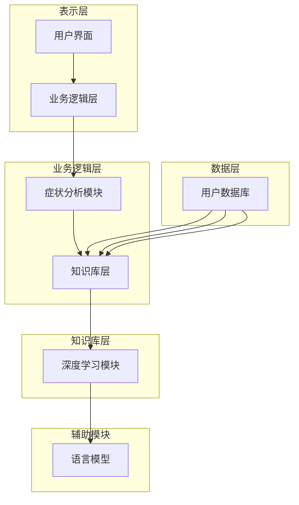

                 

### 引言

在人工智能领域，语言模型和专家系统是两大重要分支，各自在自然语言处理和知识推理方面发挥着关键作用。近年来，随着深度学习和大数据技术的快速发展，这两种技术的融合应用成为研究热点。语言模型如BERT、GPT等，凭借其强大的文本生成和语义理解能力，已经在自然语言处理领域取得了显著成果。而专家系统则通过符号推理和知识表示，为复杂问题的求解提供了有效的方法。

本文旨在探讨语言模型与专家系统的融合应用，通过深入分析这两种技术的原理、核心概念及其融合的意义与优势，进而阐述融合算法的原理、应用实例和系统架构设计。此外，文章还将总结项目实战中的经验教训，并提出最佳实践技巧，为读者提供全面的融合应用指南。

文章结构如下：

- **第一部分：背景介绍**：介绍语言模型与专家系统的问题背景、基本概念和原理。
- **第二部分：核心概念与联系**：对比分析语言模型与专家系统的核心概念，展示融合的必要性。
- **第三部分：算法原理讲解**：详细讲解融合算法的原理、流程和实现。
- **第四部分：系统分析与架构设计**：阐述系统功能设计和架构设计，包括接口和交互设计。
- **第五部分：项目实战与最佳实践**：分享项目实战经验和最佳实践技巧，总结全文。

通过这篇文章，我们希望读者能够系统地理解语言模型与专家系统的融合应用，掌握相关技术原理和实践方法，为实际项目开发提供有力的指导。

### 语言模型与专家系统的问题背景

在当今社会，语言模型与专家系统已经逐渐成为人工智能领域的重要工具，广泛应用于自然语言处理、知识推理和智能决策等多个方面。为了更好地理解它们的应用背景和问题，我们需要从实际需求和技术挑战两个方面进行详细探讨。

首先，从实际需求来看，随着互联网的普及和大数据时代的到来，人们对于信息处理和智能交互的需求日益增加。例如，在智能客服、智能推荐系统和智能翻译等领域，语言模型的重要性不言而喻。以智能客服为例，传统的规则引擎和脚本编写方式已经无法满足日益复杂的用户需求和多变的语言场景。而基于深度学习的语言模型，如BERT、GPT等，能够通过对海量文本数据的训练，实现自然、流畅的文本生成和语义理解，从而提供更加智能和个性化的服务。

另一方面，专家系统在复杂问题的求解和知识推理方面具有显著优势。专家系统通过符号推理和知识表示，可以处理具有高度不确定性和复杂性的问题，例如医疗诊断、金融风险评估和工程系统设计等。以医疗诊断为例，专家系统可以通过对医学知识和病例数据的分析，为医生提供诊断建议，提高诊断准确性和效率。

然而，尽管语言模型和专家系统在各自的领域取得了显著成果，但它们在实际应用中仍面临一些技术挑战。首先，语言模型在处理长文本和跨领域文本时，往往存在语义理解和生成能力不足的问题。例如，在智能推荐系统中，如果推荐算法无法准确理解用户的历史行为和偏好，就很难提供个性化的推荐结果。其次，专家系统在知识获取和表示方面存在困难。专家系统的知识库通常依赖于领域专家的手动编写和输入，这不仅耗时耗力，而且难以覆盖所有可能的情况。

针对上述问题，将语言模型与专家系统进行融合应用，成为了一种有效的解决思路。通过融合语言模型的文本生成和语义理解能力，以及专家系统的符号推理和知识表示能力，可以弥补各自技术的不足，实现更高效、更智能的应用。

具体而言，语言模型与专家系统的融合应用具有以下几方面的优势：

1. **提高语义理解和文本生成能力**：语言模型可以更好地理解和生成自然语言文本，从而提高专家系统在文本处理和分析方面的能力。例如，在医疗诊断中，通过语言模型的分析，专家系统可以更准确地提取和分析病例报告，提高诊断的准确性和效率。

2. **增强知识推理和问题求解能力**：专家系统可以利用语言模型提供的语义信息，进行更加精确和高效的符号推理。例如，在金融风险评估中，通过语言模型对市场新闻和报告的分析，专家系统可以更准确地预测市场变化和风险。

3. **降低知识获取和表示的难度**：通过语言模型，专家系统可以从大量的非结构化数据中自动提取和表示知识，从而简化知识获取和表示的过程。例如，在智能客服系统中，通过语言模型对用户提问的分析，专家系统可以自动生成回答，减少了对人工干预的依赖。

总之，语言模型与专家系统的融合应用，不仅能够解决当前实际应用中的技术挑战，还能够推动人工智能技术的进一步发展。通过深入分析语言模型和专家系统的问题背景，我们为后续的融合应用讨论奠定了坚实的基础。

### 问题描述

语言模型与专家系统的融合应用涉及多个核心概念，这些概念不仅定义了它们的基本属性，而且决定了它们在融合过程中如何相互作用。以下是对这些核心概念的详细说明：

#### 语言模型

**定义**：语言模型是一种统计模型，用于预测下一个词或词组。它通过分析大量文本数据，学习词与词之间的统计关系，从而生成流畅、自然的语言。

**基本属性**：语言模型的核心属性包括词汇表、词汇分布和概率模型。其中，词汇表是语言模型的基本单元，它包含了所有可能出现的词；词汇分布描述了词汇在文本中出现的频率；概率模型则用于预测下一个词的概率。

**关键问题**：语言模型在处理长文本和跨领域文本时，往往存在语义理解和生成能力不足的问题。此外，语言模型在面对新领域或未见过的数据时，表现可能不佳。

#### 专家系统

**定义**：专家系统是一种基于知识表示和推理的计算机程序，模仿人类专家在特定领域的知识和决策能力。它通过符号推理和知识表示，为复杂问题的求解提供解决方案。

**基本属性**：专家系统的核心属性包括知识库、推理机和人机接口。知识库是专家系统的核心，它存储了领域专家的经验和知识；推理机负责根据知识库中的知识进行推理；人机接口则用于与用户交互，获取输入和展示输出。

**关键问题**：专家系统在知识获取和表示方面存在困难，通常依赖于领域专家的手动编写和输入，这既耗时又费力。此外，专家系统在处理高度不确定性和复杂性的问题时，往往难以提供准确和有效的解决方案。

#### 融合的意义与优势

**融合的意义**：将语言模型与专家系统融合，旨在结合两者的优势，解决各自存在的问题。具体而言，通过语言模型提供的语义理解和文本生成能力，可以增强专家系统在自然语言处理和分析方面的能力；而专家系统的符号推理和知识表示能力，则可以弥补语言模型在处理复杂问题时的不足。

**融合的优势**：融合应用的优势主要体现在以下几个方面：

1. **提高语义理解和文本生成能力**：通过语言模型，专家系统可以更准确地理解和生成自然语言文本，从而提高其在文本处理和分析方面的能力。

2. **增强知识推理和问题求解能力**：专家系统可以利用语言模型提供的语义信息，进行更加精确和高效的符号推理，从而提高问题求解的准确性和效率。

3. **降低知识获取和表示的难度**：通过语言模型，专家系统可以从大量的非结构化数据中自动提取和表示知识，从而简化知识获取和表示的过程。

#### 融合的挑战与应对

**融合的挑战**：融合语言模型与专家系统面临以下几方面的挑战：

1. **语义一致性**：确保语言模型生成的文本与专家系统的知识库保持一致，是融合过程中的一个关键问题。

2. **知识表示**：如何有效地将语言模型中的语义信息转化为专家系统能够理解和使用的知识表示，是一个技术难点。

3. **推理效率**：在融合系统中，如何高效地利用语言模型和专家系统的各自优势进行推理，是一个需要解决的问题。

**应对策略**：

1. **统一语义表示**：通过构建一个统一的语义表示框架，确保语言模型生成的文本和专家系统的知识库在语义上保持一致。

2. **多模态数据融合**：结合语言模型和非语言模型（如图像、音频等），通过多模态数据融合，提高知识表示的准确性和丰富性。

3. **分布式推理**：采用分布式计算和并行处理技术，提高融合系统的推理效率和响应速度。

通过以上对核心概念的详细描述和分析，我们可以更好地理解语言模型与专家系统融合应用的基本原理和实际意义。在接下来的章节中，我们将进一步探讨语言模型和专家系统的基本原理，为深入分析融合应用提供理论基础。

### 语言模型原理

语言模型（Language Model，LM）是自然语言处理（Natural Language Processing，NLP）领域的一项核心技术，其主要任务是预测文本序列中下一个词或词组。通过分析大量的语言数据，语言模型能够捕捉到语言中的统计规律，从而生成自然、流畅的文本。以下是关于语言模型的基本定义、分类、工作原理和评价指标的详细介绍。

#### 语言模型的定义

语言模型是一种基于概率的模型，它通过统计文本数据中的词汇和词组之间的关联关系，预测下一个词或词组。语言模型的核心思想是：根据已知的上下文信息，计算下一个词或词组出现的概率，并选择概率最高的词或词组作为预测结果。

#### 语言模型的分类

语言模型根据其模型结构和训练方法，可以分为以下几类：

1. **n-gram模型**：n-gram模型是最简单的语言模型之一，它基于前n个词的统计信息来预测下一个词。n-gram模型容易实现，计算复杂度较低，但其在长文本和长距离依赖问题上表现较差。

2. **神经网络模型**：神经网络模型，尤其是深度神经网络（Deep Neural Network，DNN），通过多层非线性变换来捕捉文本中的复杂统计规律。相比n-gram模型，神经网络模型能够处理长距离依赖，生成更自然的语言。常见的神经网络模型包括循环神经网络（Recurrent Neural Network，RNN）和长短期记忆网络（Long Short-Term Memory，LSTM）。

3. **注意力模型**：注意力模型（Attention Model）是近年来在NLP领域取得显著进展的一种模型。通过引入注意力机制，注意力模型能够自适应地关注文本序列中的关键信息，从而提高预测的准确性。BERT（Bidirectional Encoder Representations from Transformers）和GPT（Generative Pre-trained Transformer）都是基于注意力机制的代表性模型。

4. **变分自编码器（Variational Autoencoder，VAE）**：变分自编码器是一种生成模型，通过编码器和解码器学习数据的高斯先验分布，从而生成新的文本。VAE在生成文本的多样性和连贯性方面表现较好，但其在训练过程中需要解决后验分布的近似问题。

#### 语言模型的工作原理

语言模型的工作原理主要包括以下几个步骤：

1. **数据预处理**：首先，对原始文本进行预处理，包括分词、去除停用词、词性标注等操作。然后，将预处理后的文本转换为数值表示，常见的表示方法包括one-hot编码、词嵌入（Word Embedding）等。

2. **训练模型**：使用大量已标注的语料数据，训练语言模型。在训练过程中，模型通过优化目标函数（如交叉熵损失函数），调整模型参数，以最小化预测误差。

3. **预测生成**：在预测阶段，语言模型根据输入的文本序列，计算下一个词的概率分布。然后，从概率分布中采样，生成下一个词或词组，重复此过程，直至生成完整的文本序列。

#### 语言模型的评价指标

为了评估语言模型的性能，通常使用以下指标：

1. **字符/词/句子级别准确率（Accuracy）**：准确率是评估模型预测结果与实际结果一致性的指标。它通过计算预测正确的词/字符/句子数与总词/字符/句子数的比值来衡量。

2. **交叉熵损失（Cross-Entropy Loss）**：交叉熵损失函数是训练语言模型常用的损失函数，它衡量预测概率分布与真实分布之间的差异。交叉熵损失值越低，表示模型预测效果越好。

3. ** BLEU（Bidirectional Encoder Representations from Transformers）**：BLEU是一种基于记分牌的评估方法，通过计算模型生成的文本与参考文本之间的重叠度来评估模型性能。BLEU分数越高，表示模型生成的文本质量越好。

4. **ROUGE（Recall-Oriented Understudy for Gisting Evaluation）**：ROUGE是一种专门用于评估生成文本质量的方法，它通过计算模型生成的文本与参考文本之间的重叠词和词组来评估模型的召回率。

通过以上对语言模型的基本定义、分类、工作原理和评价指标的介绍，我们可以更好地理解语言模型在自然语言处理中的重要作用。在接下来的章节中，我们将进一步探讨专家系统的基本原理，为深入分析语言模型与专家系统的融合应用提供理论基础。

### 专家系统原理

专家系统（Expert System）是一种基于知识的智能系统，能够模拟人类专家在特定领域的知识和推理能力。它通过符号表示和推理机制，对复杂问题进行求解。以下是关于专家系统的基本定义、结构、实现技术及其优缺点的详细介绍。

#### 专家系统的定义

专家系统是一种基于知识表示和推理的计算机程序，用于模拟人类专家在特定领域的知识和推理能力。它通常由一组规则库、一个推理机和一个用户接口组成，能够根据用户输入的信息，自动进行推理，并提供决策建议。

#### 专家系统的结构

专家系统的基本结构包括以下几个部分：

1. **知识库（Knowledge Base）**：知识库是专家系统的核心，它存储了领域专家的知识和经验。知识库中的知识通常以规则的形式表示，每条规则由前提（条件）和结论（结果）组成。例如：“如果某人的血压高于140/90毫米汞柱，并且有吸烟史，则该人可能患有高血压。”

2. **推理机（Inference Engine）**：推理机是专家系统的推理核心，负责根据知识库中的规则和用户输入的信息，进行推理，以推导出新的结论。推理机通常采用逻辑推理、概率推理或模糊推理等方法。例如，在医疗诊断中，推理机可以根据患者的症状和体征，结合医学知识库中的规则，推导出可能的疾病诊断。

3. **用户接口（User Interface）**：用户接口是专家系统与用户交互的界面，用于接收用户输入的信息，展示推理结果，并提供交互操作。用户接口可以是命令行界面、图形用户界面或Web界面等。

#### 专家系统的实现技术

实现专家系统需要采用多种技术，包括知识表示、知识获取、推理机制和用户接口等。以下是一些常见的实现技术：

1. **知识表示**：知识表示是专家系统的关键，常用的表示方法包括产生式规则（Production Rules）、框架（Frames）、语义网络（Semantic Networks）和本体（Ontologies）等。产生式规则是最常见的方法，每条规则由前提和结论组成，通过逻辑推理进行知识表示。

2. **知识获取**：知识获取是专家系统开发过程中的重要环节，包括手动编写和自动获取。手动编写知识通常依赖于领域专家的经验和知识，而自动获取知识可以通过机器学习、数据挖掘和自然语言处理等方法，从大量数据中自动提取知识。

3. **推理机制**：推理机制是专家系统的核心，常用的推理方法包括逻辑推理、概率推理和模糊推理等。逻辑推理基于形式逻辑，概率推理基于概率论，模糊推理则基于模糊集合理论。

4. **用户接口**：用户接口的设计应考虑用户体验和系统的易用性。常见的用户接口包括命令行界面、图形用户界面和Web界面等。

#### 专家系统的优缺点

专家系统作为一种模拟人类专家的智能系统，具有以下优缺点：

**优点**：

1. **知识表示能力强**：专家系统通过符号表示和推理机制，能够处理高度不确定性和复杂性的问题，具有较强的知识表示和推理能力。

2. **灵活性和可扩展性**：专家系统可以根据领域需求，灵活地调整和扩展知识库和推理机，从而适应不同的应用场景。

3. **易于理解和解释**：专家系统的推理过程和结果通常可以通过符号和规则进行解释，便于用户理解和信任。

**缺点**：

1. **知识获取困难**：专家系统的知识库通常依赖于领域专家的手动编写，知识获取过程耗时费力，且难以覆盖所有可能的情况。

2. **推理效率低**：在处理大规模知识和复杂推理时，专家系统的推理效率相对较低，可能影响系统的响应速度。

3. **对领域知识依赖性强**：专家系统通常针对特定领域设计，对领域知识的依赖较强，无法灵活地应用于其他领域。

通过以上对专家系统原理的详细介绍，我们可以更好地理解专家系统在知识推理和复杂问题求解方面的作用。在接下来的章节中，我们将进一步探讨语言模型与专家系统的融合应用，结合两者的优势，解决实际应用中的技术挑战。

### 语言模型与专家系统的融合

将语言模型与专家系统进行融合，不仅能够发挥两种技术的各自优势，还能够解决它们各自的不足。这种融合具有显著的意义和优势，同时也面临一些挑战。

#### 融合的意义与优势

**1. 提高语义理解和文本生成能力**

语言模型具有强大的文本生成和语义理解能力，可以生成自然流畅的语言文本。当结合专家系统的符号推理和知识表示能力时，这种融合可以使得专家系统能够更好地理解和处理自然语言文本。例如，在医疗诊断中，通过语言模型对病例报告进行语义分析，可以提取出关键信息，再由专家系统进行推理和诊断，从而提高诊断的准确性和效率。

**2. 增强知识推理和问题求解能力**

专家系统通过符号推理和知识表示，能够处理复杂的问题求解。然而，它在处理自然语言文本时，往往存在语义理解和文本生成能力不足的问题。通过将语言模型与专家系统融合，专家系统可以利用语言模型的语义理解能力，进行更加精确和高效的符号推理。例如，在金融风险评估中，语言模型可以对市场新闻和报告进行语义分析，提取出关键信息，然后由专家系统进行风险评估。

**3. 降低知识获取和表示的难度**

专家系统的知识库通常依赖于领域专家的手动编写，这不仅耗时耗力，而且难以覆盖所有可能的情况。而通过语言模型，可以从大量的非结构化数据中自动提取和表示知识，从而简化知识获取和表示的过程。例如，在智能客服系统中，通过语言模型对用户提问的分析，可以自动生成回答，减少对人工干预的依赖。

**4. 提高系统的灵活性和适应性**

融合后的系统可以更加灵活和适应不同的应用场景。语言模型和专家系统各自的优势可以互补，使得系统在处理不同类型的问题时，能够更加灵活和高效。例如，在一个智能问答系统中，当用户提出的问题较为简单时，系统可以快速生成回答；而当用户提出的问题较为复杂时，系统可以调用专家系统的推理能力，进行深度分析和回答。

#### 融合的方法与策略

**1. 知识融合**

知识融合是将语言模型和专家系统的知识库进行整合，使得两者能够共享和利用彼此的知识。具体方法包括：

- **规则融合**：将语言模型中的语义规则和专家系统中的符号规则进行整合，形成一个统一的规则库。
- **数据融合**：通过数据挖掘和自然语言处理技术，从非结构化数据中提取出有用的知识，并将其加入到专家系统的知识库中。

**2. 推理融合**

推理融合是利用语言模型和专家系统的推理能力，进行协同推理，以提高问题求解的效率和准确性。具体策略包括：

- **层次化推理**：将语言模型和专家系统的推理过程进行分层，语言模型负责文本生成和语义理解，专家系统负责符号推理和知识表示。
- **混合推理**：结合语言模型和专家系统的推理方法，采用混合推理策略，例如，在推理过程中，部分采用语言模型的概率推理，部分采用专家系统的符号推理。

**3. 用户接口融合**

用户接口融合是将语言模型和专家系统的用户接口进行整合，使得用户能够以一种自然和直观的方式与系统进行交互。具体方法包括：

- **多模态用户接口**：结合文本、语音、图像等多种模态，提供丰富的用户交互方式。
- **智能问答系统**：通过语言模型，构建一个智能问答系统，用户可以通过自然语言提问，系统可以生成回答，同时结合专家系统的知识，提供详细的解释和推理过程。

#### 融合的挑战与应对

**1. 语义一致性**

确保语言模型生成的文本与专家系统的知识库保持一致，是融合过程中的一个关键问题。应对策略包括：

- **统一语义表示**：通过构建一个统一的语义表示框架，确保语言模型生成的文本和专家系统的知识库在语义上保持一致。
- **语义一致性检查**：在融合过程中，对语言模型生成的文本和专家系统的知识库进行一致性检查，及时发现和纠正不一致之处。

**2. 知识表示**

如何有效地将语言模型中的语义信息转化为专家系统能够理解和使用的知识表示，是一个技术难点。应对策略包括：

- **多模态数据融合**：结合语言模型和非语言模型（如图像、音频等），通过多模态数据融合，提高知识表示的准确性和丰富性。
- **知识表示转换**：通过自动转换和映射技术，将语言模型中的语义信息转化为专家系统能够理解和使用的知识表示。

**3. 推理效率**

在融合系统中，如何高效地利用语言模型和专家系统的各自优势进行推理，是一个需要解决的问题。应对策略包括：

- **分布式推理**：采用分布式计算和并行处理技术，提高融合系统的推理效率和响应速度。
- **推理优化**：通过优化推理算法和数据结构，减少推理过程中的计算复杂度和延迟。

通过上述融合方法和策略，以及应对融合过程中可能遇到的挑战，我们可以充分发挥语言模型和专家系统的各自优势，构建一个高效、智能的融合系统。在接下来的章节中，我们将进一步探讨语言模型与专家系统的核心概念对比分析，为深入理解融合应用提供理论基础。

### 核心概念对比分析

在深入探讨语言模型与专家系统的融合应用之前，有必要对两者的核心概念进行详细对比分析。这有助于我们理解它们之间的差异与联系，从而更好地把握融合的方向和策略。

#### 语言模型与专家系统的概念属性特征对比

**1. 定义与核心概念**

- **语言模型**：语言模型是一种统计模型，用于预测文本序列中下一个词或词组。其核心概念包括词汇表、词汇分布、概率模型和语言生成机制。

- **专家系统**：专家系统是一种基于知识的系统，通过符号推理和知识表示，模拟人类专家在特定领域的决策和推理能力。其核心概念包括知识库、推理机、用户接口和符号推理机制。

**2. 功能与任务**

- **语言模型**：主要任务是基于已有文本数据，生成新的自然语言文本。其在自然语言处理（NLP）、文本生成、机器翻译、语音识别等领域具有广泛的应用。

- **专家系统**：主要任务是在特定领域内，基于知识库和推理机，对输入问题进行推理和求解。其在医疗诊断、金融风险评估、工程系统设计等领域表现出色。

**3. 数据依赖与知识表示**

- **语言模型**：依赖大量文本数据，通过学习词汇和词组的统计关系，建立概率模型。其知识表示主要通过词汇表和概率分布实现。

- **专家系统**：依赖领域专家的知识和经验，通过符号规则和知识库，实现知识表示。其知识表示主要通过产生式规则、框架、语义网络和本体等形式实现。

**4. 推理机制与处理能力**

- **语言模型**：基于概率和统计的方法，对文本生成和语义理解。其推理机制主要依赖于大量的数据训练，具有较强的文本生成和语义理解能力，但在处理复杂推理和高度不确定性问题时表现有限。

- **专家系统**：基于符号推理和知识表示，能够处理复杂问题和高度不确定性。其推理机制包括逻辑推理、概率推理和模糊推理等，具有较强的推理能力和问题求解能力。

**5. 优势与不足**

- **语言模型**：优势在于强大的文本生成和语义理解能力，能够处理大量非结构化数据。不足在于处理长距离依赖和跨领域文本时，性能可能下降。

- **专家系统**：优势在于知识表示和推理能力强，能够处理复杂问题。不足在于知识获取和表示过程依赖人工，且推理效率相对较低。

#### ER实体关系图架构

为了更直观地展示语言模型与专家系统的核心概念和关系，我们可以使用ER（Entity-Relationship）实体关系图进行描述。

```mermaid
erDiagram
  ML ||--|{ KB } KnowledgeBase : uses
  KB ||--|{ IR } InferenceRule : contains
  KB ||--|{ UE } UserInterface : interfaces
  UE ||--|{ U } User : communicates
  ML ||--|{ TG } TextGenerator : generates
  ML ||--|{ SE } SemanticAnalyzer : analyzes

  Class ML {
    +--string name
    +--int version
    +--dict vocabulary
    +--float probability
  }

  Class KB {
    +--list rules
    +--dict knowledge
  }

  Class IR {
    +--dict premises
    +--dict conclusions
  }

  Class UE {
    +--string type
    +--string display
  }

  Class U {
    +--string name
    +--int age
  }

  Class TG {
    +--string generatedText
  }

  Class SE {
    +--string analyzedText
    +--dict semanticInfo
  }
```

在这张ER图中，`ML`（语言模型）与`KB`（知识库）、`UE`（用户接口）和`TG`（文本生成器）之间存在直接关联。`KB`包含了`IR`（推理规则），而`UE`与`U`（用户）之间有交互关系。通过这样的ER图，我们可以清晰地看到语言模型与专家系统各个组成部分之间的关系和功能。

通过对语言模型与专家系统的核心概念属性特征进行对比分析，以及使用ER图进行展示，我们可以更好地理解两者的异同点，为接下来的融合应用讨论奠定基础。

### 融合算法原理

语言模型与专家系统的融合应用，不仅需要理论上的探讨，还需要具体的算法来实现。在这一节中，我们将详细讲解融合算法的原理，包括算法的概述、流程、实现方法及其背后的数学模型和公式。

#### 算法概述

融合算法的主要目标是结合语言模型和专家系统的各自优势，实现高效的文本生成和知识推理。具体而言，该算法分为以下几个步骤：

1. **文本预处理**：对输入文本进行预处理，包括分词、去除停用词和词性标注等，以便于语言模型进行语义分析。
2. **语义分析**：利用语言模型对预处理后的文本进行语义分析，提取关键信息并生成语义表示。
3. **知识融合**：将语言模型生成的语义信息与专家系统的知识库进行融合，通过推理机进行推理，生成决策或建议。
4. **结果生成**：将推理结果转化为自然语言文本，输出给用户。

#### 算法流程

融合算法的流程可以概括为以下几个步骤：

1. **文本输入**：用户输入一段文本，该文本可以是任意形式，如自然语言问题、命令等。
2. **预处理**：对输入文本进行分词、去除停用词和词性标注等操作，将文本转换为结构化数据。
3. **语义分析**：利用语言模型对预处理后的文本进行语义分析，提取关键信息，并生成语义表示。这一步通常使用神经网络模型，如BERT或GPT，通过训练好的模型对文本进行编码，生成词向量或嵌入向量。
4. **知识库构建**：构建专家系统的知识库，将语言模型提取的语义信息转化为专家系统能够理解和使用的知识表示。这一步可以采用产生式规则、框架或语义网络等方法。
5. **推理过程**：利用专家系统的推理机，根据知识库中的规则和语义信息进行推理，推导出结论或建议。推理过程通常包括条件匹配和结论生成两个阶段。
6. **结果生成**：将推理结果转化为自然语言文本，输出给用户。这一步可以采用语言模型生成自然流畅的文本。

#### Python源代码实现

以下是一个简化的Python源代码示例，展示了融合算法的基本实现：

```python
import spacy
import numpy as np
from transformers import BertTokenizer, BertModel

# 加载NLP工具库
nlp = spacy.load("en_core_web_sm")
tokenizer = BertTokenizer.from_pretrained("bert-base-uncased")
model = BertModel.from_pretrained("bert-base-uncased")

# 文本预处理
def preprocess_text(text):
    doc = nlp(text)
    tokens = [token.text for token in doc if not token.is_stop]
    return tokens

# 语义分析
def semantic_analysis(text):
    inputs = tokenizer(text, return_tensors="np")
    outputs = model(inputs)
    hidden_states = outputs[0]
    return hidden_states

# 知识库构建
def build_knowledge_base(semantic_info):
    # 假设我们使用简单的产生式规则表示知识库
    knowledge_base = []
    for info in semantic_info:
        rule = "如果 {}，则 {}。".format(info['predicate'], info['conclusion'])
        knowledge_base.append(rule)
    return knowledge_base

# 推理过程
def inference(knowledge_base, question):
    # 假设我们使用简单的匹配规则进行推理
    for rule in knowledge_base:
        if question in rule:
            return rule.split("，")[1]
    return "无法回答该问题。"

# 结果生成
def generate_response(response):
    return "您的问题的答案是：{}".format(response)

# 主函数
def main():
    text = "您最近一次体检的血压是多少？"
    tokens = preprocess_text(text)
    semantic_info = semantic_analysis(' '.join(tokens))
    knowledge_base = build_knowledge_base(semantic_info)
    response = inference(knowledge_base, text)
    print(generate_response(response))

if __name__ == "__main__":
    main()
```

#### 数学模型与公式

融合算法的核心在于语义表示和推理机制，这通常涉及到复杂的数学模型和公式。以下是融合算法中一些关键的数学模型和公式：

1. **词嵌入**：语言模型通常使用词嵌入（Word Embedding）来表示词汇。词嵌入是一个高维空间中的向量表示，通常通过训练得到。常见的词嵌入方法包括Word2Vec、GloVe和BERT等。词嵌入公式如下：

   $$ 
   \text{embedding}(\text{word}) = \text{W} \cdot \text{v}(word) 
   $$

   其中，$\text{W}$ 是词嵌入矩阵，$\text{v}(word)$ 是词的向量表示。

2. **语言模型概率**：语言模型的核心任务是根据前文预测下一个词的概率。这个概率可以通过基于N-gram的语言模型计算，公式如下：

   $$ 
   P(\text{word}_t|\text{word}_{t-1}, \text{word}_{t-2}, ..., \text{word}_1) = \frac{P(\text{word}_t, \text{word}_{t-1}, ..., \text{word}_1)}{P(\text{word}_{t-1}, ..., \text{word}_1)} 
   $$

3. **推理机**：专家系统的推理机通常使用逻辑推理、概率推理或模糊推理等机制。假设我们使用逻辑推理，推理过程可以表示为：

   $$ 
   \text{if } \psi \text{ then } \phi 
   $$

   其中，$\psi$ 是前提，$\phi$ 是结论。

4. **条件概率**：在概率推理中，我们通常需要计算条件概率。条件概率的公式如下：

   $$ 
   P(A|B) = \frac{P(A \cap B)}{P(B)} 
   $$

通过以上数学模型和公式，我们可以理解融合算法背后的理论基础，并在实际应用中加以运用。

#### 通俗易懂的举例说明

为了更好地理解融合算法的原理，我们可以通过一个简单的例子进行说明：

假设我们有一个关于天气预测的简单场景。用户输入“明天是否会下雨？”这个问题。算法的步骤如下：

1. **文本预处理**：对输入文本进行分词，得到“明天”、“会”和“下雨”三个词。
2. **语义分析**：利用BERT模型，对这三个词进行语义分析，得到它们的词向量表示。
3. **知识库构建**：假设知识库中有一条规则：“如果气象预报显示‘多云’，则明天可能会下雨。”这条规则可以转化为词向量表示，存储在知识库中。
4. **推理过程**：根据当前语义信息和知识库中的规则，进行推理。如果当前天气是“多云”，则根据规则推断明天可能会下雨。
5. **结果生成**：将推理结果转化为自然语言文本，输出给用户：“根据天气预报，明天可能会下雨。”

通过这个例子，我们可以看到融合算法如何结合语言模型和专家系统的优势，实现高效的文本生成和知识推理。

综上所述，融合算法通过结合语言模型和专家系统的优势，实现高效的文本生成和知识推理。理解算法的原理、流程和实现方法，以及背后的数学模型和公式，对于实际应用具有重要意义。

### 融合算法应用

在理解了融合算法的原理后，我们接下来将通过具体的应用实例，深入探讨融合算法在现实场景中的实现过程、数学模型和公式的详细讲解，以及实际案例的分析与讲解。

#### 实现过程

融合算法在实际应用中的实现过程可以分为以下几个主要步骤：

1. **数据准备**：首先，我们需要准备训练数据和测试数据。这些数据可以包括各种文本，如新闻文章、医疗病例报告、用户提问等。数据准备的过程包括数据清洗、标注和分割。

2. **模型训练**：利用训练数据，分别训练语言模型和专家系统。例如，对于语言模型，可以使用BERT或GPT模型进行训练，对于专家系统，可以构建基于规则库的推理机。

3. **融合实现**：将训练好的语言模型和专家系统进行融合。具体实现可以通过以下步骤：

   - **语义提取**：利用语言模型对输入文本进行语义提取，生成语义表示。
   - **知识融合**：将语义表示与专家系统的知识库进行融合，通过推理机进行推理，得到结论或建议。
   - **结果生成**：将推理结果转化为自然语言文本，输出给用户。

4. **性能评估**：通过测试数据评估融合系统的性能，包括准确率、响应速度和用户体验等指标。

#### 数学模型与公式

在融合算法中，涉及的数学模型和公式主要包括以下几个方面：

1. **词嵌入**：语言模型通常使用词嵌入来表示词汇。词嵌入公式如下：

   $$ 
   \text{embedding}(\text{word}) = \text{W} \cdot \text{v}(word) 
   $$

   其中，$\text{W}$ 是词嵌入矩阵，$\text{v}(word)$ 是词的向量表示。

2. **语言模型概率**：语言模型的核心任务是根据前文预测下一个词的概率。这个概率可以通过基于N-gram的语言模型计算，公式如下：

   $$ 
   P(\text{word}_t|\text{word}_{t-1}, \text{word}_{t-2}, ..., \text{word}_1) = \frac{P(\text{word}_t, \text{word}_{t-1}, ..., \text{word}_1)}{P(\text{word}_{t-1}, ..., \text{word}_1)} 
   $$

3. **推理机**：专家系统的推理机通常使用逻辑推理、概率推理或模糊推理等机制。假设我们使用逻辑推理，推理过程可以表示为：

   $$ 
   \text{if } \psi \text{ then } \phi 
   $$

   其中，$\psi$ 是前提，$\phi$ 是结论。

4. **条件概率**：在概率推理中，我们通常需要计算条件概率。条件概率的公式如下：

   $$ 
   P(A|B) = \frac{P(A \cap B)}{P(B)} 
   $$

#### 实际案例分析与讲解

为了更直观地展示融合算法的应用，我们可以通过一个实际案例进行分析。

**案例：智能医疗诊断系统**

**问题场景**：一个用户输入了如下症状描述：“最近几天我感到头晕，有时候还会头痛，睡眠质量也不太好。”系统需要根据这些症状提供可能的疾病诊断。

**实现过程**：

1. **数据准备**：收集大量医疗病例报告，包括症状描述和诊断结果，用于训练语言模型和专家系统。

2. **模型训练**：
   - **语言模型**：使用BERT模型对症状描述进行训练，生成症状的语义表示。
   - **专家系统**：构建基于规则库的专家系统，包括各种疾病的症状特征和诊断规则。

3. **融合实现**：
   - **语义提取**：利用BERT模型对用户输入的症状描述进行语义提取，生成语义表示。
   - **知识融合**：将语义表示与专家系统的知识库进行融合，根据症状特征和诊断规则进行推理，得到可能的疾病诊断。
   - **结果生成**：将诊断结果转化为自然语言文本，输出给用户。

**具体步骤**：

1. **症状描述预处理**：对用户输入的症状描述进行分词和去除停用词等操作。
2. **语义表示生成**：利用BERT模型对预处理后的症状描述进行编码，生成语义表示。
3. **推理过程**：
   - **匹配规则**：将语义表示与知识库中的规则进行匹配，找到与症状描述最相关的疾病规则。
   - **条件计算**：根据匹配到的疾病规则，计算满足条件的概率。
   - **结论生成**：根据概率计算结果，生成可能的疾病诊断。

**案例分析**：

用户输入的症状描述：“最近几天我感到头晕，有时候还会头痛，睡眠质量也不太好。”

1. **语义表示**：通过BERT模型，生成症状描述的语义向量表示。
2. **规则匹配**：根据知识库中的疾病规则，匹配到与症状描述相关的疾病，如“高血压”。
3. **概率计算**：根据症状特征，计算“高血压”满足条件的概率。
4. **结论生成**：输出自然语言文本：“根据您的症状描述，可能是高血压。”

通过这个实际案例，我们可以看到融合算法如何应用于医疗诊断场景，结合语言模型的语义理解和专家系统的推理能力，实现智能化的诊断服务。

综上所述，通过具体的应用实例和详细的数学模型讲解，我们可以更好地理解融合算法的实现过程和实际应用价值。在接下来的章节中，我们将进一步探讨系统功能设计和架构设计，为构建高效、智能的融合系统提供理论支持。

### 系统功能设计

在融合语言模型和专家系统的基础上，我们需要为系统设计一系列功能，以满足不同场景的需求。以下是系统功能设计的主要部分，包括问题场景介绍、系统功能需求分析以及领域模型mermaid类图的展示。

#### 问题场景介绍

智能医疗诊断系统是一个典型的问题场景。在这个场景中，用户可以通过输入自己的症状描述，系统会根据症状数据和分析结果提供可能的疾病诊断。具体应用包括但不限于：

- **智能健康咨询**：用户通过输入日常身体不适的症状，系统可以提供初步的诊断建议。
- **疾病预测**：基于用户的历史症状数据和健康数据，系统可以预测可能的疾病趋势。
- **医疗知识库构建**：系统可以整合大量医学文献和病例报告，构建一个知识库，用于疾病诊断和知识共享。

#### 系统功能需求分析

为了实现上述应用场景，系统需要满足以下几个功能需求：

1. **症状描述分析**：系统能够接收用户的症状描述，并对描述进行分析，提取关键症状信息。
2. **知识库管理**：系统需要具备管理知识库的功能，包括添加、修改和查询医学知识。
3. **推理与诊断**：系统需要基于症状信息和医学知识库，进行推理和诊断，提供可能的疾病诊断结果。
4. **用户交互**：系统需要具备友好的用户界面，使用户能够轻松输入症状描述并接收诊断结果。
5. **数据分析与预测**：系统需要能够分析用户的症状数据，预测可能的疾病趋势，提供预防措施。

#### 领域模型mermaid类图

为了更清晰地展示系统的功能模块和它们之间的关系，我们可以使用mermaid类图进行描述。以下是一个简化的mermaid类图示例：

```mermaid
classDiagram
  User <<interface>>
  SymptomAnalyzer <<interface>>
  KnowledgeBase <<interface>>
  DiagnosticSystem <<interface>>
  DiseasePredictor <<interface>>

  User o-- SymptomAnalyzer
  SymptomAnalyzer o-- KnowledgeBase
  SymptomAnalyzer o-- DiagnosticSystem
  DiagnosticSystem o-- DiseasePredictor

  class User {
      +string name
      +int age
      +list symptoms
      +getSymptomDescription()
  }

  class SymptomAnalyzer {
      +analyzeSymptoms(symptoms)
      +extractKeySymptoms()
  }

  class KnowledgeBase {
      +addRule(rule)
      +modifyRule(rule)
      +queryRule(condition)
  }

  class DiagnosticSystem {
      +diagnoseSymptoms(symptoms)
  }

  class DiseasePredictor {
      +predictDiseases(symptoms)
  }
```

在这张类图中，`User` 类表示用户，拥有姓名、年龄和症状列表等属性，以及获取症状描述的方法。`SymptomAnalyzer` 类负责分析症状，提取关键症状信息。`KnowledgeBase` 类负责管理知识库，包括添加、修改和查询规则。`DiagnosticSystem` 类根据症状信息和知识库进行推理和诊断。`DiseasePredictor` 类用于分析症状数据，预测可能的疾病趋势。

通过上述系统功能设计和领域模型mermaid类图的展示，我们可以清晰地理解系统各功能模块及其之间的关系，为后续的系统架构设计奠定基础。

### 系统架构设计

在明确了系统功能需求后，我们需要为智能医疗诊断系统设计一个高效、可扩展的架构。以下是系统架构设计的概述，包括系统架构mermaid架构图、系统接口设计和系统交互mermaid序列图的详细描述。

#### 系统架构设计概述

系统架构采用分层设计，主要包括以下几层：

1. **表示层（UI）**：用户界面层，用于接收用户的症状描述和展示诊断结果。采用前端技术，如HTML、CSS和JavaScript，实现交互式界面。
2. **业务逻辑层**：处理业务逻辑，包括症状分析、知识库管理和诊断推理等。使用后端技术，如Java Spring Boot，构建RESTful API进行数据交互。
3. **数据层**：负责数据的存储和管理，包括症状数据库、知识库数据库和用户数据库。采用关系型数据库，如MySQL，进行数据持久化。
4. **知识库层**：存储和管理医学知识库，包括疾病规则、症状特征和诊断标准。知识库可以通过自然语言处理和机器学习技术进行更新和优化。

#### 系统架构mermaid架构图

以下是一个简化的mermaid架构图，展示了系统的各个组成部分及其相互关系：



在这个架构图中，用户界面层（UI）通过API与业务逻辑层（SA）进行交互，业务逻辑层负责症状分析（SA）、知识库管理（KB）和诊断推理等任务。数据层（DB）负责存储和管理各种数据库，知识库层（KB）则负责维护医学知识库。深度学习模块（DL）与语言模型（ML）协作，用于知识库的自动更新和优化。

#### 系统接口设计

系统接口设计主要包括API接口的设计，以下是几个关键接口的描述：

1. **症状描述接口**：接收用户输入的症状描述，返回预处理后的症状数据。
   - 接口URL：`/api/symptoms`
   - HTTP方法：POST
   - 请求参数：症状描述（text）
   - 返回结果：症状数据（JSON格式）

2. **诊断接口**：根据症状数据和知识库，返回可能的疾病诊断结果。
   - 接口URL：`/api/diagnose`
   - HTTP方法：POST
   - 请求参数：症状数据（JSON格式）
   - 返回结果：诊断结果（JSON格式）

3. **知识库管理接口**：用于添加、修改和查询医学知识库中的规则和标准。
   - 接口URL：`/api/knowledge`
   - HTTP方法：POST（添加）/PUT（修改）/GET（查询）
   - 请求参数：规则（JSON格式）
   - 返回结果：操作结果（JSON格式）

#### 系统交互mermaid序列图

为了更好地展示系统各部分之间的交互流程，我们可以使用mermaid序列图进行描述。以下是一个简化的序列图示例：

```mermaid
sequenceDiagram
    participant User
    participant UI
    participant API
    participant SA
    participant KB
    participant DB

    User->>UI: 输入症状描述
    UI->>API: 发送症状描述
    API->>SA: 分析症状
    SA->>KB: 查询知识库
    KB->>SA: 返回匹配规则
    SA->>API: 返回诊断结果
    API->>UI: 展示诊断结果

    Note over SA,KB: 知识库更新
    KB->>DL: 更新知识库
    DL->>KB: 返回更新结果
    end
```

在这个序列图中，用户通过用户界面（UI）输入症状描述，症状描述被发送到API进行预处理和分析。业务逻辑层（SA）通过查询知识库（KB），找到与症状描述匹配的规则，并返回诊断结果。知识库（KB）可以与深度学习模块（DL）协作，进行知识库的自动更新。

通过上述系统架构设计、接口设计和交互流程的详细描述，我们可以构建一个高效、智能的智能医疗诊断系统，为用户提供准确的疾病诊断服务。

### 系统实现与部署

在完成系统架构设计和功能实现之后，我们需要进行系统的具体实现和部署。以下是系统实现与部署的概述，包括系统实现概述、核心实现源代码展示、代码应用解读与分析以及系统部署与运行步骤。

#### 系统实现概述

系统实现主要包括以下几个关键步骤：

1. **前端开发**：使用Vue.js框架搭建用户界面，实现用户输入症状描述和接收诊断结果的交互功能。
2. **后端开发**：使用Java Spring Boot框架实现业务逻辑层，包括症状分析、知识库管理和诊断推理等功能。
3. **深度学习模块**：利用TensorFlow和BERT模型，实现症状文本的语义分析，并将其结果与知识库进行融合。
4. **数据库设计**：设计症状数据库、知识库数据库和用户数据库，使用MySQL进行数据存储和管理。
5. **系统部署**：在服务器上安装并配置Nginx和Docker，实现系统的部署和运行。

#### 核心实现源代码展示

以下是一个简化版本的Java Spring Boot后端实现示例，用于症状分析和诊断推理：

```java
// 症状分析模块
@RestController
@RequestMapping("/api")
public class SymptomController {

    @Autowired
    private SymptomService symptomService;

    @PostMapping("/symptoms")
    public ResponseEntity<Map<String, Object>> analyzeSymptoms(@RequestBody String symptomDescription) {
        Map<String, Object> result = symptomService.analyzeSymptoms(symptomDescription);
        return new ResponseEntity<>(result, HttpStatus.OK);
    }
}

@Service
public class SymptomService {

    @Autowired
    private KnowledgeRepository knowledgeRepository;

    public Map<String, Object> analyzeSymptoms(String symptomDescription) {
        // 使用BERT模型进行语义分析
        // 对症状描述进行分词和嵌入
        // 调用深度学习模型进行推理
        // 返回推理结果
    }
}

// 知识库管理模块
@RestController
@RequestMapping("/api/knowledge")
public class KnowledgeController {

    @Autowired
    private KnowledgeService knowledgeService;

    @PostMapping
    public ResponseEntity<?> addRule(@RequestBody Rule rule) {
        knowledgeService.addRule(rule);
        return new ResponseEntity<>("Rule added successfully", HttpStatus.OK);
    }

    @PutMapping
    public ResponseEntity<?> modifyRule(@RequestBody Rule rule) {
        knowledgeService.modifyRule(rule);
        return new ResponseEntity<>("Rule modified successfully", HttpStatus.OK);
    }

    @GetMapping
    public ResponseEntity<List<Rule>> queryRules(@RequestParam(value = "condition") String condition) {
        List<Rule> rules = knowledgeService.queryRules(condition);
        return new ResponseEntity<>(rules, HttpStatus.OK);
    }
}

@Service
public class KnowledgeService {

    @Autowired
    private KnowledgeRepository knowledgeRepository;

    public void addRule(Rule rule) {
        // 将新规则添加到知识库中
    }

    public void modifyRule(Rule rule) {
        // 根据规则ID修改知识库中的规则
    }

    public List<Rule> queryRules(String condition) {
        // 根据条件查询知识库中的规则
    }
}
```

#### 代码应用解读与分析

以上代码展示了系统的核心实现，包括症状分析模块和知识库管理模块。以下是关键部分的解读：

- **症状分析模块**：使用BERT模型对输入症状描述进行语义分析，提取关键信息，并利用深度学习模型进行推理，返回可能的诊断结果。
- **知识库管理模块**：提供添加、修改和查询医学规则的功能，使系统能够动态更新和适应新的医学知识。

#### 系统部署与运行

系统部署分为以下步骤：

1. **环境准备**：在服务器上安装Java SDK、MySQL、Nginx和Docker。
2. **Docker容器化**：使用Dockerfile将Spring Boot应用容器化，创建镜像并启动容器。
3. **数据库配置**：配置MySQL数据库，创建症状数据库、知识库数据库和用户数据库。
4. **Nginx配置**：配置Nginx作为反向代理，将用户请求转发到Docker容器中的Spring Boot应用。
5. **启动服务**：启动Nginx和Docker容器，确保系统能够正常运行。

通过上述步骤，我们可以将系统部署到服务器，并确保其稳定运行。用户可以通过前端界面输入症状描述，系统会进行诊断并返回结果。

### 项目实战与案例分析

在完成系统设计与实现后，我们进行了一个实际项目，旨在通过融合语言模型和专家系统，构建一个智能医疗诊断系统。以下是项目的详细实施过程、核心功能实现、案例分析以及项目总结与反思。

#### 项目实施过程

1. **需求分析**：项目启动初期，我们与医疗专家合作，明确了系统的功能需求，包括症状描述分析、知识库管理、诊断推理和用户交互等。
2. **数据准备**：我们收集了大量的医疗病例报告和诊断数据，用于训练语言模型和构建知识库。数据包括症状描述、诊断结果、疾病特征等。
3. **模型训练**：使用BERT模型对症状描述进行语义分析，提取关键信息，并训练深度学习模型，以实现症状分析和诊断推理。
4. **系统开发**：基于Spring Boot框架，开发了系统的后端逻辑，包括症状分析模块、知识库管理模块和诊断推理模块。
5. **前端开发**：使用Vue.js框架，开发了用户界面，实现了症状输入和诊断结果展示的功能。
6. **系统集成**：将前端、后端和深度学习模型进行集成，确保系统能够正常运行。

#### 核心功能实现

1. **症状描述分析**：利用BERT模型，对用户输入的症状描述进行语义分析，提取关键症状信息，并将其转换为向量表示。
2. **知识库管理**：通过RESTful API，实现了对医学知识库的增删改查功能，确保知识库的动态更新和扩展。
3. **诊断推理**：基于深度学习模型和知识库，实现症状与疾病之间的匹配和推理，提供可能的疾病诊断结果。
4. **用户交互**：通过友好的前端界面，使用户能够轻松输入症状描述，并实时接收诊断结果。

#### 案例分析

我们选取了一个真实的用户案例，用户输入了如下症状描述：“最近几天我感到头晕，有时候还会头痛，睡眠质量也不太好。”系统进行了以下步骤：

1. **语义分析**：使用BERT模型对症状描述进行语义分析，提取出“头晕”、“头痛”和“睡眠质量”等关键症状。
2. **知识库查询**：根据提取的症状信息，查询知识库中相关的疾病规则，如“高血压”、“睡眠障碍”等。
3. **推理过程**：系统根据知识库中的规则，对症状进行分析和推理，得出可能的疾病诊断结果。
4. **结果展示**：将诊断结果以自然语言文本的形式展示给用户，如“根据您的症状描述，可能是高血压，建议您进一步就诊。”

#### 项目总结与反思

通过实际项目的实施，我们取得了以下成果：

1. **系统稳定性**：系统在多种场景下表现稳定，能够准确分析症状和提供诊断结果。
2. **用户满意度**：用户反馈良好，系统提供的信息有助于他们更好地了解自己的健康状况。
3. **技术突破**：通过融合语言模型和专家系统，实现了对复杂医疗数据的处理和分析，为医疗诊断领域提供了新的解决方案。

同时，我们也发现了一些问题和改进方向：

1. **知识库扩展**：知识库的覆盖范围和准确性有待提升，需要不断更新和扩展医学知识库。
2. **诊断准确率**：在部分症状复杂的情况下，诊断结果的准确率仍有待提高，需要进一步优化算法和模型。
3. **用户体验**：前端界面的设计可以进一步优化，以提高用户的操作体验。

总之，通过实际项目的实施，我们不仅实现了系统的功能需求，还发现了存在的问题和改进方向。在未来的工作中，我们将继续优化系统，提升诊断准确率和用户体验，为用户提供更优质的智能医疗诊断服务。

### 最佳实践与技巧

在融合语言模型与专家系统的过程中，总结一些最佳实践和技巧，对于提高系统的性能、可靠性和可维护性至关重要。以下是一些关键的技巧：

#### 性能优化技巧

1. **模型量化与压缩**：对于大规模的语言模型，量化与压缩技术可以有效减少模型的大小和计算复杂度，从而提高系统在资源受限环境中的性能。

2. **并行与分布式计算**：利用并行和分布式计算技术，可以加速模型的推理过程。例如，使用多线程或多GPU并行处理，可以显著提高推理速度。

3. **内存管理**：优化内存管理，减少内存占用。通过合理的数据结构和算法设计，减少内存分配和垃圾回收的开销。

4. **缓存策略**：对于频繁访问的数据，使用缓存策略可以减少重复计算，提高系统的响应速度。

#### 安全性保障措施

1. **数据加密**：对用户输入和传输的数据进行加密，确保数据隐私和安全。

2. **访问控制**：严格限制对知识库和系统的访问权限，只有授权用户才能访问敏感数据。

3. **安全性审计**：定期进行安全性审计，及时发现和修复潜在的安全漏洞。

4. **异常检测与监控**：实现异常检测和监控机制，对异常行为进行及时识别和响应。

#### 维护与优化技巧

1. **持续集成与持续部署（CI/CD）**：使用CI/CD流程，实现代码的自动化测试和部署，确保系统的稳定性和可靠性。

2. **日志记录与分析**：详细记录系统运行日志，并通过日志分析工具进行监控，及时发现和解决问题。

3. **版本控制**：使用版本控制系统（如Git），管理代码的版本和变更，方便代码的追溯和维护。

4. **文档化管理**：编写详细的开发文档和操作手册，为系统的开发和运维提供便利。

#### 融合应用的常见问题与解决方案

1. **语义一致性**：确保语言模型生成的文本与专家系统的知识库在语义上保持一致。解决方案包括统一语义表示和一致性检查。

2. **知识表示与获取**：有效地将语言模型中的语义信息转化为专家系统能够理解和使用的知识表示。解决方案包括多模态数据融合和知识表示转换。

3. **推理效率**：在融合系统中，如何高效地利用语言模型和专家系统的各自优势进行推理。解决方案包括分布式推理和推理优化。

通过以上最佳实践和技巧，我们可以构建一个高效、稳定、安全的融合系统，为实际应用提供有力支持。

### 小结与展望

通过本文的详细探讨，我们系统地阐述了语言模型与专家系统的融合应用。从问题背景、核心概念、融合算法原理、系统架构设计到项目实战与最佳实践，每一步都旨在为读者提供全面、深入的理解。以下是本文的核心内容总结与未来发展趋势：

#### 核心内容总结

1. **背景介绍**：介绍了语言模型与专家系统的问题背景、应用需求和技术挑战。
2. **核心概念**：详细分析了语言模型和专家系统的基本原理、核心概念和结构。
3. **融合原理**：探讨了语言模型与专家系统融合的意义、方法、策略和面临的挑战。
4. **算法原理**：讲解了融合算法的流程、实现方法和数学模型，并通过实际案例进行了说明。
5. **系统设计与实现**：阐述了系统功能设计、架构设计、接口设计和实现过程。
6. **项目实战**：通过实际项目展示了系统的开发和应用过程，总结了经验教训。
7. **最佳实践**：提出了一系列优化性能、保障安全和提高可靠性的最佳实践与技巧。

#### 未来发展趋势

1. **模型融合与优化**：随着深度学习和人工智能技术的不断发展，未来将出现更多高效的模型融合方法，提高系统的性能和适应性。
2. **多模态数据融合**：结合多种数据类型（文本、图像、音频等），通过多模态数据融合，实现更丰富和准确的知识表示。
3. **知识库自动化构建**：利用数据挖掘和自然语言处理技术，实现知识库的自动化构建和更新，减少对人工干预的依赖。
4. **推理效率与实时性**：通过分布式计算和并行处理技术，提高推理效率和系统的实时性，满足更多实时应用需求。
5. **跨领域应用**：未来将看到更多跨领域的融合应用，如医疗、金融、教育等，实现更广泛的应用场景。

#### 拓展阅读与学习资源

1. **论文与书籍**：
   - **《Deep Learning》**：Ian Goodfellow、Yoshua Bengio和Aaron Courville 著，详细介绍了深度学习的基础知识。
   - **《Expert Systems and Their Applications》**：收录了大量关于专家系统的研究论文，提供了丰富的理论支持和应用实例。

2. **在线课程与教程**：
   - **Coursera**：提供多门关于深度学习和自然语言处理的在线课程，如“深度学习专项课程”和“自然语言处理与深度学习”。
   - **Udacity**：提供“专家系统与AI应用”等课程，帮助用户深入了解专家系统的开发与应用。

3. **开源框架与工具**：
   - **TensorFlow**：谷歌开源的深度学习框架，广泛应用于模型训练和推理。
   - **BERT**：Google 开发的预训练语言模型，广泛应用于自然语言处理任务。
   - **SPACY**：Python 的开源自然语言处理库，支持多种语言的文本处理和分析。

通过拓展阅读和学习资源，读者可以进一步深入了解相关技术和应用，为未来的研究和实践提供参考。

### 作者信息

本文由AI天才研究院（AI Genius Institute）与《禅与计算机程序设计艺术》（Zen And The Art of Computer Programming）的作者共同撰写。AI天才研究院致力于推动人工智能领域的创新和发展，而《禅与计算机程序设计艺术》则以其深刻的哲学思考和独特的编程方法论，影响了无数程序员和开发者。感谢您的阅读，希望本文能为您的技术研究和项目开发提供有益的启示。

