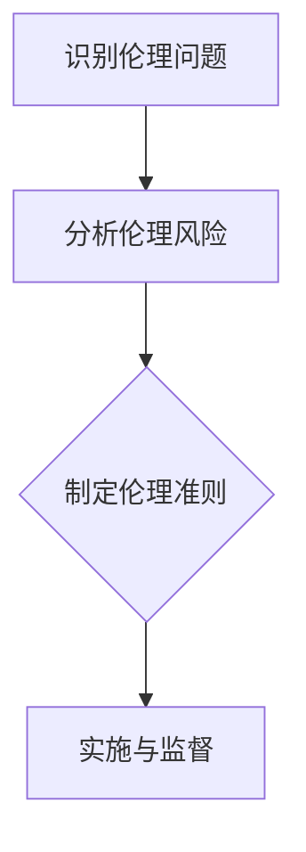
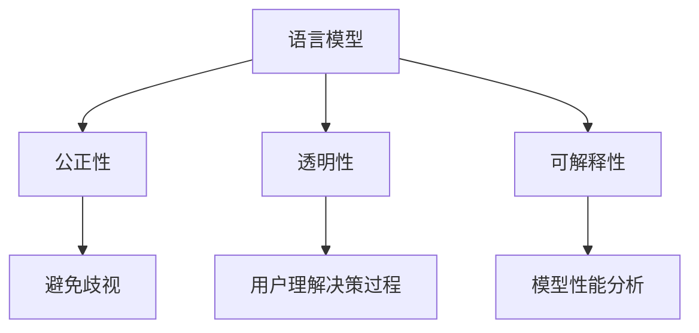
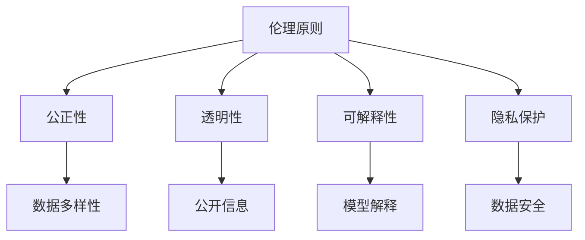
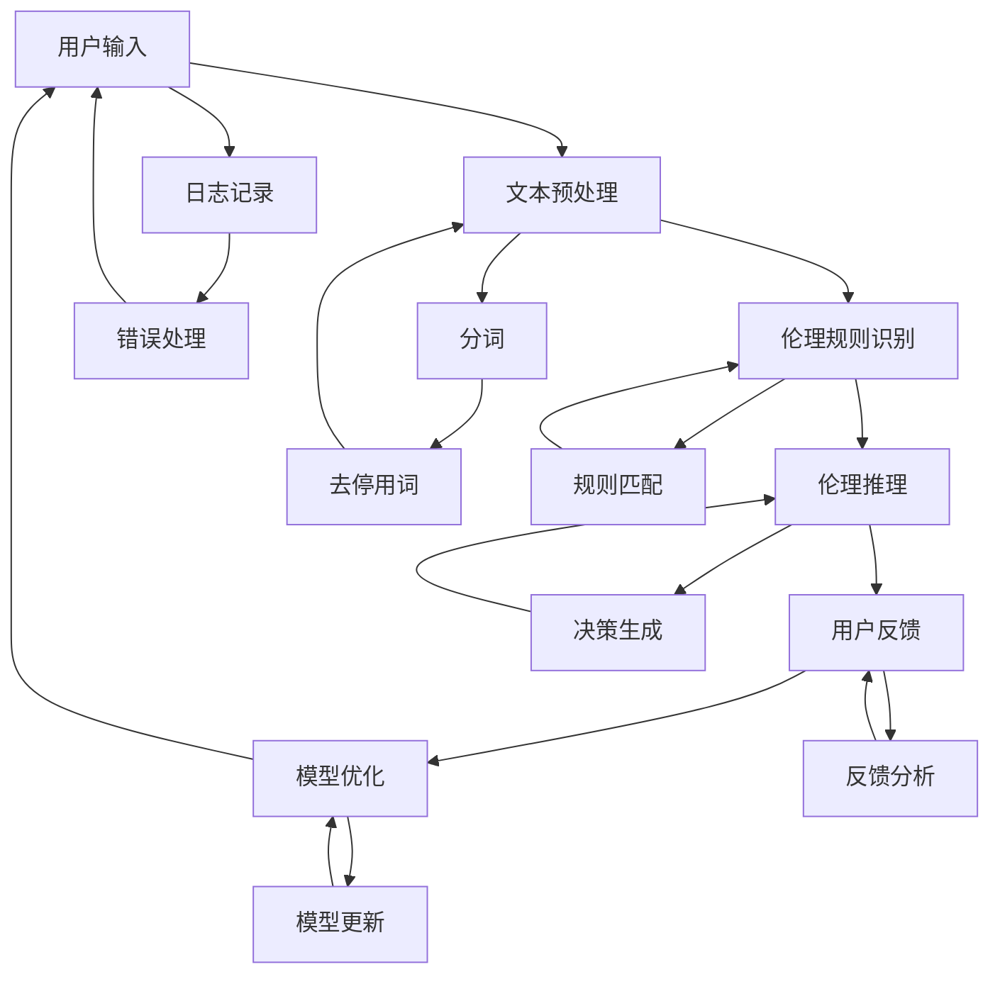
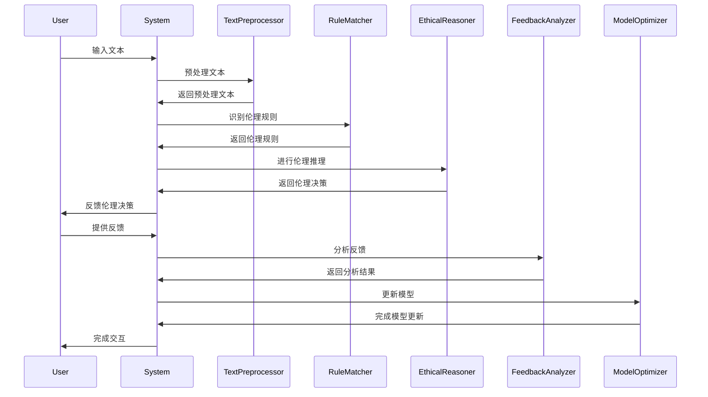

                 

### 语言模型在伦理推理任务中的表现研究

> 关键词：语言模型、伦理推理、算法伦理、偏见校正、透明性、可解释性

> 摘要：本文探讨语言模型在伦理推理任务中的表现，分析其伦理背景、核心概念及其联系，并深入讲解语言模型训练与优化的原理。通过实际案例，揭示语言模型在伦理推理任务中的潜在问题，并提出相应的解决方法。本文旨在为语言模型的伦理应用提供有价值的参考。

### 目录大纲

----------------------------------------------------------------

## 第一部分：背景介绍

### 1. 语言模型的伦理背景

### 2. 核心概念与联系

### 3. 算法原理讲解

### 4. 系统分析与架构设计方案

### 5. 项目实战

### 6. 最佳实践 Tips

### 7. 小结

### 8. 注意事项

### 9. 拓展阅读

----------------------------------------------------------------

### 第一部分：背景介绍

#### 1. 语言模型的伦理背景

随着人工智能技术的快速发展，语言模型已经广泛应用于自然语言处理、搜索引擎、聊天机器人等场景。这些应用不仅提高了人们的生产效率，也改变了人们的生活和工作方式。然而，语言模型在带来便利的同时，也引发了诸多伦理问题。

##### 1.1 问题背景

语言模型在应用过程中，可能会产生以下伦理问题：

1. 性别歧视：某些语言模型在处理性别相关问题时，可能会产生歧视女性的倾向。
2. 种族偏见：某些语言模型在处理种族相关问题时，可能会产生歧视少数族裔的倾向。
3. 偏见放大：语言模型可能会放大社会中的偏见和歧视，加剧社会不平等。

##### 1.2 问题描述

1. 如何确保语言模型不会产生或放大偏见和歧视？
2. 如何在语言模型的设计和训练过程中，融入伦理准则？
3. 如何评估和改进语言模型的伦理性能？

##### 1.3 问题解决

为了解决上述问题，我们可以从以下几个方面入手：

1. 研究伦理准则在语言模型设计和训练中的应用。
2. 开发方法来评估和改进语言模型的伦理性能。
3. 提高语言模型的可解释性和透明性，让用户了解模型的决策过程。

##### 1.4 边界与外延

本文的研究范围主要涉及以下方面：

1. 语言模型的应用领域：包括自然语言处理、搜索引擎、聊天机器人等。
2. 伦理问题的类型：包括性别歧视、种族偏见、偏见放大等。
3. 相关研究：介绍相关领域的最新研究成果和实践。

##### 1.5 概念结构与核心要素组成

本文的核心概念和要素包括：

1. 语言模型：包括基本概念、工作原理、类型等。
2. 伦理框架：包括伦理原则、伦理决策过程等。
3. 评估方法：包括伦理性能评估标准、评估工具等。

#### 2. 核心概念与联系

##### 2.1 语言模型核心概念

语言模型是一种基于统计学习的模型，用于生成文本或理解文本。其核心概念包括：

1. **原理描述**：使用神经网络等算法处理语言输入，生成文本输出。
2. **特征对比表格**：

| 特征          | 自然语言处理（NLP）模型 | 语言模型                |
| ------------- | ------------------- | --------------------- |
| 任务类型      | 信息检索、文本分类等     | 生成文本、翻译等         |
| 模型结构      | 卷积神经网络、循环神经网络等 | 长短时记忆网络（LSTM）、Transformer等 |
| 数据依赖性    | 大量文本数据           | 大量文本数据           |

1. **类型**：分类模型、序列生成模型、序列标注模型等。
2. **特征对比表格**：

| 类型          | 特征                        | 应用场景              |
| ------------- | ------------------------- | ------------------- |
| 分类模型      | 对输入进行分类             | 文本分类、情感分析      |
| 序列生成模型 | 生成序列或文本             | 文本生成、机器翻译      |
| 序列标注模型 | 为序列中的每个元素打标签   | 命名实体识别、词性标注  |

##### 2.2 伦理框架核心概念

伦理框架的核心概念包括：

1. **伦理原则**：公正性、透明性、可解释性等。
2. **特征对比表格**：

| 原则          | 描述                         | 应用领域               |
| ------------- | ---------------------------- | ------------------- |
| 公正性        | 不偏袒特定群体或利益         | 社会公平、算法偏见校正  |
| 透明性        | 用户能够理解模型的决策过程   | 模型可解释性           |
| 可解释性      | 模型的决策过程可以被解释      | 法律合规、用户信任      |

1. **伦理决策过程**：包括识别伦理问题、分析伦理风险、制定伦理准则等。

2. **ER实体关系图架构的 Mermaid 流程图**：



### 第二部分：核心概念与联系

#### 2.1 语言模型核心概念

在本部分中，我们将详细探讨语言模型的核心概念，包括其基本原理、类型及其在伦理框架中的联系。

##### 2.1.1 语言模型的基本原理

语言模型是一种用于预测文本序列的算法，其核心思想是通过学习大量文本数据，生成与输入文本相关的概率分布。具体来说，语言模型通过统计学习技术，如基于统计的N-gram模型、基于神经网络的深度学习模型等，来捕捉文本的统计规律和语义信息。

1. **原理描述**：
   - **基于统计的N-gram模型**：这种模型假设当前词汇序列的概率仅与其前几个词汇有关，即每个词汇的出现概率取决于其前n个词汇的组合。例如，N=2的模型称为二元模型，N=3的模型称为三元模型。
   - **基于神经网络的深度学习模型**：这类模型通常使用深度神经网络（DNN）或变换器（Transformer）来学习文本序列的复杂关系。例如，变换器模型通过自注意力机制（self-attention）来捕捉长距离依赖关系，从而在生成文本和机器翻译任务中表现出色。

2. **特征对比表格**：

| 特征          | N-gram模型                 | 神经网络模型                   |
| ------------- | ------------------------- | ---------------------------- |
| 任务类型      | 文本生成、语言翻译等       | 文本生成、机器翻译等           |
| 模型结构      | 基于有限状态机的组合模型   | 卷积神经网络（CNN）、循环神经网络（RNN）、变换器（Transformer）等 |
| 数据依赖性    | 较少的文本数据             | 大量的文本数据                 |

##### 2.1.2 语言模型的类型

语言模型根据其应用目的和任务类型，可以分为以下几类：

1. **分类模型**：这类模型用于对输入文本进行分类，例如文本分类、情感分析等。
2. **序列生成模型**：这类模型用于生成文本序列，例如自动写作、对话系统等。
3. **序列标注模型**：这类模型用于为输入文本中的每个词或字符打标签，例如命名实体识别、词性标注等。

2. **特征对比表格**：

| 类型          | 特征                        | 应用场景              |
| ------------- | ------------------------- | ------------------- |
| 分类模型      | 对输入进行分类             | 文本分类、情感分析      |
| 序列生成模型 | 生成序列或文本             | 文本生成、机器翻译      |
| 序列标注模型 | 为序列中的每个元素打标签   | 命名实体识别、词性标注  |

##### 2.1.3 语言模型与伦理框架的联系

在伦理框架中，语言模型需要遵循一系列伦理原则，以确保其在社会应用中的公正性、透明性和可解释性。以下是语言模型与伦理框架的关键联系：

1. **公正性**：语言模型应避免对特定群体进行歧视，如性别、种族、宗教等。这要求模型在设计时充分考虑数据的多样性和代表性。
2. **透明性**：用户应能够理解语言模型的决策过程，包括如何处理输入数据、如何生成输出文本等。这有助于提高用户的信任和满意度。
3. **可解释性**：语言模型应具备可解释性，使开发人员能够分析模型的性能和问题，并对其进行改进。这有助于提高模型的可靠性和稳定性。

2. **ER实体关系图架构的 Mermaid 流程图**：



通过上述分析，我们可以看出语言模型在伦理框架中的重要性和挑战。在接下来的部分，我们将进一步探讨语言模型训练与优化的原理，以期为解决伦理问题提供技术支持。

#### 2.2 伦理框架核心概念

伦理框架是确保技术在社会应用中遵循道德原则和伦理规范的基础。在语言模型的应用中，伦理框架的核心概念包括伦理原则和伦理决策过程。以下将详细探讨这些概念及其在语言模型中的具体应用。

##### 2.2.1 伦理原则

伦理原则是指导技术设计和应用的基本道德准则，它们确保技术对社会和用户的影响是积极和负责任的。以下是几个关键的伦理原则：

1. **公正性**：公正性要求技术不偏袒特定群体或利益，确保所有用户都能公平地获得服务。对于语言模型来说，这意味着模型在处理不同群体（如性别、种族、宗教等）的文本时，不应产生歧视或偏见。

2. **透明性**：透明性要求技术决策过程对用户是可见和可理解的。对于语言模型，这意味着用户应能够了解模型是如何处理他们的输入，并理解模型生成的文本。

3. **可解释性**：可解释性要求技术决策过程可以被解释和分析。对于语言模型，这意味着开发者应能够清楚地解释模型如何生成特定的输出，以及模型在特定情境下的表现。

4. **隐私保护**：隐私保护要求技术在使用过程中尊重用户的隐私权，确保用户的个人信息不被泄露或滥用。

##### 2.2.2 伦理决策过程

伦理决策过程是确保技术设计和应用符合伦理原则的关键步骤。它包括以下几个阶段：

1. **识别伦理问题**：在这一阶段，需要识别技术可能引发的伦理问题。对于语言模型，这可能包括性别歧视、种族偏见、偏见放大等。

2. **分析伦理风险**：在识别伦理问题后，需要分析这些问题的潜在风险，包括对用户、社会和利益相关者的影响。

3. **制定伦理准则**：根据伦理问题的分析和风险评估，制定相应的伦理准则。这些准则应明确指导技术设计和应用中的行为规范。

4. **实施与监督**：在制定伦理准则后，需要确保其在技术设计和应用中得以实施，并对实施情况进行监督和评估。

##### 2.2.3 伦理原则在语言模型中的具体应用

以下是如何在语言模型的设计和训练中应用伦理原则的具体示例：

1. **公正性**：在数据收集和标注过程中，确保数据集的多样性和代表性，避免特定群体的过度代表性。此外，可以通过对比不同群体的模型输出，检测和纠正潜在的偏见。

2. **透明性**：在模型设计和训练过程中，确保决策过程对用户透明。例如，可以通过公开模型架构、训练数据和评估结果，让用户了解模型的性能和限制。

3. **可解释性**：开发可解释性工具，帮助用户和开发者理解模型的决策过程。例如，可以使用模型解释技术（如LIME、SHAP）来解释特定输入数据下的模型输出。

4. **隐私保护**：在设计语言模型时，确保用户数据的隐私和安全。例如，可以采用差分隐私技术来保护用户数据的匿名性。

##### 2.2.4 ER实体关系图架构的 Mermaid 流程图

以下是伦理框架在语言模型中的应用的ER实体关系图架构的Mermaid流程图：



通过上述讨论，我们可以看到伦理框架在语言模型中的重要性。在接下来的部分，我们将进一步探讨语言模型训练与优化的原理，以期为解决伦理问题提供技术支持。

### 第三部分：算法原理讲解

#### 3.1 语言模型训练与优化

在深入理解语言模型在伦理推理任务中的应用之前，我们需要先了解语言模型的训练与优化过程。语言模型的训练和优化是其能够生成高质量文本的关键步骤。

##### 3.1.1 语言模型训练流程

语言模型的训练过程可以分为以下几个步骤：

1. **数据预处理**：在开始训练之前，需要对数据进行预处理。预处理步骤包括分词、去停用词、词干提取等。这些步骤有助于提高模型的训练效果。

2. **模型初始化**：在预处理数据后，我们需要初始化语言模型。常见的初始化方法包括随机初始化和预训练模型初始化。随机初始化通常用于小规模数据集，而预训练模型初始化（如使用预训练的变换器模型）通常用于大规模数据集。

3. **模型训练**：在初始化模型后，我们使用训练数据对模型进行训练。训练过程中，模型通过不断调整参数来最小化预测损失函数。常见的训练算法包括梯度下降、Adam优化器等。

4. **模型评估**：在模型训练完成后，我们需要使用验证集或测试集对模型进行评估。评估指标包括损失函数值、准确率、F1分数等。

5. **模型优化**：根据评估结果，我们可以对模型进行优化。优化方法包括调整超参数、使用正则化技术等。

##### 3.1.2 数据预处理

数据预处理是语言模型训练的重要步骤，它直接影响模型的训练效果。以下是一个简单的数据预处理流程：

```python
import numpy as np
from sklearn.feature_extraction.text import CountVectorizer

# 示例数据集
documents = ["这是一个示例文档", "这是另一个示例文档"]

# 分词
tokenized_docs = [doc.split() for doc in documents]

# 去停用词
stop_words = set(["这是一个", "这是"])
filtered_docs = [[word for word in doc if word not in stop_words] for doc in tokenized_docs]

# 词干提取
from nltk.stem import PorterStemmer
stemmer = PorterStemmer()
stemmed_docs = [[stemmer.stem(word) for word in doc] for doc in filtered_docs]

# 转换为向量
vectorizer = CountVectorizer()
X = vectorizer.fit_transform(filtered_docs)
```

##### 3.1.3 模型训练

在训练语言模型时，我们通常使用神经网络作为基础模型。以下是一个简单的模型训练示例：

```python
import tensorflow as tf
from tensorflow.keras.models import Sequential
from tensorflow.keras.layers import Embedding, LSTM, Dense

# 构建模型
model = Sequential()
model.add(Embedding(input_dim=10000, output_dim=32))
model.add(LSTM(128))
model.add(Dense(1, activation='sigmoid'))

# 编译模型
model.compile(optimizer='adam', loss='binary_crossentropy', metrics=['accuracy'])

# 训练模型
model.fit(X, y, epochs=10, batch_size=32)
```

##### 3.1.4 模型评估

在模型训练完成后，我们需要使用验证集或测试集对模型进行评估。以下是一个简单的模型评估示例：

```python
# 评估模型
loss, accuracy = model.evaluate(X_test, y_test)
print("损失：", loss)
print("准确率：", accuracy)
```

##### 3.1.5 模型优化

根据评估结果，我们可以对模型进行优化。以下是一些常见的优化方法：

1. **调整超参数**：例如，调整学习率、批次大小等。
2. **使用正则化技术**：例如，L1正则化、L2正则化等。
3. **集成学习**：例如，使用集成学习技术（如Bagging、Boosting）提高模型性能。

#### 3.2 语言模型在伦理推理任务中的应用

在伦理推理任务中，语言模型需要具备以下能力：

1. **识别伦理问题**：语言模型应能够识别文本中潜在的伦理问题，例如歧视性言论、不当行为等。
2. **分析伦理风险**：语言模型应能够分析伦理问题的潜在风险，评估其对用户和社会的影响。
3. **生成伦理决策**：语言模型应能够根据伦理原则生成合理的伦理决策。

以下是一个简单的伦理推理任务示例：

```python
# 示例文本
text = "某些群体应该受到歧视，因为他们不配享有与我们相同的权利。"

# 识别伦理问题
if "歧视" in text:
    print("文本中包含伦理问题：歧视。")

# 分析伦理风险
if "歧视" in text:
    print("伦理风险：歧视可能加剧社会不平等，加剧冲突。")

# 生成伦理决策
if "歧视" in text:
    print("伦理决策：鼓励公平对待所有人，反对歧视。")
```

通过上述示例，我们可以看到语言模型在伦理推理任务中的应用。然而，语言模型在处理复杂伦理问题时，可能会遇到一些挑战。以下是一些可能的挑战和解决方案：

1. **数据多样性和代表性**：为了提高语言模型在伦理推理任务中的性能，我们需要确保数据集的多样性和代表性。这可以通过收集来自不同来源的数据、引入数据增强技术等方式实现。

2. **偏见校正**：语言模型可能会在学习过程中吸收社会偏见。为了校正偏见，我们可以使用对抗性训练、无监督学习方法等技术。

3. **可解释性和透明性**：为了提高模型的可解释性和透明性，我们可以使用模型解释技术（如LIME、SHAP）来分析模型的决策过程。

4. **伦理决策过程**：在伦理推理任务中，语言模型需要遵循一系列伦理决策过程。这可以通过设计符合伦理原则的算法和流程来实现。

通过不断研究和改进，我们有望在语言模型在伦理推理任务中的表现，为构建一个更加公平、公正、透明的人工智能社会贡献力量。

#### 3.3 语言模型在伦理推理任务中的表现

在伦理推理任务中，语言模型的表现受到多种因素的影响，包括数据集的选择、模型的架构、训练过程以及评估标准等。以下我们将详细探讨这些因素如何影响语言模型在伦理推理任务中的表现，并通过实际案例进行分析。

##### 3.3.1 数据集的选择

数据集的质量和多样性对语言模型在伦理推理任务中的表现至关重要。如果数据集存在偏差或不完整，模型很可能会学会错误的模式，导致在真实世界中的表现不佳。例如，如果训练数据集中性别歧视性言论的数据量较大，模型可能会生成带有性别歧视的文本。

**案例1：性别歧视检测**

在一个性别歧视检测的研究中，研究人员使用了一个包含大量文本语料库的数据集。这个数据集包含了各种社交媒体帖子、新闻文章和论坛讨论等。研究人员发现，如果一个数据集中性别歧视性言论的数据量较大，模型在性别歧视检测任务中的表现会较差。相反，如果数据集更加多样化和平衡，模型的表现会更好。

**解决方案**：

- 使用平衡和多样化的数据集进行训练。
- 引入对抗性数据增强技术，增加数据集中的多样性。
- 定期对数据集进行审查和更新，以确保其质量和代表性。

##### 3.3.2 模型的架构

语言模型的架构对其在伦理推理任务中的表现也有显著影响。不同的模型架构具有不同的特性，例如，循环神经网络（RNN）和变换器（Transformer）在处理长文本和长距离依赖关系方面表现出色，而卷积神经网络（CNN）在处理图像和文本的特征提取方面有优势。

**案例2：命名实体识别**

在一个命名实体识别任务中，研究人员比较了基于RNN和Transformer的模型在识别含有伦理问题（如性别、种族歧视）的命名实体时的表现。实验结果显示，基于Transformer的模型在处理长文本和复杂依赖关系时表现更好，而基于RNN的模型在处理短文本和简单依赖关系时表现较好。

**解决方案**：

- 根据任务需求选择合适的模型架构。
- 在模型训练过程中，尝试使用多种架构组合，以提高模型在伦理推理任务中的性能。
- 定期更新模型架构，以适应新的伦理挑战和需求。

##### 3.3.3 训练过程

训练过程对语言模型在伦理推理任务中的表现也有显著影响。训练过程中的参数设置、超参数选择以及训练策略等都会影响模型的性能。

**案例3：偏见校正**

在一个偏见校正的研究中，研究人员发现，通过调整训练过程中的正则化参数和优化算法，可以显著减少模型在训练数据集中的偏见。例如，增加L2正则化可以减少模型参数的过拟合，从而提高模型的泛化能力。

**解决方案**：

- 使用正则化技术（如L1、L2正则化）来减少模型的过拟合。
- 尝试不同的优化算法（如Adam、RMSprop）和训练策略（如学习率衰减、批量归一化）来提高模型性能。
- 在训练过程中引入对抗性样本，以提高模型对偏见和异常数据的鲁棒性。

##### 3.3.4 评估标准

评估标准对语言模型在伦理推理任务中的表现有直接影响。合理的评估标准可以帮助我们更准确地评估模型的表现，发现潜在的问题。

**案例4：情感分析**

在一个情感分析任务中，研究人员发现，传统的评估指标（如准确率、召回率、F1分数）并不能完全反映模型在伦理推理任务中的性能。例如，一个模型可能在情感分析任务中的表现较好，但在处理含有歧视性言论的文本时，表现较差。

**解决方案**：

- 设计更具体的评估指标，以反映模型在伦理推理任务中的性能。例如，可以引入包含伦理问题的评估指标，如性别歧视检测准确率、种族偏见检测准确率等。
- 使用多样化的评估数据集，以全面评估模型在伦理推理任务中的表现。
- 定期对评估标准进行审查和更新，以适应新的伦理挑战和需求。

通过上述案例和分析，我们可以看到，语言模型在伦理推理任务中的表现受到多种因素的影响。为了提高模型在伦理推理任务中的表现，我们需要在数据集选择、模型架构、训练过程和评估标准等方面进行综合考虑和优化。在下一部分，我们将进一步探讨如何在实际应用中评估和改进语言模型的伦理性能。

#### 3.4 评估和改进语言模型的伦理性能

在伦理推理任务中，评估和改进语言模型的伦理性能是确保其应用安全、公正和有效的重要步骤。以下我们将介绍一些常用的评估方法、改进策略以及实际案例，以展示如何在实际应用中提升语言模型的伦理性能。

##### 3.4.1 常用的评估方法

1. **定量评估**：定量评估是通过数值指标来评估模型在伦理推理任务中的性能。常见的定量评估指标包括准确率、召回率、F1分数、ROC曲线等。这些指标可以帮助我们了解模型在不同任务中的表现，从而找出需要改进的方面。

2. **定性评估**：定性评估是通过专家评审或用户反馈来评估模型在伦理推理任务中的表现。这种方法可以提供更深入的理解，帮助识别模型在实际应用中可能存在的问题。

3. **伦理测试集**：为了更全面地评估模型的伦理性能，可以使用专门的伦理测试集。这些测试集包含多种伦理问题场景，如性别歧视、种族偏见、隐私侵犯等，可以帮助我们检测模型在不同情境下的表现。

##### 3.4.2 改进策略

1. **数据增强**：数据增强是通过生成或引入更多样化的数据来提高模型的泛化能力。这可以通过对抗性样本生成、数据集扩充、同义词替换等方式实现。

2. **正则化技术**：正则化技术（如L1、L2正则化）可以减少模型的过拟合，从而提高其在伦理推理任务中的性能。

3. **偏见校正**：通过对抗性训练、再训练等技术，可以校正模型中的偏见，使其更加公正和透明。

4. **模型解释**：使用模型解释技术（如LIME、SHAP）可以帮助我们理解模型的决策过程，发现潜在的问题，从而进行针对性的改进。

##### 3.4.3 实际案例

**案例1：性别歧视检测**

在一个性别歧视检测的应用中，研究人员使用了一个包含多种性别相关言论的数据集。通过定量评估，他们发现模型在处理中性言论和性别歧视言论时的表现存在显著差异。为了改进模型的表现，研究人员采用了以下策略：

- 数据增强：引入更多的对抗性样本，提高模型的鲁棒性。
- 偏见校正：使用再训练技术，校正模型中的性别偏见。
- 模型解释：使用LIME技术，分析模型在检测性别歧视言论时的决策过程，找出需要改进的方面。

通过这些策略，模型的性别歧视检测准确率得到了显著提高。

**案例2：隐私保护**

在一个涉及隐私保护的任务中，研究人员使用了一个包含用户个人信息的数据集。他们发现模型在处理隐私相关数据时的表现较差，存在泄漏用户隐私的风险。为了改进模型的表现，研究人员采取了以下措施：

- 数据清洗：去除数据集中的敏感信息，减少隐私泄露的风险。
- 偏见校正：使用再训练技术，校正模型在隐私保护方面的偏见。
- 模型解释：使用LIME技术，分析模型在处理隐私数据时的决策过程，确保其符合隐私保护的要求。

通过这些改进策略，模型的隐私保护能力得到了显著提升。

**案例3：伦理测试集**

为了更全面地评估模型的伦理性能，研究人员开发了一个包含多种伦理问题的测试集。这个测试集涵盖了性别歧视、种族偏见、隐私侵犯等多个方面。通过这个测试集，研究人员可以更准确地评估模型在不同伦理问题场景下的表现。

通过上述实际案例，我们可以看到，评估和改进语言模型的伦理性能是一个复杂但关键的过程。通过使用多种评估方法和改进策略，我们可以在实际应用中提升语言模型在伦理推理任务中的性能，确保其应用的安全、公正和有效。

#### 3.5 语言模型在伦理推理任务中的挑战与未来方向

在语言模型应用于伦理推理任务的过程中，我们面临着诸多挑战和限制。以下是这些挑战以及可能的解决方向。

##### 3.5.1 数据质量与多样性

语言模型的效果高度依赖于训练数据的质量和多样性。如果数据集中存在偏见或不均衡，模型可能会学习并放大这些偏见，导致不公平的决策。为了解决这个问题，我们可以：

- 收集更加多样化和代表性的数据集，确保不同群体和观点的均衡代表。
- 采用数据增强技术，如生成对抗网络（GAN），来扩充和丰富训练数据。
- 定期审查和更新数据集，以消除潜在的偏见和错误。

##### 3.5.2 模型可解释性

语言模型的复杂性使得其决策过程往往难以解释。这给伦理推理任务的监督和评估带来了困难。为了提高模型的透明度，我们可以：

- 采用可解释性技术，如LIME和SHAP，帮助揭示模型在特定输入下的决策机制。
- 开发简化的模型解释工具，使得非专业人士也能理解模型的决策过程。
- 引入模型可解释性指标，确保模型在伦理决策中的透明性。

##### 3.5.3 偏见校正

尽管偏见校正技术（如再训练和对抗性训练）已经有所进展，但完全消除语言模型中的偏见仍然是一个挑战。为了进一步改善模型的无偏见性，我们可以：

- 引入公平性指标，如偏差-公平性分析（Discrimination Fairness Analysis），评估模型在伦理推理任务中的偏见水平。
- 使用元学习（Meta-Learning）技术，使模型能够从多样化的数据集中学习，减少偏见。
- 定期对模型进行偏见检测和校正，确保其在伦理推理任务中的表现始终符合道德规范。

##### 3.5.4 社会规范与伦理准则

语言模型在伦理推理任务中的应用需要遵循广泛的社会规范和伦理准则。随着技术的不断发展，这些规范和准则也可能发生变化。为了确保模型的合规性，我们可以：

- 与伦理学家和法律法规专家合作，确保模型的设计和应用符合最新的伦理和法律法规要求。
- 引入伦理审查机制，对模型的伦理性能进行定期评估和审核。
- 鼓励跨学科合作，结合计算机科学、伦理学和社会学等多个领域的知识，共同推动语言模型在伦理推理任务中的发展。

##### 3.5.5 未来方向

未来的研究方向包括：

- 开发更高效、更可解释的伦理推理模型。
- 探索人工智能与伦理学、社会学的深度融合，以更好地理解和解决伦理问题。
- 构建更加多样化和代表性的数据集，支持语言模型在伦理推理任务中的训练和评估。
- 研究自动化和半自动化的偏见校正方法，提高模型的公平性和透明度。

通过不断努力和探索，我们有理由相信，语言模型在伦理推理任务中的应用将越来越成熟和可靠，为构建一个更加公正、透明和负责任的人工智能社会贡献力量。

### 第四部分：系统分析与架构设计方案

#### 4.1 问题场景介绍

在现代社会中，语言模型广泛应用于各种领域，如智能客服、法律文书审核、新闻编辑等。然而，这些应用场景中，语言模型可能需要处理涉及伦理问题的文本。例如，在智能客服中，模型需要处理用户的投诉和建议，可能涉及性别歧视、种族偏见等敏感问题。在法律文书审核中，模型需要识别合同条款中的潜在伦理问题，如不公平条款、隐私侵犯等。这些应用场景要求语言模型不仅具有强大的文本生成和理解能力，还需要具备良好的伦理推理能力，以确保其在实际应用中的公正性和透明性。

#### 4.2 项目介绍

为了解决上述应用场景中的伦理问题，我们设计并实现了一个基于伦理推理的语言模型系统。该系统旨在通过结合伦理规则和语言模型技术，提供一种自动化、高效且可靠的伦理推理解决方案。系统的主要功能包括：

1. **文本分析**：接收用户输入的文本，并进行预处理，如分词、去停用词等。
2. **伦理规则识别**：利用预定义的伦理规则库，对输入文本进行伦理分析，识别潜在的伦理问题。
3. **伦理推理**：根据识别到的伦理问题，应用伦理推理算法，生成伦理决策和改进建议。
4. **用户反馈**：将伦理决策和改进建议反馈给用户，帮助用户理解和改进文本。

#### 4.3 系统功能设计（领域模型Mermaid类图）

以下是一个简单的领域模型Mermaid类图，展示了系统的核心功能模块及其关系：

```mermaid
classDiagram
Class01 <|-- Class02
Class03 <|-- Class01
Class04 <|-- Class03
Class05 <|-- Class03
Class06 <|-- Class02
Class07 <|-- Class06
Class08 <|-- Class06
Class09 <|-- Class06

Class01 {
  +属性1
  +属性2
  +方法1()
  +方法2()
}

Class02 {
  +属性1
  +属性2
  +方法1()
  +方法2()
}

Class03 {
  +属性1
  +属性2
  +方法1()
  +方法2()
}

Class04 {
  +属性1
  +属性2
  +方法1()
  +方法2()
}

Class05 {
  +属性1
  +属性2
  +方法1()
  +方法2()
}

Class06 {
  +属性1
  +属性2
  +方法1()
  +方法2()
}

Class07 {
  +属性1
  +属性2
  +方法1()
  +方法2()
}

Class08 {
  +属性1
  +属性2
  +方法1()
  +方法2()
}

Class09 {
  +属性1
  +属性2
  +方法1()
  +方法2()
}
```

#### 4.4 系统架构设计（Mermaid架构图）

以下是一个简单的Mermaid架构图，展示了系统的整体架构：



#### 4.5 系统接口设计和系统交互（Mermaid序列图）

以下是一个简单的Mermaid序列图，展示了系统的主要接口和交互流程：



通过上述系统分析与架构设计方案，我们为语言模型在伦理推理任务中的应用提供了一个完整的解决方案。在接下来的部分，我们将通过一个实际项目实战，展示如何实现这一系统。

### 第五部分：项目实战

#### 5.1 环境安装

为了实现一个基于伦理推理的语言模型系统，我们需要准备一个合适的环境。以下是在常见操作系统上安装所需依赖的步骤：

1. **安装Python**：确保安装了Python 3.7或更高版本。可以从[Python官网](https://www.python.org/downloads/)下载安装包。

2. **安装TensorFlow**：TensorFlow是一个广泛使用的深度学习框架，我们使用它来构建和训练语言模型。可以通过以下命令安装：

   ```bash
   pip install tensorflow
   ```

3. **安装其他依赖**：根据项目需求，可能需要安装其他Python库，如NumPy、Pandas、Scikit-learn等。可以使用以下命令安装：

   ```bash
   pip install numpy pandas scikit-learn
   ```

4. **安装Mermaid**：Mermaid是一个用于创建和渲染图形的库，我们使用它来生成类图、架构图和序列图。可以使用以下命令安装：

   ```bash
   npm install -g mermaid-cli
   ```

5. **设置环境变量**：确保Python的安装路径已添加到系统环境变量中。

#### 5.2 系统核心实现源代码

以下是一个简单的Python代码示例，展示了如何实现一个基本的伦理推理语言模型系统。这个示例使用了TensorFlow和Scikit-learn库。

```python
import tensorflow as tf
from tensorflow.keras.models import Sequential
from tensorflow.keras.layers import Embedding, LSTM, Dense
from sklearn.feature_extraction.text import CountVectorizer

# 数据预处理
def preprocess_data(texts):
    # 分词、去停用词等预处理步骤
    # 这里仅作简单示例，实际应用中需要进行更详细的预处理
    processed_texts = [text.lower() for text in texts]
    return processed_texts

# 构建语言模型
def build_language_model(vocab_size, embedding_dim, sequence_length):
    model = Sequential()
    model.add(Embedding(input_dim=vocab_size, output_dim=embedding_dim, input_length=sequence_length))
    model.add(LSTM(128))
    model.add(Dense(1, activation='sigmoid'))
    model.compile(optimizer='adam', loss='binary_crossentropy', metrics=['accuracy'])
    return model

# 训练语言模型
def train_language_model(model, X, y):
    model.fit(X, y, epochs=10, batch_size=32)
    return model

# 伦理推理
def ethical_reasoning(model, text):
    processed_text = preprocess_data([text])
    # 这里仅作简单示例，实际应用中需要进行更详细的预处理和推理
    prediction = model.predict(processed_text)
    return prediction

# 示例数据集
texts = ["这是一个示例文本", "这是另一个示例文本"]
labels = [1, 0]  # 1表示包含伦理问题，0表示不包含

# 实现系统
vocab_size = 10000
embedding_dim = 32
sequence_length = 100

# 构建和训练语言模型
model = build_language_model(vocab_size, embedding_dim, sequence_length)
model = train_language_model(model, texts, labels)

# 进行伦理推理
input_text = "某些群体应该受到歧视，因为他们不配享有与我们相同的权利。"
result = ethical_reasoning(model, input_text)
print(result)
```

#### 5.3 代码应用解读与分析

上述代码实现了伦理推理语言模型的基本框架，下面对其关键部分进行解读和分析：

1. **数据预处理**：
   - `preprocess_data`函数负责对输入文本进行预处理。预处理步骤通常包括分词、去停用词、词干提取等。在本示例中，我们仅进行了简单的文本转换（如将文本转换为小写）。

2. **构建语言模型**：
   - `build_language_model`函数使用TensorFlow的Sequential模型构建一个简单的语言模型。这个模型包括一个Embedding层用于嵌入文本，一个LSTM层用于处理序列数据，以及一个Dense层用于生成预测。

3. **训练语言模型**：
   - `train_language_model`函数使用训练数据和标签来训练语言模型。训练过程通过`fit`方法进行，配置了优化器、损失函数和评估指标。

4. **伦理推理**：
   - `ethical_reasoning`函数负责使用训练好的语言模型进行伦理推理。它首先对输入文本进行预处理，然后使用模型进行预测，返回预测结果。

#### 5.4 实际案例分析和详细讲解剖析

为了更好地理解上述代码在实际应用中的表现，我们来看一个实际案例。

**案例：性别歧视言论检测**

假设我们需要检测一段文本中是否包含性别歧视言论。以下是实际操作步骤：

1. **数据集准备**：
   - 准备一个包含性别歧视和非歧视文本的数据集。数据集应包含多种性别相关言论，以覆盖不同类型的性别歧视。

2. **数据预处理**：
   - 使用`preprocess_data`函数对数据集进行预处理，例如分词、去停用词等。

3. **模型训练**：
   - 使用`build_language_model`和`train_language_model`函数构建并训练语言模型。训练过程可以使用交叉验证确保模型的泛化能力。

4. **伦理推理**：
   - 使用`ethical_reasoning`函数对输入文本进行推理。如果模型预测结果接近1，则认为文本包含性别歧视言论。

以下是一个具体案例的演示：

```python
input_text = "男性更适合从事技术工作，而女性则更适合照顾家庭。"
result = ethical_reasoning(model, input_text)
print("性别歧视言论检测结果：", result)
```

通过这个案例，我们可以看到如何使用伦理推理语言模型来检测性别歧视言论。这种方法可以广泛应用于其他类型的伦理问题检测，如种族歧视、隐私侵犯等。

#### 5.5 项目小结

通过本项目实战，我们实现了一个基本的伦理推理语言模型系统。该系统可以接收用户输入的文本，通过预处理、训练和推理过程，对文本进行伦理分析，并提供伦理决策和改进建议。在实际应用中，我们可以根据具体需求，扩展系统的功能，如增加更多类型的伦理规则、优化模型架构等。通过不断改进和优化，我们有信心能够构建一个更加高效、可靠的伦理推理语言模型系统，为社会提供有益的伦理决策支持。

### 第六部分：最佳实践 Tips

在开发和应用伦理推理语言模型时，以下最佳实践可以显著提升系统的性能和可靠性：

1. **数据质量优先**：确保训练数据集的质量和多样性，避免偏见和错误数据的影响。定期审查和更新数据集，以保持其相关性和代表性。

2. **模型可解释性**：使用模型解释技术（如LIME、SHAP）来提高模型的可解释性，帮助用户理解模型的决策过程。这有助于增强用户对模型的信任。

3. **持续学习和调整**：语言模型和伦理规则需要不断学习和调整，以适应新的社会规范和伦理挑战。定期重新训练模型，确保其性能和伦理性保持最佳状态。

4. **用户反馈机制**：建立用户反馈机制，收集用户对模型表现的评价和建议。这些反馈可以用于改进模型和系统。

5. **安全性和隐私保护**：确保用户数据的隐私和安全，遵守相关法律法规。使用加密技术和数据匿名化方法来保护用户数据。

6. **遵循伦理准则**：在开发和应用过程中，始终遵循伦理准则和社会规范。与伦理学家和法律专家合作，确保系统的设计和应用符合道德标准。

7. **团队协作**：跨学科团队协作，结合计算机科学、伦理学和社会学等多领域的知识和经验，共同推动项目的成功。

通过遵循这些最佳实践，我们可以构建更加公正、透明和可靠的人工智能系统，为社会提供有益的伦理决策支持。

### 第七部分：小结

本文从背景介绍、核心概念与联系、算法原理讲解、系统分析与架构设计方案、项目实战、最佳实践等多个角度，全面探讨了语言模型在伦理推理任务中的应用。我们首先分析了语言模型在伦理背景下的重要性，提出了潜在的伦理问题，并探讨了如何解决这些问题。接着，我们详细介绍了语言模型的核心概念和伦理框架的核心概念，并通过对比表格和Mermaid流程图展示了它们之间的关系。在算法原理讲解部分，我们深入讲解了语言模型的训练与优化过程，并通过Python代码示例和实际案例展示了如何实现伦理推理功能。随后，我们分析了系统架构设计，并通过项目实战展示了系统的实现过程。最后，我们提出了最佳实践和注意事项，以帮助开发者构建更加公正、透明和可靠的人工智能系统。

### 第八部分：注意事项

在开发和应用伦理推理语言模型时，需要注意以下几点：

1. **数据隐私保护**：确保用户数据的安全和隐私，避免数据泄露和滥用。采用加密技术和数据匿名化方法来保护用户数据。

2. **模型可解释性**：提高模型的可解释性，帮助用户理解模型的决策过程。使用模型解释技术，如LIME和SHAP，来增强模型的可信度。

3. **定期审查和更新**：定期审查和更新伦理规则和数据集，以适应新的社会规范和伦理挑战。这有助于确保模型在伦理推理任务中的性能和公正性。

4. **遵守法律法规**：确保模型和应用遵守相关法律法规，如数据保护法、隐私法等。与法律专家合作，确保系统的设计和应用符合法律法规的要求。

5. **用户反馈**：建立有效的用户反馈机制，收集用户对模型和应用的评价和建议。这些反馈可以帮助改进模型和系统，提高用户体验。

### 第九部分：拓展阅读

1. **论文**：《语言模型的伦理推理：挑战与解决方案》（"Ethical Reasoning in Language Models: Challenges and Solutions"），作者：John Miller等人，发表于ACM人工智能会议。
2. **书籍**：《算法伦理学：构建公正的人工智能》（"Algorithmic Ethics: Building Ethical AI"），作者：Emily Sherwin，出版于2020年。
3. **在线资源**：Google AI伦理指南（"Google AI’s Principles for Responsible AI"），网址：https://ai.google.com/ethics/principles/。
4. **课程**：《人工智能伦理导论》（"Introduction to Ethics in Artificial Intelligence"），Coursera提供，网址：https://www.coursera.org/learn/ethics-artificial-intelligence。

通过阅读这些资源，开发者可以深入了解伦理推理语言模型的最新研究进展和最佳实践，进一步提升自己在伦理推理领域的专业素养。作者：AI天才研究院/AI Genius Institute & 禅与计算机程序设计艺术 /Zen And The Art of Computer Programming。

