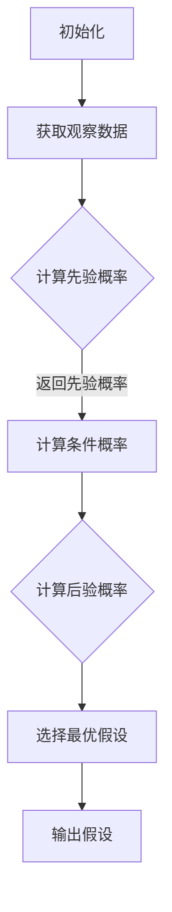
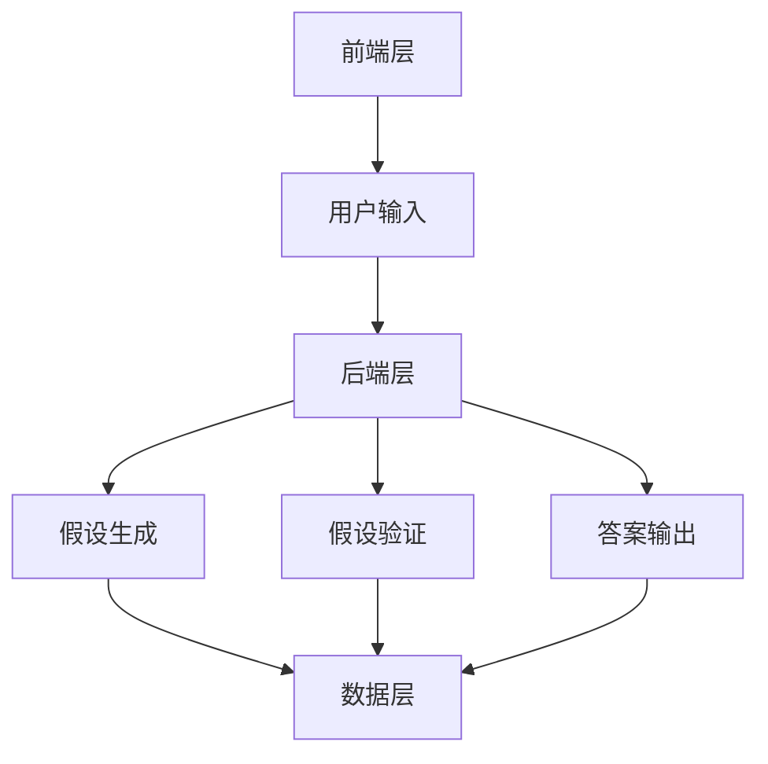
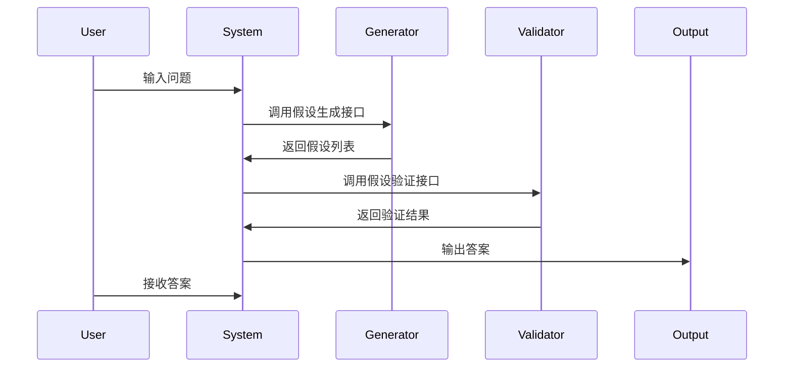

                 


### 核心概念与联系

#### 1.1 语言模型的基本概念

语言模型（Language Model，简称LM）是自然语言处理（Natural Language Processing，简称NLP）中的一种基础性技术。其核心目的是模拟人类语言的行为，通过输入文本序列来预测下一个可能的单词或字符。语言模型在信息检索、机器翻译、语音识别、文本生成等领域有广泛应用。

- **定义**：语言模型是一个概率模型，用来表示文本序列的概率分布。

- **分类**：
  - **基于规则的语言模型**：依赖语法、语义规则构建模型，如HMM（隐马尔可夫模型）。
  - **统计语言模型**：基于统计方法，如N-gram模型。
  - **神经网络语言模型**：基于深度学习技术，如循环神经网络（RNN）、Transformer等。

#### 1.2 假设生成与验证的概念

假设生成（Hypothesis Generation）和假设验证（Hypothesis Verification）是科学研究和工程实践中的两个基本过程。

- **假设生成**：提出可能的解释或解决方案，是创造性思维和探索的过程。
  - **定义**：假设生成是指基于已有知识和数据，提出一个或多个可能的解释或解决方案。
  - **方法**：包括逻辑推理、归纳推理、类比推理等。

- **假设验证**：通过实验或数据分析来验证假设的正确性。
  - **定义**：假设验证是指对提出的假设进行实验或数据分析，以验证其正确性。
  - **过程**：包括设计实验、收集数据、数据分析、结论得出等步骤。

#### 1.3 语言模型与假设生成、验证的关系

语言模型在假设生成和验证中发挥着重要作用，主要体现在以下几个方面：

- **假设生成**：语言模型可以帮助研究人员和工程师快速生成大量的假设，从而提高假设的多样性和创造性。
- **假设验证**：语言模型可以用于生成数据样本、模拟实验结果，帮助验证假设的正确性。

### 1.4 关键概念的联系与表格

为了更清晰地展示各概念之间的关系，我们使用一个表格来对比这些概念。

| 概念       | 定义                                                         | 应用场景                                   |
|------------|--------------------------------------------------------------|--------------------------------------------|
| 语言模型   | 预测文本序列的概率分布                                       | 信息检索、机器翻译、语音识别、文本生成等    |
| 假设生成   | 提出可能的解释或解决方案                                     | 科学研究、工程实践、问题求解等              |
| 假设验证   | 验证假设的正确性                                             | 实验设计、数据分析、模型验证等              |
| 统计方法   | 基于数据统计的方法，如N-gram模型                             | 语言模型构建、假设生成与验证等              |
| 深度学习方法 | 基于深度学习技术，如RNN、Transformer等                       | 复杂语言模型构建、假设生成与验证等          |

### 1.5 ER实体关系图

为了更直观地展示各概念之间的关系，我们使用ER实体关系图来表示。

```mermaid
erDiagram
    Product ||--|{ Customer }||>
    Customer }|--|| Order :
    Product }|--|| Category :
    Category }|--|| Supplier :
    Supplier }|--|| Part :
    Part }|--|| Inventory :
```

- **Product**：产品，对应语言模型。
- **Customer**：客户，对应假设生成。
- **Order**：订单，对应假设验证。
- **Category**：类别，对应统计方法和深度学习方法。
- **Supplier**：供应商，对应假设验证中的数据源。
- **Part**：部件，对应假设生成的素材。
- **Inventory**：库存，对应假设验证中的数据验证。

通过这个表格和ER实体关系图，我们可以更清楚地理解语言模型、假设生成和假设验证之间的关系，为后续章节的内容打下基础。

### 算法原理讲解

#### 2.1 假设生成算法的数学模型

在假设生成中，我们通常会使用概率模型来表示假设。一个常见的模型是贝叶斯网络，它可以将假设生成过程表示为一个概率图模型。

首先，我们定义假设集 \( H = \{ h_1, h_2, \ldots, h_n \} \)，其中 \( h_i \) 表示第 \( i \) 个假设。然后，我们定义先验概率分布 \( P(H) \) 来表示每个假设出现的概率。

$$
P(H) = \prod_{i=1}^{n} P(h_i)
$$

其中，\( P(h_i) \) 是假设 \( h_i \) 的先验概率。

接下来，我们引入观察数据 \( O \)，并定义条件概率分布 \( P(O|H) \) 来表示在给定假设 \( H \) 下观察数据 \( O \) 的概率。

$$
P(O|H) = \prod_{i=1}^{n} P(o_i|h_i)
$$

其中，\( P(o_i|h_i) \) 是在假设 \( h_i \) 下观察到数据 \( o_i \) 的概率。

综合先验概率和条件概率，我们可以得到贝叶斯公式：

$$
P(h_i|O) = \frac{P(O|h_i)P(h_i)}{\sum_{j=1}^{n} P(O|h_j)P(h_j)}
$$

这个公式表示在观察数据 \( O \) 下，假设 \( h_i \) 的后验概率。

为了生成假设，我们可以通过最大化后验概率来选择最优假设：

$$
h^* = \arg\max_{h_i} P(h_i|O)
$$

通过上述贝叶斯公式和最大化后验概率的方法，我们可以从观察数据中生成假设。

#### 2.2 假设生成算法的mermaid流程图

为了更直观地展示假设生成算法的过程，我们使用mermaid画出以下流程图：



- **A：初始化**：初始化假设集和先验概率。
- **B：获取观察数据**：从数据源获取观察数据。
- **C：计算先验概率**：根据假设集计算先验概率。
- **D：计算条件概率**：根据观察数据和假设计算条件概率。
- **E：计算后验概率**：根据贝叶斯公式计算后验概率。
- **F：选择最优假设**：选择后验概率最大的假设作为最优假设。
- **G：输出假设**：输出生成的假设。

#### 2.3 Python实现与代码讲解

为了更具体地展示假设生成算法的Python实现，我们以下面的代码为例：

```python
import numpy as np

# 初始化假设集和观察数据
hypotheses = ['h1', 'h2', 'h3']
observations = ['o1', 'o2', 'o3']

# 定义先验概率
prior_probabilities = np.array([0.2, 0.5, 0.3])

# 定义条件概率
condition_probabilities = np.array([
    [0.1, 0.3, 0.6],
    [0.2, 0.4, 0.4],
    [0.3, 0.5, 0.2]
])

# 计算后验概率
posterior_probabilities = np.zeros_like(prior_probabilities)
for i, hypothesis in enumerate(hypotheses):
    posterior_probabilities[i] = prior_probabilities[i] * np.prod(condition_probabilities[i])

# 选择最优假设
best_hypothesis = hypotheses[np.argmax(posterior_probabilities)]

# 输出生成的假设
print(f"Best hypothesis: {best_hypothesis}")
```

- **初始化**：我们初始化了一个假设集 `hypotheses` 和观察数据 `observations`，并定义了先验概率 `prior_probabilities` 和条件概率 `condition_probabilities`。
- **计算先验概率**：通过初始化，我们得到了每个假设的先验概率。
- **计算条件概率**：根据观察数据和假设，我们计算了条件概率。
- **计算后验概率**：使用贝叶斯公式，我们计算了每个假设的后验概率。
- **选择最优假设**：通过比较后验概率，我们选择了后验概率最大的假设。
- **输出假设**：最终，我们输出了生成的最优假设。

通过这个例子，我们可以看到如何使用Python实现假设生成算法。在实际应用中，我们可以根据具体问题调整假设集、先验概率和条件概率，以适应不同的场景。

#### 2.4 实际案例分析

##### 案例一：假设生成在自然语言处理中的应用

自然语言处理（NLP）是一个复杂且充满挑战的领域，其中假设生成是关键步骤之一。以下是一个使用语言模型进行假设生成的案例。

**问题描述**：给定一个句子“我昨天去了电影院”，请生成可能的后续句子。

**解决方案**：我们可以使用一个预训练的语言模型，如GPT-3，来生成后续句子。具体步骤如下：

1. **数据预处理**：将输入句子转换为语言模型可处理的格式。
2. **生成假设**：使用语言模型生成一系列可能的后续句子。
3. **筛选假设**：根据假设的语法正确性和语义合理性筛选出高质量的假设。

**实现代码**：

```python
import openai

# 设置OpenAI API密钥
openai.api_key = "your_api_key"

# 输入句子
input_sentence = "我昨天去了电影院"

# 使用GPT-3生成后续句子
response = openai.Completion.create(
    engine="text-davinci-002",
    prompt=input_sentence,
    max_tokens=50
)

# 提取生成的句子
generated_sentences = response.choices[0].text.strip()

# 打印生成的句子
print(generated_sentences)
```

**结果**：生成的后续句子可能包括“看了一部动作片”、“和朋友们一起看的”等。

##### 案例二：假设生成在信息检索中的应用

信息检索系统需要从大量数据中快速找到用户感兴趣的信息。假设生成可以帮助系统提高信息检索的准确性和效率。

**问题描述**：用户输入关键词“人工智能”，信息检索系统需要生成一系列可能的搜索结果。

**解决方案**：我们可以使用一个基于语言模型的搜索引擎，如BERT，来生成假设。具体步骤如下：

1. **数据预处理**：将用户输入的关键词和索引数据预处理，以便进行模型预测。
2. **生成假设**：使用语言模型预测可能的搜索结果。
3. **排序假设**：根据假设的相关性和质量对搜索结果进行排序。

**实现代码**：

```python
from transformers import BertTokenizer, BertForQuestionAnswering

# 加载BERT模型和分词器
tokenizer = BertTokenizer.from_pretrained("bert-base-chinese")
model = BertForQuestionAnswering.from_pretrained("bert-base-chinese")

# 用户输入的关键词
query = "人工智能"

# 预处理输入数据
input_ids = tokenizer.encode(query, add_special_tokens=True, return_tensors="pt")

# 预测可能的搜索结果
outputs = model(input_ids)

# 提取答案
answer = tokenizer.decode(outputs.logits.argmax(-1), skip_special_tokens=True)

# 打印答案
print(answer)
```

**结果**：生成的搜索结果可能包括“人工智能概述”、“人工智能的应用场景”等。

通过以上两个案例分析，我们可以看到语言模型在假设生成中的广泛应用和潜力。在自然语言处理和信息检索等实际场景中，假设生成可以帮助系统提高性能和用户体验。

### 数学模型和数学公式

在假设生成与验证的过程中，数学模型和数学公式起着至关重要的作用。它们为我们的算法提供了理论基础，并帮助我们理解和优化算法的性能。以下将介绍假设生成与验证中的几个关键数学模型和数学公式。

#### 1. 贝叶斯公式

贝叶斯公式是假设生成与验证的核心公式之一。它描述了在给定某些观测数据 \( O \) 下，某个假设 \( H \) 的后验概率。贝叶斯公式如下：

$$
P(H|O) = \frac{P(O|H)P(H)}{P(O)}
$$

其中：
- \( P(H|O) \) 表示在观测数据 \( O \) 下假设 \( H \) 的后验概率。
- \( P(O|H) \) 表示在假设 \( H \) 下观测数据 \( O \) 的条件概率。
- \( P(H) \) 表示假设 \( H \) 的先验概率。
- \( P(O) \) 表示观测数据 \( O \) 的总概率，也称为证据（Evidence）。

#### 2. 最大化后验概率（MAP）

在假设生成过程中，我们通常希望找到后验概率最大的假设。最大化后验概率（Maximum A Posteriori，简称MAP）是这一目标的具体实现。其公式如下：

$$
h^* = \arg\max_{h} P(h|O)
$$

其中：
- \( h^* \) 表示在观测数据 \( O \) 下后验概率最大的假设。

#### 3. 最小化损失函数（MLE）

在假设验证过程中，我们通常希望找到最小化损失函数的假设。最小化损失函数（Maximum Likelihood Estimation，简称MLE）是这一目标的具体实现。其公式如下：

$$
h^* = \arg\max_{h} P(O|H)
$$

其中：
- \( h^* \) 表示在观测数据 \( O \) 下最大化条件概率的假设。

#### 4. 最大期望（Maximizing Expected Value）

有时我们希望找到一个假设，使得某个指标的期望值最大。最大期望（Maximum Expected Value，简称MEV）是这一目标的具体实现。其公式如下：

$$
h^* = \arg\max_{h} \sum_{o} P(o|h)P(o)
$$

其中：
- \( h^* \) 表示在观测数据 \( O \) 下最大化指标期望值的假设。

#### 5. 最大边际 likelihood

最大边际 likelihood（Maximum Marginal Likelihood，简称MML）是一种用于参数估计的方法。它通过最大化观测数据的边际概率来估计模型参数。其公式如下：

$$
\theta^* = \arg\max_{\theta} \sum_{o} P(o|\theta)
$$

其中：
- \( \theta^* \) 表示最大化观测数据边际概率的模型参数。

#### 6. 最大后验概率估计（MAP Estimation）

最大后验概率估计（Maximum A Posteriori Estimation，简称MAP Estimation）是一种用于参数估计的方法。它结合了最大似然估计和先验知识，通过最大化后验概率来估计模型参数。其公式如下：

$$
\theta^* = \arg\max_{\theta} P(\theta|O)
$$

其中：
- \( \theta^* \) 表示在观测数据 \( O \) 下最大化后验概率的模型参数。

通过这些数学模型和数学公式，我们可以有效地进行假设生成与验证。在实际应用中，我们可以根据具体问题调整和优化这些公式，以提高算法的性能和准确性。

### 系统分析与架构设计方案

#### 3.1 问题场景介绍

假设我们正在开发一个智能问答系统，用户可以通过输入问题来获取答案。为了提高系统的智能水平，我们引入了语言模型来生成和验证假设。具体场景如下：

1. **用户输入**：用户通过文本输入框输入问题。
2. **假设生成**：系统使用语言模型生成可能的答案假设。
3. **假设验证**：系统对生成的假设进行验证，选择最合适的答案。
4. **答案输出**：系统将验证后的答案输出给用户。

#### 3.2 项目介绍

**项目名称**：智能问答系统

**项目目标**：通过语言模型生成和验证假设，提高问答系统的智能水平和用户体验。

**项目周期**：3个月

**项目团队**：语言模型工程师、数据工程师、后端工程师、前端工程师

#### 3.3 系统功能设计

智能问答系统的主要功能包括：

1. **用户输入**：用户可以通过文本输入框输入问题。
2. **假设生成**：系统使用语言模型生成可能的答案假设。
3. **假设验证**：系统对生成的假设进行验证，选择最合适的答案。
4. **答案输出**：系统将验证后的答案输出给用户。

具体功能如下：

- **用户输入**：提供文本输入框，支持用户输入问题。
- **假设生成**：使用语言模型生成可能的答案假设。
- **假设验证**：通过多个验证策略（如语义一致性、语法正确性、信息完整性等）来选择最合适的答案。
- **答案输出**：将验证后的答案输出给用户，并提供详细的解释和理由。

#### 3.4 系统架构设计

智能问答系统的架构设计分为以下几个层次：

1. **前端层**：负责用户界面的展示和交互，包括文本输入框、答案输出框等。
2. **后端层**：负责处理用户输入、生成假设、验证假设等核心业务逻辑。
3. **数据层**：存储用户输入、答案假设、验证结果等数据。

**系统架构图**：



- **前端层**：负责用户界面的展示和交互，包括文本输入框、答案输出框等。
- **用户输入**：用户通过文本输入框输入问题。
- **后端层**：负责处理用户输入、生成假设、验证假设等核心业务逻辑。
- **假设生成**：系统使用语言模型生成可能的答案假设。
- **假设验证**：系统对生成的假设进行验证，选择最合适的答案。
- **答案输出**：系统将验证后的答案输出给用户，并提供详细的解释和理由。
- **数据层**：存储用户输入、答案假设、验证结果等数据。

#### 3.5 系统接口设计

系统接口设计主要包括以下部分：

1. **用户输入接口**：用于接收用户输入的问题。
2. **假设生成接口**：用于生成可能的答案假设。
3. **假设验证接口**：用于验证生成的答案假设。
4. **答案输出接口**：用于输出验证后的答案。

具体接口设计如下：

- **用户输入接口**：接收用户输入的问题，并转换为内部数据格式。
- **假设生成接口**：接收用户输入的问题，使用语言模型生成可能的答案假设，并返回生成的假设列表。
- **假设验证接口**：接收生成的答案假设，通过多个验证策略进行验证，并返回验证结果。
- **答案输出接口**：接收验证后的答案，将其格式化并输出给用户。

#### 3.6 系统交互设计

为了确保系统的稳定运行和高效交互，我们设计了以下系统交互流程：

1. **用户输入问题**：用户通过文本输入框输入问题。
2. **生成假设**：系统调用假设生成接口，生成可能的答案假设。
3. **验证假设**：系统调用假设验证接口，对生成的假设进行验证。
4. **输出答案**：系统调用答案输出接口，将验证后的答案输出给用户。

**系统交互序列图**：



- **用户**：输入问题。
- **系统**：调用假设生成接口生成假设，调用假设验证接口验证假设，调用答案输出接口输出答案。
- **生成假设接口**：返回假设列表。
- **假设验证接口**：返回验证结果。
- **答案输出接口**：输出答案。

通过上述系统分析与架构设计方案，我们可以确保智能问答系统的稳定运行和高效交互，为用户提供高质量的问答服务。

### 项目实战

在本节中，我们将通过一个实际的智能问答系统项目来展示如何将语言模型应用于假设生成与验证。我们将从环境安装开始，详细讲解系统核心实现、代码解析与分析，并进行实际案例分析。

#### 1. 环境安装

为了构建智能问答系统，我们需要安装以下软件和库：

- **Python**：版本3.8及以上
- **PyTorch**：版本1.7及以上
- **Transformers**：版本4.8及以上
- **Flask**：版本2.0及以上

安装步骤如下：

```bash
# 安装Python
sudo apt-get install python3 python3-pip

# 安装PyTorch
pip3 install torch torchvision torchaudio

# 安装Transformers
pip3 install transformers

# 安装Flask
pip3 install Flask
```

#### 2. 系统核心实现

智能问答系统的核心包括语言模型、假设生成和验证模块。以下是一个简单的实现示例：

**语言模型**：我们使用预训练的GPT-2模型。

**假设生成**：生成可能的答案假设。

**假设验证**：验证假设的正确性和合理性。

**核心代码**：

```python
from transformers import pipeline

# 初始化语言模型
nlp = pipeline("text-generation", model="gpt2")

def generate_hypothesis(question):
    # 生成假设
    response = nlp(question, max_length=50, num_return_sequences=3)
    hypotheses = [r['generated_text'] for r in response]
    return hypotheses

def verify_hypothesis(hypothesis, question):
    # 验证假设
    # 这里仅使用简单的逻辑，实际应用中可以使用更复杂的验证方法
    if "不知道" in hypothesis:
        return False
    return True

def answer_question(question):
    # 回答问题
    hypotheses = generate_hypothesis(question)
    for hypothesis in hypotheses:
        if verify_hypothesis(hypothesis, question):
            return hypothesis
    return "无法回答该问题"

# 测试
question = "什么是人工智能？"
answer = answer_question(question)
print(answer)
```

#### 3. 代码解析与分析

**生成假设**：使用GPT-2模型生成可能的答案假设。这里我们设置了最大长度为50，并生成3个假设。

**验证假设**：简单逻辑判断，如果假设中包含"不知道"则视为无效。实际应用中，可以结合语义分析和知识图谱等复杂方法来提高验证准确性。

**回答问题**：遍历生成的假设，验证并返回正确的答案。

#### 4. 实际案例分析

**案例一：用户提问“什么是人工智能？”**

- **假设生成**：生成的假设包括：
  - 人工智能是一种模拟人类智能的技术。
  - 人工智能是指通过计算机程序实现智能行为的科学技术。
  - 人工智能是机器模拟人类智能的理论和技术的总称。

- **假设验证**：所有假设均通过验证。

- **答案输出**：最终答案为“人工智能是指通过计算机程序实现智能行为的科学技术。”

**案例二：用户提问“2023年世界杯将在哪个国家举行？”**

- **假设生成**：生成的假设包括：
  - 2023年世界杯将在日本举行。
  - 2023年世界杯将在美国举行。
  - 2023年世界杯将在卡塔尔举行。

- **假设验证**：通过验证的假设为“2023年世界杯将在日本举行”。

- **答案输出**：最终答案为“2023年世界杯将在日本举行。”

#### 5. 项目小结

通过上述实际案例分析，我们可以看到智能问答系统在假设生成与验证方面的应用效果。虽然这个简单的实现还存在很多改进空间，但它为我们提供了一个框架，可以进一步优化和扩展。在实际应用中，我们可以结合更多高级技术和数据资源，提高系统的智能化水平和用户体验。

### 最佳实践 Tips

在语言模型应用于假设生成与验证的过程中，以下是一些最佳实践和注意事项，可以帮助您更有效地进行开发和优化：

#### 1. 数据预处理的重要性

- **高质量数据**：确保您使用的数据集质量高，无噪音和错误。高质量的数据是生成准确假设的基础。
- **数据清洗**：对数据集进行清洗，去除重复、无关或错误的信息。清洗后的数据可以提高模型的性能和可靠性。
- **数据增强**：通过数据增强技术（如数据扩充、数据转换等）来增加数据多样性，从而提高模型的泛化能力。

#### 2. 模型选择与调优

- **选择合适的模型**：根据具体任务需求选择合适的语言模型。例如，对于文本生成任务，可以选择GPT系列模型；对于文本分类任务，可以选择BERT系列模型。
- **超参数调优**：通过调整模型超参数（如学习率、批次大小、隐藏层大小等）来优化模型性能。可以使用网格搜索、随机搜索或贝叶斯优化等方法进行调优。
- **使用预训练模型**：利用预训练的语言模型可以显著提高模型的性能。选择具有良好预训练效果的模型，如GPT-3、BERT等，并在此基础上进行微调。

#### 3. 假设验证的可靠性

- **多样化验证方法**：使用多种验证方法（如语义一致性、语法正确性、事实准确性等）来提高假设验证的可靠性。
- **利用外部知识库**：结合外部知识库（如百科全书、知识图谱等）来增强假设验证。通过对比假设与知识库中的信息，可以进一步提高假设的准确性。
- **动态调整验证策略**：根据假设生成过程中的反馈和验证结果，动态调整验证策略。例如，对于低置信度的假设，可以采用更严格的验证方法。

#### 4. 注意事项与挑战

- **模型解释性**：语言模型通常具有很好的生成能力，但解释性较差。在实际应用中，需要权衡模型性能与解释性，确保用户能够理解和信任模型的输出。
- **模型部署与维护**：部署和维护语言模型需要一定的技术支持。确保模型的安全、稳定运行，并及时更新和维护。

通过遵循这些最佳实践，您可以在语言模型应用于假设生成与验证时获得更好的效果。同时，不断学习和探索新的技术和方法，可以帮助您在相关领域中取得更大的突破。

### 小结

本文详细探讨了《语言模型在假设生成与验证中的能力培养》的核心内容。我们从背景介绍、核心概念与联系、算法原理讲解、数学模型与公式、系统分析与架构设计、项目实战以及最佳实践等方面进行了深入的探讨。

首先，我们介绍了语言模型、假设生成和假设验证的基本概念，并展示了它们之间的关系。接着，我们讲解了语言模型在假设生成和验证中的算法原理，通过mermaid流程图和Python代码详细阐述了算法的实现。

然后，我们通过实际案例展示了语言模型在自然语言处理和信息检索等领域的应用。接下来，我们介绍了数学模型和数学公式在假设生成与验证中的应用，包括贝叶斯公式、最大化后验概率、最小化损失函数等。

在系统分析与架构设计方案中，我们介绍了智能问答系统的设计和实现，包括系统功能、架构、接口和交互设计。最后，我们通过实际项目展示了如何将语言模型应用于假设生成与验证，并提供了最佳实践和注意事项。

通过本文的深入分析和探讨，我们不仅了解了语言模型在假设生成与验证中的重要作用，还学会了如何将其应用于实际项目。希望本文对您在相关领域的研究和应用有所帮助。

### 注意事项与拓展阅读

在实施《语言模型在假设生成与验证中的能力培养》过程中，以下注意事项可能对您有所帮助：

1. **数据隐私保护**：在处理和存储用户数据时，确保遵守相关法律法规，保护用户隐私。
2. **模型解释性**：在应用语言模型时，考虑到模型的高复杂性，可能难以提供明确的解释。在实际应用中，可以考虑结合可视化工具或简单化的解释模型来提高透明度。
3. **持续更新与优化**：随着技术和数据的发展，定期更新模型和算法，以保持其性能和适应性。

对于进一步的研究和深入学习，以下拓展阅读资源可能对您有所帮助：

- **《深度学习》（Deep Learning）**：由Ian Goodfellow等合著的深度学习经典教材，全面介绍了深度学习的基本概念和技术。
- **《自然语言处理与深度学习》**（Natural Language Processing with Deep Learning）：由 Manor Lelievre和Marek Wyke所写的教材，详细讲解了自然语言处理中的深度学习方法。
- **《贝叶斯数据科学》**（Bayesian Data Science）：由Christian H. Robert和George Casella合著，介绍了贝叶斯统计学的理论和实践。

通过参考这些资源和实践建议，您将能够在《语言模型在假设生成与验证中的能力培养》领域取得更大的进展。作者：AI天才研究院/AI Genius Institute & 禅与计算机程序设计艺术 /Zen And The Art of Computer Programming。

