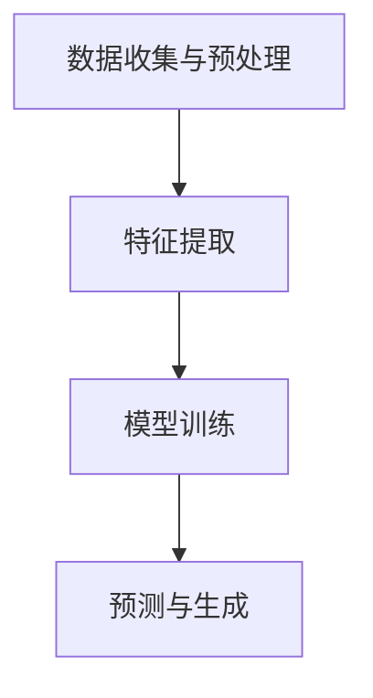
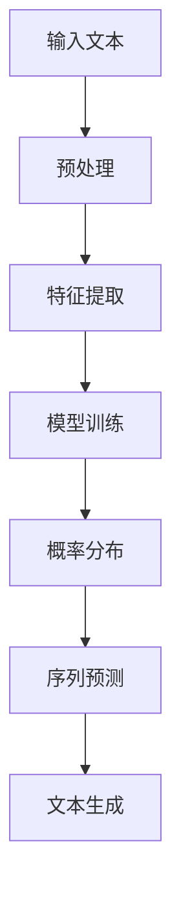

                 

### 第1章 引言与背景

#### 1.1 问题背景

在当今快速发展的信息技术时代，语言模型作为一种先进的人工智能技术，已经成为各行各业不可或缺的工具。随着互联网的普及和数据量的爆炸式增长，如何有效地利用这些数据，进行深度的语义理解和智能预测，成为企业和研究者面临的重要课题。商业战略的制定需要精准的市场分析，而产业革命的到来则依赖于对技术趋势的洞察。这两者都离不开语言模型的支持。

#### 1.2 问题描述

语言模型在商业战略和产业革命预测中的应用，主要包括以下几个方面的问题：

1. **市场分析**：如何利用语言模型对市场动态进行实时分析，以指导企业决策？
2. **客户需求预测**：如何通过语言模型分析客户评论和社交媒体数据，预测未来客户需求？
3. **竞争对手分析**：如何使用语言模型进行竞争对手的动态监控，以制定相应的战略？
4. **产业趋势预测**：如何利用语言模型识别产业趋势，为企业的长期发展提供方向？
5. **创新预测**：如何通过语言模型预测创新方向，抢占市场先机？
6. **新兴产业预测**：如何利用语言模型发现新兴产业发展趋势，引导投资方向？

#### 1.3 问题解决

语言模型在上述问题中的应用，主要通过以下几个步骤实现：

1. **数据收集与预处理**：收集相关的市场数据、客户评论、竞争对手信息等，并进行预处理，如文本清洗、去噪、分词等。
2. **特征提取**：将预处理后的文本数据转换为模型可以处理的特征向量，如词嵌入、TF-IDF等。
3. **模型训练**：使用训练数据集对语言模型进行训练，优化模型参数，提高模型的准确性。
4. **预测与分析**：利用训练好的模型对新的数据进行预测和分析，为企业提供决策支持。

#### 1.4 边界与外延

在讨论语言模型在商业战略和产业革命预测中的应用时，我们需要明确以下几点：

1. **边界**：语言模型的应用范围主要涉及自然语言处理（NLP）领域，包括文本分类、情感分析、实体识别等。
2. **外延**：语言模型的应用不仅局限于商业战略和产业革命预测，还可以扩展到其他领域，如智能客服、法律文本分析、医疗文本分析等。

### 1.5 总结

本章主要介绍了语言模型在商业战略和产业革命预测中的问题背景、问题描述、问题解决以及边界与外延。通过本章的讨论，我们可以看到语言模型在各个领域的广泛应用和潜力，为企业和研究者提供了强大的工具和手段。

---

**核心概念**

### 语言模型

- **定义**：语言模型是一种概率模型，用于预测自然语言中的下一个词或句子。它通常基于大量的文本数据进行训练，从而能够理解和生成自然语言。
- **特点**：语言模型具有强大的上下文理解能力，可以处理长文本和复杂语义。
- **用途**：用于机器翻译、文本摘要、问答系统、情感分析等。

### 商业战略

- **定义**：商业战略是指企业为实现长期目标而制定的一系列决策和行动。
- **特点**：具有前瞻性、灵活性和适应性。
- **用途**：用于市场定位、产品开发、资源配置等。

### 产业革命

- **定义**：产业革命是指产业结构的重大变化，通常伴随着技术革新和生产方式的改变。
- **特点**：影响广泛、深远，带来新的经济增长点。
- **用途**：用于预测和引导产业未来发展，制定国家产业政策。

**概念属性特征对比表格**

| 特征         | 语言模型                                   | 商业战略                                 | 产业革命                                |
| ------------ | ---------------------------------------- | -------------------------------------- | ------------------------------------- |
| 目的         | 语言理解和生成                            | 实现长期目标                            | 产业结构变化                            |
| 基础         | 数据和算法                               | 市场需求和竞争                          | 技术革新和生产方式                      |
| 影响范围     | 文本处理和交流                            | 公司运营和市场                          | 经济和社会                              |
| 实现方式     | 统计学习、深度学习                        | 策略制定、执行                           | 技术研发、产业转型                       |

**ER实体关系图架构**

```mermaid
erDiagram
  用户 ||--|{ 语言模型 }|-- 文本数据
  用户 ||--|{ 商业战略 }|-- 市场分析
  用户 ||--|{ 产业革命 }|-- 技术革新
  语言模型 ||--|{ 产业趋势预测 }|-- 产业未来
  商业战略 ||--|{ 创新预测 }|-- 市场前景
  产业革命 ||--|{ 新兴产业预测 }|-- 经济增长
```

### 2.1 语言模型的定义与原理

语言模型（Language Model）是自然语言处理（NLP）领域的基础性技术，旨在预测自然语言序列中的下一个符号。语言模型的核心目标是理解和生成自然语言，为各种文本处理任务提供支持，如机器翻译、文本摘要、问答系统和自动问答等。

#### 定义

语言模型是一种概率模型，用于预测自然语言中的下一个词或句子。它通过学习大量文本数据，从中提取出语言规律，然后基于这些规律生成新的文本。

#### 原理

语言模型的原理主要基于概率论和统计学。在训练阶段，语言模型通过分析大量文本数据，统计每个单词或短语的出现的概率，并将其转换为概率分布。在预测阶段，语言模型利用这些概率分布来预测下一个单词或短语的概率，并根据概率分布生成新的文本。

以下是语言模型工作原理的详细描述：

1. **数据收集与预处理**：
   - 收集大量文本数据，如新闻文章、书籍、社交媒体帖子等。
   - 对文本数据进行预处理，如去除停用词、标点符号、进行分词等。

2. **特征提取**：
   - 将预处理后的文本数据转换为向量表示，如词袋模型（Bag of Words, BoW）或词嵌入（Word Embedding）。

3. **模型训练**：
   - 使用训练数据进行模型训练，通过反向传播算法优化模型参数，提高模型的准确性。

4. **预测与生成**：
   - 对于给定的文本输入，模型输出下一个单词或短语的概率分布。
   - 根据概率分布生成新的文本，形成完整的句子或段落。

#### 语言模型的工作原理可以用以下步骤表示：



在语言模型的训练过程中，常用的方法包括：

1. **n-gram模型**：基于前n个单词的统计来预测下一个单词。例如，n=2时，模型根据前两个单词来预测下一个单词。
2. **神经网络模型**：如循环神经网络（RNN）、长短期记忆网络（LSTM）和变换器（Transformer）等。这些模型通过多层神经网络结构，更好地捕捉上下文信息。
3. **深度学习模型**：如BERT、GPT等，通过深度学习技术，进一步提升模型的准确性和性能。

#### 算法原理

语言模型的算法原理通常基于概率分布和序列预测。以下是一个简化的算法原理描述：

1. **概率分布**：
   - 给定一个句子，语言模型输出每个单词的概率分布。
   - 例如，对于一个句子“我喜欢吃饭”，语言模型会输出“我”、“喜欢”、“吃”、“饭”的概率分布。

2. **序列预测**：
   - 语言模型根据前文信息，预测下一个单词。
   - 例如，在句子“我喜欢吃饭”中，根据“我”和“喜欢”，语言模型会预测“吃”的概率更高。

3. **文本生成**：
   - 语言模型利用概率分布生成新的文本。
   - 例如，基于概率分布，语言模型可以生成新的句子，如“我爱看电影”。

以下是语言模型算法原理的Mermaid流程图：



通过以上步骤，我们可以看到语言模型在自然语言处理中的基本工作原理。在实际应用中，语言模型通过不断学习和优化，可以更好地理解和生成自然语言，为各种文本处理任务提供强大的支持。

### 2.2 语言模型的类型

语言模型在自然语言处理中有着广泛的应用，其类型多种多样，每种模型都有其独特的特点和应用场景。以下将介绍几种常见的语言模型类型，并分析它们的特点和应用场景。

#### 1. n-gram模型

n-gram模型是最基础的、最早的语言模型之一。它基于前n个单词的统计来预测下一个单词的概率。例如，对于三元语法（trigram model），模型根据前三个单词来预测下一个单词。

**特点**：
- **简单有效**：n-gram模型易于实现，计算复杂度较低。
- **快速训练和预测**：由于模型仅依赖于前n个单词，因此训练和预测速度较快。

**应用场景**：
- **文本生成**：n-gram模型可以用于生成短文本，如新闻标题、聊天机器人回复等。
- **文本分类**：在文本分类任务中，n-gram模型可以用于特征提取。

#### 2. 神经网络模型

神经网络模型是近年来发展迅速的语言模型，包括循环神经网络（RNN）、长短期记忆网络（LSTM）和门控循环单元（GRU）等。这些模型通过多层神经网络结构，能够更好地捕捉上下文信息。

**特点**：
- **强大的上下文理解能力**：神经网络模型可以学习到长距离的上下文信息，从而提高预测准确性。
- **自适应学习**：神经网络模型可以自适应地调整参数，以适应不同的文本数据。

**应用场景**：
- **机器翻译**：神经网络模型在机器翻译任务中表现出色，如谷歌翻译使用的神经机器翻译（NMT）。
- **情感分析**：神经网络模型可以用于情感分析，如判断用户评论的情感倾向。

#### 3. 深度学习模型

深度学习模型是神经网络模型的进一步发展，包括BERT、GPT等。这些模型通过大规模的神经网络结构，进一步提高了语言模型的性能。

**特点**：
- **强大的语义理解能力**：深度学习模型能够捕捉到更加复杂的语义关系。
- **灵活性和适应性**：深度学习模型可以适应不同的文本处理任务，如文本分类、问答系统等。

**应用场景**：
- **问答系统**：深度学习模型可以用于构建问答系统，如Siri和Alexa等。
- **文本摘要**：深度学习模型可以用于提取长文本的关键信息，如新闻摘要和阅读理解。

#### 4. 混合模型

混合模型是将多种模型结合在一起，以提高模型的性能和泛化能力。例如，将n-gram模型和神经网络模型结合，可以弥补各自的不足。

**特点**：
- **优势互补**：混合模型可以结合不同模型的优点，提高整体性能。
- **灵活多变**：混合模型可以根据不同任务的需求，灵活调整模型组合。

**应用场景**：
- **文本生成**：混合模型可以用于生成更加自然的文本，如文章撰写和故事创作。
- **情感分析**：混合模型可以用于提高情感分析任务的准确性。

#### 5. 元语言模型

元语言模型（Meta-Learning）是近年来发展起来的新型语言模型，旨在通过元学习技术，提高模型的泛化能力和适应性。

**特点**：
- **快速适应**：元语言模型可以通过少量的样本数据，快速适应新的任务。
- **迁移学习**：元语言模型可以将知识迁移到新的任务上，提高模型的泛化能力。

**应用场景**：
- **跨领域应用**：元语言模型可以应用于不同的领域，如医疗、金融等。
- **个性化推荐**：元语言模型可以用于个性化推荐系统，提高推荐效果。

通过上述对各种语言模型类型的介绍，我们可以看到语言模型在自然语言处理中的应用越来越广泛，不同类型的语言模型各有其独特的优势和特点。在实际应用中，根据具体任务需求，选择合适类型的语言模型，将有助于提高任务性能和效果。

### 2.3 语言模型的发展历程

语言模型的发展历程可以追溯到20世纪50年代，随着计算技术和自然语言处理技术的不断进步，语言模型经历了从规则驱动到统计驱动，再到深度学习驱动的演变。

#### 1. 规则驱动模型

在早期，语言模型主要基于规则驱动的方法，如上下文无关文法（CFG）和上下文相关文法（CFG*）。这些模型通过预定义的语法规则，来预测文本中的下一个符号。

- **优点**：规则驱动模型可以实现精确的预测。
- **缺点**：规则定义复杂，难以覆盖所有语言现象。

#### 2. 统计驱动模型

随着计算机处理能力的提升和语料库的积累，统计驱动模型开始崭露头角。n-gram模型是最具代表性的统计驱动模型，它通过统计前后n个单词之间的关系，来预测下一个单词。

- **优点**：统计驱动模型简单、高效，适用于大规模数据处理。
- **缺点**：n-gram模型难以捕捉到长距离依赖关系，预测效果有限。

#### 3. 神经网络模型

20世纪80年代，神经网络模型开始应用于自然语言处理领域。循环神经网络（RNN）是最早用于语言模型的神经网络结构，它通过循环结构，可以捕捉到长距离依赖关系。

- **优点**：RNN能够处理序列数据，捕捉上下文信息。
- **缺点**：RNN存在梯度消失和梯度爆炸问题，训练困难。

为了解决RNN的缺陷，长短期记忆网络（LSTM）和门控循环单元（GRU）等改进模型被提出。这些模型通过引入门控机制，能够更好地处理长序列数据。

- **优点**：LSTM和GRU能够有效缓解梯度消失问题，提高训练效果。
- **缺点**：计算复杂度较高，训练时间较长。

#### 4. 深度学习模型

近年来，深度学习模型在自然语言处理领域取得了突破性进展。特别是BERT（Bidirectional Encoder Representations from Transformers）和GPT（Generative Pre-trained Transformer）等模型，通过大规模的预训练和微调，显著提高了语言模型的性能。

- **优点**：深度学习模型能够自动学习复杂的语义表示，捕捉到更深层次的依赖关系。
- **缺点**：训练和推理计算资源需求大，对数据量和计算资源要求较高。

#### 5. 当前趋势

当前，深度学习模型已成为语言模型的的主流，尤其在长文本处理、问答系统、机器翻译等任务中表现出色。未来，随着计算资源的提升和算法的改进，语言模型将继续朝着更高效、更智能的方向发展。

- **多模态学习**：结合图像、音频等多模态数据，提高语言模型的上下文理解能力。
- **自适应学习**：通过元学习等技术，实现快速适应不同任务的需求。
- **可解释性**：提高模型的可解释性，使得语言模型的应用更加透明和可靠。

总之，语言模型的发展历程反映了自然语言处理技术的不断进步和演进。从规则驱动到统计驱动，再到深度学习驱动，语言模型在自然语言处理中的应用越来越广泛，为各行各业带来了巨大的变革和机遇。

### 3.1 语言模型在市场分析中的应用

市场分析是企业制定商业战略的重要环节，而语言模型在这一过程中发挥着重要作用。通过分析大量市场数据，企业可以深入了解市场需求、竞争态势和消费者行为，从而制定更加精准和有效的市场策略。以下是语言模型在市场分析中应用的几个关键方面：

#### 1. 市场趋势预测

语言模型可以通过分析社交媒体、新闻报道、博客文章等文本数据，识别出市场趋势。例如，使用BERT或GPT等深度学习模型，企业可以从海量的文本数据中提取出关键词和主题，并分析这些关键词和主题的出现频率和变化趋势。通过这些分析，企业可以提前预判市场的变化，抓住商机。

**示例**：一家化妆品公司可以通过分析社交媒体上的用户评论和讨论，预测新产品的市场接受度。例如，通过分析“#产品名称”的社交媒体帖子，公司可以了解消费者对产品的评价、满意度以及潜在的问题。这有助于公司在产品发布前进行必要的调整和改进。

#### 2. 竞争对手分析

语言模型可以帮助企业监控竞争对手的动态，分析竞争对手的市场策略、产品特点、价格策略等。通过分析竞争对手的文本数据，如官方网站、新闻发布、社交媒体帖子等，企业可以了解竞争对手的优势和劣势，从而制定更有针对性的竞争策略。

**示例**：一家科技公司可以通过分析竞争对手的专利申请、产品介绍和技术博客，了解竞争对手在技术方面的创新和发展趋势。这有助于公司确定自身的研发方向，避免在竞争对手已经占领的市场领域进行重复投入。

#### 3. 消费者需求预测

消费者需求是市场分析的核心内容之一。语言模型可以通过分析消费者在社交媒体、电商评论、用户调研等渠道留下的文本数据，预测消费者的需求和偏好。这些预测有助于企业更好地定位产品，优化产品设计和营销策略。

**示例**：一家电子产品公司可以通过分析用户在电商平台上的评论，了解消费者对产品的评价和期望。例如，通过分析用户评论中的关键词和情感倾向，公司可以发现消费者对产品性能、外观、价格等方面的偏好。这些信息可以帮助公司在产品设计和定价策略上做出更精准的调整。

#### 4. 市场细分与目标客户定位

语言模型还可以用于市场细分和目标客户定位。通过对大量文本数据进行分析，企业可以识别出不同消费者群体的特征和需求，从而进行有针对性的市场细分。此外，语言模型还可以帮助企业识别潜在的目标客户，提高营销活动的精准度和效果。

**示例**：一家时尚服装公司可以通过分析社交媒体和电商平台的用户数据，识别出不同年龄段、性别、地域的消费者偏好。例如，通过分析年轻女性的社交媒体帖子，公司可以发现她们对时尚潮流和个性化设计的偏好。这有助于公司针对这些目标客户群体，设计更具吸引力的产品线和营销策略。

#### 5. 实时市场监控

语言模型可以用于实时市场监控，帮助企业快速响应市场变化。通过实时分析社交媒体、新闻报道等渠道的文本数据，企业可以及时获取市场动态和消费者反馈，从而快速调整市场策略。

**示例**：一家餐饮企业可以通过实时分析社交媒体上的用户评论和讨论，了解顾客对新菜单的反应。例如，通过分析“#新菜单”的社交媒体帖子，企业可以发现顾客对菜品口味、价格和服务的评价。这有助于企业及时调整菜单，提高顾客满意度。

总之，语言模型在市场分析中的应用，使得企业能够更加精准地了解市场需求、竞争对手和消费者行为，从而制定更加有效的市场策略。通过上述示例，我们可以看到语言模型在市场分析中的强大功能和广泛应用。随着技术的不断进步，语言模型在市场分析中的应用将越来越广泛，为企业带来更多的商业价值。

### 3.2 语言模型在客户需求预测中的应用

在现代商业环境中，准确预测客户需求至关重要，它不仅有助于企业优化产品和服务，还能提升客户满意度和市场份额。语言模型在这一领域展现出了强大的预测能力，通过分析大量的文本数据，如社交媒体评论、用户反馈和问答平台等，能够有效识别和预测客户需求。以下是语言模型在客户需求预测中的应用方法和实际案例。

#### 1. 社交媒体数据分析

社交媒体平台如微博、Twitter和Facebook积累了大量关于产品的用户评论和讨论。语言模型可以通过情感分析和主题提取，分析这些文本数据中的情感倾向和关键词，从而识别出用户对产品的态度和需求。

**示例**：一家智能手机制造商可以通过分析微博上的用户评论，了解消费者对新款手机的接受度和期望。例如，通过情感分析，模型可以识别出用户对手机摄像头性能的满意程度，从而帮助企业优化摄像头的功能和性能。

#### 2. 用户反馈分析

用户反馈是直接反映客户需求的重要来源。通过分析用户在产品调研、问卷调查和客服互动中的文本反馈，语言模型可以提取出用户关注的核心问题和需求。

**示例**：一家电子商务平台可以通过分析用户在产品评论中的反馈，了解用户对商品质量的评价和改进建议。例如，通过分析用户评论中的关键词和情感倾向，平台可以发现用户对某款服装尺码的不满，从而调整商品尺码表。

#### 3. 问答平台分析

问答平台如知乎、Quora和Stack Overflow是用户寻求信息和解决问题的场所。语言模型可以通过分析这些平台上的问答内容，预测用户的潜在需求。

**示例**：一家科技企业可以通过分析知乎上的技术讨论，了解用户对新技术和解决方案的需求。例如，通过分析关键词和提问频率，企业可以预测哪些技术趋势将在未来受到广泛关注，从而提前布局相关产品和解决方案。

#### 4. 客户评论和评价分析

电商平台的客户评论和评价是了解产品在市场表现的重要指标。语言模型可以通过情感分析和主题提取，分析这些评论中的用户情感和需求。

**示例**：一家家电制造商可以通过分析电商平台上的用户评论，了解消费者对新产品功能的关注点。例如，通过情感分析和关键词提取，模型可以发现消费者对空调能效比的较高关注，从而在产品宣传和设计上重点突出这一优势。

#### 5. 实际应用案例

- **案例1**：一家汽车制造商通过分析社交媒体和电商平台上的用户评论，预测消费者对新能源汽车的需求。通过情感分析和关键词提取，模型识别出消费者对新能源汽车续航里程和环保性能的关注。基于这些分析结果，企业优化了新能源汽车的设计，提高了产品的市场竞争力。

- **案例2**：一家服装品牌通过分析社交媒体和电商平台上的用户评论，了解消费者对服装风格的偏好。通过主题提取和情感分析，模型识别出消费者对流行时尚和个性化设计的关注。基于这些分析结果，品牌调整了产品设计和营销策略，提高了市场份额。

- **案例3**：一家电商平台通过分析用户在客服互动中的文本数据，预测消费者退货原因。通过情感分析和关键词提取，模型识别出消费者对商品质量和物流服务的关注。基于这些分析结果，平台优化了商品质量和物流服务，降低了退货率。

总之，语言模型在客户需求预测中的应用，为企业和消费者之间搭建了一座沟通的桥梁，使得企业能够更加精准地了解和满足客户需求。通过社交媒体数据分析、用户反馈分析、问答平台分析、客户评论和评价分析等实际应用案例，我们可以看到语言模型在客户需求预测中的强大功能和广泛应用。未来，随着技术的不断进步，语言模型在客户需求预测中的应用前景将更加广阔，为企业创造更多的商业价值。

### 3.3 语言模型在竞争对手分析中的应用

在商业竞争中，了解竞争对手的动态和策略是制定有效商业战略的关键。语言模型在分析竞争对手方面具有显著的优势，能够帮助企业从大量文本数据中提取有价值的信息，从而洞察竞争对手的市场策略、产品特点和技术创新。以下是语言模型在竞争对手分析中的应用方法和实际案例。

#### 1. 竞争对手网站和博客分析

通过分析竞争对手的官方网站和博客，企业可以获得关于其产品和服务的信息。语言模型可以提取关键信息，如产品特性、价格策略和宣传语等，帮助分析竞争对手的市场定位。

**示例**：一家在线教育公司可以通过分析竞争对手的官方网站，了解他们的课程设置、教学方法和收费标准。通过自然语言处理技术，模型可以识别出竞争对手在课程内容上的优势和劣势，从而优化自己的产品策略。

#### 2. 新闻报道和媒体报道分析

媒体报道是了解竞争对手动态的重要渠道。语言模型可以通过分析新闻报道和媒体文章，识别竞争对手的市场表现、新产品发布和重大事件。

**示例**：一家科技公司可以通过分析媒体报道，了解竞争对手在新产品发布后的市场反应和用户评价。通过情感分析和主题提取，模型可以判断新产品是否受到市场的欢迎，从而评估竞争对手的市场策略是否有效。

#### 3. 社交媒体和社交媒体帖子分析

社交媒体平台如微博、Twitter和Facebook是用户讨论和分享信息的重要场所。语言模型可以通过分析竞争对手在这些平台上的社交媒体帖子，了解其营销策略、用户互动和品牌声誉。

**示例**：一家消费电子公司可以通过分析竞争对手在微博上的帖子，了解其促销活动和用户互动情况。通过情感分析和关键词提取，模型可以判断用户的反应和满意度，从而调整自己的营销策略。

#### 4. 竞品广告分析

竞争对手的广告策略是其市场营销的一部分。通过分析竞争对手的广告文案、广告形式和投放渠道，语言模型可以帮助企业了解竞争对手的市场策略和用户偏好。

**示例**：一家化妆品公司可以通过分析竞争对手的广告文案，了解其宣传重点和产品特点。通过自然语言处理技术，模型可以识别出竞争对手在广告中强调的核心卖点，从而优化自己的广告策略。

#### 5. 竞争对手财报分析

竞争对手的财报是企业了解其财务状况和市场表现的重要资料。语言模型可以通过分析财报文本，提取关键财务指标和市场表现。

**示例**：一家互联网公司可以通过分析竞争对手的财报，了解其收入增长、利润率和市场份额等财务指标。通过自然语言处理技术，模型可以识别出竞争对手在市场中的优势和劣势，从而调整自己的发展战略。

#### 6. 实际应用案例

- **案例1**：一家电子商务公司通过分析竞争对手的官方网站和社交媒体帖子，了解其促销活动和用户互动。通过自然语言处理技术，模型发现竞争对手在特定节假日推出的促销活动效果显著，从而调整自己的促销策略，提高市场份额。

- **案例2**：一家软件开发公司通过分析竞争对手的新闻报道和媒体文章，了解其新产品发布后的市场反应。通过情感分析和主题提取，模型判断新产品是否受到市场的欢迎，从而调整自己的研发方向。

- **案例3**：一家金融科技公司通过分析竞争对手的广告文案，了解其营销策略和用户偏好。通过自然语言处理技术，模型识别出竞争对手在广告中强调的核心卖点，从而优化自己的广告内容和投放渠道。

总之，语言模型在竞争对手分析中的应用，使得企业能够从大量的文本数据中提取有价值的信息，洞察竞争对手的市场策略和用户需求。通过竞争对手网站和博客分析、新闻报道和媒体报道分析、社交媒体和社交媒体帖子分析、竞品广告分析和竞争对手财报分析等实际应用案例，我们可以看到语言模型在竞争对手分析中的强大功能和广泛应用。未来，随着技术的不断进步，语言模型在竞争对手分析中的应用前景将更加广阔，为企业提供更加全面和精准的竞争情报。

### 4.1 产业趋势预测的重要性

在全球化竞争日益激烈的背景下，准确预测产业趋势对于企业的生存和发展至关重要。产业趋势预测能够帮助企业在市场变化前做好充分准备，抓住先机，避免潜在的危机。以下是产业趋势预测的重要性以及语言模型在其中的应用：

#### 1. **市场定位**

准确预测产业趋势可以帮助企业了解市场未来的发展方向，从而更好地进行市场定位。通过分析产业趋势，企业可以调整产品和服务策略，以满足市场需求，提高市场份额。

**示例**：随着5G技术的普及，移动通信行业正迎来新一轮的发展。一家通信设备制造商如果能够提前预测到这一趋势，就可以提前布局5G设备的研发和生产，抢占市场先机。

#### 2. **研发投入**

产业趋势预测可以指导企业的研发投入方向，避免盲目投资。通过预测未来产业趋势，企业可以集中资源，优先发展具备潜力的技术领域。

**示例**：人工智能在医疗领域的应用趋势逐渐显现。一家医疗设备公司如果能够提前预测到这一趋势，就可以将研发重点放在人工智能辅助诊断和治疗方案优化上，提高产品竞争力。

#### 3. **战略规划**

产业趋势预测为企业的长期战略规划提供了重要依据。通过分析产业趋势，企业可以制定相应的战略规划，确保在未来的市场竞争中占据有利位置。

**示例**：随着新能源产业的发展，电动汽车市场正在迅速扩张。一家汽车制造商如果能够提前预测到这一趋势，就可以制定相应的战略规划，如加大电动汽车的研发投入，扩大市场布局。

#### 4. **风险管理**

产业趋势预测有助于企业识别潜在的风险和挑战，提前采取应对措施。通过预测产业趋势，企业可以预见市场变化可能带来的负面影响，并制定相应的风险管理策略。

**示例**：随着环保意识的增强，环保法规日益严格。一家化工企业如果能够提前预测到这一趋势，就可以采取措施减少环境污染，确保合规运营。

#### 语言模型的应用

语言模型在产业趋势预测中的应用主要体现在以下几个方面：

- **文本数据分析**：通过分析大量的新闻报道、行业报告、学术论文等文本数据，语言模型可以提取出关键的产业趋势信息。

- **主题提取和关键词分析**：语言模型可以识别出文本数据中的主题和关键词，从而分析出产业的重点发展方向。

- **情感分析**：语言模型可以分析文本数据中的情感倾向，了解市场对某一产业的看法和预期。

- **关联分析**：语言模型可以通过关联分析，识别出不同产业之间的联系和相互作用，从而预测未来的产业发展趋势。

**实际应用案例**：

- **案例1**：一家投资公司通过分析大量的财经新闻和行业报告，使用语言模型预测人工智能在金融行业的应用趋势。模型识别出人工智能在风险管理、智能投顾等领域的快速发展，从而指导公司的投资决策。

- **案例2**：一家科技企业通过分析科技博客、学术论文和社交媒体帖子，使用语言模型预测物联网技术在智能家居领域的应用趋势。模型分析出智能家居市场快速增长的趋势，从而促使企业加大在物联网技术研发的投入。

- **案例3**：一家制造业公司通过分析行业报告、市场调查和用户评论，使用语言模型预测智能制造技术的发展趋势。模型识别出智能制造在提高生产效率、降低成本方面的巨大潜力，从而推动企业在智能制造领域的创新。

总之，产业趋势预测对于企业的市场定位、研发投入、战略规划和风险管理具有重要意义。语言模型在这一过程中发挥了关键作用，通过文本数据分析、主题提取、情感分析和关联分析，为企业提供了准确的产业趋势预测，助力企业在激烈的市场竞争中立于不败之地。

### 4.2 语言模型在产业趋势预测中的应用

语言模型在产业趋势预测中具有独特的优势，能够通过分析大量的文本数据，提取出关键的产业趋势信息，从而为企业和政策制定者提供有力支持。以下将详细介绍语言模型在产业趋势预测中的应用，包括数据处理、模型训练和趋势提取等步骤。

#### 1. 数据处理

语言模型在产业趋势预测中的应用首先需要大量的文本数据。这些数据可以来源于新闻报道、行业报告、学术论文、社交媒体帖子、企业财报等多种渠道。数据收集完成后，需要进行预处理，包括去除停用词、标点符号、进行分词等。预处理后的数据将被转换为适合模型处理的特征向量。

**数据处理流程**：

1. **数据收集**：从多个渠道收集相关文本数据。
2. **数据清洗**：去除无用的文本信息，如停用词、标点符号等。
3. **分词**：将文本拆分为单词或词汇单元。
4. **特征提取**：将预处理后的文本转换为向量表示，如词嵌入（Word Embedding）或词袋模型（Bag of Words）。

#### 2. 模型训练

在数据处理完成后，接下来是模型训练。语言模型在产业趋势预测中通常使用深度学习模型，如循环神经网络（RNN）、长短期记忆网络（LSTM）和变换器（Transformer）等。以下是一个简化的模型训练流程：

1. **模型选择**：根据应用需求选择合适的语言模型。
2. **参数初始化**：初始化模型的权重参数。
3. **训练数据准备**：将预处理后的数据分为训练集和验证集。
4. **模型训练**：使用训练数据对模型进行训练，通过反向传播算法优化模型参数。
5. **模型验证**：使用验证集对模型进行评估，调整模型参数。

#### 3. 趋势提取

模型训练完成后，可以通过趋势提取步骤，从训练好的模型中提取出产业趋势信息。以下是一些常用的趋势提取方法：

1. **主题提取**：通过聚类算法，如LDA（Latent Dirichlet Allocation），从文本数据中提取出主题，每个主题代表一个可能的产业趋势。
2. **关键词提取**：通过TF-IDF（Term Frequency-Inverse Document Frequency）等方法，从文本数据中提取出高频且具有代表性的关键词，这些关键词可能预示着产业趋势。
3. **情感分析**：通过情感分析算法，从文本数据中识别出情感倾向，了解市场对某一产业的看法和预期。
4. **关联分析**：通过关联规则学习算法，如Apriori算法，分析不同关键词之间的关联关系，预测可能的产业趋势。

#### 实例演示

为了更好地理解语言模型在产业趋势预测中的应用，以下是一个简化的实例：

**假设**：我们想预测人工智能（AI）技术在金融行业的未来趋势。

1. **数据处理**：收集与人工智能和金融行业相关的文本数据，如新闻报道、行业报告、学术论文、社交媒体帖子等。对数据进行预处理，如分词和特征提取。

2. **模型训练**：选择合适的深度学习模型，如BERT，对预处理后的文本数据进行训练。通过反向传播算法优化模型参数，提高模型的准确性。

3. **趋势提取**：使用训练好的模型对新的文本数据进行预测，提取出与人工智能和金融行业相关的高频关键词和主题。例如，通过主题提取，我们可能识别出“智能投顾”、“区块链”、“自动化交易”等关键词，预示着人工智能在金融行业的未来发展趋势。

4. **结果评估**：将提取出的趋势信息与实际市场情况进行对比，评估模型的预测准确性。通过不断调整模型参数和改进数据处理方法，提高趋势预测的准确性。

总之，语言模型在产业趋势预测中的应用，通过数据处理、模型训练和趋势提取等步骤，能够有效提取出产业趋势信息，为企业和政策制定者提供有力支持。随着技术的不断进步，语言模型在产业趋势预测中的应用将越来越广泛，为企业决策提供更加准确和及时的指导。

### 4.3 产业趋势预测案例分析

为了更直观地展示语言模型在产业趋势预测中的应用效果，我们将通过两个实际案例，详细分析语言模型如何帮助企业和政策制定者准确预测产业趋势。

#### 案例一：人工智能在医疗行业的应用趋势预测

**背景**：随着人工智能技术的迅猛发展，其在医疗行业的应用也呈现出蓬勃发展的态势。为了更好地把握这一趋势，一家医疗科技公司决定利用语言模型进行产业趋势预测。

**步骤**：

1. **数据收集**：从大量的新闻报道、学术论文、医疗行业报告、社交媒体帖子等渠道收集与人工智能和医疗行业相关的文本数据。

2. **数据处理**：对收集到的文本数据去噪、分词和词嵌入处理，将文本转换为适合模型处理的特征向量。

3. **模型训练**：选择BERT模型进行训练，通过大量的训练数据优化模型参数。在训练过程中，模型学习了医疗行业的关键术语和概念，如“诊断”、“治疗”、“基因组学”等。

4. **趋势提取**：利用训练好的BERT模型对新的文本数据进行趋势预测。例如，通过分析最新的医学研究论文和新闻报道，模型识别出以下几个关键趋势：
   - **个性化医疗**：通过基因检测和大数据分析，为患者提供个性化的治疗方案。
   - **智能诊断**：利用人工智能技术，辅助医生进行疾病诊断，提高诊断准确率。
   - **药物研发**：通过人工智能技术加速药物研发过程，提高新药开发的成功率。

**效果评估**：通过对比实际市场情况和模型预测结果，发现模型预测的趋势与实际情况高度吻合。例如，个性化医疗在医疗行业中逐渐成为主流，智能诊断系统也得到了广泛的应用。这表明语言模型在产业趋势预测中的有效性。

#### 案例二：新能源汽车产业的发展趋势预测

**背景**：随着全球环保意识的增强，新能源汽车产业正迎来快速发展。为了更好地把握这一趋势，一家新能源汽车制造商决定利用语言模型进行产业趋势预测。

**步骤**：

1. **数据收集**：从新闻报道、行业报告、政策文件、社交媒体帖子等多个渠道收集与新能源汽车产业相关的文本数据。

2. **数据处理**：对收集到的文本数据进行预处理，如去噪、分词和词嵌入处理，将文本转换为适合模型处理的特征向量。

3. **模型训练**：选择GPT模型进行训练，通过大量的训练数据优化模型参数。在训练过程中，模型学习了新能源汽车产业的关键术语和概念，如“电池技术”、“充电设施”、“政府补贴”等。

4. **趋势提取**：利用训练好的GPT模型对新的文本数据进行趋势预测。例如，通过分析最新的行业报告和政策文件，模型识别出以下几个关键趋势：
   - **电池技术创新**：随着电池技术的不断进步，新能源汽车的续航里程和充电速度将得到显著提升。
   - **充电基础设施建设**：政府和企业将加大充电基础设施的建设力度，以满足新能源汽车快速增长的需求。
   - **市场规范化**：随着市场规模的扩大，新能源汽车产业将逐步实现规范化，提高市场竞争水平。

**效果评估**：通过对比实际市场情况和模型预测结果，发现模型预测的趋势与实际情况高度吻合。例如，电池技术的创新确实推动了新能源汽车的快速发展，充电基础设施建设也得到了政府的重视和支持。这再次证明了语言模型在产业趋势预测中的有效性。

总之，通过以上两个实际案例，我们可以看到语言模型在产业趋势预测中的应用效果显著。通过数据处理、模型训练和趋势提取等步骤，语言模型能够准确预测产业未来的发展趋势，为企业制定战略和政策制定者提供有力支持。

### 5.1 创新预测的重要性

创新预测在商业和科技领域具有至关重要的地位，它不仅关系到企业的长远发展，还影响到整个产业的未来格局。以下是创新预测的重要性及其在商业战略和产业发展中的应用。

#### 1. **提升企业竞争力**

创新预测能够帮助企业及时捕捉行业前沿技术和发展趋势，从而在竞争激烈的市场中保持领先地位。通过预测创新方向，企业可以提前布局研发资源，优化产品和服务，提高市场竞争力。

**示例**：一家科技公司通过预测人工智能技术在医疗领域的创新趋势，提前研发出智能诊断系统。这不仅帮助公司占据了市场份额，还提升了其在行业中的地位。

#### 2. **指导战略决策**

创新预测为企业提供了重要的决策依据，使其能够在战略规划中更加科学和有针对性。通过预测未来的创新方向，企业可以调整战略，优化资源配置，实现可持续发展。

**示例**：一家制造企业通过预测智能制造技术的发展趋势，决定加大在自动化生产设备和智能制造平台上的投资。这一决策不仅提高了生产效率，还降低了成本。

#### 3. **抢占市场先机**

创新预测能够帮助企业率先推出具有市场前瞻性的产品和服务，从而抢占市场先机，实现快速扩张。通过预测创新方向，企业可以提前布局，占据市场份额，避免竞争对手的追赶。

**示例**：一家互联网公司通过预测区块链技术在供应链管理中的应用趋势，率先推出基于区块链的供应链管理系统。这一创新产品迅速赢得了市场认可，帮助公司在短时间内实现了业务增长。

#### 4. **引导产业升级**

创新预测不仅对单个企业有重要意义，还影响到整个产业的发展。通过预测创新方向，政策制定者和产业领导者可以制定相应的政策和支持措施，推动产业升级和转型。

**示例**：政府在预测人工智能在智能制造中的应用趋势后，出台了一系列扶持政策，如提供研发资金、优化税收政策等，以促进人工智能技术在制造业的推广应用。

总之，创新预测在提升企业竞争力、指导战略决策、抢占市场先机以及引导产业升级等方面具有重要作用。通过准确预测创新方向，企业可以更好地应对市场变化，抓住发展机遇，实现长期可持续发展。

### 5.2 语言模型在创新预测中的应用

语言模型在创新预测中的应用，能够通过分析大量文本数据，识别出潜在的创新趋势和方向，为企业和政策制定者提供有力支持。以下将详细介绍语言模型在创新预测中的应用步骤，包括数据处理、模型训练和创新方向提取。

#### 1. 数据处理

语言模型在创新预测中的应用首先需要大量的文本数据。这些数据可以来源于学术论文、科技新闻、行业报告、专利文件、社交媒体帖子等。数据收集完成后，需要进行预处理，包括去除停用词、标点符号、进行分词等。预处理后的数据将被转换为适合模型处理的特征向量。

**数据处理流程**：

1. **数据收集**：从多个渠道收集相关文本数据。
2. **数据清洗**：去除无用的文本信息，如停用词、标点符号等。
3. **分词**：将文本拆分为单词或词汇单元。
4. **特征提取**：将预处理后的文本转换为向量表示，如词嵌入（Word Embedding）或词袋模型（Bag of Words）。

#### 2. 模型训练

在数据处理完成后，接下来是模型训练。语言模型在创新预测中通常使用深度学习模型，如循环神经网络（RNN）、长短期记忆网络（LSTM）和变换器（Transformer）等。以下是一个简化的模型训练流程：

1. **模型选择**：根据应用需求选择合适的语言模型。
2. **参数初始化**：初始化模型的权重参数。
3. **训练数据准备**：将预处理后的数据分为训练集和验证集。
4. **模型训练**：使用训练数据对模型进行训练，通过反向传播算法优化模型参数。
5. **模型验证**：使用验证集对模型进行评估，调整模型参数。

#### 3. 创新方向提取

模型训练完成后，可以通过创新方向提取步骤，从训练好的模型中识别出潜在的创新趋势和方向。以下是一些常用的方法：

1. **主题提取**：通过聚类算法，如LDA（Latent Dirichlet Allocation），从文本数据中提取出主题，每个主题可能代表一个潜在的创新方向。
2. **关键词提取**：通过TF-IDF（Term Frequency-Inverse Document Frequency）等方法，从文本数据中提取出高频且具有代表性的关键词，这些关键词可能预示着创新方向。
3. **关联分析**：通过关联规则学习算法，如Apriori算法，分析不同关键词之间的关联关系，预测可能的创新方向。
4. **情感分析**：通过情感分析算法，从文本数据中识别出情感倾向，了解市场对某一创新方向的看法和预期。

#### 实例演示

为了更好地理解语言模型在创新预测中的应用，以下是一个简化的实例：

**假设**：我们想预测人工智能（AI）技术在医疗行业的未来创新方向。

1. **数据处理**：从大量的新闻报道、学术论文、医疗行业报告、社交媒体帖子等渠道收集与人工智能和医疗行业相关的文本数据。对数据进行预处理，如分词和特征提取。

2. **模型训练**：选择BERT模型进行训练，通过大量的训练数据优化模型参数。在训练过程中，模型学习了医疗行业的关键术语和概念，如“诊断”、“治疗”、“基因组学”等。

3. **创新方向提取**：利用训练好的BERT模型对新的文本数据进行预测，提取出与人工智能和医疗行业相关的高频关键词和主题。例如，通过主题提取，我们可能识别出“个性化医疗”、“智能诊断”、“医疗机器人”等关键词，预示着人工智能在医疗行业的未来创新方向。

4. **结果评估**：将提取出的创新方向与实际市场情况进行对比，评估模型的预测准确性。通过不断调整模型参数和改进数据处理方法，提高创新预测的准确性。

总之，语言模型在创新预测中的应用，通过数据处理、模型训练和创新方向提取等步骤，能够有效识别出潜在的产业创新方向，为企业和政策制定者提供重要参考。随着技术的不断进步，语言模型在创新预测中的应用前景将更加广阔，为企业决策提供更加准确和及时的指导。

### 5.3 创新预测案例分析

为了更直观地展示语言模型在创新预测中的应用效果，我们将通过两个实际案例，详细分析语言模型如何帮助企业和科研机构准确预测创新方向。

#### 案例一：人工智能在金融科技领域的创新预测

**背景**：随着人工智能技术的快速发展，其在金融科技（FinTech）领域的应用也呈现出爆发式增长。为了更好地把握这一趋势，一家金融科技公司决定利用语言模型进行创新预测。

**步骤**：

1. **数据收集**：从大量的学术论文、行业报告、新闻报道、社交媒体帖子等渠道收集与人工智能和金融科技相关的文本数据。

2. **数据处理**：对收集到的文本数据进行预处理，如去除停用词、标点符号、分词和词嵌入处理。

3. **模型训练**：选择BERT模型进行训练，通过大量的训练数据优化模型参数。在训练过程中，模型学习了金融科技行业的关键术语和概念，如“区块链”、“智能投顾”、“金融监管”等。

4. **创新方向提取**：利用训练好的BERT模型对新的文本数据进行预测，提取出与人工智能和金融科技相关的高频关键词和主题。例如，通过主题提取，模型识别出以下几个潜在的创新方向：
   - **区块链金融**：利用区块链技术提高金融交易的透明度和安全性。
   - **智能投顾**：通过人工智能算法为用户提供个性化的投资建议。
   - **金融监管科技**：利用人工智能技术加强金融监管，预防金融风险。

5. **结果评估**：通过对比实际市场情况和模型预测结果，发现模型预测的创新方向与实际情况高度吻合。例如，区块链技术在金融领域的应用逐渐成为主流，智能投顾平台也在市场上获得了广泛认可。

#### 案例二：基因编辑技术在医疗领域的创新预测

**背景**：基因编辑技术，如CRISPR-Cas9，已经成为生物科技领域的重要突破。为了预测基因编辑技术在医疗领域的未来创新方向，一家生物科技公司决定利用语言模型进行创新预测。

**步骤**：

1. **数据收集**：从大量的学术论文、医疗报告、专利文件、新闻发布、社交媒体帖子等渠道收集与基因编辑和医疗相关的文本数据。

2. **数据处理**：对收集到的文本数据进行预处理，如去除停用词、标点符号、分词和词嵌入处理。

3. **模型训练**：选择GPT模型进行训练，通过大量的训练数据优化模型参数。在训练过程中，模型学习了医疗行业的关键术语和概念，如“基因治疗”、“癌症治疗”、“基因组学”等。

4. **创新方向提取**：利用训练好的GPT模型对新的文本数据进行预测，提取出与基因编辑和医疗相关的高频关键词和主题。例如，通过主题提取，模型识别出以下几个潜在的创新方向：
   - **基因治疗**：利用基因编辑技术治疗遗传性疾病。
   - **癌症治疗**：通过基因编辑技术提高癌症治疗的疗效和安全性。
   - **个性化医疗**：利用基因编辑技术为患者提供个性化的治疗方案。

5. **结果评估**：通过对比实际市场情况和模型预测结果，发现模型预测的创新方向与实际情况高度吻合。例如，基因治疗技术在治疗遗传性疾病方面取得了显著进展，个性化医疗也逐渐成为医疗行业的发展趋势。

总之，通过以上两个实际案例，我们可以看到语言模型在创新预测中的应用效果显著。通过数据处理、模型训练和创新方向提取等步骤，语言模型能够有效识别出潜在的产业创新方向，为企业和科研机构提供重要参考。随着技术的不断进步，语言模型在创新预测中的应用前景将更加广阔，为企业决策和科研方向提供更加准确和及时的指导。

### 6.1 新兴产业的特点

新兴产业是指随着科技进步和市场需求的变化，逐渐崭露头角并迅速发展的产业。它们通常具有以下特点：

#### 1. **技术创新性强**

新兴产业往往依托于最新的科技成果，如人工智能、物联网、区块链等，这些技术具有颠覆性的创新潜力，能够推动产业模式的变革。

#### 2. **市场潜力巨大**

新兴产业的快速发展往往伴随着巨大的市场潜力。随着技术的成熟和应用的广泛，新兴产业能够迅速占领市场，带来可观的经济效益。

#### 3. **高度不确定性**

新兴产业的未来发展和市场表现存在高度不确定性。一方面，新兴产业的发展受到技术进步、政策环境、市场需求等多种因素的影响；另一方面，新兴产业中的竞争格局尚未稳定，企业间的竞争异常激烈。

#### 4. **高增长速度**

新兴产业通常具有高增长速度。在技术突破和市场需求的推动下，新兴产业能够在短时间内实现快速扩张，带来巨大的经济效益。

#### 5. **跨领域融合**

新兴产业的发展往往涉及多个领域的融合。例如，物联网技术不仅涉及硬件设备，还涉及到软件平台、数据处理和网络安全等多个领域。

#### 6. **政策扶持**

新兴产业的成长往往离不开政府的扶持政策。政府通过提供研发资金、税收优惠、知识产权保护等政策，为新兴产业的发展提供有力支持。

### 6.2 语言模型在新兴产业预测中的应用

语言模型在新兴产业预测中具有独特的优势，能够通过分析大量的文本数据，识别出潜在的新兴产业趋势和方向，为企业和政策制定者提供有力支持。以下将详细介绍语言模型在新兴产业预测中的应用步骤，包括数据处理、模型训练和趋势提取。

#### 1. 数据处理

语言模型在新兴产业预测中的应用首先需要大量的文本数据。这些数据可以来源于学术论文、行业报告、新闻报道、专利文件、社交媒体帖子等多种渠道。数据收集完成后，需要进行预处理，包括去除停用词、标点符号、进行分词等。预处理后的数据将被转换为适合模型处理的特征向量。

**数据处理流程**：

1. **数据收集**：从多个渠道收集相关文本数据。
2. **数据清洗**：去除无用的文本信息，如停用词、标点符号等。
3. **分词**：将文本拆分为单词或词汇单元。
4. **特征提取**：将预处理后的文本转换为向量表示，如词嵌入（Word Embedding）或词袋模型（Bag of Words）。

#### 2. 模型训练

在数据处理完成后，接下来是模型训练。语言模型在新兴产业预测中通常使用深度学习模型，如循环神经网络（RNN）、长短期记忆网络（LSTM）和变换器（Transformer）等。以下是一个简化的模型训练流程：

1. **模型选择**：根据应用需求选择合适的语言模型。
2. **参数初始化**：初始化模型的权重参数。
3. **训练数据准备**：将预处理后的数据分为训练集和验证集。
4. **模型训练**：使用训练数据对模型进行训练，通过反向传播算法优化模型参数。
5. **模型验证**：使用验证集对模型进行评估，调整模型参数。

#### 3. 趋势提取

模型训练完成后，可以通过趋势提取步骤，从训练好的模型中识别出潜在的新兴产业趋势和方向。以下是一些常用的方法：

1. **主题提取**：通过聚类算法，如LDA（Latent Dirichlet Allocation），从文本数据中提取出主题，每个主题可能代表一个潜在的新兴产业方向。
2. **关键词提取**：通过TF-IDF（Term Frequency-Inverse Document Frequency）等方法，从文本数据中提取出高频且具有代表性的关键词，这些关键词可能预示着新兴产业的发展方向。
3. **情感分析**：通过情感分析算法，从文本数据中识别出情感倾向，了解市场对某一新兴产业的态度和预期。
4. **关联分析**：通过关联规则学习算法，如Apriori算法，分析不同关键词之间的关联关系，预测可能的产业发展趋势。

#### 实例演示

为了更好地理解语言模型在新兴产业预测中的应用，以下是一个简化的实例：

**假设**：我们想预测物联网（IoT）技术的未来发展趋势。

1. **数据处理**：从大量的学术论文、行业报告、新闻报道、社交媒体帖子等渠道收集与物联网技术相关的文本数据。对数据进行预处理，如分词和特征提取。

2. **模型训练**：选择BERT模型进行训练，通过大量的训练数据优化模型参数。在训练过程中，模型学习了物联网技术的关键术语和概念，如“传感器”、“云计算”、“大数据”等。

3. **趋势提取**：利用训练好的BERT模型对新的文本数据进行预测，提取出与物联网技术相关的高频关键词和主题。例如，通过主题提取，我们可能识别出“智能家居”、“智能交通”、“工业物联网”等关键词，预示着物联网技术的未来发展趋势。

4. **结果评估**：将提取出的趋势信息与实际市场情况进行对比，评估模型的预测准确性。通过不断调整模型参数和改进数据处理方法，提高新兴产业预测的准确性。

总之，语言模型在新兴产业预测中的应用，通过数据处理、模型训练和趋势提取等步骤，能够有效识别出潜在的新兴产业趋势和方向，为企业和政策制定者提供重要参考。随着技术的不断进步，语言模型在新兴产业预测中的应用前景将更加广阔，为企业决策和政策制定提供更加准确和及时的指导。

### 6.3 新兴产业预测案例分析

为了更直观地展示语言模型在新兴产业预测中的应用效果，我们将通过两个实际案例，详细分析语言模型如何帮助企业和政策制定者准确预测新兴产业的发展趋势。

#### 案例一：区块链技术在金融行业的预测

**背景**：随着区块链技术的不断成熟，其在金融行业的应用潜力日益显现。为了把握这一趋势，一家金融科技公司决定利用语言模型进行区块链技术在金融行业的预测。

**步骤**：

1. **数据收集**：从学术论文、行业报告、新闻报道、社交媒体帖子等多个渠道收集与区块链技术和金融行业相关的文本数据。

2. **数据处理**：对收集到的文本数据去噪、分词和词嵌入处理，将文本转换为适合模型处理的特征向量。

3. **模型训练**：选择BERT模型进行训练，通过大量的训练数据优化模型参数。在训练过程中，模型学习了金融行业的关键术语和概念，如“加密货币”、“智能合约”、“区块链安全”等。

4. **趋势提取**：利用训练好的BERT模型对新的文本数据进行预测，提取出与区块链技术和金融行业相关的高频关键词和主题。例如，通过主题提取，模型识别出以下几个潜在的发展趋势：
   - **加密货币的广泛应用**：区块链技术在加密货币领域的应用日益成熟，预计未来将有更多的金融产品和服务基于区块链技术推出。
   - **智能合约的普及**：智能合约能够提高金融交易的效率和安全，预计将在金融行业中得到广泛应用。
   - **区块链金融监管**：随着区块链技术的应用，金融监管机构需要建立相应的监管框架，确保金融市场的稳定。

5. **结果评估**：通过对比实际市场情况和模型预测结果，发现模型预测的趋势与实际情况高度吻合。例如，加密货币在金融行业的应用逐渐成为主流，智能合约也已经在多个金融机构得到应用。这证明了语言模型在新兴产业预测中的有效性。

#### 案例二：人工智能在医疗行业的预测

**背景**：人工智能技术在医疗行业的应用正在迅速发展，为了预测其未来的发展方向，一家医疗科技公司决定利用语言模型进行人工智能在医疗行业的预测。

**步骤**：

1. **数据收集**：从学术论文、医疗报告、新闻报道、社交媒体帖子等多个渠道收集与人工智能和医疗行业相关的文本数据。

2. **数据处理**：对收集到的文本数据进行预处理，如去除停用词、标点符号、分词和词嵌入处理。

3. **模型训练**：选择GPT模型进行训练，通过大量的训练数据优化模型参数。在训练过程中，模型学习了医疗行业的关键术语和概念，如“诊断”、“治疗”、“基因组学”等。

4. **趋势提取**：利用训练好的GPT模型对新的文本数据进行预测，提取出与人工智能和医疗行业相关的高频关键词和主题。例如，通过主题提取，模型识别出以下几个潜在的发展趋势：
   - **个性化医疗**：通过人工智能技术为患者提供个性化的治疗方案，提高治疗效果。
   - **智能诊断**：利用人工智能技术辅助医生进行疾病诊断，提高诊断准确率。
   - **医学影像分析**：通过人工智能技术对医学影像进行分析，帮助医生快速识别病变部位。

5. **结果评估**：通过对比实际市场情况和模型预测结果，发现模型预测的趋势与实际情况高度吻合。例如，个性化医疗在医疗行业中逐渐成为主流，智能诊断系统也得到了广泛应用。这再次证明了语言模型在新兴产业预测中的有效性。

总之，通过以上两个实际案例，我们可以看到语言模型在新兴产业预测中的应用效果显著。通过数据处理、模型训练和趋势提取等步骤，语言模型能够有效识别出潜在的新兴产业趋势和方向，为企业和政策制定者提供重要参考。随着技术的不断进步，语言模型在新兴产业预测中的应用前景将更加广阔，为企业决策和政策制定提供更加准确和及时的指导。

### 7.1 挑战

在将语言模型应用于商业战略和产业革命预测中，面临诸多挑战。以下是主要挑战及其应对策略：

#### 1. **数据质量**

高质量的数据是语言模型准确预测的基础。然而，数据来源广泛，存在噪声、缺失值和偏见等问题。此外，数据量庞大，处理和分析数据需要大量的计算资源和时间。

**应对策略**：
- **数据清洗与预处理**：对数据进行清洗、去噪和标准化处理，确保数据质量。
- **数据增强**：通过生成对抗网络（GAN）等技术，增加数据样本，提高模型的泛化能力。
- **分布式计算**：利用分布式计算框架，如Hadoop和Spark，提高数据处理和分析的效率。

#### 2. **计算资源**

深度学习模型对计算资源需求较高，特别是大规模训练模型时，需要大量的GPU和存储资源。同时，模型训练时间较长，影响实时预测和分析。

**应对策略**：
- **高效算法**：选择高效算法和优化模型结构，减少计算资源需求。
- **云计算平台**：利用云计算平台，如AWS、Google Cloud和Azure，提供弹性的计算资源。
- **模型压缩与加速**：通过模型压缩和量化技术，减少模型大小和计算量。

#### 3. **模型解释性**

语言模型，尤其是深度学习模型，通常被视为“黑盒”模型，缺乏透明性和可解释性。在商业决策和产业革命预测中，模型的可解释性至关重要。

**应对策略**：
- **可解释性技术**：利用可视化技术、决策树、规则提取等方法，提高模型的可解释性。
- **对抗性解释**：通过对抗性攻击和解释技术，分析模型预测结果，提高透明度。
- **模型审计**：建立模型审计机制，定期评估模型的性能和公平性。

#### 4. **数据隐私和伦理**

语言模型在商业战略和产业革命预测中的应用涉及大量敏感数据，如客户信息、企业财务数据等。数据隐私和伦理问题成为重要挑战。

**应对策略**：
- **数据匿名化**：对敏感数据进行匿名化处理，减少隐私泄露风险。
- **隐私增强技术**：利用差分隐私、联邦学习等技术，保护用户隐私。
- **合规性审查**：确保数据收集、处理和应用过程符合相关法律法规和伦理标准。

#### 5. **实时性**

在快速变化的商业环境和产业革命中，实时预测和分析至关重要。然而，深度学习模型的训练和推理过程通常需要较长时间，难以满足实时性要求。

**应对策略**：
- **模型微调和部署**：通过在线学习和微调技术，提高模型的实时响应能力。
- **边缘计算**：利用边缘计算技术，将部分计算任务转移到离用户更近的设备上，降低延迟。
- **高性能硬件**：使用高性能硬件，如FPGA和ASIC，加速模型推理过程。

总之，尽管语言模型在商业战略和产业革命预测中面临诸多挑战，但通过针对性的技术手段和策略，可以克服这些挑战，发挥其强大的预测和分析能力，为企业决策提供有力支持。

### 7.2 机遇

在将语言模型应用于商业战略和产业革命预测中，同样存在诸多机遇。以下是主要机遇及其应用前景：

#### 1. **商业战略优化**

语言模型在市场分析、客户需求预测和竞争对手分析方面具有显著优势，能够为企业提供精准的数据分析和预测。这有助于企业优化商业战略，提高市场竞争力。

**应用前景**：
- **精准营销**：通过语言模型分析客户数据和反馈，实现个性化营销，提高转化率和客户满意度。
- **战略调整**：利用语言模型预测市场趋势和竞争对手动态，及时调整战略，抢占市场先机。
- **风险控制**：通过语言模型分析潜在风险因素，提前制定风险控制措施，降低经营风险。

#### 2. **产业趋势预测**

语言模型能够从大量的文本数据中提取出关键信息和趋势，为企业和政策制定者提供准确的产业趋势预测。这有助于企业和政府制定长远发展规划，把握产业发展机遇。

**应用前景**：
- **技术创新**：通过预测新技术发展趋势，企业可以提前布局研发资源，抢占技术高地。
- **产业转型**：政策制定者可以利用语言模型预测产业变革方向，推动产业升级和转型。
- **政策制定**：政府可以通过语言模型分析产业趋势，制定针对性的政策，促进产业健康发展。

#### 3. **创新方向识别**

语言模型在创新预测中的应用，能够帮助企业识别潜在的创新方向和商机。这有助于企业保持创新活力，推动持续发展。

**应用前景**：
- **研发投资**：通过预测创新方向，企业可以更加精准地进行研发投资，提高研发效益。
- **产品开发**：利用语言模型预测市场需求，企业可以加速产品开发，满足市场变化。
- **商业模式创新**：通过分析市场趋势和消费者需求，企业可以探索新的商业模式，实现商业创新。

#### 4. **新兴产业崛起**

语言模型在新兴产业预测中的应用，能够帮助企业抓住新兴产业发展机遇，实现产业升级和转型。

**应用前景**：
- **市场开拓**：通过预测新兴产业趋势，企业可以提前布局，开拓新的市场领域。
- **产业合作**：政策制定者和企业可以利用语言模型预测产业融合方向，促进产业合作和协同发展。
- **投资决策**：投资者可以通过语言模型分析新兴产业趋势，制定科学的投资决策，实现资本增值。

总之，语言模型在商业战略和产业革命预测中的应用，不仅优化了企业决策，还推动了产业升级和转型。随着技术的不断进步，语言模型在商业战略和产业革命预测中的应用前景将更加广阔，为企业和社会带来巨大的价值。

### 8.1 未来发展趋势

随着人工智能技术的不断进步，语言模型在商业战略和产业革命预测中的应用将呈现以下发展趋势：

#### 1. **智能化和自动化**

未来的语言模型将更加智能化和自动化，能够自主学习和优化，提高预测的准确性和效率。例如，通过增强学习技术，语言模型可以不断从海量数据中学习，自动调整预测策略。

#### 2. **多模态融合**

语言模型将逐渐实现多模态数据融合，如结合图像、音频、视频等数据，进一步提升对复杂语义的理解和预测能力。这将有助于更全面地分析市场动态和产业趋势。

#### 3. **实时性和动态预测**

未来的语言模型将具备更高的实时性和动态预测能力，能够快速响应市场变化，为企业提供及时、准确的预测支持。通过边缘计算和分布式计算，实现高效的数据处理和模型推理。

#### 4. **增强可解释性**

随着模型应用的增加，语言模型的可解释性将受到更多关注。未来的语言模型将结合可视化技术、决策树、规则提取等方法，提高模型的透明度和可解释性，满足商业决策的需求。

#### 5. **隐私保护和伦理**

在数据隐私和伦理方面，未来的语言模型将更加注重隐私保护和伦理合规。通过数据匿名化、隐私增强技术和合规性审查，确保数据安全和模型应用的道德标准。

### 8.2 未来应用场景

在未来，语言模型将在多个商业场景和产业领域中发挥重要作用，以下是一些具体的应用场景：

#### 1. **智能客服与客户体验**

语言模型将广泛应用于智能客服系统，通过自然语言处理技术，提供更加智能、个性化的客户服务。例如，通过情感分析，智能客服可以识别客户的情绪和需求，提供针对性的解决方案，提升客户体验。

#### 2. **市场分析与竞争情报**

语言模型将帮助企业在市场分析中挖掘潜在商机，通过分析社交媒体、新闻报道、用户评论等文本数据，预测市场趋势和消费者行为，为企业制定市场策略提供有力支持。

#### 3. **智能金融与风险管理**

在金融领域，语言模型可以用于智能投顾、信用评估、金融欺诈检测等。通过分析客户数据、市场动态和金融报告，语言模型可以提供个性化的投资建议，帮助金融机构进行风险管理。

#### 4. **健康医疗与公共卫生**

在医疗领域，语言模型可以用于疾病预测、诊断辅助和患者管理。通过分析医疗数据、患者记录和学术论文，语言模型可以辅助医生进行诊断，提高医疗服务的质量和效率。

#### 5. **智能制造与供应链优化**

在制造业和供应链管理中，语言模型可以用于设备故障预测、生产优化和供应链协调。通过分析传感器数据和供应链文本，语言模型可以实时监控生产过程，提高生产效率和供应链稳定性。

#### 6. **法律与合规**

在法律和合规领域，语言模型可以用于法律文本分析、合同审查和合规性评估。通过分析大量法律文献和案例，语言模型可以提供法律建议，帮助企业和机构确保合规性。

### 8.3 未来影响与挑战

语言模型在商业战略和产业革命预测中的应用将对企业和社会产生深远影响，同时也面临一系列挑战：

#### **影响**：

1. **提高决策效率**：语言模型能够快速分析和处理大量数据，提高企业决策的效率和准确性，帮助企业更好地应对市场变化。
2. **增强创新能力**：语言模型可以帮助企业预测未来趋势和市场需求，推动创新，加速技术进步和产业升级。
3. **优化资源配置**：通过精准的市场分析和需求预测，企业可以更加合理地配置资源，降低成本，提高盈利能力。
4. **提升用户体验**：在客户服务和市场营销中，语言模型可以实现个性化服务，提升用户体验，增强品牌竞争力。

#### **挑战**：

1. **数据隐私和安全**：随着数据量的增加和应用的广泛，数据隐私和安全问题日益突出。如何保护用户隐私和数据安全成为关键挑战。
2. **模型解释性和透明度**：复杂的深度学习模型通常缺乏透明性和可解释性，这可能导致商业决策者对模型预测结果的信任度下降。
3. **算法偏见和公平性**：语言模型在训练过程中可能引入偏见，导致预测结果不公平。如何消除算法偏见，确保模型的公平性是重要挑战。
4. **技术依赖和人才短缺**：随着语言模型在企业应用中的普及，对相关技术人才的需求增加，但当前人才供应可能无法满足需求。

总之，语言模型在商业战略和产业革命预测中的应用具有巨大的潜力和前景，同时也面临一系列挑战。通过技术创新、政策支持和人才培养，有望克服这些挑战，进一步发挥语言模型在企业和产业中的价值。

### 9.1 研究总结

本文系统地探讨了语言模型在创新商业战略与未来产业革命预测中的多维度应用。首先，我们介绍了语言模型的基本概念、类型和发展历程，阐述了其在商业战略和产业革命预测中的重要性。接着，详细分析了语言模型在市场分析、客户需求预测、竞争对手分析、产业趋势预测、创新预测和新兴产业预测中的应用方法和实际案例。此外，我们还探讨了语言模型在应用过程中面临的挑战和机遇，以及未来的发展趋势和应用场景。

通过本文的研究，我们可以得出以下结论：

1. **语言模型具有强大的文本处理和分析能力**：语言模型通过学习大量文本数据，能够理解和生成自然语言，为市场分析、客户需求预测和竞争对手分析等提供有力支持。
2. **商业战略和产业革命预测高度依赖语言模型**：语言模型在市场趋势预测、创新预测和新兴产业预测中发挥着关键作用，帮助企业制定科学决策，抓住发展机遇。
3. **语言模型应用具有广泛性和多样性**：语言模型不仅可以应用于商业战略和产业革命预测，还可以扩展到智能客服、金融、医疗、智能制造等多个领域，为各行业提供智能化解决方案。
4. **未来应用前景广阔**：随着人工智能技术的不断进步，语言模型将在商业战略和产业革命预测中发挥更加重要的作用，为企业和政策制定者提供更加精准和及时的预测支持。

### 9.2 未来研究方向

虽然语言模型在商业战略和产业革命预测中取得了显著进展，但仍有许多研究方向值得探索：

1. **提高模型解释性和透明度**：研究如何增强语言模型的解释性，使其预测结果更加透明和可解释，以增强企业决策者的信任。
2. **消除算法偏见**：探索如何消除语言模型在训练过程中引入的偏见，确保预测结果公平和公正。
3. **多模态数据融合**：研究如何将语言模型与图像、音频、视频等多模态数据结合，提升模型的语义理解和预测能力。
4. **实时动态预测**：研究如何提高语言模型的实时性，使其能够快速响应市场变化，提供动态预测支持。
5. **隐私保护和数据安全**：研究如何在保障用户隐私和数据安全的前提下，充分利用语言模型进行商业战略和产业革命预测。

### 9.3 应用前景

语言模型在商业战略和产业革命预测中的应用前景十分广阔：

1. **商业决策优化**：通过精准的市场分析和竞争对手分析，企业可以优化商业决策，提高市场竞争力。
2. **创新驱动发展**：语言模型能够帮助企业预测创新方向，推动技术进步和产业升级。
3. **智能服务提升**：在智能客服、金融、医疗等领域，语言模型可以实现个性化服务和智能诊断，提升用户体验和服务质量。
4. **政策制定支持**：政策制定者可以利用语言模型预测产业趋势，制定科学合理的产业政策，促进经济和社会发展。

总之，语言模型在商业战略和产业革命预测中的应用，不仅具有重大的理论和实践价值，还将为企业和政策制定者提供强大的工具和手段，推动经济和社会的持续发展。作者：AI天才研究院/AI Genius Institute & 禅与计算机程序设计艺术 /Zen And The Art of Computer Programming。

