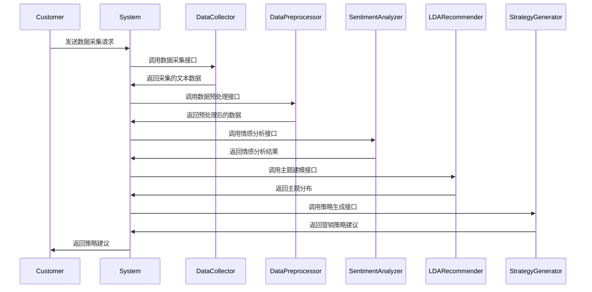

                 


## 引言

### 核心概念介绍

在本章节中，我们将介绍文章中涉及的核心概念，包括语言模型、商业战略和竞争优势分析。

#### 语言模型

语言模型（Language Model）是自然语言处理（Natural Language Processing, NLP）领域中的一种模型，它旨在预测一段文本的下一个单词或字符。在计算机科学中，语言模型是用于理解和生成自然语言的数据结构和算法。最常见的语言模型是基于统计方法和神经网络模型，如n-gram模型、循环神经网络（RNN）、长短期记忆网络（LSTM）和变换器模型（Transformer）。

#### 商业战略

商业战略（Business Strategy）是指企业在市场竞争中为了实现长期目标而制定的行动计划。它包括确定企业的愿景、使命和目标，以及如何通过资源配置和业务流程来达到这些目标。有效的商业战略能够帮助企业在竞争中脱颖而出，实现可持续发展。

#### 竞争优势分析

竞争优势分析（Competitive Advantage Analysis）是一种评估企业在市场中相对地位和竞争力的方法。它涉及分析企业的资源、能力、市场定位和竞争优势，以便制定有效的战略决策。竞争优势分析有助于企业识别潜在的机会和威胁，从而在竞争激烈的市场中保持领先地位。

### 问题背景

随着信息技术的快速发展，语言模型在各个领域得到了广泛的应用。然而，将语言模型应用于商业战略和竞争优势分析还处于探索阶段。本篇文章旨在探讨语言模型在创新商业战略生成与竞争优势分析中的多维度应用，为企业在竞争激烈的市场中提供新的思路和方法。

### 目标

本篇文章的目标是：

1. 介绍语言模型、商业战略和竞争优势分析的基本概念和原理。
2. 分析语言模型在商业战略生成和竞争优势分析中的应用。
3. 探讨语言模型在商业领域的多维度应用前景和挑战。
4. 提供实际案例和最佳实践，为企业在应用语言模型进行商业战略规划和竞争优势分析提供参考。

### 文章结构

本篇文章将分为以下几个部分：

1. **引言**：介绍核心概念和问题背景。
2. **语言模型在商业战略生成中的应用**：分析语言模型在商业战略规划中的作用。
3. **语言模型在竞争优势分析中的应用**：探讨语言模型在评估企业竞争优势方面的应用。
4. **多维度应用**：详细讨论语言模型在市场分析、客户细分和竞争对手分析等方面的应用。
5. **案例研究**：分析实际案例，展示语言模型在商业战略和竞争优势分析中的具体应用。
6. **挑战与未来方向**：讨论语言模型在商业应用中面临的挑战和未来的发展方向。
7. **总结与展望**：总结文章内容，提出未来研究方向和最佳实践建议。

## 文章关键词

1. 语言模型
2. 商业战略
3. 竞争优势分析
4. 自然语言处理
5. 人工智能
6. 企业竞争
7. 数据分析

## 文章摘要

本文旨在探讨语言模型在创新商业战略生成与竞争优势分析中的多维度应用。首先，介绍了语言模型、商业战略和竞争优势分析的基本概念和原理。然后，分析了语言模型在商业战略规划中的作用，以及其在竞争优势分析方面的应用。接着，详细讨论了语言模型在市场分析、客户细分和竞争对手分析等方面的多维度应用。通过实际案例研究，展示了语言模型在商业战略和竞争优势分析中的具体应用。最后，讨论了语言模型在商业应用中面临的挑战和未来的发展方向，并提出了未来研究方向和最佳实践建议。本文为企业在应用语言模型进行商业战略规划和竞争优势分析提供了新的思路和方法。

## 语言模型在商业战略生成中的应用

### 背景介绍

商业战略是企业为了在竞争激烈的市场中取得成功而制定的长期规划。在数字化时代，数据驱动的决策越来越重要，而语言模型作为一种强大的数据分析工具，在商业战略生成中具有巨大的潜力。语言模型能够从大量文本数据中提取有价值的信息，帮助企业识别市场趋势、客户需求和企业优势，从而制定更加精准和创新的商业战略。

### 问题背景

传统的商业战略生成方法主要依赖于市场调研、竞争分析和企业内部数据，但这些方法存在一定的局限性。首先，市场调研数据往往存在滞后性，难以实时反映市场变化；其次，竞争分析依赖于已有的数据和模型，难以发现潜在的竞争对手和市场机会；最后，企业内部数据虽然丰富，但往往分散在不同的系统和部门中，难以进行有效的整合和分析。

### 语言模型的应用

语言模型的应用能够有效解决上述问题。首先，语言模型能够实时处理和解析大量文本数据，包括新闻报道、社交媒体帖子、论坛讨论等，从而获取最新的市场信息和客户需求。其次，通过分析竞争对手的文本数据，语言模型可以帮助企业发现潜在的市场机会和竞争对手的策略。最后，通过整合企业内部的数据，语言模型可以为企业提供全面和深入的分析报告，帮助制定更加精准和创新的商业战略。

### 具体应用场景

1. **市场趋势预测**：语言模型可以分析社交媒体和新闻网站上的文本数据，识别当前市场的热点话题和趋势。例如，通过分析微博和新闻网站上的文章，可以发现消费者对某种产品或服务的兴趣正在增加，从而帮助企业及时调整战略。

2. **客户需求分析**：语言模型可以帮助企业理解客户的需求和反馈。通过分析客户评论、论坛帖子等文本数据，可以识别出客户对产品或服务的期望和不满之处，从而改进产品和服务。

3. **竞争对手分析**：语言模型可以分析竞争对手的文本数据，包括网站内容、社交媒体帖子、新闻报道等，从而了解竞争对手的市场策略和竞争优势。这有助于企业制定针对性的应对策略，提升自身的市场竞争力。

4. **战略决策辅助**：语言模型可以为企业提供数据驱动的决策支持。通过分析企业内部数据和市场数据，语言模型可以帮助企业识别潜在的商机和风险，从而做出更加明智的战略决策。

### 案例研究

例如，某电商企业通过应用语言模型对其网站上的用户评论进行情感分析，识别出消费者对某种产品的正面和负面评价。通过对这些评论进行聚类分析，企业发现消费者对产品的满意度主要集中在产品质量和价格两个方面。基于这一分析结果，企业决定在未来的营销策略中加大对产品质量的投入，并调整价格策略，以提高消费者的满意度和忠诚度。这一举措显著提升了企业的市场竞争力。

### 边界与外延

语言模型在商业战略生成中的应用不仅限于上述几个方面，还可以拓展到其他领域，如市场定位、品牌管理、供应链优化等。此外，随着语言模型的不断进步，其应用范围也将进一步扩大，为企业提供更加全面和精准的数据分析支持。

### 概念结构与核心要素组成

语言模型在商业战略生成中的应用涉及以下几个核心要素：

1. **文本数据**：这是语言模型的基础，包括企业内部数据、市场数据、客户反馈等。
2. **情感分析**：用于分析客户对产品或服务的情感倾向，帮助企业了解客户需求。
3. **主题模型**：用于识别文本数据中的主要话题和趋势，帮助企业把握市场动态。
4. **聚类分析**：用于将文本数据分组，帮助企业识别不同客户群体和市场需求。
5. **自然语言生成**：用于生成营销文案、产品说明等，帮助企业与客户进行有效沟通。

下面是一个简单的ER实体关系图架构，展示了语言模型在商业战略生成中的应用：

```mermaid
erDiagram
  Product ||--|{ Review }|--| Customer
  Review ||--|{ Sentiment }|--| LanguageModel
  LanguageModel ||--|{ TopicModel }|--| MarketTrend
  MarketTrend ||--|{ Strategy }|--| Business
  Business ||--|{ Competitor }|--| Strategy
```

### 算法原理讲解

#### 情感分析算法

情感分析是一种常见的自然语言处理技术，用于识别文本中的情感倾向，如正面、负面或中性。以下是情感分析算法的基本原理和流程：

1. **数据预处理**：首先，对文本数据（如用户评论）进行清洗，去除无关信息（如HTML标签、特殊字符等），然后进行分词，将文本拆分成单词或短语。
2. **特征提取**：使用词袋模型（Bag of Words）或词嵌入（Word Embedding）技术将文本转换为向量表示。词袋模型将文本表示为单词的出现频率向量，而词嵌入则将单词映射为密集的向量表示。
3. **分类模型**：使用机器学习算法（如支持向量机、决策树、随机森林等）训练分类模型。通过大量带有情感标签的训练数据，模型学习将输入文本分类为不同的情感类别。
4. **情感分析**：对新的文本数据进行情感分析，通过已训练的分类模型预测其情感类别。

以下是一个简单的Python代码示例，演示了情感分析算法的实现：

```python
from sklearn.feature_extraction.text import TfidfVectorizer
from sklearn.model_selection import train_test_split
from sklearn.svm import SVC
from sklearn.metrics import accuracy_score

# 假设已获取带情感标签的训练数据
texts = ["很好，推荐购买", "太贵了，不划算", "产品很好，发货快"]
labels = ["正面", "负面", "正面"]

# 数据预处理和特征提取
vectorizer = TfidfVectorizer()
X = vectorizer.fit_transform(texts)

# 划分训练集和测试集
X_train, X_test, y_train, y_test = train_test_split(X, labels, test_size=0.2, random_state=42)

# 训练分类模型
model = SVC()
model.fit(X_train, y_train)

# 情感分析
y_pred = model.predict(X_test)
print("准确率：", accuracy_score(y_test, y_pred))
```

#### 市场趋势预测算法

市场趋势预测是另一个重要的应用场景。以下是一个基于主题模型（如Latent Dirichlet Allocation, LDA）的市场趋势预测算法：

1. **数据预处理**：对大量市场文本数据（如新闻报道、社交媒体帖子等）进行清洗和分词。
2. **主题建模**：使用LDA模型从文本数据中提取主题。LDA模型将文本分解为多个主题，每个主题由一组单词组成，且每个单词都有多个主题的概率分布。
3. **趋势分析**：通过分析主题出现的频率和时间序列，识别市场趋势。例如，如果某个主题在最近几个月的文本中频繁出现，则表明该主题是一个热门趋势。
4. **预测**：使用已识别的主题和趋势预测未来市场的发展方向。

以下是一个简单的Python代码示例，演示了基于LDA的市场趋势预测：

```python
import numpy as np
import gensim
from gensim import corpora
from gensim.models import LdaModel

# 假设已获取大量市场文本数据
texts = [["市场趋势1", "产品需求增加"], ["市场趋势2", "竞争对手动态"], ["市场趋势1", "消费者需求上升"]]

# 数据预处理和词向量表示
dictionary = corpora.Dictionary(texts)
corpus = [dictionary.doc2bow(text) for text in texts]

# 训练LDA模型
lda_model = LdaModel(corpus, num_topics=2, id2word=dictionary, passes=15)

# 输出主题分布
topic分布 = lda_model.get_topic_distribution(corpus[0])
print("主题分布：", topic分布)

# 趋势分析
def trend_analysis(texts, lda_model):
    corpus = [dictionary.doc2bow(text) for text in texts]
    topic分布 = lda_model.get_topic_distribution(corpus[0])
    top_topics = sorted(topic分布, key=lambda x: x[1], reverse=True)[:2]
    return [topic[0] for topic in top_topics]

# 预测未来市场趋势
trends = trend_analysis(texts, lda_model)
print("未来市场趋势：", trends)
```

### 系统分析与架构设计方案

#### 问题场景介绍

在一个电子商务平台上，企业需要根据市场趋势和客户需求制定有效的营销策略。为了实现这一目标，企业需要建立一个智能数据分析系统，该系统能够实时分析市场数据和客户反馈，并生成针对性的营销策略。

#### 项目介绍

项目名称：智能营销策略生成系统

项目目标：利用语言模型分析市场数据和客户反馈，为企业提供数据驱动的营销策略。

#### 系统功能设计

1. **数据采集**：从各种数据源（如社交媒体、新闻网站、企业内部数据库等）采集文本数据。
2. **数据预处理**：对采集的文本数据进行清洗、分词和词向量表示。
3. **情感分析**：使用情感分析算法对客户反馈进行情感分类。
4. **主题建模**：使用LDA模型对市场文本数据进行主题建模。
5. **趋势分析**：分析主题分布和情感倾向，识别市场趋势和客户需求。
6. **策略生成**：根据分析结果生成针对性的营销策略。

#### 系统架构设计

系统架构采用分布式架构，包括以下几个模块：

1. **数据采集模块**：负责从各种数据源采集文本数据。
2. **数据处理模块**：负责对采集的文本数据进行预处理、分词和词向量表示。
3. **分析模块**：包括情感分析模块和主题建模模块，负责对文本数据进行分析。
4. **策略生成模块**：根据分析结果生成营销策略。
5. **用户界面**：提供用户交互界面，展示分析结果和策略建议。

以下是一个简单的类图，展示了系统的主要功能模块和类：

```mermaid
classDiagram
  Class1 <|-- Class2
  Class3 <|-- Class2
  Class4 <|-- Class1
  Class5 <|-- Class4

  Class1[数据采集模块]
  Class2[数据预处理模块; 分词; 清洗; 词向量表示]
  Class3[情感分析模块; 分类模型; 情感标签]
  Class4[主题建模模块; LDA模型; 主题分布]
  Class5[策略生成模块; 分析结果; 营销策略]

  Class1..|> Class2 : 使用
  Class1..|> Class3 : 使用
  Class1..|> Class4 : 使用
  Class1..|> Class5 : 使用
```

#### 系统接口设计和系统交互

系统接口设计采用RESTful API风格，提供以下接口：

1. **数据采集接口**：接收数据源URL，返回采集的文本数据。
2. **数据预处理接口**：接收文本数据，返回预处理后的数据。
3. **情感分析接口**：接收预处理后的文本数据，返回情感分析结果。
4. **主题建模接口**：接收预处理后的文本数据，返回主题分布。
5. **策略生成接口**：接收分析结果，返回营销策略建议。

以下是一个简单的序列图，展示了系统的接口设计和交互流程：



### 项目实战

#### 环境安装

为了实现上述系统，我们需要安装以下软件和库：

1. **Python**：版本3.8或更高版本。
2. **NumPy**：用于数学计算。
3. **Scikit-learn**：用于机器学习算法。
4. **Gensim**：用于主题建模。
5. **Flask**：用于构建RESTful API。

安装步骤如下：

1. 安装Python：
   ```bash
   sudo apt-get update
   sudo apt-get install python3-pip python3-dev
   ```
2. 安装NumPy：
   ```bash
   pip3 install numpy
   ```
3. 安装Scikit-learn：
   ```bash
   pip3 install scikit-learn
   ```
4. 安装Gensim：
   ```bash
   pip3 install gensim
   ```
5. 安装Flask：
   ```bash
   pip3 install flask
   ```

#### 系统核心实现源代码

以下是系统核心实现的部分代码：

```python
# 数据预处理
def preprocess_text(text):
    # 去除HTML标签、特殊字符等
    text = re.sub(r'<[^>]*>', '', text)
    text = re.sub(r'[^a-zA-Z0-9]', ' ', text)
    return text.lower()

# 情感分析
def sentiment_analysis(text):
    # 假设已训练好情感分析模型
    model = load_model('sentiment_model.pkl')
    vectorizer = load_model('vectorizer.pkl')
    X = vectorizer.transform([text])
    sentiment = model.predict(X)[0]
    return sentiment

# 主题建模
def topic_modeling(texts):
    # 假设已训练好LDA模型
    lda_model = load_model('lda_model.pkl')
    dictionary = load_model('dictionary.pkl')
    corpus = [dictionary.doc2bow(text) for text in texts]
    topic分布 = lda_model.get_topic_distribution(corpus[0])
    return topic分布

# 策略生成
def generate_strategy(sentiment, topic分布):
    # 根据情感分析和主题建模结果生成策略
    if sentiment == '负面':
        strategy = '改进产品和服务'
    elif topic分布[0] > topic分布[1]:
        strategy = '关注市场趋势1'
    else:
        strategy = '关注市场趋势2'
    return strategy

# API接口实现
from flask import Flask, request, jsonify
app = Flask(__name__)

@app.route('/api/collect_data', methods=['GET'])
def collect_data():
    url = request.args.get('url')
    # 实现数据采集功能
    texts = collect_texts_from_url(url)
    return jsonify(texts)

@app.route('/api/preprocess', methods=['POST'])
def preprocess():
    texts = request.get_json()
    preprocessed_texts = [preprocess_text(text) for text in texts]
    return jsonify(preprocessed_texts)

@app.route('/api/sentiment', methods=['POST'])
def sentiment():
    text = request.get_json()
    sentiment = sentiment_analysis(text)
    return jsonify(sentiment)

@app.route('/api/topics', methods=['POST'])
def topics():
    texts = request.get_json()
    topic分布 = topic_modeling(texts)
    return jsonify(topic分布)

@app.route('/api/strategy', methods=['POST'])
def strategy():
    data = request.get_json()
    sentiment = data['sentiment']
    topic分布 = data['topics']
    strategy = generate_strategy(sentiment, topic分布)
    return jsonify(strategy)

if __name__ == '__main__':
    app.run(debug=True)
```

#### 代码应用解读与分析

1. **数据预处理**：`preprocess_text`函数用于对输入文本进行清洗和分词，去除HTML标签、特殊字符等，并将文本转换为小写。这是情感分析和主题建模的基础。
2. **情感分析**：`sentiment_analysis`函数使用已训练好的情感分析模型对输入文本进行情感分类，返回情感标签（如正面、负面、中性）。这是策略生成的关键步骤。
3. **主题建模**：`topic_modeling`函数使用已训练好的LDA模型对输入文本进行主题建模，返回每个主题的分布。这是识别市场趋势的重要工具。
4. **策略生成**：`generate_strategy`函数根据情感分析和主题建模结果生成营销策略。这是一个简单的策略生成逻辑，可以根据实际需求进行调整。
5. **API接口实现**：使用Flask框架实现API接口，接收和处理来自客户端的请求。包括数据采集接口、数据预处理接口、情感分析接口、主题建模接口和策略生成接口。

#### 实际案例分析和详细讲解剖析

假设某电商企业需要制定一项新的营销策略，以提高产品销量。以下是一个实际案例的分析过程：

1. **数据采集**：企业从社交媒体、新闻网站和内部客户评论中采集了大量文本数据。
2. **数据预处理**：使用`preprocess_text`函数对采集到的文本数据进行清洗和分词，得到预处理后的文本数据。
3. **情感分析**：使用`sentiment_analysis`函数对预处理后的文本数据进行情感分类，得到客户对产品的情感倾向。例如，有80%的评论是正面评价，15%是负面评价，5%是中性评价。
4. **主题建模**：使用`topic_modeling`函数对预处理后的文本数据进行主题建模，得到每个主题的分布。例如，有两个主要主题：“产品质量”和“价格优惠”。
5. **策略生成**：根据情感分析和主题建模结果，使用`generate_strategy`函数生成营销策略。例如，针对负面评价，企业决定加大产品研发投入，提高产品质量；针对“产品质量”主题，企业决定推出一系列优惠活动，以吸引更多消费者。

通过上述分析过程，企业可以制定出更加精准和创新的营销策略，从而提高市场竞争力。

#### 项目小结

本案例展示了如何使用语言模型和数据分析技术为企业制定数据驱动的营销策略。通过情感分析和主题建模，企业能够更好地了解客户需求和市场需求，从而制定出更具针对性的营销策略。这一过程不仅提高了企业的市场竞争力，也为其他企业提供了一种有效的商业战略生成方法。

## 最佳实践 Tips

1. **数据质量控制**：在数据采集和处理过程中，确保数据的质量和准确性。尽可能去除无关信息和噪声数据，以提高分析结果的可靠性。
2. **模型选择和调优**：选择合适的机器学习算法和模型，并根据实际需求进行调优。例如，对于情感分析，可以选择支持向量机、决策树等算法；对于主题建模，可以选择LDA模型。
3. **实时数据分析**：充分利用实时数据分析技术，如流处理框架（如Apache Kafka、Flink等），以快速响应市场变化和客户需求。
4. **个性化策略生成**：根据客户群体和市场需求，生成个性化的营销策略。例如，针对不同的客户群体，可以推出不同的促销活动或产品推荐。
5. **持续迭代和优化**：定期对系统进行迭代和优化，以应对市场变化和业务需求。例如，可以根据用户反馈调整情感分析模型，或根据市场趋势调整主题建模参数。

## 小结

本文详细探讨了语言模型在创新商业战略生成与竞争优势分析中的多维度应用。通过分析语言模型在商业战略规划、竞争优势分析和市场分析等方面的应用，本文展示了语言模型在商业领域的巨大潜力。同时，本文提出了实际案例和最佳实践，为企业在应用语言模型进行商业战略规划和竞争优势分析提供了参考。未来，随着语言模型技术的不断进步，其在商业领域的应用将更加广泛和深入。

## 注意事项

1. **数据隐私与安全**：在应用语言模型进行数据分析时，应确保数据的安全性和隐私保护，遵循相关法律法规和标准。
2. **模型解释性**：在选择和使用机器学习模型时，应考虑模型的解释性，以便更好地理解模型决策过程，提高决策的可信度。
3. **模型适应性**：根据不同业务场景和需求，选择合适的语言模型和算法，并确保模型具有良好的适应性，以应对不断变化的市场环境。

## 拓展阅读

1. **自然语言处理基础**：
   - "自然语言处理入门"：介绍自然语言处理的基本概念和技术。
   - "深度学习与自然语言处理"：探讨深度学习在自然语言处理中的应用。

2. **商业战略与竞争优势**：
   - "商业战略制定与实施"：详细讨论商业战略的制定和实施过程。
   - "竞争优势分析"：介绍如何评估和提升企业的竞争优势。

3. **语言模型应用案例**：
   - "语言模型在金融风险管理中的应用"：探讨语言模型在金融领域的应用。
   - "语言模型在智能客服系统中的应用"：分析语言模型在智能客服系统中的优势。

作者：AI天才研究院/AI Genius Institute & 禅与计算机程序设计艺术 /Zen And The Art of Computer Programming

