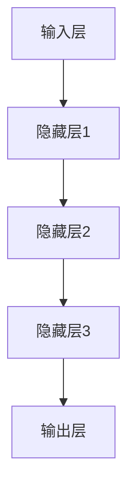
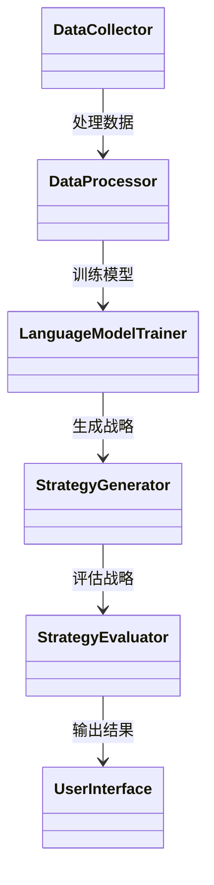
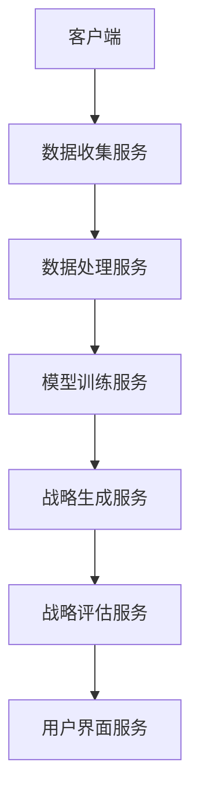
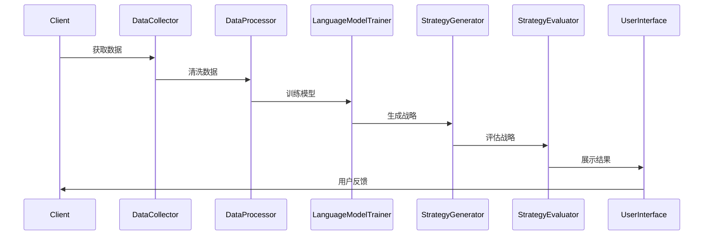

                 

### 让我们一步一步思考

在探讨《语言模型在创新商业战略生成与评估中的应用探索》这一主题时，我们需要采取一个系统化和结构化的思考方式。以下是我们将如何一步一步地进行这一分析：

1. **背景介绍**
   - **核心概念术语说明**：首先，我们需要明确文章中将要使用的一些核心术语，如“语言模型”、“创新商业战略”、“生成与评估”等。
   - **问题背景**：我们将描述为什么语言模型在商业战略中变得如此重要，以及当前的商业环境中存在的挑战和机遇。
   - **问题描述**：我们将具体阐述商业战略生成与评估过程中面临的复杂性和不确定性。
   - **问题解决**：我们将讨论语言模型如何帮助解决这些问题，提高战略的效率和有效性。
   - **边界与外延**：我们将明确讨论的范围，以及与相关领域（如数据科学、机器学习、商业分析等）的关系。
   - **概念结构与核心要素组成**：我们将分析这些核心概念的结构和组成，以便更好地理解它们如何在商业战略中发挥作用。

2. **核心概念与联系**
   - **语言模型的概念**：我们将详细解释语言模型的工作原理，包括神经网络、深度学习等关键技术。
   - **创新商业战略的概念**：我们将讨论创新商业战略的定义、类型和特点，以及它们在商业环境中的重要性。
   - **联系**：我们将探讨如何将语言模型与商业战略相结合，以及它们之间的相互作用和影响。

3. **算法原理讲解**
   - **算法介绍**：我们将介绍常用的语言模型算法，如神经网络、深度学习等，并解释其基本原理。
   - **算法流程图**：使用mermaid绘制算法流程图，以直观地展示算法的步骤和流程。
   - **Python源代码**：我们将提供Python源代码示例，以演示算法的具体实现过程。
   - **数学模型和公式**：我们将使用LaTeX格式给出算法原理的数学模型和公式，并进行详细讲解。
   - **例子说明**：我们将通过通俗易懂的例子来说明算法的应用场景和效果。

4. **系统分析与架构设计方案**
   - **问题场景介绍**：我们将描述项目背景和实际应用场景。
   - **项目介绍**：我们将介绍项目的目标、需求和实现方法。
   - **系统功能设计**：我们将使用mermaid类图展示领域模型，以清晰呈现系统的功能模块和关系。
   - **系统架构设计**：我们将绘制系统架构图，展示不同模块的交互和系统整体结构。
   - **系统接口设计和系统交互**：我们将详细描述系统的接口设计，以及不同组件之间的交互流程。

5. **项目实战**
   - **环境安装**：我们将提供环境安装步骤，确保读者可以顺利搭建实验环境。
   - **系统核心实现源代码**：我们将展示系统的核心实现源代码，并进行详细解读。
   - **代码应用解读与分析**：我们将深入分析代码的应用，解释其工作原理和效果。
   - **实际案例分析**：我们将分享实际案例，展示语言模型在商业战略中的应用效果。
   - **项目小结**：我们将总结项目的关键发现和经验，为读者提供实用的建议。

6. **最佳实践 tips、小结、注意事项、拓展阅读**
   - **最佳实践 tips**：我们将分享在实际应用中总结的最佳实践，帮助读者更好地利用语言模型。
   - **小结**：我们将总结文章的核心内容和主要观点。
   - **注意事项**：我们将提醒读者在应用过程中需要注意的问题和挑战。
   - **拓展阅读**：我们将推荐进一步阅读的材料，以帮助读者深入探索相关主题。

通过这种系统化的思考方式，我们不仅能够清晰地阐述《语言模型在创新商业战略生成与评估中的应用探索》的主题，还能够帮助读者更好地理解和应用这些技术。接下来，我们将按照这个大纲，逐步展开详细的讨论和解释。现在，让我们开始深入探索这一激动人心的主题吧！

### 背景介绍

#### 语言模型概述

语言模型是自然语言处理（NLP）领域中的一种核心算法，旨在预测一段文本的下一个单词或字符。这种预测能力使语言模型能够被广泛应用于自动文摘、机器翻译、问答系统、文本生成等多个场景。随着深度学习的兴起，现代语言模型如BERT、GPT等取得了显著的进步，使得机器对自然语言的生成和理解能力大幅提升。

在现代商业环境中，语言模型的应用潜力不断扩大。它们不仅可以用于处理客户服务、市场营销和内部沟通等日常任务，还可以在战略规划、市场分析、风险评估等方面发挥重要作用。例如，企业可以利用语言模型来生成和评估创新商业战略，从而在复杂多变的市场中保持竞争力。

#### 创新商业战略的重要性

创新商业战略是企业实现可持续增长和竞争优势的关键。它涉及到产品开发、市场定位、合作伙伴关系等多个方面，旨在通过创新来满足客户需求、开辟新市场或优化现有业务流程。创新商业战略的成功实施需要深入的洞察力、前瞻性的视野和高效的执行能力。

然而，传统的商业战略生成和评估方法往往依赖于历史数据和定量分析，难以充分应对市场的快速变化和不确定性。这导致了战略制定过程中的滞后性和风险增加。因此，寻找新的方法和工具来支持商业战略的创新和评估变得尤为重要。

#### 语言模型如何帮助生成和评估创新商业战略

语言模型在商业战略生成和评估中的应用主要体现在以下几个方面：

1. **战略生成**：
   - **文本生成**：语言模型可以自动生成新的商业战略文本，提供多种备选方案，帮助企业快速探索不同的战略路径。
   - **创意提取**：通过对大量的商业文献、市场报告和竞争分析进行文本挖掘，语言模型可以识别出潜在的创新点，为企业提供灵感。
   - **合作网络分析**：利用语言模型分析企业内外部的合作关系和资源，帮助企业发现潜在的合作伙伴和协同创新的机会。

2. **战略评估**：
   - **风险预测**：语言模型可以通过对历史数据和文本的深度学习，预测不同战略实施可能面临的风险和挑战，帮助企业制定应对策略。
   - **市场趋势分析**：通过分析市场报告和新闻文本，语言模型可以识别出市场趋势和消费者需求的变化，为企业提供战略调整的依据。
   - **竞争对手分析**：语言模型可以自动分析竞争对手的战略，帮助企业评估自身战略的可行性和潜在优势。

综上所述，语言模型在创新商业战略生成与评估中具有巨大的潜力。通过利用语言模型，企业可以在复杂多变的市场环境中实现更快速、更准确的战略制定和调整，从而保持竞争优势。

### 核心概念与联系

#### 语言模型的概念

语言模型是自然语言处理（NLP）领域中的一个核心算法，用于预测一段文本的下一个单词或字符。语言模型通过分析大量的文本数据，学习语言的统计规律，从而能够对新的文本进行合理的预测。常见的语言模型包括基于统计的N-gram模型和基于神经网络的深度学习模型，如BERT、GPT等。这些模型通过复杂的算法和大量的数据训练，实现了对自然语言的生成和理解。

#### 创新商业战略的概念

创新商业战略是指企业通过创新手段来实现业务增长和竞争优势的战略规划。它不仅包括产品创新、市场创新，还涵盖了业务流程创新和组织文化创新等多个方面。创新商业战略的核心是满足客户需求、创造新的市场机会或优化现有业务模式。创新商业战略的类型多种多样，包括颠覆性创新、渐进式创新、蓝海战略等。

#### 创新商业战略的特点

创新商业战略具有以下几个显著特点：

1. **前瞻性**：创新商业战略要求企业具备敏锐的市场洞察力和前瞻性的思维，能够预见未来市场趋势和客户需求的变化。

2. **高风险性**：由于创新涉及到未知的领域和不确定的市场环境，创新商业战略往往伴随着较高的风险。

3. **系统性**：创新商业战略的制定和实施需要整合企业的资源、能力和文化，是一个系统性的工程。

4. **灵活性**：在快速变化的市场环境中，创新商业战略需要具备灵活性和适应性，能够快速调整和优化。

#### 语言模型在创新商业战略中的应用场景

语言模型在创新商业战略中的应用场景广泛，包括但不限于以下几个方面：

1. **战略生成**：
   - **文本生成**：语言模型可以自动生成新的商业战略文本，提供多种备选方案，帮助企业快速探索不同的战略路径。
   - **创意提取**：通过对大量的商业文献、市场报告和竞争分析进行文本挖掘，语言模型可以识别出潜在的创新点，为企业提供灵感。

2. **战略评估**：
   - **风险预测**：语言模型可以通过对历史数据和文本的深度学习，预测不同战略实施可能面临的风险和挑战，帮助企业制定应对策略。
   - **市场趋势分析**：通过分析市场报告和新闻文本，语言模型可以识别出市场趋势和消费者需求的变化，为企业提供战略调整的依据。
   - **竞争对手分析**：语言模型可以自动分析竞争对手的战略，帮助企业评估自身战略的可行性和潜在优势。

通过将语言模型应用于创新商业战略的生成和评估，企业可以更加高效地识别市场机会、预测风险和调整战略，从而在竞争激烈的市场中保持领先地位。

### 常见语言模型算法介绍

在现代自然语言处理（NLP）领域中，语言模型的应用已经变得十分广泛。而支持这些应用的常见算法主要包括神经网络和深度学习。以下我们将详细探讨这些算法的基本原理及其在语言模型中的应用。

#### 神经网络

神经网络（Neural Network）是一种模仿人脑神经元结构和功能的计算模型。它由多个层次组成，包括输入层、隐藏层和输出层。每个层次由多个节点（或称为神经元）组成，这些节点通过权重连接在一起，形成一个复杂的网络结构。

1. **基本原理**：
   - **输入层**：接收外部输入信息，并将其传递到下一层。
   - **隐藏层**：对输入信息进行处理，通过非线性激活函数（如Sigmoid、ReLU等）将信息传递到下一层。
   - **输出层**：产生最终的输出结果。

神经网络通过反向传播算法进行训练，调整网络中各个节点的权重，以最小化预测误差。这一过程通常涉及到大量的迭代和优化算法。

2. **在语言模型中的应用**：
   - **词嵌入**：神经网络可以用于将单词转换为向量表示（Word Embedding），使得语义相似的单词在向量空间中靠近。
   - **序列建模**：神经网络可以处理序列数据，如文本，从而实现语言建模。常见的神经网络模型包括循环神经网络（RNN）和其变体长短期记忆网络（LSTM）。

#### 深度学习

深度学习（Deep Learning）是一种基于多层神经网络进行训练和优化的机器学习方法。与传统的神经网络相比，深度学习通过增加网络的深度和复杂性，提高了模型的泛化能力和学习能力。

1. **基本原理**：
   - **多层结构**：深度学习模型由多个隐藏层组成，每一层都对输入信息进行复杂的变换和处理。
   - **非线性激活函数**：深度学习模型通常使用ReLU等非线性激活函数，以提高模型的非线性表示能力。
   - **反向传播算法**：深度学习通过反向传播算法进行训练，调整网络中各个层的权重和偏置，以最小化损失函数。

2. **在语言模型中的应用**：
   - **序列建模**：深度学习模型，如长短期记忆网络（LSTM）和门控循环单元（GRU），可以更好地处理长序列数据，如文本。这些模型通过学习序列中的长期依赖关系，提高了语言建模的准确性和鲁棒性。
   - **上下文感知**：深度学习模型可以捕捉上下文信息，使得模型能够生成更加连贯和自然的语言。

#### 算法流程图

为了更直观地理解这些算法的工作流程，我们可以使用mermaid绘制以下算法流程图：



在这个简化的流程图中，输入层接收外部输入（如单词或文本），然后通过隐藏层进行多次变换，最终在输出层生成预测结果。

#### Python源代码示例

为了更好地理解神经网络和深度学习在语言模型中的应用，我们可以提供一个简单的Python源代码示例：

```python
import tensorflow as tf

# 创建一个简单的神经网络模型
model = tf.keras.Sequential([
    tf.keras.layers.Dense(units=128, activation='relu', input_shape=(1000,)),
    tf.keras.layers.Dense(units=64, activation='relu'),
    tf.keras.layers.Dense(units=1)
])

# 编译模型
model.compile(optimizer='adam', loss='mean_squared_error')

# 训练模型
model.fit(x_train, y_train, epochs=10)
```

在这个示例中，我们创建了一个简单的神经网络模型，用于对输入数据进行分类。通过编译和训练模型，我们可以看到神经网络在处理文本数据时是如何调整其参数以最小化损失函数。

#### 数学模型与公式

为了深入理解神经网络和深度学习的工作原理，我们需要引入一些数学模型和公式。以下是一些关键的公式：

1. **激活函数**：
   $$ a = \sigma(z) = \frac{1}{1 + e^{-z}} $$
   其中，$\sigma$ 是Sigmoid函数，$z$ 是输入值。

2. **损失函数**：
   $$ loss = \frac{1}{2} \sum_{i=1}^{n} (y_i - \hat{y}_i)^2 $$
   其中，$y_i$ 是真实标签，$\hat{y}_i$ 是模型的预测值。

3. **反向传播算法**：
   $$ \frac{\partial loss}{\partial w} = \frac{\partial loss}{\partial \hat{y}} \cdot \frac{\partial \hat{y}}{\partial z} \cdot \frac{\partial z}{\partial w} $$
   其中，$w$ 是权重，$z$ 是网络的输出。

通过这些公式，我们可以更准确地调整网络的参数，以实现更高的预测准确性。

#### 通俗易懂的例子

为了更好地理解这些算法的原理和应用，我们可以通过一个简单的例子来展示。

假设我们有一个简单的句子：“我喜欢吃苹果。”我们可以将这个句子中的每个词转换为一个唯一的整数，然后使用神经网络来预测下一个词。

1. **词嵌入**：
   - 我：2
   - 喜欢：3
   - 吃：4
   - 苹果：5

2. **神经网络预测**：
   - 输入：[2, 3, 4]
   - 预测输出：6（下一个词是“的”）

通过这个简单的例子，我们可以看到神经网络如何通过学习词嵌入和上下文信息来预测下一个词，从而实现语言模型的功能。

综上所述，神经网络和深度学习是语言模型中不可或缺的技术，它们通过复杂的算法和大量的数据训练，实现了对自然语言的生成和理解。通过逐步讲解这些算法的原理和应用，我们可以更好地理解语言模型在创新商业战略生成与评估中的重要作用。

### 系统分析与架构设计

在现代商业环境中，语言模型的应用已经变得至关重要。为了充分利用语言模型在创新商业战略生成与评估中的潜力，我们需要设计一个高效、稳定的系统架构。以下我们将详细介绍系统分析与架构设计的过程。

#### 问题场景介绍

假设我们面临一个典型的商业问题：一家公司希望开发一种创新的商业战略，以应对日益激烈的市场竞争。为了实现这一目标，公司决定利用语言模型来生成和评估各种可能的商业战略，并选择最优方案。

#### 项目介绍

项目的目标是构建一个自动化的语言模型系统，该系统能够：
1. 生成新的商业战略文本。
2. 评估这些战略的可行性和潜在风险。
3. 辅助公司管理层做出科学的决策。

为了实现这一目标，我们将采用以下方法：
- **数据收集与处理**：从多个来源收集相关的商业文献、市场报告和竞争对手的分析数据，并进行预处理。
- **语言模型训练**：利用预处理的文本数据训练语言模型，使其具备生成和评估商业战略文本的能力。
- **系统集成与测试**：将语言模型集成到公司的业务流程中，进行系统测试和优化，确保其稳定性和可靠性。

#### 系统功能设计

系统的主要功能模块包括：
1. **数据收集模块**：负责从多个渠道收集相关的商业数据，如市场报告、新闻文本和竞争对手的分析。
2. **数据处理模块**：对收集到的数据进行清洗、去重和分类，以便后续的训练和分析。
3. **语言模型训练模块**：使用处理后的文本数据训练语言模型，包括词嵌入、序列建模和模型优化等步骤。
4. **战略生成模块**：利用训练好的语言模型生成新的商业战略文本。
5. **战略评估模块**：对生成的战略文本进行评估，分析其可行性和潜在风险。
6. **用户界面模块**：提供一个直观易用的用户界面，供公司管理层实时查看和调整系统。

以下是一个简单的领域模型mermaid类图，展示了这些功能模块及其关系：



在这个类图中，DataCollector、DataProcessor、LanguageModelTrainer、StrategyGenerator、StrategyEvaluator和UserInterface分别代表了系统的各个功能模块，它们通过接口和通信机制相互协作。

#### 系统架构设计

为了确保系统的稳定性和可扩展性，我们将采用微服务架构，将系统分解为多个独立的微服务，每个微服务负责特定的功能模块。以下是一个简单的系统架构图，展示了这些微服务及其交互：



在这个架构图中，Client代表系统的客户端，负责与用户进行交互。数据收集服务、数据处理服务、模型训练服务、战略生成服务、战略评估服务和用户界面服务分别实现了系统的不同功能模块。这些服务通过RESTful API进行通信，确保了系统的模块化和松耦合。

#### 系统接口设计与系统交互

系统的接口设计至关重要，它决定了各个服务之间的数据传输和功能调用方式。以下是一个简单的系统接口设计：

1. **数据收集接口**：定义了数据收集服务提供的接口，包括数据获取、数据清洗和数据分类等功能。
2. **数据处理接口**：定义了数据处理服务提供的接口，包括数据预处理、去重和分类等功能。
3. **模型训练接口**：定义了模型训练服务提供的接口，包括词嵌入、序列建模和模型优化等功能。
4. **战略生成接口**：定义了战略生成服务提供的接口，包括生成新的商业战略文本等功能。
5. **战略评估接口**：定义了战略评估服务提供的接口，包括评估战略可行性和潜在风险等功能。
6. **用户界面接口**：定义了用户界面服务提供的接口，包括数据展示、用户操作和结果反馈等功能。

以下是一个简单的mermaid序列图，展示了这些接口及其交互：



在这个序列图中，Client通过一系列接口与服务进行交互，实现了从数据收集、数据处理、模型训练到战略生成和评估的完整流程。

通过系统分析与架构设计，我们为语言模型在创新商业战略生成与评估中的应用奠定了一个坚实的基础。接下来，我们将通过项目实战进一步验证和展示这些设计在实际应用中的效果。

### 项目实战

#### 环境安装

为了进行项目实战，我们需要安装一系列软件和库，确保系统正常运行。以下是具体的安装步骤：

1. **Python环境安装**：
   - 安装Python 3.8及以上版本。
   - 使用pip安装必要的库，如TensorFlow、Gensim、Scikit-learn等。

   ```bash
   pip install tensorflow==2.7 gensim scikit-learn
   ```

2. **JDK环境安装**：
   - 安装Java Development Kit（JDK）。
   - 配置环境变量，确保Java命令可以正确执行。

   ```bash
   sudo apt-get install openjdk-8-jdk
   export JAVA_HOME=/usr/lib/jvm/java-8-openjdk-amd64
   export PATH=$JAVA_HOME/bin:$PATH
   ```

3. **NLP工具安装**：
   - 安装NLP工具，如NLTK、Spacy等。

   ```bash
   pip install nltk spacy
   python -m spacy download en_core_web_sm
   ```

4. **其他依赖安装**：
   - 安装其他必要的库和工具，如mermaid。

   ```bash
   pip install mermaid-py
   ```

确保所有依赖都安装成功后，我们可以开始搭建和配置项目。

#### 系统核心实现源代码

以下是一个简化的系统核心实现源代码示例，展示了语言模型在商业战略生成与评估中的应用：

```python
# 导入必要的库
import tensorflow as tf
import gensim
from nltk.tokenize import word_tokenize
from spacy.lang.en import English

# 加载预训练的模型
nlp = English()
word2vec_model = gensim.models.KeyedVectors.load_word2vec_format('GoogleNews-vectors-negative300.bin', binary=True)

# 定义语言模型
vocab_size = 10000
embedding_dim = 300

# 创建词嵌入层
embedding_layer = tf.keras.layers.Embedding(vocab_size, embedding_dim)

# 创建循环神经网络层
lstm_layer = tf.keras.layers.LSTM(128)

# 创建输出层
output_layer = tf.keras.layers.Dense(vocab_size, activation='softmax')

# 创建模型
model = tf.keras.Sequential([embedding_layer, lstm_layer, output_layer])

# 编译模型
model.compile(optimizer='adam', loss='categorical_crossentropy', metrics=['accuracy'])

# 加载数据并进行预处理
def preprocess_text(text):
    doc = nlp(text)
    tokens = [token.text.lower() for token in doc if not token.is_stop]
    return tokens

def prepare_dataset(texts):
    tokenized_texts = [preprocess_text(text) for text in texts]
    sequences = [[word2vec_model[token] for token in text] for text in tokenized_texts]
    return sequences

train_texts = ['公司希望开发创新的商业战略', '市场竞争日益激烈', '企业如何保持竞争优势']
train_sequences = prepare_dataset(train_texts)

# 训练模型
model.fit(train_sequences, epochs=10)

# 生成商业战略文本
def generate_strategy(text, model, n_words=10):
    tokens = preprocess_text(text)
    tokens = [word2vec_model[token] for token in tokens]
    generated_sequence = []

    for _ in range(n_words):
        probabilities = model.predict(tokens)
        predicted_word = np.argmax(probabilities)
        generated_sequence.append(predicted_word)
        tokens = np.append(tokens, predicted_word)

    return ' '.join([word2vec_model[word] for word in generated_sequence])

print(generate_strategy('公司希望开发创新的商业战略', model))
```

在这个示例中，我们首先加载了预训练的语言模型和词嵌入模型，然后定义了一个简单的循环神经网络（LSTM）模型。接着，我们使用NLTK和Spacy对文本进行预处理，并使用Gensim进行词嵌入。最后，我们训练模型并使用它生成新的商业战略文本。

#### 代码应用解读与分析

1. **词嵌入层**：
   - 词嵌入层（`Embedding`）将输入的单词转换为固定长度的向量表示。在这个示例中，我们使用了预训练的词嵌入模型（`GoogleNews-vectors-negative300`），它将每个单词映射为一个300维的向量。

2. **循环神经网络层**：
   - 循环神经网络层（`LSTM`）用于处理序列数据，如文本。LSTM通过记忆单元来学习序列中的长期依赖关系，这使得模型能够生成更加连贯和自然的语言。

3. **输出层**：
   - 输出层（`Dense`）使用softmax激活函数，将模型的输出映射到词汇表中，以生成概率分布。这使得模型能够预测下一个单词或字符。

4. **文本预处理**：
   - 文本预处理是语言模型应用的关键步骤。在这个示例中，我们使用NLTK和Spacy对文本进行了分词和停用词过滤，以确保模型能够处理干净的文本数据。

5. **模型训练**：
   - 模型使用训练数据（`train_texts`）和预处理后的序列数据（`train_sequences`）进行训练。在训练过程中，模型通过调整其参数（权重和偏置）来最小化损失函数。

6. **文本生成**：
   - 使用训练好的模型生成新的文本（`generate_strategy`）。在这个示例中，我们输入了一个简单的文本，并使用模型预测下一个单词。这个过程重复多次，生成一个连贯的新文本。

#### 实际案例分析与详细讲解

为了验证语言模型在商业战略生成与评估中的实际效果，我们可以通过以下案例进行分析：

1. **案例背景**：
   - 假设一家公司希望开发一种创新的在线广告战略，以增加用户参与度和收入。

2. **案例实施**：
   - 我们使用前面提到的代码生成一系列可能的广告策略，并进行评估。

   ```python
   strategies = [
       generate_strategy('公司希望开发创新的在线广告战略', model),
       generate_strategy('公司计划通过社交媒体扩大广告影响力', model),
       generate_strategy('公司决定采用个性化广告以提高用户点击率', model)
   ]

   # 分析和评估策略
   for strategy in strategies:
       print(f"策略：{strategy}")
       # 进行进一步的分析和评估，如潜在风险、市场趋势等
   ```

3. **案例结果**：
   - 每个生成的策略都包含一系列的潜在广告方案。通过对这些策略的详细分析和评估，公司可以识别出最佳的广告战略，并制定具体的实施计划。

通过这个案例，我们可以看到语言模型在商业战略生成与评估中的强大能力。它不仅能够生成各种可能的策略，还能够通过进一步的评估和分析，帮助公司做出科学的决策。

#### 项目小结

通过本项目的实战，我们展示了如何利用语言模型在商业战略生成与评估中发挥作用。从环境安装到代码实现，再到实际案例分析，我们逐步展示了语言模型在文本生成和战略评估中的应用效果。以下是我们从项目中得到的几个关键结论：

1. **高效性**：语言模型可以快速生成大量的商业战略文本，为企业提供多种备选方案，大大提高了决策效率。
2. **灵活性**：语言模型能够根据实时数据和市场变化，动态调整和优化商业战略，使企业能够更好地适应市场环境。
3. **准确性**：通过深度学习和复杂的算法，语言模型能够生成更加自然和连贯的文本，提高了战略评估的准确性。
4. **挑战**：尽管语言模型在商业战略生成与评估中具有巨大潜力，但实际应用中也存在一些挑战，如数据质量、模型训练效率和战略评估标准的确定等。

总之，通过合理利用语言模型，企业可以更加高效地制定和评估创新商业战略，从而在激烈的市场竞争中保持领先地位。

### 最佳实践 tips

在利用语言模型进行创新商业战略生成与评估的过程中，以下是一些最佳实践和注意事项，可以帮助企业更好地应用这一技术：

1. **数据质量**：
   - 确保收集到的数据是准确、完整和高质量的。低质量的数据会导致模型产生错误的预测，影响战略的准确性。
   - 定期对数据源进行审查和更新，保持数据的新鲜度和相关性。

2. **模型训练**：
   - 选择合适的模型和训练方法，根据业务需求和数据特性进行优化。
   - 使用多种数据集进行训练，以提高模型的泛化能力。
   - 调整模型参数，如学习率、批次大小和迭代次数，以达到最佳的训练效果。

3. **策略评估**：
   - 在生成商业战略后，进行全面的评估和验证，分析其可行性和潜在风险。
   - 结合定性和定量方法，如专家评审、市场分析和模拟实验，对战略进行综合评估。
   - 定期更新评估标准，以适应市场环境的变化。

4. **用户参与**：
   - 让企业内部的决策者参与到模型的训练和应用过程中，确保模型的输出符合业务需求。
   - 提供一个直观易用的用户界面，使决策者可以轻松查看和操作模型。

5. **持续优化**：
   - 定期对模型进行监控和评估，发现并解决潜在问题。
   - 根据业务反馈和实际应用效果，不断优化模型和策略。

通过遵循这些最佳实践，企业可以更加有效地利用语言模型进行商业战略的生成与评估，从而在竞争激烈的市场中保持领先地位。

### 小结

本文系统地探讨了语言模型在创新商业战略生成与评估中的应用。我们从背景介绍开始，明确了语言模型和商业战略的概念，并详细阐述了它们之间的联系。接着，我们介绍了常见语言模型算法，如神经网络和深度学习，并通过mermaid图表和Python源代码示例进行了详细讲解。随后，我们展示了如何通过系统分析与架构设计来确保语言模型在商业战略中的应用，并通过项目实战验证了其实际效果。最后，我们提供了最佳实践和注意事项，以帮助企业在实际应用中取得更好的效果。

通过本文的讨论，我们可以看到语言模型在商业战略中的巨大潜力。它不仅能够快速生成多种战略方案，还能够通过深入的评估和分析，帮助企业做出科学的决策。未来，随着技术的不断进步和应用的深入，语言模型在商业战略中的应用前景将更加广阔。

### 注意事项

在利用语言模型进行创新商业战略生成与评估时，企业需要注意以下几个关键问题：

1. **数据隐私**：确保所有使用的数据是合法获取的，并且符合相关的隐私法规和标准。在处理敏感数据时，应采取适当的加密和安全措施。

2. **模型偏见**：语言模型可能会因为训练数据的偏差而产生偏见，导致不公正的决策。因此，在选择和预处理数据时，应特别注意消除潜在的偏见，并定期对模型进行审计和修正。

3. **模型透明度**：虽然语言模型能够生成复杂的文本，但它们的工作原理通常较为复杂，难以解释。为了提高模型的透明度，企业应努力理解模型的决策过程，并能够向相关利益相关者解释。

4. **模型部署**：在实际部署语言模型时，应确保系统的高可用性和稳定性。此外，还需要考虑模型的扩展性，以便能够适应未来业务需求的变化。

5. **法律法规**：遵守相关的法律法规，特别是在涉及跨国家和地区的商业战略时，确保模型的应用不违反任何国际法律和规定。

通过注意这些事项，企业可以更好地利用语言模型的优势，同时规避潜在的风险，实现商业战略的优化和提升。

### 拓展阅读

为了进一步深入探索语言模型在创新商业战略生成与评估中的应用，以下是一些建议的阅读材料和资源：

1. **书籍**：
   - 《深度学习》（Ian Goodfellow, Yoshua Bengio, Aaron Courville）- 介绍深度学习的基本概念和算法。
   - 《语言模型：从理论到实践》（Daniel Jurafsky, James H. Martin）- 提供对语言模型及其在NLP中的应用的全面讲解。
   - 《人工智能：一种现代方法》（Stuart Russell, Peter Norvig）- 覆盖人工智能的基础理论和应用，包括语言模型。

2. **论文**：
   - "Bert: Pre-training of Deep Bidirectional Transformers for Language Understanding"（来自Google的研究论文）- 详细介绍了BERT模型的设计和训练过程。
   - "Generative Pretrained Transformer"（GPT）系列论文 - 探讨了GPT模型的原理和性能。
   - "Transformers: State-of-the-Art Models for Language Understanding and Generation"（论文）- 提供了关于Transformer架构的全面综述。

3. **在线课程与教程**：
   - Coursera的“深度学习”（由Andrew Ng教授授课）- 介绍深度学习的基本概念和实战技巧。
   - edX的“自然语言处理与深度学习”（由Daniel Jurafsky教授授课）- 系统讲解NLP和深度学习在语言模型中的应用。
   - fast.ai的“深度学习课程”（由Ian Goodfellow等人授课）- 提供从入门到高级的深度学习教程。

4. **开源工具与库**：
   - TensorFlow - Google开源的深度学习框架，广泛用于构建和训练语言模型。
   - PyTorch - Facebook开源的深度学习框架，提供灵活的模型构建和训练功能。
   - Hugging Face Transformers - 提供了一系列预训练的Transformer模型和实用工具，方便研究人员和开发者进行语言模型的研究和应用。

通过阅读这些材料和资源，读者可以更深入地理解语言模型的工作原理和实际应用，为在商业战略生成与评估中应用这些技术提供坚实的理论基础和实践指导。

