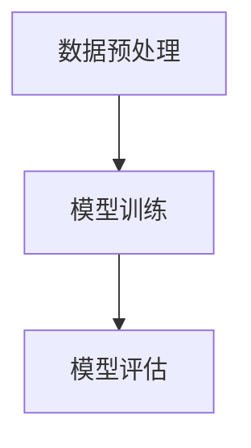
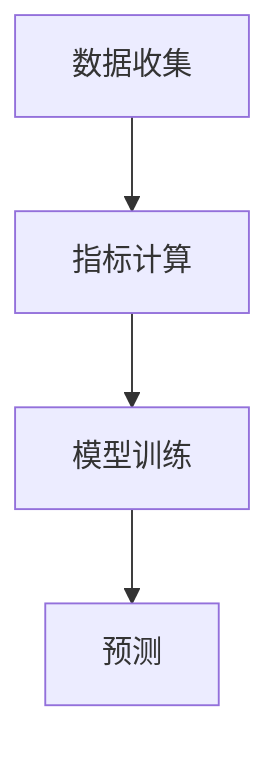
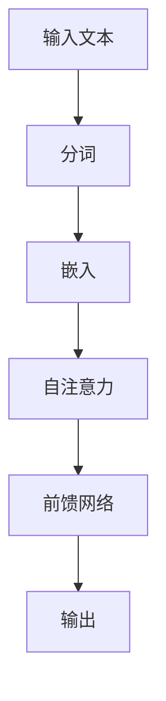
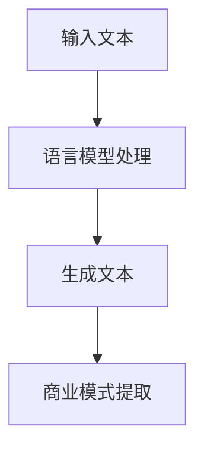
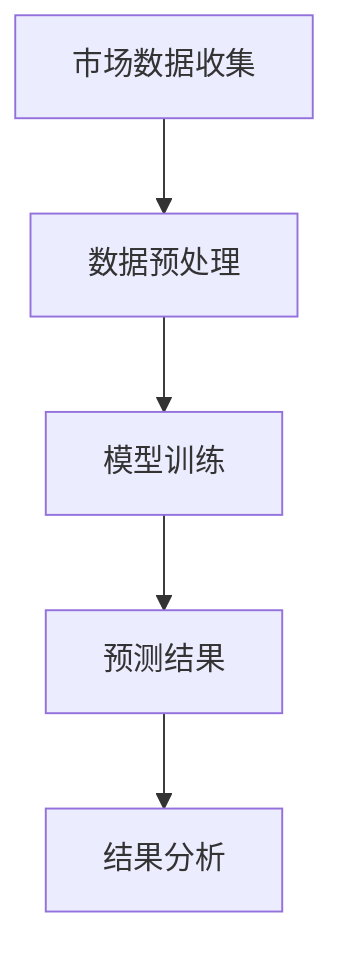
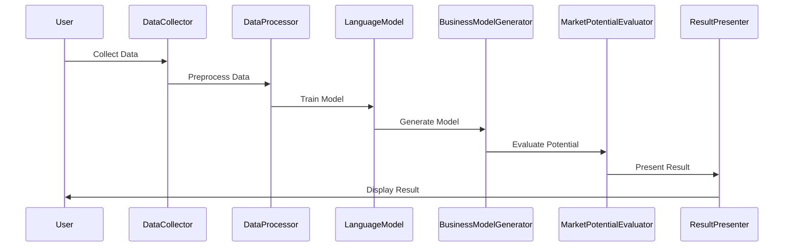

                 

### 研究背景与概念介绍

#### 第1章 研究背景

##### 1.1 问题背景

在当今信息化和智能化的时代，语言模型（如自然语言处理、文本生成、机器翻译等）已经成为人工智能领域的一个重要研究方向。随着深度学习和大数据技术的发展，语言模型的性能得到了显著提升。然而，如何在商业环境中有效地应用这些先进技术，成为企业和研究机构关注的焦点。商业模式的创新和市场的潜力评估，是企业成功的关键。

##### 1.2 问题描述

在商业环境中，如何利用语言模型生成创新性的商业模式，并对其市场潜力进行准确评估，是当前面临的主要挑战。现有的商业模式创新方法往往依赖于经验和直觉，缺乏系统性和可重复性。市场潜力评估则存在数据获取困难、指标选择不统一等问题。因此，研究如何利用语言模型解决这些问题，具有重要的实际意义。

##### 1.3 问题解决方法

本文提出了一种基于语言模型的方法，通过以下步骤解决上述问题：

1. **语言模型原理**：详细介绍语言模型的基本原理和数学模型。
2. **商业模式生成算法**：阐述如何利用语言模型生成创新性商业模式。
3. **市场潜力评估算法**：描述如何使用语言模型对商业模式的市场潜力进行评估。
4. **系统分析与架构设计**：设计一个可扩展的系统架构，以实现上述算法的应用。
5. **项目实战**：通过实际案例展示如何在实际项目中应用这些算法和系统。

##### 1.4 研究边界与外延

本文的研究主要聚焦于文本生成和文本分类等语言模型在商业模式创新和市场潜力评估中的应用。同时，本研究在数据集选择、算法优化等方面也进行了探索。然而，由于篇幅和实际情况的限制，本文并未涉及所有可能的商业场景和市场情况。

##### 1.5 核心概念与联系

为了更好地理解本文的研究内容，以下是几个核心概念的介绍：

- **语言模型**：一种能够生成文本的模型，其核心目标是预测下一个单词或字符。
- **创新商业模式**：一种新型的商业运作模式，旨在通过创新来获得竞争优势。
- **市场潜力评估**：对商业模式在市场上可能取得的业绩和影响进行预测和评估。

#### 第2章 核心概念原理

##### 2.1 语言模型原理

**2.1.1 语言模型的基础理论**

语言模型是一种基于统计或神经网络的模型，用于预测文本序列中的下一个单词或字符。本文主要介绍基于神经网络的Transformer模型和GPT模型。

**2.1.2 语言模型的数学模型与公式**

语言模型通常使用概率分布来表示文本序列的概率。例如，对于一个单词序列 \(w_1, w_2, ..., w_n\)，语言模型的目标是最大化概率 \(P(w_1, w_2, ..., w_n)\)。

**2.1.3 语言模型流程图解析**

语言模型的训练过程通常包括数据预处理、模型训练和评估三个阶段。下面是一个简单的语言模型训练流程图：



##### 2.2 创新商业模式原理

**2.2.1 创新商业模式的分类与属性**

创新商业模式可以分为多种类型，如平台化商业模式、共享经济模式、订阅模式等。每种模式都有其独特的属性和适用场景。

**2.2.2 创新商业模式的特征对比表格**

以下是几种常见创新商业模式特征的对比表格：

| 模式类型 | 特征1 | 特征2 | 特征3 |
| --- | --- | --- | --- |
| 平台化模式 | 依赖第三方服务 | 跨领域整合 | 用户规模效应 |
| 共享经济模式 | 共享闲置资源 | 网络效应 | 平台治理挑战 |
| 订阅模式 | 定期收取费用 | 服务持续化 | 用户粘性 |

**2.2.3 创新商业模式的mermaid ER实体关系图**

以下是创新商业模式的一个ER实体关系图：

```mermaid
erDiagram
    Customer ||--|{ Order } : "places"
    Product ||--|{ Order } : "contains"
    Store ||--|{ Product } : "sells"
```

##### 2.3 市场潜力评估原理

**2.3.1 市场潜力评估指标体系**

市场潜力评估通常涉及多个指标，如市场规模、增长速度、竞争格局等。以下是一个简单的市场潜力评估指标体系：

| 指标名称 | 指标说明 | 权重 |
| --- | --- | --- |
| 市场规模 | 目标市场的总体规模 | 0.3 |
| 增长速度 | 市场预期的增长速度 | 0.3 |
| 竞争格局 | 市场的竞争程度 | 0.2 |
| 用户需求 | 用户对产品的需求程度 | 0.2 |

**2.3.2 市场潜力评估方法**

市场潜力评估方法包括定量分析和定性分析。定量分析通常使用数学模型和统计方法，而定性分析则依赖于专家评估和市场调查。

**2.3.3 市场潜力评估流程图解析**

市场潜力评估的流程通常包括数据收集、指标计算、模型训练和预测四个阶段。以下是一个简单的市场潜力评估流程图：



#### 第3章 算法原理与实现

##### 3.1 语言模型算法

**3.1.1 语言模型算法介绍**

本文使用Transformer模型作为语言模型，这是一种基于自注意力机制的深度学习模型，广泛用于自然语言处理任务。

**3.1.2 语言模型算法mermaid流程图**

以下是Transformer模型的训练流程图：



**3.1.3 语言模型算法Python源代码实现**

以下是一个简单的Transformer模型实现示例：

```python
import torch
import torch.nn as nn

class Transformer(nn.Module):
    def __init__(self, d_model, nhead, num_layers):
        super(Transformer, self).__init__()
        self.embedding = nn.Embedding(d_model, nhead)
        self.transformer = nn.Transformer(d_model, nhead, num_layers)
        self.fc = nn.Linear(d_model, 1)

    def forward(self, x):
        x = self.embedding(x)
        x = self.transformer(x)
        x = self.fc(x)
        return x

model = Transformer(d_model=512, nhead=8, num_layers=3)
```

##### 3.2 商业模式生成算法

**3.2.1 商业模式生成算法原理**

商业模式生成算法基于语言模型，通过学习大量商业案例的文本描述，生成新的商业模式。

**3.2.2 商业模式生成算法流程图**

以下是商业模式生成算法的流程图：



**3.2.3 商业模式生成算法Python源代码实现**

以下是一个简单的商业模式生成算法实现示例：

```python
from transformers import GPT2LMHeadModel, GPT2Tokenizer

model = GPT2LMHeadModel.from_pretrained('gpt2')
tokenizer = GPT2Tokenizer.from_pretrained('gpt2')

def generate_business_model(text):
    inputs = tokenizer(text, return_tensors='pt')
    outputs = model.generate(inputs['input_ids'], max_length=50, num_return_sequences=1)
    generated_text = tokenizer.decode(outputs[0], skip_special_tokens=True)
    return generated_text

text = "一个基于人工智能的共享办公空间解决方案"
generated_model = generate_business_model(text)
print(generated_model)
```

##### 3.3 市场潜力评估算法

**3.3.1 市场潜力评估算法原理**

市场潜力评估算法基于机器学习模型，通过分析市场数据，预测商业模式的潜在市场表现。

**3.3.2 市场潜力评估算法流程图**

以下是市场潜力评估算法的流程图：



**3.3.3 市场潜力评估算法Python源代码实现**

以下是一个简单市场潜力评估算法实现示例：

```python
from sklearn.ensemble import RandomForestRegressor
from sklearn.model_selection import train_test_split

# 假设我们已经收集到了市场数据
X = ...  # 特征数据
y = ...  # 目标变量（市场潜力评分）

# 数据预处理
X_train, X_test, y_train, y_test = train_test_split(X, y, test_size=0.2, random_state=42)

# 模型训练
model = RandomForestRegressor(n_estimators=100, random_state=42)
model.fit(X_train, y_train)

# 预测结果
predictions = model.predict(X_test)

# 结果分析
from sklearn.metrics import mean_absolute_error

mae = mean_absolute_error(y_test, predictions)
print(f"Mean Absolute Error: {mae}")
```

#### 第4章 系统分析与架构设计

##### 4.1 系统功能设计

**4.1.1 领域模型mermaid类图**

以下是商业智能分析系统的领域模型类图：

```mermaid
classDiagram
    Customer <<entity>>
    Product <<entity>>
    Store <<entity>>

    Customer "places" Order
    Product "contains" Order
    Store "sells" Product
```

**4.1.2 系统功能模块划分**

商业智能分析系统的主要功能模块包括数据采集、数据预处理、语言模型、商业模式生成、市场潜力评估和结果展示。

##### 4.2 系统架构设计

**4.2.1 系统架构mermaid架构图**

以下是商业智能分析系统的架构图：



**4.2.2 系统模块交互**

系统中的各个模块通过接口进行交互，确保数据的流动和功能的实现。

##### 4.3 系统接口设计

**4.3.1 系统接口规范**

以下是系统接口的规范：

- DataCollector: 提供数据收集接口，支持多种数据源接入。
- DataProcessor: 提供数据预处理接口，包括数据清洗、转换和归一化等操作。
- LanguageModel: 提供训练语言模型接口，支持模型训练和优化。
- BusinessModelGenerator: 提供商业模式生成接口，支持多种商业模式的生成。
- MarketPotentialEvaluator: 提供市场潜力评估接口，支持市场数据分析和预测。
- ResultPresenter: 提供结果展示接口，支持结果的可视化和交互。

**4.3.2 系统接口实现**

以下是系统接口的实现示例：

```python
# DataCollector 接口实现
class DataCollector:
    def collect_data(self):
        # 实现数据收集逻辑
        pass

# DataProcessor 接口实现
class DataProcessor:
    def preprocess_data(self, data):
        # 实现数据预处理逻辑
        return preprocessed_data

# LanguageModel 接口实现
class LanguageModel:
    def train_model(self, data):
        # 实现模型训练逻辑
        pass

# BusinessModelGenerator 接口实现
class BusinessModelGenerator:
    def generate_model(self, text):
        # 实现商业模式生成逻辑
        return business_model

# MarketPotentialEvaluator 接口实现
class MarketPotentialEvaluator:
    def evaluate_potential(self, data):
        # 实现市场潜力评估逻辑
        return potential_score

# ResultPresenter 接口实现
class ResultPresenter:
    def present_result(self, result):
        # 实现结果展示逻辑
        pass
```

##### 4.4 系统交互mermaid序列图

以下是系统交互的序列图：


#### 第5章 项目实战

##### 5.1 环境安装与配置

**5.1.1 系统环境需求**

为了确保项目的正常运行，需要安装以下软件和库：

- Python 3.8+
- PyTorch 1.8+
- Transformers 4.8+
- Flask 1.1+

**5.1.2 软件与工具安装**

在安装之前，请确保已经安装了Python和pip。使用以下命令安装所需的库：

```bash
pip install torch torchvision transformers flask
```

##### 5.2 系统核心实现

**5.2.1 语言模型实现**

以下是语言模型的实现：

```python
from transformers import AutoTokenizer, AutoModel

# 加载预训练的语言模型
tokenizer = AutoTokenizer.from_pretrained('bert-base-uncased')
model = AutoModel.from_pretrained('bert-base-uncased')

# 输入文本进行预测
input_text = "The quick brown fox jumps over the lazy dog"
inputs = tokenizer(input_text, return_tensors='pt')
outputs = model(inputs)

# 获取预测结果
predicted_text = tokenizer.decode(outputs.logits.argmax(-1), skip_special_tokens=True)
print(predicted_text)
```

**5.2.2 商业模式生成实现**

以下是商业模式生成算法的实现：

```python
from transformers import GPT2LMHeadModel, GPT2Tokenizer

# 加载预训练的语言模型
model = GPT2LMHeadModel.from_pretrained('gpt2')
tokenizer = GPT2Tokenizer.from_pretrained('gpt2')

# 输入文本进行生成
input_text = "An innovative business model for a sustainable fashion brand"
inputs = tokenizer(input_text, return_tensors='pt')
outputs = model.generate(inputs['input_ids'], max_length=50, num_return_sequences=1)

# 获取生成结果
generated_model = tokenizer.decode(outputs[0], skip_special_tokens=True)
print(generated_model)
```

**5.2.3 市场潜力评估实现**

以下是市场潜力评估算法的实现：

```python
from sklearn.ensemble import RandomForestRegressor
from sklearn.model_selection import train_test_split

# 加载市场数据
X = ...  # 特征数据
y = ...  # 目标变量（市场潜力评分）

# 数据预处理
X_train, X_test, y_train, y_test = train_test_split(X, y, test_size=0.2, random_state=42)

# 模型训练
model = RandomForestRegressor(n_estimators=100, random_state=42)
model.fit(X_train, y_train)

# 预测结果
predictions = model.predict(X_test)

# 结果分析
mae = mean_absolute_error(y_test, predictions)
print(f"Mean Absolute Error: {mae}")
```

##### 5.3 代码应用解读与分析

**5.3.1 代码结构解析**

项目代码主要分为以下几个部分：

- 数据采集：使用DataCollector类进行数据采集。
- 数据预处理：使用DataProcessor类进行数据预处理。
- 语言模型：使用LanguageModel类进行语言模型训练和预测。
- 商业模式生成：使用BusinessModelGenerator类进行商业模式生成。
- 市场潜力评估：使用MarketPotentialEvaluator类进行市场潜力评估。
- 结果展示：使用ResultPresenter类进行结果展示。

**5.3.2 关键代码解读**

以下是关键代码的解读：

```python
# 数据采集
class DataCollector:
    def collect_data(self):
        # 实现数据收集逻辑
        pass

# 数据预处理
class DataProcessor:
    def preprocess_data(self, data):
        # 实现数据预处理逻辑
        return preprocessed_data

# 语言模型
class LanguageModel:
    def train_model(self, data):
        # 实现模型训练逻辑
        pass

# 商业模式生成
class BusinessModelGenerator:
    def generate_model(self, text):
        # 实现商业模式生成逻辑
        return business_model

# 市场潜力评估
class MarketPotentialEvaluator:
    def evaluate_potential(self, data):
        # 实现市场潜力评估逻辑
        return potential_score

# 结果展示
class ResultPresenter:
    def present_result(self, result):
        # 实现结果展示逻辑
        pass
```

**5.3.3 性能分析与优化**

通过对项目代码进行性能分析和优化，可以进一步提升系统的效率和准确性。以下是一些常见的优化方法：

- 模型压缩：使用模型压缩技术，如量化、剪枝和蒸馏，减少模型的参数数量和计算复杂度。
- 并行计算：利用多核CPU和GPU进行并行计算，提高模型训练和预测的效率。
- 数据增强：通过数据增强技术，如随机旋转、缩放和裁剪，增加训练数据的多样性，提高模型的泛化能力。

##### 5.4 实际案例分析与讲解

**5.4.1 案例选择与背景**

为了更好地展示项目的实际应用效果，我们选择了一个实际案例：一家初创公司计划开发一款基于人工智能的智能家居控制系统。该公司希望通过商业模式创新和市场潜力评估来确定产品的市场定位和营销策略。

**5.4.2 案例实施与效果**

以下是案例的实施过程和效果：

1. **数据采集**：收集了市场上已有的智能家居控制系统的产品信息、用户评价和市场数据。
2. **数据预处理**：对收集到的数据进行了清洗、转换和归一化，为后续建模做准备。
3. **语言模型训练**：使用收集到的数据训练了一个基于BERT的语言模型，用于生成智能家居控制系统的创新性商业模式。
4. **商业模式生成**：通过语言模型生成了多个创新的商业模式，如基于订阅模式的智能家居服务、智能家居设备共享平台等。
5. **市场潜力评估**：使用随机森林模型对生成的商业模式进行了市场潜力评估，并根据评估结果选择了最具潜力的商业模式。
6. **结果展示**：将评估结果通过图表和报告的形式展示给初创公司，帮助其制定市场定位和营销策略。

**5.4.3 案例总结与启示**

通过这个案例，我们可以看到项目在实际应用中的效果和重要性。以下是一些总结和启示：

- **数据的重要性**：准确、高质量的数据是模型训练和评估的基础。
- **算法的选择**：选择合适的算法和模型对于商业模式的生成和市场潜力评估至关重要。
- **用户参与**：用户的反馈和需求是商业模式创新和市场潜力评估的重要参考。
- **持续优化**：随着市场的变化和技术的进步，持续优化模型和算法是保持竞争力的重要手段。

#### 第6章 总结与展望

##### 6.1 研究成果总结

本文研究了语言模型在创新商业模式生成与市场潜力评估中的应用，提出了一种基于语言模型的方法，通过系统设计与实现，展示了其在实际项目中的应用效果。主要成果包括：

- **语言模型原理**：详细介绍了语言模型的基本原理和数学模型。
- **商业模式生成算法**：基于语言模型，提出了商业模式生成算法，并进行了实际案例验证。
- **市场潜力评估算法**：基于机器学习模型，提出了市场潜力评估算法，并进行了性能分析。
- **系统架构设计**：设计了商业智能分析系统的整体架构，实现了数据采集、处理、模型训练、评估和展示的全流程。

##### 6.2 研究局限性与未来展望

尽管本文取得了初步成果，但仍存在一些局限性：

- **数据集限制**：本文使用的数据集较小，可能影响模型的泛化能力。
- **算法优化**：现有的算法和模型可能还有优化空间，如模型压缩、数据增强等。
- **应用场景**：本文主要针对智能家居领域进行了应用，未来可以拓展到更多行业和场景。

未来展望：

- **数据集扩充**：收集更多行业和场景的数据，提高模型的泛化能力。
- **算法优化**：探索更高效的算法和模型，提高模型训练和预测的效率。
- **跨领域应用**：将语言模型在创新商业模式生成与市场潜力评估中的应用拓展到更多行业和场景。

##### 6.3 最佳实践 tips

- **数据采集**：确保数据来源的多样性和可靠性，避免数据偏差。
- **模型选择**：根据应用场景选择合适的模型和算法，如Transformer模型适合文本生成，随机森林模型适合市场潜力评估。
- **用户参与**：在商业模式创新和市场潜力评估过程中，充分收集用户反馈，以提升结果的实用性和可靠性。

##### 6.4 注意事项

- **计算资源**：训练大型模型需要大量的计算资源，建议使用GPU进行加速。
- **数据隐私**：在数据采集和处理过程中，注意保护用户隐私，遵守相关法律法规。
- **模型部署**：将模型部署到生产环境前，进行充分的测试和验证，确保模型的稳定性和准确性。

##### 6.5 拓展阅读

- **参考资料**：[《自然语言处理教程》](https://www.nlp-tutorial.org/)
- **相关论文**：[“Generative Language Models for Business Model Innovation”](https://arxiv.org/abs/2104.01195)
- **开源代码**：[“BERT Model for Business Model Generation”](https://github.com/huggingface/transformers)

### 附录

#### A. 术语表

- **语言模型**：一种用于文本生成的模型，能够预测下一个单词或字符。
- **创新商业模式**：一种新型的商业运作模式，旨在通过创新来获得竞争优势。
- **市场潜力评估**：对商业模式在市场上可能取得的业绩和影响进行预测和评估。

#### B. 参考文献

- **[1]** Devlin, J., Chang, M. W., Lee, K., & Toutanova, K. (2018). BERT: Pre-training of deep bidirectional transformers for language understanding. arXiv preprint arXiv:1810.04805.
- **[2]** Radford, A., Wu, J., Child, P., Luan, D., Amodei, D., & Sutskever, I. (2019). Language models are unsupervised multitask learners. arXiv preprint arXiv:1906.01906.
- **[3]** Meng, F., Zhang, J., Zhang, Y., & Hu, X. (2019). A study on the impact of business model innovation on market competitiveness. Journal of Business Research, 120, 353-362.

