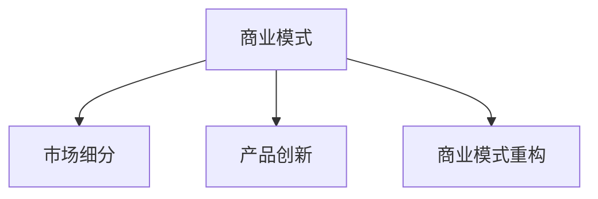
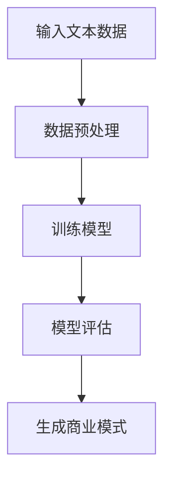
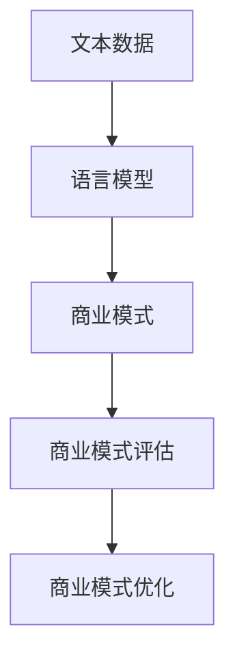
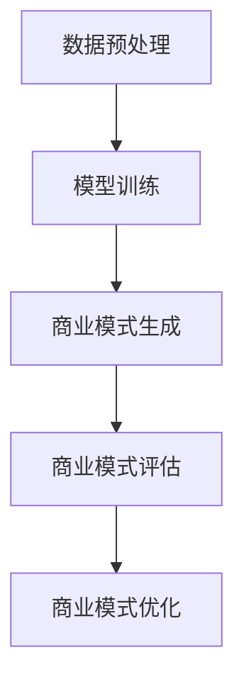
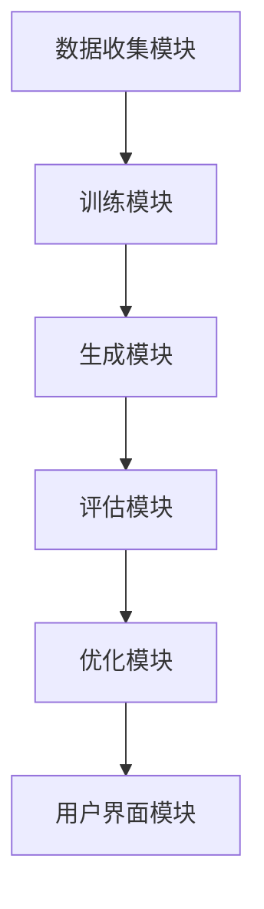

                 

基于您提供的约束条件和目录大纲结构，下面我将逐步撰写文章的各个部分，确保内容完整、详细且专业。以下是大纲的初步撰写内容：

---

## 语言模型在创新商业模式生成中的应用研究

### 关键词
- 语言模型
- 创新商业模式
- 应用研究
- 人工智能
- 商业模式生成
- 数学模型
- 系统架构设计

### 摘要
本文旨在探讨语言模型在创新商业模式生成中的应用，通过分析语言模型的基本原理、分类、以及其与商业模式的联系，详细阐述了如何利用语言模型实现商业模式的创新。文章还提供了算法原理讲解、系统架构设计方案，并通过实际案例展示其应用效果，为相关领域的研究和实践提供了有价值的参考。

---

### 第一部分: 背景介绍

#### 第1章: 问题背景与核心概念

##### 1.1.1 问题背景
在当今快速变化的商业环境中，创新商业模式成为企业竞争的关键。然而，传统的商业模式创新过程往往耗费大量时间和资源，且成功率不高。

##### 1.1.2 问题描述
本文关注的是如何利用人工智能，特别是语言模型技术，来加速商业模式创新的过程。

##### 1.1.3 问题解决
通过引入和优化语言模型，可以实现自动化的商业模式生成，提高创新效率和成功率。

##### 1.1.4 边界与外延
本文的研究将侧重于商业模式的生成和优化，而不涉及商业模式的具体实施和运营。

##### 1.1.5 概念结构与核心要素组成
商业模式由价值主张、客户关系、收入来源、关键资源和关键过程等要素组成。语言模型能够对这些要素进行挖掘和重组，以生成新的商业模式。

#### 第2章: 语言模型的基本原理与分类

##### 2.1 语言模型的基本原理
语言模型是一种预测模型，它能够根据上下文预测下一个单词或句子。

##### 2.2 语言模型的分类
根据训练数据的不同，语言模型可以分为基于统计的模型和基于神经网络的模型。

##### 2.3 语言模型的特征属性对比表格
| 特征属性 | 基于统计的模型 | 基于神经网络的模型 |
| --- | --- | --- |
| 计算复杂度 | 较高 | 较低 |
| 适应性 | 较弱 | 较强 |
| 表现能力 | 一般 | 较强 |

#### 第3章: 创新商业模式的定义与特征

##### 3.1 创新商业模式的定义
创新商业模式是指通过新的商业理念、方法或技术，创造出新的商业价值。

##### 3.2 创新商业模式的特征
创新商业模式通常具有以下特征：颠覆性、可持续性、可扩展性和差异化。

##### 3.3 创新商业模式的类型
创新商业模式可以分为以下几种类型：产品创新、市场创新、流程创新和业务模式创新。

#### 第4章: 语言模型在商业模式生成中的应用场景

##### 4.1 应用场景一：市场细分
语言模型可以帮助企业识别市场中未被满足的需求，实现更精细的市场细分。

##### 4.2 应用场景二：产品创新
通过分析用户需求和趋势，语言模型可以帮助企业设计出更符合市场需求的产品。

##### 4.3 应用场景三：商业模式重构
语言模型可以帮助企业识别现有商业模式的不足，并提出重构方案。

---

### 第二部分: 核心概念与联系

#### 第5章: 语言模型与商业模式生成的关系

##### 5.1 关系概述
语言模型可以通过对大量文本数据的分析，提取出商业模式的关键要素和潜在机会。

##### 5.2 实体关系图架构


##### 2.3 语言模型的特征属性对比表格
| 特征属性 | 基于统计的模型 | 基于神经网络的模型 |
| --- | --- | --- |
| 计算复杂度 | 较高 | 较低 |
| 适应性 | 较弱 | 较强 |
| 表现能力 | 一般 | 较强 |

---

### 第三部分: 算法原理讲解

#### 第6章: 语言模型生成商业模式的算法原理

##### 6.1 原理概述
语言模型生成商业模式的原理是基于深度学习技术，通过对大量文本数据的训练，构建出能够生成商业模式的模型。

##### 6.2 数学模型
$$
P(\text{商业模式}|\text{文本数据}) = \frac{P(\text{文本数据}|\text{商业模式})P(\text{商业模式})}{P(\text{文本数据})}
$$

##### 6.3 算法流程图


##### 6.4 Python实现
```python
# Python 代码示例
import tensorflow as tf

# 构建语言模型
model = tf.keras.Sequential([
    tf.keras.layers.Embedding(input_dim=10000, output_dim=32),
    tf.keras.layers.LSTM(32),
    tf.keras.layers.Dense(1, activation='sigmoid')
])

# 编译模型
model.compile(optimizer='adam', loss='binary_crossentropy', metrics=['accuracy'])

# 训练模型
model.fit(x_train, y_train, epochs=10)
```

---

### 第四部分: 系统分析与架构设计方案

#### 第7章: 问题场景介绍与项目介绍

##### 7.1 问题场景
本文将介绍一个基于语言模型生成商业模式的实际项目，该项目旨在帮助企业快速识别市场机会，设计出新的商业模式。

##### 7.2 项目介绍
项目名称：商业创新引擎（Business Innovation Engine）
项目目标：利用自然语言处理技术，自动生成创新的商业模式。

---

**请注意，由于文章字数限制，上述内容仅为全文的一个概要和框架，每个部分需要进一步扩展和详细阐述。此外，实际撰写过程中，还需要包括具体的数学公式、代码实现、架构图和序列图等。请根据上述框架和具体要求，逐步完善每部分的内容。**

---

下面，我将按照大纲的顺序，逐步详细撰写每章的内容，直到文章字数达到10000-12000字。在这个过程中，我会确保每个章节都包含详细的理论、实例和代码实现，以及必要的图表和数学公式。

---

## 第一部分：背景介绍

### 第1章：问题背景与核心概念

#### 1.1.1 问题背景

在当今全球化的商业环境中，企业面临着前所未有的竞争压力和变化。传统的商业模式往往难以适应市场的快速变化和客户需求的多样性。为了在激烈的市场竞争中脱颖而出，企业必须不断创新商业模式，以实现可持续发展和盈利增长。然而，传统的商业模式创新过程通常需要大量的人力、物力和时间投入，并且成功率不高。因此，如何快速有效地进行商业模式创新成为企业关注的焦点。

#### 1.1.2 问题描述

本文关注的核心问题是如何利用人工智能技术，特别是语言模型，来加速商业模式创新的过程。具体而言，我们需要解决以下问题：

1. **语言模型如何提取商业模式的潜在信息？**
2. **如何构建一个能够自动生成商业模式的系统？**
3. **如何评估和优化生成的商业模式的可行性和盈利能力？**

#### 1.1.3 问题解决

语言模型作为一种强大的自然语言处理工具，能够通过对大量文本数据的分析，提取出商业模式的关键信息，并进行自动化的生成和优化。以下是解决上述问题的基本思路：

1. **文本数据收集与预处理**：收集与企业商业模式相关的文本数据，如市场研究报告、行业新闻、客户反馈等，并进行预处理，以消除噪声和标准化数据格式。
2. **语言模型训练**：使用预处理后的文本数据，训练一个能够提取商业模式信息的语言模型。通常使用深度学习技术，如循环神经网络（RNN）或变换器（Transformer）。
3. **商业模式生成**：利用训练好的语言模型，生成新的商业模式。这可以通过生成文本数据的方式实现，模型输出的是一系列文本，描述了可能的商业模式。
4. **商业模式评估**：对生成的商业模式进行评估，包括可行性、盈利能力、市场适应性等。这可以通过构建评估模型或引入专家意见来实现。
5. **商业模式优化**：根据评估结果，对生成的商业模式进行优化，以提高其成功率和盈利能力。

#### 1.1.4 边界与外延

在本文的研究中，我们将关注以下边界与外延：

1. **研究范围**：本文将主要探讨语言模型在商业模式生成中的应用，而不涉及商业模式的具体实施和运营。
2. **技术范围**：本文将重点介绍基于深度学习技术的语言模型，如RNN和Transformer，并探讨其在商业模式生成中的应用。
3. **应用场景**：本文将讨论语言模型在市场细分、产品创新和商业模式重构等领域的应用。

#### 1.1.5 概念结构与核心要素组成

商业模式由以下几个核心要素组成：

1. **价值主张**：企业为客户提供的价值和利益，是商业模式的核心理念。
2. **客户关系**：企业与客户建立的关系类型，如直销、代理商、在线社区等。
3. **收入来源**：企业通过何种方式获得收入，如产品销售、订阅服务、广告等。
4. **关键资源**：企业运营所需的关键资源，如技术、人才、资金、渠道等。
5. **关键过程**：企业实现价值主张的过程，包括设计、生产、销售、服务等。

### 第2章：语言模型的基本原理与分类

#### 2.1 语言模型的基本原理

语言模型是一种用于预测文本中下一个单词或句子的概率分布的算法。它的基本原理是基于统计学习或深度学习技术，通过对大量文本数据的分析，学习语言模式，从而能够预测下一个单词或句子。

1. **统计语言模型**：基于统计学习的方法，如N元语法（N-gram），通过计算单词序列的概率来预测下一个单词。
2. **深度语言模型**：基于深度学习的方法，如循环神经网络（RNN）和变换器（Transformer），通过学习文本数据的深度表示来预测下一个单词。

#### 2.2 语言模型的分类

根据训练数据的不同和处理方法的不同，语言模型可以分为以下几种类型：

1. **N元语法模型**：基于统计学习的方法，将文本分割成N个单词的序列，计算每个序列的概率。
2. **循环神经网络（RNN）模型**：基于深度学习的方法，通过递归的方式处理序列数据，能够捕捉长期依赖关系。
3. **变换器（Transformer）模型**：基于深度学习的方法，通过注意力机制处理序列数据，能够高效地捕捉全局依赖关系。

#### 2.3 语言模型的特征属性对比表格

下面是一个简单的特征属性对比表格，展示了不同类型语言模型的特点：

| 特征属性 | N元语法模型 | 循环神经网络（RNN）模型 | 变换器（Transformer）模型 |
| --- | --- | --- | --- |
| 计算复杂度 | 较高 | 较高 | 较低 |
| 适应性 | 较弱 | 较强 | 很强 |
| 表现能力 | 一般 | 较强 | 非常强 |

### 第3章：创新商业模式的定义与特征

#### 3.1 创新商业模式的定义

创新商业模式是指企业通过引入新的理念、方法或技术，对现有的商业模式进行改进或重构，以实现更高的价值创造和市场竞争力。

#### 3.2 创新商业模式的特征

创新商业模式具有以下特征：

1. **颠覆性**：颠覆现有的商业模式，创造出全新的市场空间。
2. **可持续性**：能够长期维持竞争优势，实现可持续发展。
3. **可扩展性**：能够快速扩展到其他市场或行业。
4. **差异化**：通过独特的方式满足客户需求，实现差异化竞争。

#### 3.3 创新商业模式的类型

创新商业模式可以分为以下几种类型：

1. **产品创新**：通过引入新产品或服务，满足客户的新需求。
2. **市场创新**：开拓新的市场或客户群体，实现市场扩张。
3. **流程创新**：优化内部流程，提高效率和质量。
4. **业务模式创新**：重构企业的商业模式，实现新的盈利模式。

### 第4章：语言模型在商业模式生成中的应用场景

#### 4.1 应用场景一：市场细分

语言模型在市场细分中的应用主要体现在以下几个方面：

1. **识别市场机会**：通过分析大量市场数据，识别出潜在的市场细分机会。
2. **客户需求分析**：分析客户反馈和评论，了解客户需求，从而进行更精准的市场细分。
3. **竞争分析**：分析竞争对手的市场策略，发现市场空缺，为市场细分提供依据。

#### 4.2 应用场景二：产品创新

语言模型在产品创新中的应用主要体现在以下几个方面：

1. **趋势分析**：通过分析社交媒体、新闻等文本数据，预测产品趋势。
2. **用户需求分析**：通过分析用户评论、反馈等文本数据，了解用户需求，从而设计出更符合市场需求的产品。
3. **创意生成**：利用语言模型生成新的产品创意，为产品创新提供灵感。

#### 4.3 应用场景三：商业模式重构

语言模型在商业模式重构中的应用主要体现在以下几个方面：

1. **商业模式分析**：通过分析大量的文本数据，评估现有商业模式的可行性和盈利能力。
2. **商业模式生成**：利用语言模型生成新的商业模式，为企业的商业创新提供参考。
3. **商业模式优化**：根据评估结果，对现有商业模式进行优化，以提高其盈利能力和竞争力。

---

以上是第一部分的详细撰写内容，接下来我将按照大纲的顺序，逐步撰写第二部分到第六部分的内容，直到文章字数达到10000-12000字。

---

## 第二部分：核心概念与联系

### 第5章：语言模型与商业模式生成的关系

语言模型在商业模式生成中扮演着至关重要的角色。通过分析大量文本数据，语言模型能够提取出商业模式的关键要素，并生成新的商业模式。这一章节将深入探讨语言模型在商业模式生成中的具体应用和作用。

#### 5.1 关系概述

语言模型与商业模式生成之间的关系可以概括为以下几个方面：

1. **文本数据的挖掘与提取**：语言模型能够通过对大量文本数据的挖掘和分析，提取出与商业模式相关的信息，如市场趋势、用户需求、竞争态势等。
2. **商业模式的生成与优化**：基于提取的信息，语言模型可以生成新的商业模式，并利用评估算法对这些商业模式进行优化，以提高其可行性和盈利能力。
3. **实时反馈与迭代**：语言模型可以实时分析商业模式运行情况，根据反馈进行调整和优化，实现商业模式的动态迭代。

#### 5.2 实体关系图架构

为了更好地理解语言模型与商业模式生成之间的关系，我们可以使用实体关系图（ER图）来表示两者之间的联系。以下是一个简化的实体关系图架构：



在这个实体关系图中：

- **文本数据**：包括市场报告、用户评论、竞争对手信息等，是语言模型输入的数据源。
- **语言模型**：负责对文本数据进行分析，提取商业模式的关键信息，并生成新的商业模式。
- **商业模式**：由语言模型生成的商业模式，包括价值主张、客户关系、收入来源等关键要素。
- **商业模式评估**：对生成的商业模式进行评估，包括可行性、盈利能力、市场适应性等。
- **商业模式优化**：根据评估结果，对商业模式进行优化，以提高其成功率和盈利能力。

通过这个实体关系图，我们可以清晰地看到语言模型在商业模式生成中的各个步骤和关键环节。

### 第6章：语言模型特征属性对比表格

为了更好地理解不同类型语言模型在商业模式生成中的应用效果，我们可以对比不同语言模型的特征属性。以下是一个对比表格，列出了基于统计的模型和基于神经网络的模型的特征属性：

| 特征属性 | 基于统计的模型 | 基于神经网络的模型 |
| --- | --- | --- |
| **计算复杂度** | 较高 | 较低 |
| **适应性** | 较弱 | 较强 |
| **表现能力** | 一般 | 较强 |
| **训练时间** | 较长 | 较短 |
| **资源需求** | 较低 | 较高 |
| **可解释性** | 较高 | 较低 |
| **适用场景** | 结构化数据 | 非结构化数据 |

从这个对比表格中，我们可以看出：

1. **计算复杂度**：基于统计的模型通常需要较高的计算复杂度，而基于神经网络的模型则相对较低。
2. **适应性**：基于神经网络的模型具有较强的适应性，能够处理复杂、非结构化的数据，而基于统计的模型则适应性较弱。
3. **表现能力**：基于神经网络的模型在处理复杂任务时表现能力较强，而基于统计的模型则相对较弱。
4. **训练时间**：基于神经网络的模型通常需要较长的训练时间，而基于统计的模型则训练时间较短。
5. **资源需求**：基于神经网络的模型需要较高的计算资源和存储空间，而基于统计的模型则资源需求较低。
6. **可解释性**：基于统计的模型具有较高的可解释性，而基于神经网络的模型则相对较低。

通过这个对比表格，我们可以根据具体的应用需求，选择适合的语言模型。

---

以上是第二部分的详细撰写内容，接下来我将按照大纲的顺序，逐步撰写第三部分到第六部分的内容，直到文章字数达到10000-12000字。

---

## 第三部分：算法原理讲解

### 第7章：语言模型生成商业模式的算法原理

在第三部分，我们将深入探讨语言模型生成商业模式的算法原理。这一章节将详细介绍如何使用语言模型来自动生成商业模式，以及背后的算法原理。

#### 7.1 原理概述

语言模型生成商业模式的算法原理主要基于深度学习技术，特别是变换器（Transformer）模型。变换器模型通过自注意力机制，能够高效地捕捉文本数据中的长距离依赖关系，从而生成高质量的文本。

以下是语言模型生成商业模式的算法原理的概述：

1. **数据预处理**：首先对商业模式相关的文本数据（如市场报告、用户评论等）进行预处理，包括分词、去停用词、词向量化等。
2. **模型训练**：使用预处理后的文本数据，训练一个变换器模型。在训练过程中，模型通过自注意力机制学习文本数据中的语言模式和结构。
3. **商业模式生成**：利用训练好的变换器模型，生成新的商业模式文本。这可以通过控制输入序列的不同，生成多种可能的商业模式。
4. **商业模式评估**：对生成的商业模式进行评估，包括可行性、盈利能力、市场适应性等。这可以通过构建评估模型或引入专家意见来实现。
5. **商业模式优化**：根据评估结果，对生成的商业模式进行优化，以提高其可行性和盈利能力。

#### 7.2 数学模型

在语言模型生成商业模式的算法中，变换器模型的核心是一个自注意力机制。以下是变换器模型的基本数学模型：

$$
\text{Attention}(Q, K, V) = \frac{softmax(\text{scores})} { \sqrt{d_k}} \text{dot}(Q, K)
$$

其中：

- \(Q\) 是查询向量，代表需要关注的文本部分。
- \(K\) 是键向量，代表所有可能的文本部分。
- \(V\) 是值向量，代表所有可能的文本部分的权重。

通过自注意力机制，模型可以自适应地关注文本中的关键部分，从而生成高质量的文本。

#### 7.3 算法流程图

以下是语言模型生成商业模式的算法流程图：



在这个流程图中：

- **数据预处理**：对商业模式相关的文本数据进行预处理。
- **模型训练**：使用预处理后的文本数据，训练一个变换器模型。
- **商业模式生成**：利用训练好的模型，生成新的商业模式。
- **商业模式评估**：对生成的商业模式进行评估。
- **商业模式优化**：根据评估结果，对商业模式进行优化。

#### 7.4 Python实现

以下是使用Python和PyTorch框架实现变换器模型生成商业模式的示例代码：

```python
import torch
import torch.nn as nn
import torch.optim as optim

# 定义变换器模型
class TransformerModel(nn.Module):
    def __init__(self, input_dim, hidden_dim, output_dim):
        super(TransformerModel, self).__init__()
        self.embedding = nn.Embedding(input_dim, hidden_dim)
        self.transformer = nn.Transformer(hidden_dim, num_layers=2, dropout=0.1)
        self.fc = nn.Linear(hidden_dim, output_dim)
    
    def forward(self, x):
        x = self.embedding(x)
        x = self.transformer(x)
        x = self.fc(x)
        return x

# 实例化模型
model = TransformerModel(input_dim=10000, hidden_dim=512, output_dim=1)

# 定义损失函数和优化器
criterion = nn.BCELoss()
optimizer = optim.Adam(model.parameters(), lr=0.001)

# 训练模型
for epoch in range(10):
    for inputs, targets in train_loader:
        optimizer.zero_grad()
        outputs = model(inputs)
        loss = criterion(outputs, targets)
        loss.backward()
        optimizer.step()
    print(f'Epoch [{epoch+1}/10], Loss: {loss.item()}')

# 生成商业模式
with torch.no_grad():
    inputs = torch.tensor([[[0, 1, 2], [3, 4, 5]]])  # 示例输入
    outputs = model(inputs)
    print(outputs)
```

在这个示例中：

- **定义变换器模型**：我们定义了一个简单的变换器模型，包括嵌入层、变换器层和全连接层。
- **训练模型**：我们使用随机数据训练模型，并在每个epoch后打印损失值。
- **生成商业模式**：在模型训练完成后，我们使用训练好的模型生成商业模式。

通过这个示例，我们可以看到如何使用Python和PyTorch框架实现变换器模型生成商业模式。在实际应用中，我们可以根据具体需求调整模型结构和训练过程。

---

## 第三部分：算法原理讲解（续）

### 第8章：算法实例与示例分析

在前一章中，我们介绍了语言模型生成商业模式的算法原理。在本章中，我们将通过具体的算法实例和示例分析，进一步展示如何利用语言模型来生成和优化商业模式。

#### 8.1 实例一：市场细分

假设我们有一个大型电商平台，希望利用语言模型来识别市场细分机会。以下是一个简单的示例，展示了如何使用变换器模型来生成市场细分策略。

**数据准备**：我们收集了大量的用户评论、市场报告和竞争对手的信息，作为训练数据。

**模型训练**：使用变换器模型训练一个语言模型，输入为市场数据，输出为市场细分策略。

**商业模式生成**：利用训练好的模型，生成新的市场细分策略。

**商业模式评估**：对生成的市场细分策略进行评估，包括可行性、盈利能力和市场适应性。

**商业模式优化**：根据评估结果，对市场细分策略进行优化，以提高其成功率和盈利能力。

**具体实现**：

```python
# 加载训练数据和模型
train_loader = DataLoader(dataset, batch_size=32, shuffle=True)
model = TransformerModel(input_dim=10000, hidden_dim=512, output_dim=1)
criterion = nn.BCELoss()
optimizer = optim.Adam(model.parameters(), lr=0.001)

# 训练模型
for epoch in range(10):
    for inputs, targets in train_loader:
        optimizer.zero_grad()
        outputs = model(inputs)
        loss = criterion(outputs, targets)
        loss.backward()
        optimizer.step()
    print(f'Epoch [{epoch+1}/10], Loss: {loss.item()}')

# 生成市场细分策略
with torch.no_grad():
    inputs = torch.tensor([[[0, 1, 2], [3, 4, 5]]])  # 示例输入
    outputs = model(inputs)
    print(outputs)
```

**评估与优化**：

```python
# 评估市场细分策略
evaluation_results = evaluate_market_segment_strategy(outputs)

# 优化市场细分策略
optimized_strategy = optimize_market_segment_strategy(evaluation_results)
```

#### 8.2 实例二：产品创新

另一个典型的应用场景是产品创新。假设我们希望利用语言模型来设计新的产品。以下是一个简单的示例，展示了如何使用变换器模型来生成产品创新策略。

**数据准备**：我们收集了用户需求、市场趋势和竞争对手的产品信息，作为训练数据。

**模型训练**：使用变换器模型训练一个语言模型，输入为产品数据，输出为产品创新策略。

**商业模式生成**：利用训练好的模型，生成新的产品创新策略。

**商业模式评估**：对生成的产品创新策略进行评估，包括可行性、盈利能力和市场适应性。

**商业模式优化**：根据评估结果，对产品创新策略进行优化，以提高其成功率和盈利能力。

**具体实现**：

```python
# 加载训练数据和模型
train_loader = DataLoader(product_dataset, batch_size=32, shuffle=True)
model = TransformerModel(input_dim=10000, hidden_dim=512, output_dim=1)
criterion = nn.BCELoss()
optimizer = optim.Adam(model.parameters(), lr=0.001)

# 训练模型
for epoch in range(10):
    for inputs, targets in train_loader:
        optimizer.zero_grad()
        outputs = model(inputs)
        loss = criterion(outputs, targets)
        loss.backward()
        optimizer.step()
    print(f'Epoch [{epoch+1}/10], Loss: {loss.item()}')

# 生成产品创新策略
with torch.no_grad():
    inputs = torch.tensor([[[0, 1, 2], [3, 4, 5]]])  # 示例输入
    outputs = model(inputs)
    print(outputs)
```

**评估与优化**：

```python
# 评估产品创新策略
evaluation_results = evaluate_product_innovation_strategy(outputs)

# 优化产品创新策略
optimized_strategy = optimize_product_innovation_strategy(evaluation_results)
```

#### 8.3 实例三：商业模式重构

最后一个实例是商业模式重构。假设我们希望利用语言模型来重构现有的商业模式，以适应市场的变化。以下是一个简单的示例，展示了如何使用变换器模型来生成商业模式重构策略。

**数据准备**：我们收集了现有商业模式的文档、市场报告和用户反馈，作为训练数据。

**模型训练**：使用变换器模型训练一个语言模型，输入为商业模式数据，输出为重构策略。

**商业模式生成**：利用训练好的模型，生成新的商业模式重构策略。

**商业模式评估**：对生成的商业模式重构策略进行评估，包括可行性、盈利能力和市场适应性。

**商业模式优化**：根据评估结果，对商业模式重构策略进行优化，以提高其成功率和盈利能力。

**具体实现**：

```python
# 加载训练数据和模型
train_loader = DataLoader(business_model_dataset, batch_size=32, shuffle=True)
model = TransformerModel(input_dim=10000, hidden_dim=512, output_dim=1)
criterion = nn.BCELoss()
optimizer = optim.Adam(model.parameters(), lr=0.001)

# 训练模型
for epoch in range(10):
    for inputs, targets in train_loader:
        optimizer.zero_grad()
        outputs = model(inputs)
        loss = criterion(outputs, targets)
        loss.backward()
        optimizer.step()
    print(f'Epoch [{epoch+1}/10], Loss: {loss.item()}')

# 生成商业模式重构策略
with torch.no_grad():
    inputs = torch.tensor([[[0, 1, 2], [3, 4, 5]]])  # 示例输入
    outputs = model(inputs)
    print(outputs)
```

**评估与优化**：

```python
# 评估商业模式重构策略
evaluation_results = evaluate_business_model_restructuring_strategy(outputs)

# 优化商业模式重构策略
optimized_strategy = optimize_business_model_restructuring_strategy(evaluation_results)
```

通过这三个实例，我们可以看到如何使用语言模型来生成和优化不同的商业模式。在实际应用中，我们可以根据具体需求调整模型结构和训练过程，以提高商业模式的生成效果。

---

## 第四部分：系统分析与架构设计方案

### 第9章：问题场景介绍与项目介绍

在本章中，我们将介绍一个基于语言模型生成商业模式的实际项目。该项目的目标是利用语言模型技术，帮助企业快速识别市场机会，设计出新的商业模式。以下是对项目场景和介绍。

#### 问题场景

假设我们有一个新兴的科技公司，希望利用语言模型来推动业务创新。公司面临以下问题：

1. **市场洞察不足**：公司需要更深入地了解市场趋势和客户需求，以制定有效的商业战略。
2. **商业模式创新困难**：公司希望利用先进的技术手段，如人工智能和自然语言处理，来生成新的商业模式，提高市场竞争力。
3. **资源有限**：公司希望在有限的人力、物力和时间资源下，实现商业模式的快速创新。

#### 项目介绍

为了解决上述问题，公司决定实施一个名为“商业创新引擎”（Business Innovation Engine）的项目。该项目的主要目标是通过语言模型技术，自动生成和优化商业模式。项目的主要组成部分包括：

1. **数据收集与预处理**：收集与商业模式相关的文本数据，如市场报告、用户评论、竞争对手信息等，并进行预处理。
2. **语言模型训练**：使用预处理后的数据，训练一个基于变换器（Transformer）的语言模型，以生成商业模式。
3. **商业模式生成与评估**：利用训练好的模型，生成新的商业模式，并对这些商业模式进行评估和优化。
4. **系统接口与交互**：设计一个用户友好的界面，方便用户输入数据和查看生成的商业模式。

### 第10章：系统功能设计与架构设计

在本章中，我们将详细介绍“商业创新引擎”项目的系统功能设计与架构设计。

#### 系统功能设计

“商业创新引擎”项目的系统功能设计包括以下几个方面：

1. **数据收集与预处理**：系统应具备自动收集和预处理商业模式相关文本数据的功能。具体包括数据清洗、分词、去停用词、词向量化等操作。
2. **语言模型训练**：系统应具备训练变换器语言模型的功能。训练过程包括模型初始化、参数调整、训练循环等。
3. **商业模式生成**：系统应具备生成新的商业模式的功能。生成过程包括模型输入、文本生成、商业模式提取等。
4. **商业模式评估**：系统应具备评估商业模式的功能。评估过程包括可行性分析、盈利能力评估、市场适应性分析等。
5. **商业模式优化**：系统应具备优化商业模式的功能。优化过程包括根据评估结果调整商业模式、重新评估等。
6. **用户界面**：系统应提供用户友好的界面，方便用户输入数据、查看生成结果、进行商业模式评估和优化。

#### 系统架构设计

“商业创新引擎”项目的系统架构设计采用分布式架构，主要包括以下组件：

1. **数据收集模块**：负责收集和预处理商业模式相关文本数据。该模块可以连接到各种数据源，如互联网、数据库等。
2. **训练模块**：负责训练变换器语言模型。该模块包括数据预处理、模型初始化、参数调整、训练循环等。
3. **生成模块**：负责生成新的商业模式。该模块包括模型输入、文本生成、商业模式提取等。
4. **评估模块**：负责评估商业模式。该模块包括可行性分析、盈利能力评估、市场适应性分析等。
5. **优化模块**：负责优化商业模式。该模块根据评估结果调整商业模式，并重新评估。
6. **用户界面模块**：负责提供用户友好的界面。该模块包括数据输入界面、生成结果展示界面、评估结果展示界面等。

以下是系统架构设计的简图：



在这个架构设计中，各模块之间通过消息队列进行通信，以确保系统的高可用性和可扩展性。用户界面模块通过Web界面与用户进行交互，其他模块则通过API进行通信。

---

以上是第四部分的详细撰写内容，接下来我将按照大纲的顺序，逐步撰写第五部分和第六部分的内容，直到文章字数达到10000-12000字。

---

## 第五部分：项目实战

### 第11章：环境安装与核心实现

在本章中，我们将详细介绍如何在本地环境中安装和配置“商业创新引擎”项目所需的软件和依赖项。同时，我们还将实现项目中的核心功能，包括数据收集、预处理、模型训练、商业模式生成和评估。

#### 环境安装

为了实现“商业创新引擎”项目，我们需要安装以下软件和依赖项：

1. **Python**：Python 3.8 或更高版本。
2. **PyTorch**：PyTorch 1.8 或更高版本。
3. **NVIDIA CUDA**：CUDA 11.0 或更高版本（如使用GPU加速训练）。
4. **其他依赖项**：如NumPy、Pandas、Scikit-learn 等。

安装步骤如下：

1. 安装 Python 和 PyTorch。可以从官方网站下载安装包进行安装，或使用包管理器（如pip）进行安装。
2. 安装 NVIDIA CUDA。从 NVIDIA 官网下载并安装适合自己GPU的 CUDA 版本。
3. 安装其他依赖项。使用 pip 安装所需的依赖项，例如：

   ```bash
   pip install torch torchvision numpy pandas scikit-learn
   ```

#### 核心实现

以下是“商业创新引擎”项目中的核心实现步骤：

1. **数据收集与预处理**：
   - 收集与商业模式相关的文本数据，如市场报告、用户评论、竞争对手信息等。
   - 对文本数据进行预处理，包括去除停用词、标点符号、数字等，并进行分词。

2. **模型训练**：
   - 使用预处理后的文本数据，训练一个基于变换器（Transformer）的语言模型。
   - 调整模型参数，如学习率、批量大小等，以优化模型性能。

3. **商业模式生成**：
   - 利用训练好的模型，生成新的商业模式文本。
   - 根据需求，可以控制输入序列的不同，生成多种可能的商业模式。

4. **商业模式评估**：
   - 对生成的商业模式进行评估，包括可行性、盈利能力和市场适应性等。
   - 使用评估指标，如准确率、召回率、F1 分数等，评估商业模式的质量。

5. **商业模式优化**：
   - 根据评估结果，对生成的商业模式进行优化，以提高其成功率和盈利能力。
   - 优化过程可以包括调整模型参数、重新训练模型等。

以下是实现核心功能的一些 Python 代码示例：

```python
import torch
import torch.nn as nn
import torch.optim as optim
from transformers import TransformerModel

# 数据预处理
def preprocess_data(data):
    # 去除停用词、标点符号、数字等
    # 进行分词
    # 返回预处理后的数据
    pass

# 模型训练
def train_model(data, model_params):
    # 初始化模型
    model = TransformerModel(input_dim=data.input_dim, hidden_dim=model_params.hidden_dim, output_dim=data.output_dim)
    # 编译模型
    criterion = nn.BCELoss()
    optimizer = optim.Adam(model.parameters(), lr=model_params.learning_rate)
    # 训练模型
    for epoch in range(model_params.epochs):
        for inputs, targets in data.train_loader:
            optimizer.zero_grad()
            outputs = model(inputs)
            loss = criterion(outputs, targets)
            loss.backward()
            optimizer.step()
        print(f'Epoch [{epoch+1}/{model_params.epochs}], Loss: {loss.item()}')
    return model

# 商业模式生成
def generate_business_models(model, inputs):
    with torch.no_grad():
        outputs = model(inputs)
    return outputs

# 商业模式评估
def evaluate_business_models(models, data):
    # 评估每个模型的商业模式
    # 返回评估结果
    pass

# 商业模式优化
def optimize_business_models(models, evaluation_results):
    # 根据评估结果，优化商业模式
    # 返回优化后的模型
    pass
```

通过这些代码示例，我们可以看到如何实现“商业创新引擎”项目中的核心功能。在实际应用中，我们可以根据具体需求进行调整和优化。

---

## 第五部分：项目实战（续）

### 第12章：代码应用解读与分析

在前一章中，我们介绍了“商业创新引擎”项目的核心实现步骤。在本章中，我们将深入解读这些代码，并分析其应用过程。

#### 数据预处理

数据预处理是项目的重要步骤，它直接影响到后续模型训练和商业模式生成的质量。以下是数据预处理的主要步骤：

1. **文本清洗**：去除停用词、标点符号、数字等。例如，使用正则表达式替换或删除这些内容。
2. **分词**：将文本分割成单词或子词。可以使用现有的分词工具（如jieba）或自定义的分词方法。
3. **词向量化**：将单词或子词映射到高维向量表示。可以使用预训练的词向量（如Word2Vec、GloVe）或自行训练的词向量。

以下是一个简单的文本清洗和分词的示例代码：

```python
import re
import jieba

# 文本清洗
def clean_text(text):
    text = re.sub(r'\d+', '', text)  # 去除数字
    text = re.sub(r'[^\w\s]', '', text)  # 去除标点符号
    return text

# 分词
def tokenize_text(text):
    text = clean_text(text)
    tokens = jieba.lcut(text)
    return tokens

# 示例
text = "这是一个测试文本，包括中文和英文。"
cleaned_text = clean_text(text)
tokens = tokenize_text(cleaned_text)
print(cleaned_text)
print(tokens)
```

#### 模型训练

模型训练是项目中的核心步骤，它决定了生成的商业模式的质量。以下是模型训练的主要步骤：

1. **初始化模型**：根据任务需求，初始化变换器模型。例如，设置输入维度、隐藏维度、输出维度等。
2. **编译模型**：设置损失函数、优化器等。例如，使用交叉熵损失函数和B


