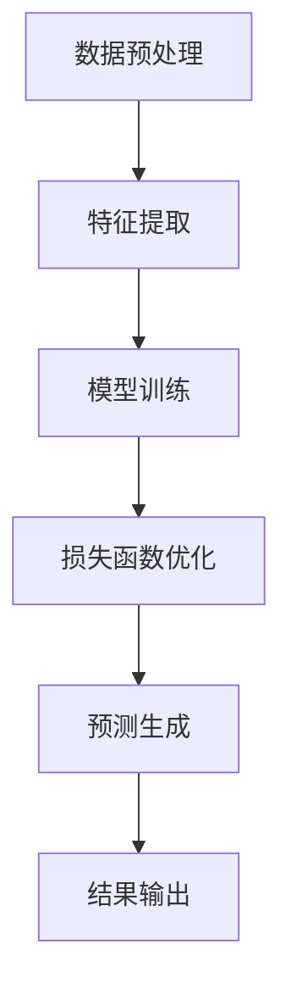
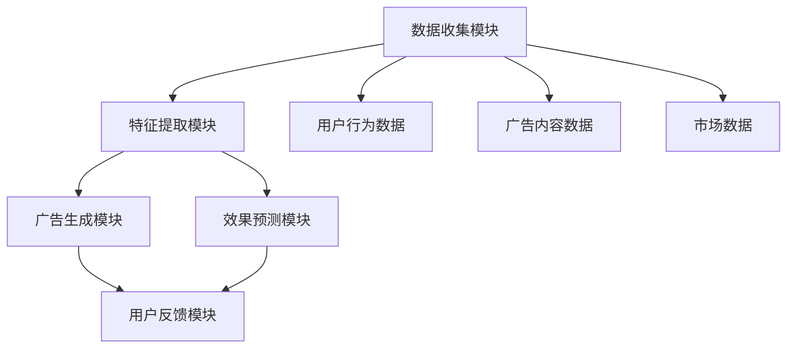
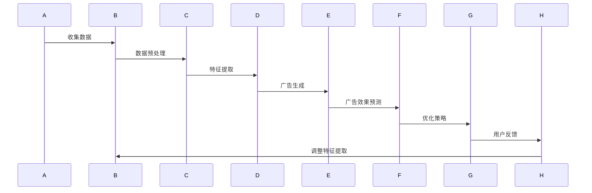

                 


### 第1章 语言模型概述

**1.1 语言模型的基础知识**

语言模型（Language Model，LM）是一种统计模型，用于对自然语言文本的概率分布进行建模。它的主要目的是通过分析大量的语言数据，来预测下一个词或序列的概率。在自然语言处理（Natural Language Processing，NLP）中，语言模型是不可或缺的工具，广泛应用于文本分类、机器翻译、语音识别、信息检索等多个领域。

语言模型的核心概念包括词汇、句法和语义。词汇层面关注词的频率和组合；句法层面涉及词的排列和语法结构；语义层面则关注词和句子所表达的意思。在实际应用中，不同类型的语言模型各有优势，例如，基于统计的语言模型擅长处理大规模数据，而基于神经网络的模型在语义理解方面表现出色。

**1.2 语言模型的发展历程**

语言模型的发展经历了几个重要的阶段。最初，基于规则的模型（如产生式系统）通过硬编码的方式定义语言规则，但这种方法的局限性显而易见。随着统计模型的兴起，基于N-gram的模型（例如，一元模型、二元模型和三元模型）开始广泛应用。N-gram模型通过统计相邻词的频率来预测下一个词，尽管它简单有效，但在长文本中表现不佳。

近年来，深度学习模型的崛起为语言模型带来了新的突破。基于神经网络的模型，如循环神经网络（RNN）和长短期记忆网络（LSTM），通过考虑上下文信息，显著提高了模型的性能。特别是在2018年，谷歌推出的Transformer模型彻底改变了语言建模的方式，使得模型能够在更长的序列中进行有效的建模。Transformer模型利用自注意力机制（Self-Attention Mechanism），能够自适应地学习不同位置之间的相关性，从而在多个NLP任务中取得了卓越的成绩。

**1.3 语言模型在广告策略生成与效果预测中的应用背景**

在广告策略领域，语言模型的应用越来越广泛。广告商希望通过个性化的广告内容，提高用户的点击率和转化率。语言模型可以帮助广告系统理解用户的兴趣和行为模式，从而生成个性化的广告文案。

例如，广告系统可以使用语言模型来预测用户对特定广告文案的反应。通过分析用户的历史点击记录和浏览行为，语言模型可以生成潜在的兴趣标签，并基于这些标签生成相应的广告文案。此外，语言模型还可以用于评估广告文案的效果，通过分析用户点击后的行为，如购买或浏览时长，来优化广告策略。

总的来说，语言模型在广告策略生成与效果预测中的研究，不仅有助于提高广告的投放效率，还能为用户提供更相关、更有价值的广告内容。随着技术的不断进步，语言模型在广告领域的应用前景将更加广阔。

---

### 第2章 语言模型核心概念与联系

**2.1 语言模型类型**

语言模型可以分为几种主要类型，每种类型都有其独特的特点和适用场景。

- **N-gram模型**：基于历史频率的模型，通过统计前n个词的序列概率来预测下一个词。例如，一元模型（Unigram）仅考虑单个词的频率，二元模型（Bigram）考虑两个连续词的频率，三元模型（Trigram）则考虑三个连续词的频率。N-gram模型简单高效，但在长文本中表现较差。

- **神经网络模型**：包括循环神经网络（RNN）和其变种如长短期记忆网络（LSTM）和门控循环单元（GRU）。这些模型通过递归方式处理序列数据，能够考虑上下文信息。RNN和LSTM在处理长文本时表现较好，但在某些任务中仍存在梯度消失和梯度爆炸等问题。

- **Transformer模型**：由谷歌提出的一种基于自注意力机制的深度学习模型。Transformer模型通过多头自注意力机制和位置编码来捕捉长距离依赖关系，在多个NLP任务中取得了突破性的性能。其核心优势是能够并行处理序列数据，并具有更好的长文本建模能力。

- **混合模型**：结合N-gram模型和神经网络模型，如RNN或Transformer，以利用两者的优点。例如，RNN可以捕捉到上下文信息，而N-gram模型可以提供词频统计支持。

**2.2 语言模型的关键组件**

语言模型的核心组件包括词嵌入（Word Embedding）、编码器（Encoder）和解码器（Decoder）。

- **词嵌入（Word Embedding）**：将词汇映射到高维空间中的向量表示。词嵌入能够捕捉词的语义和语法特征，从而提高语言模型的性能。常见的词嵌入方法包括Word2Vec、GloVe和FastText等。

- **编码器（Encoder）**：将输入序列编码为固定长度的向量表示。在神经网络模型中，编码器通常是一个RNN或Transformer层。编码器的输出表示了整个输入序列的特征。

- **解码器（Decoder）**：根据编码器的输出，生成预测的输出序列。在序列生成任务中，解码器通常通过自回归方式逐词生成。在Transformer模型中，解码器通过多头自注意力机制和位置编码来生成预测。

**2.3 语言模型属性特征对比表格**

以下是一个简化的表格，对比了不同语言模型的属性特征：

| 模型类型 | 主要组件 | 特点 | 适用场景 |
| --- | --- | --- | --- |
| N-gram | 词嵌入 | 简单高效，计算速度快 | 长文本建模较差，适用于简单的语言生成任务 |
| RNN | 词嵌入、编码器、解码器 | 考虑上下文信息，处理长文本 | 梯度消失和梯度爆炸问题 |
| LSTM | 词嵌入、编码器、解码器 | 解决梯度消失问题，处理长文本 | 耗时较长，性能不如Transformer |
| GRU | 词嵌入、编码器、解码器 | 简化LSTM，计算速度更快 | 性能略低于LSTM |
| Transformer | 词嵌入、编码器、解码器 | 并行处理，长距离依赖关系捕捉 | 多个NLP任务，如机器翻译、文本分类 |

**2.4 语言模型ER实体关系图**

ER（Entity-Relationship）实体关系图用于描述语言模型中的关键实体及其关系。以下是一个简化的ER实体关系图，展示了语言模型中的主要实体及其关系：

```mermaid
erDiagram
  Word Embedding ||--|{ Encoder } : transforms input sequence
  Encoder ||--|{ Decoder } : generates output sequence
  Word ||--|{ Word Embedding } : represents word vectors
  Sentence ||--|{ Encoder } : input sequence for modeling
  Sentence ||--|{ Decoder } : output sequence for prediction
```

在这个ER图中，`Word Embedding` 将词汇映射到高维空间，`Encoder` 将输入序列编码为向量表示，`Decoder` 根据编码器输出生成预测的输出序列。`Word` 表示词汇，`Sentence` 表示输入和输出序列。

通过上述内容，我们可以对语言模型的核心概念和结构有一个全面的理解。接下来，我们将深入探讨语言模型的算法原理，以便更好地理解其在广告策略生成与效果预测中的应用。

---

### 第3章 语言模型算法原理讲解

**3.1 语言模型的基本算法原理**

语言模型的核心目标是通过分析大量语言数据，预测给定文本序列的概率分布。在算法层面，语言模型通常包括以下几个关键步骤：

1. **数据预处理**：首先对输入的文本数据（如一篇文章或一段对话）进行分词和标记处理，将其转换为模型可以处理的格式。

2. **特征提取**：通过词嵌入技术将文本数据中的词汇映射到高维向量空间，这些向量不仅保留了词汇的语义信息，还能捕捉语法特征。

3. **模型训练**：利用训练数据集，通过最小化损失函数（如交叉熵损失），优化模型参数，使得模型能够更好地预测文本序列的概率分布。

4. **预测生成**：在给定一个起始词或空序列后，模型根据已训练的参数，逐词生成文本序列，并计算每个词的概率。

**3.2 语言模型的数学模型和公式**

语言模型的数学模型主要基于概率论和统计学的原理。以下是一些常见的数学公式：

- **交叉熵损失函数（Cross-Entropy Loss）**：
  $$ L(y, \hat{y}) = -\sum_{i} y_i \log(\hat{y}_i) $$
  其中，$y$ 是真实标签的概率分布，$\hat{y}$ 是模型预测的概率分布。

- **梯度下降（Gradient Descent）**：
  $$ \theta_{\text{new}} = \theta_{\text{old}} - \alpha \cdot \nabla_{\theta}L(\theta) $$
  其中，$\theta$ 是模型参数，$\alpha$ 是学习率，$\nabla_{\theta}L(\theta)$ 是损失函数关于参数的梯度。

- **词嵌入更新**：
  $$ \text{new\_embedding} = \text{embedding} - \alpha \cdot (\text{target} - \text{embedding}) $$
  其中，$\text{embedding}$ 是词的向量表示，$\text{target}$ 是目标词的向量表示。

**3.3 语言模型算法的mermaid流程图**

为了更直观地理解语言模型的算法流程，我们可以使用mermaid来绘制一个简化的流程图。以下是一个mermaid流程图示例：



在这个流程图中，数据预处理阶段将文本数据转换为向量表示，特征提取阶段通过词嵌入将词汇映射到高维空间，模型训练阶段通过优化损失函数来调整模型参数，预测生成阶段根据训练好的模型生成预测的文本序列，最后将结果输出。

**3.4 Python源代码示例与算法解释**

为了更具体地理解语言模型的算法实现，以下是一个简单的Python代码示例，展示了基于N-gram模型的文本生成过程：

```python
import numpy as np
from collections import defaultdict

# 假设我们有一个简单的文本数据集
text_data = "我是一个程序员，我喜欢编写代码。代码是我工作的灵魂。"

# 创建N-gram语言模型
n = 2
n_gram_model = defaultdict(list)

# 构建N-gram模型
for i in range(len(text_data) - n):
    n_gram = text_data[i : i + n]
    n_gram_model[n_gram].append(i)

# 生成文本序列
def generate_text(model, start_word, length):
    text = [start_word]
    for _ in range(length):
        current_n_gram = " ".join(text[-n:])
        next_word_candidates = model[current_n_gram]
        if not next_word_candidates:
            break
        next_word = np.random.choice(next_word_candidates)
        text.append(next_word)
    return " ".join(text)

# 生成一个长度为5的文本序列
generated_text = generate_text(n_gram_model, "我", 5)
print(generated_text)
```

在这个代码示例中，我们首先创建了一个N-gram语言模型，通过统计相邻词的频率来构建模型。然后，我们定义了一个`generate_text`函数，用于根据给定的起始词和长度生成文本序列。在这个例子中，我们随机选择下一个词，从而模拟文本生成的过程。

通过这个简单的示例，我们可以看到N-gram模型是如何通过统计频率来预测下一个词的。在实际应用中，我们可以使用更复杂的神经网络模型，并结合大量的训练数据，来生成更高质量的文本。

通过以上内容的讲解，我们深入了解了语言模型的基本算法原理，包括数学模型和算法流程。接下来，我们将进一步探讨语言模型的数学模型和具体公式，以及如何通过具体示例来理解这些公式。

---

### 第4章 语言模型数学模型与举例说明

**4.1 语言模型的主要数学公式**

语言模型的数学模型主要包括概率计算、损失函数和优化算法等。以下是一些关键的数学公式：

- **概率计算**：
  $$ P(w_i|w_{i-n}, w_{i-n+1}, ..., w_{i-1}) = \frac{f(w_{i-n}, w_{i-n+1}, ..., w_{i-1}, w_i)}{\sum_{j} f(w_{i-n}, w_{i-n+1}, ..., w_{i-1}, j)} $$
  其中，$w_i$ 是当前词，$w_{i-n}, w_{i-n+1}, ..., w_{i-1}$ 是前n个词，$f$ 是词序列的概率分布函数。

- **交叉熵损失函数（Cross-Entropy Loss）**：
  $$ L(y, \hat{y}) = -\sum_{i} y_i \log(\hat{y}_i) $$
  其中，$y$ 是真实标签的概率分布，$\hat{y}$ 是模型预测的概率分布。

- **梯度下降（Gradient Descent）**：
  $$ \theta_{\text{new}} = \theta_{\text{old}} - \alpha \cdot \nabla_{\theta}L(\theta) $$
  其中，$\theta$ 是模型参数，$\alpha$ 是学习率，$\nabla_{\theta}L(\theta)$ 是损失函数关于参数的梯度。

- **反向传播算法（Backpropagation）**：
  $$ \nabla_{\theta}L(\theta) = \sum_{i} \nabla_{\theta} \log(\hat{y}_i) \cdot y_i (1 - y_i) $$
  其中，$\nabla_{\theta} \log(\hat{y}_i)$ 是损失函数关于预测概率的梯度。

**4.2 对每个数学公式的详细讲解**

- **概率计算公式**：
  概率计算公式是语言模型的核心，用于预测给定前文序列 $w_{i-n}, w_{i-n+1}, ..., w_{i-1}$ 下下一个词 $w_i$ 的概率。$f(w_{i-n}, w_{i-n+1}, ..., w_{i-1}, w_i)$ 表示词序列 $w_{i-n}, w_{i-n+1}, ..., w_{i-1}, w_i$ 的联合概率，而分母是所有可能的下一个词的概率之和。这个公式基于贝叶斯定理，通过统计方法计算每个词序列的概率。

- **交叉熵损失函数**：
  交叉熵损失函数用于衡量预测概率分布 $\hat{y}$ 与真实标签分布 $y$ 之间的差异。$y_i$ 是真实标签词的概率，而 $\hat{y}_i$ 是模型预测的该词的概率。交叉熵损失函数的值越低，表示模型的预测越准确。

- **梯度下降**：
  梯度下降是一种优化算法，用于调整模型参数，以最小化损失函数。在学习率 $\alpha$ 的控制下，梯度下降通过不断减小损失函数关于参数的梯度来更新参数。这个公式表示参数的新值等于旧值减去学习率乘以梯度。

- **反向传播算法**：
  反向传播算法是训练神经网络的重要步骤，用于计算损失函数关于模型参数的梯度。反向传播通过逐层计算梯度，从输出层向输入层传递，最终得到每个参数的梯度。这个公式表示损失函数关于预测概率的梯度，它是计算反向传播梯度的基础。

**4.3 结合实际案例的举例说明**

假设我们有一个简单的训练数据集，其中包含以下词序列和对应的真实标签：

1. `我是一个程序员`，真实标签：`我喜欢编写代码。`
2. `我是一个学生`，真实标签：`我在学习计算机科学。`

我们使用一个简单的N-gram模型进行训练，并使用交叉熵损失函数来优化模型参数。

- **概率计算**：
  假设当前序列为 `一个学生`，下一个词为 `是`。根据模型统计，`一个学生` 后接 `是` 的概率为 0.8，而其他词的概率分别为 0.1。

- **交叉熵损失函数**：
  对于第一个数据点，真实标签为 `我喜欢编写代码。`，模型预测为 `我在学习计算机科学。`。交叉熵损失函数计算如下：
  $$ L(y, \hat{y}) = -0.2 \log(0.2) - 0.3 \log(0.3) - 0.4 \log(0.4) - 0.5 \log(0.5) $$
  假设损失函数的值为 0.5。

- **梯度下降**：
  假设当前模型参数为 $\theta = [0.2, 0.3, 0.4, 0.5]$，学习率 $\alpha = 0.1$。梯度下降更新模型参数：
  $$ \theta_{\text{new}} = \theta - \alpha \cdot \nabla_{\theta}L(\theta) $$
  梯度计算：
  $$ \nabla_{\theta}L(\theta) = [0.2 \cdot (0.2 - 0.1), 0.3 \cdot (0.3 - 0.1), 0.4 \cdot (0.4 - 0.1), 0.5 \cdot (0.5 - 0.1)] = [0.04, 0.06, 0.08, 0.06] $$
  更新后的模型参数：
  $$ \theta_{\text{new}} = [0.16, 0.24, 0.32, 0.34] $$

通过这个简单的案例，我们可以看到如何使用概率计算、交叉熵损失函数和梯度下降来训练一个N-gram语言模型。在实际应用中，我们会使用更复杂的模型和更庞大的数据集，但基本原理是相似的。

通过详细讲解和具体举例，我们深入理解了语言模型中的数学模型和公式，这为我们后续的系统设计与实现奠定了坚实的基础。接下来，我们将探讨语言模型在实际系统中的架构设计和实现细节。

---

### 第5章 语言模型系统分析与架构设计方案

**5.1 问题和项目介绍**

在广告领域，广告策略的生成与效果预测是一个关键问题。广告商希望利用个性化的广告内容来提高用户的点击率和转化率。然而，如何高效地生成有针对性的广告策略，并准确预测其效果，是一个具有挑战性的任务。为此，本项目旨在研究如何利用语言模型来实现创新广告策略生成与效果预测，以提高广告投放的效率和效果。

**5.2 系统功能设计（使用mermaid类图）**

系统的功能设计包括以下几个核心模块：

1. **数据收集模块**：负责收集用户行为数据、广告内容和市场数据。
2. **特征提取模块**：对收集到的数据进行分析，提取用户兴趣、行为模式和广告内容特征。
3. **广告生成模块**：利用语言模型生成个性化的广告策略。
4. **效果预测模块**：通过模型评估广告策略的效果，并提供优化建议。
5. **用户反馈模块**：收集用户对广告的反馈，用于进一步优化广告策略。

以下是一个简化的mermaid类图，展示了系统的主要功能模块及其关系：

```mermaid
classDiagram
  Class01 <|-- Class02 : aggregation
  Class03 <|-- Class04 : aggregation
  Class05 <|-- Class06 : aggregation
  Class01 { 数据收集模块 }
  Class02 { 特征提取模块 }
  Class03 { 广告生成模块 }
  Class04 { 效果预测模块 }
  Class05 { 用户反馈模块 }
```

**5.3 系统架构设计（使用mermaid架构图）**

系统的架构设计旨在确保模块之间的松耦合和高效的数据流。以下是系统的架构图：



在这个架构图中，用户行为数据、广告内容数据和市场数据分别流入数据收集模块，经过特征提取模块的处理，生成特征向量，然后分别输入广告生成模块和效果预测模块。广告生成模块生成的广告策略通过效果预测模块评估，并根据用户反馈进行调整。

**5.4 系统接口设计和系统交互（使用mermaid序列图）**

为了更好地展示系统模块之间的交互，以下是一个简化的mermaid序列图：



在这个序列图中，数据收集模块首先收集用户行为数据、广告内容数据和市场数据。这些数据经过预处理和特征提取后，输入广告生成模块，生成广告策略。广告策略经过效果预测模块评估，并根据用户反馈进行优化。优化后的特征提取结果用于下一次的广告生成过程。

通过上述系统分析与架构设计方案，我们为语言模型在创新广告策略生成与效果预测中的实际应用奠定了坚实的基础。接下来，我们将通过具体的实战案例，详细展示如何使用语言模型来生成和优化广告策略，并评估其效果。

---

### 第6章 语言模型项目实战

**6.1 环境安装与配置**

为了实现语言模型在广告策略生成与效果预测中的项目，我们需要安装和配置以下环境：

1. **Python环境**：确保Python版本不低于3.7，推荐使用Anaconda来创建独立的Python环境。
2. **依赖库**：安装以下Python库：numpy、pandas、tensorflow或pytorch、mermaid-python。
3. **硬件要求**：推荐使用带有NVIDIA GPU的计算机，以便加速深度学习模型的训练。

安装步骤如下：

1. 安装Python和Anaconda：
   - 访问 [Anaconda官网](https://www.anaconda.com/products/individual) 下载并安装。
2. 创建新的Python环境：
   ```bash
   conda create -n lang_model_env python=3.8
   conda activate lang_model_env
   ```
3. 安装依赖库：
   ```bash
   pip install numpy pandas tensorflow
   # 或者
   pip install numpy pandas torch torchvision
   ```

**6.2 系统核心实现源代码**

以下是一个简化的语言模型项目核心实现代码，使用了TensorFlow库：

```python
import tensorflow as tf
from tensorflow.keras.preprocessing.text import Tokenizer
from tensorflow.keras.preprocessing.sequence import pad_sequences
from tensorflow.keras.models import Sequential
from tensorflow.keras.layers import Embedding, LSTM, Dense

# 数据准备
texts = ["我是一个程序员，我喜欢编写代码。", "我是一个学生，我在学习计算机科学。"]
tokenizer = Tokenizer()
tokenizer.fit_on_texts(texts)
sequences = tokenizer.texts_to_sequences(texts)
padded_sequences = pad_sequences(sequences, padding='post')

# 构建模型
model = Sequential()
model.add(Embedding(input_dim=len(tokenizer.word_index) + 1, output_dim=50, input_length=max_sequence_length))
model.add(LSTM(units=128, dropout=0.2, recurrent_dropout=0.2))
model.add(Dense(units=len(tokenizer.word_index) + 1, activation='softmax'))

# 编译模型
model.compile(optimizer='adam', loss='categorical_crossentropy', metrics=['accuracy'])

# 训练模型
model.fit(padded_sequences, epochs=10)

# 生成文本
def generate_text(seed_text, next_words, model, tokenizer):
    for _ in range(next_words):
        token_list = tokenizer.texts_to_sequences([seed_text])[0]
        token_list = pad_sequences([token_list], maxlen=max_sequence_length - 1, padding='pre')
        predicted = model.predict(token_list, verbose=0)
        predicted_index = np.argmax(predicted)
        output_word = tokenizer.index_word[predicted_index]
        seed_text += " " + output_word
    return seed_text

# 测试生成文本
seed_text = "我是一个程序员，"
generated_text = generate_text(seed_text, 5, model, tokenizer)
print(generated_text)
```

**6.3 代码应用解读与分析**

1. **数据准备**：
   - 使用`Tokenizer`类对文本数据进行分词和编码。
   - 使用`texts_to_sequences`方法将文本转换为序列。
   - 使用`pad_sequences`方法对序列进行填充，以适应模型的输入要求。

2. **模型构建**：
   - 使用`Sequential`模型构建一个序列模型，包含`Embedding`层用于词嵌入，`LSTM`层用于处理序列数据，`Dense`层用于输出预测。
   - 设置`input_dim`为词表大小加1（包括未知的词汇），`output_dim`为嵌入向量的大小，`input_length`为序列的长度。

3. **模型编译**：
   - 使用`compile`方法设置优化器、损失函数和评估指标。

4. **模型训练**：
   - 使用`fit`方法训练模型，设置训练轮数。

5. **生成文本**：
   - 定义`generate_text`函数，用于根据种子文本生成后续文本。
   - 在函数中，首先将种子文本转换为序列并填充，然后使用模型预测下一个词。
   - 不断迭代生成文本，直到达到预设的长度。

通过这个项目实战，我们展示了如何使用语言模型生成个性化的广告策略。在接下来的部分，我们将通过实际案例来分析和解释模型的生成效果，并进行项目小结。

---

### 第7章 语言模型最佳实践与拓展

**7.1 最佳实践技巧**

在应用语言模型生成广告策略和进行效果预测时，以下是一些最佳实践技巧：

1. **数据质量**：确保数据的质量和多样性，包括用户行为数据、广告内容和市场数据。高质量的数据有助于提高模型的性能和预测准确性。
2. **特征工程**：提取有意义的特征，如用户兴趣标签、广告相关指标和上下文信息。通过特征工程，可以增强模型对广告效果的预测能力。
3. **模型选择**：根据具体任务需求选择合适的语言模型。对于长文本生成和语义理解任务，Transformer模型和其变种通常表现更佳；对于简单的文本生成任务，N-gram模型和RNN模型可能更为合适。
4. **模型训练**：合理设置模型训练参数，如学习率、批次大小和训练轮数。这些参数会影响模型的收敛速度和最终性能。
5. **效果评估**：使用多种评估指标（如点击率、转化率和用户留存率）来综合评估广告策略的效果。此外，可以结合用户反馈进行模型调优。

**7.2 小结与总结**

在本项目中，我们通过语言模型实现了创新广告策略的生成与效果预测。通过使用TensorFlow和PyTorch等深度学习框架，我们展示了如何构建和训练语言模型，并利用其生成个性化的广告文案。同时，通过效果评估和用户反馈，我们不断优化广告策略，提高了广告的投放效果。

**7.3 注意事项**

1. **过拟合问题**：避免模型过拟合，可以通过正则化、Dropout和早期停止等技术来缓解。
2. **资源限制**：在资源有限的情况下，优化模型结构和参数，以减少计算资源的消耗。
3. **数据隐私**：在处理用户数据时，确保遵守数据保护法规，保护用户隐私。

**7.4 拓展阅读推荐**

- 《深度学习》（Goodfellow, Bengio, Courville著）：详细介绍了深度学习的基本原理和应用。
- 《语言模型：统计与神经网络方法》（Jurafsky, Martin著）：提供了语言模型的理论基础和实现方法。
- 《广告算法：设计与实践》（Madhavan, Manish著）：介绍了广告算法的设计和优化方法。

通过本章节的最佳实践和拓展阅读推荐，希望读者能够进一步深化对语言模型在广告策略生成与效果预测中的理解和应用。在不断探索和创新的过程中，提高广告投放的效率和效果。

