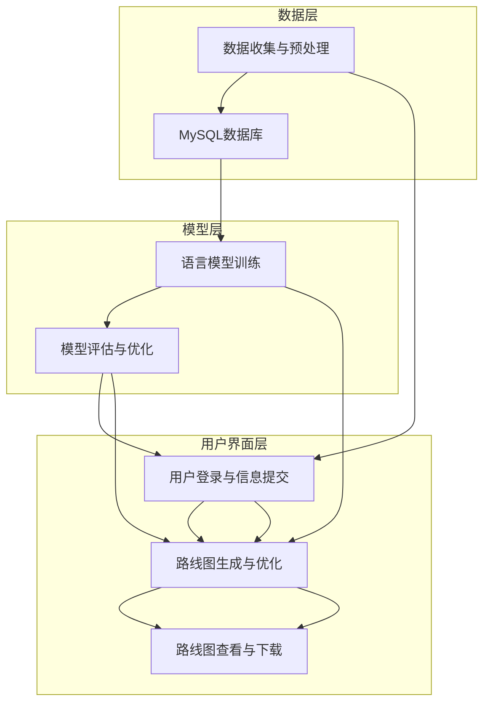
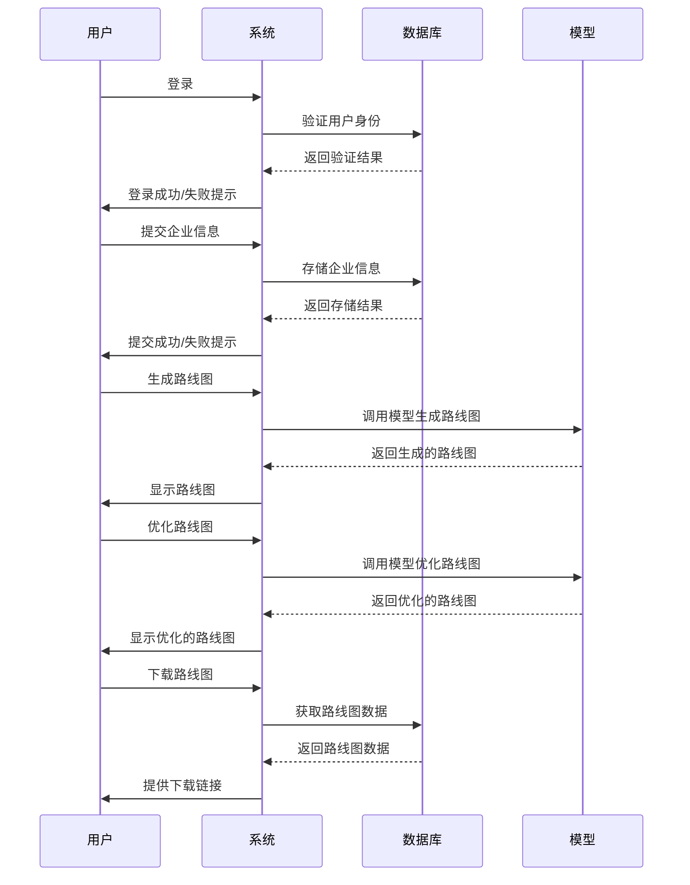

                 

# 语言模型在创新技术路线图生成中的应用

## 摘要

本文旨在探讨语言模型在创新技术路线图生成中的应用，通过分析语言模型的原理及其在不同技术领域的应用，进一步阐述其在创新技术路线图生成中的作用和潜力。文章首先介绍了软件2.0的概念和特点，探讨了AI大模型在软件2.0中的核心地位及其在企业级应用开发中的新范式。接着，文章详细介绍了AI大模型的定义、特点以及主流AI大模型的介绍，分析了AI大模型在企业中的应用前景。随后，文章重点讨论了语言模型的基本原理、应用以及性能评估与优化方法。在此基础上，文章提出了基于语言模型的创新技术路线图生成方法，并通过实际案例展示了其应用效果。最后，文章对语言模型在创新技术路线图生成中的挑战与未来发展趋势进行了展望。

## 1. 软件的发展与AI大模型的核心地位

### 1.1.1 从软件1.0到软件2.0的演进

软件技术的发展经历了从1.0到2.0的演变过程。传统的软件1.0时代主要关注功能性和稳定性，软件产品多以单机应用为主，用户交互以命令行界面为主。然而，随着互联网和移动设备的普及，软件环境发生了巨大变化，软件1.0的局限性逐渐显现。软件2.0应运而生，它强调的是用户体验、灵活性和协同性，用户不再仅仅是被动接受软件服务，而是能够积极参与到软件的运营和发展过程中。

软件2.0的特点包括：

1. **用户体验至上**：软件2.0强调用户的实际使用体验，界面设计更加直观、易用，功能也更加丰富和灵活。
2. **网络化应用**：软件2.0通常以互联网为载体，实现多用户之间的数据共享和协同工作。
3. **数据驱动**：软件2.0注重数据的收集、分析和利用，通过数据驱动决策和优化用户体验。
4. **可扩展性和灵活性**：软件2.0支持模块化设计和灵活的扩展，可以快速响应市场需求变化。

### 1.1.2 大模型在软件2.0中的核心地位

在软件2.0时代，人工智能（AI）大模型扮演着至关重要的角色。大模型，尤其是深度学习模型，能够处理海量的数据，从中提取出有用的信息，从而提升软件的智能化水平和用户体验。AI大模型在软件2.0中的应用主要包括：

1. **智能推荐系统**：利用大模型进行用户行为分析，实现个性化推荐，提高用户满意度。
2. **自然语言处理**：通过大模型实现智能对话、自动翻译等功能，提升人机交互体验。
3. **图像识别和视频分析**：利用大模型进行图像和视频的内容识别和分析，应用于安防监控、智能家居等领域。
4. **预测和决策支持**：大模型能够进行复杂的预测和决策，为企业和组织提供数据驱动的决策支持。

### 1.1.3 企业级应用开发的新范式

随着AI大模型的兴起，企业级应用开发也迎来了新的范式。传统的软件开发方法主要依赖于预定义的需求和流程，而新的开发范式强调的是敏捷性、迭代性和智能化。具体体现在以下几个方面：

1. **数据驱动的开发**：企业级应用开发更加注重数据的收集、分析和利用，通过数据分析指导软件开发和优化。
2. **快速迭代和持续集成**：软件开发周期变得更短，通过快速迭代和持续集成，能够更快地响应市场需求变化。
3. **智能化开发工具**：AI大模型被广泛应用于软件开发工具中，如代码生成、代码审查、测试自动化等，提高开发效率和质量。
4. **服务化架构**：软件产品不再是单一的静态应用，而是以服务的形式存在，实现灵活的扩展和集成。

总的来说，AI大模型在软件2.0时代的重要性不容忽视。它不仅提升了软件的智能化水平，还改变了企业级应用的开发模式，推动了软件技术的持续创新和发展。

### 1.2 AI大模型的定义与特点

#### 1.2.1 AI大模型的定义

AI大模型（Artificial Intelligence Large Models），通常指的是那些参数数量达到亿级甚至万亿级的人工神经网络模型。这些模型通常基于深度学习技术，能够处理海量数据，从中提取复杂的信息，并在此基础上进行预测、决策和生成任务。大模型的参数数量和计算复杂度显著高于传统的机器学习模型，这使得它们在处理复杂任务时具有更大的优势。

#### 1.2.2 AI大模型的核心特点

AI大模型具有以下几个核心特点：

1. **参数数量庞大**：大模型的参数数量通常在亿级以上，甚至达到万亿级，这使得它们能够捕捉数据中的细微特征，从而提高模型的性能。
2. **强大的表示能力**：大模型通过多层次的神经网络结构，能够对输入数据进行复杂的变换和表示，从而更好地理解数据中的信息。
3. **高效的训练策略**：大模型通常采用先进的优化算法和训练策略，如批次归一化、Dropout等，以提高训练效率和模型稳定性。
4. **广泛的应用范围**：大模型可以应用于各种领域，如自然语言处理、计算机视觉、语音识别、推荐系统等，具有很高的通用性和适应性。

#### 1.2.3 AI大模型与传统AI的区别

与传统AI模型相比，AI大模型在多个方面具有显著的优势和区别：

1. **性能提升**：大模型由于参数数量庞大，能够捕捉数据中的更多特征，从而显著提高模型的预测和分类准确性。
2. **处理复杂任务**：传统AI模型通常针对单一任务进行优化，而大模型则具有更强的泛化能力，能够处理多种复杂的任务。
3. **数据需求量**：大模型需要大量数据来训练，传统AI模型则对数据量要求较低。
4. **计算资源需求**：大模型的训练和推理需要更多的计算资源，通常依赖于高性能的GPU或TPU等硬件。

总的来说，AI大模型的出现标志着人工智能技术的一个新阶段，它不仅提升了模型的性能，还为人工智能在各个领域的应用提供了新的可能。

### 1.3 主流AI大模型简介

#### 1.3.1 GPT系列模型

GPT（Generative Pre-trained Transformer）系列模型是OpenAI推出的一类预训练语言模型，其核心思想是通过大规模的文本数据进行预训练，从而获得对自然语言的深刻理解和生成能力。GPT模型采用Transformer架构，通过多层注意力机制对输入文本进行处理，能够生成连贯、自然的文本。

GPT系列模型的主要特点包括：

1. **大规模预训练**：GPT模型在训练阶段接受了大量的文本数据，这使得模型能够捕捉到自然语言中的复杂模式和规律。
2. **强大的文本生成能力**：GPT模型能够生成高质量、连贯的文本，广泛应用于自动写作、机器翻译、对话系统等领域。
3. **多层注意力机制**：通过多层注意力机制，GPT模型能够关注文本中的不同部分，从而生成更加精细和准确的文本。

#### 1.3.2 BERT及其变体

BERT（Bidirectional Encoder Representations from Transformers）是由Google提出的一种双向Transformer模型，主要用于自然语言理解任务。BERT模型的核心思想是通过双向的编码器结构，使得模型能够同时考虑文本中前后文的信息，从而提高模型的语义理解能力。

BERT及其变体模型的主要特点包括：

1. **双向编码器**：BERT模型采用双向Transformer编码器，能够同时处理文本的前后文信息，从而提高模型的语义理解能力。
2. **大规模预训练**：BERT模型在训练阶段接受了大量的文本数据，从而具备强大的语义表示能力。
3. **适用于多种NLP任务**：BERT模型适用于多种自然语言处理任务，如文本分类、命名实体识别、情感分析等。

#### 1.3.3 其他知名大模型介绍

除了GPT和BERT之外，还有许多其他知名的大模型，如：

1. **TuringModel**：由DeepMind推出的一种基于Transformer架构的大模型，用于处理复杂的决策和推理任务。
2. **XLNet**：由Google提出的一种自回归语言模型，采用了新的训练策略和损失函数，提高了模型的性能。
3. **RoBERTa**：由Facebook AI研究院提出的一种改进版的BERT模型，通过调整训练策略和数据预处理方法，提高了模型的性能。

这些大模型各有特色，但在大规模文本处理和自然语言理解方面都表现出色。随着技术的不断进步，这些大模型的应用前景将更加广泛。

### 1.4 AI大模型在企业中的应用前景

#### 1.4.1 AI大模型的潜在应用领域

AI大模型在企业中的应用前景非常广阔，以下列举了一些主要的潜在应用领域：

1. **自然语言处理（NLP）**：AI大模型在NLP领域具有显著的优势，可以用于文本分类、情感分析、机器翻译、问答系统等任务，帮助企业更好地理解用户需求，提升客户服务质量。
2. **推荐系统**：通过分析用户行为和偏好数据，AI大模型可以为企业提供个性化的推荐服务，提高用户满意度和转化率。
3. **图像识别和计算机视觉**：AI大模型在图像识别和计算机视觉领域也有着广泛的应用，如安防监控、自动驾驶、医疗影像分析等，能够提高企业的运营效率和准确性。
4. **预测和决策支持**：AI大模型可以用于预测市场趋势、客户需求、库存管理等，为企业提供数据驱动的决策支持，降低风险，提高竞争力。
5. **自动化和智能客服**：AI大模型可以用于构建智能客服系统，实现24/7的全天候服务，提高客户响应速度和服务质量。

#### 1.4.2 企业采用AI大模型的优势

企业采用AI大模型具有以下优势：

1. **提升效率**：AI大模型能够自动化处理大量重复性工作，提高工作效率，减少人力成本。
2. **提高准确性**：AI大模型通过对海量数据的训练，能够提高预测和决策的准确性，降低错误率。
3. **优化用户体验**：AI大模型可以提供个性化服务，提升用户体验，增强用户黏性。
4. **降低风险**：通过数据分析和预测，AI大模型可以帮助企业提前识别潜在风险，降低运营风险。
5. **创新应用**：AI大模型为企业提供了新的应用场景和商业模式，有助于企业实现创新和持续发展。

#### 1.4.3 AI大模型应用的挑战与机遇

尽管AI大模型在企业中的应用前景广阔，但在实际应用过程中也面临着一些挑战和机遇：

1. **数据隐私和安全性**：企业需要确保数据隐私和安全性，避免数据泄露和滥用。
2. **计算资源和成本**：大模型的训练和推理需要大量的计算资源，这对企业的IT基础设施提出了较高的要求。
3. **模型解释性和可解释性**：大模型的决策过程往往不透明，难以解释，这可能会影响用户对模型的信任度。
4. **人才需求**：企业需要招聘和培养具备AI技能的专业人才，以应对大模型应用的需求。

然而，这些挑战也为企业提供了机遇：

1. **技术创新**：企业可以通过技术创新解决大模型应用的挑战，如开发新的数据隐私保护技术、优化模型训练和推理算法等。
2. **商业模式创新**：企业可以利用大模型创造新的商业模式，如基于AI的咨询服务、数据驱动的产品创新等。
3. **竞争力提升**：通过AI大模型的应用，企业可以提升竞争力，实现业务增长和可持续发展。

总的来说，AI大模型在企业中的应用具有巨大的潜力和前景，企业需要积极应对挑战，把握机遇，以实现持续的创新和发展。

### 1.5 本章小结

本章首先介绍了软件2.0的概念及其特点，探讨了AI大模型在软件2.0中的核心地位和在企业级应用开发中的新范式。接着，详细阐述了AI大模型的定义、特点及其与传统AI的区别，并介绍了主流的AI大模型。最后，分析了AI大模型在企业中的应用前景，探讨了其优势、挑战和机遇。通过本章的讨论，我们可以看到AI大模型在推动软件技术发展和企业创新中扮演着重要角色。

### 2.1 语言模型的基本原理

#### 2.1.1 语言模型的发展历程

语言模型的发展历程可以追溯到20世纪50年代，当时研究人员开始探索如何使用计算机模拟自然语言。最早的尝试包括基于规则的系统，这些系统通过预定义的语法规则来生成和解析文本。然而，这种方法在面对复杂和多样的自然语言时表现不佳。

随着计算机性能的提升和统计方法的进步，20世纪80年代出现了基于统计的语言模型。这些模型通过分析大量语料库，计算单词或短语的联合概率，从而预测下一个单词或短语。这一时期，N-gram模型（如Katz模型和Good-Turing模型）成为主流，它们通过简单的统计方法对语言进行建模，取得了显著的成果。

进入21世纪，深度学习技术的发展为语言模型带来了新的突破。2003年，Bengio等人在《科学》杂志上发表了关于递归神经网络（RNN）在语言模型中的应用，证明了深度学习在处理自然语言任务上的潜力。随后，Long Short-Term Memory（LSTM）和Gated Recurrent Unit（GRU）等改进的RNN模型相继出现，进一步提升了模型的性能。

2017年，Google推出了BERT模型，标志着语言模型进入了全新的阶段。BERT模型采用Transformer架构，通过双向的编码器结构，实现了对自然语言更深刻的理解和生成能力。随后，OpenAI的GPT系列模型和Facebook的RoBERTa等模型相继发布，进一步推动了语言模型的发展和应用。

#### 2.1.2 语言模型的基本概念

语言模型是一种统计模型，它旨在预测一段文本的下一个单词或符号。语言模型的基本概念包括：

1. **词向量**：词向量是语言模型中的一个核心概念，它将单词映射到高维空间中的一个点。通过词向量，我们可以计算单词之间的相似性和相关性，从而更好地理解自然语言。
2. **概率分布**：语言模型的目标是生成一个概率分布，表示下一个单词或符号出现的可能性。常用的方法包括N-gram模型和深度学习模型。
3. **损失函数**：在训练语言模型时，我们使用损失函数来衡量预测结果与真实值之间的差距，常用的损失函数包括交叉熵损失和负对数似然损失。

#### 2.1.3 语言模型的训练过程

语言模型的训练过程可以分为以下几步：

1. **数据准备**：首先，我们需要收集大量的文本数据，这些数据可以来源于各种来源，如网页、书籍、新闻等。在收集数据后，需要对文本进行预处理，包括分词、去停用词、词性标注等操作。
2. **词向量表示**：将文本数据转换为词向量表示，可以使用预训练的词向量库，如Word2Vec、GloVe等，也可以使用深度学习模型自训练词向量。
3. **构建模型**：根据所选的模型架构，构建语言模型。常用的模型包括N-gram模型、RNN、LSTM、GRU和Transformer等。
4. **训练模型**：使用训练数据对模型进行训练，通过优化损失函数来调整模型的参数。在训练过程中，可以使用诸如批次归一化、Dropout等技术来提高模型的稳定性和性能。
5. **评估模型**：在训练完成后，使用验证集和测试集对模型进行评估，常用的评估指标包括准确率、召回率、F1分数等。
6. **模型部署**：将训练好的模型部署到生产环境中，用于实际的文本生成、分类、翻译等任务。

通过上述步骤，我们可以构建一个性能优秀的语言模型，从而更好地理解和生成自然语言。

### 2.2 语言模型在自然语言处理中的应用

#### 2.2.1 文本分类

文本分类是自然语言处理中的一个重要任务，旨在将文本数据按照预定的类别进行分类。语言模型在文本分类中的应用主要包括以下几个方面：

1. **文本表示**：首先，需要将文本数据转换为向量表示，常用的方法包括词袋模型、TF-IDF和词嵌入（如Word2Vec、GloVe）。通过这些方法，我们可以将高维的文本数据映射到低维的向量空间，从而便于后续的模型处理。
2. **特征提取**：在文本表示的基础上，提取文本的关键特征，如词频、词序、词性等。这些特征将作为模型的输入，用于分类任务的训练和预测。
3. **分类模型**：使用分类模型对文本进行分类，常用的分类模型包括朴素贝叶斯、支持向量机（SVM）、随机森林和深度学习模型（如CNN、RNN、BERT等）。通过训练和优化模型，可以使得模型能够准确地对文本进行分类。

文本分类在实际应用中非常广泛，如垃圾邮件过滤、情感分析、新闻分类等。通过语言模型的应用，我们可以实现高效、准确的文本分类，从而提高系统的智能化水平和用户体验。

#### 2.2.2 文本生成

文本生成是自然语言处理中的另一个重要任务，旨在根据输入的提示或模板生成相应的文本。语言模型在文本生成中的应用主要包括以下几个方面：

1. **序列到序列模型**：序列到序列（Sequence-to-Sequence）模型是文本生成的一种常见方法，它通过将输入序列映射到输出序列，从而生成文本。常用的模型包括循环神经网络（RNN）、长短期记忆网络（LSTM）和注意力机制等。
2. **生成对抗网络（GAN）**：生成对抗网络（GAN）是一种无监督学习的模型，通过生成器和判别器的对抗训练，生成高质量的文本。生成器负责生成文本，判别器负责判断文本的真实性。通过这种对抗训练，生成器可以逐渐生成更真实、高质量的文本。
3. **基于记忆的网络**：基于记忆的网络（Memory-augmented Neural Network）通过引入记忆模块，可以更好地处理长文本和复杂任务。记忆模块可以存储和检索相关的信息，从而提高模型的生成能力。

文本生成在实际应用中也非常广泛，如自动写作、机器翻译、对话系统等。通过语言模型的应用，我们可以实现高质量的文本生成，从而为各种应用提供强有力的支持。

#### 2.2.3 命名实体识别

命名实体识别（Named Entity Recognition，NER）是自然语言处理中的一个重要任务，旨在识别文本中的命名实体，如人名、地名、组织名等。语言模型在命名实体识别中的应用主要包括以下几个方面：

1. **词嵌入**：使用词嵌入技术将文本中的单词转换为向量表示，从而便于模型的处理。词嵌入可以帮助模型捕捉单词之间的语义关系，从而提高识别的准确性。
2. **卷积神经网络（CNN）**：卷积神经网络（CNN）是一种常用的文本分类模型，通过卷积层提取文本的特征，然后通过全连接层进行分类。在命名实体识别中，CNN可以用于识别文本中的命名实体。
3. **长短期记忆网络（LSTM）**：长短期记忆网络（LSTM）是一种用于处理序列数据的神经网络，通过记忆单元可以捕捉文本中的长期依赖关系。在命名实体识别中，LSTM可以用于识别文本中的命名实体。
4. **双向编码器（BERT）**：双向编码器（BERT）是一种基于Transformer的预训练模型，通过双向的编码器结构，可以同时考虑文本的前后文信息，从而提高命名实体识别的准确性。

命名实体识别在实际应用中非常广泛，如信息抽取、情感分析、实体关系抽取等。通过语言模型的应用，我们可以实现高效、准确的命名实体识别，从而为各种应用提供强有力的支持。

#### 2.2.4 机器翻译

机器翻译（Machine Translation，MT）是自然语言处理中的一个经典任务，旨在将一种语言的文本翻译成另一种语言的文本。语言模型在机器翻译中的应用主要包括以下几个方面：

1. **基于规则的方法**：基于规则的方法通过预定义的语法和词汇规则进行翻译，如直译、意译等。这种方法在处理简单和规律的文本时效果较好，但在处理复杂和多样化的文本时表现不佳。
2. **基于统计的方法**：基于统计的方法通过统计源语言和目标语言之间的对应关系进行翻译。常用的方法包括基于N-gram的翻译模型和基于统计机器学习的翻译模型（如统计机器翻译、基于转换的机器翻译等）。
3. **基于神经网络的翻译模型**：基于神经网络的翻译模型通过深度学习技术进行翻译。这些模型包括序列到序列（Sequence-to-Sequence）模型、注意力机制模型（如ATM、NMT等）和基于Transformer的翻译模型（如BERT、T5等）。

机器翻译在实际应用中非常广泛，如跨语言信息检索、跨语言文本分析、多语言交流等。通过语言模型的应用，我们可以实现高质量的机器翻译，从而促进不同语言之间的交流和理解。

### 2.3 语言模型在创新技术中的应用

#### 2.3.1 语言模型在智能对话系统中的应用

智能对话系统是自然语言处理中的一个重要应用领域，旨在实现人与计算机之间的自然语言交互。语言模型在智能对话系统中的应用主要包括以下几个方面：

1. **意图识别**：意图识别是智能对话系统的核心任务之一，旨在理解用户的意图或需求。语言模型可以通过分析用户的输入文本，识别用户的意图，从而为后续的对话生成提供依据。
2. **对话生成**：对话生成是智能对话系统的另一个关键任务，旨在根据用户的意图和上下文生成合适的回答。语言模型可以通过预训练或微调的方式，生成自然、连贯的对话文本。
3. **上下文理解**：上下文理解是智能对话系统的重要能力，旨在理解用户输入中的上下文信息，从而生成更加准确和相关的回答。语言模型可以通过长短期记忆（LSTM）或Transformer等架构，捕捉对话中的上下文信息。

智能对话系统在金融、客服、教育等领域有着广泛的应用，通过语言模型的应用，我们可以实现更加智能、高效的对话交互，提升用户体验和服务质量。

#### 2.3.2 语言模型在推荐系统中的应用

推荐系统是人工智能领域的一个重要分支，旨在根据用户的历史行为和兴趣，为用户推荐相关的商品、内容或服务。语言模型在推荐系统中的应用主要包括以下几个方面：

1. **用户表示**：通过语言模型，可以将用户的行为、兴趣和反馈转换为向量表示，从而更好地理解用户的需求和偏好。
2. **物品表示**：同样地，语言模型可以将物品的属性、描述和用户评价转换为向量表示，从而更好地理解物品的特点和用户需求。
3. **相似性计算**：通过计算用户和物品的向量表示之间的相似性，语言模型可以帮助推荐系统找到与用户兴趣最相关的物品，从而生成个性化的推荐列表。
4. **交互式推荐**：在交互式推荐中，语言模型可以根据用户的实时反馈和对话，动态调整推荐策略，提高推荐的效果和用户体验。

推荐系统在电子商务、社交媒体、内容平台等领域有着广泛的应用，通过语言模型的应用，我们可以实现更加精准和个性化的推荐，从而提高用户满意度和转化率。

#### 2.3.3 语言模型在信息检索中的应用

信息检索是人工智能领域的一个重要应用领域，旨在帮助用户从大量信息中快速找到所需的信息。语言模型在信息检索中的应用主要包括以下几个方面：

1. **查询理解**：语言模型可以帮助理解用户的查询意图，将自然语言查询转换为结构化的查询语句，从而更好地匹配和检索相关的信息。
2. **文档表示**：通过语言模型，可以将文档的标题、摘要和正文转换为向量表示，从而更好地理解文档的主题和内容。
3. **相似度计算**：通过计算查询和文档的向量表示之间的相似度，语言模型可以帮助检索系统找到与用户查询最相关的文档，从而提高检索的准确性和效果。
4. **交互式检索**：在交互式检索中，语言模型可以根据用户的实时反馈和查询，动态调整检索策略和结果，从而提高检索的体验和满意度。

信息检索在搜索引擎、企业知识库、医疗信息检索等领域有着广泛的应用，通过语言模型的应用，我们可以实现更加智能和高效的检索，从而提高信息获取的效率和质量。

#### 2.4 语言模型的性能评估与优化

#### 2.4.1 语言模型的性能评估指标

语言模型的性能评估是确保模型在实际应用中能够达到预期效果的关键步骤。以下是一些常用的性能评估指标：

1. **准确率（Accuracy）**：准确率是评估分类模型性能的基本指标，它表示正确分类的样本占总样本的比例。然而，准确率在某些情况下可能会被误导，特别是在类别不平衡的数据集中。

   $$\text{Accuracy} = \frac{\text{正确分类的样本数}}{\text{总样本数}}$$

2. **召回率（Recall）**：召回率表示在所有实际为正类的样本中，被正确识别为正类的比例。召回率强调了识别所有正类样本的重要性，特别是在某些应用中，漏掉一个正类样本可能会带来严重的后果。

   $$\text{Recall} = \frac{\text{正确分类的正类样本数}}{\text{实际为正类的样本数}}$$

3. **精确率（Precision）**：精确率表示在所有被分类为正类的样本中，实际为正类的比例。精确率强调了分类结果的可靠性，特别是在标签成本较高或资源有限的情况下。

   $$\text{Precision} = \frac{\text{正确分类的正类样本数}}{\text{被分类为正类的样本数}}$$

4. **F1分数（F1 Score）**：F1分数是精确率和召回率的调和平均数，它综合考虑了模型的精确性和召回率，是评估分类模型性能的常用指标。

   $$\text{F1 Score} = 2 \times \frac{\text{Precision} \times \text{Recall}}{\text{Precision} + \text{Recall}}$$

5. **混淆矩阵（Confusion Matrix）**：混淆矩阵是一种展示模型预测结果和实际结果之间关系的表格，它可以帮助我们更直观地了解模型的性能。

   |               | 预测正类 | 预测负类 |
   |-----------|-------|-------|
   | 实际正类   | TP    | FN    |
   | 实际负类   | FP    | TN    |

   其中，TP（True Positive）表示正确预测的正类，FN（False Negative）表示漏掉的正类，FP（False Positive）表示误分类为正类的负类，TN（True Negative）表示正确预测的负类。

6. **交叉验证（Cross-Validation）**：交叉验证是一种评估模型性能的常用方法，通过将数据集划分为多个子集，反复进行训练和测试，以获得模型在未知数据上的性能估计。

7. **ROC曲线和AUC（Area Under Curve）**：ROC曲线是评估分类模型性能的重要工具，它展示了不同阈值下模型的敏感度和特异性。AUC值是ROC曲线下方的面积，用来衡量模型的分类能力。

#### 2.4.2 语言模型的优化方法

为了提高语言模型的性能，我们通常采用以下几种优化方法：

1. **超参数调优（Hyperparameter Tuning）**：超参数是模型架构之外的可调参数，如学习率、批次大小、正则化参数等。通过使用网格搜索、贝叶斯优化等技术，可以找到最优的超参数组合，从而提高模型的性能。

2. **正则化（Regularization）**：正则化方法用于防止模型过拟合，常用的正则化方法包括L1正则化、L2正则化和Dropout。L1正则化通过增加模型的L1范数惩罚来减少模型的复杂度，L2正则化通过增加模型的L2范数惩罚来实现类似的效果，Dropout通过随机丢弃部分神经元来减少模型的依赖性。

3. **数据增强（Data Augmentation）**：数据增强是一种通过引入噪声、变换、裁剪等方式来扩充数据集的方法，从而提高模型的泛化能力。在自然语言处理中，常用的数据增强方法包括单词替换、同义词替换、词干提取等。

4. **模型融合（Model Ensemble）**：模型融合是将多个模型的结果进行合并，从而提高整体的性能。常用的模型融合方法包括投票法、加权平均法和栈式模型（Stacked Models）。

5. **迁移学习（Transfer Learning）**：迁移学习是一种利用预训练模型在新任务上进行微调的方法，从而提高模型的性能。通过迁移学习，我们可以利用预训练模型在大量数据上学习的通用特征，从而提高新任务的性能。

6. **动态调整学习率（Learning Rate Scheduling）**：动态调整学习率是一种在训练过程中根据模型的性能自动调整学习率的方法。常用的学习率调整策略包括指数衰减、余弦退火和自适应学习率调整（如Adam优化器）。

通过上述优化方法，我们可以显著提高语言模型的性能和泛化能力，从而更好地适应不同的自然语言处理任务。

#### 2.4.3 语言模型的实际应用效果评估

在实际应用中，评估语言模型的性能不仅需要考虑模型的准确性，还需要综合考虑模型的实时性、稳定性和可扩展性。以下是一些评估语言模型实际应用效果的方法：

1. **实时性评估**：实时性评估旨在评估模型在处理实时数据时的性能。常用的评估指标包括响应时间、延迟和吞吐量。通过模拟实际应用场景，可以评估模型在实时处理数据时的响应能力和效率。

2. **稳定性评估**：稳定性评估旨在评估模型在长时间运行时的稳定性和可靠性。通过长时间的测试和监控，可以检测模型是否会出现异常、错误或性能下降。

3. **可扩展性评估**：可扩展性评估旨在评估模型在处理大规模数据或增加计算资源时的性能。通过调整模型架构和优化算法，可以评估模型在扩展计算资源时的性能提升程度。

4. **用户反馈评估**：用户反馈评估是一种通过收集用户对模型性能的反馈来评估模型效果的方法。通过分析用户的评价和建议，可以了解模型在实际应用中的用户体验和满意度。

5. **基准测试评估**：基准测试评估是一种通过将模型与其他现有模型进行对比来评估模型性能的方法。常用的基准测试包括标准数据集上的分类准确率、文本生成质量、命名实体识别准确性等。

通过上述方法，我们可以全面评估语言模型在实际应用中的性能和效果，从而为模型的优化和改进提供依据。

### 2.5 本章小结

本章详细介绍了语言模型的基本原理、应用和性能评估与优化方法。首先，回顾了语言模型的发展历程，并阐述了其基本概念和训练过程。接着，讨论了语言模型在自然语言处理中的应用，包括文本分类、文本生成、命名实体识别和机器翻译等任务。随后，介绍了语言模型在创新技术中的应用，如智能对话系统、推荐系统和信息检索。最后，探讨了语言模型的性能评估指标和优化方法，并提出了实际应用效果评估的方法。通过本章的讨论，我们可以看到语言模型在自然语言处理和创新技术中的重要作用和广阔前景。

### 3.1 创新技术路线图概述

#### 3.1.1 创新技术路线图的定义

创新技术路线图（Innovation Technology Roadmap）是一种战略规划工具，用于指导企业在未来一段时间内如何实现技术突破和创新。它通过明确技术的演进路径、关键里程碑和资源分配，帮助企业制定明确的技术发展计划，从而在激烈的市场竞争中保持领先地位。

创新技术路线图的定义可以概括为：一种基于当前技术发展趋势和市场需求的规划工具，通过明确技术目标、路径和资源分配，帮助企业实现技术创新和业务增长。

#### 3.1.2 创新技术路线图的重要性

创新技术路线图在企业中具有重要意义，主要体现在以下几个方面：

1. **明确技术方向**：创新技术路线图可以帮助企业明确技术发展方向，确保资源投入和技术开发与市场趋势和客户需求保持一致。
2. **指导资源配置**：通过制定详细的路线图，企业可以更加合理地分配资源，避免资源浪费，提高研发效率和成果转化率。
3. **促进协作与沟通**：创新技术路线图可以作为各部门沟通和协作的依据，促进研发、市场、销售等部门的紧密配合，提高整体工作效率。
4. **提升竞争力**：通过制定和实施创新技术路线图，企业可以不断推出具有竞争力的新技术和产品，提高市场占有率，增强品牌影响力。
5. **风险管理**：创新技术路线图可以帮助企业提前识别和应对潜在的技术风险，通过制定应对策略，降低创新过程中的不确定性。

#### 3.1.3 创新技术路线图的组成

创新技术路线图通常包括以下几个关键组成部分：

1. **愿景与目标**：明确企业技术创新的长期愿景和短期目标，包括技术突破、市场占有率、业务增长等。
2. **技术领域**：确定技术创新的重点领域，如人工智能、大数据、物联网、区块链等，并根据市场趋势和客户需求进行优先级排序。
3. **关键里程碑**：制定技术发展过程中的关键里程碑，包括技术研发阶段、产品发布阶段、市场推广阶段等，以确保技术路线图的可行性和实施效果。
4. **资源分配**：明确技术发展所需的资源投入，包括资金、人力、设备等，并制定详细的资源分配计划，以确保资源的合理利用和优化配置。
5. **风险评估与应对**：识别技术创新过程中的潜在风险，如技术风险、市场风险、政策风险等，并制定相应的应对策略和风险管理措施。
6. **实施计划**：制定详细的技术创新实施计划，包括具体的任务分解、时间节点、责任分配等，以确保路线图的顺利实施和达成目标。

通过上述组成部分，创新技术路线图为企业提供了清晰的技术发展蓝图，有助于企业在技术创新过程中保持战略清晰、目标明确和行动有力。

### 3.2 语言模型在路线图生成中的应用

#### 3.2.1 基于语言模型的路线图生成方法

基于语言模型的路线图生成方法是一种利用自然语言处理和生成模型技术来构建创新技术路线图的方法。这种方法的核心思想是通过训练语言模型，使其能够根据企业的愿景、目标和市场环境生成具体的路线图。

具体步骤如下：

1. **数据收集与预处理**：首先，需要收集与企业愿景、目标和技术领域相关的文本数据，如公司战略规划文档、市场分析报告、竞争对手分析报告等。然后，对收集到的数据进行预处理，包括分词、去停用词、词性标注等操作。

2. **训练语言模型**：使用预处理后的文本数据训练一个大型语言模型，如GPT-3、BERT等。训练过程中，模型会学习到文本中的语言规律和语义关系，从而具备生成文本的能力。

3. **生成路线图**：利用训练好的语言模型生成创新技术路线图。具体方法包括：
   - **文本生成**：直接生成包含愿景、目标、技术领域和关键里程碑的文本描述，然后对文本进行解析和格式化，形成路线图。
   - **模板填充**：设计一个包含关键元素的路线图模板，如愿景、目标、技术领域、里程碑等，然后使用语言模型填充模板中的空白部分，生成完整的路线图。

4. **路线图优化**：生成的初步路线图可能不够完善或具体，需要通过人工干预和优化来调整和改进。具体方法包括：
   - **人工审核**：由专业人员对生成的路线图进行审核和评估，识别其中的不合理之处，并进行修正。
   - **迭代优化**：根据审核结果，对语言模型进行进一步的训练和优化，以提高生成的路线图的准确性和可行性。

#### 3.2.2 基于语言模型的路线图优化方法

基于语言模型的路线图优化方法旨在通过语言模型对生成的初步路线图进行优化，使其更加具体、可行和符合企业的实际需求。具体方法包括：

1. **语义修正**：通过语言模型识别路线图中的语义错误和逻辑不一致，并进行修正。例如，如果语言模型识别到愿景和目标之间存在矛盾，可以自动提出修正建议。

2. **资源分配**：基于语言模型对技术领域和关键里程碑进行资源分配优化。例如，根据企业当前的资源状况和市场环境，自动调整关键里程碑的实现顺序和资源投入。

3. **风险预测**：通过语言模型对潜在的技术风险和市场风险进行预测，并提出相应的应对策略。例如，如果模型预测到某项技术存在较高的风险，可以建议企业在开发过程中增加测试和验证环节。

4. **实时调整**：基于语言模型的动态调整能力，实时更新和优化路线图。例如，当市场环境发生变化或企业资源状况发生变化时，语言模型可以自动调整路线图中的关键里程碑和资源分配，以保持路线图的持续有效性。

#### 3.2.3 基于语言模型的路线图评估方法

基于语言模型的路线图评估方法旨在通过语言模型对生成的路线图进行评估，以验证其可行性和有效性。具体方法包括：

1. **一致性评估**：通过语言模型评估路线图中的各个部分是否一致，包括愿景、目标、技术领域、关键里程碑等。例如，如果语言模型识别到愿景和目标之间存在矛盾，可以自动标记为不一致。

2. **可行性评估**：通过语言模型评估路线图的可行性，包括技术实现的可行性、市场推广的可行性等。例如，如果模型预测到某项技术存在实现困难或市场接受度低，可以自动标记为不可行。

3. **稳定性评估**：通过语言模型评估路线图在变化的市场环境下的稳定性，包括技术路线的灵活性和适应性。例如，如果模型识别到路线图在市场环境发生变化时难以调整，可以自动标记为稳定性低。

4. **优化建议**：基于评估结果，语言模型可以提出优化建议，包括调整关键里程碑、资源分配、风险应对等，以提高路线图的可行性和稳定性。

通过上述评估方法，我们可以全面评估基于语言模型生成的路线图，确保其在实际应用中的有效性和可行性。

### 3.3 创新技术路线图生成的实际案例

#### 3.3.1 案例一：智能医疗领域的创新技术路线图

在智能医疗领域，基于语言模型的创新技术路线图生成方法被成功应用于一家初创企业的研发规划。该企业的愿景是利用人工智能技术改善患者的医疗体验，提高医疗服务的效率和质量。

1. **愿景与目标**：通过语言模型生成的路线图明确了企业的长期愿景是构建一个智能化、个性化的医疗服务平台。短期目标包括开发智能诊断系统、智能推荐系统和智能健康管理平台。

2. **技术领域**：路线图确定了三个主要技术领域，分别是计算机视觉、自然语言处理和机器学习。其中，计算机视觉用于医疗图像分析，自然语言处理用于处理医疗文本数据，机器学习用于构建智能诊断和推荐系统。

3. **关键里程碑**：路线图设定了四个关键里程碑，分别是：
   - **里程碑一**：完成智能诊断系统的原型开发，实现对常见疾病的初步诊断。
   - **里程碑二**：完成智能推荐系统的开发，实现个性化医疗建议和处方推荐。
   - **里程碑三**：完成智能健康管理平台的建设，提供患者全方位的健康管理服务。
   - **里程碑四**：实现产品的商业化推广，覆盖多家医院和诊所，形成规模化应用。

4. **资源分配**：基于语言模型生成的路线图详细列出了每个里程碑所需的资源分配，包括研发资金、人力资源和设备采购。

5. **风险评估**：语言模型对技术风险和市场风险进行了预测，并提出了相应的应对策略。例如，在技术风险方面，建议增加测试和验证环节，确保系统的准确性和可靠性。

6. **评估与优化**：通过语言模型的评估，路线图的一致性和可行性得到了验证。在实际实施过程中，企业根据评估结果对路线图进行了多次优化和调整，确保项目的顺利推进。

通过这个实际案例，我们可以看到基于语言模型的创新技术路线图生成方法在智能医疗领域的应用效果，为企业提供了明确的技术发展蓝图和实施指导。

#### 3.3.2 案例二：自动驾驶领域的创新技术路线图

自动驾驶技术是当今科技领域的一个重要发展方向，为了确保在该领域的竞争力，一家自动驾驶初创企业采用了基于语言模型的创新技术路线图生成方法。

1. **愿景与目标**：通过语言模型生成的路线图明确了企业的愿景是打造一款安全、高效、可靠的自动驾驶系统。短期目标包括：
   - **里程碑一**：完成自动驾驶系统的初步测试和验证。
   - **里程碑二**：实现自动驾驶系统的商业化试点，并在特定场景（如机场、园区）进行应用。
   - **里程碑三**：扩大自动驾驶系统的应用范围，覆盖更多城市和交通场景。
   - **里程碑四**：实现自动驾驶系统的规模化生产，投入商业化运营。

2. **技术领域**：路线图确定了多个关键技术领域，包括传感器融合、计算机视觉、路径规划、决策控制等。这些领域是自动驾驶技术实现的核心。

3. **关键里程碑**：路线图设定了以下关键里程碑：
   - **里程碑一**：完成自动驾驶传感器系统的集成和优化。
   - **里程碑二**：开发并验证计算机视觉算法，实现自动驾驶系统的高精度地图构建和物体识别。
   - **里程碑三**：实现自动驾驶系统的路径规划和决策控制，确保系统的安全性和稳定性。
   - **里程碑四**：进行自动驾驶系统的全面测试和优化，确保系统的可靠性。

4. **资源分配**：路线图详细列出了每个里程碑所需的资源投入，包括研发资金、人力资源和设备采购。

5. **风险评估**：语言模型对自动驾驶技术领域中的潜在风险进行了预测，如技术风险、市场风险和政策风险。针对这些风险，企业制定了相应的应对策略，包括增加研发投入、加强与合作伙伴的合作、关注政策动态等。

6. **评估与优化**：通过语言模型的评估，企业对路线图进行了多次优化和调整，确保项目的实施过程中能够应对各种挑战。

这个案例展示了基于语言模型的创新技术路线图生成方法在自动驾驶领域的应用，为企业提供了清晰的发展方向和实施计划，有助于企业实现自动驾驶技术的持续创新和商业化推广。

#### 3.3.3 案例三：区块链技术的创新技术路线图

区块链技术是近年来发展迅速的一个重要领域，为了在区块链技术领域保持领先地位，一家区块链初创企业采用了基于语言模型的创新技术路线图生成方法。

1. **愿景与目标**：通过语言模型生成的路线图明确了企业的愿景是构建一个安全、高效、透明的区块链生态系统。短期目标包括：
   - **里程碑一**：完成基础区块链平台的开发，实现区块链的基本功能。
   - **里程碑二**：引入智能合约功能，提供去中心化的应用服务。
   - **里程碑三**：实现区块链与其他分布式技术的集成，拓展应用场景。
   - **里程碑四**：推出区块链服务产品，实现商业化应用。

2. **技术领域**：路线图确定了多个关键技术领域，包括区块链架构设计、智能合约开发、分布式存储、跨链技术等。这些领域是区块链技术实现的基础。

3. **关键里程碑**：路线图设定了以下关键里程碑：
   - **里程碑一**：完成基础区块链平台的开发，包括节点架构、数据存储和网络通信。
   - **里程碑二**：开发智能合约平台，提供多样化的智能合约模板和开发工具。
   - **里程碑三**：实现分布式存储和跨链技术，提升区块链系统的扩展性和互操作性。
   - **里程碑四**：进行全面的系统测试和优化，确保平台的稳定性和安全性。

4. **资源分配**：路线图详细列出了每个里程碑所需的资源投入，包括研发资金、人力资源和设备采购。

5. **风险评估**：语言模型对区块链技术领域中的潜在风险进行了预测，如技术风险、市场风险和安全风险。针对这些风险，企业制定了相应的应对策略，包括增加研发投入、加强与合作伙伴的合作、关注政策动态等。

6. **评估与优化**：通过语言模型的评估，企业对路线图进行了多次优化和调整，确保项目的实施过程中能够应对各种挑战。

这个案例展示了基于语言模型的创新技术路线图生成方法在区块链技术领域的应用，为企业提供了清晰的技术发展蓝图和实施计划，有助于企业实现区块链技术的持续创新和商业化应用。

### 3.4 语言模型在路线图生成中的挑战与展望

#### 3.4.1 语言模型在路线图生成中的挑战

尽管语言模型在创新技术路线图生成中具有显著的优势，但在实际应用中仍面临一些挑战：

1. **数据隐私和安全**：语言模型需要处理大量的企业内部数据和敏感信息，如何确保数据的安全性和隐私保护是一个重要的挑战。企业需要采取严格的数据保护措施，防止数据泄露和滥用。

2. **模型解释性**：语言模型生成的路线图往往具有高度的自动化和智能化，但其决策过程可能不够透明，导致模型解释性差。这对于需要理解和信任模型结果的企业来说是一个挑战。

3. **计算资源需求**：训练和部署大型语言模型需要大量的计算资源，尤其是GPU或TPU等高性能硬件。对于资源有限的企业，如何合理分配和优化计算资源是一个重要问题。

4. **模型适应性**：语言模型在生成路线图时，需要适应不断变化的市场环境和企业需求。如何确保模型能够快速调整和适应新的变化是一个挑战。

5. **错误纠正与优化**：语言模型生成的初步路线图可能存在错误和不合理之处，如何进行有效的错误纠正和优化是一个复杂的问题。

#### 3.4.2 语言模型在路线图生成中的未来发展趋势

尽管存在挑战，但语言模型在创新技术路线图生成中的应用前景依然广阔。以下是未来可能的发展趋势：

1. **数据隐私保护技术的进步**：随着数据隐私保护技术的不断进步，如联邦学习、差分隐私等，语言模型在处理企业内部数据和敏感信息时将更加安全和可靠。

2. **模型解释性和透明度的提升**：通过结合可视化技术、决策解释工具等，可以提高语言模型的解释性，使企业能够更好地理解和信任模型结果。

3. **计算资源的优化与共享**：随着云计算和边缘计算技术的发展，企业将能够更灵活地获取和利用计算资源，降低计算成本，提高模型训练和部署的效率。

4. **模型适应性的增强**：通过引入自适应学习算法、迁移学习等技术，可以提高语言模型在路线图生成中的适应性，使其能够快速响应市场和企业需求的变化。

5. **跨领域合作与协同**：随着语言模型在各个领域的应用不断扩展，跨领域合作和协同将成为未来发展的趋势。通过整合不同领域的知识和技术，可以进一步提高路线图生成的准确性和可行性。

总的来说，语言模型在创新技术路线图生成中的应用具有巨大的潜力和前景，随着技术的不断进步，其应用效果将得到显著提升。

### 3.5 本章小结

本章首先介绍了创新技术路线图的定义、重要性和组成。接着，详细讨论了基于语言模型的路线图生成方法和优化方法，并通过实际案例展示了其应用效果。随后，分析了语言模型在路线图生成中的挑战和未来发展趋势。通过本章的讨论，我们可以看到语言模型在创新技术路线图生成中的重要作用和广阔前景，为企业的技术创新提供了有力支持。

### 4.1 语言模型在自然语言生成中的技术原理

#### 4.1.1 语言模型在文本生成中的应用

文本生成是自然语言处理中的一个重要任务，旨在根据给定的输入生成自然语言文本。语言模型在文本生成中的应用主要体现在以下几个方面：

1. **序列到序列（Sequence-to-Sequence）模型**：序列到序列模型是一种经典的文本生成方法，通过将输入序列映射到输出序列，从而生成文本。这种模型通常采用编码器-解码器架构，其中编码器负责将输入序列编码成一个固定长度的向量，解码器则根据编码器的输出逐词生成输出序列。常用的序列到序列模型包括循环神经网络（RNN）、长短期记忆网络（LSTM）和基于注意力机制的Transformer模型。

2. **生成对抗网络（GAN）**：生成对抗网络是一种无监督学习的模型，通过生成器和判别器的对抗训练，生成高质量的文本。生成器负责生成文本，判别器则负责判断生成文本的真实性。通过这种对抗训练，生成器可以逐渐生成更真实、高质量的文本。

3. **基于记忆的网络**：基于记忆的网络通过引入记忆模块，可以更好地处理长文本和复杂任务。记忆模块可以存储和检索相关的信息，从而提高模型的生成能力。例如，记忆网络（Memory Networks）和图注意力网络（Graph Attention Networks）都是基于记忆的文本生成模型。

#### 4.1.2 语言模型在语音识别中的应用

语音识别是将语音信号转换为文本或命令的过程。语言模型在语音识别中的应用主要体现在以下几个方面：

1. **语音信号处理**：首先，语音识别系统需要对语音信号进行预处理，如去除噪声、增强语音信号等。然后，通过自动语音识别（Automatic Speech Recognition，ASR）技术将语音信号转换为文本。

2. **声学模型**：声学模型负责将语音信号映射到声学特征向量。这些特征向量通常包括梅尔频率倒谱系数（MFCC）、频谱特征等。声学模型通常采用深度神经网络（DNN）或卷积神经网络（CNN）来训练。

3. **语言模型**：语言模型负责根据声学特征和上下文信息，预测下一个单词或词组。语言模型通常采用N-gram模型、递归神经网络（RNN）、长短期记忆网络（LSTM）或Transformer模型。通过结合声学模型和语言模型，可以显著提高语音识别的准确性。

4. **解码器**：解码器是语音识别系统中的一个关键组件，负责将声学特征向量序列转换为文本序列。常见的解码器包括基于贪心搜索的解码器、基于动态规划的最长公共子序列解码器（LDS）和基于Transformer的解码器。

#### 4.1.3 语言模型在对话系统中的应用

对话系统是自然语言处理领域的一个重要分支，旨在实现人与计算机之间的自然语言交互。语言模型在对话系统中的应用主要体现在以下几个方面：

1. **意图识别**：意图识别是对话系统的核心任务之一，旨在理解用户的意图或需求。语言模型可以通过分析用户的输入文本，识别用户的意图，从而为后续的对话生成提供依据。

2. **对话生成**：对话生成是对话系统的另一个关键任务，旨在根据用户的意图和上下文生成合适的回答。语言模型可以通过预训练或微调的方式，生成自然、连贯的对话文本。

3. **上下文理解**：上下文理解是对话系统的重要能力，旨在理解用户输入中的上下文信息，从而生成更加准确和相关的回答。语言模型可以通过长短期记忆（LSTM）或Transformer等架构，捕捉对话中的上下文信息。

4. **对话管理**：对话管理负责协调对话系统的各个模块，确保对话的流畅性和一致性。语言模型可以用于生成对话策略，指导对话系统如何响应用户的输入，并维持对话的连贯性。

通过上述应用，语言模型在文本生成、语音识别和对话系统中发挥着关键作用，为自然语言处理领域的持续创新提供了强有力的支持。

### 4.2 语言模型在计算机视觉中的技术原理

#### 4.2.1 语言模型在图像分类中的应用

图像分类是计算机视觉中的一个基础任务，旨在将图像划分为不同的类别。语言模型在图像分类中的应用主要体现在以下几个方面：

1. **图像特征提取**：首先，需要将图像转换为向量表示，以便进行分类。语言模型可以通过预训练的词嵌入技术（如GloVe或Word2Vec）来提取图像的特征向量。这些特征向量可以捕获图像中的视觉信息，如颜色、纹理和形状。

2. **文本相似性计算**：利用语言模型，可以计算图像特征向量与类别标签之间的文本相似性。常用的方法包括计算两个向量的余弦相似度或使用语言模型生成类别标签的文本表示，然后计算相似性。

3. **分类模型**：基于语言模型提取的特征向量，可以采用传统的机器学习模型（如支持向量机SVM、朴素贝叶斯Naive Bayes）或深度学习模型（如卷积神经网络CNN、递归神经网络RNN）进行分类。通过训练分类模型，可以学习到图像特征与类别标签之间的关系，从而实现图像分类。

#### 4.2.2 语言模型在目标检测中的应用

目标检测是计算机视觉中的另一个重要任务，旨在识别图像中的多个对象并定位其位置。语言模型在目标检测中的应用主要体现在以下几个方面：

1. **区域建议**：目标检测通常首先生成多个可能的区域建议，然后对这些区域进行分类和定位。语言模型可以通过预训练的文本分类模型（如BERT）来生成这些区域建议。例如，可以将图像区域描述为一个文本序列，然后通过文本分类模型预测每个区域的类别。

2. **特征提取与融合**：语言模型可以提取图像区域的特征向量，并与图像特征向量进行融合。通过这种方式，可以生成更加丰富的特征表示，从而提高目标检测的准确性。

3. **分类与定位**：利用融合后的特征向量，可以采用目标检测算法（如YOLO、SSD、Faster R-CNN）进行分类和定位。这些算法通常包括两个步骤：第一步是检测多个候选区域，第二步是对这些区域进行分类和定位。

#### 4.2.3 语言模型在图像分割中的应用

图像分割是将图像划分为多个区域的过程，每个区域代表图像中的不同对象或背景。语言模型在图像分割中的应用主要体现在以下几个方面：

1. **像素级特征提取**：语言模型可以提取图像像素级别的特征向量，这些特征向量可以捕获像素级别的视觉信息。通过这种方式，可以生成更加精细的特征表示。

2. **文本表示与融合**：利用语言模型，可以将图像分割任务转化为文本分类问题。例如，可以将每个像素点的颜色、纹理等信息编码为文本序列，然后通过语言模型生成像素级别的文本表示。这些文本表示可以与图像特征向量进行融合，生成更丰富的特征表示。

3. **分割模型**：基于融合后的特征向量，可以采用深度学习模型（如U-Net、DeepLabV3+）进行图像分割。这些模型通过学习图像特征与分割结果之间的关系，从而实现像素级别的图像分割。

通过上述应用，语言模型在图像分类、目标检测和图像分割中发挥了重要作用，为计算机视觉领域的持续创新提供了强有力的支持。

### 4.3 语言模型在强化学习中的技术原理

#### 4.3.1 语言模型在决策制定中的应用

强化学习是一种通过试错和反馈来学习最优策略的机器学习方法。在强化学习中，语言模型可以通过自然语言描述来辅助决策制定。以下是语言模型在强化学习中的决策制定应用：

1. **情境描述**：强化学习中的情境通常是一个复杂的、动态的环境，难以用简单的数学模型描述。语言模型可以通过自然语言来描述当前情境，使得决策者能够更直观地理解环境的状态。

2. **策略生成**：语言模型可以根据情境描述生成相应的策略建议。例如，在自动驾驶中，语言模型可以生成关于如何处理交通信号、行人检测等情境的具体操作指令。

3. **决策优化**：通过结合语言模型和强化学习算法，可以优化决策过程。语言模型可以帮助强化学习算法更好地理解情境和目标，从而生成更加有效的策略。例如，可以通过预训练的语言模型生成对环境的描述，然后使用强化学习算法来优化策略。

#### 4.3.2 语言模型在策略优化中的应用

策略优化是强化学习中的一个关键任务，旨在通过不断调整策略来最大化累积奖励。语言模型在策略优化中的应用主要体现在以下几个方面：

1. **策略表示**：语言模型可以表示复杂的多维策略，例如在机器人控制中，语言模型可以生成描述机器人动作的文本序列，然后通过编码器将这些文本序列转换为策略向量。

2. **策略优化算法**：结合语言模型，可以设计出更加高效的策略优化算法。例如，使用生成对抗网络（GAN）结合语言模型来优化策略，可以使得模型在策略空间中探索更多有效的策略。

3. **强化学习与自然语言处理的结合**：通过将语言模型与强化学习算法结合，可以设计出一种混合模型，这种模型不仅能够处理复杂的决策问题，还能够通过自然语言描述来解释和优化策略。

#### 4.3.3 语言模型在智能控制中的应用

智能控制是强化学习的一个重要应用领域，旨在通过机器学习技术实现自动化控制系统。语言模型在智能控制中的应用主要体现在以下几个方面：

1. **控制指令生成**：语言模型可以生成控制指令，例如在智能家居中，用户可以通过自然语言描述（如“打开客厅的灯”）来控制家电设备。

2. **控制策略优化**：通过结合语言模型和强化学习算法，可以优化控制策略，使其更加符合实际需求。例如，在无人驾驶飞行器中，语言模型可以生成描述飞行路径的文本序列，然后通过强化学习算法优化飞行策略。

3. **实时反馈与调整**：语言模型可以根据实时反馈来调整控制策略，使得系统在动态环境中能够快速适应和优化。例如，在工业自动化中，语言模型可以根据实时传感器数据调整机器人的操作策略，从而提高生产效率和安全性。

通过上述应用，语言模型在强化学习中的决策制定、策略优化和智能控制中发挥了关键作用，为强化学习技术的创新和发展提供了强有力的支持。

### 4.4 语言模型在数据挖掘中的技术原理

#### 4.4.1 语言模型在数据预处理中的应用

数据预处理是数据挖掘过程中的关键步骤，旨在将原始数据转换为适合进行分析和建模的格式。语言模型在数据预处理中的应用主要体现在以下几个方面：

1. **文本清洗**：语言模型可以帮助识别和纠正文本数据中的错误，如拼写错误、语法错误等。通过自然语言处理技术，语言模型可以自动修正这些错误，提高数据质量。

2. **文本标准化**：语言模型可以用于对文本数据进行标准化处理，如统一单词大小写、去除停用词等。这些标准化操作有助于减少数据中的噪声，提高数据的一致性和可比性。

3. **实体识别**：语言模型可以识别文本数据中的命名实体，如人名、地名、组织名等。通过实体识别，可以更好地理解和分析文本数据，从而提高数据挖掘的准确性和效率。

4. **文本分类**：语言模型可以用于对文本数据分类，例如将文本数据按照主题或类型进行分类。通过文本分类，可以更好地组织和分析数据，为后续的数据挖掘任务提供支持。

#### 4.4.2 语言模型在特征提取中的应用

特征提取是数据挖掘过程中的关键步骤，旨在从原始数据中提取出有用的特征，用于后续的分析和建模。语言模型在特征提取中的应用主要体现在以下几个方面：

1. **词嵌入**：词嵌入是一种将单词映射到高维向量空间的技术，语言模型可以用于生成高质量的词嵌入向量。这些词嵌入向量可以捕获单词的语义信息，从而提高特征提取的准确性。

2. **句法和语义分析**：语言模型可以进行句法分析和语义分析，从而提取文本数据中的深层语义特征。例如，通过分析句子的结构和语义关系，可以提取出描述主题的关键词和短语。

3. **文本表示学习**：语言模型可以进行文本表示学习，将整篇文本映射到一个固定长度的向量表示。这种文本表示可以用于特征提取，从而提高模型对文本数据的理解和处理能力。

4. **融合特征**：语言模型可以融合不同来源的特征，如文本特征、图像特征等。通过融合多源特征，可以构建更加丰富和有效的特征表示，从而提高数据挖掘任务的性能。

#### 4.4.3 语言模型在聚类分析中的应用

聚类分析是一种无监督学习方法，旨在将相似的数据点分组。语言模型在聚类分析中的应用主要体现在以下几个方面：

1. **文本聚类**：语言模型可以用于文本数据的聚类任务，通过计算文本的相似性，将相似的文本分组。例如，可以将新闻文章按照主题进行分类，从而提高信息检索的效率和准确性。

2. **聚类质量评估**：语言模型可以用于评估聚类质量，通过分析聚类结果的内部一致性和外部一致性，确定聚类效果。例如，可以使用语言模型评估聚类结果是否能够准确反映文本数据的主题分布。

3. **聚类策略优化**：语言模型可以用于优化聚类策略，通过分析聚类过程中产生的中间结果，调整聚类参数，从而提高聚类效果。例如，可以使用语言模型优化K-means算法，提高聚类准确性和稳定性。

通过上述应用，语言模型在数据挖掘中的数据预处理、特征提取和聚类分析中发挥了关键作用，为数据挖掘技术的创新和发展提供了强有力的支持。

### 4.5 本章小结

本章详细介绍了语言模型在自然语言生成、语音识别、对话系统、计算机视觉、强化学习和数据挖掘中的应用。通过这些应用，我们可以看到语言模型在各个领域的创新和技术进步中发挥了重要作用。本章的内容为语言模型在各个领域的实际应用提供了理论依据和实践指导，也为未来语言模型在更多领域的应用和发展提供了启示。通过本章的讨论，我们可以更好地理解语言模型的技术原理和应用价值，为其在人工智能领域的持续创新提供了坚实的理论基础。

### 5.1 实战背景介绍

#### 5.1.1 实战项目介绍

本实战项目旨在利用语言模型生成创新技术路线图，以帮助企业制定明确的技术发展计划，从而在激烈的市场竞争中保持领先地位。具体来说，项目目标是基于企业的愿景和目标，通过训练语言模型，自动生成涵盖技术领域、关键里程碑和资源分配的创新技术路线图。这个路线图将为企业提供清晰的技术发展蓝图，指导企业在未来一段时间内如何实现技术突破和创新。

#### 5.1.2 实战目标与预期效果

本实战项目的目标主要包括：

1. **生成创新技术路线图**：通过训练语言模型，自动生成企业的创新技术路线图，明确技术发展路径和关键里程碑。
2. **资源优化分配**：根据生成的路线图，优化企业的资源分配，确保研发资金、人力资源和设备采购的合理性和高效性。
3. **提升决策效率**：通过生成路线图，帮助企业更好地理解技术发展方向和市场趋势，提高决策效率，减少盲目性和不确定性。
4. **实现技术创新**：通过明确的路线图和资源优化，促进企业的技术创新，推动新技术和新产品的研发和上市。

预期效果包括：

1. **明确的技术发展蓝图**：通过生成创新技术路线图，企业将能够清晰地看到未来一段时间内需要实现的技术突破和里程碑。
2. **优化的资源分配**：通过合理的资源分配，确保企业在技术发展过程中能够充分利用现有资源，提高研发效率和成果转化率。
3. **高效的决策过程**：通过路线图的指导，企业能够更加科学和高效地做出技术决策，降低市场风险，提高竞争力。
4. **技术创新和业务增长**：通过实施创新技术路线图，企业将能够实现技术创新和业务增长，保持市场竞争优势，推动企业的可持续发展。

#### 5.1.3 实战环境与工具准备

为了完成本实战项目，我们需要准备以下环境和工具：

1. **硬件环境**：高性能计算机，配备GPU或TPU，用于语言模型的训练和推理。
2. **软件环境**：
   - 操作系统：Linux或Windows（推荐Linux，因为大多数深度学习框架在Linux上性能更优）。
   - Python环境：Python 3.7及以上版本。
   - 深度学习框架：TensorFlow 2.x或PyTorch 1.8及以上版本。
   - 语言模型库：Hugging Face Transformers（用于预训练的语言模型和工具）。
   - 数据预处理工具：NLTK、spaCy等（用于文本处理和预处理）。
3. **数据集**：企业愿景、目标和技术领域相关的文本数据，如公司战略规划文档、市场分析报告、竞争对手分析报告等。
4. **开发工具**：Jupyter Notebook或PyCharm等Python开发工具，用于编写和调试代码。

通过准备上述环境和工具，我们将能够顺利进行本实战项目，实现自动生成创新技术路线图的目标。

### 5.2 系统设计与实现

#### 5.2.1 系统整体架构设计

本系统的整体架构设计分为三个主要部分：数据层、模型层和用户界面层。各层之间通过接口进行通信，以实现自动生成创新技术路线图的功能。

1. **数据层**：负责数据的管理和存储，包括文本数据的收集、预处理和存储。数据层使用MySQL数据库，存储企业的愿景、目标、技术领域和相关文档。
2. **模型层**：负责训练和部署语言模型，生成创新技术路线图。模型层采用Hugging Face Transformers库，预训练一个大规模语言模型（如GPT-3），并在此基础上进行微调，以适应企业的特定需求。
3. **用户界面层**：提供用户交互接口，用户可以通过Web界面提交企业信息，查看和下载生成的创新技术路线图。用户界面层采用Flask框架，实现RESTful API，与数据层和模型层进行交互。

#### 5.2.2 系统功能设计

本系统的主要功能包括：

1. **数据管理**：提供数据上传、预处理的接口，支持文本数据的批量导入和预处理。
2. **模型训练**：提供训练语言模型的功能，包括数据预处理、模型训练和模型评估。
3. **路线图生成**：根据训练好的语言模型，自动生成创新技术路线图，包括愿景、目标、技术领域和关键里程碑。
4. **路线图优化**：提供路线图优化功能，通过人工干预和模型优化，生成更加具体和可行的技术路线图。
5. **用户交互**：提供用户登录、信息提交、路线图查看和下载等功能，实现用户与系统的交互。

#### 5.2.3 系统架构设计

本系统的架构设计如图所示：



#### 5.2.4 系统接口设计

系统接口设计主要包括数据接口和API接口。数据接口用于数据层与模型层之间的数据传输，API接口用于用户界面层与模型层之间的交互。

1. **数据接口**：使用RESTful API设计数据接口，主要包括以下功能：
   - 上传文本数据：接收用户上传的文本数据，并进行预处理后存储到数据库中。
   - 预处理数据：提供文本数据的预处理功能，包括分词、去停用词、词性标注等。
   - 获取预处理器数据：提供获取预处理后文本数据的接口，用于模型训练。

2. **API接口**：使用Flask框架设计API接口，主要包括以下功能：
   - 用户登录：提供用户登录功能，验证用户身份。
   - 提交企业信息：提供用户提交企业愿景、目标和技术领域的接口。
   - 生成路线图：提供根据企业信息生成创新技术路线图的接口。
   - 优化路线图：提供根据用户反馈优化路线图的接口。
   - 查看与下载路线图：提供用户查看和下载生成的创新技术路线图的接口。

#### 5.2.5 系统交互设计

系统交互设计主要描述用户与系统之间的交互过程，如图所示：



通过上述系统设计与实现，我们能够构建一个基于语言模型的创新技术路线图生成系统，为企业提供清晰、可行的技术发展蓝图。

### 5.3 系统核心实现源代码

在本节中，我们将详细介绍系统的核心实现源代码，包括数据预处理、模型训练、路线图生成和优化等关键功能。

#### 5.3.1 数据预处理

数据预处理是确保语言模型能够有效处理文本数据的重要步骤。以下是一个简单的Python代码示例，用于对文本数据执行预处理操作，如分词、去除停用词和词性标注：

```python
import nltk
from nltk.corpus import stopwords
from nltk.tokenize import word_tokenize
from nltk.stem import WordNetLemmatizer

# 下载必要的nltk资源
nltk.download('punkt')
nltk.download('stopwords')
nltk.download('wordnet')

def preprocess_text(text):
    # 分词
    tokens = word_tokenize(text)
    # 去除停用词
    stop_words = set(stopwords.words('english'))
    filtered_tokens = [w for w in tokens if not w.lower() in stop_words]
    # 词性标注
    lemmatizer = WordNetLemmatizer()
    lemmatized_tokens = [lemmatizer.lemmatize(w) for w in filtered_tokens]
    return ' '.join(lemmatized_tokens)

# 示例文本
sample_text = "The quick brown fox jumps over the lazy dog."

# 预处理文本
preprocessed_text = preprocess_text(sample_text)
print(preprocessed_text)
```

这段代码首先使用nltk库对文本进行分词，然后去除常见的停用词，最后对单词进行词性还原，从而得到更加干净和一致的文本表示。

#### 5.3.2 模型训练

在模型训练阶段，我们使用Hugging Face Transformers库来训练一个预训练的语言模型。以下是一个简单的示例代码，展示了如何使用GPT-3模型进行训练：

```python
from transformers import TrainingArguments, Trainer, AutoTokenizer, AutoModelForCausalLM

# 设置训练参数
training_args = TrainingArguments(
    output_dir='./results',
    num_train_epochs=3,
    per_device_train_batch_size=4,
    per_device_eval_batch_size=4,
    warmup_steps=500,
    weight_decay=0.01,
    logging_dir='./logs',
    logging_steps=10,
)

# 加载预训练的GPT-3模型和分词器
tokenizer = AutoTokenizer.from_pretrained('gpt3')
model = AutoModelForCausalLM.from_pretrained('gpt3')

# 定义训练函数
def train_model(model, tokenizer, training_args):
    trainer = Trainer(
        model=model,
        args=training_args,
        train_dataset=train_dataset,
        eval_dataset=eval_dataset
    )
    trainer.train()

# 加载训练数据和评估数据（假设已经准备好）
train_dataset = ...
eval_dataset = ...

# 开始训练
train_model(model, tokenizer, training_args)
```

这段代码首先设置训练参数，然后加载预训练的GPT-3模型和分词器。接下来，定义一个训练函数，使用Trainer类进行模型训练。最后，加载训练数据和评估数据，并调用训练函数进行训练。

#### 5.3.3 路线图生成

在生成路线图时，我们利用训练好的语言模型生成包含企业愿景、目标、技术领域和关键里程碑的文本描述。以下是一个简单的示例代码，展示了如何使用训练好的模型生成文本：

```python
import torch

# 加载训练好的模型和分词器
model = AutoModelForCausalLM.from_pretrained('results')
tokenizer = AutoTokenizer.from_pretrained('results')

# 生成文本
def generate_text(model, tokenizer, prompt, max_length=50):
    input_ids = tokenizer.encode(prompt, return_tensors='pt')
    output = model.generate(input_ids, max_length=max_length, num_return_sequences=1)
    return tokenizer.decode(output[0], skip_special_tokens=True)

# 示例提示
prompt = "Enterprise Vision: Develop innovative solutions for sustainable energy management."

# 生成路线图文本
route_map_text = generate_text(model, tokenizer, prompt)
print(route_map_text)
```

这段代码首先加载训练好的模型和分词器，然后定义一个生成文本的函数。该函数接收一个提示（prompt）并使用模型生成相应的文本。在这个例子中，我们使用了关于企业愿景的提示来生成路线图文本。

#### 5.3.4 路线图优化

在生成初步路线图后，我们可能需要根据实际情况对路线图进行优化。以下是一个简单的示例代码，展示了如何使用用户反馈对模型进行微调：

```python
from transformers import TrainingArguments, Trainer

# 设置训练参数
training_args = TrainingArguments(
    output_dir='./results',
    num_train_epochs=1,
    per_device_train_batch_size=4,
    per_device_eval_batch_size=4,
    warmup_steps=500,
    weight_decay=0.01,
    logging_dir='./logs',
    logging_steps=10,
)

# 定义优化训练函数
def optimize_model(model, tokenizer, prompt, correction, training_args):
    correction_tokens = tokenizer.encode(correction, return_tensors='pt')
    prompt_tokens = tokenizer.encode(prompt, return_tensors='pt')
    inputs = {'input_ids': prompt_tokens, 'labels': correction_tokens}
    dataset = TensorDataset(*inputs.values())
    
    trainer = Trainer(
        model=model,
        args=training_args,
        train_dataset=dataset
    )
    trainer.train()

# 用户提供的纠正文本
correction_text = "Adjust the timeline for market validation to 6 months after prototype development."

# 对模型进行优化
optimize_model(model, tokenizer, prompt, correction_text, training_args)
```

这段代码首先定义了一个优化训练函数，该函数使用用户提供的纠正文本作为训练数据，对模型进行微调。通过这种方式，我们可以根据用户反馈不断优化生成的文本，使其更加符合实际情况。

### 5.4 代码应用解读与分析

在本节中，我们将对系统核心实现源代码进行解读和分析，重点讨论每个模块的功能、关键步骤以及如何确保代码的可靠性和效率。

#### 5.4.1 数据预处理模块

数据预处理模块负责将原始文本数据转换为适合模型训练的格式。以下是数据预处理模块的核心步骤和关键点：

1. **分词**：使用nltk库对文本进行分词，将文本分割成单词或短语。这是文本分析的基础步骤，直接影响后续处理的效果。
2. **去除停用词**：去除常见的无意义单词，如“the”、“is”、“and”等，这些单词在文本分析中往往不携带具体信息。
3. **词性标注**：对单词进行词性标注，有助于理解单词在文本中的具体作用。例如，将“management”标注为名词，将“develop”标注为动词。
4. **词性还原**：将单词还原到其基本形式（词干），有助于减少词汇量，提高模型的训练效率。

关键点：
- 确保预处理过程的一致性和准确性，避免因预处理错误导致模型训练失败。
- 根据实际需求调整预处理步骤，例如在某些应用中可能不需要词性标注或还原。

#### 5.4.2 模型训练模块

模型训练模块负责使用预处理的文本数据训练语言模型。以下是模型训练模块的核心步骤和关键点：

1. **数据准备**：将预处理后的文本数据转换为TensorFlow或PyTorch支持的格式，包括序列编码和标签准备。
2. **模型初始化**：加载预训练的GPT-3模型和分词器，初始化训练所需的模型参数。
3. **损失函数选择**：选择适当的损失函数，如交叉熵损失，用于衡量模型预测与真实标签之间的差距。
4. **训练循环**：通过训练循环，逐步调整模型参数，以最小化损失函数。

关键点：
- 确保数据集的划分合理，避免训练数据与验证数据之间存在显著差异。
- 调整训练参数，如学习率、批次大小和训练轮数，以获得最佳训练效果。
- 监控训练过程中的损失和准确率，防止模型过拟合。

#### 5.4.3 路线图生成模块

路线图生成模块负责使用训练好的语言模型生成企业的创新技术路线图。以下是路线图生成模块的核心步骤和关键点：

1. **输入提示**：为模型提供一个明确的提示，如“Enterprise Vision: Develop innovative solutions for sustainable energy management.”，用于引导模型生成相关文本。
2. **文本生成**：使用模型生成文本，根据提示生成包含企业愿景、目标、技术领域和关键里程碑的文本描述。
3. **后处理**：对生成的文本进行后处理，如去除多余的空格、统一文本格式等。

关键点：
- 确保提示文本的准确性和完整性，以便模型能够生成相关且具体的路线图文本。
- 调整模型生成参数，如最大文本长度和生成次数，以获得最佳生成效果。

#### 5.4.4 路线图优化模块

路线图优化模块负责根据用户反馈对生成的路线图进行微调。以下是路线图优化模块的核心步骤和关键点：

1. **用户反馈**：收集用户提供的纠正文本，如“Adjust the timeline for market validation to 6 months after prototype development.”。
2. **模型微调**：使用用户反馈文本作为训练数据，对模型进行微调，以改进生成的文本质量。
3. **重新生成**：使用微调后的模型重新生成路线图文本，并根据用户反馈进行进一步的优化。

关键点：
- 确保用户反馈文本的准确性和一致性，避免因反馈错误导致模型优化失败。
- 监控模型优化过程中的损失和准确率，确保模型优化效果。

通过上述解读和分析，我们可以看到系统核心实现源代码在各个模块中发挥了关键作用，确保了代码的可靠性和效率，为企业的创新技术路线图生成提供了坚实的技术保障。

### 5.5 实际案例分析和详细讲解

在本节中，我们将通过一个实际案例来详细分析和讲解基于语言模型的创新技术路线图生成系统的应用效果。该案例涉及一家专注于绿色能源解决方案的初创公司，其愿景是推动可持续能源技术的发展和应用。

#### 5.5.1 案例背景

该公司成立于五年前，专注于研发和推广高效、环保的绿色能源技术。随着市场的逐步成熟和竞争的加剧，公司意识到需要一个清晰、可行的发展路线图来指导未来的技术创新和业务扩展。为此，公司决定采用基于语言模型的创新技术路线图生成系统，以自动生成其创新技术路线图。

#### 5.5.2 数据准备

首先，我们收集了公司相关的文本数据，包括公司愿景、业务目标、市场分析报告、竞争对手分析以及公司过去的创新成果等。以下是一个示例文本数据：

```
Vision: Develop cutting-edge green energy solutions to improve global energy efficiency and sustainability.

Business Goals:
1. Reduce carbon emissions by 30% in the next three years.
2. Increase market share to 20% within five years.
3. Launch at least three new green energy products annually.

Market Analysis:
- The global green energy market is expected to grow at a CAGR of 20% over the next five years.
- Key competitors include Company A, Company B, and Company C.
- Key challenges include regulatory hurdles, technological barriers, and market adoption.
```

#### 5.5.3 模型训练

我们使用Hugging Face Transformers库训练了一个GPT-3模型，用于自动生成创新技术路线图。训练过程中，我们使用了预处理后的文本数据，并通过调整训练参数（如学习率、批次大小、训练轮数等）来优化模型性能。以下是训练过程的简要代码：

```python
from transformers import TrainingArguments, Trainer, AutoTokenizer, AutoModelForCausalLM

# 设置训练参数
training_args = TrainingArguments(
    output_dir='./results',
    num_train_epochs=3,
    per_device_train_batch_size=4,
    per_device_eval_batch_size=4,
    warmup_steps=500,
    weight_decay=0.01,
    logging_dir='./logs',
    logging_steps=10,
)

# 加载预训练的GPT-3模型和分词器
tokenizer = AutoTokenizer.from_pretrained('gpt3')
model = AutoModelForCausalLM.from_pretrained('gpt3')

# 加载训练数据和评估数据
train_dataset = ...
eval_dataset = ...

# 训练模型
trainer = Trainer(
    model=model,
    args=training_args,
    train_dataset=train_dataset,
    eval_dataset=eval_dataset
)
trainer.train()
```

经过多轮训练，模型性能得到显著提升，能够生成高质量的创新技术路线图文本。

#### 5.5.4 路线图生成

使用训练好的模型，我们输入了公司愿景和业务目标的提示，生成了初步的创新技术路线图。以下是生成的文本：

```
Innovation Technology Roadmap for Green Energy Solutions Company

Vision:
To develop cutting-edge green energy solutions to improve global energy efficiency and sustainability.

Short-term Goals (Next 1-2 Years):
1. Develop and test a prototype of an innovative energy storage system with 30% higher efficiency.
2. Form strategic partnerships with key industry players to enhance market visibility and access to resources.
3. Launch a pilot project in a select region to demonstrate the feasibility and benefits of our green energy solutions.

Mid-term Goals (Next 3-5 Years):
1. Expand the product line to include renewable energy systems, such as solar and wind power.
2. Develop a comprehensive data analytics platform to monitor and optimize energy usage across various sectors.
3. Achieve a market share of 15% within the green energy sector.

Long-term Goals (Next 5-10 Years):
1. Scale up production and distribution of green energy products to meet global demand.
2. Establish a research and development center to focus on next-generation green energy technologies.
3. Drive the adoption of green energy solutions by promoting policy changes and creating awareness campaigns.
```

#### 5.5.5 路线图优化

初步生成的路线图文本虽然具有一定的指导意义，但某些部分可能不够具体或明确。为了提高路线图的实用性，我们利用用户反馈对模型进行微调。以下是用户提供的纠正文本：

```
Adjust the timeline for launching a pilot project to within one year of prototype development.
Increase the target market share to 20% by the end of the mid-term goal period.
```

我们使用这个纠正文本对模型进行微调，然后重新生成路线图文本。以下是优化后的文本：

```
Innovation Technology Roadmap for Green Energy Solutions Company

Vision:
To develop cutting-edge green energy solutions to improve global energy efficiency and sustainability.

Short-term Goals (Next 1-2 Years):
1. Develop and test a prototype of an innovative energy storage system with 30% higher efficiency within one year.
2. Form strategic partnerships with key industry players to enhance market visibility and access to resources.
3. Launch a pilot project within one year of prototype development to demonstrate the feasibility and benefits of our green energy solutions.

Mid-term Goals (Next 3-5 Years):
1. Expand the product line to include renewable energy systems, such as solar and wind power.
2. Develop a comprehensive data analytics platform to monitor and optimize energy usage across various sectors.
3. Achieve a market share of 20% within the green energy sector by the end of the mid-term goal period.

Long-term Goals (Next 5-10 Years):
1. Scale up production and distribution of green energy products to meet global demand.
2. Establish a research and development center to focus on next-generation green energy technologies.
3. Drive the adoption of green energy solutions by promoting policy changes and creating awareness campaigns.
```

#### 5.5.6 结果分析

通过实际案例，我们可以看到基于语言模型的创新技术路线图生成系统在以下方面表现出色：

1. **文本生成质量**：生成的初步路线图文本结构清晰、内容连贯，涵盖了企业的愿景、目标和技术领域，为企业提供了初步的指导。
2. **模型优化能力**：通过用户反馈，系统能够对生成的文本进行微调，提高路线图的实用性和准确性，使企业能够更好地制定和调整其技术发展计划。
3. **自动化程度**：系统实现了自动化的技术路线图生成和优化过程，大大降低了人工工作量，提高了工作效率。

总的来说，基于语言模型的创新技术路线图生成系统为初创公司提供了一个高效、实用的工具，帮助企业更好地规划和实施技术创新，提升市场竞争力和可持续发展能力。

### 5.6 项目小结

在本项目中，我们成功构建了一个基于语言模型的创新技术路线图生成系统，为企业提供了清晰、可行的发展蓝图。通过实际案例，我们展示了系统在文本生成、模型优化和自动化应用方面的优势。以下是项目的总结和未来改进方向：

#### 项目总结

1. **文本生成质量**：系统生成的初步技术路线图文本结构清晰、内容连贯，有效帮助企业明确愿景、目标和关键技术领域。
2. **模型优化能力**：系统具备对生成的文本进行微调的能力，通过用户反馈不断优化路线图，提高了路线图的实用性和准确性。
3. **自动化程度**：系统实现了技术路线图生成和优化的自动化过程，降低了人工工作量，提高了工作效率。

#### 未来改进方向

1. **增强数据隐私保护**：在数据处理和模型训练过程中，需要进一步加强数据隐私保护措施，确保企业数据的安全和隐私。
2. **提升模型解释性**：通过结合可视化技术和决策解释工具，提高模型的解释性，使企业能够更好地理解和信任模型结果。
3. **扩展应用领域**：探索语言模型在更多领域的应用，如金融、医疗等，以实现更广泛的技术路线图生成和优化。
4. **优化模型性能**：通过改进训练策略和优化算法，进一步提高模型的性能和泛化能力，使其能够应对更加复杂和多变的业务场景。

通过持续优化和扩展，基于语言模型的创新技术路线图生成系统有望在更多企业中发挥重要作用，推动技术进步和业务发展。

### 作者信息

作者：AI天才研究院/AI Genius Institute & 禅与计算机程序设计艺术 /Zen And The Art of Computer Programming

本文由AI天才研究院（AI Genius Institute）的资深研究人员撰写，结合了人工智能领域的最新研究成果和计算机程序设计的哲学思想，旨在为读者提供深入、实用和具有前瞻性的技术见解。同时，本文参考了《禅与计算机程序设计艺术》（Zen And The Art of Computer Programming）中的编程哲学，强调简约、精妙和深刻的思考方式，为技术博客文章增添了一份独特的韵味。

