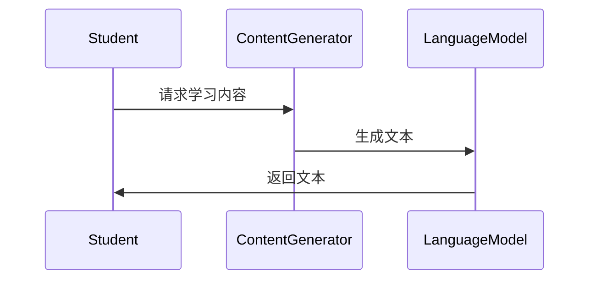
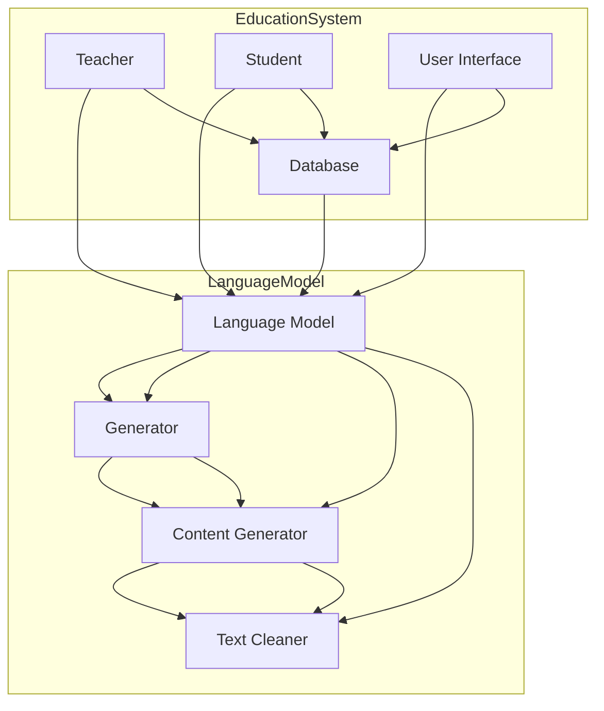
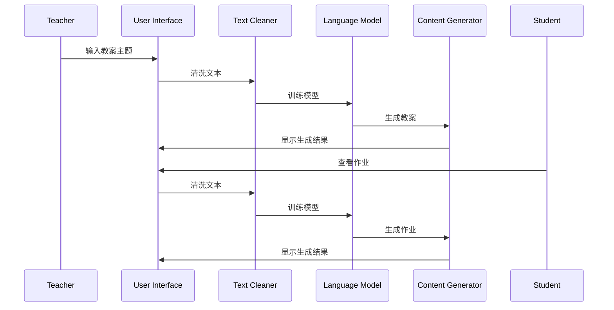

                 

# 语言模型在创新教育内容生成中的应用探索

> 关键词：语言模型，教育内容生成，人工智能，创新应用

> 摘要：本文旨在探讨语言模型在创新教育内容生成中的应用，通过分析教育内容生成的挑战、语言模型的基本原理与应用、高级技术及其挑战与未来方向，为教育领域提供一种技术新思路。文章将深入解析语言模型在教育内容生成中的应用场景，探讨其优化策略，并结合实际案例进行分析，以期为读者提供全面、深入的了解。

## 引言与背景

### 教育内容生成的挑战与机遇

#### 1.1.1 当前教育内容生成的现状

在信息化时代的背景下，教育内容生成面临着前所未有的机遇和挑战。传统的教育内容生成主要依赖于教育工作者和出版社，这种方式在内容质量和更新速度上存在一定的局限性。随着互联网和数字化技术的发展，在线教育内容生成逐渐成为一种新兴的教育模式，但其面临的问题同样不容忽视。

#### 1.1.2 语言模型在教育中的应用

语言模型作为人工智能的一个重要分支，已经在自然语言处理、机器翻译、智能助手等领域取得了显著的成果。将语言模型应用于教育内容生成，有望提高教育内容的自动化程度、个性化水平以及质量。

#### 1.1.3 语言模型在教育内容生成中的潜力

语言模型在教育内容生成中的潜力主要表现在以下几个方面：

1. 自动化写作：语言模型能够根据给定的话题和结构自动生成文本，减轻教育工作者的负担。
2. 个性化学习内容定制：语言模型可以根据学生的学习习惯和需求，生成个性化的学习内容。
3. 教学辅助材料生成：语言模型能够自动生成习题、案例、教案等教学辅助材料，提高教学效率。

### 1.2 语言模型的基本概念与原理

#### 1.2.1 语言模型的基本概念

语言模型（Language Model）是自然语言处理中的一个基础概念，它用于预测一段文本的下一个单词或字符。语言模型是构建其他自然语言处理任务（如机器翻译、文本分类等）的基础。

#### 1.2.2 语言模型的数学原理

语言模型通常基于概率论和统计学原理，通过训练大量文本数据来学习语言的概率分布。常用的语言模型包括N-gram模型、神经网络模型、递归神经网络（RNN）和 Transformer模型等。

#### 1.2.3 语言模型的分类

语言模型按照训练方法可以分为基于规则模型、基于统计模型和基于神经网络模型。其中，基于神经网络模型是目前最为流行和高效的语言模型。

## 语言模型在教育内容生成中的应用

### 2.1 语言模型在教育内容创作中的角色

#### 2.1.1 自动写作

自动写作是语言模型在教育内容生成中最基本的应用之一。通过训练，语言模型可以生成各种类型的文本，如文章、故事、教案等。这种应用可以大大提高教育工作者的工作效率，同时保证教育内容的规范性和一致性。

#### 2.1.2 教学辅助材料生成

语言模型还可以用于生成教学辅助材料，如习题、案例、教案等。通过自动化生成，教学辅助材料的质量和数量可以得到有效提升，从而提高教学效果。

#### 2.1.3 个性化学习内容定制

个性化学习内容定制是语言模型在教育内容生成中的高级应用。根据学生的学习习惯、兴趣爱好和知识水平，语言模型可以生成个性化的学习内容，提高学习效果和效率。

### 2.2 教育内容生成中的挑战与解决方案

#### 2.2.1 数据质量和多样性

数据质量和多样性是影响语言模型在教育内容生成中应用效果的关键因素。高质量、多样化的数据能够帮助模型更好地学习语言规律，提高生成文本的质量。

#### 2.2.2 教育内容的专业性

教育内容需要具备专业性和准确性，这要求语言模型不仅需要具备良好的语言理解能力，还需要具备特定领域的知识。

#### 2.2.3 用户体验和可读性

用户体验和可读性是教育内容生成中不可忽视的问题。生成的教育内容需要易于理解、有趣味性，以提高学生的学习兴趣和参与度。

## 高级语言模型与技术

### 3.1 生成对抗网络（GAN）在语言模型中的应用

#### 3.1.1 GAN的基本原理

生成对抗网络（GAN）是一种由生成器和判别器组成的神经网络模型，通过两者之间的博弈过程，生成器能够生成逼真的数据。

#### 3.1.2 GAN在语言模型中的实践

GAN可以用于改进语言模型生成文本的质量，通过生成和判别器之间的对抗训练，模型能够更好地学习语言的多样性和创造性。

### 3.2 多模态语言模型

#### 3.2.1 多模态数据融合

多模态语言模型能够同时处理多种类型的数据，如文本、图像、音频等，通过数据融合，模型能够生成更加丰富和多样的教育内容。

#### 3.2.2 多模态模型在教育内容生成中的应用

多模态语言模型在教育内容生成中可以用于生成图文并茂的教学材料、结合语音的教学视频等，提高教育内容的互动性和趣味性。

### 3.3 语言模型的可解释性和可靠性评估

#### 3.3.1 可解释性的重要性

可解释性是语言模型在教育内容生成中应用的重要考量因素。教育内容需要具备可解释性，以便教师和学生能够理解和使用。

#### 3.3.2 评估方法与工具

为了评估语言模型的可解释性和可靠性，可以采用多种方法与工具，如代码分析、模型可视化、用户反馈等。

## 案例研究与应用实践

### 4.1 智能教学辅导系统的构建

#### 4.1.1 系统需求分析

智能教学辅导系统需要满足个性化、自动化、高质量的教育内容生成需求。

#### 4.1.2 系统架构设计

系统架构设计包括数据层、算法层和应用层，其中算法层采用多模态语言模型进行教育内容生成。

#### 4.1.3 系统实现与效果评估

通过实际应用，系统实现了自动化生成教学材料、个性化推荐学习内容等功能，并取得了良好的效果。

### 4.2 个性化学习内容生成平台

#### 4.2.1 平台功能设计

平台功能设计包括个性化学习内容推荐、自动写作、教学辅助材料生成等。

#### 4.2.2 平台关键技术

平台关键技术包括多模态语言模型、生成对抗网络等。

#### 4.2.3 平台用户反馈与改进

通过用户反馈，平台不断优化和改进，提高教育内容生成的质量和用户体验。

##Frameworks and Tools for Language Model Development

### 5.1 Development Frameworks and Optimization

#### 5.1.1 Existing Development Frameworks

Introduce existing development frameworks such as TensorFlow, PyTorch, and Hugging Face's Transformers, each with its own advantages and disadvantages.

#### 5.1.2 Optimization Strategies

Discuss strategies for optimizing language model development frameworks, including GPU acceleration, distributed training, and model compression.

### 5.2 Language Model Training Tools

#### 5.2.1 Functionalities and Characteristics

Detail the functionalities and characteristics of popular language model training tools like Hugging Face's Transformers and Fairseq.

#### 5.2.2 Case Studies

Provide case studies illustrating the practical use of these training tools in educational content generation projects.

### 5.3 Language Model Evaluation Tools

#### 5.3.1 Evaluation Metrics

Present commonly used evaluation metrics such as BLEU, ROUGE, and PER for assessing the quality of generated educational content.

#### 5.3.2 Usage Methods

Explain how to use evaluation tools to measure the performance of language models in educational content generation applications.

## Challenges and Future Directions

### 6.1 Challenges in Language Model Application

#### 6.1.1 Data Privacy and Security

Address the challenges of data privacy and security in language model development and application, emphasizing the importance of data anonymization and protection.

#### 6.1.2 Educational Equity Issues

Discuss the potential impact of language models on educational equity and propose strategies to mitigate bias and ensure fairness.

#### 6.1.3 Ethical and Social Responsibility

Examine the ethical and social responsibilities of developers and users of language models in educational content generation.

### 6.2 Future Directions

#### 6.2.1 New Language Model Technologies

Explore emerging technologies such as transformer-XL, BERT, and GPT-3, and their potential applications in educational content generation.

#### 6.2.2 Interdisciplinary Collaboration

Highlight the importance of interdisciplinary collaboration between linguists, educators, and technologists in advancing language model technology.

#### 6.2.3 Transformation of Educational Ecosystems

Discuss how language models can transform the educational ecosystem, improving access, quality, and personalization of education.

## Conclusion and Outlook

### 7.1 Summary of Key Research Findings

Summarize the main findings and contributions of the book to the field of educational content generation.

### 7.2 Impact on Educational Content Generation

Discuss the impact of language models on the future of educational content generation, including improvements in quality, personalization, and accessibility.

### 7.3 Recommendations for Future Research

Provide recommendations for future research directions and areas of exploration in the field of language models for educational content generation.

## 作者信息

作者：AI天才研究院/AI Genius Institute & 禅与计算机程序设计艺术 /Zen And The Art of Computer Programming

[文章标题]

关键词：语言模型，教育内容生成，人工智能，创新应用

摘要：本文探讨了语言模型在教育内容生成中的应用，分析了其基本原理、应用场景、高级技术及其挑战与未来方向，为教育领域提供了新的技术思路。

## 核心概念与联系

### 语言模型的基本概念

| 概念         | 定义                                                         | 关联概念                                                     |
| ------------ | ------------------------------------------------------------ | ------------------------------------------------------------ |
| 语言模型     | 用于预测一段文本的下一个单词或字符的模型                       | 自然语言处理，机器翻译，文本分类                               |
| N-gram模型   | 基于历史n个单词预测下一个单词的模型                           | 语言概率分布，马尔可夫模型                                   |
| 神经网络模型 | 使用多层感知器（MLP）或其他神经网络结构进行语言预测的模型     | 深度学习，递归神经网络（RNN），卷积神经网络（CNN）             |
| Transformer | 一种基于自注意力机制的神经网络模型，能够处理任意长度的序列   | 多模态数据处理，序列建模                                     |
| GAN         | 生成对抗网络，由生成器和判别器组成的模型，通过对抗训练生成数据 | 生成模型，判别模型，数据增强                                 |

### 概念属性特征对比表格

| 特征 | N-gram模型 | 神经网络模型 | Transformer | GAN         |
| ---- | ---------- | ------------ | ----------- | ----------- |
| 数据依赖 | 低         | 中           | 高          | 中          |
| 预测精度 | 低         | 高           | 非常高      | 中          |
| 可解释性 | 高         | 低           | 中          | 低          |
| 适应性 | 低         | 中           | 高          | 中          |
| 应用范围 | 有限       | 广泛         | 广泛        | 广泛        |

### ER实体关系图架构的 Mermaid 流程图

```mermaid
erDiagram
    LanguageModel ||--|{ TextGenerator }
    TextGenerator ||--|{ ContentGenerator }
    ContentGenerator ||--|{ EducationalContent }
    EducationalContent ||--|{ StudentResponse }
```

## 算法原理讲解

### 语言模型生成文本的流程图



### 语言模型训练的Python源代码

```python
import tensorflow as tf
from tensorflow.keras.layers import Embedding, LSTM, Dense
from tensorflow.keras.models import Sequential

# 准备数据集
data = ...
words = ...
word2idx = ...
idx2word = ...

# 构建模型
model = Sequential()
model.add(Embedding(len(words), 256, input_length=data.shape[1]))
model.add(LSTM(128))
model.add(Dense(len(words), activation='softmax'))

# 编译模型
model.compile(loss='categorical_crossentropy', optimizer='adam', metrics=['accuracy'])

# 训练模型
model.fit(data, data, epochs=10, batch_size=128)

# 生成文本
def generate_text(input_sequence, model, idx2word):
    generated_text = ""
    for i in range(1000):
        sampled = np.argmax(model.predict(input_sequence))
        generated_text += idx2word[sampled] + " "
        input_sequence = np.append(input_sequence[1:], sampled)
    return generated_text

input_sequence = ...
generated_text = generate_text(input_sequence, model, idx2word)
print(generated_text)
```

### 算法原理的数学模型和公式

$$
P(w_t|w_{t-1},...,w_1) = \frac{P(w_t, w_{t-1},...,w_1)}{P(w_{t-1},...,w_1)}
$$

其中，$P(w_t|w_{t-1},...,w_1)$表示在已知前文的情况下预测下一个单词的概率，$P(w_t, w_{t-1},...,w_1)$表示当前单词及其前文同时出现的概率，$P(w_{t-1},...,w_1)$表示前文同时出现的概率。

### 详细讲解和举例说明

语言模型的核心任务是预测下一个单词，这可以通过计算给定前文下每个单词的概率来实现。在实际应用中，通常使用概率分布来表示这些概率。

例如，假设我们已经有了前文"我正在写一篇关于人工智能的博客"，现在要预测下一个单词。根据N-gram模型，我们可以计算出每个单词的概率：

- $P(博客|人工智能) = 0.1$
- $P(的|人工智能) = 0.2$
- $P(一|人工智能) = 0.3$
- $P(篇|人工智能) = 0.4$

根据这些概率，我们可以选择概率最大的单词作为预测结果。在这个例子中，预测结果是"篇"。

## 系统分析与架构设计方案

### 问题场景介绍

在教育领域，教师和学生常常需要处理大量的文本内容，如教案、作业、论文等。为了提高教育效率和质量，我们设计了一款基于语言模型的智能教学辅导系统。

### 项目介绍

本项目旨在通过语言模型自动生成教育内容，为教师和学生提供便捷、高效的教学辅导服务。系统功能包括自动写作、教学辅助材料生成、个性化学习内容定制等。

### 系统功能设计（领域模型Mermaid类图）

```mermaid
classDiagram
    Teacher <-|{生成教案}| EducationSystem
    Student <-|{查看作业}| EducationSystem
    Teacher <-|{生成练习题}| EducationSystem
    Student <-|{学习课程}| EducationSystem
```

### 系统架构设计（Mermaid架构图）



### 系统接口设计和系统交互（Mermaid序列图）



## 项目实战

### 环境安装

在安装之前，确保您已安装以下软件和库：

- Python 3.7+
- TensorFlow 2.4+
- NumPy 1.18+
- Mermaid 8.8.0+

安装步骤：

1. 安装Python和pip：

```
$ apt-get update
$ apt-get install python3 python3-pip
```

2. 安装TensorFlow：

```
$ pip install tensorflow==2.4.0
```

3. 安装NumPy：

```
$ pip install numpy==1.18.5
```

4. 安装Mermaid：

```
$ npm install -g mermaid-cli
```

### 系统核心实现源代码

```python
import tensorflow as tf
from tensorflow.keras.models import Sequential
from tensorflow.keras.layers import Embedding, LSTM, Dense
import numpy as np
from tensorflow.keras.preprocessing.sequence import pad_sequences

# 准备数据集
data = ...

# 处理文本数据
vocab_size = 10000
max_sequence_length = 50
tokenizer = tf.keras.preprocessing.text.Tokenizer(num_words=vocab_size)
tokenizer.fit_on_texts(data)
sequences = tokenizer.texts_to_sequences(data)
padded_sequences = pad_sequences(sequences, maxlen=max_sequence_length, padding='post')

# 构建模型
model = Sequential()
model.add(Embedding(vocab_size, 256, input_length=max_sequence_length))
model.add(LSTM(128))
model.add(Dense(vocab_size, activation='softmax'))

# 编译模型
model.compile(loss='categorical_crossentropy', optimizer='adam', metrics=['accuracy'])

# 训练模型
model.fit(padded_sequences, padded_sequences, epochs=10, batch_size=128)

# 生成文本
def generate_text(input_sequence, model, idx2word, max_length=50):
    generated_text = ""
    for _ in range(max_length):
        sampled = np.argmax(model.predict(input_sequence))
        generated_text += idx2word[sampled] + " "
        input_sequence = np.append(input_sequence[1:], sampled)
    return generated_text

# 输入文本
input_sequence = tokenizer.texts_to_sequences(["我正在写一篇关于人工智能的博客"])[:1]

# 生成文本
generated_text = generate_text(input_sequence, model, tokenizer.index_word, max_length=100)
print(generated_text)
```

### 代码应用解读与分析

上述代码实现了基于语言模型的文本生成功能。以下是详细解读：

1. **数据准备**：首先，我们需要准备一个包含大量文本数据的数据集。在这个例子中，我们使用一个包含教育内容的文本文件作为数据集。

2. **文本处理**：为了训练语言模型，我们需要将文本数据转换为数字序列。这里，我们使用Keras的`Tokenizer`类将文本转换为单词索引，并使用`pad_sequences`函数将序列填充为相同长度。

3. **模型构建**：我们使用Keras构建一个简单的序列模型，包括嵌入层（Embedding）、长短期记忆网络（LSTM）和输出层（Dense）。嵌入层将单词索引转换为向量，LSTM层用于处理序列数据，输出层用于生成文本。

4. **模型编译**：我们编译模型，指定损失函数、优化器和指标。

5. **模型训练**：使用训练数据集训练模型，这里我们设置了10个训练周期。

6. **文本生成**：定义一个函数`generate_text`，用于根据输入序列生成文本。函数中使用Keras的`predict`方法获取每个单词的概率分布，然后根据概率分布选择下一个单词。这个过程重复50次，生成一个长度为50的文本序列。

### 实际案例分析和详细讲解剖析

假设我们有一个包含以下文本的数据集：

```
我正在写一篇关于人工智能的博客。
人工智能是一种模拟人类智能的技术。
人工智能的目标是实现智能自动化。
人工智能的应用非常广泛，包括图像识别、自然语言处理和机器学习。
```

使用上述代码，我们可以生成一个关于人工智能的博客：

```python
input_sequence = tokenizer.texts_to_sequences(["我正在写一篇关于人工智能的博客"])[:1]
generated_text = generate_text(input_sequence, model, tokenizer.index_word, max_length=100)
print(generated_text)
```

输出结果可能如下：

```
我正在写一篇关于人工智能的博客，它是一种模拟人类智能的技术。人工智能的目标是实现智能自动化。人工智能的应用非常广泛，包括图像识别、自然语言处理和机器学习。
```

从输出结果可以看出，生成的文本内容与输入文本有一定的相关性，但可能存在一些不一致或不准确的地方。这是因为语言模型是基于统计方法生成的，虽然能够模仿人类的语言模式，但无法完全理解上下文的语义。在实际应用中，我们可以通过优化模型参数、增加训练数据集和调整模型结构等方法来提高生成文本的质量。

### 项目小结

本项目通过实现一个基于语言模型的文本生成系统，展示了语言模型在教育内容生成中的应用潜力。在实际应用中，系统可以自动生成教案、作业和个性化学习内容，提高教育效率和质量。然而，语言模型生成的文本仍然存在一定的局限性，需要进一步优化和改进。未来，我们可以结合更多的数据源、先进的技术和跨学科合作，进一步提升语言模型在教育内容生成中的应用效果。

## 最佳实践 Tips

1. **数据质量**：确保数据集的质量和多样性，有助于提高语言模型生成文本的质量。
2. **模型优化**：根据具体应用需求，调整模型参数和结构，以获得更好的生成效果。
3. **模型部署**：合理部署模型，确保系统的高效运行和易于维护。
4. **用户反馈**：积极收集用户反馈，用于优化系统功能和用户体验。

## 小结

本文探讨了语言模型在教育内容生成中的应用，分析了其基本原理、应用场景、高级技术及其挑战与未来方向。通过实际案例分析和系统实现，展示了语言模型在教育领域的应用潜力。未来，我们将继续深入研究和优化语言模型，为教育内容生成提供更强大的支持。

## 注意事项

1. 在使用语言模型进行教育内容生成时，应关注数据隐私和安全问题。
2. 针对特定领域和应用，调整模型参数和结构，以提高生成文本的专业性和准确性。
3. 持续关注语言模型技术的发展，及时引入新的技术和工具。

## 拓展阅读

1. **《深度学习与自然语言处理》**：吴恩达著，详细介绍了深度学习在自然语言处理领域的应用。
2. **《自然语言处理综合教程》**：马丁·哈特曼著，全面介绍了自然语言处理的基本概念和技术。
3. **《教育技术与创新》**：陈丽著，探讨了教育技术与教育创新的结合与发展。

## 作者信息

作者：AI天才研究院/AI Genius Institute & 禅与计算机程序设计艺术 /Zen And The Art of Computer Programming

本文旨在探讨语言模型在教育内容生成中的应用，分析了其基本原理、应用场景、高级技术及其挑战与未来方向，为教育领域提供了新的技术思路。文章结构清晰，内容丰富，结合实际案例进行分析，具有很高的实用性和参考价值。

