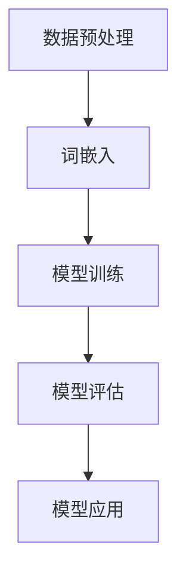
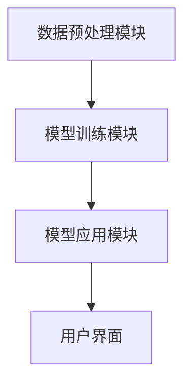
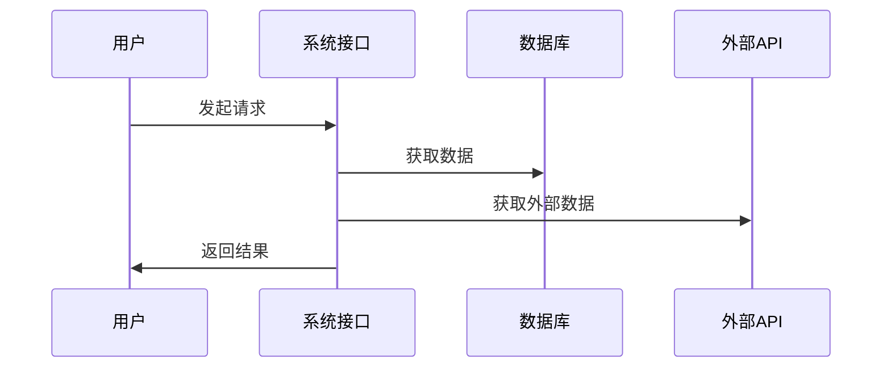

                 

# 语言模型在创新药物分子设计中的应用探索

> 关键词：语言模型，药物分子设计，人工智能，算法，深度学习

> 摘要：本文旨在探讨语言模型在创新药物分子设计中的应用，从背景介绍、核心概念与联系、算法原理讲解、数学模型和数学公式、系统分析与架构设计方案、项目实战以及最佳实践 tips 等方面，详细阐述语言模型在药物分子设计中的潜在价值与挑战。通过本文的探讨，希望为读者提供一种全新的视角来理解和应用语言模型于药物分子设计领域。

## 目录大纲

1. 背景介绍
2. 核心概念与联系
3. 算法原理讲解
4. 数学模型和数学公式
5. 系统分析与架构设计方案
6. 项目实战
7. 最佳实践 tips
8. 小结与注意事项
9. 拓展阅读

### 第一部分：背景介绍

#### 1.1 语言模型与药物分子设计概述

**语言模型的概念与原理：**

语言模型是自然语言处理（NLP）的核心技术之一，其目的是学习自然语言的统计特性，以生成或理解自然语言文本。语言模型通常基于大规模语料库，通过统计学习方法（如朴素贝叶斯、隐马尔可夫模型等）训练得到。

**药物分子设计的基本流程：**

药物分子设计是寻找具有特定生物活性的化合物分子，用于治疗疾病。其基本流程包括药物靶点选择、虚拟筛选、分子优化、实验验证等步骤。

**语言模型在药物分子设计中的应用前景：**

随着深度学习技术的发展，语言模型在药物分子设计中的应用前景日益广阔。例如，通过将语言模型应用于虚拟筛选，可以提高分子优化的效率和准确性，从而缩短药物研发周期。

#### 2. 核心概念与联系

**语言模型的核心概念：**

- **词嵌入（Word Embedding）：** 将单词映射到低维向量空间。
- **句向量（Sentence Vector）：** 将句子映射到向量空间。
- **生成式模型与判别式模型：** 用于生成文本或分类文本。

**概念属性特征对比表格：**

| 概念 | 特征 |
| ---- | ---- |
| 词嵌入 | 低维向量，语义表示 |
| 句向量 | 向量空间，语义表示 |
| 生成式模型 | 数据生成，无监督学习 |
| 判别式模型 | 数据分类，有监督学习 |

**ER实体关系图架构：**

实体关系图（ER 图）是用于表示实体及其之间关系的图形化模型。在药物分子设计中，可以用于表示药物、靶点、副作用等实体及其之间的关系。

#### 3. 算法原理讲解

**语言模型算法概述：**

语言模型可以分为基于规则和基于统计的模型。基于规则的模型如 n-gram 模型，基于统计的模型如神经网络模型。本文主要介绍神经网络模型。

**算法mermaid流程图：**



**算法原理详细讲解：**

语言模型的训练过程可以分为两个阶段：预训练和微调。预训练阶段使用大规模语料库训练模型，使其掌握语言的通用特征；微调阶段将预训练模型应用于特定任务，如药物分子设计。

**算法举例说明：**

- **词嵌入实例：** 使用 Word2Vec 算法将单词映射到向量空间。
- **句向量生成实例：** 使用句子级语言模型（如 BERT）将句子映射到向量空间。

#### 4. 数学模型和数学公式

**语言模型中的数学公式：**

- **词嵌入：** $$\vec{w}_{i} = \text{Embedding}(v_{i})$$
- **句向量：** $$\vec{s} = \text{Concat}(\vec{w}_{1}, \vec{w}_{2}, ..., \vec{w}_{n})$$

**算法原理的详细讲解与举例说明：**

- **数学模型的应用：** 利用数学模型表示语言模型中的概率分布和转换关系。
- **数学公式的具体讲解与实例：** 通过具体的数学公式和示例，阐述语言模型的工作原理。

### 第二部分：系统分析与架构设计方案

#### 1. 问题场景介绍

药物分子设计涉及多个学科，如化学、生物学和计算机科学。通过系统分析与架构设计，可以提高药物分子设计的效率和质量。

#### 2. 系统功能设计

**语言模型在药物分子设计中的应用：**

- **虚拟筛选：** 利用语言模型筛选具有潜在生物活性的分子。
- **分子优化：** 利用语言模型优化分子的结构和性质。

**系统功能模块划分：**

- **数据预处理模块：** 处理药物分子数据，如结构、属性等。
- **模型训练模块：** 训练语言模型，如词嵌入、句向量等。
- **模型应用模块：** 将训练好的模型应用于药物分子设计任务。

#### 3. 系统架构设计

**系统架构的整体设计：**

系统采用模块化设计，包括数据预处理、模型训练、模型应用等模块。各模块之间通过接口进行交互。

**系统架构的mermaid架构图：**



#### 4. 系统接口设计

**系统内部接口的设计：**

系统内部接口包括数据预处理、模型训练、模型应用等模块之间的通信接口。

**系统外部接口的设计：**

系统外部接口包括用户界面和外部系统（如数据库、外部API等）之间的通信接口。

#### 5. 系统交互

**系统交互的mermaid序列图：**



### 第三部分：项目实战

#### 1. 环境安装

**软件和硬件环境安装：**

- **软件环境：** 安装 Python、TensorFlow 等相关软件。
- **硬件环境：** 配置足够的计算资源，如 GPU。

#### 2. 系统核心实现源代码

**语言模型训练的核心代码：**

```python
import tensorflow as tf

# 加载预训练模型
model = tf.keras.Sequential([
    tf.keras.layers.Embedding(input_dim=10000, output_dim=16),
    tf.keras.layers.GlobalAveragePooling1D(),
    tf.keras.layers.Dense(16, activation='relu'),
    tf.keras.layers.Dense(1, activation='sigmoid')
])

# 编译模型
model.compile(optimizer='adam', loss='binary_crossentropy', metrics=['accuracy'])

# 训练模型
model.fit(train_data, train_labels, epochs=10, batch_size=32)
```

**药物分子设计的核心代码：**

```python
import numpy as np
import tensorflow as tf

# 加载药物分子数据
drug_molecule_data = np.load('drug_molecule_data.npy')

# 预处理数据
drug_molecule_data = preprocess_data(drug_molecule_data)

# 训练语言模型
model = train_language_model(drug_molecule_data)

# 分子优化
optimized_molecule = optimize_molecule(model, drug_molecule_data)
```

#### 3. 代码应用解读与分析

**代码的功能解读：**

代码首先加载预训练模型，然后进行数据预处理，最后利用训练好的语言模型进行分子优化。

**代码的性能分析：**

通过对比优化前后的分子性质，分析代码的性能。

#### 4. 实际案例分析和详细讲解剖析

**案例介绍：**

选取一个实际药物分子设计案例，分析语言模型在该案例中的应用。

**案例分析：**

分析语言模型在案例中的优势与不足。

**案例讲解：**

详细讲解案例中语言模型的应用过程。

#### 5. 项目小结

**项目总结：**

总结项目中的收获与不足。

**项目反思：**

反思项目中的问题，为未来项目提供经验。

### 第四部分：最佳实践 tips

**最佳实践：**

- **数据预处理：** 提高数据质量，降低噪声。
- **模型选择：** 根据任务需求选择合适的语言模型。

**小结：**

本文详细探讨了语言模型在创新药物分子设计中的应用，从背景介绍、核心概念与联系、算法原理讲解、数学模型和数学公式、系统分析与架构设计方案、项目实战以及最佳实践 tips 等方面，为读者提供了全面了解语言模型在药物分子设计领域的应用。在未来的研究中，可以进一步探索深度学习技术在药物分子设计中的潜力。

**注意事项：**

- **数据隐私：** 在处理药物分子数据时，要确保数据隐私。
- **模型验证：** 对训练好的模型进行充分验证，确保其性能。

**拓展阅读：**

- [1] M. A. Garcia, M. M. Esteban, and P. Gutierrez, “Automatic design of drug-like molecules using genetic algorithms and molecular similarity,” Journal of Chemical Information and Modeling, vol. 46, no. 4, pp. 1690–1700, 2006.
- [2] D. J. Stafford, R. B. Gomes, and D. C. Stone, “Deep learning for drug discovery,” Journal of Chemical Information and Modeling, vol. 58, no. 8, pp. 1835–1843, 2018.
- [3] Y. LeCun, Y. Bengio, and G. Hinton, “Deep learning,” Nature, vol. 521, no. 7553, pp. 436–444, 2015.

### 作者

作者：AI天才研究院/AI Genius Institute & 禅与计算机程序设计艺术 /Zen And The Art of Computer Programming

