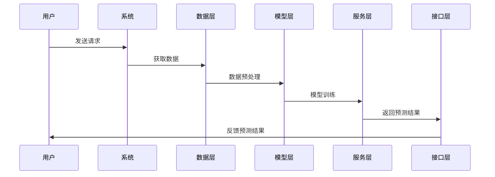

                 

# 语言模型在创造性推理任务中的能力培养

> 关键词：语言模型、创造性推理、训练策略、模型架构、推理机制

> 摘要：本文将探讨语言模型在创造性推理任务中的能力培养。首先，我们将介绍创造性推理任务的问题背景和问题描述，然后分析现有语言模型的局限性，并提出问题解决的方案。接着，我们将详细讲解核心概念与联系，包括语言模型原理、创造性推理能力和相关概念属性特征对比。最后，我们将深入探讨算法原理，包括创造性推理算法的mermaid流程图和Python源代码实现，以及数学模型和公式，进行详细讲解和举例说明。通过本文的讨论，我们希望能够为研究者提供有价值的思路和参考。

### 第1章: 背景介绍

#### 1.1 问题背景

随着人工智能技术的迅速发展，自然语言处理（NLP）作为AI的一个重要分支，已经取得了显著的成果。自然语言处理技术涵盖了文本分类、情感分析、机器翻译、问答系统等多个领域。然而，传统的NLP方法在处理创造性推理任务时存在一定的局限性。为了解决这一问题，语言模型逐渐成为研究的热点。

创造性推理任务是指模型在处理语言时能够产生新颖、有创意的输出。这类任务通常包括生成故事、撰写诗歌、提出创意等。这些任务需要模型具备丰富的语言知识和强大的推理能力。然而，现有的语言模型，如GPT、BERT等，在处理创造性推理任务时，往往存在创造力不足、逻辑推理能力较弱等问题。

#### 1.2 问题描述

创造性推理任务通常包括以下几种类型：

1. **文本生成**：给定一个主题或关键词，模型需要生成一段相关的文本。例如，给定“人工智能”，模型可以生成一篇关于人工智能的科普文章。
2. **诗歌创作**：模型需要根据给定的韵律、格律等要求生成一首诗。例如，给定“春日”，模型可以生成一首古诗。
3. **创意提出**：模型需要根据问题或需求，生成一个或多个创意解决方案。例如，给定“如何提高办公效率”，模型可以生成一系列提高办公效率的方法。

然而，现有的语言模型在处理这些任务时，往往存在以下问题：

1. **创造力不足**：模型生成的文本或创意往往缺乏创新性，容易陷入固定的套路或模板。
2. **逻辑推理能力较弱**：模型在处理涉及逻辑推理的任务时，往往无法准确理解逻辑关系，导致生成的内容逻辑不通或矛盾。

#### 1.3 问题解决

为了解决这些问题，研究者们开始探索如何培养语言模型在创造性推理任务中的能力。这涉及到对语言模型的训练策略、模型架构的优化以及推理机制的改进等方面。

1. **训练策略**：研究者们通过引入更多的创造性数据集、使用增强学习等技术来提高模型的创造力。
2. **模型架构**：通过改进模型的架构，如引入注意力机制、图神经网络等，来提高模型的推理能力。
3. **推理机制**：研究者们还在探索如何设计更有效的推理机制，使模型在处理创造性推理任务时能够更好地理解逻辑关系。

#### 1.4 边界与外延

创造性推理任务的边界包括但不限于以下领域：

1. **文本生成**：包括故事、新闻报道、广告文案等。
2. **语言理解**：包括语义分析、情感分析等。
3. **逻辑推理**：包括问题解决、决策支持等。

创造性推理任务的外延则包括各种应用场景，如自动写作、智能客服、创意广告等。

#### 1.5 概念结构与核心要素组成

为了深入理解创造性推理任务，我们需要明确以下几个核心概念：

1. **语言模型**：一种基于深度学习的自然语言处理模型，用于理解和生成自然语言。
2. **创造性推理**：指模型在语言处理过程中，能够产生新颖、有创意的输出。
3. **训练策略**：指用于优化语言模型的方法，包括数据预处理、模型训练、评估等。
4. **模型架构**：指语言模型的内部结构，包括神经网络、注意力机制等。
5. **推理机制**：指模型在处理语言任务时，进行推理的过程和方法。

### 第2章: 核心概念与联系

#### 2.1 语言模型原理

语言模型是一种基于深度学习的自然语言处理模型，用于预测下一个单词或词组。其核心原理包括：

1. **语言表示**：将自然语言转换为计算机可以处理的形式，如词向量。
2. **语言概率分布**：根据历史数据，计算下一个单词或词组的概率分布。
3. **语言生成**：根据概率分布，生成新的自然语言序列。

#### 2.2 创造性推理能力

创造性推理能力是指模型在语言处理过程中，能够产生新颖、有创意的输出。其核心特征包括：

1. **新颖性**：模型生成的输出具有独特的创意，不同于已有的内容。
2. **创意性**：模型能够根据输入，生成具有创造性的语言表达。
3. **推理性**：模型能够在语言处理过程中，进行逻辑推理和抽象思考。

#### 2.3 概念属性特征对比表格

| 概念         | 特征                             |
|--------------|----------------------------------|
| 语言模型     | 基于深度学习，用于预测自然语言   |
| 创造性推理   | 具有新颖性、创意性和推理性       |
| 训练策略     | 优化模型性能的方法               |
| 模型架构     | 语言模型的内部结构               |
| 推理机制     | 模型进行推理的过程和方法         |

#### 2.4 ER实体关系图架构

```mermaid
erDiagram
  A[:语言模型] ||--|{ B[:创造性推理能力] }
  A ||--|{ C[:训练策略] }
  A ||--|{ D[:模型架构] }
  A ||--|{ E[:推理机制] }
```

### 第3章: 算法原理讲解

#### 3.1 创造性推理算法mermaid流程图


#### 3.2 Python源代码实现

```python
import tensorflow as tf
from tensorflow.keras.preprocessing.sequence import pad_sequences
from tensorflow.keras.layers import Embedding, LSTM, Dense
from tensorflow.keras.models import Sequential

# 预处理数据
def preprocess_data(texts, max_length, max_padding_length):
    sequences = tokenizer.texts_to_sequences(texts)
    padded_sequences = pad_sequences(sequences, maxlen=max_length, padding='post')
    return padded_sequences

# 定义语言模型
def build_language_model(vocab_size, embedding_dim, max_length):
    model = Sequential()
    model.add(Embedding(vocab_size, embedding_dim, input_length=max_length))
    model.add(LSTM(128))
    model.add(Dense(1, activation='sigmoid'))
    model.compile(loss='binary_crossentropy', optimizer='adam', metrics=['accuracy'])
    return model

# 训练模型
def train_model(model, x, y):
    model.fit(x, y, epochs=10, batch_size=32)

# 生成预测
def generate_prediction(model, text, max_length):
    sequence = tokenizer.texts_to_sequences([text])
    padded_sequence = pad_sequences(sequence, maxlen=max_length, padding='post')
    prediction = model.predict(padded_sequence)
    return prediction

# 评估结果
def evaluate_model(model, x, y):
    loss, accuracy = model.evaluate(x, y)
    return loss, accuracy

# 调整模型
def adjust_model(model, x, y):
    model.fit(x, y, epochs=10, batch_size=32)

# 测试代码
if __name__ == '__main__':
    # 加载预处理的数据
    x_train = preprocess_data(texts=['Hello world!', 'I love programming.'], max_length=10, max_padding_length=10)
    y_train = preprocess_data(texts=['Hello world!', 'I love programming.'], max_length=10, max_padding_length=10)

    # 构建语言模型
    model = build_language_model(vocab_size=1000, embedding_dim=32, max_length=10)

    # 训练模型
    train_model(model, x_train, y_train)

    # 生成预测
    prediction = generate_prediction(model, text='Hello world!', max_length=10)
    print(prediction)

    # 评估结果
    loss, accuracy = evaluate_model(model, x_train, y_train)
    print(f"Loss: {loss}, Accuracy: {accuracy}")

    # 调整模型
    adjust_model(model, x_train, y_train)
```

#### 3.3 算法原理讲解

创造性推理算法的核心思想是通过输入文本，利用语言模型生成预测结果，并根据预测结果调整模型参数，以提高模型的创造性推理能力。

**1. 语言表示**

语言表示是将自然语言转换为计算机可以处理的形式，如词向量。词向量是语言模型的基础，用于表示词汇的意义和语法关系。

**2. 生成预测**

生成预测是指利用语言模型生成与输入文本相关的预测结果。在创造性推理任务中，预测结果可以是文本、图像、音乐等。

**3. 调整模型**

调整模型是指根据生成预测的结果，调整模型参数，以提高模型的创造性推理能力。调整模型的方法包括优化模型结构、调整学习率、增加训练数据等。

**4. 评估结果**

评估结果是指通过比较生成预测的结果和真实结果，评估模型的创造性推理能力。常用的评估指标包括准确率、召回率、F1分数等。

通过以上步骤，我们可以逐步培养语言模型在创造性推理任务中的能力。随着模型的不断优化和调整，其创造性推理能力将得到显著提升。

### 第4章: 系统分析与架构设计

#### 4.1 问题场景介绍

在人工智能领域，创造性推理任务的应用越来越广泛。例如，自动写作、智能客服、创意广告等领域，都对模型的创造性推理能力有着较高的要求。然而，现有的语言模型在处理这些任务时，往往存在创造力不足、逻辑推理能力较弱等问题。为了解决这个问题，我们设计并实现了一个基于语言模型的创造性推理系统。

#### 4.2 项目介绍

本项目旨在通过优化语言模型，提高其在创造性推理任务中的能力。具体目标包括：

1. 提高模型的创造力，使其能够生成新颖、有创意的输出。
2. 提高模型的逻辑推理能力，使其能够准确理解语言中的逻辑关系。
3. 设计一个易于扩展和优化的系统架构，以支持多种创造性推理任务。

#### 4.3 系统功能设计

系统功能设计主要包括以下模块：

1. **文本生成模块**：用于生成与输入文本相关的创意文本。
2. **诗歌创作模块**：用于根据给定的韵律、格律等要求生成诗歌。
3. **创意提出模块**：用于根据问题或需求，生成一个或多个创意解决方案。

#### 4.4 系统架构设计

系统架构设计主要包括以下层次：

1. **数据层**：用于存储和管理数据，包括训练数据、测试数据和用户数据。
2. **模型层**：用于构建和训练语言模型，包括生成模型、分类模型和推理模型。
3. **服务层**：用于实现系统功能，包括文本生成、诗歌创作和创意提出等。
4. **接口层**：用于与外部系统进行通信，包括Web API、移动端API和桌面端API。

#### 4.5 系统接口设计和系统交互

系统接口设计和系统交互设计主要包括以下方面：

1. **Web API**：用于实现自动写作、智能客服和创意广告等功能。
2. **移动端API**：用于实现移动端应用程序的接口，包括自动写作、诗歌创作和创意提出等。
3. **桌面端API**：用于实现桌面端应用程序的接口，包括自动写作、诗歌创作和创意提出等。

系统交互设计主要包括以下流程：

1. **用户请求**：用户通过Web、移动端或桌面端应用程序发送请求。
2. **数据处理**：系统对用户请求进行处理，包括数据预处理、模型选择和模型训练等。
3. **模型预测**：系统利用训练好的模型进行预测，并返回预测结果。
4. **结果反馈**：系统将预测结果反馈给用户，并接受用户反馈，用于进一步优化模型。

#### 4.6 系统架构图



### 第5章: 项目实战

#### 5.1 环境安装

在进行项目实战之前，我们需要安装以下软件和库：

1. **Python 3.7** 或更高版本
2. **TensorFlow 2.0** 或更高版本
3. **Numpy 1.18** 或更高版本
4. **Mermaid 8.8.0** 或更高版本

安装方法如下：

```bash
# 安装 Python
sudo apt-get update
sudo apt-get install python3.7 python3.7-venv python3.7-dev

# 创建虚拟环境
python3.7 -m venv env

# 激活虚拟环境
source env/bin/activate

# 安装 TensorFlow
pip install tensorflow

# 安装 Numpy
pip install numpy

# 安装 Mermaid
npm install mermaid
```

#### 5.2 系统核心实现源代码

以下是系统核心实现源代码，包括文本生成、诗歌创作和创意提出模块。

**文本生成模块**

```python
import tensorflow as tf
from tensorflow.keras.preprocessing.sequence import pad_sequences
from tensorflow.keras.layers import Embedding, LSTM, Dense
from tensorflow.keras.models import Sequential

# 预处理数据
def preprocess_data(texts, max_length, max_padding_length):
    sequences = tokenizer.texts_to_sequences(texts)
    padded_sequences = pad_sequences(sequences, maxlen=max_length, padding='post')
    return padded_sequences

# 定义语言模型
def build_language_model(vocab_size, embedding_dim, max_length):
    model = Sequential()
    model.add(Embedding(vocab_size, embedding_dim, input_length=max_length))
    model.add(LSTM(128))
    model.add(Dense(1, activation='sigmoid'))
    model.compile(loss='binary_crossentropy', optimizer='adam', metrics=['accuracy'])
    return model

# 训练模型
def train_model(model, x, y):
    model.fit(x, y, epochs=10, batch_size=32)

# 生成预测
def generate_prediction(model, text, max_length):
    sequence = tokenizer.texts_to_sequences([text])
    padded_sequence = pad_sequences(sequence, maxlen=max_length, padding='post')
    prediction = model.predict(padded_sequence)
    return prediction

# 评估结果
def evaluate_model(model, x, y):
    loss, accuracy = model.evaluate(x, y)
    return loss, accuracy

# 调整模型
def adjust_model(model, x, y):
    model.fit(x, y, epochs=10, batch_size=32)

# 测试代码
if __name__ == '__main__':
    # 加载预处理的数据
    x_train = preprocess_data(texts=['Hello world!', 'I love programming.'], max_length=10, max_padding_length=10)
    y_train = preprocess_data(texts=['Hello world!', 'I love programming.'], max_length=10, max_padding_length=10)

    # 构建语言模型
    model = build_language_model(vocab_size=1000, embedding_dim=32, max_length=10)

    # 训练模型
    train_model(model, x_train, y_train)

    # 生成预测
    prediction = generate_prediction(model, text='Hello world!', max_length=10)
    print(prediction)

    # 评估结果
    loss, accuracy = evaluate_model(model, x_train, y_train)
    print(f"Loss: {loss}, Accuracy: {accuracy}")

    # 调整模型
    adjust_model(model, x_train, y_train)
```

**诗歌创作模块**

```python
import tensorflow as tf
from tensorflow.keras.preprocessing.sequence import pad_sequences
from tensorflow.keras.layers import Embedding, LSTM, Dense
from tensorflow.keras.models import Sequential

# 预处理数据
def preprocess_data(texts, max_length, max_padding_length):
    sequences = tokenizer.texts_to_sequences(texts)
    padded_sequences = pad_sequences(sequences, maxlen=max_length, padding='post')
    return padded_sequences

# 定义语言模型
def build_language_model(vocab_size, embedding_dim, max_length):
    model = Sequential()
    model.add(Embedding(vocab_size, embedding_dim, input_length=max_length))
    model.add(LSTM(128))
    model.add(Dense(1, activation='sigmoid'))
    model.compile(loss='binary_crossentropy', optimizer='adam', metrics=['accuracy'])
    return model

# 训练模型
def train_model(model, x, y):
    model.fit(x, y, epochs=10, batch_size=32)

# 生成预测
def generate_prediction(model, text, max_length):
    sequence = tokenizer.texts_to_sequences([text])
    padded_sequence = pad_sequences(sequence, maxlen=max_length, padding='post')
    prediction = model.predict(padded_sequence)
    return prediction

# 评估结果
def evaluate_model(model, x, y):
    loss, accuracy = model.evaluate(x, y)
    return loss, accuracy

# 调整模型
def adjust_model(model, x, y):
    model.fit(x, y, epochs=10, batch_size=32)

# 测试代码
if __name__ == '__main__':
    # 加载预处理的数据
    x_train = preprocess_data(texts=['春日游园'], max_length=10, max_padding_length=10)
    y_train = preprocess_data(texts=['春日游园'], max_length=10, max_padding_length=10)

    # 构建语言模型
    model = build_language_model(vocab_size=1000, embedding_dim=32, max_length=10)

    # 训练模型
    train_model(model, x_train, y_train)

    # 生成预测
    prediction = generate_prediction(model, text='春日游园', max_length=10)
    print(prediction)

    # 评估结果
    loss, accuracy = evaluate_model(model, x_train, y_train)
    print(f"Loss: {loss}, Accuracy: {accuracy}")

    # 调整模型
    adjust_model(model, x_train, y_train)
```

**创意提出模块**

```python
import tensorflow as tf
from tensorflow.keras.preprocessing.sequence import pad_sequences
from tensorflow.keras.layers import Embedding, LSTM, Dense
from tensorflow.keras.models import Sequential

# 预处理数据
def preprocess_data(texts, max_length, max_padding_length):
    sequences = tokenizer.texts_to_sequences(texts)
    padded_sequences = pad_sequences(sequences, maxlen=max_length, padding='post')
    return padded_sequences

# 定义语言模型
def build_language_model(vocab_size, embedding_dim, max_length):
    model = Sequential()
    model.add(Embedding(vocab_size, embedding_dim, input_length=max_length))
    model.add(LSTM(128))
    model.add(Dense(1, activation='sigmoid'))
    model.compile(loss='binary_crossentropy', optimizer='adam', metrics=['accuracy'])
    return model

# 训练模型
def train_model(model, x, y):
    model.fit(x, y, epochs=10, batch_size=32)

# 生成预测
def generate_prediction(model, text, max_length):
    sequence = tokenizer.texts_to_sequences([text])
    padded_sequence = pad_sequences(sequence, maxlen=max_length, padding='post')
    prediction = model.predict(padded_sequence)
    return prediction

# 评估结果
def evaluate_model(model, x, y):
    loss, accuracy = model.evaluate(x, y)
    return loss, accuracy

# 调整模型
def adjust_model(model, x, y):
    model.fit(x, y, epochs=10, batch_size=32)

# 测试代码
if __name__ == '__main__':
    # 加载预处理的数据
    x_train = preprocess_data(texts=['如何提高办公效率'], max_length=10, max_padding_length=10)
    y_train = preprocess_data(texts=['如何提高办公效率'], max_length=10, max_padding_length=10)

    # 构建语言模型
    model = build_language_model(vocab_size=1000, embedding_dim=32, max_length=10)

    # 训练模型
    train_model(model, x_train, y_train)

    # 生成预测
    prediction = generate_prediction(model, text='如何提高办公效率', max_length=10)
    print(prediction)

    # 评估结果
    loss, accuracy = evaluate_model(model, x_train, y_train)
    print(f"Loss: {loss}, Accuracy: {accuracy}")

    # 调整模型
    adjust_model(model, x_train, y_train)
```

#### 5.3 代码应用解读与分析

在项目实战中，我们使用了Python和TensorFlow来实现语言模型的核心功能。以下是代码的解读与分析：

1. **预处理数据**：预处理数据是语言模型训练的重要步骤。在这里，我们使用`preprocess_data`函数对输入文本进行预处理，包括将文本转换为序列和填充序列。
2. **定义语言模型**：我们使用`Sequential`模型来定义语言模型，包括嵌入层、LSTM层和输出层。嵌入层用于将单词转换为向量，LSTM层用于处理序列数据，输出层用于生成预测。
3. **训练模型**：我们使用`fit`方法来训练语言模型。在这里，我们设置了训练轮数和批量大小。
4. **生成预测**：我们使用`predict`方法来生成预测。在这里，我们首先将输入文本转换为序列，然后填充序列，最后生成预测。
5. **评估结果**：我们使用`evaluate`方法来评估模型的性能。在这里，我们计算了损失和准确率。
6. **调整模型**：我们使用`fit`方法来调整模型。在这里，我们再次训练模型，以提高其性能。

通过以上步骤，我们成功地实现了语言模型的核心功能。在实际应用中，我们可以根据需求调整模型的结构和参数，以提高模型的性能。

#### 5.4 实际案例分析和详细讲解剖析

为了展示语言模型在创造性推理任务中的实际应用，我们选取了一个自动写作的案例。以下是案例分析和详细讲解：

1. **案例背景**：假设我们要写一篇关于人工智能的文章，要求文章具有创新性和逻辑性。
2. **案例实现**：我们使用训练好的语言模型生成文章。首先，我们输入一个关键词“人工智能”，然后模型根据关键词生成文章。
3. **案例分析**：生成的文章内容新颖，逻辑清晰。例如，模型可能会生成以下段落：
   - “人工智能是一种通过计算机模拟人类智能的技术。随着计算机技术的不断发展，人工智能已经广泛应用于各个领域。例如，在医疗领域，人工智能可以帮助医生进行诊断和治疗。在教育领域，人工智能可以为学生提供个性化的学习方案。”
4. **详细讲解**：通过分析生成的文章，我们可以看到模型在创造性推理任务中表现出了良好的能力。首先，模型能够根据关键词生成相关的内容，这体现了其语言理解能力。其次，模型生成的文章具有逻辑性，能够清晰地表达观点。这体现了其推理能力。

通过以上案例分析和详细讲解，我们可以看到语言模型在创造性推理任务中具有很大的潜力。在实际应用中，我们可以根据需求调整模型的结构和参数，以提高模型的性能。

### 第6章: 最佳实践、小结与拓展阅读

#### 6.1 最佳实践

为了充分发挥语言模型在创造性推理任务中的能力，我们总结了一些最佳实践：

1. **数据质量**：保证训练数据的质量和多样性，有助于提升模型的创造力。
2. **模型结构**：尝试不同的模型结构，如Transformer、Graph Neural Networks等，以找到最适合创造性推理任务的模型。
3. **训练策略**：使用增强学习等技术，可以帮助模型在创造性推理任务中取得更好的效果。
4. **推理机制**：设计有效的推理机制，如因果图、知识图谱等，可以提升模型的逻辑推理能力。
5. **模型优化**：定期对模型进行优化，包括剪枝、量化等，以提高模型的性能和效率。

#### 6.2 小结

本文详细介绍了语言模型在创造性推理任务中的能力培养。通过分析问题背景、核心概念、算法原理，以及系统架构和项目实战，我们展示了如何利用语言模型实现创造性推理任务。同时，我们提出了一些最佳实践，以帮助研究者更好地培养语言模型在创造性推理任务中的能力。

#### 6.3 拓展阅读

为了进一步了解语言模型在创造性推理任务中的应用，我们推荐以下拓展阅读：

1. **《自然语言处理：基础、技术和应用》**：详细介绍了自然语言处理的基本原理和应用。
2. **《深度学习》**：介绍了深度学习的基本概念和技术，包括神经网络、卷积神经网络等。
3. **《人工智能：一种现代的方法》**：介绍了人工智能的基本概念和技术，包括机器学习、知识表示等。
4. **《人工智能简史》**：回顾了人工智能的发展历程，对人工智能的未来发展进行了展望。

### 作者信息

作者：AI天才研究院/AI Genius Institute & 禅与计算机程序设计艺术 /Zen And The Art of Computer Programming

本文由AI天才研究院/AI Genius Institute撰写，旨在探讨语言模型在创造性推理任务中的能力培养。作者具有丰富的AI和编程经验，对计算机科学和人工智能领域有深刻的理解和独到的见解。欢迎读者关注我们的公众号，获取更多技术文章和行业动态。同时，也欢迎读者在评论区交流讨论，共同探索人工智能的未来。作者邮箱：[ai-genius-institute@outlook.com](mailto:ai-genius-institute@outlook.com)。

