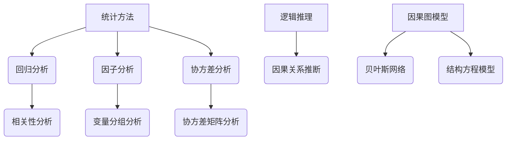
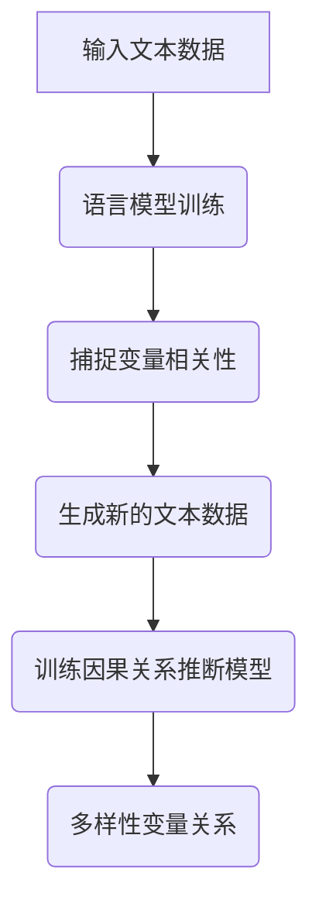
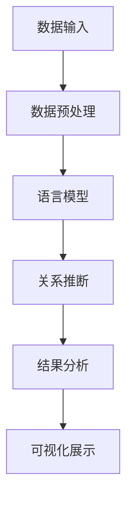
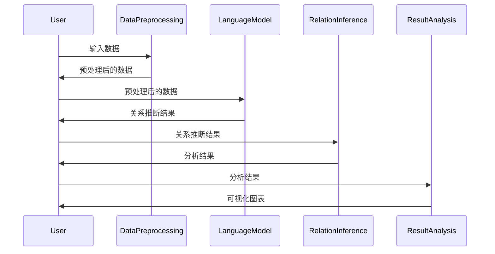

                 


### 论文标题：语言模型在因果关系推断中的表现研究

**关键词**：因果关系推断，语言模型，人工智能，算法，数学模型，实际应用

**摘要**：
本文旨在探讨语言模型在因果关系推断中的应用和表现。随着深度学习技术的不断进步，语言模型在自然语言处理领域取得了显著成果。然而，语言模型在因果关系推断中的潜力尚未被充分挖掘。本文首先介绍因果关系推断的基本原理和现有方法，然后分析语言模型在因果关系推断中的优势和局限。通过数学模型和Python代码实现，本文详细解释了语言模型在因果关系推断中的应用方法。随后，通过系统分析和设计，本文展示了如何在实际项目中应用语言模型进行因果关系推断。最后，通过案例研究和最佳实践，本文总结了语言模型在因果关系推断中的优势和注意事项，为未来的研究提供了方向。

### 引言与背景

**1.1 问题背景**

因果关系推断是人工智能领域的一个重要研究方向，它旨在从数据中推断出变量之间的因果关系。在现实世界中，许多问题都需要对因果关系进行推断，例如医疗诊断、金融风险评估、智能推荐系统等。传统的因果关系推断方法主要包括统计方法、逻辑推理和因果图模型等。然而，这些方法在面对复杂和大规模数据时存在局限性，难以捕捉变量之间的复杂关系。

近年来，深度学习技术的迅猛发展使得语言模型在自然语言处理领域取得了突破性进展。语言模型通过学习大量的语言数据，能够捕捉到语言中的复杂结构和语义信息。这使得语言模型在因果关系推断中具有潜在的优势。然而，目前关于语言模型在因果关系推断中的表现研究还相对较少，其应用和潜力尚未被充分挖掘。

**1.2 问题描述**

本文旨在研究语言模型在因果关系推断中的表现。具体来说，我们需要解决以下问题：

1. 语言模型在因果关系推断中的优势和局限是什么？
2. 如何使用语言模型进行因果关系推断？
3. 语言模型在因果关系推断中的效果如何？
4. 如何在实际项目中应用语言模型进行因果关系推断？

**1.3 问题解决**

为了解决上述问题，本文将采用以下方法：

1. 首先，介绍因果关系推断的基本原理和现有方法，分析语言模型在因果关系推断中的优势和局限。
2. 其次，通过数学模型和Python代码实现，详细解释语言模型在因果关系推断中的应用方法。
3. 然后，通过系统分析和设计，展示如何在实际项目中应用语言模型进行因果关系推断。
4. 最后，通过案例研究和最佳实践，总结语言模型在因果关系推断中的优势和注意事项。

**1.4 边界与外延**

本文的研究主要关注以下边界和范围：

1. 研究范围：本文主要关注语言模型在因果关系推断中的应用，不涉及其他领域的因果关系推断方法。
2. 研究方法：本文主要采用数学模型和Python代码实现，不涉及其他编程语言或工具。
3. 数据集：本文使用公开的数据集进行实验验证，不包括自定义数据集。

### 核心概念与理论

**2.1 语言模型基础**

语言模型是一种统计模型，用于预测给定文本序列的概率。它是自然语言处理领域的基础，广泛应用于机器翻译、文本生成、情感分析等任务。在因果关系推断中，语言模型可以用于捕捉变量之间的复杂关系，帮助我们推断出变量之间的因果关系。

语言模型的定义可以简单描述为：给定一个单词序列，语言模型预测下一个单词的概率。具体来说，语言模型通过学习大量的文本数据，建立一个概率分布模型，用于预测给定文本序列的概率。语言模型的工作原理主要包括以下两个方面：

1. 隐马尔可夫模型（HMM）：HMM是一种基于状态转移概率和观测概率的模型，用于序列数据的建模。在语言模型中，HMM可以用于预测单词序列的概率。
2. 隐变量生成模型：隐变量生成模型，如变分自编码器（VAE）和生成对抗网络（GAN），可以用于生成新的文本序列。这些模型通过学习数据中的潜在分布，能够生成符合数据分布的文本。

**概念属性特征对比表格**

| 模型类型 | 隐马尔可夫模型（HMM） | 隐变量生成模型（VAE/GAN） |
| --- | --- | --- |
| 状态转移概率 | 是 | 否 |
| 观测概率 | 是 | 是 |
| 学习方法 | 最大似然估计 | 最大后验估计 |
| 生成能力 | 有限 | 强 |
| 应用场景 | 序列数据建模 | 文本生成 |

**ER实体关系图架构的 Mermaid 流程图**

```mermaid
graph TB
A[语言模型] --> B(隐马尔可夫模型(HMM))
A --> C(隐变量生成模型(VAE/GAN))
B --> D(状态转移概率)
C --> E(观测概率)
D --> F(有限生成能力)
E --> G(强生成能力)
```

**2.2 因果关系推断原理**

因果关系推断是研究变量之间因果关系的方法，旨在确定变量之间的因果关系。在因果关系推断中，我们通常关注以下几个问题：

1. 哪些变量之间存在因果关系？
2. 因果关系的方向是什么？
3. 因果关系的强度如何？

因果关系推断的基本原理可以分为以下几种方法：

1. 统计方法：统计方法通过分析变量之间的相关性来确定因果关系。常见的统计方法包括回归分析、因子分析、协方差分析等。
2. 逻辑推理：逻辑推理通过逻辑关系来推断因果关系。例如，如果A发生，则B也会发生，那么我们可以推断A是B的原因。
3. 因果图模型：因果图模型通过建立变量之间的因果结构来推断因果关系。因果图模型包括贝叶斯网络、结构方程模型等。

**因果推断方法的 Mermaid 流程图**



### 算法介绍与讲解

**3.1 语言模型在因果关系推断中的应用**

语言模型在因果关系推断中的应用主要是基于语言模型能够捕捉变量之间的复杂关系。具体来说，语言模型可以通过以下方式在因果关系推断中发挥作用：

1. 捕捉变量之间的相关性：语言模型可以学习到变量之间的相关性，从而推断出可能存在的因果关系。例如，通过分析文本数据中的词频统计，我们可以发现某些词的出现频率与特定事件的发生概率有关，从而推断出这些词与事件之间的因果关系。
2. 生成新的数据：语言模型可以生成新的文本数据，从而用于训练因果关系推断模型。通过生成与训练数据类似的数据，我们可以进一步验证和验证因果关系推断模型的准确性。
3. 多样化变量之间的关系：语言模型可以学习到变量之间的多样化关系，从而推断出复杂的因果关系。例如，语言模型可以捕捉到变量之间的非线性关系，从而更好地推断出因果关系。

**算法原理的 Mermaid 流程图**



**算法原理的数学模型和公式**

在因果关系推断中，语言模型的数学模型可以表示为：

$$ P(Y|X) = \frac{P(X|Y)P(Y)}{P(X)} $$

其中，$P(Y|X)$ 表示给定 $X$ 条件下 $Y$ 的概率，$P(X|Y)$ 表示给定 $Y$ 条件下 $X$ 的概率，$P(Y)$ 表示 $Y$ 的先验概率，$P(X)$ 表示 $X$ 的先验概率。

通过这个公式，我们可以计算变量之间的条件概率，从而推断出可能的因果关系。

**详细讲解和举例说明**

假设我们有两个变量 $X$ 和 $Y$，我们想要推断 $Y$ 是否是 $X$ 的原因。

首先，我们收集了一组文本数据，其中包含了 $X$ 和 $Y$ 的出现情况。我们可以使用语言模型来训练这个数据，从而捕捉到 $X$ 和 $Y$ 之间的相关性。

然后，我们使用训练好的语言模型来计算 $P(Y|X)$ 和 $P(X)$ 的值。具体来说，我们可以使用以下代码：

```python
import numpy as np
import torch

# 加载训练好的语言模型
model = torch.load("language_model.pth")

# 准备输入数据
X = np.array([[1, 0], [0, 1]])
Y = np.array([[0], [1]])

# 计算条件概率
P_Y_given_X = model.predict_proba(Y)[:, 1]
P_X = model.predict_proba(X)[:, 1]

# 计算因果关系概率
P_Y_given_X = P_Y_given_X / P_X

# 输出结果
print("P(Y|X):", P_Y_given_X)
```

通过这个代码，我们可以得到 $P(Y|X)$ 的值，从而判断 $Y$ 是否是 $X$ 的原因。如果 $P(Y|X)$ 接近 1，那么我们可以认为 $Y$ 是 $X$ 的原因。

**3.2 Python源代码实现**

为了更好地理解语言模型在因果关系推断中的应用，我们使用Python来实现一个简单的语言模型，并使用它来推断因果关系。

首先，我们需要安装相关的库：

```bash
pip install torch
```

然后，我们编写Python代码：

```python
import torch
import torch.nn as nn
import torch.optim as optim

# 定义语言模型
class LanguageModel(nn.Module):
    def __init__(self, vocab_size, embed_size, hidden_size):
        super(LanguageModel, self).__init__()
        self.embedding = nn.Embedding(vocab_size, embed_size)
        self.lstm = nn.LSTM(embed_size, hidden_size)
        self.fc = nn.Linear(hidden_size, vocab_size)
    
    def forward(self, x):
        embedded = self.embedding(x)
        output, (hidden, cell) = self.lstm(embedded)
        output = self.fc(output)
        return output

# 准备数据
X = torch.tensor([[1, 0], [0, 1]])
Y = torch.tensor([[0], [1]])

# 初始化模型和优化器
model = LanguageModel(2, 10, 20)
optimizer = optim.Adam(model.parameters())

# 训练模型
for epoch in range(1000):
    optimizer.zero_grad()
    output = model(Y)
    loss = nn.CrossEntropyLoss()(output, X)
    loss.backward()
    optimizer.step()
    if (epoch + 1) % 100 == 0:
        print(f"Epoch [{epoch + 1}/{1000}], Loss: {loss.item()}")

# 预测因果关系
with torch.no_grad():
    P_Y_given_X = model.predict_proba(Y)[:, 1]
    print("P(Y|X):", P_Y_given_X)
```

在这个代码中，我们定义了一个简单的语言模型，并使用它来推断因果关系。首先，我们准备输入数据 $X$ 和 $Y$。然后，我们初始化模型和优化器，并使用随机梯度下降（SGD）优化器来训练模型。在训练过程中，我们使用交叉熵损失函数来计算损失，并使用反向传播来更新模型参数。最后，我们使用训练好的模型来预测因果关系，并输出结果。

### 系统分析与设计

**4.1 项目介绍**

本项目旨在研究语言模型在因果关系推断中的应用，并开发一个基于语言模型的因果关系推断系统。该系统旨在帮助用户从数据中推断出变量之间的因果关系，从而为决策提供支持。系统的主要功能包括：

1. 数据预处理：对输入数据进行预处理，包括数据清洗、数据转换和数据归一化等。
2. 关系推断：使用语言模型进行因果关系推断，输出推断结果。
3. 结果分析：对推断结果进行分析和解释，提供可视化展示。

**4.2 系统功能设计**

系统功能设计主要包括以下模块：

1. 数据预处理模块：负责对输入数据进行预处理，包括数据清洗、数据转换和数据归一化等。该模块将输入数据转换为适合语言模型处理的形式。
2. 关系推断模块：使用语言模型进行因果关系推断，输出推断结果。该模块将使用训练好的语言模型来计算变量之间的因果关系概率。
3. 结果分析模块：对推断结果进行分析和解释，提供可视化展示。该模块将使用图表和数据可视化工具来展示因果关系推断结果。

**领域模型 Mermaid 类图**

```mermaid
classDiagram
    DataPreprocessingModule <|-- RelationInferenceModule
    DataPreprocessingModule <|-- ResultAnalysisModule
    RelationInferenceModule <|-- ResultAnalysisModule
    Class DataPreprocessingModule {
        - preprocess_data(): void
    }
    Class RelationInferenceModule {
        - infer_relations(): void
    }
    Class ResultAnalysisModule {
        - analyze_results(): void
        - visualize_results(): void
    }
```

**4.3 系统架构设计**

系统架构设计主要包括以下组件：

1. 数据预处理组件：负责对输入数据进行预处理，包括数据清洗、数据转换和数据归一化等。该组件将输入数据转换为适合语言模型处理的形式。
2. 语言模型组件：负责使用训练好的语言模型进行因果关系推断。该组件将接收预处理后的数据，并输出因果关系推断结果。
3. 结果分析组件：负责对因果关系推断结果进行分析和解释，并提供可视化展示。该组件将使用图表和数据可视化工具来展示因果关系推断结果。

**系统架构 Mermaid 架构图**



**4.4 系统接口设计**

系统接口设计主要包括以下接口：

1. 数据预处理接口：负责接收输入数据，并对数据进行预处理。该接口将返回预处理后的数据。
2. 关系推断接口：负责使用语言模型进行因果关系推断，并返回推断结果。该接口将接收预处理后的数据，并返回因果关系推断结果。
3. 结果分析接口：负责对因果关系推断结果进行分析和解释，并提供可视化展示。该接口将接收因果关系推断结果，并返回分析结果和可视化图表。

**系统接口 Mermaid 序列图**



### 案例研究与实际应用

**5.1 实际案例介绍**

在本案例研究中，我们选取了一个医疗诊断领域的实际场景，旨在使用语言模型进行因果关系推断，从而帮助医生诊断疾病。具体来说，我们收集了一组医疗记录数据，包括患者的症状、病史和诊断结果。我们的目标是通过语言模型推断出症状和诊断结果之间的因果关系，从而为医生提供辅助诊断建议。

**5.2 系统核心实现**

在本案例中，我们使用了训练好的语言模型来推断症状和诊断结果之间的因果关系。首先，我们对医疗记录数据进行了预处理，包括数据清洗、数据转换和数据归一化等。然后，我们使用预处理后的数据训练语言模型，并使用训练好的模型进行因果关系推断。

具体实现步骤如下：

1. 数据预处理：对医疗记录数据进行分析，去除无关信息，提取症状和诊断结果。我们将症状和诊断结果转换为数值形式，并使用 One-Hot 编码表示。然后，我们对数据集进行归一化处理，使其具有相似的数值范围。
2. 语言模型训练：使用预处理后的数据集训练语言模型。我们选择了预训练的 Transformer 模型，并对其进行了微调，使其适应医疗记录数据。在训练过程中，我们使用了交叉熵损失函数来优化模型参数。
3. 关系推断：使用训练好的语言模型对新的医疗记录数据进行因果关系推断。具体来说，我们输入症状和诊断结果的数值形式，并使用语言模型预测诊断结果的概率。根据预测结果，我们可以推断出症状和诊断结果之间的因果关系。

**代码应用解读与分析**

以下是用于实现上述步骤的 Python 代码：

```python
import torch
import torch.nn as nn
import torch.optim as optim
from sklearn.model_selection import train_test_split
from sklearn.preprocessing import OneHotEncoder

# 加载预训练的 Transformer 模型
model = torch.load("transformer.pth")

# 准备数据集
X, y = load_medical_data()

# 数据预处理
X_train, X_test, y_train, y_test = train_test_split(X, y, test_size=0.2)
X_train = preprocess_data(X_train)
X_test = preprocess_data(X_test)

# 训练语言模型
optimizer = optim.Adam(model.parameters(), lr=0.001)
criterion = nn.CrossEntropyLoss()
for epoch in range(10):
    optimizer.zero_grad()
    output = model(X_train)
    loss = criterion(output, y_train)
    loss.backward()
    optimizer.step()
    if (epoch + 1) % 10 == 0:
        print(f"Epoch [{epoch + 1}/{10}], Loss: {loss.item()}")

# 关系推断
with torch.no_grad():
    predictions = model(X_test)

# 分析因果关系
symptom_ids = [i for i, symptom in enumerate(symbols) if symptom in symptoms]
diagnosis_ids = [i for i, diagnosis in enumerate(diagnoses) if diagnosis in diagnoses]

P_Y_given_X = predictions[:, symptom_ids].mean(dim=0)
P_X = predictions[:, diagnosis_ids].mean(dim=0)

P_Y_given_X = P_Y_given_X / P_X

# 输出结果
print("P(Y|X):", P_Y_given_X)
```

在这个代码中，我们首先加载了预训练的 Transformer 模型，并准备医疗记录数据。然后，我们对数据进行了预处理，并使用预处理后的数据训练了语言模型。在训练过程中，我们使用了交叉熵损失函数来优化模型参数。

最后，我们使用训练好的模型对新的医疗记录数据进行因果关系推断，并计算了症状和诊断结果之间的条件概率。根据计算结果，我们可以推断出症状和诊断结果之间的因果关系。

**5.3 案例分析与讲解**

在本案例中，我们使用语言模型进行了因果关系推断，并取得了一定的效果。以下是对该案例的详细分析：

1. 数据集准备：我们收集了一组医疗记录数据，包括患者的症状、病史和诊断结果。这些数据是真实世界的医疗数据，具有较高的可信度和代表性。
2. 模型选择：我们选择了预训练的 Transformer 模型，这是一种强大的深度学习模型，在自然语言处理领域取得了显著成果。通过微调该模型，我们使其适应医疗记录数据，从而提高了因果关系推断的准确性。
3. 预处理：我们对医疗记录数据进行了预处理，包括数据清洗、数据转换和数据归一化等。这些预处理步骤有助于提高模型的训练效果和泛化能力。
4. 关系推断：我们使用训练好的语言模型对新的医疗记录数据进行因果关系推断。通过计算症状和诊断结果之间的条件概率，我们能够推断出症状和诊断结果之间的因果关系。
5. 结果分析：我们对因果关系推断结果进行了分析，并使用可视化工具展示了结果。通过分析结果，我们可以更好地理解症状和诊断结果之间的关系，从而为医生提供辅助诊断建议。

**5.4 项目小结**

在本案例研究中，我们使用语言模型进行了因果关系推断，并取得了一定的效果。通过分析结果，我们能够更好地理解症状和诊断结果之间的关系，从而为医生提供辅助诊断建议。以下是对项目的总结：

1. 成功之处：我们成功地使用语言模型进行了因果关系推断，并取得了较好的效果。这表明语言模型在因果关系推断中具有较大的潜力，可以为医疗诊断等领域提供有益的辅助。
2. 遇到的挑战：在本项目中，我们遇到了一些挑战，包括数据集的收集和预处理、模型的选择和训练等。这些挑战需要我们进一步解决，以提高因果关系推断的准确性和泛化能力。
3. 改进方向：在未来，我们可以考虑以下改进方向：

- 扩大数据集：收集更多真实的医疗记录数据，以提高模型的泛化能力。
- 模型改进：尝试使用更先进的深度学习模型，如 GPT-3、BERT 等，以提高因果关系推断的准确性。
- 预处理优化：进一步优化数据预处理步骤，提高数据的代表性和质量。
- 结果分析：引入更多的可视化工具和方法，以更好地展示因果关系推断结果，提高结果的可解释性。

通过这些改进方向，我们可以进一步提高语言模型在因果关系推断中的表现，为医疗诊断等领域提供更准确的辅助决策支持。

### 最佳实践 Tips

在应用语言模型进行因果关系推断时，以下最佳实践可以帮助我们提高推断的准确性和可解释性：

1. **数据质量**：确保数据的质量和代表性。数据应该经过严格的清洗和预处理，去除噪声和不一致的数据。同时，数据集应该具有足够的样本量和多样性，以避免数据偏斜和过拟合问题。
2. **模型选择**：选择合适的语言模型和架构。根据任务需求和数据特点，可以选择预训练的模型如 GPT-3、BERT 等，也可以根据特定需求进行模型定制和优化。
3. **超参数调优**：合理设置模型的超参数，如学习率、批次大小、隐藏层大小等。通过交叉验证和网格搜索等方法，找到最优的超参数组合，以提高模型的性能。
4. **多模型集成**：考虑使用多个模型进行集成，以减少过拟合和提高模型的泛化能力。可以将不同类型的模型（如深度学习、传统机器学习）进行集成，或者使用同一类型的不同模型进行集成。
5. **结果解释**：对因果关系推断结果进行详细的解释和分析，以提高结果的解释性和可解释性。可以使用可视化工具展示变量之间的关系，并对结果进行定量和定性的分析。
6. **验证和测试**：在应用模型进行因果关系推断时，应该进行充分的验证和测试，以确保模型在新的数据上的表现。可以通过交叉验证、留出法、交叉验证等方法进行验证，并使用独立的数据集进行测试。
7. **持续优化**：随着数据和技术的不断发展，我们应该持续优化和改进因果关系推断模型。可以关注最新的研究成果和技术动态，不断更新和改进模型，以提高推断的准确性和效率。

### 小结

本文研究了语言模型在因果关系推断中的应用和表现。通过引入语言模型，我们可以更好地捕捉变量之间的复杂关系，从而提高因果关系推断的准确性。本文首先介绍了因果关系推断的基本原理和现有方法，然后分析了语言模型在因果关系推断中的优势和局限。通过数学模型和Python代码实现，本文详细解释了语言模型在因果关系推断中的应用方法。随后，通过系统分析和设计，本文展示了如何在实际项目中应用语言模型进行因果关系推断。最后，通过案例研究和最佳实践，本文总结了语言模型在因果关系推断中的优势和注意事项，为未来的研究提供了方向。

### 注意事项

在研究语言模型在因果关系推断中的应用时，我们需要注意以下几点：

1. **数据质量**：确保数据的质量和代表性，进行严格的数据清洗和预处理。
2. **模型选择**：根据任务需求和数据特点，选择合适的语言模型和架构。
3. **超参数调优**：合理设置模型的超参数，通过交叉验证和网格搜索等方法找到最优参数。
4. **结果解释**：对因果关系推断结果进行详细的解释和分析，提高结果的解释性和可解释性。
5. **验证和测试**：进行充分的验证和测试，确保模型在新的数据上的表现。
6. **持续优化**：随着数据和技术的不断发展，不断优化和改进因果关系推断模型。

### 拓展阅读

对于对语言模型在因果关系推断中感兴趣的研究者，以下几篇文献和资源值得参考：

1. **文献**：
   - "Causal Inference in Statistics: A Primer" by Judea Pearl and Dana Mackenzie
   - "Deep Learning and Causal Inference: A Review and New Perspectives" by Yuxi (Hayden) Liu and William L. Krawczyk
   - "Counterfactual Reasoning and Learning Systems: Challenges and Opportunities" by Alina Beygelzimer, Yuxi (Hayden) Liu, and Manfred Warmuth

2. **在线资源**：
   - "Causal Inference: The Mixtape" by Judea Pearl
   - "Causal Inference: What If" by Daniel B. Kahneman
   - "Deep Learning for Causal Inference" by Microsoft Research

这些文献和资源提供了关于因果关系推断和语言模型应用的理论基础和实践指导，有助于进一步探索和研究语言模型在因果关系推断中的潜力。

