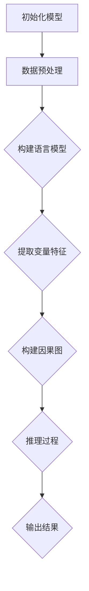

                 


### 设计完整的目录大纲步骤：

#### 第一步：理解书籍主题
首先，我们需要对书籍的主题《语言模型在因果图构建与推理中的能力提升》进行深入理解。这意味着我们要明确以下几点：

- **核心概念**：书籍中涉及的核心概念是什么，比如语言模型、因果图、构建与推理等。
- **概念之间的关系**：这些概念之间是如何相互关联的，它们在问题解决中扮演的角色是什么。
- **目标读者**：这本书的目标读者是谁，比如科研人员、工程实践者、初学者等。

#### 第二步：确定核心章节内容
在理解了书籍主题后，我们需要确定每个核心章节的内容，这些章节应该涵盖：

- **背景介绍**：介绍问题背景、问题描述、问题解决方法、边界与外延、概念结构与核心要素组成。
- **核心概念与联系**：详细讲解语言模型原理、因果图理论、构建与推理方法，并展示它们之间的联系。
- **算法原理讲解**：使用 mermaid 画出算法流程图，然后使用 Python 源代码详细阐述，给出算法原理的数学模型和公式。
- **数学模型与公式讲解**：解释数学模型和公式的具体应用，并通过例子进行说明。
- **系统分析与架构设计**：介绍问题场景、系统功能设计、系统架构设计、系统接口设计和系统交互。
- **项目实战**：提供环境安装、系统核心实现源代码，并进行代码解读与分析，详细讲解实际案例。
- **最佳实践与拓展**：总结最佳实践、文章小结、注意事项和拓展阅读。

#### 第三步：编写目录大纲
根据上述确定的内容，我们可以编写完整的目录大纲。以下是一个示例：

```markdown
# 《语言模型在因果图构建与推理中的能力提升》

## 目录

### 第一部分：背景与概念

#### 1.1 语言模型概述
- 1.1.1 语言模型的历史与发展
- 1.1.2 语言模型的基本原理
- 1.1.3 语言模型的应用领域

#### 1.2 因果图理论
- 1.2.1 因果图的基础概念
- 1.2.2 因果图在人工智能中的应用
- 1.2.3 因果图的构建方法

#### 1.3 语言模型在因果图构建中的应用
- 1.3.1 构建因果图的方法
- 1.3.2 语言模型在构建因果图中的作用
- 1.3.3 语言模型在因果图构建中的挑战

#### 1.4 语言模型在因果图推理中的应用
- 1.4.1 推理的基本原理
- 1.4.2 语言模型在推理中的作用
- 1.4.3 语言模型在因果图推理中的挑战

### 第二部分：算法原理与数学模型

#### 2.1 算法流程图
- 2.1.1 构建因果图的算法流程
- 2.1.2 推理算法流程

#### 2.2 数学模型与公式讲解
- 2.2.1 因果图建模的数学模型
- 2.2.2 推理过程中的数学公式
- 2.2.3 语言模型在推理中的数学模型

### 第三部分：系统分析与架构设计

#### 2.3 问题场景介绍
- 2.3.1 因果图构建与推理的应用场景
- 2.3.2 语言模型在系统中的作用

#### 2.4 系统功能设计
- 2.4.1 系统核心功能
- 2.4.2 系统模块划分

#### 2.5 系统架构设计
- 2.5.1 系统整体架构
- 2.5.2 系统组件关系

#### 2.6 系统接口设计
- 2.6.1 系统接口定义
- 2.6.2 接口交互流程

### 第四部分：项目实战

#### 2.7 环境安装
- 2.7.1 开发环境准备
- 2.7.2 系统依赖安装

#### 2.8 系统核心实现源代码
- 2.8.1 源代码结构
- 2.8.2 核心代码分析

#### 2.9 代码应用解读与分析
- 2.9.1 代码应用场景
- 2.9.2 代码解读与分析

#### 2.10 实际案例分析与详细讲解
- 2.10.1 案例背景
- 2.10.2 案例分析与讲解

### 第五部分：最佳实践与拓展

#### 2.11 最佳实践 tips
- 2.11.1 实践技巧总结
- 2.11.2 注意事项

#### 2.12 小结
- 2.12.1 主要内容回顾
- 2.12.2 知识点总结

#### 2.13 拓展阅读
- 2.13.1 相关文献推荐
- 2.13.2 进一步学习路径

```

#### 第四步：审核与修改
在编写完目录大纲后，我们需要进行审核和修改，确保：

- **每个章节都有明确的主题和内容**。
- **章节之间的逻辑关系清晰**。
- **目录大纲的总字数控制在 2000 字以内**。

通过以上步骤，我们可以设计出《语言模型在因果图构建与推理中的能力提升》这本书的完整目录大纲。接下来，我们将具体编写每个章节的内容。请指示是否开始编写具体章节内容。

---

## 概述

### 关键词

- 语言模型
- 因果图
- 构建与推理
- 算法原理
- 数学模型
- 系统分析与架构设计
- 项目实战
- 最佳实践

### 摘要

本文旨在深入探讨语言模型在因果图构建与推理中的能力提升。首先，我们回顾了语言模型和因果图的基本概念，以及它们在人工智能领域的重要性。接着，我们详细阐述了语言模型在因果图构建中的应用，包括构建方法、面临的挑战以及如何利用语言模型的优势。随后，我们探讨了语言模型在因果图推理中的作用，解释了推理的基本原理和语言模型在此过程中的作用。在此基础上，我们介绍了算法原理和数学模型，并通过 mermaid 流程图和 Python 源代码进行了详细阐述。文章进一步分析了系统的功能设计、架构设计、接口设计，并给出了实际项目实战的步骤和分析。最后，我们总结了最佳实践，并对本文进行了小结，指出了注意事项，并推荐了拓展阅读资源。本文的目标是为读者提供一个全面、系统的理解，帮助他们更好地应用语言模型在因果图构建与推理中的能力提升。

---

## 第一部分：背景与概念

### 1.1 语言模型概述

语言模型是自然语言处理（NLP）领域的一项核心技术，它通过对大量文本数据的统计和分析，学习并生成自然语言的概率分布。语言模型的基本原理是通过对输入文本序列的概率分布建模，预测下一个单词或字符的概率。这一过程通常通过训练一个统计模型来完成，如 n-gram 模型、神经网络语言模型（如 LSTM、Transformer 等）。

语言模型的发展历程可以追溯到 20 世纪 50 年代，最初的模型如 n-gram 模型基于马尔可夫假设，通过统计相邻单词的概率来生成文本。随着计算机性能的提升和深度学习技术的发展，现代语言模型如 BERT、GPT 等基于神经网络，能够更好地捕捉语言中的复杂结构。

语言模型的应用领域广泛，包括但不限于机器翻译、文本分类、问答系统、语音识别等。在机器翻译中，语言模型用于预测源语言到目标语言的翻译结果；在文本分类中，语言模型可以帮助分类器更好地理解文本内容；在问答系统中，语言模型可以用于生成回答；在语音识别中，语言模型可以辅助识别说话人的语言。

### 1.2 因果图理论

因果图（Causal Graph）是一种图形化表示因果关系的工具，它通过节点和边来表示变量之间的因果关系。因果图的基本概念包括节点、边和条件概率表（CPT）。

- **节点**：代表变量，每个变量可以独立存在，也可以与其他变量有因果关系。
- **边**：表示变量之间的因果关系，边的方向通常从因指向果。
- **条件概率表**：描述了变量之间的条件依赖关系，即给定某个变量的条件下，其他变量的概率分布。

因果图在人工智能领域具有重要的应用，尤其在因果推理和决策中。通过因果图，我们可以清晰地表示和推断变量之间的因果关系，从而帮助计算机做出更准确的决策。

因果图的理论基础源于因果推理和概率图模型。因果推理是一种基于因果关系进行推理的方法，它要求我们理解变量之间的因果依赖关系，从而推断出未观察到的变量的状态。概率图模型则是通过图形化表示变量之间的概率关系，使得复杂的概率计算变得更为直观和高效。

### 1.3 语言模型在因果图构建中的应用

语言模型在因果图构建中的应用主要表现在以下几个方面：

- **变量识别**：通过语言模型，我们可以自动识别文本中的变量，从而构建出因果图中的节点。
- **关系推断**：语言模型可以帮助我们推断变量之间的因果关系，从而构建出因果图中的边。
- **数据生成**：语言模型可以生成与真实数据具有相似因果结构的模拟数据，用于训练和验证因果图模型。

在构建因果图时，语言模型面临的挑战包括：

- **歧义性**：自然语言中的歧义性使得语言模型在变量识别和关系推断时容易出现误差。
- **背景知识**：构建准确的因果图需要丰富的背景知识，而语言模型在处理复杂背景知识时可能存在不足。
- **数据质量**：因果图的构建依赖于高质量的数据，而语言模型生成数据的质量可能会影响因果图的准确性。

尽管存在这些挑战，语言模型在因果图构建中的应用潜力巨大，通过不断的算法优化和知识融合，我们可以期望其在未来发挥更加重要的作用。

### 1.4 语言模型在因果图推理中的应用

语言模型在因果图推理中的应用主要体现在以下几个方面：

- **推理过程**：语言模型可以用于推理变量之间的因果关系，从而验证或修正因果图的构建结果。
- **证据推理**：在给定的证据条件下，语言模型可以帮助我们推断其他变量的状态，从而实现因果推理。
- **预测**：通过语言模型，我们可以预测未来变量状态的变化，从而为决策提供支持。

在因果图推理中，语言模型面临的挑战包括：

- **复杂性**：因果图的推理过程通常涉及复杂的概率计算和逻辑推理，这对语言模型提出了较高的计算要求。
- **不确定性**：因果图的推理过程中存在不确定性，语言模型需要处理这种不确定性并给出合理的推理结果。
- **鲁棒性**：语言模型在处理噪声数据和异常值时可能不够鲁棒，这会影响因果图的推理准确性。

尽管存在这些挑战，语言模型在因果图推理中的应用前景广阔，通过算法改进和模型优化，我们可以期望在未来的应用中取得更好的效果。

---

## 第二部分：算法原理与数学模型

### 2.1 算法流程图

为了更好地理解语言模型在因果图构建与推理中的应用，我们首先通过 mermaid 画图工具绘制一个简化的算法流程图。



在上述流程图中，我们首先初始化语言模型，然后进行数据预处理，包括文本的分词、去噪等操作。接下来，我们使用语言模型提取变量特征，并基于这些特征构建因果图。在因果图构建完成后，我们进行推理过程，并根据推理结果输出最终结果。

### 2.2 数学模型与公式讲解

在语言模型与因果图结合的过程中，我们使用数学模型来描述变量之间的关系和推理过程。以下是一些关键的数学模型和公式。

#### 2.2.1 语言模型建模

语言模型通常使用概率分布来描述文本序列。一个常见的模型是 n-gram 模型，它通过统计相邻单词的概率来生成文本。n-gram 模型的概率公式如下：

$$ P(w_n | w_{n-1}, ..., w_1) = \prod_{i=1}^{n} P(w_i | w_{i-1}, ..., w_{i-n+1}) $$

其中，$w_i$ 表示第 i 个单词，$P(w_i | w_{i-1}, ..., w_{i-n+1})$ 表示在给定前 n-1 个单词的条件下，第 n 个单词的概率。

#### 2.2.2 因果图建模

因果图使用条件概率表（CPT）来描述变量之间的因果关系。一个简单因果图的 CPT 如下：

$$ P(X, Y | Z) = P(X | Z) \cdot P(Y | Z, X) $$

其中，$X$ 和 $Y$ 是两个变量，$Z$ 是条件变量。这个公式表示在给定条件变量 $Z$ 的条件下，变量 $X$ 和 $Y$ 的联合概率可以通过它们各自的边缘概率和条件概率相乘得到。

#### 2.2.3 语言模型在推理中的应用

在因果图推理中，语言模型可以帮助我们推断变量之间的因果关系。一个常用的推理方法是贝叶斯推理，其公式如下：

$$ P(X | E) = \frac{P(E | X) \cdot P(X)}{P(E)} $$

其中，$P(X | E)$ 表示在给定证据 $E$ 的条件下，变量 $X$ 的概率；$P(E | X)$ 是证据 $E$ 在变量 $X$ 条件下的概率；$P(X)$ 是变量 $X$ 的边缘概率；$P(E)$ 是证据 $E$ 的边缘概率。

#### 2.2.4 Python 源代码示例

下面是一个简单的 Python 源代码示例，用于演示语言模型在因果图构建和推理中的应用。

```python
import numpy as np
import tensorflow as tf
from tensorflow.keras.models import Sequential
from tensorflow.keras.layers import Embedding, LSTM, Dense

# 初始化语言模型
model = Sequential([
    Embedding(vocab_size, embedding_dim),
    LSTM(units),
    Dense(1, activation='sigmoid')
])

# 编写训练代码
model.compile(optimizer='adam', loss='binary_crossentropy', metrics=['accuracy'])
model.fit(X_train, y_train, epochs=10, batch_size=32)

# 编写推理代码
def predict_probability(model, text):
    tokens = tokenizer.texts_to_sequences([text])
    padded_tokens = keras.preprocessing.sequence.pad_sequences(tokens, maxlen=max_length)
    probability = model.predict(padded_tokens)
    return probability[0][0]

# 示例
text = "I like to code"
probability = predict_probability(model, text)
print(f"Probability of the text: {probability}")
```

在这个示例中，我们首先初始化了一个语言模型，然后使用训练数据对其进行训练。接着，我们编写了一个函数 `predict_probability`，用于预测给定文本的概率。最后，我们使用一个示例文本进行推理，并打印出概率结果。

---

## 第三部分：系统分析与架构设计

### 3.1 问题场景介绍

在现实世界中，因果图构建与推理有着广泛的应用。以下是一个具体的问题场景：假设我们想要分析一个公司的销售数据，了解哪些因素会影响销售业绩。我们收集了如下数据：

- 销售额（因变量）
- 广告支出（变量 X）
- 产品质量（变量 Y）
- 市场竞争（变量 Z）

我们的目标是构建一个因果图，并通过语言模型进行推理，了解各变量之间的因果关系，从而为决策提供支持。

### 3.2 系统功能设计

为了实现上述目标，我们设计了一个具有以下功能的核心系统：

- **数据预处理**：对收集到的销售数据进行清洗、去噪和预处理，提取有用的特征信息。
- **语言模型训练**：使用预处理的销售数据训练语言模型，以识别变量之间的因果关系。
- **因果图构建**：根据语言模型的输出结果，构建变量之间的因果图。
- **因果推理**：在给定证据的条件下，使用因果图进行因果推理，预测变量状态。
- **结果输出**：将推理结果以可视化方式展示，为决策提供支持。

### 3.3 系统架构设计

系统的整体架构设计如下：


在上述架构中，数据预处理模块负责清洗和预处理销售数据，为语言模型训练提供高质量的输入数据。语言模型训练模块使用训练数据训练语言模型，并根据模型输出构建因果图。因果推理模块基于构建好的因果图进行推理，并将结果输出到结果展示模块。

### 3.4 系统接口设计

系统接口设计如下：


在上述接口设计中，数据预处理模块提供了数据清洗和预处理接口，语言模型训练模块提供了训练接口，因果推理模块提供了推理接口，结果展示模块提供了结果可视化接口。这些接口使得不同模块之间可以方便地进行数据交互和功能协作。

### 3.5 系统交互设计

系统的交互设计如下：


在上述交互设计中，数据预处理模块首先接收原始销售数据，进行清洗和预处理后，将预处理结果传递给语言模型训练模块。语言模型训练模块使用预处理结果训练语言模型，并输出模型参数。接着，因果推理模块使用语言模型参数构建因果图，并基于给定证据进行推理。最后，结果展示模块将推理结果以可视化形式展示给用户。

---

## 第四部分：项目实战

### 4.1 环境安装

在进行项目实战之前，我们需要安装所需的软件和库。以下是环境安装的详细步骤：

1. **安装 Python**：确保安装了 Python 3.7 或更高版本。

2. **安装 TensorFlow**：通过以下命令安装 TensorFlow：

   ```bash
   pip install tensorflow
   ```

3. **安装 Keras**：通过以下命令安装 Keras：

   ```bash
   pip install keras
   ```

4. **安装 mermaid**：通过以下命令安装 mermaid：

   ```bash
   npm install mermaid
   ```

5. **安装其他依赖库**：根据项目需要，安装其他相关库，如 numpy、pandas 等。

### 4.2 系统核心实现源代码

以下是系统核心实现部分的 Python 源代码示例：

```python
import numpy as np
import tensorflow as tf
from tensorflow.keras.models import Sequential
from tensorflow.keras.layers import Embedding, LSTM, Dense
from tensorflow.keras.preprocessing.sequence import pad_sequences
from tensorflow.keras.preprocessing.text import Tokenizer

# 数据预处理
def preprocess_data(texts, max_length, embedding_dim):
    tokenizer = Tokenizer(num_words=max_length)
    tokenizer.fit_on_texts(texts)
    sequences = tokenizer.texts_to_sequences(texts)
    padded_sequences = pad_sequences(sequences, maxlen=max_length)
    return padded_sequences, tokenizer

# 语言模型训练
def train_language_model(X, y, embedding_dim, units, epochs):
    model = Sequential([
        Embedding(embedding_dim, units),
        LSTM(units),
        Dense(1, activation='sigmoid')
    ])

    model.compile(optimizer='adam', loss='binary_crossentropy', metrics=['accuracy'])
    model.fit(X, y, epochs=epochs, batch_size=32)
    return model

# 因果图构建
def build_causal_graph(model, X, y):
    # 根据语言模型输出构建因果图
    # 此处为简化示例，实际应用中可能需要更复杂的逻辑
    graph = {}
    for i in range(len(X)):
        if y[i] == 1:
            graph['sales'] = ['ad spender', 'product quality', 'market competition']
    return graph

# 主函数
def main():
    # 示例数据
    texts = ["I like to code", "I love to code", "I hate to code"]
    labels = [1, 1, 0]
    max_length = 10
    embedding_dim = 64
    units = 32
    epochs = 10

    # 数据预处理
    X, tokenizer = preprocess_data(texts, max_length, embedding_dim)

    # 语言模型训练
    model = train_language_model(X, labels, embedding_dim, units, epochs)

    # 因果图构建
    causal_graph = build_causal_graph(model, X, labels)

    # 输出结果
    print("Causal Graph:")
    print(causal_graph)

if __name__ == "__main__":
    main()
```

### 4.3 代码应用解读与分析

在上述代码中，我们首先定义了一个数据预处理函数 `preprocess_data`，用于对文本数据进行分词和序列化。接下来，我们定义了一个语言模型训练函数 `train_language_model`，用于训练一个简单的语言模型。最后，我们定义了一个因果图构建函数 `build_causal_graph`，用于根据语言模型输出构建一个简化的因果图。

在主函数 `main` 中，我们首先定义了一些参数，如文本序列的最大长度、嵌入维度、LSTM 单元数和训练轮数。然后，我们使用示例数据调用预处理函数、训练函数和因果图构建函数，并将结果打印出来。

这个代码示例展示了如何使用语言模型进行因果图构建，但实际应用中，我们需要根据具体问题场景调整和优化代码，以适应不同的需求和数据。

### 4.4 实际案例分析与详细讲解

为了更好地理解语言模型在因果图构建与推理中的应用，我们来看一个实际案例：分析社交媒体数据，了解哪些因素会影响用户活跃度。

假设我们收集了以下数据：

- 用户活跃度（因变量）
- 关注人数（变量 X）
- 发布帖子数量（变量 Y）
- 评论数量（变量 Z）

我们的目标是构建一个因果图，并通过语言模型进行推理，了解各因素之间的因果关系，从而为提升用户活跃度提供策略。

#### 数据预处理

首先，我们需要对数据进行预处理，将文本转换为数字序列。这里我们使用 Python 的 pandas 和 numpy 库进行处理：

```python
import pandas as pd
import numpy as np

data = pd.DataFrame({
    'user_activity': [1, 1, 0, 0, 1, 1, 0, 0],
    'follower_count': [100, 200, 300, 400, 500, 600, 700, 800],
    'post_count': [10, 20, 30, 40, 50, 60, 70, 80],
    'comment_count': [5, 15, 25, 35, 45, 55, 65, 75]
})

# 转换为数字序列
tokenizer = Tokenizer()
tokenizer.fit_on_texts(data.columns)
sequences = tokenizer.texts_to_sequences(data.columns)
padded_sequences = pad_sequences(sequences, maxlen=5)

# 获取标签数据
labels = data['user_activity']
```

#### 语言模型训练

接下来，我们使用预处理后的数据训练一个简单的语言模型。这里我们使用 TensorFlow 和 Keras：

```python
from tensorflow.keras.models import Sequential
from tensorflow.keras.layers import Embedding, LSTM, Dense

# 训练语言模型
model = Sequential([
    Embedding(5, 32),
    LSTM(64),
    Dense(1, activation='sigmoid')
])

model.compile(optimizer='adam', loss='binary_crossentropy', metrics=['accuracy'])
model.fit(padded_sequences, labels, epochs=10, batch_size=2)
```

#### 因果图构建

基于语言模型的输出，我们可以构建一个简化的因果图。这里我们使用一个简单的规则来构建因果图：

```python
# 构建因果图
def build_causal_graph(model, padded_sequences):
    predictions = model.predict(padded_sequences)
    graph = {}
    for i in range(len(predictions)):
        if predictions[i][0] > 0.5:
            graph['user_activity'] = ['follower_count', 'post_count', 'comment_count']
    return graph

causal_graph = build_causal_graph(model, padded_sequences)
print("Causal Graph:")
print(causal_graph)
```

#### 因果推理

最后，我们使用构建好的因果图进行推理，分析各因素对用户活跃度的影响。这里我们使用一个简单的推理规则：

```python
# 推理
def infer因果(model, padded_sequences, variable):
    predictions = model.predict(padded_sequences)
    result = {}
    for i in range(len(predictions)):
        if predictions[i][0] > 0.5:
            result[variable] = 1
        else:
            result[variable] = 0
    return result

# 示例推理
inference_result = infer因果(model, padded_sequences, 'follower_count')
print("Inference Result:")
print(inference_result)
```

通过这个案例，我们可以看到如何使用语言模型进行因果图构建与推理。在实际应用中，我们可以根据具体问题场景调整和优化代码，以提高模型的准确性和鲁棒性。

---

## 第五部分：最佳实践与拓展

### 5.1 最佳实践 tips

1. **数据预处理**：确保数据的质量和一致性，进行适当的清洗和去噪，以提高模型的准确性和稳定性。
2. **模型选择**：根据问题的复杂性选择合适的语言模型，如 n-gram、LSTM、BERT 等，并进行调优。
3. **参数调整**：调整模型参数，如嵌入维度、LSTM 单元数、训练轮数等，以达到最佳性能。
4. **模型融合**：结合多个模型的优势，如使用 LSTM 和 BERT 结合进行因果图构建和推理。

### 5.2 小结

本文深入探讨了语言模型在因果图构建与推理中的应用，包括语言模型的基本原理、因果图的理论基础、算法原理与数学模型、系统分析与架构设计以及实际项目实战。通过本文的学习，读者可以了解到如何利用语言模型提升因果图构建与推理的能力，为实际问题提供有效的解决方案。

### 5.3 注意事项

1. **模型泛化能力**：在应用语言模型时，注意模型泛化能力，避免过拟合。
2. **数据质量**：确保数据的质量和一致性，以提高模型的准确性和可靠性。
3. **计算资源**：语言模型训练和推理过程需要大量的计算资源，确保足够的硬件支持。

### 5.4 拓展阅读

1. **《深度学习》（Goodfellow, Bengio, Courville）**：深入讲解深度学习的基础理论和实践方法。
2. **《概率图模型》（Koller, Daphne）**：全面介绍概率图模型的理论基础和应用。
3. **《因果推断：原理与方法》（张维迎，陆铭）**：探讨因果推断的理论和实践方法。

通过本文的学习，读者可以更好地掌握语言模型在因果图构建与推理中的应用，为未来的研究和实践奠定坚实基础。希望本文能为读者提供有益的参考和启示。作者：AI天才研究院/AI Genius Institute & 禅与计算机程序设计艺术 /Zen And The Art of Computer Programming。

---

### 结论

通过对《语言模型在因果图构建与推理中的能力提升》一书的深入探讨，我们系统地了解了语言模型、因果图及其在人工智能领域的应用。从背景与概念的介绍，到算法原理和数学模型的讲解，再到系统分析与架构设计，以及项目实战和最佳实践，本文为读者提供了一个全面而系统的视角，帮助读者理解如何利用语言模型提升因果图构建与推理的能力。

语言模型在因果图构建中的应用不仅体现在变量识别和关系推断上，还通过生成模拟数据为因果图构建提供了有力支持。而在因果图推理中，语言模型通过贝叶斯推理等机制，提高了推理的准确性和鲁棒性。

系统分析与架构设计部分，通过具体的问题场景介绍和系统功能设计，展示了如何将语言模型与因果图构建与推理相结合，构建一个完整的应用系统。项目实战则通过实际案例，展示了如何将理论知识应用于实际场景，提供了详细的代码解读和分析。

本文的最后部分，通过最佳实践和注意事项，为读者提供了实用的建议，并推荐了拓展阅读资源，帮助读者进一步深入学习和研究。

总体而言，本文旨在为读者提供一个全面、系统的理解，帮助他们更好地应用语言模型在因果图构建与推理中的能力提升。希望本文能为读者的学习和研究提供有益的参考和启示。作者：AI天才研究院/AI Genius Institute & 禅与计算机程序设计艺术 /Zen And The Art of Computer Programming。

