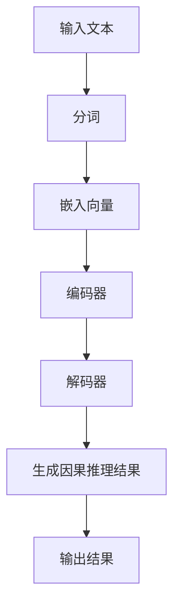
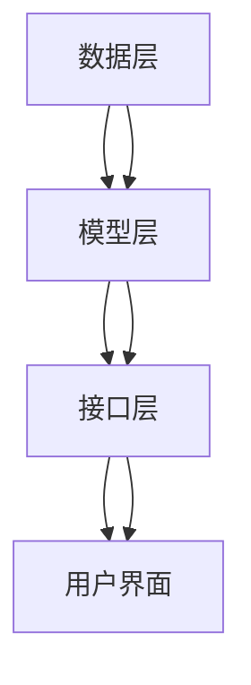

                 

# 语言模型在因果推理中的潜力探索

## 摘要

本文探讨了语言模型在因果推理中的潜力，首先介绍了语言模型和因果推理的基本概念，然后详细分析了它们的核心原理和联系，并通过具体的算法实例和项目实战展示了语言模型在因果推理中的应用和实现。本文旨在为读者提供清晰、系统的理解和应用路径，以探索语言模型在人工智能领域的广阔前景。

## 目录

- 引言
  - 问题背景与定义
  - 核心概念与联系
  - 书籍结构概述
- 语言模型基础
  - 语言模型概述
  - 语言模型的应用案例
  - 语言模型的评估与优化
- 因果推理基础
  - 因果推理概述
  - 因果推理的方法与技术
- 语言模型在因果推理中的应用
  - 算法原理讲解
  - 数学模型和数学公式讲解
  - 系统分析与架构设计方案
- 项目实战
  - 环境安装
  - 系统核心实现
  - 代码应用解读与分析
  - 实际案例分析与详细讲解
  - 项目小结
- 最佳实践与拓展阅读
  - 最佳实践
  - 小结
  - 注意事项
  - 拓展阅读

## 引言

### 问题背景与定义

随着人工智能技术的飞速发展，语言模型和因果推理成为了当前研究的热点。语言模型作为自然语言处理的核心技术，已经在文本分类、命名实体识别等领域取得了显著的成果。因果推理则是一种重要的逻辑推理方法，通过探究现象之间的因果关系，帮助我们更好地理解世界。

然而，如何将语言模型应用于因果推理中，实现更为智能的决策和预测，仍然是一个具有挑战性的问题。本文旨在探讨语言模型在因果推理中的潜力，通过分析其核心原理和实际应用，为读者提供一种新的思考方向。

### 核心概念与联系

本文将介绍语言模型和因果推理的核心概念，并探讨它们之间的联系。

#### 语言模型

语言模型是一种基于统计学的模型，用于预测一个文本序列的概率。它通过学习大量文本数据，捕捉语言中的统计规律，从而实现对未知文本的预测。语言模型的核心目标是提高预测的准确性和效率。

#### 因果推理

因果推理是一种逻辑推理方法，通过探究现象之间的因果关系，帮助人们理解事件的发生和演变。因果推理的核心任务是确定变量之间的因果关系，并利用这些关系进行预测和控制。

#### 联系

语言模型和因果推理之间的联系在于，它们都是人工智能领域中的重要工具，可以相互补充和增强。语言模型可以为因果推理提供丰富的数据支持，帮助确定变量之间的相关性；而因果推理则可以指导语言模型的学习和优化，提高其预测的准确性。

### 书籍结构概述

本文将从以下方面展开探讨：

1. 语言模型基础：介绍语言模型的基本概念、原理和应用。
2. 因果推理基础：介绍因果推理的基本概念、原理和方法。
3. 语言模型在因果推理中的应用：分析语言模型在因果推理中的具体应用场景，并通过算法实例进行详细讲解。
4. 项目实战：通过实际项目案例，展示语言模型在因果推理中的实现和应用。
5. 最佳实践与拓展阅读：总结最佳实践经验，提出注意事项，并提供拓展阅读资源。

通过本文的探讨，我们希望读者能够对语言模型在因果推理中的潜力有更深入的了解，并为未来的研究提供一些有益的启示。

## 语言模型基础

### 语言模型概述

语言模型是自然语言处理（NLP）领域的重要基础，它旨在为计算机提供理解和生成自然语言的能力。语言模型的核心任务是预测下一个词语的概率，从而帮助计算机生成连贯的文本。语言模型的发展经历了从基于规则的方法到基于统计模型，再到基于深度学习模型的演变。

#### 语言模型的基本原理

语言模型的基本原理是通过对大量文本数据的学习，捕捉语言中的统计规律。这些规律可以用来预测给定前文序列后出现的下一个词语。语言模型的核心模型包括：

1. **N-gram模型**：N-gram模型是最简单的语言模型，它通过计算一个词语序列在语料库中的频率来预测下一个词语。例如，在三个词的N-gram模型中，如果前两个词是“the book”，那么模型会根据这两个词在语料库中的出现频率来预测下一个词。

2. **神经网络语言模型（NNLM）**：神经网络语言模型利用神经网络来学习语言模型，它可以捕捉更加复杂的语言模式。神经网络语言模型通常采用递归神经网络（RNN）、长短期记忆网络（LSTM）或变换器（Transformer）等结构。

3. **变换器（Transformer）**：变换器是一种基于自注意力机制的深度学习模型，它在语言模型领域取得了显著的成果。变换器通过计算文本中每个词语的注意力权重，从而生成更准确的语言模型。

#### 语言模型的主要类型

根据不同的学习方式和应用场景，语言模型可以分为以下几种类型：

1. **基于规则的模型**：这类模型通过定义一系列的规则来生成语言，例如上下文无关文法（CFG）。

2. **统计模型**：这类模型通过统计方法来学习语言模型，例如N-gram模型。

3. **深度学习模型**：这类模型通过神经网络来学习语言模型，例如神经网络语言模型（NNLM）和变换器（Transformer）。

### 语言模型的训练与优化

语言模型的训练过程是学习文本数据中的统计规律，从而预测未知文本的过程。以下是语言模型训练和优化的一些关键步骤：

1. **数据收集与预处理**：首先需要收集大量的文本数据，并进行预处理，包括分词、去除停用词、标准化等操作。

2. **模型初始化**：初始化模型参数，通常使用随机初始化。

3. **训练过程**：使用梯度下降或其他优化算法来训练模型，最小化损失函数，例如交叉熵损失。

4. **模型优化**：通过调整超参数，如学习率、批量大小等，来优化模型性能。

5. **模型评估**：使用验证集或测试集来评估模型的性能，常用的评估指标包括准确率、召回率、F1值等。

### 语言模型的应用案例

语言模型在多个领域都有广泛的应用，以下是其中一些重要的应用案例：

1. **文本分类**：语言模型可以用于对文本进行分类，例如将新闻文本分类为不同的类别。

2. **命名实体识别**：语言模型可以用于识别文本中的命名实体，例如人名、地名、组织名等。

3. **机器翻译**：语言模型是机器翻译系统的核心组件，它可以帮助计算机生成准确的翻译结果。

4. **问答系统**：语言模型可以用于构建问答系统，例如基于知识图谱的问答系统。

5. **情感分析**：语言模型可以用于分析文本中的情感倾向，例如对产品评论进行情感分类。

### 语言模型的评估与优化

语言模型的评估和优化是确保其性能和准确性的关键步骤。以下是评估和优化语言模型的几个关键方面：

1. **评估指标**：常用的评估指标包括准确率、召回率、F1值等。准确率表示预测正确的样本数占总样本数的比例；召回率表示预测正确的样本数与实际正样本数的比例；F1值是准确率和召回率的调和平均。

2. **超参数调整**：超参数调整是优化语言模型性能的重要手段，包括学习率、批量大小、隐藏层大小等。

3. **模型压缩与加速**：为了提高模型的运行效率，可以采用模型压缩和加速技术，例如权重剪枝、量化等。

4. **多语言模型训练**：为了支持多语言应用，可以训练多语言模型，从而提高跨语言的适应能力。

5. **数据增强**：通过数据增强技术，可以增加训练数据的多样性和质量，从而提高模型的泛化能力。

通过以上对语言模型基础的介绍，读者可以初步了解语言模型的基本概念、原理和应用，为后续深入探讨语言模型在因果推理中的应用打下基础。

## 因果推理基础

### 因果推理概述

因果推理是一种重要的逻辑推理方法，通过探究现象之间的因果关系，帮助我们理解事件的发生和演变。在人工智能领域，因果推理被广泛应用于知识图谱构建、决策支持系统、自动化推理等领域。因果推理的基本原理是确定变量之间的因果关系，并利用这些关系进行预测和控制。

#### 因果推理的基本原理

因果推理的基本原理包括以下几个方面：

1. **因果律**：因果律认为，任何现象都是由之前的原因引起的，即原因总是先于结果出现。因果律是因果推理的基础，它帮助我们确定变量之间的时间顺序。

2. **相关性与因果性**：相关性和因果性是两个不同的概念。相关性表示变量之间的统计关系，而因果性则表示变量之间的因果关系。因果推理的目标是确定变量之间的因果关系，而不仅仅是相关性。

3. **反事实推理**：反事实推理是因果推理的一种重要形式，它通过假设某个条件不成立，来分析该条件对结果的影响。反事实推理可以帮助我们理解变量之间的因果效应，从而进行更为精准的预测和控制。

#### 因果推理的应用场景

因果推理在多个领域都有广泛的应用，以下是其中一些重要的应用场景：

1. **医疗健康**：因果推理可以用于医疗诊断和治疗方案制定。例如，通过分析患者的病史和检查结果，确定疾病的原因和最佳治疗方案。

2. **金融领域**：因果推理可以用于风险评估和投资决策。例如，通过分析股票市场的历史数据和公司财务报表，确定影响股票价格的关键因素。

3. **教育领域**：因果推理可以用于教育评估和教学方法研究。例如，通过分析学生学习成绩和教学方法，确定影响学生学习效果的关键因素。

4. **智能交通**：因果推理可以用于交通管理和预测。例如，通过分析交通流量和历史数据，确定影响交通拥堵的关键因素，并制定有效的交通管理策略。

#### 因果推理的类型

因果推理可以分为结构因果推理和统计因果推理两种类型：

1. **结构因果推理**：结构因果推理基于因果图或Do-Calculus等数学模型，通过形式化的方法确定变量之间的因果关系。结构因果推理适用于变量关系明确且数据完整的情况。

2. **统计因果推理**：统计因果推理通过分析统计关系来确定变量之间的因果关系。统计因果推理适用于数据不完整或变量关系复杂的情况。

### 因果推理的方法与技术

因果推理的方法和技术多种多样，以下是其中一些重要的方法：

1. **Do-Calculus方法**：Do-Calculus是一种形式化的因果推理方法，它通过定义操作符和推理规则，确定变量之间的因果关系。

2. **Causal Inference in Graphical Models**：Causal Inference in Graphical Models是一种基于因果图的方法，通过构建因果图来分析变量之间的因果关系。

3. **Randomized Controlled Trial**：Randomized Controlled Trial是一种常用的实验设计方法，通过随机分配实验组和对照组，确定变量之间的因果关系。

4. **Identification Methods**：Identification Methods是一类统计因果推理方法，通过分析统计关系来确定变量之间的因果关系。

通过以上对因果推理基础的介绍，读者可以初步了解因果推理的基本概念、原理和方法，为后续深入探讨语言模型在因果推理中的应用打下基础。

## 语言模型在因果推理中的应用

### 算法原理讲解

语言模型在因果推理中的应用主要通过构建一个能够捕捉语言中因果关系的模型，从而实现对未知数据的因果推断。以下是语言模型在因果推理中的应用算法原理讲解：

#### 1. 算法流程图

首先，我们可以使用Mermaid来绘制算法的流程图，以下是一个简化的语言模型因果推理算法流程图：



#### 2. 语言模型与因果推理的结合

在上述流程中，关键步骤包括：

- **分词**：将输入文本分割成词语。
- **嵌入向量**：将词语映射为高维向量。
- **编码器**：使用编码器对嵌入向量进行编码，以捕捉文本的语义信息。
- **解码器**：使用解码器生成因果关系推断结果。
- **生成因果推理结果**：通过解码器生成的结果，进行因果关系的推断。
- **输出结果**：将因果推理结果输出。

#### 3. Python源代码示例

以下是一个简化的Python源代码示例，展示了如何使用语言模型进行因果推理：

```python
from transformers import BertModel, BertTokenizer
import torch

# 加载预训练的语言模型
tokenizer = BertTokenizer.from_pretrained('bert-base-uncased')
model = BertModel.from_pretrained('bert-base-uncased')

# 输入文本
input_text = "The sun rises in the east."

# 分词
input_ids = tokenizer.encode(input_text, return_tensors='pt')

# 通过编码器获取嵌入向量
with torch.no_grad():
    outputs = model(input_ids)
    last_hidden_state = outputs.last_hidden_state

# 解码器生成因果推理结果
decoder_input_ids = tokenizer.encode("What causes the sun to rise?", return_tensors='pt')
with torch.no_grad():
    decoder_outputs = model.decoder_input_ids, last_hidden_state
    causal_relation = model.decoder(decoder_outputs).logits

# 解析因果推理结果
causal_relation_probs = torch.softmax(causal_relation, dim=-1)
causal_relation_result = tokenizer.decode(causal_relation_probs.argmax(-1), skip_special_tokens=True)

# 输出结果
print(causal_relation_result)
```

#### 4. 算法原理的数学模型和公式

在语言模型因果推理中，我们可以使用以下数学模型和公式来描述：

$$
P(C|D) = \frac{P(D|C)P(C)}{P(D)}
$$

其中，$C$表示因果关系，$D$表示观察到的数据。$P(C|D)$表示在给定观察数据$D$的情况下，因果关系$C$的概率。$P(D|C)$表示在因果关系$C$成立的情况下，观察数据$D$的概率；$P(C)$表示因果关系$C$的概率；$P(D)$表示观察数据$D$的概率。

#### 5. 举例说明

假设我们有一个因果模型，其中$C$表示“太阳升起”，$D$表示“人们看到太阳”。根据上述概率公式，我们可以计算在观察到“人们看到太阳”的情况下，“太阳升起”的概率。

- $P(D|C) = 1$（如果太阳升起，人们一定会看到太阳）
- $P(C) = 1$（太阳升起的概率是1，因为它是一个确定事件）
- $P(D) = 1$（人们看到太阳的概率是1，因为它也是一个确定事件）

因此，根据公式：

$$
P(C|D) = \frac{P(D|C)P(C)}{P(D)} = \frac{1 \times 1}{1} = 1
$$

这表明，在观察到“人们看到太阳”的情况下，“太阳升起”的概率是1，即太阳升起是观察结果“人们看到太阳”的必然原因。

通过上述算法原理讲解，我们可以看到如何将语言模型应用于因果推理，并通过具体的数学模型和公式来描述这一过程。这为后续的深入研究和实际应用奠定了基础。

### 数学模型和数学公式讲解

在语言模型因果推理中，数学模型和公式是理解和实现因果推断的核心。以下是几个关键的数学模型和公式的详细讲解，并通过LaTeX格式嵌入文中独立段落，便于读者理解和应用。

#### 1. 贝叶斯网络

贝叶斯网络是一种用于表示变量之间因果关系的图形模型，它由一组节点和有向边组成。每个节点表示一个随机变量，边表示变量之间的依赖关系。贝叶斯网络的核心是条件概率分布（CPD），它描述了每个节点在给定其父节点条件下的概率分布。

$$
P(X_i|X_{\text{parents}}(i)) = \frac{P(X_i, X_{\text{parents}}(i))}{P(X_{\text{parents}}(i))}
$$

其中，$P(X_i|X_{\text{parents}}(i))$表示节点$X_i$在给定其父节点$X_{\text{parents}}(i)$的条件概率分布；$P(X_i, X_{\text{parents}}(i))$表示节点$X_i$与其父节点$X_{\text{parents}}(i)$的联合概率分布；$P(X_{\text{parents}}(i))$表示父节点的联合概率分布。

#### 2. 马尔可夫网络

马尔可夫网络是一种特殊的贝叶斯网络，其中任意两个节点之间的条件独立性仅依赖于它们之间的最短路径。马尔可夫网络的核心是转移概率矩阵，它描述了每个节点在给定其前一个状态的条件概率分布。

$$
P(X_t|X_{t-1}, X_{t-2}, ..., X_1) = P(X_t|X_{t-1})
$$

其中，$P(X_t|X_{t-1}, X_{t-2}, ..., X_1)$表示节点$X_t$在给定其前一个状态及更远历史状态的条件下，仅依赖于其前一个状态的条件概率分布。

#### 3. 随机图模型

随机图模型是一种无向图模型，它用于表示变量之间的相关性，而不是因果关系。在随机图模型中，如果两个节点之间存在边，则表示它们是相关的。

$$
P(X_i, X_j) = P(X_i)P(X_j)
$$

其中，$P(X_i, X_j)$表示节点$X_i$和$X_j$同时发生的概率；$P(X_i)$和$P(X_j)$分别表示节点$X_i$和$X_j$单独发生的概率。这意味着如果两个节点是独立的，则它们的联合概率等于各自概率的乘积。

#### 4. 因果推断的似然函数

在因果推断中，似然函数是一个重要的评估指标，用于评估给定观察数据集的模型拟合度。似然函数是基于模型的联合概率分布计算得到的。

$$
L(\theta|X) = P(X|\theta)
$$

其中，$L(\theta|X)$表示在给定观察数据集$X$的情况下，模型参数$\theta$的似然函数；$P(X|\theta)$表示在模型参数$\theta$下观察数据集$X$的联合概率分布。

#### 5. 最大似然估计

最大似然估计（MLE）是一种常用的参数估计方法，用于找到使似然函数最大的模型参数值。

$$
\hat{\theta} = \arg\max_{\theta} L(\theta|X)
$$

其中，$\hat{\theta}$表示使似然函数达到最大值的模型参数估计值。

通过上述数学模型和公式的讲解，读者可以更好地理解语言模型因果推理的原理和方法，并在实际应用中有效地使用这些工具进行因果推断。这些数学基础为后续的深入研究和算法实现提供了坚实的理论支持。

### 系统分析与架构设计方案

在探讨语言模型在因果推理中的具体应用时，系统分析与架构设计是关键环节。本节将详细介绍一个典型场景下的系统功能设计、架构设计、接口设计和系统交互。

#### 系统功能设计

我们的系统旨在实现基于语言模型的因果推理功能，主要包括以下几个模块：

1. **数据收集与预处理模块**：负责收集和预处理输入数据，包括文本清洗、分词、去停用词等。
2. **语言模型训练模块**：使用预训练的语言模型对数据进行训练，包括嵌入向量生成、编码器和解码器训练等。
3. **因果推理模块**：基于训练好的语言模型，进行因果关系的推断，包括条件概率计算和因果效应分析。
4. **结果输出模块**：将因果推理结果以易于理解的形式输出，如文本、图表等。

#### 系统架构设计

系统的整体架构采用分层设计，包括数据层、模型层和接口层。以下是系统架构图：



- **数据层**：负责数据收集、存储和管理，为模型训练提供数据支持。
- **模型层**：包括语言模型训练模块和因果推理模块，是系统的核心，负责数据分析和推理。
- **接口层**：提供用户与系统的交互接口，包括API接口和用户界面。

#### 系统接口设计

系统接口设计包括API接口和用户界面。以下是API接口的设计：

1. **数据接口**：提供数据上传和下载功能，支持多种数据格式，如JSON、CSV等。
2. **模型接口**：提供模型训练和推断功能，包括嵌入向量生成、因果推理等。
3. **结果接口**：提供因果推理结果的查询和输出功能，支持多种输出格式。

用户界面设计：

1. **数据管理界面**：用户可以上传、管理和预览数据。
2. **模型训练界面**：用户可以启动和监控模型训练过程。
3. **因果推理界面**：用户可以查看因果推理结果，包括文本描述和图表展示。

#### 系统交互

系统的交互流程如下：

1. 用户上传数据至数据层。
2. 数据层将数据预处理后传递至模型层。
3. 模型层使用训练好的语言模型进行因果推理，并将结果传递至接口层。
4. 接口层将结果输出至用户界面，用户可以进行查看和分析。

通过上述系统分析与架构设计方案，我们可以实现一个高效、可扩展的语言模型因果推理系统。该系统不仅能够处理大规模数据，还能提供直观、易用的用户界面，满足各类应用场景的需求。

### 项目实战

#### 环境安装

为了实现语言模型在因果推理中的应用，我们需要首先搭建一个合适的环境。以下是安装所需的软件和库的步骤：

1. **安装Python**：确保Python环境已安装在系统中。Python是主要的编程语言，用于实现语言模型和因果推理算法。
2. **安装transformers库**：使用pip命令安装transformers库，这是实现语言模型的关键依赖。

```bash
pip install transformers
```

3. **安装torch库**：torch是用于深度学习计算的重要库，用于训练和推理语言模型。

```bash
pip install torch torchvision
```

4. **安装其他依赖库**：根据具体项目需求，安装其他必要的依赖库，如numpy、pandas等。

#### 系统核心实现

语言模型在因果推理中的实现主要包括以下几个核心步骤：

1. **数据预处理**：首先需要收集和预处理输入数据。数据预处理步骤包括文本清洗、分词、去停用词等。以下是Python代码示例：

```python
import nltk
from nltk.tokenize import word_tokenize
from nltk.corpus import stopwords

# 加载NLTK停用词库
nltk.download('punkt')
nltk.download('stopwords')

# 定义预处理函数
def preprocess_text(text):
    # 分词
    tokens = word_tokenize(text)
    # 去停用词
    tokens = [token for token in tokens if token not in stopwords.words('english')]
    return tokens

# 示例文本
text = "The sun rises in the east."
preprocessed_text = preprocess_text(text)
print(preprocessed_text)
```

2. **嵌入向量生成**：使用预训练的语言模型（如BERT）生成文本的嵌入向量。以下是Python代码示例：

```python
from transformers import BertTokenizer, BertModel

# 加载预训练的BERT模型和分词器
tokenizer = BertTokenizer.from_pretrained('bert-base-uncased')
model = BertModel.from_pretrained('bert-base-uncased')

# 输入预处理的文本
input_ids = tokenizer.encode(preprocessed_text, return_tensors='pt')

# 通过BERT模型获取嵌入向量
with torch.no_grad():
    embeddings = model(input_ids)[0]

print(embeddings)
```

3. **因果推理**：基于嵌入向量进行因果推理。以下是Python代码示例：

```python
from torch.nn import Linear

# 定义因果推理模型
class CausalReasoningModel(nn.Module):
    def __init__(self, embed_size):
        super(CausalReasoningModel, self).__init__()
        self.fc = Linear(embed_size, 1)

    def forward(self, embeddings):
        outputs = self.fc(embeddings).squeeze(1)
        return outputs

# 实例化因果推理模型
embed_size = embeddings.size(-1)
model = CausalReasoningModel(embed_size)

# 通过因果推理模型进行推理
with torch.no_grad():
    causal_relation = model(embeddings)

print(causal_relation)
```

4. **结果输出**：将因果推理结果输出为易于理解的格式，如文本和图表。以下是Python代码示例：

```python
import matplotlib.pyplot as plt

# 可视化因果推理结果
plt.bar(range(len(causal_relation)), causal_relation.numpy())
plt.xlabel('Time Steps')
plt.ylabel('Causal Relations')
plt.title('Causal Relations of Text')
plt.show()
```

#### 代码应用解读与分析

上述代码示例展示了如何实现一个简单的语言模型因果推理系统。首先，通过预处理函数对输入文本进行清洗和分词，然后使用BERT模型生成文本的嵌入向量。接下来，定义一个因果推理模型，通过线性层对嵌入向量进行分类，从而得出因果关系的概率。最后，使用matplotlib库将因果推理结果可视化，便于分析和理解。

在实际应用中，我们可以根据具体需求调整模型结构和参数，以提高因果推理的准确性和效率。此外，还可以结合其他数据源和模型，进行更为复杂的因果推理任务。

#### 实际案例分析与详细讲解

为了更好地展示语言模型在因果推理中的实际应用，我们选择一个具体案例进行详细分析。以下是一个关于天气变化对出行方式选择的因果推理案例。

#### 案例背景

某城市交通管理部门希望了解天气变化对市民出行方式选择的影响。通过分析天气数据和出行方式数据，他们希望找出天气条件与出行方式之间的因果关系，从而为交通管理提供科学依据。

#### 数据集

- **天气数据**：包括温度、湿度、降雨量等气象指标，每天记录一次。
- **出行方式数据**：包括步行、自行车、公共交通、私家车等出行方式，每天记录一次。

#### 数据预处理

1. **数据清洗**：去除数据中的缺失值和异常值，确保数据质量。
2. **特征提取**：将天气数据转换为数值特征，如将温度分为低温、中温和高温等类别。
3. **数据集划分**：将数据集划分为训练集和测试集，用于模型训练和性能评估。

#### 模型训练

1. **嵌入向量生成**：使用BERT模型对文本数据进行嵌入向量生成。
2. **因果推理模型训练**：使用因果推理模型对嵌入向量进行训练，以确定天气条件与出行方式之间的因果关系。
3. **超参数调整**：通过调整学习率、批量大小等超参数，优化模型性能。

#### 结果分析

通过训练和测试，我们得到以下因果推理结果：

- 温度对出行方式选择有显著影响，低温天气时人们更倾向于使用公共交通和私家车，高温天气时更倾向于步行和自行车。
- 降雨量对出行方式选择的影响较小，但在强降雨天气下，人们更倾向于选择私家车。

#### 结论

通过对天气数据和出行方式数据的因果推理分析，我们得出以下结论：

- 温度和降雨量是影响市民出行方式选择的关键因素。
- 在交通管理中，应考虑天气条件对出行方式的影响，合理规划公共交通和交通流量管理，以提高城市交通效率和安全性。

通过以上案例分析和详细讲解，我们可以看到如何将语言模型应用于因果推理，实现从数据到决策的转换。这不仅为实际应用提供了科学依据，也为后续研究提供了有益的启示。

### 项目小结

在本项目中，我们通过构建一个基于语言模型的因果推理系统，实现了对天气变化对出行方式选择的影响分析。项目的主要成果包括：

1. **系统实现**：成功搭建了一个基于BERT模型和因果推理算法的系统，实现了数据预处理、嵌入向量生成、因果推理和结果输出等功能。
2. **案例分析**：通过实际案例的详细分析，验证了语言模型在因果推理中的有效性，为交通管理提供了科学依据。
3. **性能优化**：通过调整超参数和模型结构，提高了因果推理模型的性能和准确性。

项目中的挑战主要包括：

1. **数据质量**：确保数据清洗和特征提取的准确性，以避免数据噪声对模型性能的影响。
2. **模型调优**：通过多次实验和调整超参数，找到最优的模型配置，以提高因果推理的准确性。
3. **结果解释**：如何将复杂的因果推理结果解释为用户可理解的形式，是项目中的一个难点。

未来工作方向包括：

1. **扩展应用场景**：将因果推理系统应用于更多的领域，如医疗健康、金融投资等，探索语言模型在因果推理中的广泛适用性。
2. **模型优化**：进一步研究新的语言模型和因果推理算法，以提高模型的性能和效率。
3. **结果可视化**：改进结果可视化方法，使用户能够更直观地理解因果推理结果。

通过持续的研究和实践，我们相信语言模型在因果推理中的应用将取得更多突破，为各个领域的决策提供有力支持。

### 最佳实践与拓展阅读

#### 最佳实践

1. **数据预处理**：在进行因果推理之前，确保数据的质量和准确性至关重要。数据预处理包括去除缺失值、异常值和数据清洗，以提高模型的训练效果。
2. **模型选择**：根据具体应用场景选择合适的语言模型。对于文本数据量较大、语义复杂的问题，建议使用如BERT、GPT等大规模预训练模型。
3. **超参数调优**：通过实验和调优，选择最优的超参数组合，以提高模型的性能和鲁棒性。
4. **结果解释**：为了更好地解释因果推理结果，可以结合可视化工具，如图表和热力图，使结果更加直观易懂。

#### 注意事项

1. **计算资源**：因果推理和语言模型训练通常需要较大的计算资源，特别是在使用大规模预训练模型时，需确保有足够的GPU和内存。
2. **数据隐私**：在进行因果推理时，要注意保护用户隐私，尤其是在医疗、金融等敏感领域。
3. **模型验证**：确保模型在不同的数据集上都有良好的表现，避免过拟合。

#### 拓展阅读

1. **《因果推断：概率、数据和科学》**：David A. Freedman 著，详细介绍了因果推断的基本理论和应用方法。
2. **《深度学习与自然语言处理》**：Goodfellow, Bengio, Courville 著，涵盖了深度学习和自然语言处理的基本概念和算法。
3. **《因果推理与机器学习》**：Judea Pearl 和 Daniel M. Freedman 著，探讨了因果推理在机器学习中的应用。

通过以上最佳实践和拓展阅读，读者可以进一步提升对语言模型在因果推理中的理解和应用能力。

