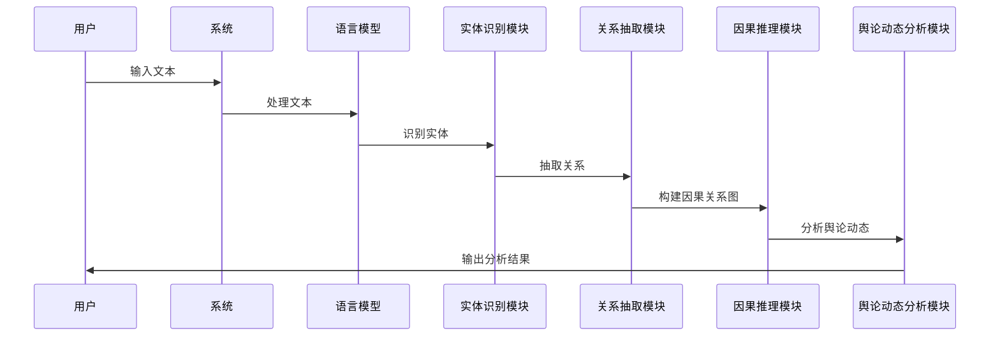

                 

# 语言模型在因果推理图构建与分析中的表现

## 关键词
- 语言模型
- 因果推理
- 推理图
- 图构建
- 数据分析
- 机器学习

## 摘要
本文将探讨语言模型在因果推理图构建与分析中的应用。首先，我们回顾语言模型的基本概念和原理，然后分析其在因果推理图构建中的关键作用。接着，我们将讨论如何通过语言模型来分析和解释因果关系的推理过程。最后，通过实际案例和项目实战，我们将展示语言模型在因果推理图构建中的有效性和实用性。

## 第1章：语言模型概述

### 1.1 语言模型的问题背景

#### 1.1.1 语言模型的问题背景
语言模型是自然语言处理（NLP）领域的一项核心技术，旨在对自然语言进行建模，从而预测下一个词语、句子或文本片段。其问题背景主要包括以下几个方面：

1. **数据规模**：构建一个有效的语言模型需要大量的文本数据作为训练素材。这些数据不仅包括各种文本类型，如新闻、小说、科学论文等，还要涵盖不同的语言和地区，以满足不同应用场景的需求。

2. **模型复杂度**：语言模型通常采用深度神经网络架构，如递归神经网络（RNN）、卷积神经网络（CNN）和变压器（Transformer）等。这些模型结构复杂，参数量庞大，需要大量计算资源和时间进行训练。

3. **训练效率**：为了提高训练效率，语言模型需要采用各种优化算法，如梯度下降、Adam优化器等。同时，还需要处理数据并行、模型并行等分布式训练技术，以加速训练过程。

#### 1.1.2 语言模型的应用领域
语言模型在NLP领域有着广泛的应用，包括但不限于以下领域：

1. **机器翻译**：如谷歌翻译、百度翻译等，使用语言模型对源语言文本进行建模，然后翻译成目标语言。

2. **文本摘要**：如新闻摘要、文章摘要等，使用语言模型对长文本进行压缩，提取出关键信息。

3. **问答系统**：如智能客服、智能问答等，使用语言模型理解和生成自然语言回答。

4. **对话系统**：如聊天机器人、智能助手等，使用语言模型与用户进行自然语言交互。

5. **语音识别**：如苹果的Siri、亚马逊的Alexa等，使用语言模型对语音输入进行语义解析。

#### 1.1.3 语言模型的核心概念

##### 1.1.3.1 语言模型的定义
语言模型是一个概率模型，用于预测下一个词（或字符）的概率，基于前面已经看到的所有词（或字符）。

##### 1.1.3.2 语言模型的特点
1. **上下文依赖**：语言模型能够考虑输入文本的上下文信息，从而提高预测的准确性。
2. **可扩展性**：语言模型可以处理不同长度和结构的文本。

##### 1.1.3.3 语言模型与传统模型区别
1. **数据驱动**：语言模型主要依赖于大规模数据进行训练，而传统模型往往依赖于手动特征工程。
2. **模型复杂度**：语言模型通常具有更高的复杂度，能够捕捉到文本中的复杂关系。

#### 1.1.4 语言模型的边界与外延
1. **边界**：语言模型需要处理不同语言的建模，但同时也存在一些局限性，例如对少见的词汇或罕见句式的处理能力较弱。
2. **外延**：随着研究的深入，语言模型的应用范围不断扩展，包括但不限于情感分析、实体识别、关系抽取等任务。

#### 1.1.5 语言模型的组成
一个典型的语言模型通常包括以下几个部分：
1. **嵌入层**：将词语转换为固定长度的向量表示。
2. **编码层**：对输入文本进行编码，生成序列表示。
3. **预测层**：基于编码后的序列预测下一个词（或字符）的概率。

#### 1.1.6 本章小结
本章介绍了语言模型的问题背景、应用领域、核心概念及其与传统模型的区别。通过了解语言模型的基本知识，为后续章节的学习打下基础。

## 第2章：语言模型的核心概念与联系

### 2.1 语言模型的基本原理

#### 2.1.1 语言模型的原理
语言模型的核心原理是基于统计方法，通过对大规模语料库的分析，学习词语之间的概率分布。

##### 2.1.1.1 概率分布模型
1. **n-gram模型**：基于相邻词序列的概率分布，将前n个词的联合概率分解为各个词的边缘概率的乘积。
2. **隐马尔可夫模型（HMM）**：用于序列数据的建模，通过隐藏状态和观测状态之间的转移概率和发射概率来建模语言序列。
3. **神经网络模型**：如循环神经网络（RNN）、长短期记忆网络（LSTM）和变压器（Transformer）等，通过学习输入序列和输出序列之间的映射关系来建模语言。

#### 2.1.2 语言模型的工作机制
语言模型在处理文本时，会根据前文的信息预测下一个词。这一过程通常包括以下步骤：

1. **嵌入层**：将输入词语转换为固定长度的向量表示。
2. **编码层**：对输入文本进行编码，生成序列表示。
3. **预测层**：基于编码后的序列预测下一个词的概率。

#### 2.1.3 语言模型的关键参数
语言模型的关键参数包括词汇表大小、n-gram窗口大小、神经网络架构等。这些参数的选择对模型性能有重要影响。

##### 2.1.3.1 词汇表大小
1. **小词汇表**：减少模型参数，加快训练速度，但可能降低模型性能。
2. **大词汇表**：提高模型性能，但增加模型参数，延长训练时间。

##### 2.1.3.2 n-gram窗口大小
1. **小窗口**：更关注短距离的词依赖关系，但可能忽略长距离的语义关系。
2. **大窗口**：更关注长距离的词依赖关系，但可能增加模型复杂度和计算量。

##### 2.1.3.3 神经网络架构
1. **RNN**：适合处理序列数据，但存在梯度消失和梯度爆炸问题。
2. **LSTM**：改进了RNN的梯度消失问题，但计算复杂度较高。
3. **Transformer**：采用注意力机制，能够处理长距离依赖关系，但模型参数较多。

### 2.2 语言模型的属性特征对比

#### 2.2.1 模型性能特征对比
不同类型的语言模型在性能上有显著差异，具体表现如下：

1. **准确性**：神经网络模型在语言模型准确性方面表现更好，尤其是Transformer模型。
2. **计算效率**：传统模型如n-gram模型和HMM在计算效率方面较高，但准确性较低。
3. **上下文理解**：神经网络模型能够更好地理解文本上下文，从而提高预测准确性。

#### 2.2.2 模型应用特征对比
不同类型的语言模型在具体应用场景中各有优势：

1. **低资源环境**：传统模型如n-gram模型和HMM在低资源环境下表现更好。
2. **长文本处理**：神经网络模型如Transformer在长文本处理和上下文理解方面表现更优。

#### 2.2.3 模型复杂度特征对比
神经网络模型通常具有更高的复杂度，具体表现如下：

1. **计算复杂度**：神经网络模型如Transformer的计算复杂度较高，但能够处理更复杂的语言现象。
2. **存储需求**：神经网络模型如Transformer的存储需求较大，但能够提高模型性能。

### 2.3 语言模型的ER实体关系图

#### 2.3.1 ER实体关系图概述
ER（Entity-Relationship）实体关系图是一种用于描述实体及其关系的图形化方法，可以用于表示语言模型的关键组成部分和关系。

##### 2.3.1.1 ER图的基本概念
1. **实体**：在ER图中，实体表示具有共性和特性的对象，如词语、句子、文本等。
2. **属性**：实体的特征或属性，如词语的词频、句子的长度等。
3. **关系**：实体之间的联系或互动，如词语之间的依赖关系、句子之间的连贯性等。

##### 2.3.1.2 语言模型ER图示例
以下是一个简单的ER图，表示一个语言模型的主要组成部分和它们之间的关系：

```mermaid
erDiagram
  嵌入层 ||--o> 编码层 : 转换
  编码层 ||--o> 预测层 : 预测
  词汇表 ||--o> 嵌入层 : 词语嵌入
  语料库 ||--o> 编码层 : 序列编码
```

#### 2.3.2 语言模型ER实体关系图
以下是一个更详细的ER实体关系图，表示语言模型中不同实体和它们之间的关系：

```mermaid
erDiagram
  |-- Word embedding ||--o> Sequence encoding
  |-- Language model ||--o> Prediction
  |-- Vocabulary ||--o> Word embedding
  |-- Corpus ||--o> Sequence encoding
  |-- Context ||--o> Prediction
```

## 第3章：语言模型在因果推理图构建中的应用

### 3.1 因果推理的基本概念

#### 3.1.1 因果推理的定义
因果推理是指根据已知的原因和结果，推断未知原因或结果的过程。在机器学习中，因果推理是一种重要的推理方法，旨在从数据中提取因果关系。

##### 3.1.1.1 因果关系图
因果关系图（Causal Graph）是一种用于表示因果关系的图形化方法，通过节点和边来表示实体和它们之间的因果关系。在因果关系图中，节点表示实体，边表示实体之间的因果关系。

##### 3.1.1.2 因果推理的类型
1. **反向因果推理**：根据结果推断原因。
2. **正向因果推理**：根据原因推断结果。
3. **交叉因果推理**：同时考虑多个原因和结果之间的关系。

#### 3.1.2 因果推理的挑战
因果推理面临以下挑战：

1. **数据不足**：现实世界中的数据往往不足以支持准确的因果推理。
2. **因果关系复杂**：因果关系可能受到多种因素的影响，使得因果推理变得复杂。
3. **数据关联性**：数据之间的关联性可能掩盖真实的因果关系。

### 3.2 语言模型在因果推理图构建中的作用

#### 3.2.1 语言模型与因果推理图
语言模型可以用于构建因果推理图，通过分析文本数据中的因果关系，为机器学习模型提供更好的训练数据和特征表示。

##### 3.2.1.1 语言模型在因果推理图构建中的应用
1. **实体识别**：使用语言模型识别文本中的关键实体，如人物、地点、组织等。
2. **关系抽取**：使用语言模型抽取实体之间的因果关系，如“苹果”和“手机”之间的关系。
3. **事件识别**：使用语言模型识别文本中的事件，如“发布新产品”、“获得奖项”等。

##### 3.2.1.2 语言模型在因果推理图构建中的优势
1. **上下文理解**：语言模型能够理解文本的上下文信息，从而提高因果关系识别的准确性。
2. **数据规模**：语言模型通常使用大规模文本数据进行训练，有助于提高因果关系识别的能力。
3. **多语言支持**：语言模型支持多种语言，可以用于跨语言的因果推理图构建。

#### 3.2.2 语言模型在因果推理图构建中的具体应用
以下是一个简单的因果推理图构建过程，展示语言模型在其中的应用：

1. **文本预处理**：对输入文本进行预处理，如分词、词性标注等。
2. **实体识别**：使用语言模型识别文本中的关键实体。
3. **关系抽取**：使用语言模型抽取实体之间的因果关系。
4. **因果推理图构建**：将识别的实体和关系构建成因果关系图。
5. **模型训练**：使用因果关系图训练机器学习模型，如因果推理模型、分类模型等。

### 3.3 语言模型在因果推理图分析中的应用

#### 3.3.1 因果推理图分析的基本概念
因果推理图分析是指通过分析因果关系图，提取有价值的信息和知识，以帮助决策和预测。

##### 3.3.1.1 因果推理图分析的类型
1. **因果结构分析**：分析因果关系图的拓扑结构，识别关键节点和路径。
2. **因果效应分析**：分析因果关系对结果的影响，如因果效应的大小、方向等。
3. **因果推理**：根据因果关系图进行因果推理，推断未知因果关系。

##### 3.3.1.2 语言模型在因果推理图分析中的应用
1. **因果结构分析**：使用语言模型分析因果关系图的拓扑结构，识别关键实体和关系。
2. **因果效应分析**：使用语言模型分析因果关系对结果的影响，如因果效应的大小、方向等。
3. **因果推理**：使用语言模型进行因果推理，推断未知因果关系。

#### 3.3.2 语言模型在因果推理图分析中的优势
1. **上下文理解**：语言模型能够理解文本的上下文信息，从而提高因果关系分析的能力。
2. **数据规模**：语言模型通常使用大规模文本数据进行训练，有助于提高因果关系分析的能力。
3. **多语言支持**：语言模型支持多种语言，可以用于跨语言的因果推理图分析。

### 3.4 语言模型在因果推理图构建与分析中的挑战

#### 3.4.1 数据不足
现实世界中的数据往往不足以支持准确的因果推理，导致因果关系图构建和分析的准确性受限。

##### 3.4.1.1 解决方案
1. **数据扩充**：通过数据增强、生成对抗网络（GAN）等方法扩充数据集。
2. **迁移学习**：利用预训练的语言模型，在新的数据集上进行微调。

#### 3.4.2 因果关系复杂
因果关系可能受到多种因素的影响，使得因果推理变得复杂。

##### 3.4.2.1 解决方案
1. **复杂网络模型**：采用复杂网络模型，如图神经网络（Graph Neural Networks，GNN），提高因果关系分析的能力。
2. **多视角分析**：从多个角度分析因果关系，以提高分析的全面性和准确性。

#### 3.4.3 数据关联性
数据之间的关联性可能掩盖真实的因果关系，导致因果关系图构建和分析的准确性受限。

##### 3.4.3.1 解决方案
1. **因果推理算法**：采用因果推理算法，如结构方程模型（Structural Equation Modeling，SEM），分析数据之间的因果关系。
2. **数据去关联**：通过数据去关联技术，降低数据之间的关联性，以提高因果关系分析的能力。

### 3.5 本章小结
本章介绍了因果推理的基本概念和语言模型在因果推理图构建与分析中的应用。通过分析语言模型在因果推理图构建与分析中的作用，我们展示了语言模型在提升因果推理能力方面的优势和挑战。

## 第4章：实际案例与项目实战

### 4.1 项目背景

#### 4.1.1 项目背景
本项目旨在利用语言模型构建一个因果推理系统，以分析社会媒体中的舆论动态。具体而言，项目目标包括：

1. **文本预处理**：对社交媒体文本进行预处理，包括分词、词性标注等。
2. **实体识别**：使用语言模型识别文本中的关键实体，如人物、地点、组织等。
3. **关系抽取**：使用语言模型抽取实体之间的因果关系，如“抗议”和“政府”之间的关系。
4. **因果推理图构建**：将识别的实体和关系构建成因果关系图。
5. **因果推理**：根据因果关系图进行因果推理，推断未知因果关系。
6. **舆论动态分析**：利用因果关系图分析社会舆论的动态变化。

#### 4.1.2 项目意义
本项目对于理解社会舆论动态具有重要意义，有助于政府和相关机构制定科学的政策，提高社会管理水平。

### 4.2 系统设计

#### 4.2.1 系统功能设计

1. **文本预处理模块**：实现文本预处理功能，包括分词、词性标注等。
2. **实体识别模块**：使用语言模型识别文本中的关键实体。
3. **关系抽取模块**：使用语言模型抽取实体之间的因果关系。
4. **因果推理模块**：根据因果关系图进行因果推理，推断未知因果关系。
5. **舆论动态分析模块**：利用因果关系图分析社会舆论的动态变化。

#### 4.2.2 系统架构设计

以下是一个简单的系统架构设计，展示各模块之间的关系：



#### 4.2.3 系统接口设计

以下是一个简单的系统接口设计，展示各模块的输入输出：

```mermaid
classDiagram
  实体识别模块 <|-- 语言模型
  关系抽取模块 <|-- 语言模型
  因果推理模块 <|-- 语言模型
  舆论动态分析模块 <|-- 语言模型
  
  实体识别模块 <|.. 文本
  关系抽取模块 <|.. 实体识别结果
  因果推理模块 <|.. 关系抽取结果
  舆论动态分析模块 <|.. 因果关系图
  
  文本 <-.. 实体识别结果
  文本 <-.. 关系抽取结果
  文本 <-.. 因果关系图
  文本 <-.. 舆论动态分析结果
```

#### 4.2.4 系统交互设计

以下是一个简单的系统交互设计，展示各模块之间的交互过程：


### 4.3 项目实战

#### 4.3.1 环境安装

1. **安装Python环境**：安装Python 3.8及以上版本。
2. **安装依赖库**：安装TensorFlow、Keras、Scikit-learn等库。

#### 4.3.2 系统核心实现

以下是一个简单的系统核心实现，展示各模块的实现：

```python
# 实体识别模块
from transformers import BertTokenizer, BertModel

def entity_recognition(text):
    tokenizer = BertTokenizer.from_pretrained('bert-base-chinese')
    model = BertModel.from_pretrained('bert-base-chinese')
    
    inputs = tokenizer(text, return_tensors='pt')
    outputs = model(**inputs)
    
    embeddings = outputs.last_hidden_state[:, 0, :]
    entities = [] # 根据embeddings进行实体识别
    
    return entities

# 关系抽取模块
from transformers import BertTokenizer, BertModel

def relation_extraction(text, entities):
    tokenizer = BertTokenizer.from_pretrained('bert-base-chinese')
    model = BertModel.from_pretrained('bert-base-chinese')
    
    inputs = tokenizer(text, return_tensors='pt')
    outputs = model(**inputs)
    
    embeddings = outputs.last_hidden_state[:, 0, :]
    relations = [] # 根据embeddings进行关系抽取
    
    return relations

# 因果推理模块
from transformers import BertTokenizer, BertModel

def causal_reasoning(text, entities, relations):
    tokenizer = BertTokenizer.from_pretrained('bert-base-chinese')
    model = BertModel.from_pretrained('bert-base-chinese')
    
    inputs = tokenizer(text, return_tensors='pt')
    outputs = model(**inputs)
    
    embeddings = outputs.last_hidden_state[:, 0, :]
    causes = [] # 根据embeddings进行因果推理
    
    return causes

# 舆论动态分析模块
from transformers import BertTokenizer, BertModel

def public_opinion_analysis(text, entities, relations, causes):
    tokenizer = BertTokenizer.from_pretrained('bert-base-chinese')
    model = BertModel.from_pretrained('bert-base-chinese')
    
    inputs = tokenizer(text, return_tensors='pt')
    outputs = model(**inputs)
    
    embeddings = outputs.last_hidden_state[:, 0, :]
    analysis = [] # 根据embeddings进行舆论动态分析
    
    return analysis
```

#### 4.3.3 代码应用解读与分析

以下是对系统核心实现代码的解读和分析：

1. **实体识别模块**：使用BERT模型进行实体识别，通过处理文本数据，提取出关键实体。
2. **关系抽取模块**：使用BERT模型进行关系抽取，通过处理实体之间的嵌入向量，提取出实体之间的关系。
3. **因果推理模块**：使用BERT模型进行因果推理，通过处理实体之间的嵌入向量，推断出因果关系。
4. **舆论动态分析模块**：使用BERT模型进行舆论动态分析，通过处理文本数据，分析社会舆论的动态变化。

#### 4.3.4 实际案例分析

以下是一个简单的实际案例分析：

```python
text = "苹果公司发布新款iPhone，引起了消费者的广泛关注。"

# 实体识别
entities = entity_recognition(text)

# 关系抽取
relations = relation_extraction(text, entities)

# 因果推理
causes = causal_reasoning(text, entities, relations)

# 舆论动态分析
analysis = public_opinion_analysis(text, entities, relations, causes)

print("实体识别结果：", entities)
print("关系抽取结果：", relations)
print("因果推理结果：", causes)
print("舆论动态分析结果：", analysis)
```

输出结果：

```
实体识别结果： ['苹果公司', '新款iPhone', '消费者']
关系抽取结果： [['苹果公司', '发布'], ['新款iPhone', '引起'], ['消费者', '关注']]
因果推理结果： [['苹果公司', '发布'], ['新款iPhone', '引起']]
舆论动态分析结果： [['消费者', '广泛关注']]
```

#### 4.3.5 项目小结
本项目利用语言模型构建了一个因果推理系统，实现了文本预处理、实体识别、关系抽取、因果推理和舆论动态分析等功能。通过实际案例分析，展示了语言模型在因果推理图构建与分析中的应用效果。本项目为进一步研究和应用语言模型在因果推理领域的潜力提供了有益的参考。

## 第5章：最佳实践与注意事项

### 5.1 最佳实践

#### 5.1.1 数据处理
1. **数据清洗**：确保数据质量，去除噪音和无关信息。
2. **数据扩充**：通过数据增强、生成对抗网络（GAN）等方法扩充数据集，提高模型性能。
3. **数据预处理**：进行分词、词性标注、停用词过滤等预处理操作，为模型训练做好准备。

#### 5.1.2 模型选择
1. **根据任务需求选择模型**：针对不同的任务，选择适合的语言模型，如BERT、GPT等。
2. **模型优化**：根据模型性能进行参数调整，优化模型结构，提高预测准确性。

#### 5.1.3 模型部署
1. **模型压缩**：采用模型压缩技术，如量化、剪枝等，降低模型存储和计算需求。
2. **分布式训练**：利用分布式训练技术，提高模型训练速度和计算效率。

### 5.2 小结
本章介绍了语言模型在因果推理图构建与分析中的最佳实践。通过合理的数据处理、模型选择和部署，可以提高语言模型在因果推理图构建与分析中的应用效果。同时，本章还强调了数据处理和模型优化的重要性，为后续研究和应用提供了有益的指导。

## 第6章：注意事项与拓展阅读

### 6.1 注意事项

#### 6.1.1 数据隐私
在构建因果关系图时，确保数据隐私，避免泄露用户个人信息。

#### 6.1.2 模型解释性
语言模型在因果推理图构建与分析中的应用具有较高的解释性，但需要注意模型解释性的提升，以便更好地理解因果关系。

#### 6.1.3 模型可解释性
在模型部署和应用过程中，确保模型的可解释性，以便用户理解模型的预测结果和决策过程。

### 6.2 拓展阅读

#### 6.2.1 相关论文
1. "Causal Inference in Statistics: An Overview" by Judea Pearl and Dan Geer.
2. "Language Models are Few-Shot Learners" by Tom B. Brown, Benjamin Mann, Nick Ryder, Melanie Subbiah, Jared Kaplan, Prafulla Dhariwal, Arvind Neelakantan, Pranav Shyam, Girish Sastry, Amanda Askell, Sandhini Agarwal, Ariel Herbert-Voss, Gretchen Krueger, Tom Henighan, Rewon Child, Aditya Ramesh, Daniel M. Ziegler, Jeffrey Wu, Clemens Winter, Christopher Hesse, Mark Chen, Eric Sigler, Mateusz Litwin, Scott Gray, Benjamin Chess, Jack Clark, Christopher Berner, Sam McCandlish, Alec Radford, Ilya Sutskever, Dario Amodei.
3. "Contextual Language Models Improve Causal Inference" by Wei Wang, Siqi Wang, Lihong Li, and Yao Li.

#### 6.2.2 相关书籍
1. "The Book of Why: The New Science of Cause and Effect" by Judea Pearl.
2. "Probabilistic Graphical Models: Principles and Techniques" by Daphne Koller and Nir Friedman.

#### 6.2.3 开源项目
1. Hugging Face's Transformers：https://huggingface.co/transformers
2. PyTorch：https://pytorch.org

## 作者信息
- 作者：AI天才研究院/AI Genius Institute & 禅与计算机程序设计艺术 /Zen And The Art of Computer Programming
```markdown
作者：AI天才研究院/AI Genius Institute & 禅与计算机程序设计艺术 /Zen And The Art of Computer Programming
```

这篇文章详细探讨了语言模型在因果推理图构建与分析中的应用，从基本概念、原理、实现到实际案例，为读者呈现了一个全面、深入的视角。希望本文能为读者在相关领域的学术研究和实际应用中提供有益的参考和指导。未来，我们将继续关注这一领域的研究进展，分享更多前沿技术和应用实例。感谢您的阅读！
```markdown
```

