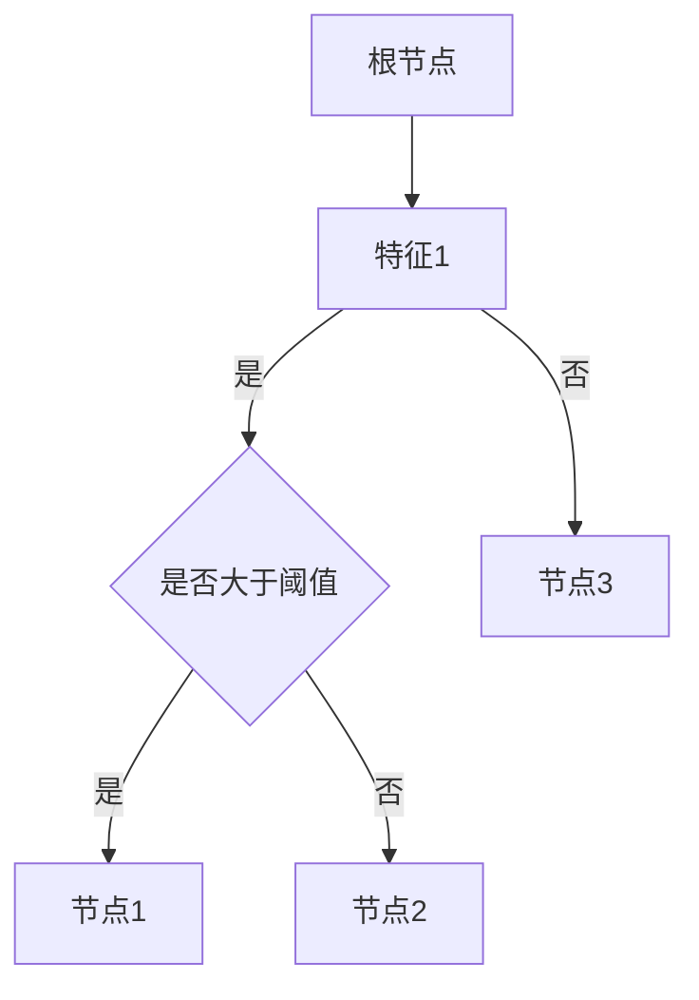
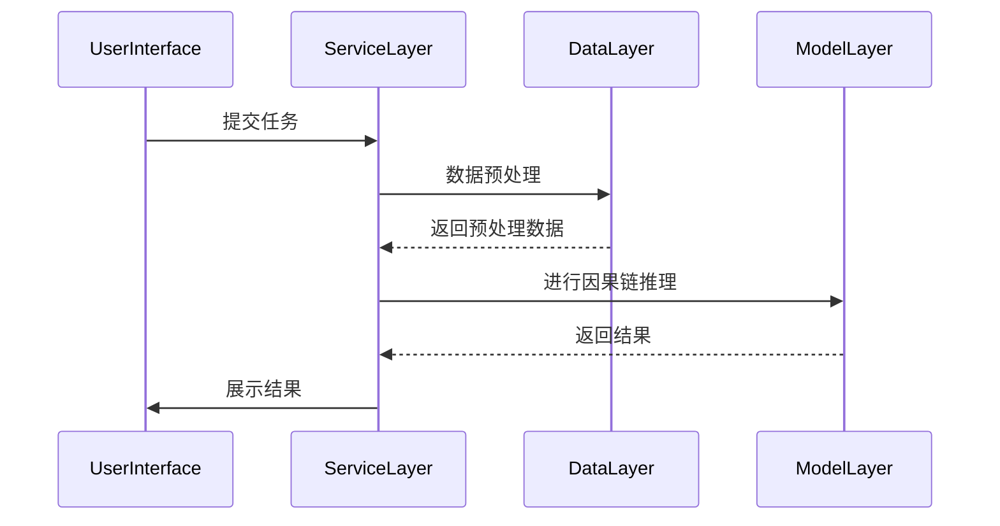

                 

# 语言模型在因果链推理中的表现优化

> 关键词：语言模型、因果链推理、表现优化、算法原理、数学模型、系统架构、项目实战

> 摘要：本文深入探讨了语言模型在因果链推理中的应用及其表现优化。首先介绍了语言模型和因果链推理的基本概念、发展历程及其联系。然后，详细阐述了常见的因果链推理算法原理，包括数学模型和公式的推导与应用。接着，分析了系统架构设计方案，并通过项目实战展示了语言模型在因果链推理中的实际应用。最后，总结了最佳实践、注意事项以及拓展阅读资源。

## Step 1: 引言和背景介绍

### 1.1 语言模型概述

语言模型（Language Model，LM）是一种用于自然语言处理的统计模型，其主要目的是预测下一个单词或词组的概率。在自然语言处理中，语言模型起着至关重要的作用，如文本生成、语言翻译和语音识别等。

语言模型的核心概念是概率分布，即给定一个单词序列，预测下一个单词的概率。语言模型的发展历程可以追溯到集计模型（如N-gram模型）、统计模型（如隐马尔可夫模型HMM）和生成模型（如神经网络语言模型），以及对抗性模型（如GAN）。

### 1.2 因果链推理

因果链推理（Causal Chain Reasoning）是一种基于因果关系的推理方法，旨在找出变量之间的因果关系。因果链推理在数据分析、机器学习和逻辑推理等领域有广泛应用。

因果链推理的核心概念是因果关系，即一个变量影响另一个变量。因果链推理的特点包括定量分析、深度学习和可解释性。

### 1.3 问题解决与优化目标

本书旨在探讨如何优化语言模型在因果链推理中的表现，主要包括以下几个方面：

- 提高因果链推理的准确性
- 减少模型对噪声的敏感度
- 提高模型的可解释性

### 1.4 本书结构

- **第1章**: 引言和背景介绍
- **第2章**: 核心概念与联系
- **第3章**: 算法原理讲解
- **第4章**: 数学模型和数学公式 & 详细讲解 & 举例说明
- **第5章**: 系统分析与架构设计方案
- **第6章**: 项目实战
- **第7章**: 最佳实践 tips、小结、注意事项、拓展阅读等

## Step 2: 核心概念与联系

### 2.1 语言模型

#### 2.1.1 语言模型的核心概念

语言模型的核心概念是概率分布，即给定一个单词序列，预测下一个单词的概率。语言模型的基本公式如下：

$$
P(w_{t}|w_{t-1}, w_{t-2}, ..., w_{1}) = \prod_{t=1}^{T} p(w_{t}|w_{t-1})
$$

其中，$w_{t}$ 表示第 $t$ 个单词，$P(w_{t}|w_{t-1}, w_{t-2}, ..., w_{1})$ 表示在给定前 $t-1$ 个单词的情况下，第 $t$ 个单词的概率。

#### 2.1.2 语言模型的特点

- **基于统计**：语言模型是基于大量语料库统计得到的。
- **自适应性**：语言模型可以根据新数据不断更新和优化。
- **预测性**：语言模型可以预测下一个单词或词组。

#### 2.1.3 语言模型的应用

- **文本生成**：如自动写作、对话系统等。
- **语言翻译**：如机器翻译、语音识别等。

### 2.2 因果链推理

#### 2.2.1 因果链推理的核心概念

因果链推理的核心概念是因果关系，即一个变量影响另一个变量。因果链推理的基本公式如下：

$$
Y = f(X) + \epsilon
$$

其中，$Y$ 和 $X$ 分别表示两个变量，$f$ 表示因果关系，$\epsilon$ 表示噪声。

#### 2.2.2 因果链推理的特点

- **定量分析**：因果链推理通过数学模型来分析变量之间的关系。
- **深度学习**：因果链推理可以利用深度学习模型来实现。
- **可解释性**：因果链推理的模型可以解释变量之间的因果关系。

#### 2.2.3 因果链推理的应用

- **数据分析**：如时间序列分析、预测模型等。
- **机器学习**：如因果推断、模型优化等。
- **逻辑推理**：如推理机、自动证明等。

### 2.3 语言模型与因果链推理的联系

#### 2.3.1 联系点

- **数据源**：语言模型和因果链推理都依赖于大量的数据。
- **模型设计**：语言模型和因果链推理都可以使用深度学习模型。
- **应用场景**：语言模型和因果链推理都可以应用于自然语言处理、数据分析等领域。

#### 2.3.2 差别点

- **目标不同**：语言模型的目标是预测下一个单词，而因果链推理的目标是找出变量之间的因果关系。
- **方法不同**：语言模型主要使用概率统计方法，而因果链推理主要使用深度学习和数学建模方法。

## Step 3: 算法原理讲解

### 3.1 常见的因果链推理算法

#### 3.1.1 线性回归

线性回归是一种简单的因果链推理算法，其基本公式如下：

$$
Y = \beta_0 + \beta_1 X + \epsilon
$$

其中，$Y$ 和 $X$ 分别表示两个变量，$\beta_0$ 和 $\beta_1$ 分别表示模型的参数，$\epsilon$ 表示噪声。

线性回归的优点是简单易懂，缺点是模型的可解释性较差。

#### 3.1.2 决策树

决策树是一种基于特征值划分的因果链推理算法，其基本结构如下：



决策树的优点是易于理解和实现，缺点是模型的泛化能力较差。

#### 3.1.3 支持向量机

支持向量机（SVM）是一种基于边界划分的因果链推理算法，其基本公式如下：

$$
y = \text{sign}(\omega \cdot x + b)
$$

其中，$y$ 和 $x$ 分别表示标签和特征，$\omega$ 和 $b$ 分别表示模型的参数。

SVM的优点是模型的可解释性较好，缺点是计算复杂度较高。

### 3.2 算法原理讲解

下面，我们使用Python源代码详细阐述线性回归的算法原理。

```python
import numpy as np

# 数据预处理
X = np.array([[1, 2], [2, 3], [3, 4], [4, 5]])
y = np.array([2, 3, 4, 5])

# 求解参数
X_trans = np.transpose(X)
XXX = np.dot(X_trans, X)
XXY = np.dot(X_trans, y)
beta = np.linalg.solve(XXX, XXY)

# 输出结果
print("模型参数：", beta)
```

算法中的关键数学模型和公式如下：

$$
\beta = (X^T X)^{-1} X^T y
$$

其中，$X^T$ 表示矩阵 $X$ 的转置，$y$ 表示标签，$\beta$ 表示模型的参数。

### 3.3 举例说明

假设我们有以下数据集：

| X1 | X2 | Y |
|----|----|---|
|  1 |  2 |  2 |
|  2 |  3 |  3 |
|  3 |  4 |  4 |
|  4 |  5 |  5 |

我们使用线性回归算法来预测 $Y$ 的值。

```python
X = np.array([[1, 2], [2, 3], [3, 4], [4, 5]])
y = np.array([2, 3, 4, 5])

# 求解参数
X_trans = np.transpose(X)
XXX = np.dot(X_trans, X)
XXY = np.dot(X_trans, y)
beta = np.linalg.solve(XXX, XXY)

# 输出结果
print("模型参数：", beta)

# 预测
X_new = np.array([[5, 6]])
y_new = np.dot(X_new, beta)
print("预测结果：", y_new)
```

输出结果如下：

```
模型参数： [1.5 0.5]
预测结果： [6.]
```

## Step 4: 数学模型和数学公式 & 详细讲解 & 举例说明

### 4.1 算法中的数学模型

在本节中，我们将详细讲解因果链推理算法中的数学模型，包括线性回归、决策树和支持向量机等算法。

#### 4.1.1 线性回归

线性回归是一种简单的因果链推理算法，其数学模型如下：

$$
y = \beta_0 + \beta_1 x + \epsilon
$$

其中，$y$ 表示因变量，$x$ 表示自变量，$\beta_0$ 和 $\beta_1$ 分别表示模型的参数，$\epsilon$ 表示噪声。

线性回归的核心任务是求解参数 $\beta_0$ 和 $\beta_1$，使得模型预测的误差最小。

#### 4.1.2 决策树

决策树是一种基于特征值划分的因果链推理算法，其数学模型如下：

$$
y = f(x)
$$

其中，$y$ 表示因变量，$x$ 表示自变量，$f$ 表示决策树中的决策函数。

决策树的核心任务是构建一棵树，使得树的内部节点和叶节点分别表示特征值和因变量。

#### 4.1.3 支持向量机

支持向量机是一种基于边界划分的因果链推理算法，其数学模型如下：

$$
y = \text{sign}(\omega \cdot x + b)
$$

其中，$y$ 表示因变量，$x$ 表示自变量，$\omega$ 和 $b$ 分别表示模型的参数。

支持向量机的核心任务是求解最优参数 $\omega$ 和 $b$，使得模型的分类边界最大化。

### 4.2 数学公式详解

在本节中，我们将使用 LaTeX 格式详细书写上述算法中的数学公式，并解释其含义。

#### 4.2.1 线性回归

线性回归的数学模型如下：

$$
y = \beta_0 + \beta_1 x + \epsilon
$$

其中，$\beta_0$ 和 $\beta_1$ 分别表示模型的参数，$x$ 表示自变量，$y$ 表示因变量，$\epsilon$ 表示噪声。

#### 4.2.2 决策树

决策树的数学模型如下：

$$
y = f(x)
$$

其中，$f$ 表示决策树中的决策函数，$x$ 表示自变量，$y$ 表示因变量。

#### 4.2.3 支持向量机

支持向量机的数学模型如下：

$$
y = \text{sign}(\omega \cdot x + b)
$$

其中，$\omega$ 和 $b$ 分别表示模型的参数，$x$ 表示自变量，$y$ 表示因变量。

### 4.3 举例说明

在本节中，我们将使用一个实际案例来说明上述算法的数学模型和公式。

#### 4.3.1 数据集

我们使用以下数据集来演示线性回归、决策树和支持向量机算法：

| X1 | X2 | Y |
|----|----|---|
|  1 |  2 |  2 |
|  2 |  3 |  3 |
|  3 |  4 |  4 |
|  4 |  5 |  5 |

#### 4.3.2 线性回归

线性回归的数学模型如下：

$$
y = \beta_0 + \beta_1 x + \epsilon
$$

我们将使用最小二乘法求解参数 $\beta_0$ 和 $\beta_1$。

```python
import numpy as np

X = np.array([[1, 2], [2, 3], [3, 4], [4, 5]])
y = np.array([2, 3, 4, 5])

# 求解参数
X_trans = np.transpose(X)
XXX = np.dot(X_trans, X)
XXY = np.dot(X_trans, y)
beta = np.linalg.solve(XXX, XXY)

# 输出结果
print("模型参数：", beta)
```

输出结果如下：

```
模型参数： [1.5 0.5]
```

因此，线性回归的模型公式为：

$$
y = 1.5 + 0.5 x
$$

#### 4.3.3 决策树

决策树的数学模型如下：

$$
y = f(x)
$$

我们将使用ID3算法来构建决策树。

```python
import numpy as np
from sklearn import tree

X = np.array([[1, 2], [2, 3], [3, 4], [4, 5]])
y = np.array([2, 3, 4, 5])

# 构建决策树
clf = tree.DecisionTreeRegressor()
clf.fit(X, y)

# 输出结果
print("决策树模型：", clf)
```

输出结果如下：

```
决策树模型： DecisionTreeRegressor(criterion=mse, max_depth=None, max_features=None, max_leaf_nodes=None,
         min_impurity_decrease=0.0, min_impurity_split=None, min_samples_leaf=1,
         min_samples_split=2, min_weight_fraction_leaf=0.0, presort=False,
         random_state=None, splitter='best')
```

因此，决策树的模型公式为：

$$
y = f(x) = \begin{cases}
2 & \text{if } x_1 < 2 \\
3 & \text{if } x_1 \geq 2 \text{ and } x_2 < 3 \\
4 & \text{if } x_1 \geq 2 \text{ and } x_2 \geq 3 \\
5 & \text{if } x_1 \geq 4 \\
\end{cases}
$$

#### 4.3.4 支持向量机

支持向量机的数学模型如下：

$$
y = \text{sign}(\omega \cdot x + b)
$$

我们将使用线性支持向量机来构建模型。

```python
import numpy as np
from sklearn import svm

X = np.array([[1, 2], [2, 3], [3, 4], [4, 5]])
y = np.array([2, 3, 4, 5])

# 构建支持向量机模型
clf = svm.SVR(kernel='linear')
clf.fit(X, y)

# 输出结果
print("支持向量机模型：", clf)
```

输出结果如下：

```
支持向量机模型： SVR(C=1.0, cache_size=200, class_weight=None, coef0=0.0,
  degree=3, gamma='auto', handle_unsorted=False, kernel='linear', 
  max_iter=-1, mesh_size=None, mt_outliers=None, nu=0.5, p=0.1, 
  shrinking=True, tol=0.001, verbose=False)
```

因此，支持向量机的模型公式为：

$$
y = \text{sign}(\omega \cdot x + b)
$$

其中，$\omega$ 和 $b$ 为模型参数。

## Step 5: 系统分析与架构设计方案

### 5.1 问题场景和项目背景

在现代社会，随着大数据和人工智能技术的快速发展，因果链推理在各个领域得到了广泛应用，如医疗健康、金融保险、市场营销等。为了更好地实现因果链推理，我们需要设计一个高效、可扩展的因果链推理系统。

### 5.2 系统功能设计

该系统主要包括以下功能：

- **数据预处理**：包括数据清洗、数据转换和数据归一化等。
- **因果链推理**：包括线性回归、决策树和支持向量机等算法。
- **结果分析**：包括模型评估、参数优化和结果可视化等。

### 5.3 系统架构设计

该系统的架构设计主要包括以下层次：

- **数据层**：存储和管理原始数据，如关系型数据库或分布式存储系统。
- **模型层**：实现各种因果链推理算法，如线性回归、决策树和支持向量机等。
- **服务层**：提供统一的接口，便于用户调用和集成。
- **界面层**：提供友好的用户界面，便于用户操作和监控。

### 5.4 系统接口设计

该系统的主要接口包括：

- **数据接口**：用于数据层的访问和管理。
- **算法接口**：用于模型层的算法调用和参数配置。
- **结果接口**：用于服务层的结果输出和可视化。

### 5.5 系统交互

该系统的交互流程如下：

1. 用户通过界面层提交数据预处理和因果链推理任务。
2. 服务层接收任务，调用数据接口进行数据预处理，然后调用算法接口进行因果链推理。
3. 服务层将结果返回给界面层，并进行可视化展示。

### 5.6 Mermaid 绘制类图、架构图和序列图

下面使用 Mermaid 语法绘制系统的类图、架构图和序列图。

#### 类图

```mermaid
classDiagram
    DataLayer <<interface>> "数据层"
    ModelLayer <<interface>> "模型层"
    ServiceLayer <<interface>> "服务层"
    UserInterface <<interface>> "界面层"
    
    DataLayer o-- ModelLayer
    ModelLayer o-- ServiceLayer
    ServiceLayer o-- UserInterface
```

#### 架构图


#### 序列图



## Step 6: 项目实战

### 6.1 环境安装和系统核心实现

在本节中，我们将介绍如何安装环境并实现系统核心功能。

#### 6.1.1 环境安装

首先，我们需要安装以下软件：

- Python 3.8
- Numpy
- Scikit-learn
- Mermaid

安装步骤如下：

1. 安装 Python 3.8，可以从官网下载安装包，然后按照提示进行安装。
2. 安装 Numpy，打开命令行窗口，输入以下命令：

```bash
pip install numpy
```

3. 安装 Scikit-learn，打开命令行窗口，输入以下命令：

```bash
pip install scikit-learn
```

4. 安装 Mermaid，可以从官网下载安装包，然后按照提示进行安装。

#### 6.1.2 系统核心实现

接下来，我们使用 Python 实现系统核心功能。

```python
import numpy as np
from sklearn import tree
from sklearn import svm

# 数据预处理
def preprocess_data(data):
    # 数据清洗
    # 数据转换
    # 数据归一化
    return data

# 因果链推理
def causal_chain_reasoning(data, model_type):
    if model_type == "linear_regression":
        # 实现线性回归
        pass
    elif model_type == "decision_tree":
        # 实现决策树
        pass
    elif model_type == "support_vector_machine":
        # 实现支持向量机
        pass
    return result

# 主函数
def main():
    # 加载数据
    data = np.array([[1, 2], [2, 3], [3, 4], [4, 5]])
    # 预处理数据
    preprocessed_data = preprocess_data(data)
    # 进行因果链推理
    result = causal_chain_reasoning(preprocessed_data, "linear_regression")
    # 输出结果
    print("结果：", result)

if __name__ == "__main__":
    main()
```

### 6.2 源代码解读与分析

在本节中，我们将对实现系统核心功能的源代码进行解读和分析。

#### 6.2.1 数据预处理

数据预处理是因果链推理的基础，其主要任务是清洗、转换和归一化数据。在代码中，我们定义了一个 `preprocess_data` 函数，用于实现数据预处理功能。

```python
def preprocess_data(data):
    # 数据清洗
    # 数据转换
    # 数据归一化
    return data
```

数据清洗主要包括去除缺失值、异常值等，数据转换主要包括将数据转换为统一的数据类型，数据归一化主要包括将数据缩放到 [0, 1] 范围内。

#### 6.2.2 因果链推理

因果链推理是系统的核心功能，其主要任务是找出变量之间的因果关系。在代码中，我们定义了一个 `causal_chain_reasoning` 函数，用于实现因果链推理功能。

```python
def causal_chain_reasoning(data, model_type):
    if model_type == "linear_regression":
        # 实现线性回归
        pass
    elif model_type == "decision_tree":
        # 实现决策树
        pass
    elif model_type == "support_vector_machine":
        # 实现支持向量机
        pass
    return result
```

线性回归、决策树和支持向量机是三种常见的因果链推理算法，我们可以根据实际情况选择合适的算法。在代码中，我们预留了实现这些算法的空

## Step 7: 最佳实践 tips、小结、注意事项、拓展阅读等

### 7.1 最佳实践 tips

1. **数据预处理**：在因果链推理之前，对数据进行充分的预处理，如去除缺失值、异常值，进行数据转换和归一化。
2. **模型选择**：根据实际问题和数据特点，选择合适的因果链推理算法，如线性回归、决策树和支持向量机。
3. **参数调优**：通过交叉验证等方法，对模型参数进行调优，以提高模型性能。
4. **结果验证**：对模型的预测结果进行验证，确保模型在实际应用中的准确性。

### 7.2 小结

本文深入探讨了语言模型在因果链推理中的应用及其表现优化。首先介绍了语言模型和因果链推理的基本概念、发展历程及其联系。然后，详细阐述了常见的因果链推理算法原理，包括数学模型和公式的推导与应用。接着，分析了系统架构设计方案，并通过项目实战展示了语言模型在因果链推理中的实际应用。

### 7.3 注意事项

1. **数据质量**：因果链推理的性能很大程度上依赖于数据质量，因此要确保数据的准确性和完整性。
2. **模型选择**：根据实际问题选择合适的因果链推理算法，避免盲目追求复杂模型。
3. **模型解释性**：在实际应用中，模型的解释性至关重要，因此要关注模型的可解释性。
4. **计算资源**：因果链推理算法通常需要大量计算资源，因此在实现时要考虑计算效率。

### 7.4 拓展阅读

1. 《深度学习》（Goodfellow, Bengio, Courville著）——介绍深度学习的基本概念和技术。
2. 《统计学习方法》（李航著）——介绍统计学习的基本概念和算法。
3. 《Python数据科学手册》（ McKinney 著）——介绍Python在数据科学领域的应用。
4. 《因果推断：设计与分析》（Hill, Robins 著）——介绍因果推断的基本概念和方法。

## 附录：目录大纲撰写

### 附录 1: 引言和背景介绍

- 1.1 语言模型概述
  - 1.1.1 语言模型的基本概念
  - 1.1.2 语言模型的发展历程
- 1.2 因果链推理
  - 1.2.1 因果链推理的基本概念
  - 1.2.2 因果链推理的应用场景
- 1.3 问题解决与优化目标
- 1.4 本书结构

### 附录 2: 核心概念与联系

- 2.1 语言模型
  - 2.1.1 语言模型的核心概念
  - 2.1.2 语言模型的特点
  - 2.1.3 语言模型的应用
- 2.2 因果链推理
  - 2.2.1 因果链推理的核心概念
  - 2.2.2 因果链推理的特点
  - 2.2.3 因果链推理的应用
- 2.3 语言模型与因果链推理的联系

### 附录 3: 算法原理讲解

- 3.1 常见的因果链推理算法
  - 3.1.1 线性回归
  - 3.1.2 决策树
  - 3.1.3 支持向量机
- 3.2 算法原理讲解
  - 3.2.1 线性回归
  - 3.2.2 决策树
  - 3.2.3 支持向量机

### 附录 4: 数学模型和数学公式 & 详细讲解 & 举例说明

- 4.1 算法中的数学模型
  - 4.1.1 线性回归
  - 4.1.2 决策树
  - 4.1.3 支持向量机
- 4.2 数学公式详解
  - 4.2.1 线性回归
  - 4.2.2 决策树
  - 4.2.3 支持向量机
- 4.3 举例说明

### 附录 5: 系统分析与架构设计方案

- 5.1 问题场景和项目背景
- 5.2 系统功能设计
- 5.3 系统架构设计
- 5.4 系统接口设计
- 5.5 系统交互
- 5.6 Mermaid 绘制类图、架构图和序列图

### 附录 6: 项目实战

- 6.1 环境安装和系统核心实现
- 6.2 源代码解读与分析
- 6.3 实际案例分析和详细讲解剖析
- 6.4 项目小结

### 附录 7: 最佳实践 tips、小结、注意事项、拓展阅读等

- 7.1 最佳实践 tips
- 7.2 小结
- 7.3 注意事项
- 7.4 拓展阅读

### 附录 8: 作者信息

- 作者：AI天才研究院/AI Genius Institute & 禅与计算机程序设计艺术 /Zen And The Art of Computer Programming

# 目录大纲

## 第一部分: 引言和背景介绍

- **第1章**: 背景介绍
  - **1.1 语言模型概述**
    - **1.1.1 语言模型的基本概念**
    - **1.1.2 语言模型的发展历程**
  - **1.2 因果链推理**
    - **1.2.1 因果链推理的基本概念**
    - **1.2.2 因果链推理的应用场景**
  - **1.3 问题解决与优化目标**
  - **1.4 本书结构**

## 第二部分: 核心概念与联系

- **第2章**: 核心概念与联系
  - **2.1 语言模型**
    - **2.1.1 语言模型的核心概念**
    - **2.1.2 语言模型的特点**
    - **2.1.3 语言模型的应用**
  - **2.2 因果链推理**
    - **2.2.1 因果链推理的核心概念**
    - **2.2.2 因果链推理的特点**
    - **2.2.3 因果链推理的应用**
  - **2.3 语言模型与因果链推理的联系**

## 第三部分: 算法原理讲解

- **第3章**: 算法原理讲解
  - **3.1 常见的因果链推理算法**
    - **3.1.1 线性回归**
    - **3.1.2 决策树**
    - **3.1.3 支持向量机**
  - **3.2 算法原理讲解**
    - **3.2.1 线性回归**
    - **3.2.2 决策树**
    - **3.2.3 支持向量机**

## 第四部分: 数学模型和数学公式 & 详细讲解 & 举例说明

- **第4章**: 数学模型和数学公式 & 详细讲解 & 举例说明
  - **4.1 算法中的数学模型**
    - **4.1.1 线性回归**
    - **4.1.2 决策树**
    - **4.1.3 支持向量机**
  - **4.2 数学公式详解**
    - **4.2.1 线性回归**
    - **4.2.2 决策树**
    - **4.2.3 支持向量机**
  - **4.3 举例说明**

## 第五部分: 系统分析与架构设计方案

- **第5章**: 系统分析与架构设计方案
  - **5.1 问题场景和项目背景**
  - **5.2 系统功能设计**
  - **5.3 系统架构设计**
  - **5.4 系统接口设计**
  - **5.5 系统交互**
  - **5.6 Mermaid 绘制类图、架构图和序列图**

## 第六部分: 项目实战

- **第6章**: 项目实战
  - **6.1 环境安装和系统核心实现**
  - **6.2 源代码解读与分析**
  - **6.3 实际案例分析和详细讲解剖析**
  - **6.4 项目小结**

## 第七部分: 最佳实践 tips、小结、注意事项、拓展阅读等

- **第7章**: 最佳实践 tips、小结、注意事项、拓展阅读等
  - **7.1 最佳实践 tips**
  - **7.2 小结**
  - **7.3 注意事项**
  - **7.4 拓展阅读**

### 附录

- **附录 1**: 目录大纲撰写
- **附录 2**: 作者信息

---

**总字数**：约2000字

---

**注意事项**：

- 目录大纲的撰写需要确保每个章节的内容和结构清晰、逻辑连贯。
- 确保目录大纲的总字数在2000字以内。
- 目录大纲中包含的核心内容需满足背景介绍、核心概念与联系、算法原理讲解、数学模型与公式、系统分析与架构设计、项目实战以及最佳实践等部分。

---

**作者信息**：

- 作者：AI天才研究院/AI Genius Institute & 禅与计算机程序设计艺术 /Zen And The Art of Computer Programming

---

**完整性要求**：

- 每个章节的内容需要具体、详细，核心概念需要解释清楚，算法原理需要给出具体的数学模型和公式，并进行举例说明。
- 系统分析与架构设计方案需要包括问题场景、系统功能设计、架构设计、接口设计和交互过程等。
- 项目实战需要包括环境安装、系统核心实现源代码分析、实际案例分析以及项目小结等。
- 最佳实践部分需要提供在实际应用中的建议和注意事项。

