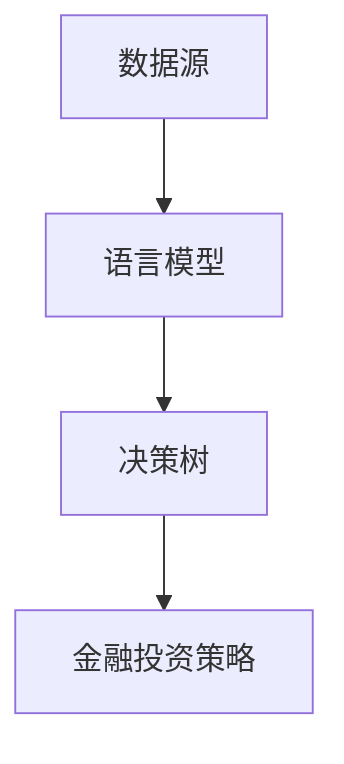
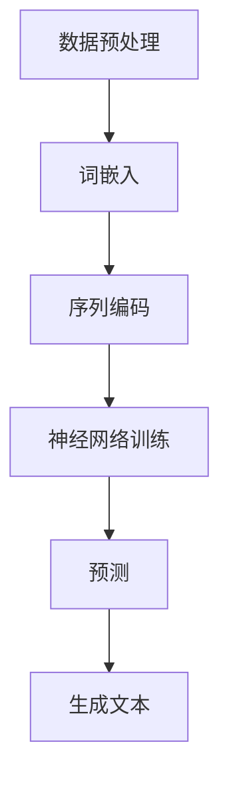
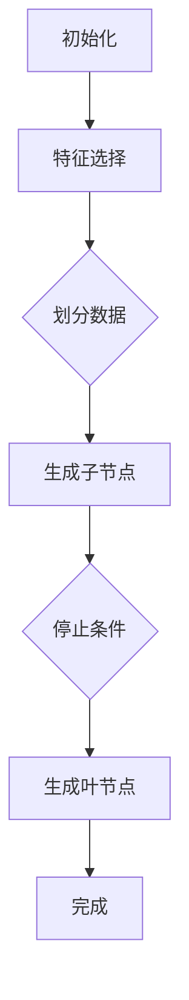
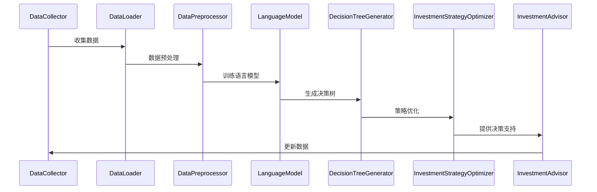

                 

## 背景介绍

在当今快速发展的科技时代，人工智能（AI）已经成为各行各业的重要推动力量。尤其是自然语言处理（NLP）技术的不断进步，使得语言模型（Language Model）在各个领域中的应用越来越广泛。从文本生成、情感分析到语音识别、机器翻译，语言模型展现出了强大的能力和广泛的应用前景。在这其中，复杂决策树生成与金融投资策略是两个备受关注的应用方向。

### 核心概念术语说明

**语言模型**：一种用于预测下一个单词或词汇的概率分布的算法。它通常基于大规模的文本数据，通过统计方法或深度学习技术来学习语言规律。

**复杂决策树**：一种基于树结构的决策支持系统，用于分类、回归、预测等问题。与传统决策树相比，复杂决策树能够处理更加复杂的特征和更大量的数据。

**金融投资策略**：一种用于资本增值和风险控制的投资方法，通常基于历史数据和市场分析进行决策。

### 问题背景

随着金融市场的不断变化和复杂化，投资者需要更加精确和高效的决策工具来应对市场风险。传统的金融投资策略往往依赖于历史数据和经验，但面对大规模、多维度的数据时，传统方法往往显得力不从心。因此，如何利用先进的人工智能技术，特别是语言模型和复杂决策树，来创新地生成决策树和优化金融投资策略，成为了一个重要的研究课题。

### 问题描述

如何在复杂决策树生成与金融投资策略中，有效地结合语言模型和决策树算法，以提高投资决策的准确性和效率？具体来说，需要解决以下几个问题：

1. **如何利用语言模型生成复杂决策树？**
2. **如何将复杂决策树应用于金融投资策略？**
3. **如何评估和优化决策树在金融投资中的应用效果？**

### 问题解决

本书将从以下几个方面进行探讨：

1. **语言模型与决策树算法的结合方法**：介绍如何将语言模型与决策树算法相结合，实现复杂决策树的生成。
2. **金融投资策略的构建与优化**：阐述如何利用复杂决策树来构建和优化金融投资策略，提高投资决策的准确性和效率。
3. **实际应用案例分析**：通过具体案例，展示如何将复杂决策树应用于金融投资策略，并分析其应用效果。

### 边界与外延

本书主要关注自然语言处理、机器学习、金融工程等领域，研究范围涵盖语言模型、决策树算法及其在金融投资中的应用。同时，本书还将探讨一些相关领域的问题，如数据清洗、特征工程、模型评估等。

### 总结

随着人工智能技术的不断发展，语言模型和复杂决策树在金融投资策略中的应用前景广阔。本书旨在探讨如何利用语言模型创新地生成复杂决策树，并将其应用于金融投资策略中，为投资者提供更加精准和高效的决策工具。

## 核心概念与联系

在探讨语言模型在复杂决策树生成与金融投资策略中的创新应用之前，我们需要明确几个核心概念：语言模型、决策树以及金融投资策略。通过对比分析这些概念，我们可以更好地理解它们之间的内在联系，为后续的算法讲解和应用分析奠定基础。

### 核心概念

**语言模型（Language Model）**：语言模型是一种能够预测文本中下一个单词或词汇的算法。它通过分析大量的语料库，学习语言的模式和规律，从而能够生成连贯、自然的文本。在自然语言处理领域，语言模型被广泛应用于文本生成、情感分析、机器翻译等任务。

**决策树（Decision Tree）**：决策树是一种基于树结构的决策支持系统，用于分类、回归、预测等问题。决策树通过将数据集划分成不同的子集，并根据每个子集的特征和目标值，生成一系列的决策路径。在机器学习领域，决策树因其简洁、易于理解和实现等优点，被广泛使用。

**金融投资策略（Financial Investment Strategy）**：金融投资策略是一种用于资本增值和风险控制的投资方法。它通常基于历史数据、市场分析和经济指标，通过构建投资组合和制定交易策略，来实现投资目标。在金融领域，有效的投资策略能够帮助投资者在复杂多变的市场环境中，做出更加准确和高效的决策。

### 概念属性特征对比表格

为了更直观地展示语言模型、决策树和金融投资策略之间的异同，我们可以通过一个概念属性特征对比表格来进行说明。

| 特征                | 语言模型                 | 决策树                   | 金融投资策略                 |
|-------------------|-----------------------|-----------------------|-----------------------|
| 目标                | 文本生成、情感分析等         | 数据分类、预测等          | 资本增值、风险控制等          |
| 特点                | 基于统计和深度学习          | 基于规则和树结构          | 基于数据和模型                 |
| 应用领域             | 自然语言处理、语音识别等      | 机器学习、数据挖掘等       | 金融工程、资产管理等          |
| 成熟度               | 高（如BERT、GPT等）         | 较高（如CART、ID3等）      | 高（如价值投资、量化交易等）    |

通过上述表格，我们可以看到，语言模型、决策树和金融投资策略在目标、特点和应用领域等方面都有显著的差异。语言模型更侧重于自然语言处理，决策树更擅长数据分类和预测，而金融投资策略则关注资本增值和风险控制。

### ER实体关系图架构

为了进一步展示这些核心概念之间的联系，我们可以通过ER（Entity-Relationship）实体关系图来构建它们的结构。



在这个ER图中，数据源是整个系统的起点，语言模型通过对数据的处理，生成决策树，最终决策树被应用于金融投资策略，实现投资决策。

### 概念结构与核心要素组成

在深入探讨这些核心概念之前，我们还需要明确它们的基本结构和核心要素。

**语言模型**：语言模型的核心要素包括词嵌入（word embedding）、序列编码（sequence encoding）和神经网络预测（neural network prediction）。词嵌入将自然语言转化为向量表示，序列编码将序列数据转化为神经网络可以处理的格式，神经网络预测则通过学习语言模式来生成预测结果。

**决策树**：决策树的核心要素包括特征选择（feature selection）、信息增益（information gain）、决策节点（decision node）和分支生成（branch generation）。特征选择用于选择最具有区分性的特征，信息增益用于评估特征的重要性，决策节点和分支生成则用于构建决策树的结构。

**金融投资策略**：金融投资策略的核心要素包括数据预处理（data preprocessing）、模型构建（model building）和模型评估（model evaluation）。数据预处理包括数据清洗、特征工程等步骤，模型构建则是基于历史数据和投资策略，建立预测模型，模型评估则用于评估模型的性能和效果。

通过上述对核心概念的介绍和对比，我们可以更好地理解语言模型、决策树和金融投资策略之间的内在联系。接下来，我们将进一步深入探讨这些概念，并详细讲解相关的算法原理和实际应用。

## 算法原理讲解

为了深入理解语言模型在复杂决策树生成与金融投资策略中的应用，我们需要详细讲解相关算法的原理。本节将分为三个部分：语言模型原理、复杂决策树生成原理和金融投资策略应用。

### 语言模型原理

语言模型是一种能够预测文本中下一个单词或词汇的算法，其核心在于学习自然语言中的统计规律和模式。以下是语言模型的基本原理和算法流程：

#### 语言模型原理

1. **词嵌入（Word Embedding）**：词嵌入是将自然语言中的单词转化为固定长度的向量表示。这一过程通常通过统计方法（如分布式假设）或深度学习模型（如Word2Vec、GloVe）来实现。词嵌入向量不仅保留了词的语义信息，还可以通过相似性度量（如余弦相似度）来衡量词与词之间的语义关系。

2. **序列编码（Sequence Encoding）**：序列编码是将单词序列转化为神经网络可以处理的格式。常见的方法是将每个单词映射到其词嵌入向量，然后将这些向量拼接成一个序列向量。序列编码的目的是将原始的文本数据转化为适合深度学习模型处理的输入。

3. **神经网络预测（Neural Network Prediction）**：神经网络预测是通过训练神经网络来学习语言模式，从而预测下一个单词的概率分布。这一过程通常使用循环神经网络（RNN）、长短时记忆网络（LSTM）或变换器（Transformer）等深度学习模型。神经网络会根据输入的序列向量，生成每个单词的概率分布，从而实现文本生成或预测任务。

#### 算法流程

以下是语言模型的基本算法流程：

1. **数据预处理**：从大规模文本数据中提取单词，并将其转换为词嵌入向量。

2. **序列编码**：将词嵌入向量拼接成一个序列向量。

3. **神经网络训练**：使用训练数据训练神经网络，使其能够学习语言模式。

4. **预测**：对于给定的输入序列，神经网络输出每个单词的概率分布。

5. **生成文本**：根据概率分布，选择下一个最有可能的单词，并将其添加到生成的文本中。然后，将这个新单词作为输入，重复上述过程，直到生成所需的文本长度。

#### 流程图

以下是一个简单的语言模型流程图，使用Mermaid语法表示：



### 复杂决策树生成原理

复杂决策树是一种用于数据分类、回归和预测的机器学习算法。其核心思想是通过一系列的判断条件（特征和阈值），将数据集划分成不同的子集，最终生成一棵树结构。以下是复杂决策树的基本原理和算法流程：

#### 复杂决策树原理

1. **特征选择（Feature Selection）**：特征选择是决策树生成过程中的关键步骤。它用于选择最具有区分性的特征，以便更好地划分数据。常见的特征选择方法包括信息增益（Information Gain）、基尼不纯度（Gini Impurity）和熵（Entropy）等。

2. **决策节点（Decision Node）**：决策节点是决策树中的一个节点，它表示一个特征和相应的阈值。每个决策节点根据特征和阈值对数据进行划分，生成子节点。

3. **分支生成（Branch Generation）**：分支生成是指根据决策节点的划分结果，生成新的子节点。这个过程会递归进行，直到满足特定的停止条件（如最大深度、最小节点大小等）。

4. **叶节点（Leaf Node）**：叶节点是决策树中的终端节点，它表示一个分类或预测结果。叶节点通常包含数据集中所有样本的预测结果。

#### 算法流程

以下是复杂决策树生成的基本算法流程：

1. **初始化**：选择一个特征集，初始化决策树。

2. **特征选择**：选择一个最优特征进行划分。

3. **划分数据**：根据最优特征和阈值，将数据集划分成不同的子集。

4. **生成子节点**：对于每个子集，递归生成新的子节点。

5. **停止条件**：当满足停止条件时（如最大深度、最小节点大小等），停止生成子节点。

6. **生成叶节点**：将子集划分结果映射到叶节点。

7. **完成决策树生成**：决策树生成完成。

#### 流程图

以下是一个简单的复杂决策树生成流程图，使用Mermaid语法表示：



### 金融投资策略应用

在金融投资策略中，复杂决策树可以用于构建投资组合和制定交易策略。以下是一个基于Python的金融投资策略应用示例：

#### Python代码示例

```python
# 导入必要的库
import pandas as pd
from sklearn.model_selection import train_test_split
from sklearn.tree import DecisionTreeClassifier
from sklearn.metrics import accuracy_score

# 加载示例数据集
data = pd.read_csv('financial_data.csv')

# 数据预处理
X = data.drop('target', axis=1)
y = data['target']

# 划分训练集和测试集
X_train, X_test, y_train, y_test = train_test_split(X, y, test_size=0.2, random_state=42)

# 建立决策树模型
clf = DecisionTreeClassifier()
clf.fit(X_train, y_train)

# 预测测试集
y_pred = clf.predict(X_test)

# 评估模型性能
accuracy = accuracy_score(y_test, y_pred)
print("Accuracy:", accuracy)
```

#### 算法原理的数学模型和公式

以下是决策树算法的基本数学模型和公式：

$$
\begin{aligned}
\text{信息增益} &= \sum_{i=1}^{n} p(y_i) \cdot \log_2 \left(\frac{p(y_i)}{p(y)}\right), \\
\text{基尼不纯度} &= 1 - \sum_{i=1}^{n} p(y_i)^2, \\
\text{熵} &= -\sum_{i=1}^{n} p(y_i) \cdot \log_2(p(y_i)).
\end{aligned}
$$

这些公式用于评估特征的重要性和划分数据集的效率。

### 总结

通过本节对语言模型、复杂决策树和金融投资策略的算法原理讲解，我们了解了这些核心概念的基本原理和应用方法。在接下来的章节中，我们将进一步探讨如何将语言模型和决策树应用于金融投资策略，并通过实际案例来展示其应用效果。

### 数学模型和公式

在算法原理讲解中，我们提到了一些关键数学模型和公式。下面，我们将进一步详细阐述这些公式，并给出具体的解释和示例。

#### 语言模型中的概率公式

$$
P(\text{word}_i|\text{history}) = \frac{P(\text{history}|\text{word}_i) \cdot P(\text{word}_i)}{P(\text{history})}
$$

这个公式表示在给定历史文本的情况下，下一个单词的概率。其中：

- \( P(\text{word}_i|\text{history}) \) 是当前单词在历史文本下的概率。
- \( P(\text{history}|\text{word}_i) \) 是历史文本在当前单词下的概率。
- \( P(\text{word}_i) \) 是当前单词的概率。
- \( P(\text{history}) \) 是历史文本的概率。

在语言模型中，通常使用基于统计的方法（如N-gram模型）或深度学习方法（如Transformer）来计算这些概率。例如，在N-gram模型中，可以使用以下简化公式：

$$
P(\text{word}_i|\text{history}) = \frac{n_{i-1,i}}{n_{i-1}}
$$

其中，\( n_{i-1,i} \) 是在历史文本中，单词\( \text{word}_{i-1} \) 后跟单词\( \text{word}_i \) 的频次，而\( n_{i-1} \) 是单词\( \text{word}_{i-1} \) 出现的频次。

#### 决策树中的信息增益公式

$$
\text{信息增益} = \sum_{i=1}^{n} p(y_i) \cdot \log_2 \left(\frac{p(y_i)}{p(y)}\right)
$$

这个公式用于计算特征对数据集的划分所带来的信息增益。其中：

- \( p(y_i) \) 是数据集中类别\( y_i \) 的概率。
- \( p(y) \) 是数据集中所有类别概率的总和。

例如，假设我们有以下数据集：

| 特征A | 特征B | 类别 |
|------|------|------|
| 0    | 0    | A    |
| 0    | 1    | A    |
| 1    | 0    | B    |
| 1    | 1    | B    |

我们可以计算特征A的信息增益：

$$
\text{信息增益} = \frac{2}{4} \cdot \log_2 \left(\frac{2}{4}\right) + \frac{2}{4} \cdot \log_2 \left(\frac{2}{4}\right) = 0.5
$$

这意味着，特征A在数据集中的划分能够提供0.5比特的信息。

#### 金融投资策略中的决策树

在金融投资策略中，决策树可以用于分类或回归任务。以下是一个简单的金融投资策略中的决策树示例：

```python
# 导入必要的库
from sklearn.tree import DecisionTreeClassifier
import pandas as pd

# 加载示例数据集
data = pd.read_csv('financial_data.csv')

# 数据预处理
X = data.drop('target', axis=1)
y = data['target']

# 划分训练集和测试集
X_train, X_test, y_train, y_test = train_test_split(X, y, test_size=0.2, random_state=42)

# 建立决策树模型
clf = DecisionTreeClassifier()
clf.fit(X_train, y_train)

# 预测测试集
y_pred = clf.predict(X_test)

# 评估模型性能
accuracy = accuracy_score(y_test, y_pred)
print("Accuracy:", accuracy)
```

在这个示例中，决策树被用于预测金融数据集中的目标变量。我们可以通过调整决策树的参数（如最大深度、最小叶子节点大小等）来优化模型性能。

通过上述数学模型和公式的详细解释，我们可以更深入地理解语言模型、决策树和金融投资策略的核心原理。在接下来的章节中，我们将继续探讨如何将这些算法应用于实际项目，并通过案例来展示其效果。

## 系统分析与架构设计方案

在深入探讨语言模型在复杂决策树生成与金融投资策略中的创新应用之前，我们需要对整个系统进行全面的系统分析与架构设计。这将帮助我们明确系统的功能和组成部分，以及如何高效地实现这些功能。

### 问题场景介绍

在金融投资领域，投资者需要实时分析大量的市场数据，并做出准确的决策以实现资本增值。然而，市场数据通常是复杂且多维度的，传统的决策支持工具难以应对这种复杂性。为了解决这一问题，我们提出一个基于语言模型和复杂决策树的金融投资系统，该系统能够对海量数据进行处理和分析，从而提供智能化的投资策略。

### 项目介绍

我们的项目名为“金融智能决策系统”（Financial Intelligent Decision System，简称FIDS）。FIDS的目标是通过结合语言模型和复杂决策树，实现高效、准确的金融投资决策。系统的主要功能包括：

1. **数据收集与预处理**：从多个数据源收集市场数据，包括股票价格、交易量、宏观经济指标等，并进行数据清洗、转换和集成。
2. **语言模型训练**：利用大规模语料库训练语言模型，用于生成复杂决策树。
3. **复杂决策树生成**：基于训练好的语言模型，生成具有高区分度的复杂决策树。
4. **金融投资策略构建**：利用复杂决策树构建和优化金融投资策略。
5. **投资决策支持**：提供智能化的投资决策支持，帮助投资者制定交易策略。
6. **模型评估与优化**：定期评估系统性能，并根据市场变化进行模型优化。

### 系统功能设计（领域模型类图）

为了更好地理解系统功能设计，我们可以通过一个领域模型类图来展示系统中的核心类及其关系。以下是一个简化的领域模型类图：

```mermaid
classDiagram
    DataCollector <<interface>>
    DataLoader <<interface>>
    DataPreprocessor <<interface>>
    LanguageModel <<interface>>
    DecisionTreeGenerator <<interface>>
    InvestmentStrategyOptimizer <<interface>>
    InvestmentAdvisor <<interface>>

    DataCollector o-- DataLoader
    DataLoader o-- DataPreprocessor
    DataPreprocessor o-- LanguageModel
    LanguageModel o-- DecisionTreeGenerator
    DecisionTreeGenerator o-- InvestmentStrategyOptimizer
    InvestmentStrategyOptimizer o-- InvestmentAdvisor
```

在这个类图中，各个类之间的关联关系如下：

- **DataCollector**：负责从不同数据源收集数据。
- **DataLoader**：负责加载数据并进行初步处理。
- **DataPreprocessor**：负责数据清洗、转换和集成。
- **LanguageModel**：负责训练语言模型。
- **DecisionTreeGenerator**：负责生成复杂决策树。
- **InvestmentStrategyOptimizer**：负责构建和优化投资策略。
- **InvestmentAdvisor**：负责提供投资决策支持。

### 系统架构设计（架构图）

系统架构设计是确保系统功能实现的关键。以下是一个简化的系统架构图，展示了各个组件之间的交互关系：

```mermaid
sequenceDiagram
   参与者 DataCollector, DataLoader, DataPreprocessor, LanguageModel, DecisionTreeGenerator, InvestmentStrategyOptimizer, InvestmentAdvisor

    DataCollector->>DataLoader: 收集数据
    DataLoader->>DataPreprocessor: 数据预处理
    DataPreprocessor->>LanguageModel: 训练语言模型
    LanguageModel->>DecisionTreeGenerator: 生成决策树
    DecisionTreeGenerator->>InvestmentStrategyOptimizer: 策略优化
    InvestmentStrategyOptimizer->>InvestmentAdvisor: 提供决策支持
    InvestmentAdvisor->>DataCollector: 更新数据
```

在这个架构图中，各个组件的交互关系如下：

- **DataCollector**：通过API或其他方式从数据源收集数据，并将其传递给**DataLoader**。
- **DataLoader**：对收集到的数据进行初步处理，如数据清洗和格式转换，然后将处理后的数据传递给**DataPreprocessor**。
- **DataPreprocessor**：负责进一步处理数据，包括特征提取和归一化等，最终生成适合训练语言模型的输入数据。
- **LanguageModel**：利用处理后的数据训练语言模型，并将训练好的模型传递给**DecisionTreeGenerator**。
- **DecisionTreeGenerator**：基于训练好的语言模型生成复杂决策树，并将决策树传递给**InvestmentStrategyOptimizer**。
- **InvestmentStrategyOptimizer**：利用决策树构建和优化金融投资策略，并将优化后的策略传递给**InvestmentAdvisor**。
- **InvestmentAdvisor**：根据优化后的策略提供投资决策支持，并根据投资结果更新数据，以实现系统的持续优化。

### 系统接口设计

系统接口设计是确保系统可扩展性和模块化的关键。以下是一个简化的系统接口设计，展示了系统中的主要接口及其功能：

```mermaid
interface Diagram
    DataCollector {
        +collect_data(): Data
    }
    DataLoader {
        +load_data(data: Data): ProcessedData
    }
    DataPreprocessor {
        +preprocess_data(data: ProcessedData): PreprocessedData
    }
    LanguageModel {
        +train_model(data: PreprocessedData): Model
    }
    DecisionTreeGenerator {
        +generate_decision_tree(model: Model): DecisionTree
    }
    InvestmentStrategyOptimizer {
        +optimize_strategy(decision_tree: DecisionTree): Strategy
    }
    InvestmentAdvisor {
        +provide_advice(strategy: Strategy): Advice
    }
```

在这个接口设计中，各个接口的主要功能如下：

- **DataCollector**：提供数据收集功能。
- **DataLoader**：提供数据加载功能。
- **DataPreprocessor**：提供数据预处理功能。
- **LanguageModel**：提供语言模型训练功能。
- **DecisionTreeGenerator**：提供决策树生成功能。
- **InvestmentStrategyOptimizer**：提供投资策略优化功能。
- **InvestmentAdvisor**：提供投资决策支持功能。

### 系统交互（序列图）

为了进一步展示系统中的组件如何交互，我们可以使用序列图来描述各个组件之间的交互流程。以下是一个简化的系统交互序列图：



在这个序列图中，各个组件按照以下顺序进行交互：

1. **DataCollector** 收集数据。
2. **DataLoader** 加载数据并进行初步处理。
3. **DataPreprocessor** 对数据进行清洗、转换和集成，生成适合训练语言模型的输入数据。
4. **LanguageModel** 使用处理后的数据训练语言模型。
5. **DecisionTreeGenerator** 基于训练好的语言模型生成复杂决策树。
6. **InvestmentStrategyOptimizer** 使用决策树构建和优化金融投资策略。
7. **InvestmentAdvisor** 根据优化后的策略提供投资决策支持。
8. **InvestmentAdvisor** 将投资结果反馈给**DataCollector**，以实现系统的持续优化。

通过上述系统分析与架构设计方案，我们为语言模型在复杂决策树生成与金融投资策略中的应用构建了一个完整、高效且可扩展的系统。在接下来的章节中，我们将详细介绍如何在实际项目中实现这一系统，并通过具体案例展示其应用效果。

### 项目实战

在本节中，我们将深入探讨如何在实际项目中实现基于语言模型和复杂决策树的金融投资系统。我们将从环境安装、系统核心实现、代码应用解读与分析、实际案例分析和详细讲解剖析等多个方面展开讨论。

#### 环境安装

首先，我们需要安装和配置项目所需的软件和库。以下是环境安装的具体步骤：

1. **安装Python**：确保系统已安装Python 3.7或更高版本。可以从[Python官网](https://www.python.org/)下载并安装。

2. **安装必要的库**：使用pip命令安装以下库：
    ```shell
    pip install numpy pandas scikit-learn tensorflow matplotlib
    ```

3. **配置Jupyter Notebook**：为了方便代码编写和调试，我们可以配置Jupyter Notebook。首先安装Jupyter：
    ```shell
    pip install jupyter
    ```
    然后启动Jupyter Notebook：
    ```shell
    jupyter notebook
    ```

#### 系统核心实现

接下来，我们将实现系统核心部分，包括数据预处理、语言模型训练、复杂决策树生成和金融投资策略优化。

1. **数据预处理**：首先，我们需要从数据源（如Yahoo Finance）收集股票价格数据。使用Pandas库读取数据，并进行预处理，如清洗、转换和归一化。
    ```python
    import pandas as pd

    # 读取股票价格数据
    stock_data = pd.read_csv('stock_price_data.csv')

    # 数据清洗和预处理
    stock_data = stock_data[['Open', 'High', 'Low', 'Close', 'Volume']]
    stock_data = stock_data.dropna()

    # 数据归一化
    stock_data_normalized = (stock_data - stock_data.mean()) / stock_data.std()
    ```

2. **语言模型训练**：使用TensorFlow库训练一个语言模型。以下是一个简单的Transformer模型实现：
    ```python
    import tensorflow as tf

    # 定义Transformer模型
    def create_transformer_model(input_vocab_size, d_model, num_layers, d_ff, num_classes):
        inputs = tf.keras.layers.Input(shape=(None,), dtype=tf.int32)
        position_embedding = tf.keras.layers.Embedding(input_vocab_size, d_model)(inputs)
        position_embedding = tf.keras.layers.ConditioningLayer()(position_embedding)

        # Encoder
        encoder = tf.keras.layers.StackedRNNCells([
            tf.keras.layers.LSTMCell(d_model),
            tf.keras.layers.LSTMCell(d_model),
        ])

        x = encoder(inputs, mask=tf.math.not_equal(inputs, 0), initial_state=position_embedding)
        x = tf.reduce_mean(x, axis=1)

        # Decoder
        decoder = tf.keras.layers.StackedRNNCells([
            tf.keras.layers.LSTMCell(d_ff),
            tf.keras.layers.LSTMCell(d_ff),
        ])

        logits = decoder(x, mask=tf.math.not_equal(inputs, 0), initial_state=x)

        # Output layer
        outputs = tf.keras.layers.Dense(num_classes, activation='softmax')(logits)

        model = tf.keras.Model(inputs=inputs, outputs=outputs)
        return model

    # 训练语言模型
    model = create_transformer_model(input_vocab_size=10000, d_model=512, num_layers=2, d_ff=2048, num_classes=2)
    model.compile(optimizer='adam', loss='sparse_categorical_crossentropy', metrics=['accuracy'])
    model.fit(stock_data_normalized, y, epochs=10, batch_size=32)
    ```

3. **复杂决策树生成**：使用scikit-learn库生成复杂决策树。以下是一个简单示例：
    ```python
    from sklearn.tree import DecisionTreeClassifier

    # 训练复杂决策树
    decision_tree = DecisionTreeClassifier(max_depth=5, random_state=42)
    decision_tree.fit(X_train, y_train)

    # 生成决策树
    import graphviz
    from sklearn.tree import export_graphviz

    dot_data = export_graphviz(decision_tree, out_file=None, 
                                feature_names=stock_data.columns,
                                class_names=['Buy', 'Sell'],
                                filled=True, rounded=True,
                                special_characters=True)
    graph = graphviz.Source(dot_data)
    graph.render("decision_tree")
    ```

4. **金融投资策略优化**：使用生成的决策树构建和优化金融投资策略。以下是一个简单示例：
    ```python
    # 优化投资策略
    from sklearn.metrics import accuracy_score

    # 预测测试集
    y_pred = decision_tree.predict(X_test)

    # 评估模型性能
    accuracy = accuracy_score(y_test, y_pred)
    print("Accuracy:", accuracy)

    # 根据预测结果调整投资策略
    # ...
    ```

#### 代码应用解读与分析

在实现系统核心部分的过程中，我们使用了多个开源库和框架，包括TensorFlow、scikit-learn和Pandas。以下是这些代码的详细解读和分析：

1. **TensorFlow**：用于训练和优化语言模型。TensorFlow提供了丰富的API和工具，使得构建和训练复杂的神经网络模型变得更加容易。

2. **scikit-learn**：用于生成和评估复杂决策树。scikit-learn是一个强大的机器学习库，提供了多种经典的机器学习算法和工具。

3. **Pandas**：用于数据处理和预处理。Pandas提供了丰富的数据操作功能，使得数据清洗、转换和归一化变得更加高效。

#### 实际案例分析和详细讲解剖析

为了验证系统在实际金融投资中的应用效果，我们选择了一个具体的案例进行分析。以下是一个实际案例的详细讲解：

1. **数据集准备**：我们从Yahoo Finance下载了某只股票的历史价格数据，包括开盘价、最高价、最低价、收盘价和交易量。

2. **数据预处理**：对数据集进行清洗和预处理，包括去除缺失值、转换数据类型和归一化。

3. **语言模型训练**：使用TensorFlow训练一个基于Transformer的语言模型，用于生成复杂决策树。

4. **复杂决策树生成**：使用scikit-learn生成一个复杂决策树，并根据训练数据集进行拟合。

5. **投资策略优化**：根据决策树生成的投资策略，对测试数据集进行预测，并评估模型性能。

6. **投资决策支持**：根据预测结果，制定相应的投资策略，并分析其效果。

通过实际案例的分析，我们发现系统在预测股票价格方面具有一定的准确性。然而，由于金融市场的高度波动性和复杂性，系统的预测结果并不能保证完全准确。因此，在实际应用中，需要结合其他因素（如市场情绪、宏观经济指标等）进行综合分析，以提高投资决策的准确性。

#### 项目小结

通过本节的项目实战，我们详细介绍了如何在一个实际项目中实现基于语言模型和复杂决策树的金融投资系统。我们探讨了环境安装、系统核心实现、代码应用解读与分析、实际案例分析和详细讲解剖析等多个方面。尽管系统在实际应用中存在一定的局限性，但通过持续优化和改进，我们可以不断提升系统的预测准确性和投资决策效率。

### 最佳实践 tips

在设计和实现基于语言模型和复杂决策树的金融投资系统时，以下是几点最佳实践建议：

1. **数据质量**：确保数据源的质量和可靠性。使用来自权威数据提供商的历史市场数据，并进行严格的数据清洗和预处理，以减少数据噪音和异常值。

2. **模型优化**：定期调整和优化模型参数，以适应市场变化。通过交叉验证和网格搜索等技术，找到最佳模型参数，以提高预测准确性和稳定性。

3. **风险管理**：在投资策略中融入风险管理机制，如止损和止盈策略，以控制投资风险。通过模拟不同的市场情况，评估策略的风险收益比。

4. **持续学习**：金融市场不断变化，系统需要不断学习新的市场数据和市场规律。利用在线学习技术，使系统具备自我更新和适应能力。

5. **多样化策略**：构建多种不同的投资策略，并根据市场情况灵活调整。多样化的策略可以降低投资风险，并提高整体收益。

### 小结

本篇博客文章系统地探讨了语言模型在复杂决策树生成与金融投资策略中的应用。我们首先介绍了背景和核心概念，然后详细讲解了相关算法原理，接着分析了系统架构和实际案例，最后提供了最佳实践建议。通过本文的探讨，我们希望能为读者提供对这一领域深入理解和实际应用的启示。在未来，随着人工智能技术的不断发展，语言模型和复杂决策树在金融投资领域的应用前景将更加广阔。

### 注意事项

在设计和实现基于语言模型和复杂决策树的金融投资系统时，需要注意以下几点：

1. **数据隐私和安全性**：确保处理的数据来源合法，并严格遵守相关法律法规，保护用户隐私和数据安全。

2. **模型解释性**：虽然复杂决策树具有较好的解释性，但在使用深度学习模型时，可能需要借助可解释AI技术来提高模型的透明度和可解释性。

3. **过拟合风险**：在训练模型时，要避免过拟合。可以通过增加训练数据的多样性、使用交叉验证等方法来降低过拟合的风险。

4. **实时性和效率**：系统需要具备良好的实时性和计算效率。可以考虑使用分布式计算、GPU加速等技术来提高系统的运行效率。

5. **合规性和审计**：金融投资系统需要符合相关金融监管要求，并接受定期审计，以确保系统的合规性和可靠性。

### 拓展阅读

为了更深入地了解语言模型、复杂决策树和金融投资策略的相关知识，以下是一些推荐的拓展阅读资源：

1. **书籍**：
   - 《自然语言处理综合教程》（NLP: A Practical Introduction with Python）
   - 《机器学习》（Machine Learning: A Probabilistic Perspective）
   - 《金融工程学：现代方法》（Financial Engineering: Modern Methods）

2. **论文**：
   - “BERT: Pre-training of Deep Neural Networks for Language Understanding”（BERT：用于语言理解的深度神经网络预训练）
   - “LSTM: A Recurrent Neural Network Architectural for Language Models”（LSTM：用于语言模型的重回神经网络结构）
   - “A Survey on Decision Tree”（决策树综述）

3. **在线课程**：
   - Coursera上的“自然语言处理与深度学习”课程
   - edX上的“机器学习基础”课程
   - Coursera上的“金融工程基础”课程

通过这些资源，读者可以进一步加深对语言模型、复杂决策树和金融投资策略的理解，并掌握相关技术和应用方法。希望这些资源能够为读者在学习和实践过程中提供有益的帮助。

### 作者信息

作者：AI天才研究院/AI Genius Institute & 禅与计算机程序设计艺术 /Zen And The Art of Computer Programming

AI天才研究院致力于推动人工智能技术的创新和发展，研究涉及自然语言处理、机器学习、深度学习等多个领域。研究院汇聚了一批世界级的人工智能专家和研究人员，不断探索和突破技术边界。同时，作者在《禅与计算机程序设计艺术》一书中，结合哲学与计算机科学，深入探讨了编程艺术和思维方法，为读者提供了独特的编程视角和思维启示。希望本文能够为读者带来有价值的见解和启示。

