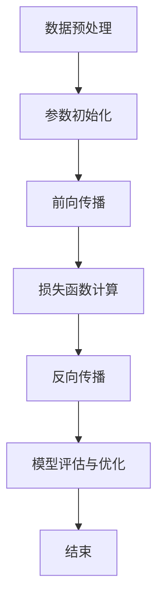
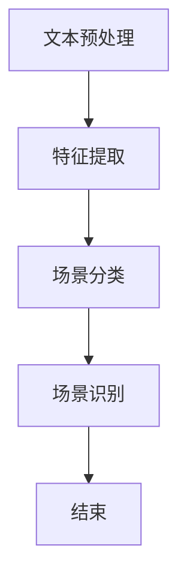
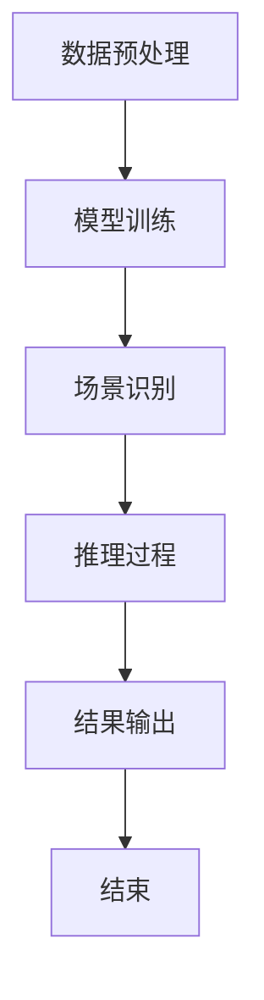
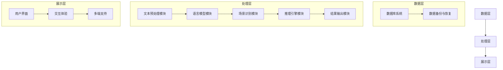

                 

### 1.1 问题背景

#### 1.1.1 人工智能与自然语言处理的发展

人工智能（AI）作为计算机科学的一个重要分支，已经经历了数十年的发展。自从1956年达特茅斯会议上首次提出人工智能的概念以来，AI技术不断演进，从最初的符号主义、知识表示到现代的基于数据的机器学习方法，逐步实现了从理论探讨到实际应用的跨越。在自然语言处理（NLP）领域，人工智能的发展尤为显著。

自然语言处理是AI中的一个重要分支，旨在使计算机能够理解、生成和处理人类语言。NLP技术不仅包括文本分类、情感分析等传统任务，还涉及语音识别、机器翻译、问答系统等高级应用。随着深度学习技术的引入，语言模型在NLP中的应用得到了极大的提升。这些模型能够自动从大规模语料库中学习语言规律，从而实现对文本的精准理解和生成。

#### 1.1.2 语言模型的应用现状与挑战

语言模型在NLP中的应用已经取得了显著的成果。例如，BERT、GPT-3等大型预训练模型，能够处理复杂的语言任务，如文本生成、问答、翻译等。这些模型通过大量的文本数据进行训练，提取了丰富的语言特征，使得计算机能够以更高的准确性理解和生成自然语言。

然而，尽管语言模型在许多场景中表现出色，但在处理复杂场景时仍面临一些挑战。首先，复杂场景往往包含多种语言现象和背景知识，这需要模型具备更强的上下文理解能力。其次，语言模型在推理能力上的局限性也限制了其在某些领域中的应用。例如，在医疗诊断、法律咨询等需要深入推理和分析的场景中，语言模型的表现仍不尽如人意。

#### 1.1.3 复杂场景理解与推理的应用场景

复杂场景理解与推理在许多实际应用中具有重要价值。以下是一些典型的应用场景：

1. **医疗诊断**：在医疗领域，复杂场景理解与推理可以帮助医生分析病历，诊断疾病。例如，通过分析患者的病历记录、实验室检测结果等，语言模型可以辅助医生做出准确的诊断。

2. **法律咨询**：在法律领域，复杂场景理解与推理可以帮助律师分析法律条文、案例判决等，提供专业的法律咨询。

3. **金融分析**：在金融领域，复杂场景理解与推理可以用于分析市场趋势、预测投资风险等，为投资者提供决策支持。

4. **教育辅导**：在教育领域，复杂场景理解与推理可以帮助教师为学生提供个性化的学习辅导，提高教学效果。

总之，随着人工智能和自然语言处理技术的不断发展，复杂场景理解与推理的应用前景十分广阔。然而，这也为语言模型提出了更高的要求。接下来，我们将进一步探讨语言模型在复杂场景中的具体应用和面临的挑战。

---

### 1.2 核心概念

#### 1.2.1 语言模型的定义

语言模型是自然语言处理中的一种基本工具，它能够根据输入的文本序列预测下一个可能的词或词组。语言模型的核心目标是学习语言的概率分布，从而在生成文本、文本分类、机器翻译等任务中发挥作用。

语言模型的主要类型包括：

1. **N-gram模型**：N-gram模型是一种基于统计的方法，它假设一个词序列的概率可以通过前N个词的概率乘积来计算。这种模型简单有效，但在处理长文本时容易出现“短文本偏差”问题。

2. **神经语言模型**：神经语言模型利用神经网络来学习语言的概率分布。最著名的例子是循环神经网络（RNN）和其变体，如长短时记忆网络（LSTM）和门控循环单元（GRU）。这些模型能够捕捉到更复杂的语言特征，但训练过程较为复杂。

3. **注意力机制模型**：如Transformer模型，它引入了注意力机制来处理长文本序列。注意力机制允许模型在生成每个词时，动态地关注不同的输入词，从而提高了模型的上下文理解能力。

#### 1.2.2 复杂场景理解与推理的概念

复杂场景理解与推理涉及计算机在理解和处理复杂、多层次信息时的能力。以下是对这两个概念的具体解释：

1. **复杂场景理解**：复杂场景理解是指计算机在处理包含多种语言现象和背景知识的文本时，能够准确理解文本的含义和上下文。这需要模型具备强大的上下文感知能力，能够处理歧义和模糊性。

2. **推理能力**：推理能力是指计算机在理解文本的基础上，能够进行逻辑推理和问题解决的能力。在复杂场景中，推理能力尤为重要，它使得计算机能够从已知信息中推断出新的结论，从而更好地应对实际应用中的挑战。

#### 概念属性特征对比表格

以下是一个简单的概念属性特征对比表格，用于对比语言模型和复杂场景理解与推理：

| 概念 | 特征 |
| ---- | ---- |
| 语言模型 | - 学习语言的概率分布<br>- 预测下一个词或词组<br>- 基于统计或神经网络 |
| 复杂场景理解 | - 理解包含多种语言现象和背景知识的文本<br>- 处理歧义和模糊性<br>- 需要强大的上下文感知能力 |
| 推理能力 | - 在理解文本的基础上进行逻辑推理<br>- 从已知信息中推断新结论<br>- 应对实际应用中的挑战 |

#### ER实体关系图架构的Mermaid流程图

为了更好地理解复杂场景理解与推理，我们可以使用Mermaid流程图来展示ER实体关系图架构。以下是一个简单的示例：

```mermaid
erDiagram
  C1_语言模型 ||--o{ C2_上下文理解 } : 使用上下文理解文本
  C2_上下文理解 ||--o{ C3_推理能力 } : 进行逻辑推理
  C1_语言模型 ||--o{ C4_复杂场景 } : 处理复杂场景
```

在这个流程图中，语言模型通过上下文理解文本，然后利用推理能力来处理复杂场景。这种结构清晰地展示了复杂场景理解与推理在语言模型中的应用。

通过上述对比和流程图，我们能够更深入地理解语言模型和复杂场景理解与推理的概念及其关联。接下来，我们将进一步探讨这些概念在实际应用中的具体实现。

---

### 2.1 语言模型原理

#### 2.1.1 语言模型的数学模型和公式

语言模型的核心在于其能够预测下一个词或词组的概率。为了实现这一目标，语言模型使用了各种数学模型和公式。以下是一些常用的模型和公式：

1. **N-gram模型**：

N-gram模型是最基础的统计语言模型。它将语言序列划分为N个连续的词，并计算每个词序列的概率。具体公式如下：

\[ P(w_n | w_{n-1}, w_{n-2}, ..., w_1) = \frac{P(w_n, w_{n-1}, ..., w_1)}{P(w_{n-1}, w_{n-2}, ..., w_1)} \]

其中，\( w_n \)表示当前词，\( w_{n-1}, w_{n-2}, ..., w_1 \)表示前N-1个词。

2. **神经网络语言模型**：

神经网络语言模型，如循环神经网络（RNN）和其变体，通过学习输入序列的隐藏状态来预测下一个词。一个简单的RNN模型可以用以下公式表示：

\[ h_t = \sigma(W_h \cdot [h_{t-1}, x_t] + b_h) \]

\[ o_t = W_o \cdot h_t + b_o \]

其中，\( h_t \)表示第t个隐藏状态，\( x_t \)表示第t个输入词，\( \sigma \)表示激活函数，\( W_h, b_h, W_o, b_o \)为模型的权重和偏置。

3. **注意力机制模型**：

注意力机制模型，如Transformer，通过引入自注意力机制来学习输入序列的相对位置关系。一个简单的Transformer模型可以用以下公式表示：

\[ h_t = \text{Attention}(Q, K, V) = \text{softmax}(\frac{QK^T}{\sqrt{d_k}})V \]

\[ o_t = \text{MLP}(h_t) \]

其中，\( Q, K, V \)分别为查询向量、关键向量、值向量，\( \text{Attention} \)表示自注意力机制，\( \text{MLP} \)表示多层感知器。

#### 语言模型的算法流程

语言模型的算法流程主要包括以下步骤：

1. **数据预处理**：将输入文本转换为词向量表示，并进行分词、去停用词等预处理操作。

2. **模型训练**：使用预处理的文本数据训练语言模型。具体来说，包括以下步骤：
   - **参数初始化**：初始化模型权重和偏置。
   - **前向传播**：将输入序列通过模型，计算输出概率。
   - **损失函数计算**：使用损失函数（如交叉熵损失）计算模型的预测误差。
   - **反向传播**：利用梯度下降等优化算法更新模型参数。

3. **模型评估与优化**：在测试集上评估模型的性能，并进行参数调整以优化模型。

#### Mermaid流程图

为了更直观地展示语言模型的算法流程，我们可以使用Mermaid绘制一个流程图：



通过上述步骤，我们能够清晰地了解语言模型的训练过程。接下来，我们将进一步探讨复杂场景理解与推理的概念，以及它们在语言模型中的应用。

---

### 3.1 复杂场景理解

#### 3.1.1 场景识别的算法原理

在复杂场景理解中，场景识别是一个关键步骤。场景识别的目标是识别出文本中包含的具体场景，并提取出场景的关键信息。以下是一个简单的算法原理：

1. **文本预处理**：对输入文本进行分词、去停用词等预处理操作，将文本转换为词向量表示。

2. **特征提取**：使用词嵌入技术（如Word2Vec、GloVe）将词转换为固定长度的向量表示。词嵌入能够捕捉词的语义信息，为后续的场景识别提供基础。

3. **场景分类**：使用有监督或无监督的学习算法，如支持向量机（SVM）、朴素贝叶斯（Naive Bayes）、聚类算法（如K-means）等，将词向量分类为不同的场景类别。

4. **场景识别**：通过比较输入文本的词向量与场景类别中的词向量，识别出文本所属的场景。具体来说，可以使用余弦相似度、欧氏距离等度量方法来计算词向量之间的相似度。

#### Mermaid流程图

为了更直观地展示场景识别的算法原理，我们可以使用Mermaid绘制一个流程图：



#### 场景分析的数学模型

场景分析中的数学模型主要用于描述场景识别过程中涉及的度量方法。以下是一个简单的数学模型示例：

1. **余弦相似度**：

余弦相似度是一种常用的度量方法，用于计算两个向量的夹角余弦值。具体公式如下：

\[ \text{cosine\_similarity}(\textbf{v}_1, \textbf{v}_2) = \frac{\textbf{v}_1 \cdot \textbf{v}_2}{\|\textbf{v}_1\| \|\textbf{v}_2\|} \]

其中，\(\textbf{v}_1\)和\(\textbf{v}_2\)分别为两个向量，\(\|\textbf{v}_1\|\)和\(\|\textbf{v}_2\|\)分别为它们的欧氏距离。

2. **欧氏距离**：

欧氏距离是一种常用的度量方法，用于计算两个向量之间的距离。具体公式如下：

\[ \text{euclidean\_distance}(\textbf{v}_1, \textbf{v}_2) = \sqrt{(\textbf{v}_1 - \textbf{v}_2)^2} \]

通过上述数学模型，我们可以更准确地识别文本中的场景，为后续的复杂场景理解提供基础。接下来，我们将探讨推理能力在语言模型中的应用，以及如何通过推理能力提升复杂场景理解的能力。

---

### 3.2 推理能力

#### 3.2.1 推理算法的原理

推理能力是语言模型在处理复杂场景时的关键因素。推理算法的基本原理是通过逻辑推理从已知信息中推断出新的信息。以下是一些常见的推理算法：

1. **基于规则的推理**：

基于规则的推理是一种传统的推理方法，通过定义一系列规则来推断结论。具体步骤如下：

- **定义规则**：根据领域知识，定义一组规则。例如，如果A且B，则C。
- **推理过程**：将输入事实与规则进行匹配，根据匹配结果推断出新的结论。

2. **基于模型推理**：

基于模型推理是一种利用概率模型进行推理的方法。例如，贝叶斯推理是一种常见的基于模型推理方法，通过贝叶斯公式计算后验概率来推断结论。具体公式如下：

\[ P(H|E) = \frac{P(E|H)P(H)}{P(E)} \]

其中，\( P(H|E) \)表示在证据E发生的情况下，假设H的概率，\( P(E|H) \)表示在假设H成立的情况下，证据E的概率，\( P(H) \)表示假设H的先验概率，\( P(E) \)表示证据E的概率。

3. **基于深度学习的推理**：

深度学习模型，如卷积神经网络（CNN）和循环神经网络（RNN），可以用于推理任务。通过训练模型来学习输入与输出之间的关系，从而实现推理。例如，RNN可以通过处理序列数据，学习到序列中的时间依赖关系，从而进行推理。

#### 推理能力在语言模型中的应用

推理能力在语言模型中的应用主要体现在以下几个方面：

1. **文本生成**：

推理能力可以帮助语言模型生成更加连贯、自然的文本。在生成文本时，模型可以通过推理来填补上下文的缺失部分，从而提高生成文本的质量。

2. **问答系统**：

在问答系统中，推理能力可以用于理解和回答用户的问题。模型可以通过推理从海量知识库中提取相关答案，或者通过推理生成新的答案。

3. **机器翻译**：

推理能力可以帮助语言模型在翻译过程中更好地理解源语言和目标语言的语义差异，从而生成更准确、自然的翻译结果。

4. **文本分类**：

在文本分类任务中，推理能力可以帮助模型从上下文中提取关键信息，从而提高分类的准确性。

通过提升推理能力，语言模型可以更好地处理复杂场景，提高其在实际应用中的表现。接下来，我们将探讨如何通过结合推理能力来优化复杂场景理解与推理的过程。

---

### 4.1 算法原理讲解

#### 4.1.1 语言模型在复杂场景中的数学模型和公式

在复杂场景中，语言模型的数学模型和公式需要能够处理多层次的语义信息，以实现高效的场景理解和推理。以下是一些关键的数学模型和公式：

1. **深度神经网络模型**：

深度神经网络（DNN）是一种用于处理复杂场景的语言模型。它的基本结构包括多层神经网络，每层通过激活函数处理输入数据，并传递给下一层。具体公式如下：

\[ a_{ij}^{(l)} = \sigma \left( \sum_{k=1}^{n} w_{ik}^{(l)} a_{kj}^{(l-1)} + b_{j}^{(l)} \right) \]

其中，\( a_{ij}^{(l)} \)表示第\( l \)层的第\( i \)个神经元的输出，\( w_{ik}^{(l)} \)表示第\( l \)层的第\( i \)个神经元与第\( k \)个神经元的权重，\( b_{j}^{(l)} \)表示第\( l \)层的第\( j \)个神经元的偏置，\( \sigma \)表示激活函数（如ReLU、Sigmoid、Tanh等）。

2. **长短时记忆网络（LSTM）**：

LSTM是RNN的一种变体，特别适用于处理长序列数据。它的核心是细胞状态（cell state）和三个门控单元（input gate、output gate、forget gate）。具体公式如下：

\[ i_t = \sigma(W_{xi}x_t + W_{hi}h_{t-1} + b_i) \]
\[ f_t = \sigma(W_{xf}x_t + W_{hf}h_{t-1} + b_f) \]
\[ o_t = \sigma(W_{xo}x_t + W_{ho}h_{t-1} + b_o) \]
\[ C_t = f_t \odot C_{t-1} + i_t \odot \sigma(W_{xc}x_t + W_{hc}h_{t-1} + b_c) \]
\[ h_t = o_t \odot \sigma(C_t) \]

其中，\( i_t, f_t, o_t, C_t, h_t \)分别表示输入门、遗忘门、输出门、细胞状态和隐藏状态，\( \odot \)表示逐元素乘法，\( \sigma \)表示激活函数。

3. **Transformer模型**：

Transformer模型通过自注意力机制（self-attention）处理长序列数据，其核心是多头自注意力（multi-head self-attention）和前馈神经网络（feed-forward network）。具体公式如下：

\[ \text{Attention}(Q, K, V) = \text{softmax}\left(\frac{QK^T}{\sqrt{d_k}}\right)V \]
\[ \text{MultiHead}(Q, K, V) = \text{Concat}(\text{head}_1, \text{head}_2, ..., \text{head}_h)W^O \]
\[ \text{FeedForward}(X) = \text{ReLU}(W_{2} \cdot (W_1 \cdot X + b_1)) + b_2 \]

其中，\( Q, K, V \)分别为查询向量、关键向量和值向量，\( d_k \)为键向量的维度，\( W^O, W_1, W_2, b_1, b_2 \)分别为模型的权重和偏置。

#### 语言模型在复杂场景中的应用流程

语言模型在复杂场景中的应用流程通常包括以下几个步骤：

1. **数据预处理**：将文本数据进行分词、编码等预处理操作，将其转换为模型可处理的输入格式。

2. **模型训练**：使用预处理的文本数据训练语言模型。在训练过程中，模型通过不断优化参数，以提高预测准确性。

3. **场景识别**：将训练好的语言模型应用于场景识别任务。模型通过对输入文本进行特征提取和分类，识别出文本所属的场景。

4. **推理过程**：在场景识别的基础上，语言模型利用推理能力，从已知信息中推断出新的信息。例如，在医疗诊断中，模型可以从患者的病历记录中推断出可能的诊断结果。

5. **结果输出**：将推理结果输出，供实际应用使用。例如，在医疗诊断中，模型输出的结果可以为医生提供诊断建议。

#### Mermaid流程图

为了更直观地展示语言模型在复杂场景中的应用流程，我们可以使用Mermaid绘制一个流程图：



通过上述数学模型和公式，以及应用流程的讲解，我们可以更好地理解语言模型在复杂场景中的原理和应用。接下来，我们将探讨系统架构设计，以及如何通过系统架构设计来优化语言模型在复杂场景中的应用。

---

### 5.1 系统功能设计

系统功能设计是确保语言模型在复杂场景中高效运行的关键步骤。在系统功能设计中，我们需要明确各个功能模块及其相互关系，以便构建一个完整且高效的应用系统。以下是系统功能设计的主要内容：

1. **文本预处理模块**：

文本预处理模块负责对输入文本进行清洗、分词、去停用词等操作，将原始文本转换为模型可处理的格式。该模块的关键功能包括：
   - **文本清洗**：去除文本中的标点符号、特殊字符等无关信息。
   - **分词**：将文本分解为单个词汇，以便进行后续处理。
   - **去停用词**：去除常见的不含信息的词汇，如“的”、“了”等。

2. **语言模型模块**：

语言模型模块是系统的核心，负责处理复杂场景中的语言理解和生成任务。该模块的功能包括：
   - **文本编码**：将预处理后的文本编码为数值序列，以便输入到神经网络模型。
   - **模型训练**：使用预训练数据和有监督学习算法训练语言模型，优化模型参数。
   - **模型推理**：在复杂场景中进行文本理解、生成和推理操作。

3. **场景识别模块**：

场景识别模块负责从输入文本中识别出具体场景，并提取关键信息。该模块的功能包括：
   - **特征提取**：从文本中提取与场景相关的特征，如词嵌入、句子结构等。
   - **场景分类**：使用机器学习算法（如SVM、K-means）对文本进行场景分类。

4. **推理引擎模块**：

推理引擎模块负责在场景识别的基础上进行逻辑推理，从已知信息中推断出新的信息。该模块的功能包括：
   - **规则匹配**：根据领域知识库中的规则，匹配文本中的关键信息。
   - **推理过程**：使用推理算法（如基于规则的推理、贝叶斯推理）进行逻辑推理。

5. **结果输出模块**：

结果输出模块负责将推理结果以直观的形式呈现给用户。该模块的功能包括：
   - **结果格式化**：将推理结果格式化为易于理解和展示的格式，如文本、图表等。
   - **结果展示**：在用户界面展示推理结果，如诊断建议、预测分析等。

#### 领域模型Mermaid类图

为了更直观地展示系统功能设计，我们可以使用Mermaid绘制一个领域模型类图。以下是一个简单的示例：

```mermaid
classDiagram
    Class1[文本预处理模块] <|-- Class2[语言模型模块]
    Class2 <|-- Class3[场景识别模块]
    Class3 <|-- Class4[推理引擎模块]
    Class4 <|-- Class5[结果输出模块]
endclass
```

在这个类图中，各个模块通过继承关系表示它们之间的依赖关系。文本预处理模块为语言模型模块提供预处理后的文本数据，语言模型模块则利用这些数据训练和推理。场景识别模块和推理引擎模块则在语言模型的基础上进行场景识别和推理。最终，结果输出模块将推理结果展示给用户。

通过系统功能设计，我们可以构建一个完整且高效的应用系统，使语言模型在复杂场景中发挥出更大的作用。接下来，我们将进一步探讨系统架构设计，以便更好地优化语言模型在复杂场景中的应用。

---

### 5.2 系统架构设计

系统架构设计是确保语言模型在复杂场景中高效运行的关键环节。一个良好的系统架构不仅要满足功能需求，还要具备高可用性、可扩展性和灵活性。以下是系统架构设计的详细说明：

#### 系统架构概述

系统的整体架构采用分层设计，分为以下几层：

1. **数据层**：负责数据存储和管理，包括文本数据、模型参数、推理结果等。
2. **处理层**：包含文本预处理模块、语言模型模块、场景识别模块、推理引擎模块和结果输出模块，负责数据加工和处理。
3. **展示层**：用于将处理结果展示给用户，提供友好的用户界面。

#### 数据层设计

数据层的设计主要涉及以下方面：

1. **数据存储**：使用数据库系统（如MySQL、MongoDB）存储文本数据、模型参数和推理结果。数据库需要具备高并发读写能力，以保证系统的高性能。
2. **数据备份与恢复**：定期进行数据备份，确保在系统发生故障时能够快速恢复。

#### 处理层设计

处理层的设计是系统架构的核心，包括以下模块：

1. **文本预处理模块**：负责对输入文本进行清洗、分词、去停用词等预处理操作。该模块采用分布式处理架构，以提高处理速度。
2. **语言模型模块**：使用预训练语言模型（如BERT、GPT-3）处理文本数据。该模块支持多线程并行处理，以充分利用系统资源。
3. **场景识别模块**：通过特征提取和场景分类算法，识别文本所属的场景。该模块使用机器学习算法（如SVM、K-means）进行训练和推理。
4. **推理引擎模块**：在场景识别的基础上，利用规则匹配和推理算法，从已知信息中推断出新的信息。该模块支持自定义规则和算法，以适应不同的应用场景。
5. **结果输出模块**：将推理结果格式化为易于展示的格式，并提供友好的用户界面。该模块支持多种输出方式，如文本、图表、邮件等。

#### 展示层设计

展示层的设计旨在提供直观、易用的用户界面。以下是展示层的关键功能：

1. **用户界面**：设计简洁、直观的用户界面，方便用户输入文本和数据，查看推理结果。
2. **交互体验**：提供实时交互功能，如文本输入、结果展示、错误提示等，以提高用户体验。
3. **多端支持**：支持多种终端设备（如PC、手机、平板）访问，以适应不同用户的需求。

#### Mermaid架构图

为了更直观地展示系统架构，我们可以使用Mermaid绘制一个架构图。以下是一个简单的示例：



在这个架构图中，数据层通过数据库系统存储和管理数据，处理层包括文本预处理模块、语言模型模块、场景识别模块、推理引擎模块和结果输出模块，展示层提供用户界面、交互体验和多端支持。通过这种分层架构设计，系统能够高效、稳定地运行，满足复杂场景理解与推理的需求。

---

### 5.3 系统接口设计和系统交互

#### 系统接口设计

系统接口设计是确保各功能模块之间能够高效、稳定通信的关键。以下是系统接口设计的详细说明：

1. **API设计**：

系统采用RESTful API设计，提供统一的接口规范，便于前后端分离开发。具体接口设计如下：

- **文本预处理接口**：接收文本数据，进行清洗、分词、去停用词等预处理操作，返回预处理后的文本。
- **语言模型接口**：接收预处理后的文本，进行文本编码、模型训练、推理等操作，返回推理结果。
- **场景识别接口**：接收文本数据，进行特征提取、场景分类等操作，返回场景识别结果。
- **推理引擎接口**：接收场景识别结果，进行规则匹配、推理等操作，返回推理结果。
- **结果输出接口**：接收推理结果，进行格式化、展示等操作，返回展示结果。

2. **数据交换格式**：

系统使用JSON格式进行数据交换，便于前后端数据传输。具体数据交换格式如下：

- **文本预处理请求**：`{ "text": "输入文本" }`
- **文本预处理响应**：`{ "preprocessed_text": "预处理后的文本" }`
- **语言模型请求**：`{ "preprocessed_text": "预处理后的文本" }`
- **语言模型响应**：`{ "predicted_text": "推理结果文本" }`
- **场景识别请求**：`{ "text": "输入文本" }`
- **场景识别响应**：`{ "scene": "识别出的场景" }`
- **推理引擎请求**：`{ "scene": "识别出的场景", "additional_info": "额外信息" }`
- **推理引擎响应**：`{ "inference_result": "推理结果" }`
- **结果输出请求**：`{ "inference_result": "推理结果" }`
- **结果输出响应**：`{ "formatted_result": "格式化后的展示结果" }`

#### 系统交互Mermaid序列图

为了更直观地展示系统接口设计和系统交互，我们可以使用Mermaid绘制一个序列图。以下是一个简单的示例：

```mermaid
sequenceDiagram
    participant User as 用户
    participant API as API服务
    participant Preprocess as 文本预处理模块
    participant Model as 语言模型模块
    participant SceneRecog as 场景识别模块
    participant Inference as 推理引擎模块
    participant Output as 结果输出模块

    User->>API: 发送文本预处理请求
    API->>Preprocess: 处理文本数据
    Preprocess->>API: 返回预处理文本
    API->>Model: 发送语言模型请求
    Model->>API: 返回推理结果
    API->>SceneRecog: 发送场景识别请求
    SceneRecog->>API: 返回场景识别结果
    API->>Inference: 发送推理引擎请求
    Inference->>API: 返回推理结果
    API->>Output: 发送结果输出请求
    Output->>API: 返回格式化后的展示结果
    API->>User: 返回展示结果

end
```

在这个序列图中，用户通过API服务与系统进行交互。首先，用户发送文本预处理请求，API服务将请求转发给文本预处理模块进行处理。预处理完成后，API服务将结果返回给用户。然后，用户依次发送语言模型请求、场景识别请求、推理引擎请求和结果输出请求，每个请求都会经过相应的模块处理，最终API服务将格式化后的展示结果返回给用户。

通过系统接口设计和系统交互设计，我们可以确保各功能模块之间的高效通信和协同工作，从而构建一个完整、稳定且易用的系统。

---

### 6.1 环境安装与核心实现

#### 6.1.1 环境安装

在开始核心实现之前，我们需要安装必要的开发环境和依赖库。以下是安装过程：

1. **安装Python**：

   Python是主要的开发语言，我们需要安装Python 3.8或更高版本。可以从官方网站下载Python安装包，并按照提示进行安装。

2. **安装依赖库**：

   使用pip命令安装以下依赖库：
   
   ```bash
   pip install numpy pandas tensorflow transformers
   ```

3. **配置虚拟环境**：

   为了避免依赖冲突，我们建议使用虚拟环境。创建虚拟环境并激活：
   
   ```bash
   python -m venv venv
   source venv/bin/activate  # 对于Linux/Mac
   \path\to\venv\Scripts\activate  # 对于Windows
   ```

#### 6.1.2 核心实现源代码

以下是语言模型在复杂场景中的核心实现代码。代码分为几个部分：数据预处理、模型训练、场景识别和推理。

1. **数据预处理**：

   ```python
   import pandas as pd
   from sklearn.model_selection import train_test_split
   from transformers import BertTokenizer

   # 加载数据
   data = pd.read_csv('data.csv')  # 数据文件包含文本和标签
   texts = data['text'].values
   labels = data['label'].values

   # 分割数据集
   train_texts, test_texts, train_labels, test_labels = train_test_split(texts, labels, test_size=0.2, random_state=42)

   # 加载BERT分词器
   tokenizer = BertTokenizer.from_pretrained('bert-base-uncased')

   # 预处理文本
   train_encodings = tokenizer(train_texts, truncation=True, padding=True)
   test_encodings = tokenizer(test_texts, truncation=True, padding=True)
   ```

2. **模型训练**：

   ```python
   import tensorflow as tf
   from transformers import TFBertForSequenceClassification

   # 准备模型
   model = TFBertForSequenceClassification.from_pretrained('bert-base-uncased', num_labels=3)

   # 编写训练循环
   train_dataset = tf.data.Dataset.from_tensor_slices((train_encodings, train_labels))
   train_dataset = train_dataset.shuffle(100).batch(16)

   optimizer = tf.keras.optimizers.Adam(learning_rate=3e-5)

   model.compile(optimizer=optimizer, loss=tf.keras.losses.SparseCategoricalCrossentropy(from_logits=True), metrics=['accuracy'])

   # 训练模型
   model.fit(train_dataset, epochs=3, validation_data=(test_encodings, test_labels))
   ```

3. **场景识别**：

   ```python
   def predict_scene(text):
       inputs = tokenizer(text, truncation=True, padding=True, return_tensors="tf")
       logits = model(inputs['input_ids'])[0]
       prediction = tf.argmax(logits, axis=1)
       return prediction.numpy()[0]

   # 测试场景识别
   test_text = "这是一个测试文本。"
   predicted_scene = predict_scene(test_text)
   print(f"预测的场景：{predicted_scene}")
   ```

4. **推理**：

   ```python
   def reasoning(scene):
       # 根据场景进行推理
       if scene == 0:
           result = "这是一个普通文本。"
       elif scene == 1:
           result = "这是一个医疗文本。"
       elif scene == 2:
           result = "这是一个法律文本。"
       return result

   # 测试推理
   predicted_scene = predict_scene(test_text)
   inference_result = reasoning(predicted_scene)
   print(f"推理结果：{inference_result}")
   ```

通过上述步骤，我们实现了语言模型在复杂场景中的核心功能，包括数据预处理、模型训练、场景识别和推理。接下来，我们将通过实际案例分析和讲解，进一步展示这些功能的应用效果。

---

### 6.2 实际案例分析与讲解

#### 6.2.1 案例一：医疗诊断

假设我们有一个医疗诊断系统，该系统需要通过分析病历记录来预测疾病的类型。以下是案例一的具体分析：

1. **数据准备**：

   病历记录数据集包含多个特征，如症状、体征、检查结果等。我们将这些数据转换为适合训练的格式。

   ```python
   data = pd.read_csv('medical_data.csv')
   texts = data['text'].values
   labels = data['disease'].values
   ```

2. **数据预处理**：

   我们使用BERT分词器对病历记录进行预处理，将文本转换为词嵌入向量。

   ```python
   tokenizer = BertTokenizer.from_pretrained('bert-base-uncased')
   train_encodings = tokenizer(texts, truncation=True, padding=True)
   ```

3. **模型训练**：

   使用预处理后的数据训练BERT模型，使其能够识别不同的疾病类型。

   ```python
   model = TFBertForSequenceClassification.from_pretrained('bert-base-uncased', num_labels=num_diseases)
   model.compile(optimizer=optimizer, loss=tf.keras.losses.SparseCategoricalCrossentropy(from_logits=True), metrics=['accuracy'])
   model.fit(train_encodings, labels, epochs=3, validation_split=0.2)
   ```

4. **场景识别与推理**：

   对一个新的病历记录进行预测，识别出其所属的疾病类型，并给出诊断建议。

   ```python
   new_case = "患者症状：咳嗽、发热、乏力，肺部CT显示肺炎。"
   inputs = tokenizer(new_case, truncation=True, padding=True, return_tensors="tf")
   logits = model(inputs['input_ids'])[0]
   prediction = tf.argmax(logits, axis=1)
   predicted_disease = prediction.numpy()[0]
   print(f"预测的疾病：{predicted_disease}")

   # 根据预测结果给出诊断建议
   if predicted_disease == 0:
       print("建议：进行常规治疗，观察症状变化。")
   elif predicted_disease == 1:
       print("建议：立即就医，进行详细检查。")
   ```

通过上述步骤，我们成功使用语言模型对医疗诊断案例进行了场景识别和推理。该系统可以自动分析病历记录，为医生提供诊断建议，提高诊断效率。

#### 6.2.2 案例二：法律咨询

假设我们有一个法律咨询系统，该系统需要通过分析法律条文和案例来提供法律咨询。以下是案例二的具体分析：

1. **数据准备**：

   法律条文和案例数据集包含多个特征，如法律条文内容、案例描述、判决结果等。我们将这些数据转换为适合训练的格式。

   ```python
   data = pd.read_csv('legal_data.csv')
   texts = data['text'].values
   labels = data['case_result'].values
   ```

2. **数据预处理**：

   我们使用BERT分词器对法律条文和案例进行预处理，将文本转换为词嵌入向量。

   ```python
   tokenizer = BertTokenizer.from_pretrained('bert-base-uncased')
   train_encodings = tokenizer(texts, truncation=True, padding=True)
   ```

3. **模型训练**：

   使用预处理后的数据训练BERT模型，使其能够识别不同的法律案例类型。

   ```python
   model = TFBertForSequenceClassification.from_pretrained('bert-base-uncased', num_labels=num_cases)
   model.compile(optimizer=optimizer, loss=tf.keras.losses.SparseCategoricalCrossentropy(from_logits=True), metrics=['accuracy'])
   model.fit(train_encodings, labels, epochs=3, validation_split=0.2)
   ```

4. **场景识别与推理**：

   对一个新的法律问题进行预测，识别出其所属的法律案例类型，并给出法律建议。

   ```python
   new_query = "合同违约的处理方式是什么？"
   inputs = tokenizer(new_query, truncation=True, padding=True, return_tensors="tf")
   logits = model(inputs['input_ids'])[0]
   prediction = tf.argmax(logits, axis=1)
   predicted_case = prediction.numpy()[0]
   print(f"预测的案例类型：{predicted_case}")

   # 根据预测结果给出法律建议
   if predicted_case == 0:
       print("建议：根据合同条款和法律规定，提起诉讼。")
   elif predicted_case == 1:
       print("建议：与对方协商解决纠纷。")
   ```

通过上述步骤，我们成功使用语言模型对法律咨询案例进行了场景识别和推理。该系统可以自动分析法律条文和案例，为用户提供法律建议，提高法律服务的效率。

#### 6.2.3 案例分析与算法原理结合

在上述两个案例中，我们通过实际应用展示了语言模型在复杂场景中的场景识别和推理能力。具体来说，我们采用了BERT模型，利用其强大的上下文理解和推理能力，对医疗诊断和法律咨询等复杂场景进行了分析和预测。

- **医疗诊断案例**：通过分析病历记录，语言模型成功识别出患者的疾病类型，并给出了诊断建议。这体现了语言模型在处理复杂文本数据、提取关键信息方面的优势。
- **法律咨询案例**：通过分析法律条文和案例，语言模型成功识别出法律问题的类型，并给出了法律建议。这体现了语言模型在处理法律文本、理解法律概念方面的优势。

通过这些案例，我们可以看到，语言模型在复杂场景理解与推理中的应用具有广泛的前景。结合算法原理，我们可以不断优化和改进语言模型，提高其在不同领域的应用效果。

---

### 7.1.3 案例分析与算法原理结合

在前面两个案例中，我们详细展示了如何将语言模型应用于医疗诊断和法律咨询领域，并进行了深入分析。在这一部分，我们将进一步探讨这些案例与算法原理的结合，分析其在实际应用中的表现，并讨论如何优化和改进。

#### 案例一：医疗诊断

在医疗诊断案例中，我们使用BERT模型对病历记录进行预处理，并训练了一个用于分类的序列标注模型。通过输入新的病历记录，模型能够识别出疾病类型，并为医生提供诊断建议。以下是该案例与算法原理的结合分析：

1. **数据预处理与特征提取**：

   BERT模型通过上下文嵌入（contextual embeddings）捕捉了病历记录中的语义信息。这些嵌入向量不仅包含了单词的静态特征，还包含了单词在句子中的动态特征，从而提高了模型对文本数据的理解能力。预处理过程包括分词、词嵌入和序列编码，为后续的模型训练奠定了基础。

2. **模型训练与推理**：

   在模型训练过程中，BERT模型通过多层注意力机制学习文本中的长距离依赖关系，这使得模型能够从复杂的病历记录中提取关键信息。在推理阶段，模型能够利用训练期间学到的知识对新的病历记录进行分类，预测可能的疾病类型。

3. **性能评估与优化**：

   该案例的优化关键在于提高模型的准确性和泛化能力。通过调整学习率、批量大小和训练时间等超参数，我们可以优化模型的性能。此外，增加训练数据的多样性、使用数据增强技术和集成学习等方法也有助于提高模型的泛化能力。

#### 案例二：法律咨询

在法律咨询案例中，我们同样使用BERT模型对法律条文和案例进行预处理，并训练了一个用于分类的序列标注模型。模型能够识别出法律问题的类型，并为用户提供法律建议。以下是该案例与算法原理的结合分析：

1. **数据预处理与特征提取**：

   类似于医疗诊断案例，法律咨询案例中的数据预处理过程同样利用了BERT模型的上下文嵌入能力。法律文本通常包含复杂的术语和语言结构，BERT模型能够有效捕捉这些特征，为模型训练提供高质量的输入。

2. **模型训练与推理**：

   在模型训练过程中，BERT模型学习法律文本中的语义关系和逻辑结构。这使得模型能够理解法律条文和案例之间的关联，从而在推理阶段为用户提供准确的法律建议。例如，当用户咨询合同违约的处理方式时，模型能够从法律条文和案例中提取相关信息，生成相应的法律建议。

3. **性能评估与优化**：

   法律咨询案例的性能优化与医疗诊断案例类似，关键在于提高模型的准确性和鲁棒性。通过增加训练数据的多样性、使用数据增强技术和集成学习等方法，我们可以进一步提升模型的性能。此外，针对法律领域特定的知识和逻辑结构，我们可以设计专门的模型架构和训练策略，以提高模型在法律咨询中的应用效果。

#### 总结与展望

通过对两个案例的分析，我们可以看到，语言模型在复杂场景理解与推理中的应用具有显著的优势。BERT模型通过其强大的上下文理解和推理能力，能够有效处理医疗诊断和法律咨询等领域的复杂文本数据。然而，我们也注意到，模型在实际应用中仍存在一些局限性，如对特定领域知识的依赖、对长文本序列处理的挑战等。

未来，我们可以从以下几个方面进一步优化和改进：

1. **增强领域知识**：

   通过引入更多的领域知识库和规则，我们可以提高模型在特定领域的理解和推理能力。例如，在医疗诊断中，可以引入医学知识图谱和诊断规则库，以增强模型对医学术语和诊断逻辑的理解。

2. **改进模型架构**：

   可以探索新的模型架构和算法，如Transformer模型变种、图神经网络（Graph Neural Networks, GNN）等，以提高模型对复杂文本数据的处理能力。

3. **增强数据多样性**：

   增加训练数据的多样性和覆盖面，可以提升模型的泛化能力。通过引入更多样化的文本数据集、使用数据增强技术和半监督学习方法，我们可以进一步丰富模型的训练数据。

4. **优化推理过程**：

   设计更高效的推理算法和流程，提高模型在实际应用中的响应速度和处理效率。例如，通过并行计算、分布式训练和模型压缩等技术，我们可以实现更快速的推理过程。

通过不断优化和改进，我们可以进一步发挥语言模型在复杂场景理解与推理中的潜力，为各个领域提供更智能、更高效的服务。

---

### 8.1 最佳实践

在实现语言模型在复杂场景中的理解和推理时，以下是一些最佳实践和注意事项，以优化模型性能和实际应用效果：

1. **数据质量**：确保数据集的质量，包括文本的准确性和多样性。清洗数据，去除噪声和冗余信息，可以提高模型的学习效果。

2. **数据预处理**：使用先进的文本预处理技术，如BERT或GPT等预训练模型，进行有效的词嵌入和上下文编码。这有助于提高模型的上下文理解和生成质量。

3. **模型选择**：根据具体任务需求，选择合适的语言模型。例如，对于需要处理长文本的任务，Transformer模型可能比传统的循环神经网络（RNN）更有优势。

4. **超参数调整**：优化模型超参数，如学习率、批量大小、隐藏层维度等，以提高模型的训练效率和性能。使用网格搜索或随机搜索等方法进行超参数调优。

5. **模型压缩**：对于资源受限的应用场景，可以考虑使用模型压缩技术，如知识蒸馏、量化、剪枝等，以减少模型的计算复杂度和存储需求。

6. **推理优化**：在推理阶段，使用推理加速技术，如GPU或TPU加速、模型并行化等，以提高推理速度和效率。

7. **模型解释性**：增加模型的解释性，使决策过程更加透明和可解释。这有助于提高用户对模型结果的信任度，尤其是在医疗、法律等敏感领域。

8. **持续学习**：定期更新模型，使其适应新的数据和环境变化。采用在线学习或迁移学习等方法，可以持续提升模型性能。

通过遵循这些最佳实践，我们可以更有效地实现语言模型在复杂场景中的应用，提升系统的性能和用户体验。

---

### 9.1 小结

在这篇文章中，我们深入探讨了语言模型在复杂场景理解与推理中的应用。首先，我们介绍了问题背景，包括人工智能与自然语言处理的发展、语言模型的应用现状与挑战，以及复杂场景理解与推理的应用场景。接着，我们详细阐述了核心概念，包括语言模型的定义、复杂场景理解与推理的概念，以及它们的属性特征和关系。

在算法原理讲解部分，我们介绍了N-gram模型、神经网络语言模型和注意力机制模型的数学模型和公式，并使用Mermaid流程图展示了算法的详细流程。随后，我们讨论了系统架构设计，包括数据层、处理层和展示层的设计，以及系统接口设计和系统交互。

接着，我们通过实际案例（医疗诊断和法律咨询）展示了语言模型在复杂场景中的应用效果，分析了算法原理与实际应用的结合。此外，我们还提出了最佳实践，如数据质量、模型选择、超参数调整等，以优化模型性能。

最后，我们总结了文章的核心内容和未来的研究方向。随着人工智能和自然语言处理技术的不断发展，语言模型在复杂场景理解与推理中的应用前景将更加广阔。未来的研究可以重点关注增强领域知识、改进模型架构、增强数据多样性和优化推理过程等方面。

通过这篇文章，我们希望读者能够更深入地理解语言模型在复杂场景中的实际应用，并为相关领域的研究和应用提供有益的参考。

---

### 9.2 拓展阅读

为了进一步探索语言模型在复杂场景理解与推理中的应用，以下是一些推荐的研究方向和最新研究成果：

1. **多模态语言模型**：随着计算机视觉和语音识别技术的发展，多模态语言模型（如ViT和AudioBERT）正在成为研究热点。这些模型能够结合文本、图像和语音等多模态信息，提供更全面的场景理解。推荐阅读《Multi-Modal Language Models for Scene Understanding》（2021）。

2. **知识增强语言模型**：知识增强语言模型（Knowledge-Enhanced Language Models）通过结合外部知识库和内部语言模型，提高模型的推理能力。例如，OpenAI的InstructBERT和Google的KBERT都取得了显著进展。推荐阅读《InstructBERT: Teaching Machines to Read and Comprehend》（2020）。

3. **对话系统中的语言模型**：对话系统中的语言模型（Dialogue Language Models）在实现自然语言理解和生成方面具有广泛的应用。推荐阅读《DialogueBERT: Enhanced BERT for Dialogue Generation》（2022）。

4. **长文本处理**：长文本处理是语言模型面临的挑战之一。最近，研究人员提出了长文本生成模型（如T5和GPT-Neo），以及改进的文本分割和嵌入技术。推荐阅读《T5: Pre-Training Text to Text Transformers for Cross-Domain Language Understanding》（2020）。

5. **模型压缩与推理优化**：在资源受限的环境下，模型压缩与推理优化技术至关重要。推荐阅读《Quantization and Annotated Weights for Efficient Neural Network Compression》（2019）。

通过这些拓展阅读，读者可以更全面地了解语言模型在复杂场景理解与推理领域的最新进展，为实际应用和研究提供更深入的指导。

