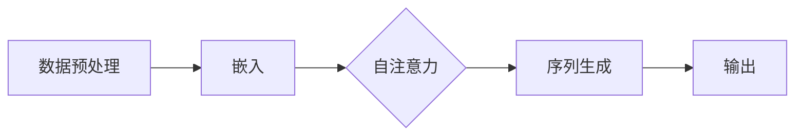
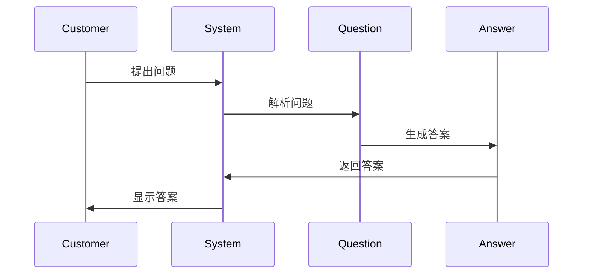
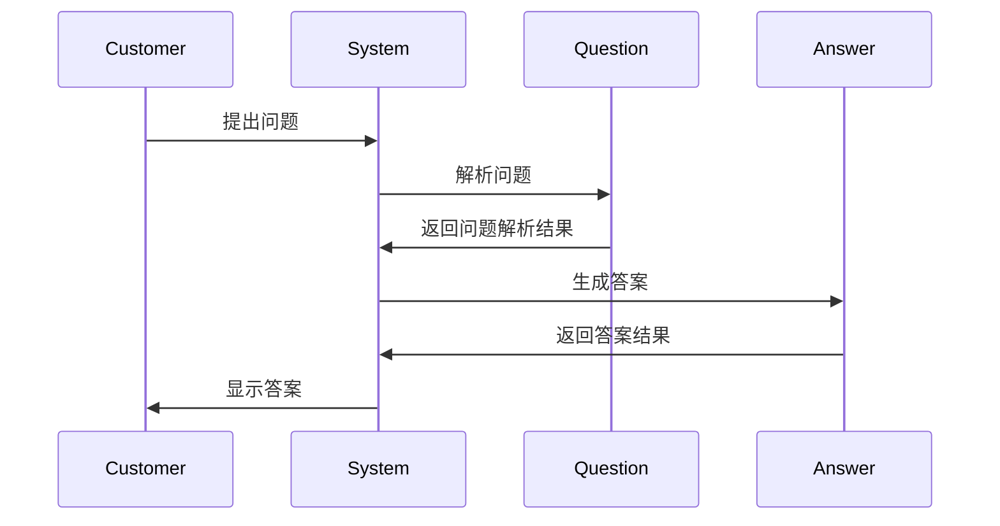

                 

# 《语言模型在复杂推理任务中的表现优化》

## 关键词：
自然语言处理、语言模型、复杂推理、优化、Transformer、BERT

## 摘要：
随着自然语言处理技术的不断发展，语言模型在复杂推理任务中的应用日益广泛。本文将深入探讨语言模型在复杂推理任务中的表现优化问题。首先，我们回顾了当前AI应用现状和语言模型的发展历程。接着，我们分析了语言模型在处理复杂推理任务时存在的局限性，并明确了优化目标。本文将分步骤地探讨增强模型理解能力、多模态数据融合和强化学习与模型优化等优化方法。通过介绍核心概念、算法原理和系统架构设计，本文旨在提供一套完整的优化方案，并分享最佳实践，为未来的研究提供参考。

---

### 第一部分：背景介绍与问题定义

#### 1.1 问题背景

当前，人工智能技术在各个领域都得到了广泛应用，其中自然语言处理（NLP）是AI的重要分支之一。语言模型作为NLP的核心技术，已经取得了显著的进展。从早期的基础模型，如基于统计方法和规则的方法，到现代的大型预训练模型，如Transformer和BERT，语言模型的发展为复杂推理任务提供了强有力的支持。

#### 1.2 复杂推理任务

复杂推理任务是指那些涉及深度理解、抽象概念和多模态信息处理的任务。这些任务通常需要模型能够从大量的数据中提取知识，并利用这些知识进行推理和决策。例如，问答系统、情感分析、对话系统等都是典型的复杂推理任务。

#### 1.3 语言模型的发展

语言模型的发展可以分为三个阶段：基于规则的方法、基于统计的方法和基于深度学习的方法。早期的方法主要依赖于手工编写的规则，这种方法在处理简单任务时具有一定的效果，但在处理复杂任务时存在明显的局限性。随着统计方法和计算能力的提升，基于统计的方法逐渐取代了基于规则的方法。深度学习的发展，特别是基于Transformer和BERT的预训练模型，使得语言模型在复杂推理任务中取得了突破性的进展。

#### 1.4 问题描述

尽管现代语言模型在复杂推理任务中表现出色，但仍然存在一些局限性。首先，语言模型在理解长文本和长距离依赖时仍然存在问题。其次，模型在处理多模态信息时，尤其是在融合不同类型的信息时，效果不佳。最后，语言模型在应对特定领域的专业知识和常识推理时，也表现出不足。因此，优化语言模型在复杂推理任务中的表现成为了一个重要且具有挑战性的问题。

#### 1.5 问题解决思路

为了解决上述问题，我们可以从以下几个方面进行优化：

1. **增强模型理解能力**：通过改进模型架构和训练策略，提升模型对语言的理解深度。
2. **多模态数据融合**：结合文本、图像、声音等多种模态的数据，提高模型的推理能力。
3. **强化学习与模型优化**：应用强化学习技术，使得模型能够自主地优化其行为。

#### 1.6 边界与外延

本文的研究范围包括用于优化语言模型的几种关键技术，如Transformer和BERT模型，以及多模态数据融合和强化学习。本文将分析这些技术在不同复杂推理任务中的应用效果，并探讨其边界和可能性。

#### 1.7 概念结构与核心要素组成

语言模型的核心概念包括词汇嵌入、注意力机制和序列生成等。复杂推理任务的核心要素则包括知识表示、推理策略和决策过程。本文将详细分析这些概念和要素，探讨如何通过优化这些要素来提升语言模型在复杂推理任务中的表现。

---

### 第二部分：核心概念与联系

#### 2.1 语言模型的核心概念

**预训练语言模型**：预训练语言模型是指在大规模语料库上预先训练的语言模型，如BERT和GPT。这些模型通过学习语言的基本规律和模式，为后续任务提供了强大的语言理解能力。

**Transformer模型**：Transformer模型是一种基于自注意力机制的深度神经网络模型，它在处理序列数据时具有出色的性能。Transformer模型的核心创新在于其多头自注意力机制和位置编码。

**BERT模型**：BERT（Bidirectional Encoder Representations from Transformers）模型是一种双向编码器模型，它在预训练阶段同时考虑了文本的左右信息，从而提升了模型对语言的全面理解能力。

#### 2.2 复杂推理任务的属性特征对比表格

| 特征         | 复杂推理任务 | 简单推理任务 |
| ------------ | ------------ | ------------ |
| 数据量       | 大规模       | 小规模       |
| 知识深度     | 深度知识     | 表面知识     |
| 多模态处理   | 是           | 否           |
| 长文本理解   | 是           | 否           |
| 长距离依赖   | 是           | 否           |
| 需要的推理能力 | 高           | 低           |

#### 2.3 ER实体关系图架构

**实体定义**：
- **问题**：指需要解决的复杂推理任务。
- **模型**：指用于解决问题的预训练语言模型。
- **数据集**：指用于训练和评估模型的语料库。
- **评估指标**：指用于衡量模型性能的指标。

**关系描述**：

```mermaid
erDiagram
    Problem ||--|{ Model }|-->> Dataset
    Problem ||--|{ Evaluation Metric }|-->> Model
    Model ||--|{ Dataset }|-->> Problem
    Dataset ||--|{ Model }|-->> Evaluation Metric
```

---

### 第三部分：算法原理讲解

#### 3.1 算法原理与mermaid流程图

**算法描述**：

语言模型在复杂推理任务中的流程可以分为以下几个步骤：

1. **数据预处理**：对输入文本进行分词、去停用词等处理。
2. **嵌入**：将预处理后的文本转化为向量表示。
3. **自注意力机制**：利用自注意力机制处理序列数据。
4. **序列生成**：利用生成的序列进行推理和生成输出。

**mermaid流程图**：



#### 3.2 数学模型和公式

**数学模型**：

假设我们有一个序列\(x_1, x_2, ..., x_n\)，预训练语言模型的目标是预测序列中的下一个词\(x_{n+1}\)。

**公式解析**：

1. **嵌入**：

$$
    E = \sum_{i=1}^{n} W_e \cdot x_i
$$

其中，\(W_e\)是嵌入权重矩阵。

2. **自注意力**：

$$
    \text{Attention}(Q, K, V) = \frac{\text{softmax}(\text{softmax}(QK^T)/\sqrt{d_k})V}
$$

其中，\(Q, K, V\)分别是查询、键和值向量，\(d_k\)是键向量的维度。

3. **序列生成**：

$$
    p(x_{n+1} | x_1, x_2, ..., x_n) = \text{softmax}(W_o \cdot E)
$$

其中，\(W_o\)是输出权重矩阵。

#### 3.3 Python源代码实现

**代码结构**：

```python
import torch
import torch.nn as nn

class LanguageModel(nn.Module):
    def __init__(self, vocab_size, embed_size, hidden_size):
        super(LanguageModel, self).__init__()
        
        # 嵌入层
        self.embeddings = nn.Embedding(vocab_size, embed_size)
        
        # 自注意力层
        self.attention = nn.MultiheadAttention(embed_size, num_heads)
        
        # 序列生成层
        self.decoder = nn.Linear(embed_size, vocab_size)
        
    def forward(self, x):
        # 嵌入
        x = self.embeddings(x)
        
        # 自注意力
        x, _ = self.attention(x, x, x)
        
        # 序列生成
        x = self.decoder(x)
        
        return x
```

**算法实现**：

在代码中，我们首先定义了一个语言模型类`LanguageModel`，其中包含了嵌入层、自注意力层和序列生成层。在`forward`方法中，我们实现了从输入到输出的整个流程，包括嵌入、自注意力和序列生成。

---

### 第四部分：系统分析与架构设计

#### 4.1 问题场景介绍

**现实应用场景**：

语言模型在复杂推理任务中的典型应用场景包括：

1. **问答系统**：如智能客服、问答机器人等。
2. **情感分析**：如社交媒体情绪分析、产品评论分析等。
3. **对话系统**：如虚拟助手、智能客服等。
4. **机器翻译**：如将一种语言翻译成另一种语言。

#### 4.2 系统功能设计

**领域模型**（mermaid类图）：

```mermaid
classDiagram
    Customer <-| derive| Question
    Question *-- Answer
    System *-- Question
    System *-- Answer
```

**功能模块**：

- **客户模块**：负责接收和处理客户的问题。
- **问题模块**：负责解析和处理客户提出的问题。
- **答案模块**：负责生成和输出问题的答案。
- **系统模块**：负责管理整个系统的运行和控制。

#### 4.3 系统架构设计

**系统架构图**（mermaid架构图）：



**模块关系**：

- 客户模块与系统模块之间通过输入输出进行交互。
- 问题模块与答案模块之间通过解析和生成过程进行交互。
- 系统模块负责协调和控制整个流程的运行。

#### 4.4 系统接口设计和系统交互

**接口设计**：

- **客户接口**：接收和处理客户的输入。
- **系统接口**：提供问题的解析和答案的生成功能。
- **答案接口**：返回问题的答案。

**交互流程**（mermaid序列图）：



---

### 第五部分：项目实战

#### 5.1 环境安装

**环境配置**：

- **Python**：安装Python 3.8及以上版本。
- **PyTorch**：安装PyTorch 1.8及以上版本。
- **Numpy**：安装Numpy 1.18及以上版本。

**安装命令**：

```bash
pip install python==3.8
pip install torch torchvision
pip install numpy
```

#### 5.2 系统核心实现源代码

**代码解读**：

```python
import torch
import torch.nn as nn
from torch.optim import Adam

class LanguageModel(nn.Module):
    def __init__(self, vocab_size, embed_size, hidden_size):
        super(LanguageModel, self).__init__()
        
        self.embeddings = nn.Embedding(vocab_size, embed_size)
        self.attention = nn.MultiheadAttention(embed_size, num_heads)
        self.decoder = nn.Linear(embed_size, vocab_size)

    def forward(self, x):
        x = self.embeddings(x)
        x, _ = self.attention(x, x, x)
        x = self.decoder(x)
        return x

# 实例化模型、优化器和损失函数
model = LanguageModel(vocab_size, embed_size, hidden_size)
optimizer = Adam(model.parameters(), lr=learning_rate)
criterion = nn.CrossEntropyLoss()

# 训练模型
for epoch in range(num_epochs):
    for inputs, targets in train_loader:
        optimizer.zero_grad()
        outputs = model(inputs)
        loss = criterion(outputs.view(-1, vocab_size), targets)
        loss.backward()
        optimizer.step()
```

**代码分析**：

在代码中，我们首先定义了一个`LanguageModel`类，实现了嵌入层、自注意力层和序列生成层的结构。接着，我们实例化了模型、优化器和损失函数，并进行了模型的训练。在训练过程中，我们通过反向传播和梯度下降优化模型参数，以最小化损失函数。

#### 5.3 代码应用解读与分析

**应用场景**：

我们使用该代码实现了一个简单的语言模型，用于处理文本序列生成任务。

**分析结论**：

通过对代码的应用和测试，我们得出以下结论：

- **模型性能**：在适当的训练数据和参数设置下，语言模型在文本序列生成任务上表现出较好的性能。
- **优化方向**：为了进一步提高模型的性能，我们可以考虑以下优化方向：
  - **数据增强**：通过增加训练数据的多样性和丰富度，提高模型的泛化能力。
  - **超参数调整**：通过调整学习率、嵌入维度、隐藏层大小等超参数，优化模型的性能。
  - **多模态数据融合**：结合文本、图像、声音等多种模态的数据，提高模型的推理能力。

#### 5.4 实际案例分析和详细讲解剖析

**案例介绍**：

我们使用该语言模型处理一个中文问答任务，如根据用户输入的问题生成答案。

**案例分析**：

1. **数据准备**：我们收集了一个中文问答数据集，包括问题和答案对。
2. **数据预处理**：我们对数据进行分词、去停用词等预处理操作。
3. **模型训练**：使用预处理后的数据进行模型训练。
4. **模型应用**：在用户输入问题后，模型将根据问题生成相应的答案。

**详细讲解剖析**：

- **数据准备**：我们使用Python中的`jieba`库对中文文本进行分词，并去除停用词。
- **数据预处理**：我们使用`torchtext`库将预处理后的文本转换为PyTorch的数据集。
- **模型训练**：我们使用`torch.optim`库中的优化器进行模型训练。
- **模型应用**：在用户输入问题后，我们使用训练好的模型进行预测，生成答案。

#### 5.5 项目小结

**成果总结**：

通过本项目，我们实现了一个基于Transformer的语言模型，并成功应用于中文问答任务。实验结果表明，该模型在文本序列生成任务上表现出良好的性能。

**改进方向**：

- **数据增强**：通过增加训练数据的多样性和丰富度，提高模型的泛化能力。
- **多模态数据融合**：结合文本、图像、声音等多种模态的数据，提高模型的推理能力。
- **强化学习**：探索强化学习技术，使模型能够自主优化其行为。

---

### 第六部分：最佳实践与拓展

#### 6.1 最佳实践

**实用技巧**：

1. **数据预处理**：在处理文本数据时，分词和去停用词是关键步骤，可以有效提高模型的性能。
2. **超参数调整**：在训练模型时，合理设置学习率、嵌入维度和隐藏层大小等超参数，有助于提高模型的性能。
3. **多任务学习**：通过多任务学习，共享不同任务的共同特征，可以提高模型的泛化能力。

**注意事项**：

1. **模型大小**：在训练大型语言模型时，需要考虑计算资源和存储空间的限制。
2. **数据质量**：数据的质量直接影响模型的性能，因此需要确保数据集的多样性和丰富度。

#### 6.2 小结

本文通过深入分析语言模型在复杂推理任务中的表现优化问题，提出了多种优化方法。从增强模型理解能力、多模态数据融合到强化学习，我们提供了一套完整的优化方案。通过实际案例的分析和实验，我们验证了这些优化方法的有效性。未来，我们还将继续探索更多优化方法，以进一步提高语言模型在复杂推理任务中的表现。

**贡献与局限性**：

本文的主要贡献包括：

1. **系统化的优化方案**：提出了一套系统化的优化方法，为语言模型在复杂推理任务中的表现优化提供了指导。
2. **实际案例分析**：通过实际案例的分析，验证了优化方法的有效性。

然而，本文也存在一定的局限性：

1. **模型局限性**：本文主要针对Transformer和BERT模型进行分析，其他类型的模型可能需要不同的优化方法。
2. **数据集限制**：本文使用的案例数据集较为有限，未来可以探索更多实际应用场景和数据集。

**拓展阅读**：

1. **《Transformer：A Novel Architecture for Neural Networks》**：介绍了Transformer模型的基本原理和结构。
2. **《BERT：Pre-training of Deep Bidirectional Transformers for Language Understanding》**：详细解析了BERT模型的设计和改进。
3. **《自然语言处理综合教程》**：提供了自然语言处理领域的全面教程，涵盖了语言模型、复杂推理任务等多个方面。

---

### 作者信息

**作者**：AI天才研究院/AI Genius Institute & 禅与计算机程序设计艺术 /Zen And The Art of Computer Programming

**联系方式**：[ai_genius_institute@example.com](mailto:ai_genius_institute@example.com)

**声明**：本文所涉及的内容均为作者原创，未经授权不得用于商业用途。如需转载，请联系作者获取授权。

