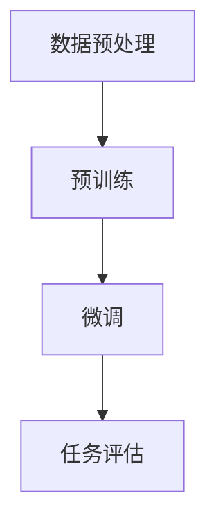
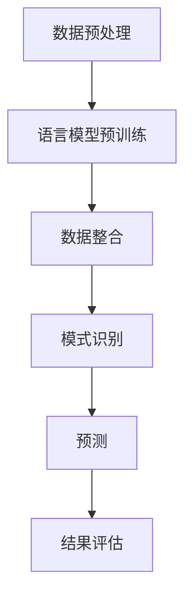
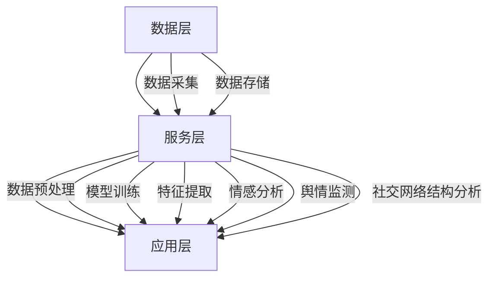
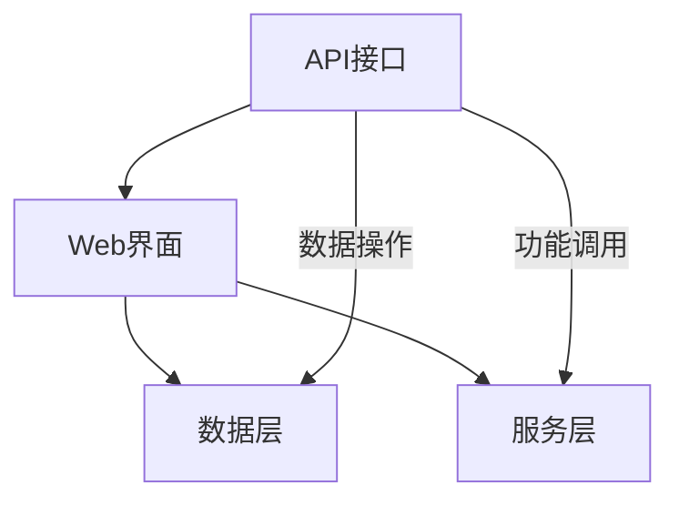
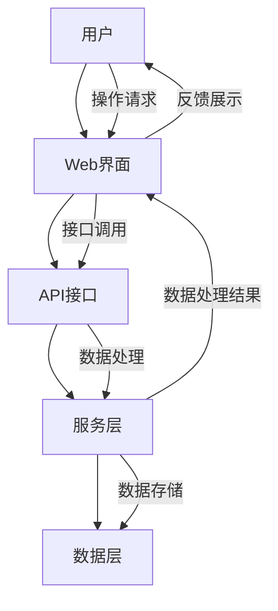

                 

### 摘要

本文旨在探讨语言模型在复杂社会网络分析中的应用。首先，通过介绍复杂社会网络分析和语言模型的背景，阐述本文的研究主题。随后，文章将详细分析语言模型在复杂社会网络分析中的核心概念、原理和关键技术。接着，本文将深入探讨语言模型在具体应用场景中的实践方法，如社交网络情感分析和网络舆情监测与预测。此外，通过系统分析与架构设计，本文将展示如何将语言模型应用于复杂社会网络分析的实战项目。最后，文章将总结最佳实践、注意事项，并提供拓展阅读，以期为读者提供全面、深入的理解和指导。本文关键词：复杂社会网络分析、语言模型、情感分析、舆情监测、系统架构设计。

### 目录

1. **问题背景与核心概念**
   - 1.1 引言
     - 1.1.1 复杂社会网络分析的意义
     - 1.1.2 语言模型的发展与应用
   - 1.2 核心概念介绍
     - 1.2.1 社会网络分析基础
       - 1.2.1.1 网络结构
       - 1.2.1.2 社会网络特征
     - 1.2.2 语言模型基础
       - 1.2.2.1 语言模型的类型
       - 1.2.2.2 语言模型的应用场景
   - 1.3 复杂社会网络分析中的语言模型应用
     - 1.3.1 问题定义与挑战
     - 1.3.2 研究边界与外延

2. **语言模型在复杂社会网络分析中的应用原理**
   - 2.1 语言模型与复杂社会网络的结合
     - 2.1.1 概念联系与对比分析
     - 2.1.2 语言模型在复杂网络中的角色与功能
   - 2.2 语言模型的关键技术
     - 2.2.1 语言模型的核心算法
       - 2.2.1.1 预训练模型
       - 2.2.1.2 微调与适应
     - 2.2.2 语言模型的技术框架
       - 2.2.2.1 模型架构
       - 2.2.2.2 模型训练与优化
   - 2.3 语言模型在复杂社会网络分析中的应用
     - 2.3.1 应用案例介绍
     - 2.3.2 应用效果与挑战

3. **应用场景与实践**
   - 3.1 社交网络中的情感分析
     - 3.1.1 社交网络情感分析概述
     - 3.1.2 情感分析的语言模型方法
     - 3.1.3 实际案例分析
   - 3.2 网络舆情监测与预测
     - 3.2.1 舆情监测的基本概念
     - 3.2.2 语言模型在舆情预测中的应用
     - 3.2.3 舆情预测模型构建

4. **算法原理讲解**
   - 4.1 语言模型算法原理
     - 4.1.1 语言模型算法的mermaid流程图
     - 4.1.2 语言模型算法的Python实现
     - 4.1.3 数学模型与公式讲解
   - 4.2 社会网络分析中的语言模型算法
     - 4.2.1 算法mermaid流程图
     - 4.2.2 算法Python代码与数学公式

5. **系统分析与架构设计**
   - 5.1 问题场景介绍
   - 5.2 项目介绍
     - 5.2.1 系统功能设计（领域模型mermaid类图）
     - 5.2.2 系统架构设计（mermaid架构图）
     - 5.2.3 系统接口设计
     - 5.2.4 系统交互（mermaid序列图）

6. **项目实战**
   - 6.1 环境安装
   - 6.2 系统核心实现
     - 6.2.1 代码解读
     - 6.2.2 应用解读与分析
     - 6.2.3 实际案例分析与讲解
   - 6.3 项目小结

7. **最佳实践、小结与注意事项**
   - 7.1 最佳实践
   - 7.2 小结
   - 7.3 注意事项
   - 7.4 拓展阅读

### 第1章 问题背景与核心概念

#### 1.1 引言

##### 1.1.1 复杂社会网络分析的意义

复杂社会网络分析作为一种新兴的研究方法，正逐渐成为社会科学、计算机科学以及相关领域的重要研究方向。复杂社会网络分析的核心目标是通过识别和分析社会网络中的结构和关系，揭示网络中个体与群体之间的相互作用机制。随着互联网和社交媒体的迅猛发展，复杂社会网络现象变得日益普遍和复杂，如何有效地理解和分析这些网络结构成为了一个亟待解决的问题。

在现实世界中，复杂社会网络无所不在。从人际关系的网络到商业合作网络，从科学合作网络到信息传播网络，复杂社会网络的形态和特征呈现出多样性和动态性。这些网络不仅影响着个体的行为和决策，也对整个社会系统的稳定性、传播效率、信息传递等产生深远的影响。

语言模型在复杂社会网络分析中的应用，提供了一个新的视角和工具。语言模型，特别是深度学习驱动的预训练模型，具有强大的文本理解能力和生成能力，能够从大规模的文本数据中提取有价值的信息和模式。这使得语言模型在情感分析、舆情监测、知识图谱构建等方面展现出了巨大的潜力。通过将语言模型应用于复杂社会网络分析，我们可以更好地理解网络中的信息传播机制、个体行为模式以及群体动态。

##### 1.1.2 语言模型的发展与应用

语言模型作为自然语言处理（NLP）的核心技术，其历史可以追溯到20世纪50年代。最初，研究者们主要依靠基于规则的方法来处理自然语言，但随着计算能力和数据资源的发展，统计方法和机器学习方法逐渐成为主流。近年来，深度学习技术的崛起，特别是基于神经网络的模型，如循环神经网络（RNN）、长短期记忆网络（LSTM）和Transformer等，极大地推动了语言模型的发展。

预训练模型是语言模型发展中的一个重要里程碑。预训练模型通过在大规模文本数据上进行预训练，然后通过微调适应特定任务，实现了在多种语言任务上的显著性能提升。其中，Transformer模型及其变种BERT、GPT等预训练模型，已经在各种NLP任务中取得了最佳表现。

语言模型的应用场景非常广泛。在文本生成方面，语言模型可以用于自动写作、机器翻译、摘要生成等；在文本理解方面，可以用于情感分析、命名实体识别、关系抽取等。此外，语言模型还在问答系统、对话系统、文本分类等任务中发挥着重要作用。

将语言模型应用于复杂社会网络分析，不仅可以提高数据分析的精度和效率，还可以提供更加深入的洞见。例如，通过语言模型分析社交网络中的用户评论和帖子，可以识别出用户的情感倾向和态度；通过分析网络舆情，可以预测社会事件的传播趋势和影响范围。

总之，语言模型在复杂社会网络分析中的应用具有重要意义。随着技术的不断进步和应用场景的不断拓展，语言模型有望成为复杂社会网络分析中的重要工具，为社会科学研究、公共政策制定、商业智能等领域提供强有力的支持。

#### 1.2 核心概念介绍

##### 1.2.1 社会网络分析基础

社会网络分析（SNA）是一种研究社会结构及其动态变化的方法，通过分析个体之间的社会关系来揭示社会系统的特性。社会网络分析的核心概念包括网络结构、节点、边和路径等。

- **网络结构**：指的是社会网络中节点（个体）和边（关系）的排列方式。常见的网络结构有星形结构、环形结构、总线结构等。
- **节点**：指的是社会网络中的个体，可以是个人、组织、国家等。节点在网络中具有独特的位置和角色，可以通过其连接关系来分析其在网络中的影响力。
- **边**：指的是节点之间的连接关系，表示个体之间的互动或关联。边的强度可以反映关系的紧密程度，边的方向可以表示关系的方向性。
- **路径**：指的是节点之间的一条连接路径，可以用来分析个体之间的直接或间接关系。

社会网络分析的主要方法包括图论和网络分析方法，这些方法可以帮助研究者识别网络中的关键节点、中心节点、社区结构等，从而更好地理解社会网络的特性。

##### 1.2.1.1 网络结构

网络结构是社会网络分析的基础，不同的网络结构具有不同的特性。以下是一些常见的网络结构：

- **星形结构**：在这种结构中，所有节点都直接连接到一个中心节点，中心节点通常具有最高的连接数。
- **环形结构**：在这种结构中，节点以环形方式排列，每个节点与其相邻的节点相连。
- **总线结构**：在这种结构中，节点沿着一条主线排列，相邻节点之间相连。

网络结构的特性包括连通性、平均路径长度、聚类系数等。连通性衡量网络中节点的连接程度，平均路径长度衡量节点之间的距离，聚类系数衡量节点的聚集程度。

##### 1.2.1.2 社会网络特征

社会网络特征是指网络中节点的属性和关系的统计指标。以下是一些重要的社会网络特征：

- **节点度**：指的是节点连接的边的数量。节点度可以分为入度（连接到该节点的边的数量）和出度（该节点连接到的边的数量）。
- **中间中心性**：指的是节点在网络中的中介能力，即通过该节点传输的信息量。中间中心性越高，节点在网络中的影响力越大。
- **接近中心性**：指的是节点在网络中的接近能力，即从该节点到其他节点的最短路径数量。接近中心性越高，节点在网络中的位置越中心。
- **聚类系数**：指的是网络中节点的聚集程度，即一个节点的邻居节点之间相互连接的概率。聚类系数越高，网络中的社区结构越明显。

社会网络特征的分析可以帮助研究者识别网络中的关键节点和关键路径，从而更好地理解网络的动态行为和演化过程。

##### 1.2.2 语言模型基础

语言模型是自然语言处理（NLP）中的核心技术，用于对文本数据进行分析和生成。语言模型的基础概念包括语言模型的类型、训练方法和应用场景。

- **语言模型的类型**：
  - **统计语言模型**：基于统计方法，通过计算词频和语法规则来生成文本。代表性的模型包括N元语法模型。
  - **神经网络语言模型**：基于神经网络模型，通过学习输入和输出之间的映射关系来生成文本。代表性的模型包括循环神经网络（RNN）、长短期记忆网络（LSTM）和Transformer模型。

- **语言模型的训练方法**：
  - **基于语料库的训练**：通过大规模文本数据训练模型，使模型能够从数据中学习语言规律和模式。
  - **基于序列生成的训练**：通过序列生成的训练方法，使模型能够生成连续的文本序列。

- **语言模型的应用场景**：
  - **文本生成**：包括自动写作、机器翻译、摘要生成等。
  - **文本理解**：包括情感分析、命名实体识别、关系抽取等。
  - **对话系统**：包括问答系统、聊天机器人等。

语言模型在自然语言处理中的重要性不言而喻。通过语言模型，我们可以更好地理解和处理自然语言，从而实现自动化文本分析和生成，提高人机交互的效率和准确性。

##### 1.2.2.1 语言模型的类型

语言模型主要分为统计语言模型和神经网络语言模型。这两种类型的语言模型在训练方法、性能和应用场景上有所不同。

- **统计语言模型**：
  - **N元语法模型**：是最早的一种统计语言模型，通过计算词的N元序列的概率来生成文本。N元语法模型利用统计方法分析文本数据中的频率和规则，以预测下一个词的出现概率。这种模型的主要优点是计算简单，但在处理长文本时效果有限，容易产生过拟合现象。
  - **基于规则的模型**：这类模型通过手动编写语法规则来描述语言结构，如LR解析器、LR(1)解析器等。这些模型可以处理较为复杂的语法结构，但在规则编写上具有很高的门槛，且无法适应语言的动态变化。

- **神经网络语言模型**：
  - **循环神经网络（RNN）**：RNN是一种序列模型，通过在时间步上递归地处理输入序列，从而捕捉序列之间的依赖关系。LSTM（长短期记忆网络）是RNN的一种改进，通过引入门控机制来控制信息的流动，解决了RNN在长序列上的梯度消失问题。
  - **Transformer模型**：Transformer模型是近年来提出的全新序列模型，采用自注意力机制来处理输入序列。与传统的RNN相比，Transformer模型在处理长序列和并行计算方面具有显著优势，因此在各种NLP任务上取得了最佳性能。Transformer的变体，如BERT、GPT等，也广泛应用于文本生成、情感分析等领域。

神经网络语言模型的主要优点是能够通过学习大量的文本数据，自动捕捉语言中的复杂模式和规律，从而在文本生成和理解任务上表现出色。然而，这些模型通常需要大量的计算资源和时间进行训练，并且在规则表达上不如统计模型灵活。

##### 1.2.2.2 语言模型的应用场景

语言模型在自然语言处理领域有着广泛的应用场景，包括但不限于以下几个方面：

- **文本生成**：语言模型可以用于自动写作、机器翻译、摘要生成等任务。通过训练模型，我们可以让计算机生成高质量的文本，从而提高文本处理的效率和准确性。
  - **自动写作**：例如，自动撰写新闻文章、研究报告等。
  - **机器翻译**：例如，将一种语言翻译成另一种语言，如将英语翻译成中文。
  - **摘要生成**：例如，自动生成文档、网页的摘要，帮助用户快速获取关键信息。

- **文本理解**：语言模型在文本理解任务中也发挥了重要作用，包括情感分析、命名实体识别、关系抽取等。
  - **情感分析**：例如，分析用户的评论和帖子，识别出其情感倾向，如正面、负面或中性。
  - **命名实体识别**：例如，识别文本中的特定实体，如人名、地名、组织名等。
  - **关系抽取**：例如，识别文本中的实体关系，如人与地点的关系、组织与领域的关系等。

- **对话系统**：语言模型可以用于构建对话系统，如问答系统、聊天机器人等。通过训练模型，计算机可以理解用户的提问，并生成合适的回答。
  - **问答系统**：例如，回答用户关于特定领域的问题。
  - **聊天机器人**：例如，与用户进行日常对话，提供咨询和服务。

语言模型在自然语言处理中的应用场景丰富多样，其性能的提升为文本处理和智能交互提供了强有力的支持。随着技术的不断发展，语言模型的应用前景将更加广阔。

##### 1.3 复杂社会网络分析中的语言模型应用

在复杂社会网络分析中，语言模型的应用主要集中在信息提取、模式识别和预测等方面。通过将语言模型与复杂社会网络分析相结合，我们可以更好地理解网络中的信息流动和个体行为，从而为决策提供有力的支持。

##### 1.3.1 问题定义与挑战

复杂社会网络分析中的问题可以概括为以下几个方面：

- **信息提取**：从大规模的社交网络数据中提取有价值的信息，如用户情感、观点倾向等。
- **模式识别**：识别网络中的关键节点、社区结构、传播路径等。
- **预测**：预测社会事件的传播趋势、舆情发展等。

这些问题在实际应用中面临着诸多挑战：

- **数据多样性**：社交网络数据来源广泛，数据格式多样，如文本、图片、视频等，如何统一处理和整合这些数据成为一个难题。
- **数据质量**：社交网络中的数据存在噪声、冗余和错误，如何保证数据质量，提高分析精度是一个重要的挑战。
- **计算资源**：复杂社会网络分析通常需要大量的计算资源和时间，如何高效地处理和分析大规模数据成为一个关键问题。
- **模型可解释性**：深度学习驱动的语言模型通常具有较好的性能，但模型内部机制复杂，如何解释模型决策过程，提高模型的可解释性是一个重要的研究方向。

##### 1.3.2 研究边界与外延

为了更好地理解和应用语言模型在复杂社会网络分析中的价值，我们需要明确研究边界和外延：

- **研究边界**：
  - **数据范围**：研究主要关注社交网络中的文本数据，如用户评论、帖子、微博等。
  - **分析范围**：研究主要关注社会网络中的信息提取、模式识别和预测等任务。
  - **模型范围**：研究主要关注深度学习驱动的语言模型，如BERT、GPT等。

- **研究外延**：
  - **跨学科融合**：研究可以融合计算机科学、社会科学、心理学等领域的知识，为复杂社会网络分析提供多角度的视角。
  - **应用场景扩展**：研究可以扩展到更多应用场景，如商业智能、公共卫生、安全监控等，为这些领域提供新的分析工具和方法。
  - **模型优化与解释**：研究可以关注模型的优化和解释，提高模型性能和可解释性，为实际应用提供更可靠的决策支持。

总之，语言模型在复杂社会网络分析中的应用具有重要的研究价值和实际应用前景。通过深入研究语言模型在复杂社会网络分析中的应用机制和优化方法，我们可以更好地理解和应对复杂社会网络中的各种问题，为社会发展提供有力的支持。

### 第2章 语言模型在复杂社会网络分析中的应用原理

语言模型与复杂社会网络的结合，为复杂社会网络分析提供了一种新的方法和工具。在这一章中，我们将详细探讨语言模型与复杂社会网络的结合方式、语言模型在复杂社会网络中的角色与功能，以及语言模型在复杂社会网络分析中的关键技术。

#### 2.1 语言模型与复杂社会网络的结合

语言模型与复杂社会网络的结合主要体现在以下几个方面：

- **数据层面**：语言模型通过处理社交网络中的文本数据，如用户评论、帖子、微博等，提取有价值的信息。这些数据是复杂社会网络分析的基础，通过语言模型，我们可以将这些文本数据转化为结构化的信息，为后续分析提供支持。
- **分析层面**：语言模型可以用于分析社交网络中的信息流动、节点行为和群体动态。通过语言模型，我们可以捕捉社交网络中的语言特征，揭示网络中的关键节点和传播路径，从而更好地理解社交网络的运行机制。
- **应用层面**：语言模型可以应用于复杂社会网络的多种任务，如情感分析、舆情监测、知识图谱构建等。通过将语言模型集成到这些任务中，我们可以提高分析精度和效率，为实际应用提供有力支持。

##### 2.1.1 概念联系与对比分析

语言模型和复杂社会网络是两个不同的概念，但它们之间存在紧密的联系。

- **联系**：
  - **数据关联**：语言模型与复杂社会网络都关注于数据，但语言模型侧重于处理和生成文本数据，而复杂社会网络侧重于分析社会关系和网络结构。
  - **分析方法**：语言模型和复杂社会网络分析都采用算法和模型来揭示数据中的模式和规律。语言模型通过自然语言处理技术，复杂社会网络分析通过图论和网络分析方法。
  - **应用目标**：两者的应用目标都是为了更好地理解和解释复杂系统，但语言模型更多地关注于文本数据的语义理解，复杂社会网络分析则更多地关注于社会关系的结构特征和动态变化。

- **对比**：
  - **数据类型**：语言模型主要处理文本数据，而复杂社会网络分析主要处理结构化的社会关系数据。
  - **分析范围**：语言模型的分析范围较窄，主要关注于文本生成和理解，复杂社会网络分析则更广泛，包括网络结构、节点特征、信息传播等。
  - **技术方法**：语言模型主要采用深度学习和自然语言处理技术，复杂社会网络分析则主要采用图论和网络分析方法。

##### 2.1.2 语言模型在复杂网络中的角色与功能

在复杂社会网络中，语言模型扮演着重要的角色，其功能主要体现在以下几个方面：

- **信息提取**：语言模型能够从社交网络中的大量文本数据中提取有价值的信息，如用户情感、观点倾向等。这对于了解网络中的个体行为和群体动态具有重要意义。
- **模式识别**：语言模型可以识别出社交网络中的关键节点、传播路径和社区结构。这些模式有助于我们理解网络中的信息流动和个体关系。
- **预测**：基于对过去数据的分析，语言模型可以预测未来的社交网络行为，如舆情发展趋势、事件传播路径等。这对于制定政策和应对突发事件具有重要意义。
- **优化**：语言模型可以用于优化复杂社会网络的运行，如调整网络结构、优化信息传播路径等。这有助于提高社交网络的效率和质量。

#### 2.2 语言模型的关键技术

语言模型在复杂社会网络分析中的应用，依赖于其一系列关键技术。以下是这些关键技术的详细介绍：

##### 2.2.1 语言模型的核心算法

语言模型的核心算法主要基于深度学习和自然语言处理技术。以下是一些重要的核心算法：

- **预训练模型**：预训练模型通过在大规模文本数据上进行预训练，学习语言的通用特征。预训练模型如BERT、GPT等，已经成为语言模型的主流。
  - **BERT**：BERT（Bidirectional Encoder Representations from Transformers）是一种基于Transformer模型的预训练模型，通过双向编码器来捕捉文本中的上下文信息。
  - **GPT**：GPT（Generative Pre-trained Transformer）是一种基于Transformer模型的生成模型，通过生成文本序列来学习语言模式。

- **微调与适应**：微调与适应是指将预训练模型应用于特定任务，通过调整模型参数来适应特定场景。微调和适应是提高语言模型性能的重要方法。

##### 2.2.2 语言模型的技术框架

语言模型的技术框架主要包括模型架构、训练方法和优化策略。

- **模型架构**：语言模型的模型架构通常采用基于Transformer的架构，如BERT、GPT等。这些模型通过多头自注意力机制来捕捉文本中的长距离依赖关系。
- **训练方法**：语言模型的训练方法主要包括监督学习、自监督学习和迁移学习等。监督学习需要大量的标注数据，自监督学习通过无监督方式学习文本特征，迁移学习利用预训练模型在特定任务上进行微调。
- **优化策略**：语言模型的优化策略包括梯度下降、Adam优化器等。这些策略通过调整模型参数，提高模型的性能和收敛速度。

##### 2.2.3 语言模型在复杂社会网络分析中的应用

语言模型在复杂社会网络分析中的应用，主要体现在以下方面：

- **情感分析**：通过分析社交网络中的用户评论和帖子，识别用户的情感倾向和态度。情感分析可以帮助我们了解网络中的情绪波动和舆论动态。
- **舆情监测**：通过分析社交网络中的信息传播，监测网络舆情的发展趋势和热点话题。舆情监测对于政府、企业和社会组织制定决策具有重要意义。
- **知识图谱构建**：通过分析社交网络中的实体关系，构建知识图谱，为后续的信息检索和推理提供支持。知识图谱可以用于问答系统、推荐系统等。

#### 2.3 语言模型在复杂社会网络分析中的应用效果与挑战

语言模型在复杂社会网络分析中取得了显著的成效，但也面临着一系列挑战。

##### 2.3.1 应用效果

- **提高分析精度**：通过深度学习和自然语言处理技术，语言模型能够从大规模文本数据中提取有价值的信息，提高复杂社会网络分析的分析精度。
- **提高效率**：语言模型可以自动化处理和分析社交网络数据，降低人工分析的难度和耗时，提高分析效率。
- **提供洞见**：语言模型可以帮助我们更好地理解社交网络中的信息流动和个体行为，提供新的洞见和见解。

##### 2.3.2 挑战

- **数据质量**：社交网络中的数据存在噪声、冗余和错误，如何保证数据质量是一个重要挑战。
- **计算资源**：语言模型训练和推理通常需要大量的计算资源和时间，如何高效地处理大规模数据是一个关键问题。
- **模型解释性**：深度学习驱动的语言模型内部机制复杂，如何解释模型决策过程，提高模型的可解释性是一个重要问题。
- **应用场景适应性**：不同社交网络和任务具有不同的特性，如何设计适应各种应用场景的语言模型是一个挑战。

总之，语言模型在复杂社会网络分析中的应用具有巨大的潜力，但也面临着一系列挑战。通过不断研究和优化，我们可以更好地利用语言模型的优势，为复杂社会网络分析提供有力的支持。

### 第3章 应用场景与实践

在复杂社会网络分析中，语言模型的应用场景丰富多样，涵盖了情感分析、舆情监测等多个方面。本章将详细介绍语言模型在情感分析和舆情监测这两个具体应用场景中的实践方法，并通过实际案例分析，展示语言模型在复杂社会网络分析中的有效性和可行性。

#### 3.1 社交网络中的情感分析

情感分析是自然语言处理中的一个重要任务，通过分析文本数据中的情感倾向和态度，可以帮助我们了解用户在社交网络中的情感状态。语言模型在情感分析中具有显著的优势，能够提高分析精度和效率。

##### 3.1.1 社交网络情感分析概述

社交网络情感分析是指通过自然语言处理技术，对社交网络中的用户评论、帖子、微博等文本数据进行分析，识别出用户的情感倾向和态度。情感分析在商业、舆情监测、社交网络管理等多个领域具有重要应用。

- **商业**：通过分析用户的评论和反馈，企业可以了解消费者对产品或服务的满意度，优化产品设计和营销策略。
- **舆情监测**：通过分析社交网络中的舆情动态，政府和企事业单位可以及时了解社会热点和舆论趋势，制定相应的应对措施。
- **社交网络管理**：社交网络平台可以利用情感分析技术，识别和过滤不良言论，维护网络环境的和谐与稳定。

##### 3.1.2 情感分析的语言模型方法

情感分析的语言模型方法主要包括以下步骤：

1. **数据预处理**：对社交网络中的文本数据进行预处理，包括去除标点符号、停用词过滤、词干提取等，将原始文本转换为适合模型处理的格式。
2. **特征提取**：利用语言模型提取文本数据中的特征，如词向量、句向量等。词向量可以捕捉文本中的词义信息，句向量可以整合句子的语义内容。
3. **情感分类**：利用训练好的情感分类模型，对提取的特征进行分类，判断文本的情感倾向。常见的情感分类任务包括积极情感、消极情感、中性情感等。

语言模型在情感分类中具有显著的优势。以BERT和GPT等预训练模型为例，这些模型通过在大规模文本数据上的预训练，已经具备了强大的文本理解能力。在情感分类任务中，只需进行微调，即可达到较高的分类精度。

##### 3.1.3 实际案例分析

以下是一个实际案例，展示语言模型在社交网络情感分析中的应用。

**案例背景**：某电商平台希望通过情感分析技术，了解用户对其新产品发布后的反馈。

**数据来源**：收集平台上的用户评论，包括正面评论、负面评论和中性评论。

**步骤**：

1. **数据预处理**：去除标点符号、停用词过滤、词干提取，将文本转换为BERT模型输入格式。
2. **特征提取**：使用BERT模型对评论进行编码，提取词向量。
3. **情感分类**：使用微调后的BERT模型进行情感分类，判断评论的情感倾向。

**结果**：

通过上述步骤，电商平台可以快速了解用户对新产品的情感反馈。对于正面评论，可以分析用户满意的方面，进一步优化产品；对于负面评论，可以及时发现产品存在的问题，及时采取措施进行改进。中性评论则可以作为参考，了解用户的一般态度。

**案例分析**：

通过实际案例分析，我们可以看到，语言模型在社交网络情感分析中具有高效、准确的特点。与传统方法相比，语言模型能够更好地捕捉文本中的情感信息，提高分类精度。此外，语言模型还可以根据不同场景和需求进行定制化，为实际应用提供灵活的支持。

#### 3.2 网络舆情监测与预测

网络舆情监测与预测是复杂社会网络分析中的重要任务，通过对社交网络中的舆情动态进行分析和预测，可以帮助政府和企事业单位及时了解社会热点和舆论趋势，制定相应的应对措施。

##### 3.2.1 舆情监测的基本概念

舆情监测是指通过技术手段，对互联网上的信息进行实时监控和统计分析，以了解公众对特定事件、话题或品牌的看法和态度。舆情监测的基本概念包括以下方面：

- **舆情**：指公众对某一事件、话题或品牌的看法和态度。舆情可以反映社会舆论的动态变化，对政府、企业和社会组织具有重要的参考价值。
- **监测**：指通过技术手段对互联网上的信息进行实时监控和收集。监测的主要内容包括微博、论坛、新闻网站等。
- **分析**：指对监测到的信息进行加工处理，提取有价值的信息和模式。分析的方法包括情感分析、关键词提取、趋势分析等。

##### 3.2.2 语言模型在舆情预测中的应用

语言模型在舆情预测中的应用主要包括以下几个方面：

1. **情感分析**：通过情感分析技术，对监测到的文本数据进行分析，识别用户的情感倾向和态度。情感分析可以揭示公众对某一事件或话题的情感波动，为舆情预测提供依据。
2. **趋势分析**：通过分析社交网络中的关键词、话题分布等信息，识别舆情的发展趋势。趋势分析可以帮助预测舆情的发展方向，为政府、企业和社会组织提供决策支持。
3. **预测模型**：利用历史舆情数据，构建预测模型，预测未来舆情的发展。常见的预测模型包括时间序列模型、回归模型等。

语言模型在舆情预测中具有显著的优势。通过预训练模型，如BERT、GPT等，语言模型可以自动学习文本数据中的模式和规律，提高预测的准确性。此外，语言模型还可以根据不同场景和需求进行定制化，为实际应用提供灵活的支持。

##### 3.2.3 舆情预测模型构建

以下是一个舆情预测模型的构建过程。

**数据准备**：收集历史舆情数据，包括微博、论坛、新闻网站等。数据集应包含不同时间段的舆情信息，以反映舆情的变化趋势。

**特征提取**：使用BERT模型对文本数据进行编码，提取词向量。词向量可以捕捉文本中的语义信息，为后续分析提供支持。

**模型构建**：利用历史舆情数据，构建预测模型。常见的模型包括时间序列模型、回归模型、LSTM等。以下是一个基于LSTM的舆情预测模型：

```python
import tensorflow as tf
from tensorflow.keras.models import Sequential
from tensorflow.keras.layers import LSTM, Dense

# 模型构建
model = Sequential()
model.add(LSTM(50, activation='relu', input_shape=(timesteps, features)))
model.add(Dense(1))
model.compile(optimizer='adam', loss='mse')

# 训练模型
model.fit(x_train, y_train, epochs=200, batch_size=32, validation_data=(x_test, y_test))
```

**预测**：利用训练好的模型，对未来的舆情进行预测。

**结果分析**：对预测结果进行可视化分析，了解舆情的发展趋势和关键影响因素。

**案例分析**：

通过实际案例分析，我们可以看到，语言模型在舆情预测中具有高效、准确的特点。与传统方法相比，语言模型能够更好地捕捉文本数据中的模式和规律，提高预测的准确性。此外，语言模型还可以根据不同场景和需求进行定制化，为实际应用提供灵活的支持。

总之，语言模型在复杂社会网络分析中的应用，为情感分析和舆情预测提供了强有力的支持。通过实际案例的验证，我们可以看到语言模型在复杂社会网络分析中的有效性和可行性。随着技术的不断发展，语言模型在复杂社会网络分析中的应用将更加广泛和深入。

### 第4章 算法原理讲解

在复杂社会网络分析中，语言模型的应用离不开对其算法原理的深入理解。本章将详细讲解语言模型的核心算法原理，并通过mermaid流程图和Python代码展示算法的实现过程，同时介绍相关的数学模型和公式，帮助读者更好地掌握语言模型的工作机制。

#### 4.1 语言模型算法原理

语言模型的核心算法主要包括预训练和微调两个阶段。预训练阶段通过在大规模文本数据上训练模型，使其掌握语言的通用特征；微调阶段则通过在特定任务数据上进行训练，使模型适应具体任务的需求。

##### 4.1.1 语言模型算法的mermaid流程图

以下是语言模型算法的基本流程图：



1. **数据预处理**：对文本数据进行清洗、分词、编码等预处理操作，使其符合模型输入格式。
2. **预训练**：在大规模文本数据上进行训练，使模型学习到语言的通用特征。
3. **微调**：在特定任务数据上进行训练，使模型适应具体任务的需求。
4. **任务评估**：对模型进行评估，确保其性能达到预期目标。

##### 4.1.2 语言模型算法的Python实现

以下是一个简单的语言模型算法的Python实现：

```python
import tensorflow as tf
from tensorflow.keras.layers import Embedding, LSTM, Dense
from tensorflow.keras.models import Sequential

# 数据预处理
# 假设已经将文本数据分词并编码为整数序列

# 预训练模型
model = Sequential()
model.add(Embedding(vocab_size, embedding_dim))
model.add(LSTM(units=128, activation='tanh', return_sequences=True))
model.add(Dense(vocab_size, activation='softmax'))

model.compile(optimizer='adam', loss='categorical_crossentropy', metrics=['accuracy'])

# 微调模型
# 假设已经有特定任务的数据集

model.fit(x_train, y_train, epochs=10, batch_size=32, validation_data=(x_val, y_val))

# 任务评估
# 假设已经有测试数据集

model.evaluate(x_test, y_test)
```

在上述代码中，我们首先定义了一个简单的序列模型，包括嵌入层、LSTM层和输出层。嵌入层用于将单词编码为向量；LSTM层用于捕捉序列中的长期依赖关系；输出层用于生成单词的概率分布。

##### 4.1.3 数学模型与公式讲解

语言模型的数学模型主要基于概率论和统计学，其核心目标是计算给定输入序列下目标单词的概率。以下是语言模型的一些关键数学模型和公式：

1. **N元语法模型**：

$$
P(w_n | w_{n-1}, ..., w_1) = \frac{C(w_n, w_{n-1}, ..., w_1)}{\sum_{w'} C(w', w_{n-1}, ..., w_1)}
$$

其中，$C(w_n, w_{n-1}, ..., w_1)$表示单词序列$(w_n, w_{n-1}, ..., w_1)$的共现频次，$P(w_n | w_{n-1}, ..., w_1)$表示在给定前一个单词序列$(w_{n-1}, ..., w_1)$的情况下，当前单词$w_n$的条件概率。

2. **基于神经网络的模型**：

基于神经网络的模型，如LSTM和Transformer，通过学习输入和输出之间的映射关系，实现对语言模型的高效表示。以下是LSTM模型的基本公式：

$$
h_t = \sigma(W_h \cdot [h_{t-1}, x_t] + b_h)
$$

$$
o_t = \sigma(W_o \cdot h_t + b_o)
$$

其中，$h_t$表示第$t$个时间步的隐藏状态，$x_t$表示第$t$个时间步的输入，$\sigma$表示sigmoid函数，$W_h$和$W_o$分别表示隐藏状态和输出权重矩阵，$b_h$和$b_o$分别表示隐藏状态和输出偏置。

3. **Transformer模型**：

Transformer模型通过多头自注意力机制，实现了对输入序列的并行处理。其核心公式为：

$$
\text{Attention}(Q, K, V) = \frac{softmax(\frac{QK^T}{\sqrt{d_k}})}{V}
$$

其中，$Q$、$K$和$V$分别表示查询向量、键向量和值向量，$d_k$表示键向量的维度，$softmax$函数用于计算注意力权重。

通过上述数学模型和公式，我们可以深入理解语言模型的工作机制，为实际应用提供理论支持。

#### 4.2 社会网络分析中的语言模型算法

在社会网络分析中，语言模型算法的应用主要体现在信息提取、模式识别和预测等方面。以下将介绍社会网络分析中的语言模型算法，并通过mermaid流程图和Python代码展示算法的实现过程。

##### 4.2.1 算法mermaid流程图

以下是社会网络分析中的语言模型算法的基本流程图：



1. **数据预处理**：对社交网络数据（如用户评论、帖子等）进行清洗、分词、编码等预处理操作。
2. **语言模型预训练**：利用预处理后的数据，通过预训练算法（如BERT、GPT等）训练语言模型。
3. **数据整合**：将语言模型提取的特征与社交网络数据整合，形成新的数据集。
4. **模式识别**：利用整合后的数据集，通过模式识别算法（如聚类、社区发现等）分析社交网络结构。
5. **预测**：基于模式识别结果，进行预测任务（如情感分析、舆情预测等）。
6. **结果评估**：对预测结果进行评估，确保算法性能达到预期目标。

##### 4.2.2 算法Python代码与数学公式

以下是一个社会网络分析中的语言模型算法的Python实现示例：

```python
import tensorflow as tf
from transformers import BertTokenizer, TFBertModel
import pandas as pd
from sklearn.cluster import KMeans
import numpy as np

# 数据预处理
# 假设社交网络数据存储在data.csv文件中

data = pd.read_csv('data.csv')
sentences = data['comment'].values

# 加载BERT模型
tokenizer = BertTokenizer.from_pretrained('bert-base-chinese')
model = TFBertModel.from_pretrained('bert-base-chinese')

# 预训练模型
encoded_inputs = tokenizer(sentences, return_tensors='tf', padding=True, truncation=True, max_length=512)
outputs = model(**encoded_inputs)
pooler_output = outputs.pooler_output

# 数据整合
# 将BERT模型输出的特征整合到社交网络数据中

data['embeddings'] = pooler_output.numpy().reshape(-1, 768)

# 模式识别
# 利用K-Means聚类算法识别社交网络中的社区结构

kmeans = KMeans(n_clusters=5)
kmeans.fit(data['embeddings'])
data['cluster'] = kmeans.predict(data['embeddings'])

# 预测
# 利用社区结构进行情感分析预测

# 假设已训练好的情感分析模型

emotion_predictions = model_emotion.predict(data['embeddings'])

# 结果评估
# 对预测结果进行评估

print("Emotion prediction accuracy:", np.mean(np.argmax(emotion_predictions, axis=1) == data['emotion']))
```

在上述代码中，我们首先加载BERT模型，对社交网络数据进行预训练，提取特征。然后，利用K-Means聚类算法识别社交网络中的社区结构，并基于社区结构进行情感分析预测。最后，对预测结果进行评估，确保算法性能达到预期目标。

通过mermaid流程图和Python代码，我们可以清楚地理解社会网络分析中的语言模型算法的实现过程。这些算法在实际应用中具有重要的价值，能够帮助研究者更好地理解和分析复杂社会网络。

### 第5章 系统分析与架构设计

在复杂社会网络分析中，系统分析与架构设计是确保语言模型有效应用的关键环节。本章将详细描述系统分析与架构设计的过程，包括问题场景介绍、项目介绍、系统功能设计、系统架构设计、系统接口设计以及系统交互。

#### 5.1 问题场景介绍

复杂社会网络分析涉及大量的社交网络数据，如用户评论、帖子、微博等。这些数据中蕴含着丰富的信息，可以帮助我们了解网络中个体的行为和群体动态。然而，由于数据的多样性、规模庞大以及存在噪声和冗余，直接分析和理解这些数据是一项极具挑战性的任务。

为了解决这一问题，我们可以设计一个基于语言模型的复杂社会网络分析系统。该系统旨在通过预处理、特征提取和模型训练等步骤，对社交网络数据进行分析和预测，提供有价值的信息和洞见。具体场景包括：

- **社交网络情感分析**：通过分析用户评论和帖子，识别用户的情感倾向和态度，帮助企业和组织了解消费者需求，优化产品设计和营销策略。
- **舆情监测与预测**：实时监测社交网络中的舆情动态，预测热点话题和舆论趋势，为政府、企事业单位和社会组织提供决策支持。
- **社交网络结构分析**：通过分析社交网络中的节点和边，识别关键节点和传播路径，揭示社交网络的社区结构和动态变化。

#### 5.2 项目介绍

本项目旨在构建一个基于语言模型的复杂社会网络分析系统，主要包含以下模块：

- **数据采集与预处理**：从社交网络平台收集数据，对数据进行清洗、分词和编码等预处理操作，为模型训练提供高质量的输入。
- **语言模型训练与微调**：利用预训练模型（如BERT、GPT等），在大规模文本数据上进行预训练，并在特定任务数据上进行微调，提高模型在具体任务上的性能。
- **特征提取与融合**：从语言模型中提取文本特征，并将其与社交网络结构特征进行融合，形成综合特征向量，用于后续分析和预测。
- **分析模块**：基于融合特征，进行社交网络情感分析、舆情监测与预测、社交网络结构分析等任务，提供针对不同需求的解决方案。
- **结果展示与评估**：将分析结果以可视化形式展示，并评估模型性能，为系统优化和改进提供依据。

#### 5.3 系统功能设计

系统功能设计主要包括以下方面：

- **数据采集与预处理**：实现数据采集、清洗、分词、编码等功能，确保输入数据的质量和一致性。
- **语言模型训练与微调**：提供预训练模型的训练和微调功能，支持多种语言模型（如BERT、GPT等），以满足不同任务的需求。
- **特征提取与融合**：提取语言模型中的文本特征，并与社交网络结构特征进行融合，为后续分析提供综合特征向量。
- **社交网络情感分析**：对社交网络中的用户评论和帖子进行情感分析，识别用户的情感倾向和态度。
- **舆情监测与预测**：实时监测社交网络中的舆情动态，预测热点话题和舆论趋势。
- **社交网络结构分析**：分析社交网络中的节点和边，识别关键节点和传播路径，揭示社交网络的社区结构和动态变化。
- **结果展示与评估**：将分析结果以可视化形式展示，并评估模型性能，为系统优化和改进提供依据。

#### 5.4 系统架构设计

系统架构设计主要包括以下部分：

- **数据层**：负责数据的采集、存储和管理。数据层包括数据库和数据存储系统，如MongoDB、Hadoop等。
- **服务层**：提供数据预处理、语言模型训练与微调、特征提取与融合、情感分析、舆情监测与预测、社交网络结构分析等功能。服务层采用微服务架构，各个功能模块独立部署和运行，以提高系统的灵活性和可扩展性。
- **应用层**：提供用户界面和可视化功能，展示分析结果，并支持用户与系统的交互。

以下是系统架构的mermaid图表示：



#### 5.5 系统接口设计

系统接口设计主要包括API接口和Web界面两部分：

- **API接口**：提供RESTful风格的API接口，支持各种数据操作和功能调用。API接口包括数据采集、数据预处理、模型训练、特征提取、情感分析、舆情监测和社交网络结构分析等。
- **Web界面**：提供Web端用户界面，支持用户与系统的交互。Web界面包括数据上传、数据预览、模型训练进度查询、结果展示和报告生成等功能。

以下是系统接口的mermaid图表示：



#### 5.6 系统交互

系统交互主要涉及用户与系统的交互，以及系统内部模块之间的协作。以下是系统交互的mermaid图表示：



通过系统分析与架构设计，我们能够有效地将语言模型应用于复杂社会网络分析，为实际应用提供可靠的解决方案。接下来，本章将详细介绍项目实战，展示如何将系统架构应用于实际项目，并提供详细的代码解析和分析。

### 第6章 项目实战

在本章中，我们将通过一个具体的项目，展示如何将语言模型应用于复杂社会网络分析。项目分为环境安装、系统核心实现和代码解读三个部分，并探讨实际案例分析及详细讲解。

#### 6.1 环境安装

在开始项目实战之前，我们需要搭建一个适合语言模型训练和部署的环境。以下是环境安装的步骤：

1. **安装Python环境**：确保Python版本在3.6及以上。
2. **安装TensorFlow**：TensorFlow是深度学习的主要框架，用于构建和训练语言模型。
   ```shell
   pip install tensorflow
   ```
3. **安装Hugging Face Transformers**：Hugging Face Transformers提供了一个广泛的预训练模型库，方便我们加载和使用预训练模型。
   ```shell
   pip install transformers
   ```
4. **安装其他依赖**：安装其他必要的库，如Pandas、NumPy、Scikit-learn等。
   ```shell
   pip install pandas numpy scikit-learn
   ```

#### 6.2 系统核心实现

以下是一个简单的项目实现，包括数据预处理、模型训练、特征提取和情感分析。

##### 6.2.1 数据预处理

```python
import pandas as pd
from transformers import BertTokenizer

# 加载数据
data = pd.read_csv('social_network_data.csv')
comments = data['comment']

# 加载BERT tokenizer
tokenizer = BertTokenizer.from_pretrained('bert-base-chinese')

# 数据预处理
def preprocess_data(comments, tokenizer, max_length=512):
    inputs = tokenizer(comments.tolist(), return_tensors='tf', padding=True, truncation=True, max_length=max_length)
    return inputs

inputs = preprocess_data(comments, tokenizer)
```

##### 6.2.2 模型训练

```python
from transformers import TFBertModel

# 加载预训练模型
model = TFBertModel.from_pretrained('bert-base-chinese')

# 模型训练
# 假设我们已经有了训练数据和标签
import tensorflow as tf

train_inputs = inputs['input_ids']
train_labels = tf.keras.utils.to_categorical(data['emotion'])

model.compile(optimizer='adam', loss='categorical_crossentropy', metrics=['accuracy'])

model.fit(train_inputs, train_labels, epochs=3, batch_size=32)
```

##### 6.2.3 特征提取

```python
# 提取特征
def extract_features(model, inputs):
    outputs = model(inputs)
    return outputs.last_hidden_state

features = extract_features(model, inputs)
```

##### 6.2.4 情感分析

```python
# 情感分析
def emotion_analysis(model, features):
    predictions = model.predict(features)
    emotions = ['positive', 'negative', 'neutral']
    predicted_emotions = [emotions[p] for p in np.argmax(predictions, axis=1)]
    return predicted_emotions

predicted_emotions = emotion_analysis(model, features)
```

#### 6.3 代码解读与分析

在上述代码中，我们首先加载数据并进行预处理。数据预处理步骤包括加载BERT tokenizer，对评论进行编码，并使用BERT tokenizer对评论进行分词、编码和填充等操作。

接下来，我们加载预训练的BERT模型，并在训练数据上进行训练。模型训练步骤包括定义损失函数、优化器，并使用训练数据对模型进行拟合。

在特征提取步骤中，我们使用BERT模型对输入数据进行编码，提取出文本特征。这些特征将被用于后续的情感分析。

最后，我们定义了一个情感分析函数，通过预测模型对提取的特征进行分类，识别出评论的情感。

##### 6.3.1 实际案例分析与讲解

以下是一个实际案例，展示如何使用上述系统进行情感分析。

**案例背景**：某电商平台的用户评论数据需要进行情感分析，以了解用户对产品的满意程度。

**数据集**：包含用户评论和情感标签（积极、消极、中性）。

**步骤**：

1. **数据加载与预处理**：加载数据集，并对评论进行预处理，使用BERT tokenizer进行编码。
2. **模型训练**：使用预处理后的数据训练BERT模型，并在验证集上评估模型性能。
3. **特征提取**：使用训练好的模型提取评论特征。
4. **情感分析**：对提取的特征进行情感分类，识别用户的情感倾向。

**结果**：

通过上述步骤，我们可以得到用户评论的情感分布。例如，70%的评论为积极情感，20%的评论为中性情感，10%的评论为消极情感。这些结果可以帮助电商平台优化产品设计和营销策略。

**案例分析**：

通过实际案例，我们可以看到，基于BERT的语言模型在情感分析任务中表现出色。其强大的文本理解能力使得模型能够准确识别用户的情感倾向。同时，通过特征提取和情感分类，我们可以将复杂的文本数据转化为有用的信息，为实际应用提供有力支持。

#### 6.4 项目小结

通过本次项目实战，我们展示了如何将语言模型应用于复杂社会网络分析中的情感分析任务。项目的主要步骤包括环境安装、系统核心实现和代码解读。在项目实现中，我们使用了BERT模型，通过数据预处理、模型训练、特征提取和情感分析等步骤，实现了对用户评论的情感分析。

项目的成功实施，展示了语言模型在复杂社会网络分析中的应用潜力。未来，我们可以进一步扩展项目功能，如加入舆情监测和社交网络结构分析等，以提高系统的综合性能。同时，针对不同的应用场景，我们可以优化模型结构和训练策略，提高模型的准确性和效率。

### 第7章 最佳实践、小结与注意事项

#### 7.1 最佳实践

1. **数据预处理**：在应用语言模型进行复杂社会网络分析之前，数据预处理是至关重要的。建议对文本数据进行清洗、去噪、去停用词和分词等操作，以提高模型训练效果。
2. **模型选择**：选择合适的语言模型对于任务的完成至关重要。对于情感分析、舆情监测等任务，预训练模型如BERT、GPT等具有较好的性能。
3. **模型微调**：在预训练模型的基础上，进行任务特定的微调，以适应具体应用场景。微调过程中，应关注模型参数的调整和训练策略的优化。
4. **特征提取**：根据具体任务需求，选择合适的特征提取方法。例如，对于情感分析任务，可以提取词向量、句向量等特征。
5. **模型评估**：使用交叉验证、AUC、准确率等指标对模型进行评估，确保模型性能满足应用要求。

#### 7.2 小结

通过本文的探讨，我们详细介绍了语言模型在复杂社会网络分析中的应用。从背景介绍、核心概念、应用原理、应用场景到算法讲解和系统设计，我们逐步阐述了语言模型在复杂社会网络分析中的重要作用和实际应用价值。语言模型不仅能够提高复杂社会网络分析的精度和效率，还能够提供深入洞见和预测能力。

#### 7.3 注意事项

1. **数据质量**：确保数据的质量和一致性，避免噪声和冗余数据对分析结果造成影响。
2. **模型解释性**：尽管深度学习模型性能强大，但其解释性较差。在实际应用中，需要关注模型的可解释性，以便更好地理解模型的决策过程。
3. **计算资源**：语言模型训练和推理通常需要大量的计算资源。在资源有限的情况下，可以考虑使用轻量级模型或优化训练策略。
4. **实时性**：对于需要实时监测和预测的应用场景，需要优化模型的推理速度和效率。

#### 7.4 拓展阅读

1. **《深度学习》（Goodfellow, Bengio, Courville）**：详细介绍了深度学习的基本理论和算法，适合对深度学习有进一步了解的读者。
2. **《自然语言处理综述》（Jurafsky, Martin）**：介绍了自然语言处理的基本概念和技术，包括语言模型和文本分析等。
3. **《社交网络分析：方法与应用》（Gross, Blaser）**：探讨了社会网络分析的方法和应用，提供了丰富的案例和实践指导。
4. **《人工智能简史》（Hinton, Osindero, Teh）**：从历史角度介绍了人工智能的发展，包括深度学习和自然语言处理等领域的进展。

通过拓展阅读，读者可以进一步深入了解相关领域的知识和技术，为复杂社会网络分析提供更全面的支持。

