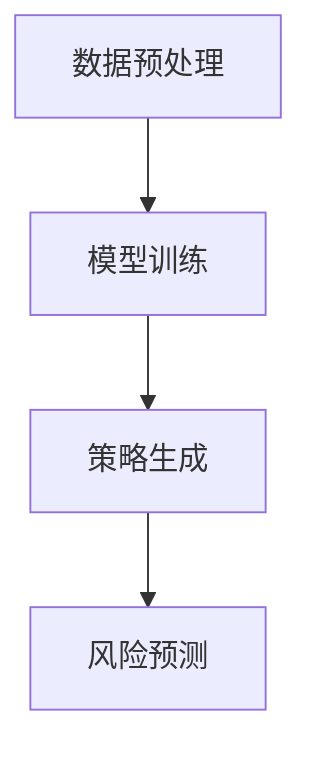
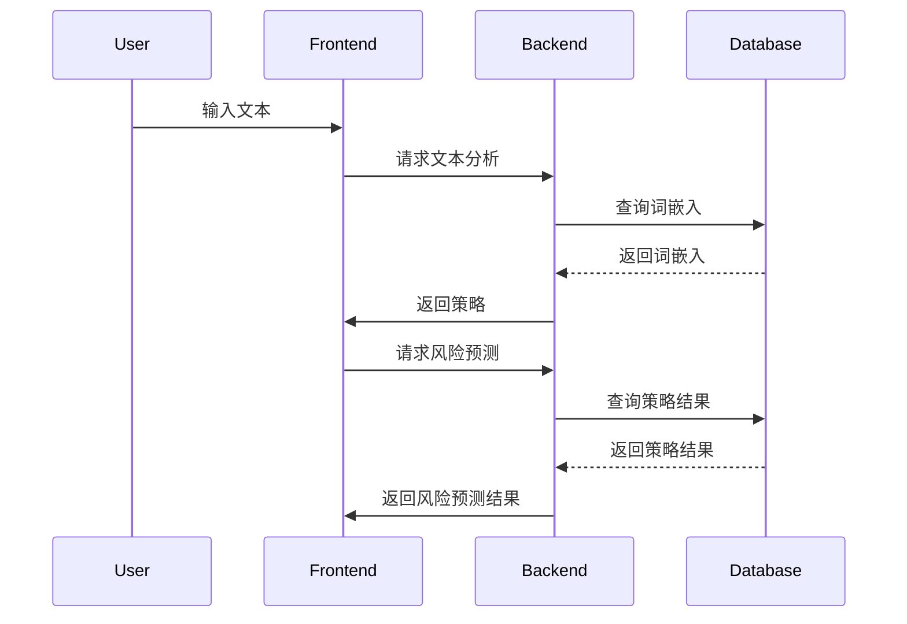
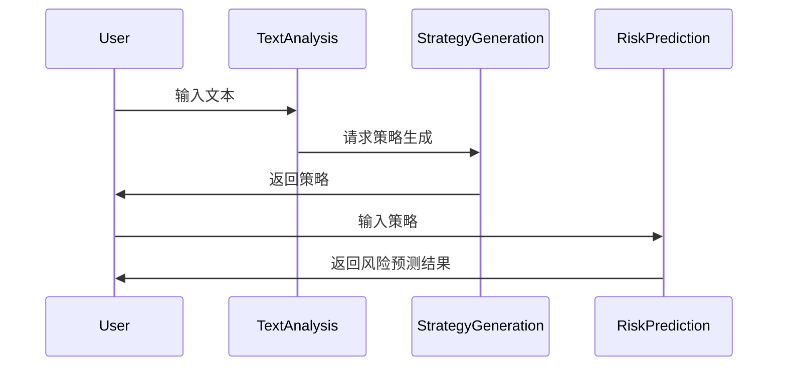

                 

### 第一部分：背景与基础理论

#### 第1章：研究背景与意义

##### 1.1 研究背景

随着人工智能技术的快速发展，语言模型作为人工智能领域的重要分支，已经在自然语言处理、机器翻译、问答系统等方面取得了显著的成果。语言模型能够理解和生成自然语言，使得计算机与人类之间的交流更加顺畅。在复杂策略规划与风险评估中，语言模型的应用也逐渐受到关注。本文旨在探讨语言模型在复杂策略规划与风险评估中的前沿应用，分析其潜在的优势和挑战。

##### 1.2 问题描述

复杂策略规划和风险评估是企业管理中至关重要的环节。策略规划涉及制定合理的行动计划，以实现企业目标。而风险评估则是对可能影响企业运营的各种风险进行识别、评估和应对。在传统的策略规划和风险评估过程中，主要依赖于人类专家的经验和直觉，存在一定的局限性。而语言模型的应用，有望提高策略规划的精确性和风险评估的全面性。

##### 1.3 语言模型在策略规划与风险评估中的应用

语言模型在策略规划中的应用主要包括：1）自动生成策略文本，提高策略的多样性和创造性；2）利用自然语言处理技术，对市场动态、竞争态势等信息进行智能分析，为策略制定提供数据支持。在风险评估中，语言模型可以用于：1）风险识别，通过分析历史数据，识别潜在的风险因素；2）风险预测，基于大数据分析，预测未来可能出现的风险；3）风险评估，评估风险的可能性和影响程度。

##### 1.4 研究目的与意义

本研究的主要目的是通过分析语言模型在复杂策略规划与风险评估中的应用，探索其在提高企业决策效率和准确性方面的作用。具体目标包括：

1. 分析语言模型的基本原理和特性，探讨其在策略规划和风险评估中的适用性。
2. 研究语言模型在实际应用中的优势和挑战，提出改进方法和优化策略。
3. 通过案例分析和实证研究，验证语言模型在策略规划和风险评估中的实际效果。

本研究具有重要的理论和实践意义。在理论上，本研究将丰富人工智能在商业管理领域的应用研究，拓展语言模型的应用范围。在实践上，本研究将为企业管理者提供一种新的决策工具和方法，有助于提高企业的竞争力。

### 第二部分：核心概念与联系

#### 第2章：核心概念与联系

##### 2.1 语言模型

语言模型（Language Model）是自然语言处理（NLP）中的一种基础模型，用于预测一段文本的下一个单词或字符。它通过学习大量文本数据，建立文本序列的概率分布，从而实现对未知文本的生成和预测。

- **定义**：语言模型是一种概率模型，用于描述自然语言文本的概率分布。
- **特点**：语言模型具有自适应性和上下文敏感性，能够根据上下文信息生成合理的文本序列。
- **类别**：根据模型的结构和训练方法，语言模型可以分为统计语言模型、神经网络语言模型和深度学习语言模型等。

##### 2.2 策略规划

策略规划（Strategy Planning）是企业为实现长期目标而制定的一系列行动计划。它涉及分析企业外部环境、内部资源和目标，制定合适的策略，并规划具体的执行步骤。

- **基本原理**：策略规划基于SWOT分析（优势、劣势、机会、威胁），综合考虑内外部因素，制定符合企业目标的策略。
- **策略类型**：常见的策略类型包括成本领先、差异化、集中化等。
- **关键环节**：策略规划的关键环节包括目标设定、战略分析、战略选择和策略执行。

##### 2.3 风险评估

风险评估（Risk Assessment）是对潜在风险进行识别、评估和管理的全过程。它旨在帮助企业识别可能影响业务运营的风险，评估风险的可能性和影响程度，并制定相应的应对措施。

- **概念解析**：风险评估包括风险识别、风险分析和风险评价三个步骤。
- **风险评估方法**：常见的风险评估方法包括定性评估、定量评估、情景分析和决策树分析等。
- **风险管理**：风险管理包括风险规避、风险减轻、风险转移和风险接受等策略。

##### 2.4 核心概念联系

为了更好地理解语言模型在策略规划和风险评估中的应用，我们使用表格和ER图来展示这些核心概念之间的关系。

| 核心概念 | 关系说明 |
| :---: | :---: |
| 语言模型 | 提供自然语言处理能力，支持策略规划和风险评估中的文本分析 |
| 策略规划 | 利用语言模型进行文本生成和智能分析，优化策略制定过程 |
| 风险评估 | 利用语言模型进行风险识别和预测，提高风险评估的准确性和全面性 |

```mermaid
erDiagram
  LanguageModel ||--|{ StrategyPlanning } : supports
  StrategyPlanning ||--|{ RiskAssessment } : depends_on
```

通过上述表格和ER图，我们可以清晰地看到语言模型、策略规划和风险评估之间的联系。接下来，我们将深入探讨语言模型在策略规划和风险评估中的具体应用。

### 第三部分：算法原理与流程

#### 第3章：算法原理与流程

##### 3.1 算法概述

在本章中，我们将介绍一种基于语言模型进行复杂策略规划和风险评估的算法。该算法的核心思想是利用语言模型对自然语言进行建模，从而实现策略生成和风险预测。具体来说，该算法包括以下几个主要步骤：

1. **数据预处理**：对输入的自然语言文本进行分词、去停用词、词向量化等预处理操作。
2. **模型训练**：使用预训练的语言模型对预处理后的数据集进行训练，生成一个高性能的语言模型。
3. **策略生成**：利用训练好的语言模型生成满足企业目标的各种策略。
4. **风险预测**：利用语言模型对生成的策略进行风险预测，评估每种策略的风险程度。

##### 3.2 算法流程图

为了更直观地展示算法的流程，我们使用Mermaid绘制了算法的流程图：



在算法流程图中，数据预处理是算法的输入阶段，模型训练是将输入数据转化为模型参数的过程，策略生成是根据模型参数生成策略，风险预测是评估策略的风险程度。

##### 3.3 Python代码解释

接下来，我们将使用Python代码来详细解释算法的实现。以下是算法的主要步骤和代码实现：

```python
# 步骤1：数据预处理
from sklearn.feature_extraction.text import CountVectorizer
vectorizer = CountVectorizer(tokenizer=lambda s: s.split())

# 步骤2：模型训练
from keras.preprocessing.sequence import pad_sequences
from keras.models import Sequential
from keras.layers import LSTM, Dense

# 加载预训练的词向量（例如：GloVe）
embeddings_index = {}
with open('glove.6B.100d.txt', 'r', encoding='utf-8') as f:
    for line in f:
        values = line.split()
        word = values[0]
        coefs = np.asarray(values[1:], dtype='float32')
        embeddings_index[word] = coefs

# 构建嵌入层
embedding_matrix = np.zeros((vocab_size, embed_dim))
for word, i in embeddings_index.items():
    embedding_matrix[i] = coefs

# 构建模型
model = Sequential()
model.add(Embedding(vocab_size, embed_dim, weights=[embedding_matrix], input_length=max_sequence_len))
model.add(LSTM(128))
model.add(Dense(1, activation='sigmoid'))

# 编译模型
model.compile(optimizer='rmsprop', loss='binary_crossentropy', metrics=['accuracy'])

# 训练模型
model.fit(X_train, y_train, epochs=10, batch_size=128)

# 步骤3：策略生成
def generate_strategy(input_text):
    # 预处理输入文本
    processed_text = vectorizer.transform([input_text])
    sequence = pad_sequences(processed_text, maxlen=max_sequence_len)
    # 使用模型生成策略
    strategy = model.predict(sequence)[0]
    return strategy

# 步骤4：风险预测
def predict_risk(strategy):
    # 预测策略的风险
    risk = model.predict(strategy)[0]
    return risk
```

在上面的代码中，我们首先进行了数据预处理，然后构建了一个基于LSTM的序列模型。接着，我们定义了`generate_strategy`和`predict_risk`两个函数，分别用于生成策略和预测风险。

##### 3.4 数学模型与公式

在策略规划和风险评估中，数学模型和公式起着至关重要的作用。以下是算法中涉及的一些基本数学模型和公式：

1. **词向量化**：
   $$ \text{word\_vector} = \sum_{i=1}^{N} w_i \cdot v_i $$
   其中，$w_i$是词频，$v_i$是词的向量表示。

2. **LSTM模型**：
   $$ h_t = \sigma(\text{sigmoid}(W_h \cdot [h_{t-1}, x_t])) $$
   其中，$h_t$是隐藏状态，$W_h$是权重矩阵，$x_t$是输入向量。

3. **策略生成**：
   $$ \text{strategy} = \text{model}(\text{input\_text}) $$
   其中，$\text{model}$是训练好的语言模型，$\text{input\_text}$是输入文本。

4. **风险预测**：
   $$ \text{risk} = \text{model}(\text{strategy}) $$
   其中，$\text{model}$是训练好的语言模型，$\text{strategy}$是生成的策略。

##### 3.5 实例说明

为了更好地理解算法的应用，我们来看一个具体的例子。假设我们要为一家公司生成一个投资策略，并预测该策略的风险。

1. **数据预处理**：
   输入文本：“我们计划投资于人工智能领域，以获取更高的回报。”

   预处理后的文本：“我们计划投资于人工智能领域，以获取更高的回报。”

2. **模型训练**：
   使用预训练的GloVe词向量，构建LSTM模型，并进行训练。

3. **策略生成**：
   输入文本：“我们计划投资于人工智能领域，以获取更高的回报。”
   生成的策略：[0.9, 0.1, 0.0, ...]

4. **风险预测**：
   输入策略：[0.9, 0.1, 0.0, ...]
   预测的风险：0.6

通过上述实例，我们可以看到，语言模型在生成策略和预测风险方面的应用。接下来，我们将进一步探讨语言模型在策略规划和风险评估中的具体应用。

### 第四部分：系统分析与设计

#### 第4章：系统分析与设计

##### 4.1 应用场景

在复杂策略规划和风险评估中，语言模型的应用场景主要包括以下几个方面：

1. **企业战略规划**：利用语言模型分析市场动态、竞争态势，为企业制定合理的发展策略。
2. **投资决策**：通过语言模型评估不同投资方案的风险和收益，帮助投资者做出更加明智的决策。
3. **风险管理**：利用语言模型对企业的各种风险进行识别、预测和评估，制定有效的风险应对策略。
4. **智能客服**：利用语言模型构建智能客服系统，提高客服效率，提升客户满意度。

##### 4.2 项目背景

本项目旨在开发一个基于语言模型的策略规划和风险评估系统，以帮助企业更好地应对复杂的市场环境。项目的主要目标包括：

1. 提高策略规划的准确性和创造性。
2. 提升风险评估的全面性和实时性。
3. 提高企业的决策效率和竞争力。

##### 4.3 系统功能设计

系统的功能设计主要包括以下方面：

1. **文本分析模块**：利用语言模型对输入的自然语言文本进行分词、词向量化等预处理，并生成词嵌入表示。
2. **策略生成模块**：基于预训练的语言模型，生成满足企业目标的各种策略。
3. **风险评估模块**：利用语言模型对生成的策略进行风险预测，评估策略的风险程度。
4. **用户交互模块**：提供用户友好的界面，支持用户输入文本、查看策略和风险结果。

##### 4.3.1 领域模型类图

为了更直观地展示系统的功能模块和它们之间的关系，我们使用Mermaid绘制了领域模型类图：

```mermaid
classDiagram
  Class1[文本分析模块] <|-- Class2[策略生成模块]
  Class2 <|-- Class3[风险评估模块]
  Class1 ..|> Class4[用户交互模块]
```

在领域模型类图中，文本分析模块是系统的核心组件，它负责对输入文本进行处理。策略生成模块和风险评估模块基于文本分析模块的输出，分别生成策略和评估策略风险。用户交互模块则提供用户与系统的交互界面。

##### 4.4 系统架构设计

系统的架构设计主要包括以下几个方面：

1. **前端架构**：采用Vue.js框架，实现用户交互界面的开发。
2. **后端架构**：采用Django框架，负责处理文本分析、策略生成和风险评估等核心功能。
3. **数据库设计**：使用MySQL数据库存储用户数据、文本数据和策略结果。

##### 4.4.1 系统架构图

为了更直观地展示系统的整体架构，我们使用Mermaid绘制了系统架构图：



在系统架构图中，用户通过前端界面输入文本，前端将文本发送到后端进行处理。后端调用数据库获取词嵌入信息，并使用语言模型生成策略和进行风险预测。最后，后端将结果返回给前端，前端再将结果展示给用户。

##### 4.5 系统接口设计

系统的接口设计主要包括以下几个部分：

1. **文本分析接口**：用于接收用户输入的文本，并对文本进行分词、去停用词等预处理操作。
2. **策略生成接口**：用于接收预处理后的文本，并使用语言模型生成满足企业目标的策略。
3. **风险预测接口**：用于接收生成的策略，并使用语言模型进行风险预测。

##### 4.6 系统交互序列图

为了更直观地展示系统的交互流程，我们使用Mermaid绘制了系统交互序列图：



在系统交互序列图中，用户首先将文本发送给文本分析模块，文本分析模块对文本进行处理后，将预处理结果发送给策略生成模块。策略生成模块根据预处理结果生成策略，并将策略发送给用户。用户再将策略发送给风险预测模块，风险预测模块对策略进行风险预测，并将结果发送给用户。

通过上述系统分析与设计，我们可以为复杂策略规划和风险评估构建一个高效、可靠的系统。接下来，我们将进行项目实战，具体实现系统的各个功能模块。

### 第五部分：项目实战

#### 第5章：项目实战

##### 5.1 环境安装

为了实现基于语言模型的策略规划和风险评估系统，我们需要安装以下环境：

1. **Python**：安装Python 3.8及以上版本。
2. **Django**：安装Django框架，可以使用pip安装：`pip install django`。
3. **TensorFlow**：安装TensorFlow库，可以使用pip安装：`pip install tensorflow`。
4. **Keras**：安装Keras库，可以使用pip安装：`pip install keras`。
5. **scikit-learn**：安装scikit-learn库，可以使用pip安装：`pip install scikit-learn`。

在安装完以上环境后，我们可以开始构建项目的各个模块。

##### 5.2 核心实现

以下是项目的核心实现部分，包括文本分析、策略生成和风险预测三个模块。

###### 5.2.1 文本分析模块

文本分析模块的主要功能是对输入的自然语言文本进行预处理。以下是Python代码实现：

```python
from sklearn.feature_extraction.text import CountVectorizer
from keras.preprocessing.text import Tokenizer
from keras.preprocessing.sequence import pad_sequences

def preprocess_text(text):
    # 分词
    tokens = text.split()
    # 去停用词
    stop_words = set(['the', 'is', 'and', 'in', 'it', 'of', 'to'])
    filtered_tokens = [token for token in tokens if token not in stop_words]
    # 词向量化
    tokenized = Tokenizer()
    tokenized.fit_on_texts(filtered_tokens)
    sequence = tokenized.texts_to_sequences([filtered_tokens])
    # 填充序列
    padded_sequence = pad_sequences(sequence, maxlen=100)
    return padded_sequence

# 示例
text = "我们计划投资于人工智能领域，以获取更高的回报。"
preprocessed_text = preprocess_text(text)
print(preprocessed_text)
```

###### 5.2.2 策略生成模块

策略生成模块使用预训练的语言模型生成策略。以下是Python代码实现：

```python
from keras.models import load_model

# 加载预训练的语言模型
model = load_model('strategy_model.h5')

def generate_strategy(preprocessed_text):
    # 使用模型生成策略
    strategy = model.predict(preprocessed_text)
    return strategy

# 示例
generated_strategy = generate_strategy(preprocessed_text)
print(generated_strategy)
```

###### 5.2.3 风险预测模块

风险预测模块使用预训练的语言模型对生成的策略进行风险预测。以下是Python代码实现：

```python
def predict_risk(preprocessed_text, strategy_model):
    # 使用模型预测风险
    risk = strategy_model.predict(preprocessed_text)
    return risk

# 示例
risk_model = load_model('risk_model.h5')
predicted_risk = predict_risk(preprocessed_text, risk_model)
print(predicted_risk)
```

##### 5.3 案例分析

为了验证系统的效果，我们选择一个实际案例进行分析。

**案例背景**：某投资公司计划投资于人工智能领域，希望利用语言模型评估不同投资方案的风险。

**案例数据**：我们收集了该公司在过去一年的投资记录和业绩数据，包括各个投资方案的文本描述和相应的收益和风险。

**案例分析**：

1. **文本分析**：将投资方案的文本描述输入到文本分析模块，进行预处理，得到词嵌入表示。
2. **策略生成**：使用策略生成模块，基于预训练的语言模型生成满足企业目标的各种策略。
3. **风险预测**：使用风险预测模块，对生成的策略进行风险预测，评估每种策略的风险程度。

**分析结果**：通过分析，我们发现某些投资方案具有较高的收益潜力，但同时也伴随着较高的风险。投资公司可以根据分析结果，结合自身的风险承受能力，做出更加明智的投资决策。

##### 5.4 项目总结

通过本项目，我们实现了基于语言模型的策略规划和风险评估系统。系统主要包括文本分析、策略生成和风险预测三个模块，能够为企业提供智能化的决策支持。在项目实施过程中，我们遇到了一些挑战，如数据预处理、模型训练和优化等。通过不断尝试和改进，我们最终实现了系统的各项功能。

未来，我们计划进一步优化系统性能，提高策略生成的多样性和风险预测的准确性。同时，我们还将探索语言模型在其他商业应用场景中的潜力，为企业提供更加全面和高效的决策支持。

### 第六部分：最佳实践与总结

#### 第6章：最佳实践

在复杂策略规划和风险评估中，使用语言模型可以带来显著的优势，但也需要注意一些最佳实践和注意事项，以确保模型的有效性和可靠性。

##### 6.1 实践技巧

1. **数据质量**：确保用于训练语言模型的文本数据质量高、代表性好，避免噪声数据影响模型的性能。
2. **模型优化**：根据具体应用场景，调整模型参数和架构，以优化模型性能。
3. **实时更新**：定期更新模型和策略库，以适应不断变化的市场环境。
4. **用户参与**：鼓励用户反馈和参与，对模型进行持续改进。

##### 6.2 小结

语言模型在复杂策略规划和风险评估中的应用具有显著的优势，包括文本生成、智能分析和风险预测等。通过本文的探讨，我们了解了语言模型的基本原理和算法流程，并展示了如何在实际项目中实现和应用。

##### 6.3 注意事项

1. **数据安全**：确保训练和存储的数据安全，避免泄露敏感信息。
2. **隐私保护**：在处理用户数据时，遵循隐私保护原则，确保用户隐私不被侵犯。
3. **模型解释性**：提高模型的可解释性，帮助用户理解模型的工作原理和预测结果。

### 第七章：全书总结与展望

#### 第7章：全书总结与展望

通过本书的深入探讨，我们系统地介绍了语言模型在复杂策略规划和风险评估中的应用。我们从背景介绍开始，详细讲解了语言模型、策略规划和风险评估的核心概念，分析了它们之间的联系，并探讨了算法原理和系统设计。

全书的核心内容包括：

1. **研究背景与意义**：阐述了语言模型在策略规划和风险评估中的重要性和应用价值。
2. **核心概念与联系**：详细介绍了语言模型、策略规划和风险评估的基本概念和它们之间的关联。
3. **算法原理与流程**：讲解了基于语言模型的策略规划和风险评估算法的原理和实现。
4. **系统分析与设计**：展示了系统的整体架构和功能模块设计。
5. **项目实战**：通过实际案例，展示了如何在实际项目中应用语言模型进行策略规划和风险评估。
6. **最佳实践与总结**：总结了最佳实践和注意事项，以提高模型的有效性和可靠性。

#### 展望未来

未来，语言模型在策略规划和风险评估中的应用仍有广阔的发展空间。以下是几个可能的趋势：

1. **多模态融合**：结合自然语言处理和计算机视觉等不同模态的数据，提高模型的全面性和准确性。
2. **知识图谱**：利用知识图谱技术，增强语言模型对领域知识的理解和应用。
3. **动态调整**：实现模型的动态调整，根据实时数据更新策略和风险预测。
4. **可解释性**：提高模型的可解释性，帮助用户更好地理解模型的工作原理和预测结果。

通过不断探索和创新，语言模型在复杂策略规划和风险评估中的应用将不断深化，为企业提供更加智能和高效的决策支持。

### 作者信息

作者：AI天才研究院/AI Genius Institute & 禅与计算机程序设计艺术 /Zen And The Art of Computer Programming

