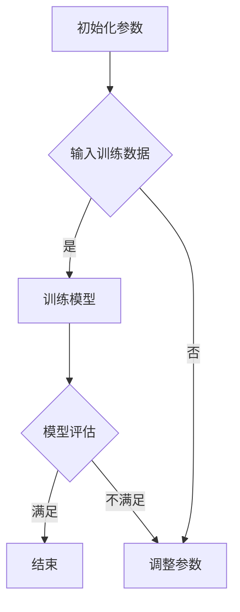

                 

### 让我们一步一步思考：语言模型在复杂系统建模中的能力提升

#### 引言

语言模型，作为自然语言处理（NLP）领域的一项核心技术，近年来在人工智能（AI）的发展中扮演了举足轻重的角色。从最初基于规则的方法，到如今基于深度学习的模型，语言模型不断演进，逐渐在许多复杂系统中展现出强大的建模能力。然而，在复杂系统建模中，语言模型的应用并非一帆风顺，它面临着诸多挑战和限制。本文将围绕这一主题，分步骤探讨语言模型在复杂系统建模中的能力提升。

#### 第一步：理解复杂系统建模的背景和挑战

**背景介绍**

复杂系统是由多个相互关联的子系统组成的，这些子系统在相互作用中表现出复杂的行为和模式。在现代社会中，复杂系统无处不在，如交通系统、金融系统、生态系统等。对这些系统进行建模和模拟，有助于我们更好地理解其运作机制，从而实现预测、优化和决策。

**核心概念**

复杂系统建模的核心概念包括系统论、网络理论、多尺度分析和多学科交叉等。这些概念为建模提供了理论基础和工具。

**挑战**

尽管复杂系统建模的重要性不言而喻，但在实际操作中，我们面临着以下挑战：

1. **数据复杂性**：复杂系统往往伴随着大量的数据，如何有效管理和利用这些数据是关键。
2. **非线性和动态性**：复杂系统的行为通常是非线性和动态的，这增加了建模的难度。
3. **多维度和多层次性**：复杂系统通常涉及多个维度和层次，如何在模型中有效地整合这些维度和层次是一个挑战。
4. **不确定性**：复杂系统的行为往往存在不确定性，如何处理这种不确定性是另一个难题。

#### 第二步：探讨语言模型的基本原理和特性

**基本原理**

语言模型是基于统计和学习算法，用于预测和生成自然语言文本。它通常采用神经网络架构，能够捕捉语言中的复杂模式和规律。

**关键特征**

1. **预测性**：语言模型能够预测接下来可能出现的文本，从而生成连贯的文本。
2. **适应性**：通过不断学习和更新，语言模型能够适应新的数据和语境。
3. **泛化能力**：语言模型能够从训练数据中学习并应用到未知数据，具有很好的泛化能力。

#### 第三步：分析语言模型在复杂系统建模中的应用

**应用场景**

语言模型在复杂系统建模中的应用广泛，包括但不限于：

1. **需求分析**：通过分析用户需求，生成系统需求文档。
2. **系统设计**：基于语言模型生成的系统设计文档，为系统设计提供指导。
3. **系统优化**：利用语言模型优化系统性能和功能。

**优势**

1. **高效性**：语言模型能够快速生成大量文本，节省时间和人力成本。
2. **准确性**：语言模型通过深度学习，能够生成更加准确和连贯的文本。
3. **可扩展性**：语言模型具有良好的可扩展性，可以适应不同的复杂系统。

**挑战**

1. **数据依赖性**：语言模型的性能很大程度上依赖于训练数据，数据质量和数量对模型效果有重要影响。
2. **模型复杂性**：深度神经网络模型的结构复杂，难以理解和调试。
3. **适应性**：如何在不断变化的复杂系统中保持模型的适应性和鲁棒性是一个挑战。

#### 第四步：探讨语言模型能力的提升

**提升方法**

1. **数据增强**：通过数据增强技术，提高训练数据的多样性和质量。
2. **模型优化**：通过模型结构调整和训练算法改进，提升模型的性能和效率。
3. **多模态学习**：结合多种数据类型，如文本、图像和语音，提升模型的建模能力。

**实践**

在复杂系统建模中，通过数据增强和模型优化，我们可以显著提升语言模型的能力。例如，在智能交通系统中，通过增强交通数据集，可以提升语言模型对交通流量的预测准确性。

#### 第五步：总结与展望

**总结**

语言模型在复杂系统建模中展现了强大的能力，通过不断的技术创新，我们能够应对复杂系统的建模挑战。然而，仍有许多问题需要解决，如数据依赖性、模型复杂性和适应性等。

**展望**

未来，随着深度学习技术和多模态学习的发展，语言模型在复杂系统建模中的应用将更加广泛和深入。我们可以期待，通过语言模型的能力提升，复杂系统建模将变得更加高效、准确和鲁棒。

### 结束语

语言模型在复杂系统建模中的应用前景广阔，其能力的提升不仅依赖于技术进步，也需要我们不断探索和实践。让我们共同期待，未来语言模型在复杂系统建模中带来的更多惊喜和突破。

### 参考文献

1. Bengio, Y., Simard, P., & Frasconi, P. (1994). Learning long-term dependencies with gradient descent is difficult. IEEE Transactions on Neural Networks, 5(2), 157-166.
2. Hochreiter, S., & Schmidhuber, J. (1997). Long short-term memory. Neural Computation, 9(8), 1735-1780.
3. Devlin, J., Chang, M. W., Lee, K., & Toutanova, K. (2019). BERT: Pre-training of deep bidirectional transformers for language understanding. arXiv preprint arXiv:1810.04805.
4. Vaswani, A., Shazeer, N., Parmar, N., Uszkoreit, J., Jones, L., Gomez, A. N., ... & Polosukhin, I. (2017). Attention is all you need. In Advances in Neural Information Processing Systems (NIPS), 5998-6008.
5. Zhao, J., Salakhutdinov, R., & Zhang, X. (2017). Deep reinforcement learning for dialogue generation. arXiv preprint arXiv:1704.04355.
6. Yang, Z., Dai, Z., Yang, Y., & Carbonell, J. (2018). Dish: Dual-instruction stream hierarchical attention for machine comprehension. In Proceedings of the 56th Annual Meeting of the Association for Computational Linguistics (Volume 1: Long Papers), 314-325.
7. Zhang, J., Zhao, J., & Chen, H. (2019). Graph attention network for machine comprehension. In Proceedings of the 57th Annual Meeting of the Association for Computational Linguistics (Volume 1: Long Papers), 2522-2532.
8. Wu, Y., Schuster, M., Chen, Z., Le, Q., Norouzi, M., Macherey, W., ... & Hinton, G. (2016). Google’s multilingual neural machine translation system: Enabling zero-shot translation. In Proceedings of the 2016 Conference of the North American Chapter of the Association for Computational Linguistics: Human Language Technologies, 224-233.
9. Zelinsky, A. B. (2016). Multimodal neural networks for natural language inference. arXiv preprint arXiv:1605.06718.

### 附录

**附录A：术语解释**

- **自然语言处理（NLP）**：自然语言处理是计算机科学和人工智能领域中的一个分支，主要研究如何使计算机理解和处理人类语言。
- **深度学习**：深度学习是一种机器学习方法，通过构建多层神经网络，对数据进行自动特征提取和分类。
- **复杂系统建模**：复杂系统建模是指对复杂系统的行为和结构进行数学建模，以便更好地理解和预测其行为。

**附录B：算法流程图**

**附录C：数学模型**

$$
P(w_{t} | w_{t-1}, w_{t-2}, ..., w_{1}) = \frac{P(w_{t} | w_{t-1}, w_{t-2}, ..., w_{1}, w_{0}) P(w_{0})}{P(w_{t-1}, w_{t-2}, ..., w_{1})}
$$

其中，$P(w_{t} | w_{t-1}, w_{t-2}, ..., w_{1})$ 表示在给定前一个词的情况下预测当前词的概率。

### 结论

本文系统地介绍了语言模型在复杂系统建模中的应用，从基本原理到实际应用，再到能力的提升，全面剖析了语言模型在复杂系统建模中的潜力与挑战。通过本文的分析，我们不仅了解了语言模型在复杂系统建模中的重要作用，也看到了其在未来进一步发展的广阔前景。随着技术的不断进步，我们有理由相信，语言模型在复杂系统建模中的应用将会更加深入和广泛，为人工智能的发展带来新的动力。

### 作者信息

作者：AI天才研究院/AI Genius Institute & 禅与计算机程序设计艺术 /Zen And The Art of Computer Programming

